## Prerequisites  
 - You've opened your SAP Cloud Platform subaccount.
 - You've opened the `Portal Service` and navigated to the Site Directory where your `Supplier Portal` site that you created is located. For more information, see [Create a Portal freestyle site](http://developers.sap.com/group.cp-portal-freestyle-site.html).

## Details
To translate the content of your Portal freestyle site, the overall process is as follows. You download the string files of your content into a zip file and send it to a translator (or you can access the **Translation Hub** service and do it yourself). Once the files are translated, you import the translated zip files back into your Portal site and enable the translated languages so that end users can select the language that they want to work in.
In this tutorial, we will show you how to do this.

>Note that these steps are carried out using the Supplier Portal site that you created in a previous tutorial.  However you can do these steps on any Portal site that you've created.

### You will learn  
 - How to download your site content for translation
 - How to translate the content yourself in the SAP Translation Hub (optional)
 - How to import and upload the translated content

[ACCORDION-BEGIN [Step 1: ](Download files for translation)]
In this step, you will download the content of the `Supplier Portal` site into a ZIP file.

>The files are downloaded into your `Downloads` folder.  For convenience sake, in your `Downloads` folder, you may want to create a new folder called `TRANSLATIONS` and store your files there so that they are easy to find when you need to upload them again.

1. From the Site Directory select the `Supplier Portal` site and click **Edit** to open it in the Portal Site Designer.

    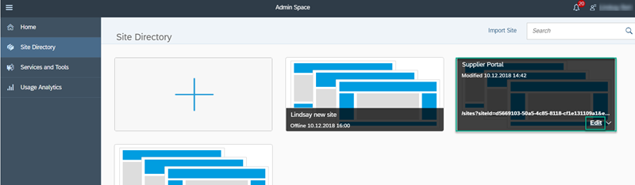

2. From the left side panel, click **Services and Tools**.

    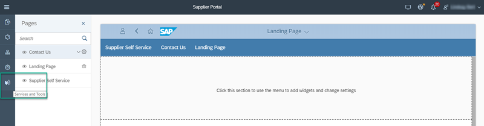

3. Select the **Translations Manager** tile and click **Configure** to open the UI of the **Translations Manager**.

    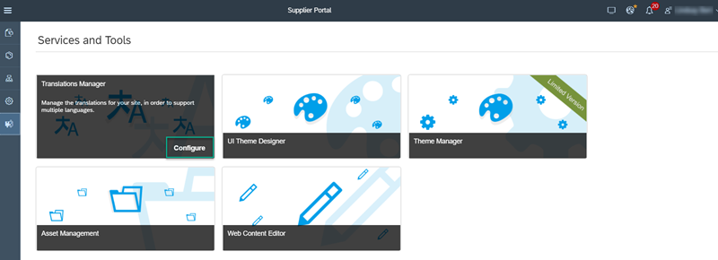

4. Under **Translation Files** click **Download**.

    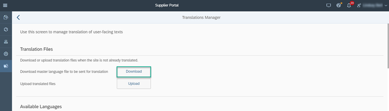

    > You are downloading the site's content in the master language (English).

5. Select the `master_Language_<date>.zip` file that appears at the bottom of the screen and open it using the options menu.

    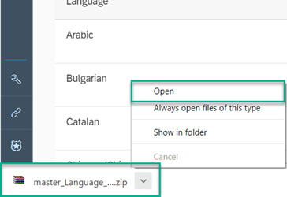

    >You can now see the following files in the `master_Language_<date>.zip` file.

    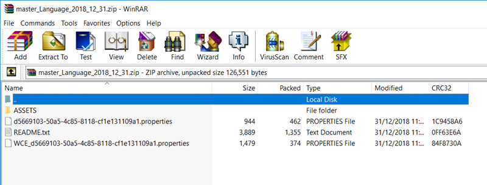

    Here's an explanation about the files that you've downloaded:

    &nbsp;

    | File  | Description |
    |-----|----------|
    | `ASSETS` | A folder that includes all the site's assets such as images, HTML files, and so on.  |
    | `<siteId>.properties`  Example: `d5669103-50a5-4c85-8118-cf1e131109a1.properties` | A properties file with the site's source strings such as text strings for menu items. |
    | `README.txt` | A text file with explanations. |
    | `WCE_<siteId>.properties` 
 Example:
 `WCE_ d5669103-50a5-4c85-8118-cf1e131109a1.properties` | A properties file that includes any web content strings in the site (these files exist only if there are web content widgets used in the site). |

6. Select the `<siteId>.properties` file and the `WCE_<siteId>.properties` file and click **Extract To**.

    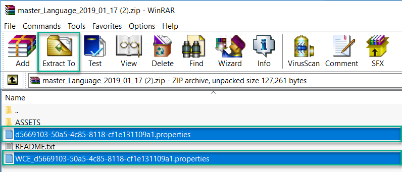

7. Extract the zip files into your **Downloads** folder and save it in the **Translation Files** folder that you created. It'll make it easier to find them afterwards when you need to upload them for translation.

    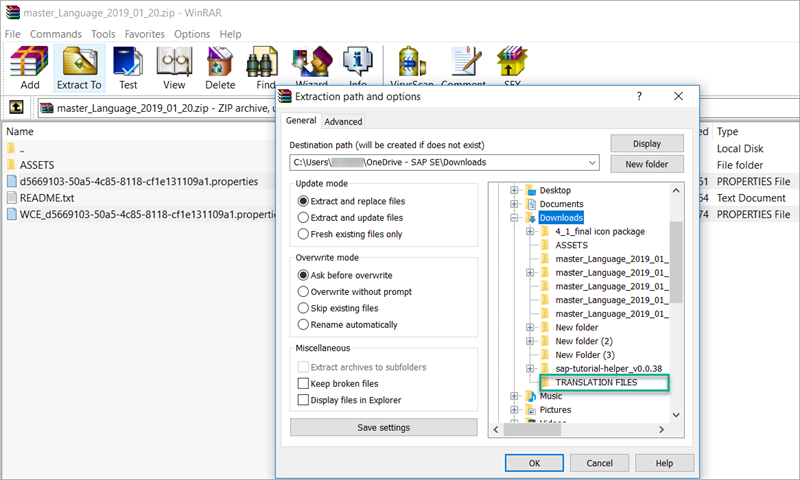

If you go up a level and look at your **Translation Files** folder, you'll see both your translation files like this:

  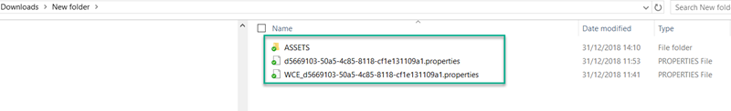

Your files are now ready for translation.

>At this stage you can send these files to your translator. They will then translate the files and when the translation is done, they will return the files to you for uploading back into your Portal site. In this case you will continue with Step 2 of this tutorial and then skip to steps 5 and 6.

>If you want to translate the files yourself using the **SAP Translation Hub** – a service of SAP Cloud Platform, skip Step 2 and continue with the rest of the tutorial (steps 3, 4, 5, and 6).

[DONE]
[ACCORDION-END]

[ACCORDION-BEGIN [Step 2: ](Prepare translated property files for upload)]

>This step is relevant only if you've sent your content files to a translator (in other words, you are not using the `SAP Translation Hub` to translate your site content).

When you get the translated files back from your translator, you receive them in the same format as when you sent the files to them like this:
`<siteId>.properties` and `WCE_<siteId>.properties`.

Before you can upload the translated files to your Portal site, you need to ensure that each translated file includes a language locale as a suffix. This suffix identifies the translated language.

1. If the files don't already include this suffix, rename the properties file that has been translated to German and add `de` as the suffix. Do the same with the properties file that has been translated to French - rename this one with `fr` in the suffix.

2. Now open the `master_Language_<date>.zip` file (that you downloaded in Step 1) and add the renamed property files to this zip file.

3. Do this for both the `<siteId>.properties` and `WCE_<siteId>.properties` files.

When you're done, this is how the files should look in your `master_Language_<date>.zip` file.

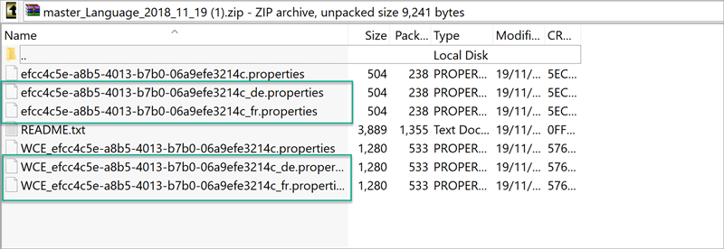

>Note that you have 3 files for each - one with the German translation `<siteId>_de.properties`, one with the French translation  `<siteId>_fr.properties`, and the original one that is already there and has not changed.

[DONE]
[ACCORDION-END]

[ACCORDION-BEGIN [Step 3: ](Open the SAP Translation Hub)]

To do this step, you need to go back to the SAP Cloud Platform cockpit where you can access the **SAP Translation Hub** service.

Let's start.

1. You're still in the **Translation Manager**.  To access the cockpit easily, click **Useful Tools** at the bottom of the left panel and choose **SAP Cloud Platform Cockpit**.

    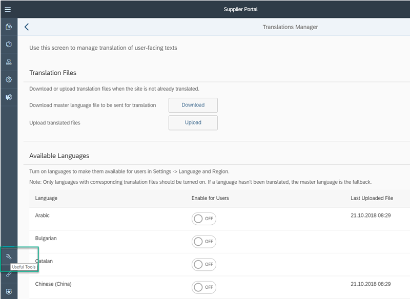

2. From the left side panel in the cockpit, click **Services**.

    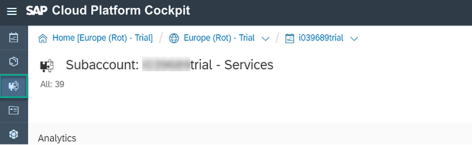

3. From the **Globalization** category, select the **SAP Translation Hub** tile.

    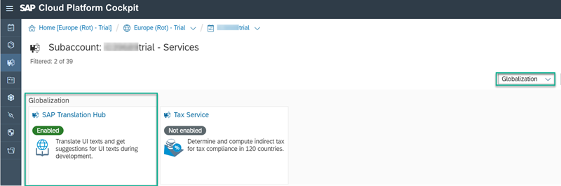

4. From the **SAP Translation Hub - Overview** page, click **Go to UI for Translation Workflow**.

    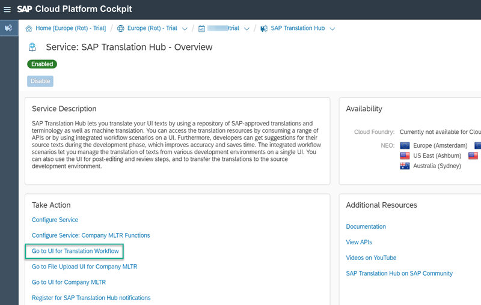

>The **SAP Translation Hub** user interface opens in a new browser tab.

[DONE]
[ACCORDION-END]

[ACCORDION-BEGIN [Step 4: ](Create your translation projects)]

In this step, you are going to create translation projects for the `.properties` files that you downloaded.

Let's start.

1. Click **+** at the footer of the **Translation Projects** list.

    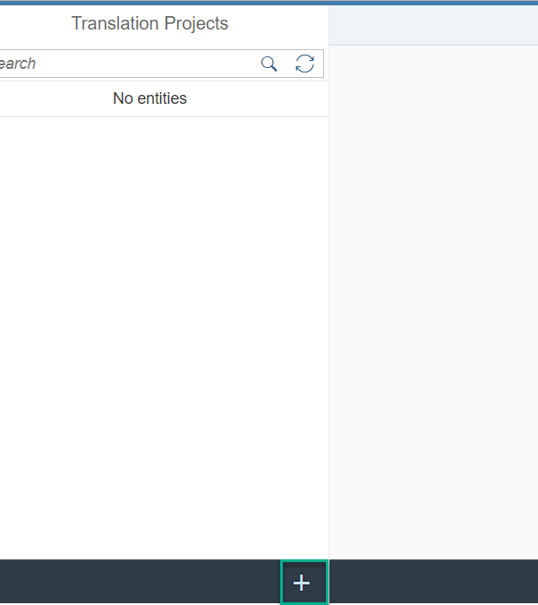

2. Click **File Upload**.

     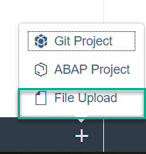

3. In the **File Upload Project Details** screen, enter the following values:

    | Property  | Value |
    |-----|----------|
    |**Project Name**| `Supplier Portal Site Texts`|
    |**File Type**| `Java Properties Files`|
    |**Source Language**| `English`|
    |**Target Languages**| select `German` and `French`

      This is how it looks on the screen.

      

4. Click **Save**.

    > The new **Translation Project** is created.

5. Click **Upload File** at the bottom right corner of the screen.

    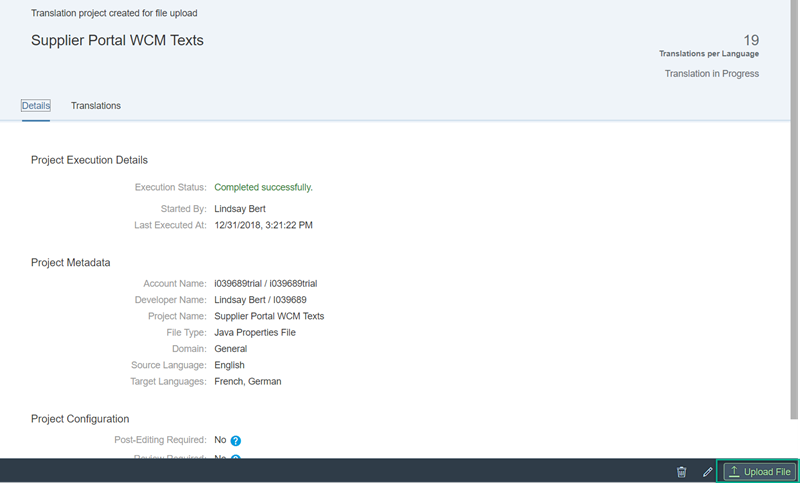

6. In the **File Upload** dialog click **Browse**.

    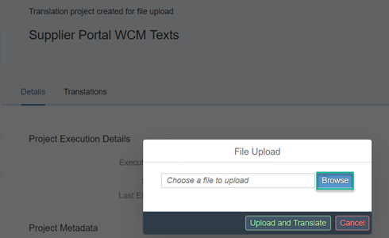

7. Navigate to the **Translation Files** folder where you saved your downloaded files and select the `<SITE_ID>.properties` file. Click **Open**.

    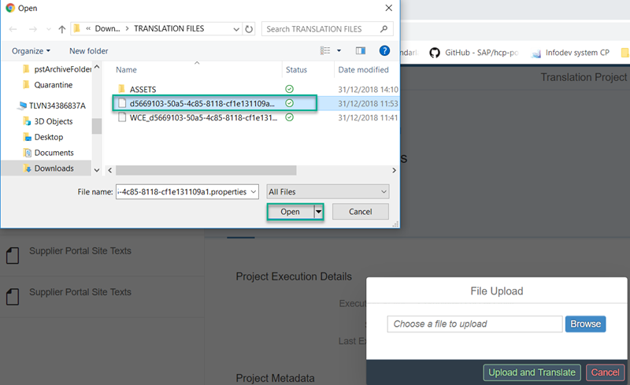

8. Click **Upload and Translate**. You will see that the translation process starts. Hang on until the progress bar shows that the translation process is done.

    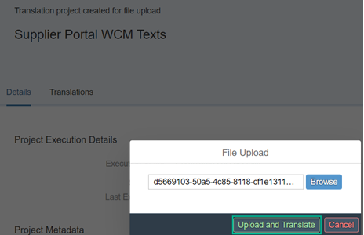

9. Once the translation process is complete, click the **Translations** tab that appears.

      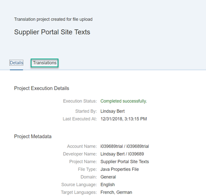

10. Click **Download Translations** at the bottom right of the screen.

    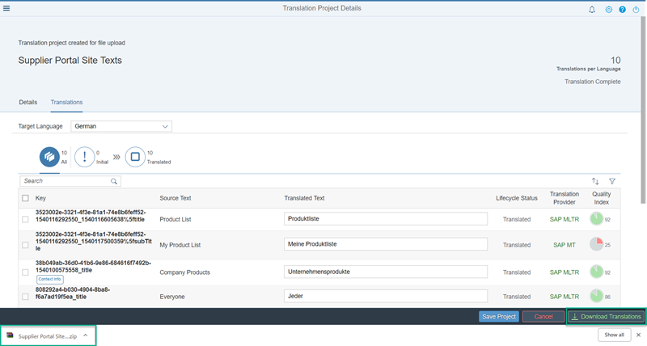

11. You can see your translation zip file at the bottom of the screen. Click **Open**.

    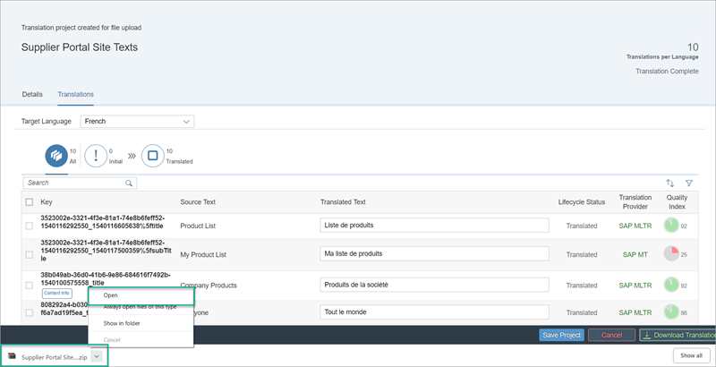

12. The `Supplier Portal Site Texts.zip` opens from your `Downloads` folder.

    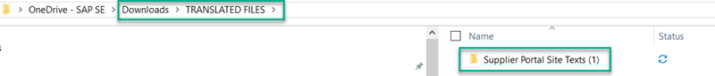

    >Note that you have two files - one in German and one in French.

13. Now you need to create another translation project for the web content properties file (`WCE_<SITE_ID>.properties`). To do this, repeat steps 1 to 12.  Name this project `Supplier Portal WCM Texts`. Select the same target languages as the first properties file, and then upload the `WCE_<SITE_ID>.properties` file.

    The result is:

    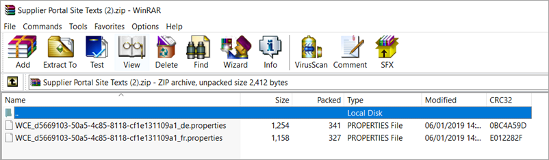

> You are now ready to upload your translated files to your Portal site. To do this, you need to go back to the Portal Site Designer and open the `Supplier Portal` site.

[DONE]
[ACCORDION-END]

[ACCORDION-BEGIN [Step 5: ](Upload translated content)]

In this step you will upload the translated files. Either the files that you received from your translator or those that you translated above in the **SAP Translation Hub**.

1. Go back to the **Portal Service**.

2. From the Site Directory, open your `Supplier Portal` site for editing.

3. Click **Services and Tools** and open the **Translations Manager**.

4. Under **Translation Files**, click **Upload**.

    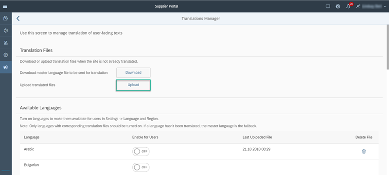

5. From your **Downloads** folder, select the `Supplier Portal Site Texts.zip` file. You will get a toast message to say that the upload was successful.

    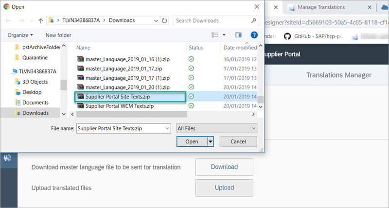

6. Then click **Upload** again to upload the `Supplier Portal Site WCM Texts.zip` file.

    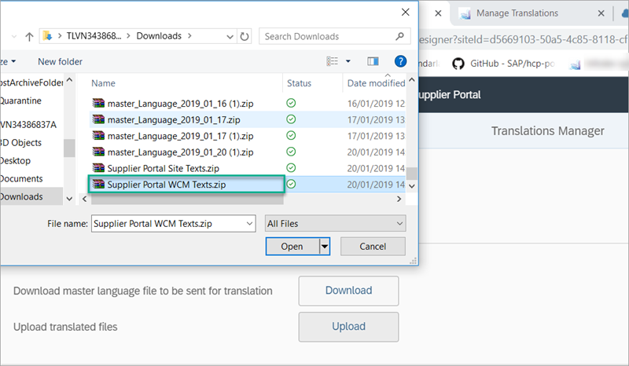

7. In the **Translations Manager** scroll down to the **Available Languages** section and turn on the `French` and `German` languages to activate them. Once activated, these languages will be available for end users of your site to select.

    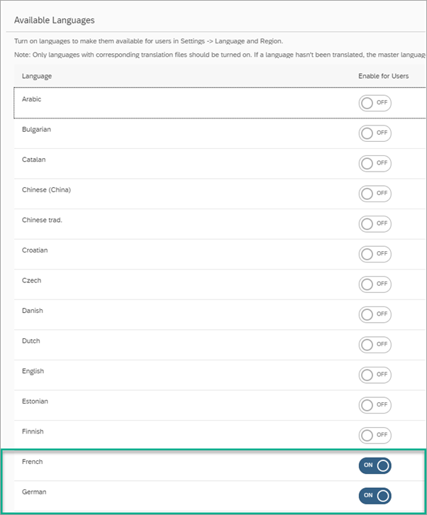

[DONE]
[ACCORDION-END]

[ACCORDION-BEGIN [Step 6: ](View Your Translated Site)]

Now you are going to publish the `Supplier Portal` with all your changes. Since you have uploaded the translated content in `French` and `German`, and since you have activated the `French` and `German` languages, end users will be able to select these languages in their `Supplier Portal` site.

Let's check this out.

1. In the top right corner of the `Supplier Portal` site, click **Publish** to publish the latest changes.

    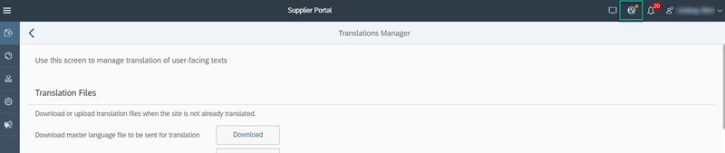

2. In the **Publish Site** dialog box, click **Publish and Open** to open the `Supplier Portal` site in the master language (English) in a new browser tab.

    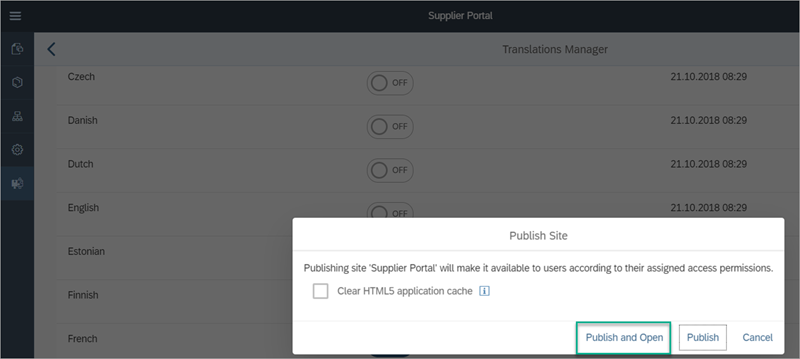

3. Click the `Me` icon on the left side of the top-level menu.

    

4. Click **Settings**.

    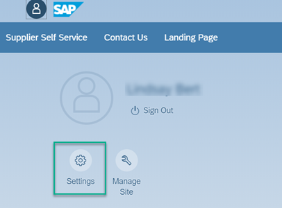

5. In the **Settings** dialog box, select **Language & Region**. Note that the languages `French` and `German` are in the dropdown list for selection.

    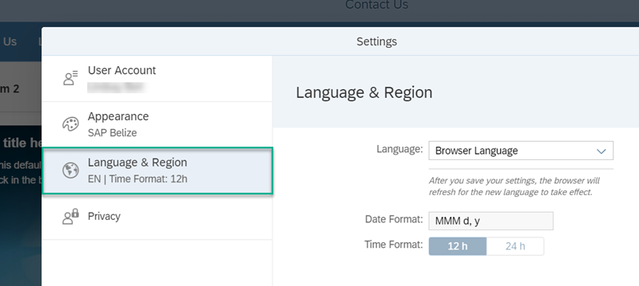

6. Select `French` and then **Save**. Note that the browser reloads in `French` and looks like this:

    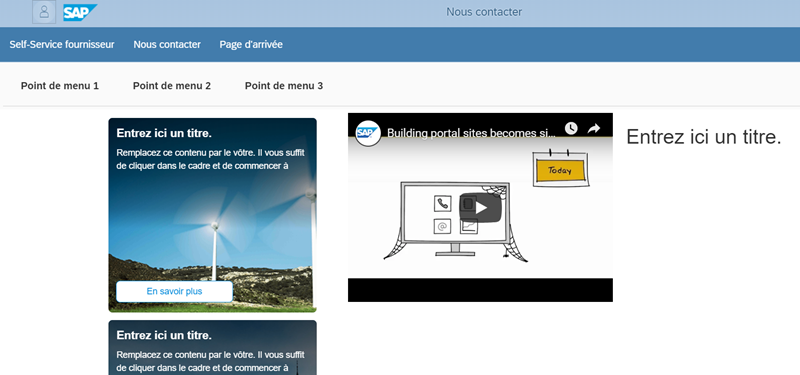

7. Now try it out in `German`.

8. When you are done, set the language back to your **Browser Language** (English) as the language settings are applied to your User and will be applied throughout your SAP Cloud Platform account.

>Just for your information - web content editors can translate the web content of a site directly from the Web Content Editor tool by selecting one of the languages activated by the site administrator. For more information, see [Translate Web Content](http://help.sap.com/viewer/8422cb487c2146999a2a7dab9cc85cf7/Cloud/en-US/eab4a7f0047a42d9873b3fad8edbf9a6.html)

Congratulations! You have translated your Portal freestyle site and end users can now view the content of your site in French and German.

[VALIDATE_1]

[ACCORDION-END]

---
