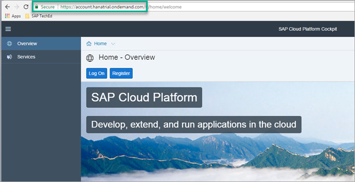
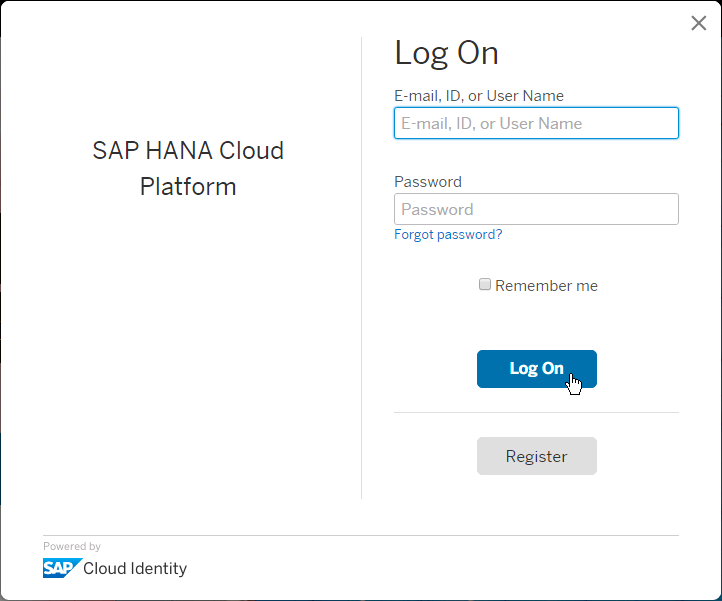
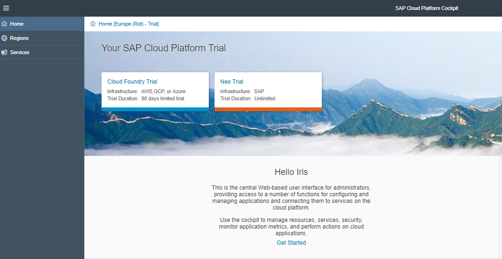
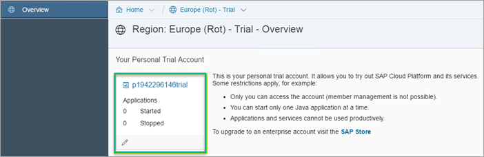
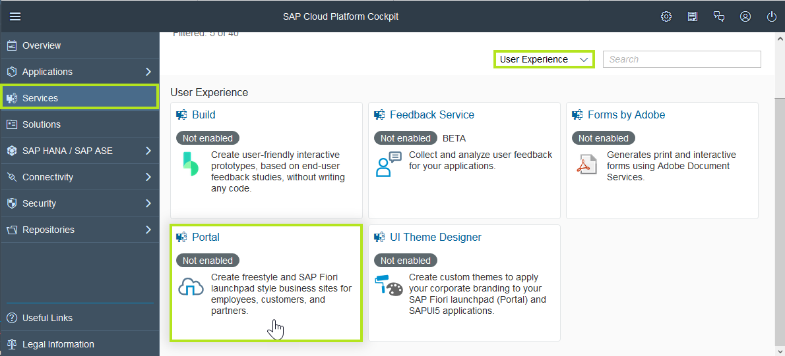
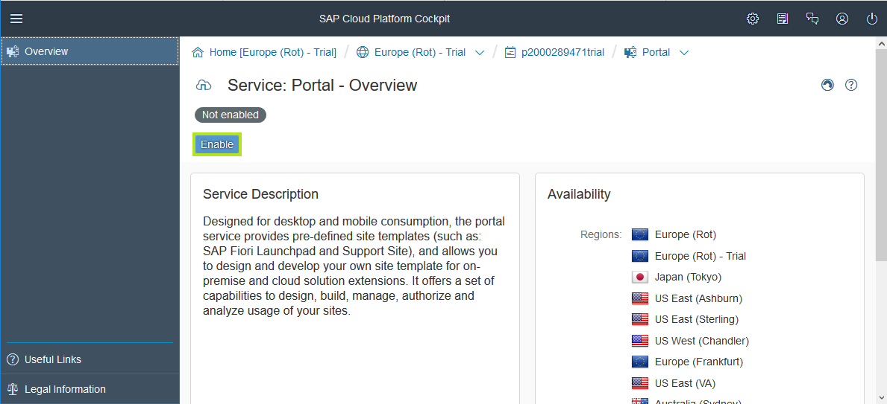

## Prerequisites  
 - You have created a SAP Cloud Platform trial account. See [Sign up for a free trial account on SAP Cloud Platform](hcp-create-trial-account).

## Details
### You will learn  
  - How to open SAP Cloud Platform cockpit
  - How to open your trial subaccount
  - How to enable the SAP Cloud Platform Portal service

---

[ACCORDION-BEGIN [Step 1: ](Open SAP Cloud Platform cockpit)]

1. Go to [SAP Cloud Platform](https://account.hanatrial.ondemand.com/).

    

2. Enter your **User Name** and **Password** that you provided when you created your trial account, and click **Log On**.

    

[DONE]
[ACCORDION-END]

[ACCORDION-BEGIN [Step 2: ](Open your trial subaccount)]

1. Select **Neo Trial**.

    

2. Click on your trial account.

    

[DONE]
[ACCORDION-END]

[ACCORDION-BEGIN [Step 3: ](Enable SAP Cloud Platform Portal)]

1. In the SAP Cloud Platform cockpit, click **Services** in the left panel to open the list of services available in your SAP Cloud Platform subaccount.

2. From the **Categories** dropdown list, select **User Experience** to see the UX-related services.

3. Click the **Portal** tile to open the service overview page.

    

4. On the **Portal – Overview** page, if the service is not already enabled, turn it on.

    

[VALIDATE_1]

[ACCORDION-END]

  [ACCORDION-BEGIN [Step 4: ](Download resources)]

We have provided a set of images for your site, for example, a site logo.

Download the following resources for use in your Portal site (right-click the link and choose **Save link as**):

  - [`logo-velotics.png`](https://raw.githubusercontent.com/SAPDocuments/Tutorials/master/tutorials/cp-portal-getting-started/resources/logo-velotics.png)
  - [`SupplierPortaHeader1.jpg`](https://raw.githubusercontent.com/SAPDocuments/Tutorials/master/tutorials/cp-portal-getting-started/resources/SupplierPortaHeader1.jpg)
  - [`SupplierPortaHeader2.jpg`](https://raw.githubusercontent.com/SAPDocuments/Tutorials/master/tutorials/cp-portal-getting-started/resources/SupplierPortaHeader2.jpg)
  - [`Testimonial1.jpg`](https://raw.githubusercontent.com/SAPDocuments/Tutorials/master/tutorials/cp-portal-getting-started/resources/Testimonial1.jpg)
  - [`Testimonial2.jpg`](https://raw.githubusercontent.com/SAPDocuments/Tutorials/master/tutorials/cp-portal-getting-started/resources/Testimonial2.jpg)

[DONE]

[ACCORDION-END]

You have now set up your SAP Cloud Platform subaccount and you are ready to create your site in our next tutorial.
