## Prerequisites
 - **Proficiency:** Intermediate
 - **Tutorials:** [Create a trial account on SAP Cloud Platform](https://www.sap.com/developer/tutorials/hcp-create-trial-account.html)
 -  **System Requirements:**
   * 64 bit Windows / Mac OS
   * 8 GB RAM (better: 16 GB RAM)
   * 100 GB available disk space

## Next Steps
 - [Install SAP NetWeaver in openSUSE](https://www.sap.com/developer/tutorials/cp-s4-ext-install-nw.html)

## Details
### You will learn
In this tutorial, you will install and set up a Linux operating system (openSUSE) in a VirtualBox virtual machine container. This can then be used as host operating system for installing an SAP NetWeaver system.

### Time to Complete
**30 Mins**

---

[ACCORDION-BEGIN [Preparation Steps](&nbsp;)]

To enable also users working with Windows or Mac OS X operation system to install `SAP NetWeaver AS ABAP`, we describe here how to make use of `Oracle VM VirtualBox` (VirtualBox), where the ABAP system then is installed and run on a Linux Virtual Machine (VM).

> **Hint:** If you have already a 64 bit Linux OS then you might be able to skip this tutorial and begin directly with [Install SAP NetWeaver in openSUSE](https://www.sap.com/developer/tutorials/cp-s4-ext-install-nw.html). However, please note that we haven't tested or documented this.

**System Requirements:**

Make sure that you have on your PC/Laptop or Mac:

1.  At least **8 GB of RAM** (better: 16 GB).

2.  At least **100 GB of free disk space**.

The tutorial has been tested to work for Windows and on Mac OS X.

As the some of the installation files are very large (> several GB) we recommend to start the download first for all files, before you start the installation process.

### Download Oracle VM VirtualBox

1.  Download the latest released version of `Oracle VM VirtualBox` (in short VirtualBox) from [https://www.virtualbox.org/wiki/Downloads](https://www.virtualbox.org/wiki/Downloads) for your host operating system (Host OS).

2.  Click on e.g. **`x86/amd64`** link to start the download of VirtualBox for Windows OS.

### Download Linux OS openSUSE

1.  Download `Linux OS openSUSE Leap` (DVD Image, `x86_64`) to your local machine from [https://software.opensuse.org/distributions/leap](https://software.opensuse.org/distributions/leap). (Ensure that you do not choose the **Network** installation files.)

    > **Hint:** This tutorial is based on `Linux OS openSUSE Leap` **`42.1`**, which is not the latest openSUSE release. Therefore the look of your installation might be slightly different from the provided screenshots.

2.  On the opened download page click **Direct Link** link to start the download.

[ACCORDION-END]

[ACCORDION-BEGIN [Step 1:](Install Linux VM in VirtualBox)]

### Install VirtualBox

1.  Use the VirtualBox installer you downloaded before in step 1.

2.  You can keep all default settings of the installation wizard.

3.  After installation, you can start the `VirtualBox Manager` as follows:
    -   On a Windows host:  Open the standard `Programs` menu and click on the item in the `VirtualBox` group.
    -   On a Mac OS X host: In the `Finder`, double-click on the **VirtualBox** item in the `Applications` folder (You may want to drag this item onto your Dock).

    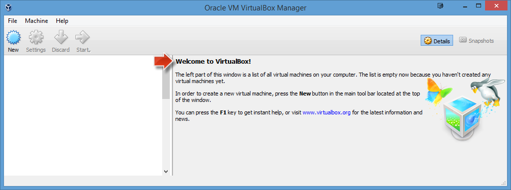

### Create new Linux VM in VirtualBox

1.  Open `VirtualBox Manager` application

2.  Click **New** button to create a new Linux Virtual Machine (VM) image with the following settings:
      - Name: **`SAP NetWeaver 7.50 SP02`**
      - Type: **`Linux`** (Operating System)
      - Version: **`openSUSE (64-bit)`**
      - Click **Next**

    

3.  On the next displayed wizard page:
      - Change `Memory size` to **`6 GB`** (6144 MB).
      - Click **Next**

    

4.  On the next displayed wizard page:
      - Make sure that **`Create a virtual hard disk now`** is selected.
      - Click **Create**

    

5.  On the next opened wizard page:
      - Make sure that **`VDI`** (Default) is selected as `Hard disk file type`.
      - Click **Next**

    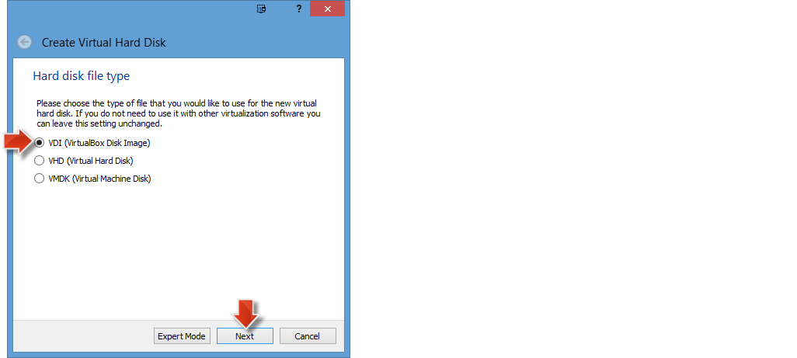

6.  On the next displayed wizard page:
    - Make sure that **`Dynamically allocated`** (Default) is selected as `Storage on physical hard disk`.
    - Click **Next**

    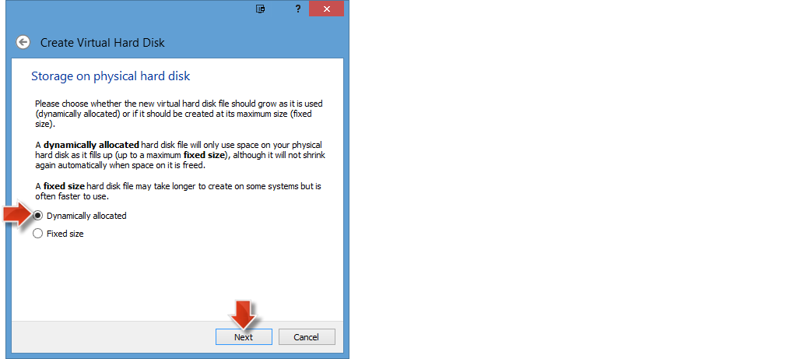

7.  On the next displayed wizard page:
    - Change `File size` to **`80 GB`** and keep the `File location`
    - Click **Create** to create **`a new VM entry`** with the specified settings.

    

> **Result:** A new VM entry with name `SAP NetWeaver 7.50 SP02` is created on the left side of the VirtualBox Manager.
>
>    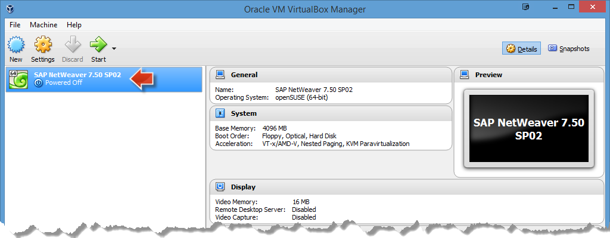

### Set boot installation file for Linux VM

1.  Right-click on the new VM entry `SAP NetWeaver 7.50 SP02` to open the context menu.

2.  Choose **Settings...** to open a settings dialog.

3.  Select **Storage** from the navigation.

4.  In the `Storage Tree` section select the **Empty** node of `Controller:IDE`.

    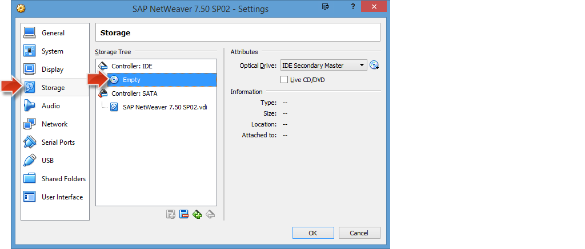

5.  In the `Attributes` section on the right side click on the **disk icon** to open a context menu.

6.  Click on option **Choose Virtual Optical Disk File...** to open a file browser.

    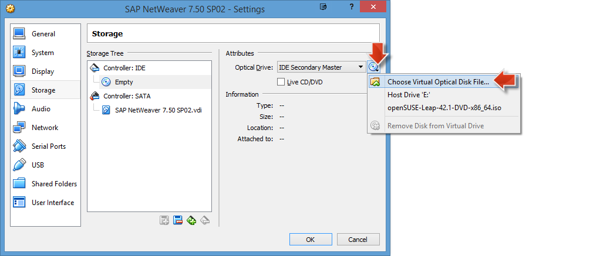

7.  Select the openSUSE Linux OS `.iso` file from your local storage that you downloaded in step 1.

    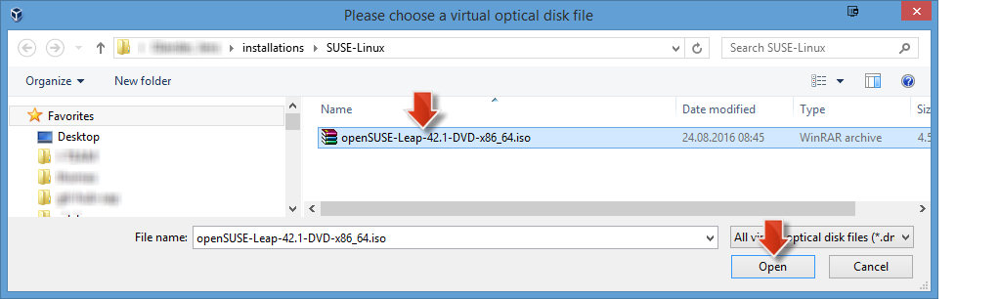

8.  Back on the `Settings` dialog click **OK** to save the settings.

    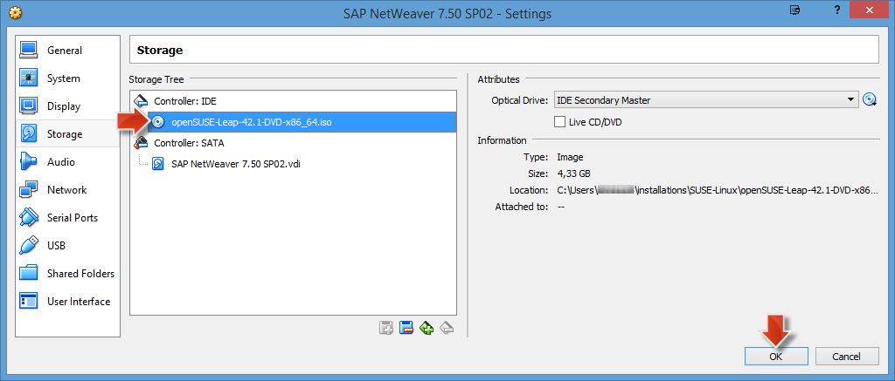

> **Result:** The VM has been prepared to boot from the specified `openSUSE DVD Image` file as soon as it is started as described in the next section.

### Install openSUSE Linux OS on the VM

1.  In `VirtualBox Manager` select `SAP NetWeaver 7.50 SP02` VM node and click **Start** button to start the new VM. It opens a new window `Oracle VM VirtualBox` and starts the virtual machine.

    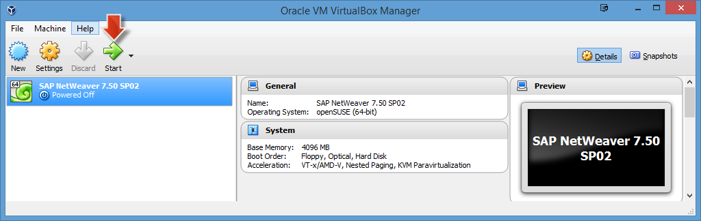

    > **Note:** If you have never worked with a Virtual Machine before, you have to imagine that a VM acts like a computer inside of your operating system. The window that now opened acts like a computer monitor for this emulated machine.

2.  Quickly use your keyboard **DOWN key** to select the **Installation** menu item, otherwise it will automatically select the first menu item.

    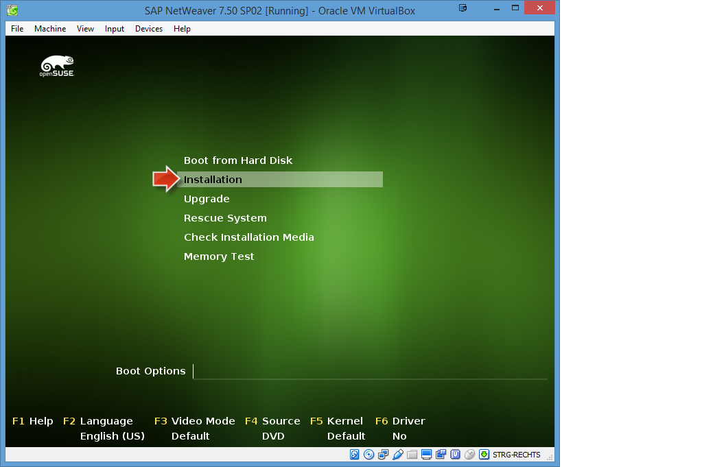

3.  Hit the **RETURN** key to start the VM OS installation of openSUSE Linux.

4.  During initialization, click the icon of the **mouse pointer integration** message so that this message is never displayed again.

      

5.  In the installation wizard, set the OS language to **English** and the keyboard language corresponding to the keyboard layout that you are using. You should check that your keyboard layout is correct by typing some special characters (e.g. `ä`, `ß`, `z`, `a`, `>`) in **Keyboard Test** area.

      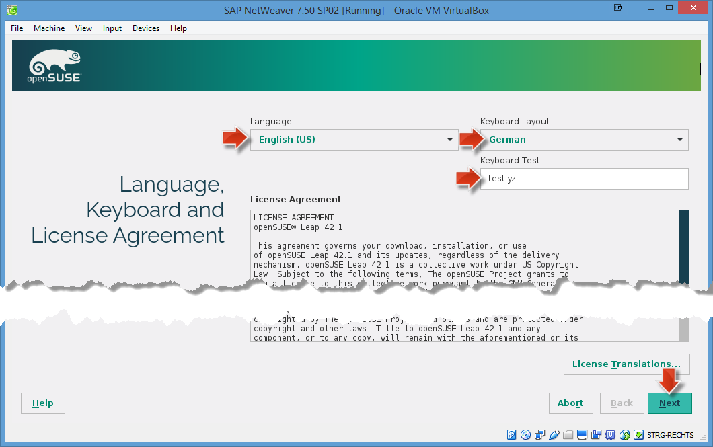

6.  Click **Next** to accept license and press **Next** in the screen with **Installation Options** by leaving the defaults.

      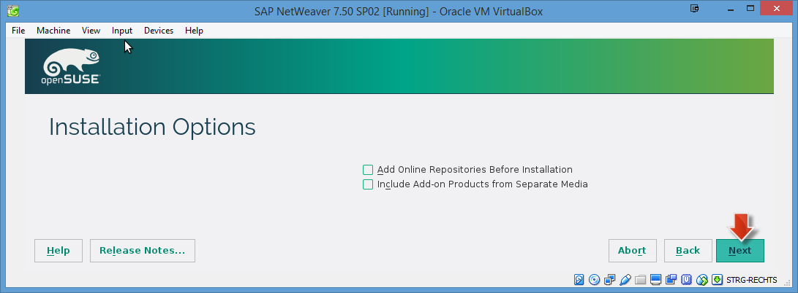

7.  In the next screen with `Suggested Partitioning` click on **Edit Proposal Settings**.

      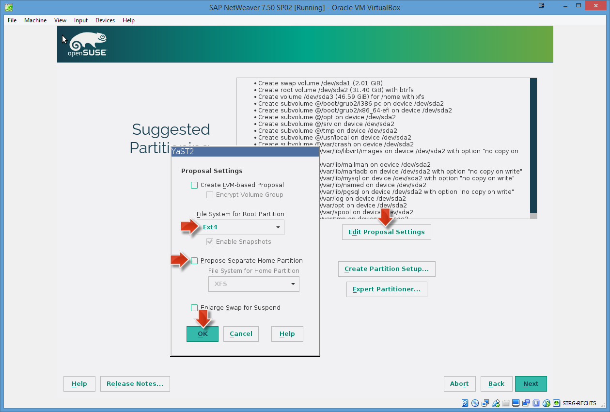

    -   For the field **File System for Root partitioning**, choose **`Ext4`** from the drop-down box.
    -   Uncheck **Propose Separate Home Partition**. This option is needed so that openSUSE Linux OS installation creates only one drive, instead of two drives (`Home` and `Extension`) where `Home` would have insufficient space to install the SAP NetWeaver backend system.
    -   Choose **OK** to save settings.

8. Click **Next**.

    

9. Adjust `Region` and `Timezone` and press **Next**.

    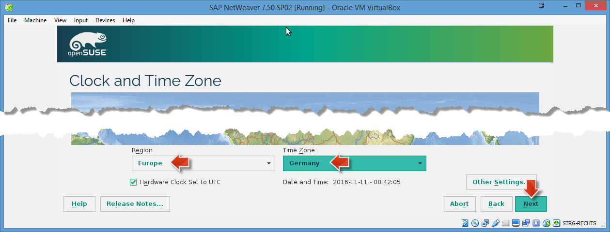

10. In Desktop Selection, choose **KDE Desktop**.

    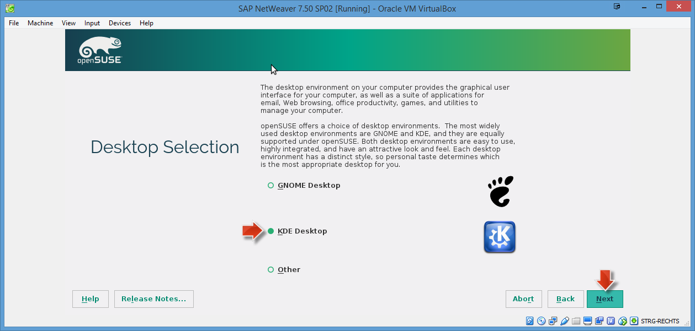

11. Click on **Next**.

12. Provide User's Full Name, Username and Master Password and click **Next**.

    > **Note:** Regarding the `Master Password` we assume that you might want to use the same password throughout the tutorial, because it might be easier to remember. The SAP NetWeaver requires a certain password complexity. Therefore, it makes sense that you use at least 8 characters, one number and one capital letter to form your password, e.g. `Appl1ance`.

    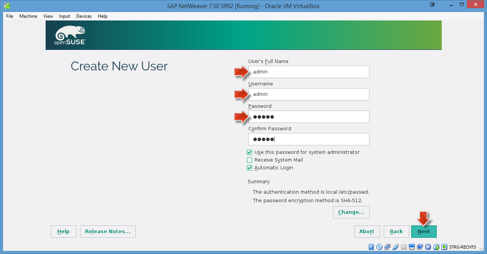

13. In the `Installation Settings` wizard step, scroll down to find **Firewall and SSH** settings:
    -   Click on the **disable** link to disable the **Firewall**.
    -   Click on the **enable** link to enable the **SSH service**.

    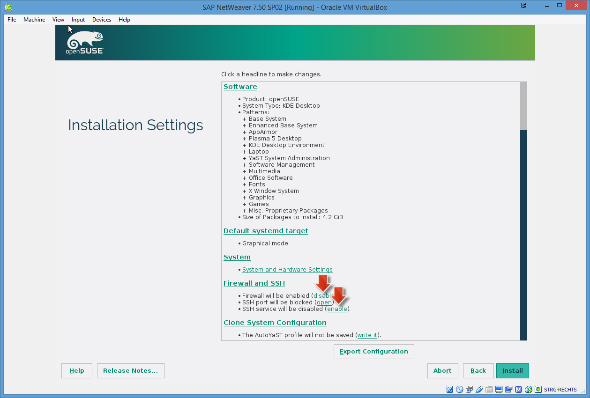

14. Click on **Install**.

    

15. After confirming that all settings are correct, click on **Install**.

    

16. After the installation finished (about 15-20 minutes), the VM will reboot automatically.

17. The VM will come up with default start option **Boot from hard Disk**. If you do nothing it will
    automatically use this option after 60 seconds (you may also hit RETURN key to speed this up).

      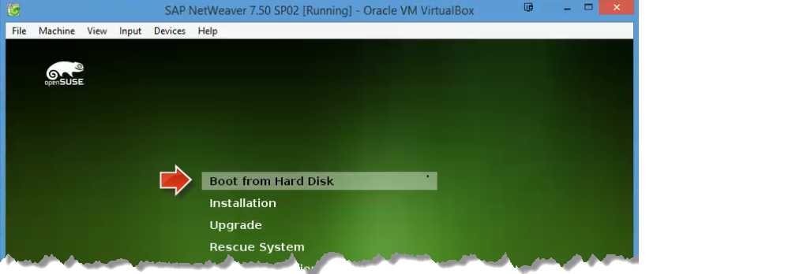

18. Next the **openSUSE Leap &lt;version>** is displayed as default boot option and will be used automatically after a few seconds.

    

19. openSUSE might want to install quite some updates. It is not necessary to install these, so you may skip this step.

20. Eventually you will reach the logon screen for your openSUSE installation. (The logon page/lock screen will also come up after certain time of not working with the running VM). Enter your **`password`** and click **Unlock** to enter the KDE desktop.

    > **Note:** This password is also the password of the `root` user, which you have to enter frequently later in this tutorial. The `root` user has advanced administration privileges in a Linux OS.

    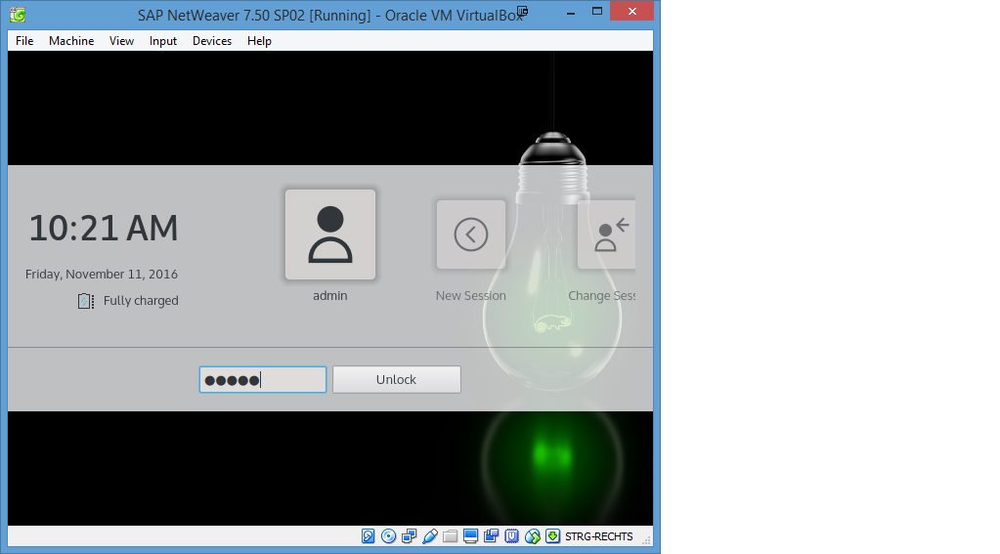

21. Close the **Desktop Folder** window: Hover over the window and click the **X** icon (with tooltip `Remove`) in the lower right corner of the window.

    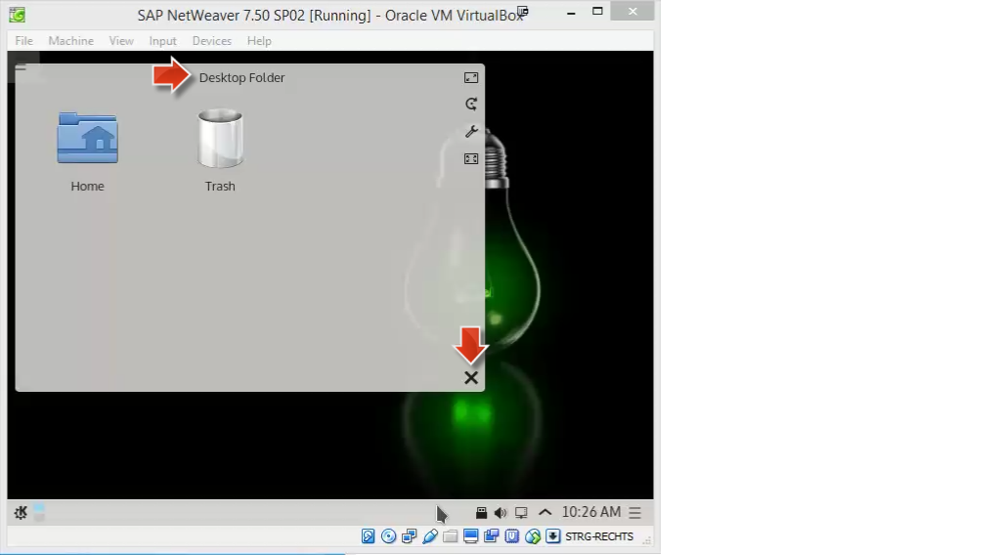

22. **For Laptop/Notebook/MacBook Users:** To keep the Linux VM session alive when not connected to a power supply you must change the default `Energy Saving` system settings.

    > **Warning:** The default power setting is that the server will suspend your session after 10 minutes of inactivity when your laptop is running on a battery. This stops any access to the SAP system and also shuts down the network connection making the VM inaccessible.

23. On the KDE desktop open the `Application` menu (similar to the Windows `Start` menu) in the bottom left corner. In the search field enter the query string **power** and click on the menu entry  **Energy Saving**.

    

24. In the `Energy Saving` dialog select tab **On Battery**. Disable the checkbox **Suspend session**.

25. Select tab **On Low Battery**. Again disable the checkbox **Suspend session**.

26. Click on **Apply** and close the dialog with **OK**.

      

### Create VM Snapshot
Having successfully installed and set up your openSUSE Linux operating system, you should create a **VM snapshot** of this initial state. You may revert to this snapshot, in case something should go wrong or break in the VM.

1.  In the running `Oracle VM VirtualBox` window menu: Choose **Machine** | **Take Snapshot...**.

    

2.  In the opened window enter **Initial Installation Snapshot** and click **OK**.

    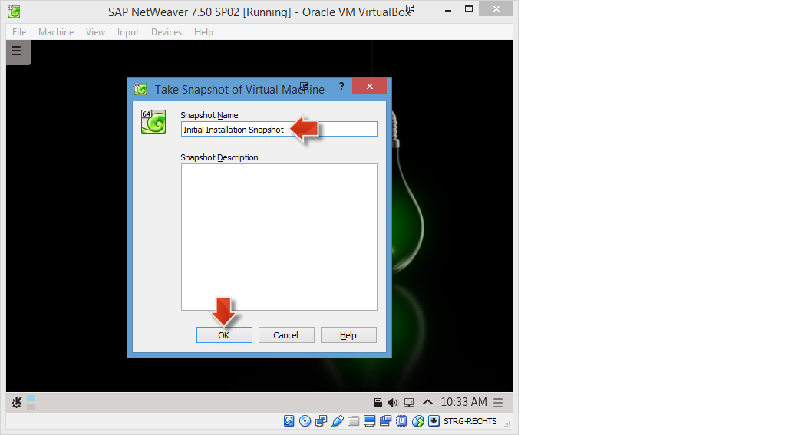

> **Result:** The VM snapshot `Initial Installation Snapshot` has been created and saved.

[ACCORDION-END]

[ACCORDION-BEGIN [Step 2: ](Configure VM - Proxy, Internet, shared Clipboard)]

### Configure Internet Proxy (optional)

In case you are using a proxy to connect to the internet, you have to configure it as follows; otherwise you may skip this section.

#### VM VirtualBox Setting

1.  In the running `Oracle VM VirtualBox` window menu: Choose **Input** | **Keyboard** | **Keyboard Settings...**.

    

2.  In the opened `Preferences` window select `Proxy` from the navigation:
      - Select **Manual Proxy Configuration** option.
      - Enter your **Host** and **Port** to the corresponding input fields (e.g. `proxy.mycompany.com` and `8080`).
      - Click **OK** to save the proxy settings.

    

#### YaST Proxy Setting

YaST is the installation and configuration tool for openSUSE. It can be used to configure your entire system, network, system services and security settings. It may also install new software packages from the internet. Hence you might need to set up a proxy for YaST.

1.  In the running `Oracle VM VirtualBox` open the KDE **Application Menu** by clicking on the **gear with K** icon in the lower left corner.

    

2.  Navigate to **System** | **YaST** and click on the `YaST` item.

3.  Enter your **root password** to open the `YaST Control Center`.

    

4.  Enter **`proxy`** as search term into the **Search** field.

    

5.  On the right side, select the **Proxy** icon in the `Network Services` category.

6.  On the `Proxy Configuration` page:
    -   Select **Enable Proxy** checkbox.
    -   Enter **HTTP Proxy URL** value, e.g. `http://proxy.mycompany.corp:8080`
    -   Select  **Use the Same Proxy for All Protocols** checkbox.
    -   Click **Test Proxy Settings** to verify the proxy settings.

    

7.  A `Proxy settings work successfully` popup should appear. Confirm with **OK**.

    

8.  Click **OK** to save the proxy settings.

    

9.  Confirm the `Successfully Saved` dialog with **OK**.

#### Firefox Proxy Setting

1.  In the running `Oracle VM VirtualBox` open the KDE **Application Menu** by clicking on the **gear with K** icon in the lower left corner.

    

2.  Navigate to **Internet** | **Firefox** and click on the item to open the `Firefox` web browser.

    

3.  Open **Firefox menu** in the upper right corner and click on **Preferences**.

    

4.  On the opened **Preferences** page:
    -   Choose **Advanced** item from left side icon bar.
    -   On the `Advanced` page click **Network** tab.
    -   Click **Settings...** button

    

5.  On the opened **Connection Settings** dialog:
    -   Select **Manual Proxy configuration** option
    -   Enter your **HTTP Proxy** and **Port** value (e.g. `proxy` and `8080`)
    -   Select **Use this proxy server for all protocols** option
    -   Click **OK** to save the proxy settings.

    

### Test Internet Connection

1.  In the running `Oracle VM VirtualBox` open the KDE **Application Menu** by clicking on the **gear with K** icon in the lower left corner.

    

2.  Navigate to **Internet** | **Firefox** and click on the item to open the `Firefox` web browser.

    

3.  You should now see a working openSUSE default web page.

### Enable bi-directional shared clipboard

Before you continue with the ABAP installation specific steps, you should enable the bi-directional shared clipboard as follows. This option allows you to use clipboard contents (copy & paste) from your host OS (Windows / Mac OS X) in the VM (openSUSE) and vice-versa. This should make things much easier when you copy and paste contents from this tutorial into the Linux console.

1.  In the running `Oracle VM VirtualBox` window menu: Open **Devices** | **Shared Clipboard** | **Bidirectional**.

    

2.  Click on the **Bidirectional** item so that it is enabled.

> **Hint:** With this enabled `bi-directional` option you can now copy and paste from your host operating system to the VM image window and vice versa. This is very helpful as you can copy e.g. needed command lines from the tutorial description (web page on your host OS) into a bash window of your VM window.

[ACCORDION-END]

You have now successfully completed this tutorial and set up openSUSE in a VirtualBox VM. You can now proceed with installing a SAP NetWeaver system in this VM, as described in this next tutorial: [Install SAP NetWeaver in openSUSE](https://www.sap.com/developer/tutorials/cp-s4-ext-install-nw.html)
