## Prerequisites
-   **Proficiency:** Intermediate
-   **Tutorials:** [Install openSUSE in VirtualBox Virtual Machine](https://www.sap.com/developer/tutorials/cp-s4-ext-install-linux.html)

## Next Steps
-   [Tutorial Group: Create custom UI extension for Business Suite app on Cloud Platform](https://www.sap.com/developer/groups/cp-s4-ext-ui.html)
-   [Tutorial Group: Create SAP S/4HANA data mart on SAP Cloud Platform](https://www.sap.com/developer/groups/cp-s4-ext-datamart.html)

## Details
### You will learn

SAP NetWeaver is the application server for SAP S/4HANA on-premises and for SAP Business Suite systems. In this tutorial you will learn to install a SAP NetWeaver system in openSUSE Linux. You can then use this server to explore and complete tutorials requiring an on-prem SAP backend.

### Time to Complete
**60 Mins**
---

[ACCORDION-BEGIN [Step 1:](Download SAP NetWeaver AS ABAP)]

The `SAP NetWeaver AS ABAP` system used in this course needs to be installed in a 64 bit Linux Operating System (OS). In case you do not have such an OS, you can follow the tutorial linked in the `Prerequisites` section above, which explains how to set up openSUSE in a VM.

This tutorial refers to an existing openSUSE installation in a Virtual Machine using `Oracle VM VirtualBox Manager` (VirtualBox Manager)

1.  Open the download page for SAP NetWeaver 7.50 SP02 in the [SAP Store](https://store.sap.com/sap/cp/ui/resources/store/html/SolutionDetails.html?pid=0000014492&catID=&pcntry=DE&sap-language=EN&_cp_id=id-1518433336565-0)

    > **Note:** Even though it is not the newest release, it is necessary to use `SAP NetWeaver AS ABAP` in Version `7.50 SP02`.

2.  Click on the orange button **Trial Version**. Fill out the form. You will then receive an email with a download link.

3.  Download all eight archive files `sap_netweaver_as_abap_750_sp02_ase_dev_edition.part\<n>.rar` to your local machine.

4.  Use any extractor tool (e.g. `WinRAR` or `7zip` for Windows or `Unarchiver` for Mac OS) to extract the SAP NetWeaver AS ABAP installation files somewhere to your local machine. All files must be **`stored in the same folder`**. As this is a multipart archive, you only need to start the extraction process for the first file `sap_netweaver_as_abap_750_sp02_ase_dev_edition.part1.rar` -- the other files will be extracted automatically.

> **Note:** Please check the file size of all parts you have downloaded. Each part file is around 1.5 GB (except for the last part). Also, please check that you have extracted the `.rar` files correctly. The total size of the extracted folder of the SAP NetWeaver AS ABAP Installation files is around 12+ GB.

[ACCORDION-END]

[ACCORDION-BEGIN [Step 2:](Replace license file for Sybase ASE database)]

Since the creation of this tutorial, the license for the ASE database that comes with the SAP NetWeaver AS ABAP 7.50 SP02 has expired. Before you start the installation, it is therefore important that you exchange a file in the SAP NetWeaver installation folder.

1.  Go to [SAP Sharepoint](https://sap.sharepoint.com/:u:/s/101566/EXkXzn0jDixDort1NuidArYBYwur1doCnDACqMQnfS4vmA?e=6wnZQk).

3.  Download the file `dbexe.tgz.aa`.

4.  In your file explorer, go to the location where you extracted the SAP NetWeaver installation files. Now navigate to the folder `\server\TAR\x86_64`.

5.  Here you will find a file `dbexe.tgz.aa`. This file should be replaced with the file you just downloaded from SAP Document Center.

> **Result of Step 2:** You now have a SAP NetWeaver Demo installation with a licensed ASE database, ready to be installed.

[ACCORDION-END]

[ACCORDION-BEGIN [Step 3:](Prepare openSUSE for ABAP installation)]

### Enable Network Access to Linux VM

1.  In `VirtualBox Manager` right-click on **SAP NetWeaver 7.50 SP02 VM** item to open context menu.

    

2.  Choose **Settings...** to open a settings dialog.

3.  Select **Network** and change the following settings in the **Adapter 1** tab:

    -   Enable Network Adapter: **`selected`**
    -   Attached to: **`NAT`**

    

4.  Click on **Advanced**, to see the `Advanced Network Settings`.

5.  Click on the **Port Forwarding** button.

    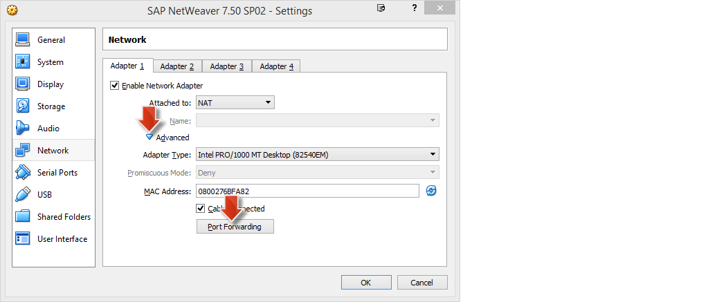

6.  On the opened `Port Forwarding Rules` dialog:
    -   Click 6 times the **green plus** icon to create 6 rows of roles.
    -   Then enter the following `Port Forwarding Rules`.

    > **Hint:** Copy each value entry (e.g. 1. each Name, 2. Protocol, `etc.png`) then double-click into the table field to get the edit focus and then paste the copied value.

    | Name                |Protocol |Host-IP   |Host Port |Guest IP  |Guest Port |
    |---------------------|---------|----------|----------|----------|-----------|
    | HTTP                |TCP      |127.0.0.1 |8000      |10.0.2.15 |8000       |
    | HTTPS               |TCP      |127.0.0.1 |44300     |10.0.2.15 |44300      |
    | SAP Cloud Connector |TCP      |127.0.0.1 |8443      |10.0.2.15 |8443       |
    | SAP GUI             |TCP      |127.0.0.1 |3200      |10.0.2.15 |3200       |
    | ABAP in Eclipse     |TCP      |127.0.0.1 |3300      |10.0.2.15 |3300       |
    | SSH                 |TCP      |127.0.0.1 |22        |10.0.2.15 |22         |

7.  Click **OK** to save the entered values.

    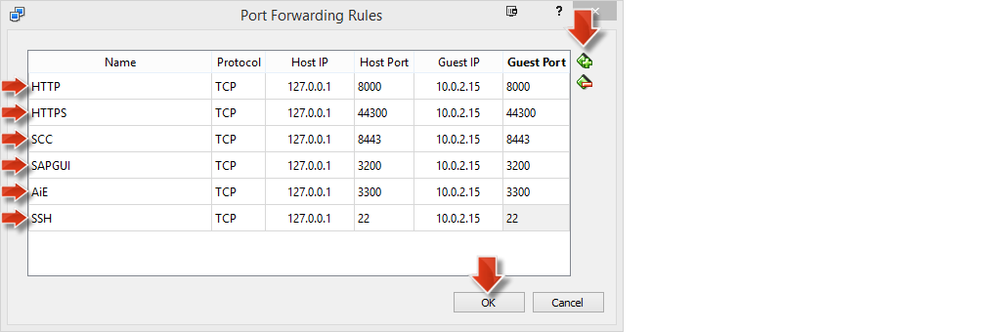

8.  Click **OK** to save Network settings.

    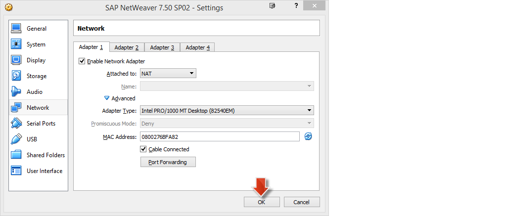

### Set up UUIDD Service

The UUID daemon is used to generate universally unique identifiers (UUIDs). The SAP NetWeaver  backend system needs this service to create unique IDs.

> **Hint:** UUIDD installation will only work if the VM has internet access.

1.  In the running `Oracle VM VirtualBox` open the KDE **Application Menu**.

    

2.  Navigate to **System** | **YaST** and click the YaST item.

3.  Enter your **`root password`** to open `YaST Control Center` window.

    

4.  The first list item **Software** is selected by default.

5.  On the right side click on **Software Management** from the items list.

6.  On the newly opened `YaST2` page do the following:
    -   Enter `uuidd` string into the search field and click **Search**.
    -   On the right side select the found `uuidd` package.
    -   Click **Accept** to install `uuid daemon helper` in YaST.

    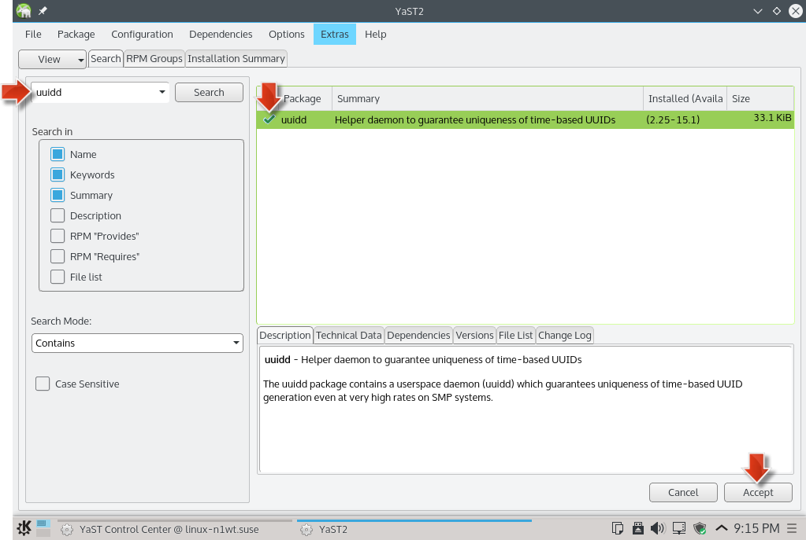

7.  On the **Installation Successfully Finished** page, click **Finish** to get back to the `YaST Control Center` window.

8.  Open the KDE **Application Menu**.

9.  Navigate to **System** | **Konsole** and click on it to open a new terminal window.

    

    > **Hint:** If you right-click on the `Konsole` item you can choose **Add to Favorite** to create a shortcut icon in the KDE Application Menu.

10. In the bash window execute **`sudo service uuidd status`** to check if the service is running.

    > **Hint:** You may press the `middle mouse button` or `mouse scroll wheel` to paste text into the `Konsole`.

11. All commands starting with `sudo` will ask for your **root** password. (`sudo` means that the command is executed with root user privileges.)

12. `UUIDD status` output should be **inactive (dead)** as you just installed the service and it is not started yet.

    

13. Execute **`sudo service uuidd start`** to start the service.

    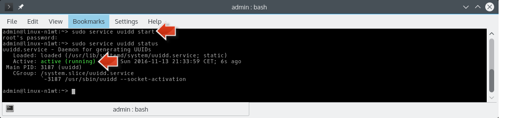

14. Execute **`sudo service uuidd status`** to check if the service is running.

    > **Hint:** If you press UP and DOWN keys on your keyboard, you can see the history of commands that you executed in the `Konsole` before.

15. The `UUIDD` status should now be **active (running)**.

### Prepare Network Setup

The SAP NetWeaver backend expects the **hostname** of its system to be called  `vhcalnplci`. We will now change the hostname of the openSUSE system accordingly, as this is more convenient than to reconfigure the SAP NetWeaver backend system.

1.  Open your `Oracle VM VirtualBox` window.

2.  Open the `Konsole` and execute command **`sudo vi /etc/hostname`**, to open the hostname file with the `vi` editor, which is a text editor for the terminal window.

    

3.  Press **ESC** and **`i`** to switch the `vi` editor to `insert` mode, in order to change the content of the configuration file `/etc/hostname`. The text in this file sets the **system host name**.

    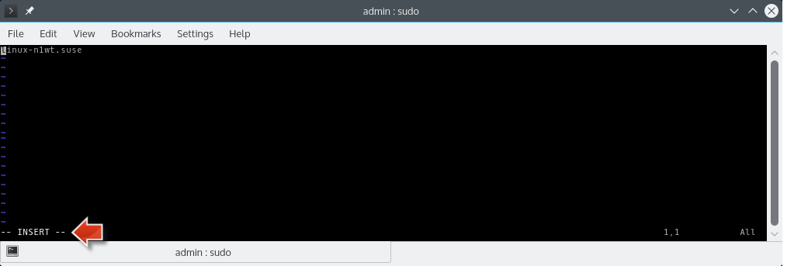

4.  Replace the existing hostname `linux-n1wt.suse` with `vhcalnplci`.

    > **Hint:** Navigate in the `vi` editor with **arrow keys** and then use **back DEL** key to delete the characters.

    

5.  Press **ESC** and **`*:wq`** (`write` and `quit`) to save the changed file and to quit the `vi` editor.

    

6.  Hit **ENTER** key to execute this `vi` editor command and go back to the `Konsole` bash window.

    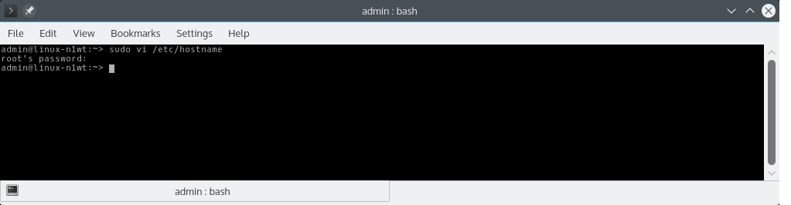

    > **Hint:** After pressing the `ESC` the cursor will go to the bottom of the screen at a colon prompt. Write your file by entering `:w` and quit by entering `:q`. You can combine these to save and exit by entering `:wq`.

7.  You now need to restart the openSUSE network adapter to reload the configuration file with the new hostname and to test it.

8.  Execute **`sudo rcnetwork restart`**.

9.  Execute **`hostname`** and see that the hostname output is `vhcalnplci`.

    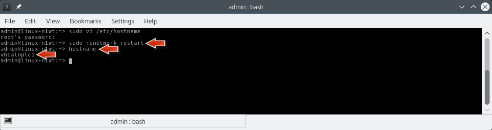

10. You now need to change the openSUSE `hosts` file. The `hosts` file translates a hostname to an IP address.

11. In the opened `Konsole`, execute command **`sudo vi /etc/hosts`** to open the vi editor for `hosts` file.

12. Press **ESC** and **`i`** to switch the `vi` editor again to insert mode.

13. After the existing **127.0.0.1** entry, add the following new line entry:

    -   **`10.0.2.15 vhcalnplci vhcalnplci.dummy.nodomain`**

        > **Hint:** Navigate in the `vi` editor with **arrow keys** to the place where you want to paste the added entry.

    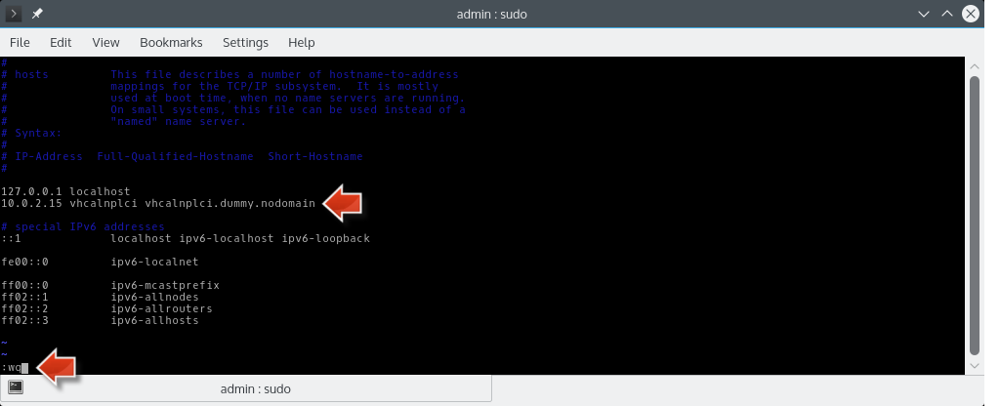

14. Press **ESC** and **`:wq`** and hit the **ENTER** key to save the changed file.

15. Restart network to set settings and test it:

16. Execute **`sudo rcnetwork restart`**

17. Test setup with **`ping vhcalnplci`**

18. The ping output should look like: `64 bytes from vhcalnplci (10.0.2.15): icmp_seq=1 ttl=64 time=0.041 ms`

19. Stop the ping output with **CRTL** and **C**.

    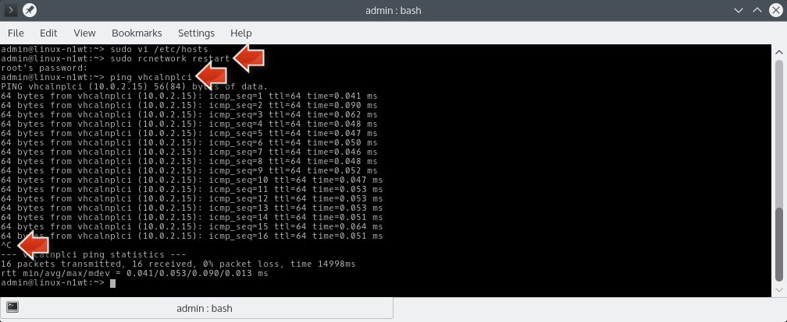

### Mount `netweaver` Installation Folder in Linux VM

To start the installation of the SAP NetWeaver backend system, you need to allow the openSUSE to access the `netweaver` installation folder which resides in you host operating system (your main Windows / Mac OS) to get access to extracted ABAP installation files.

#### Setup a Shared Folder

1.  In `VirtualBox Manager` right-click on **SAP NetWeaver 7.50 SP02 VM** item to open context menu.

    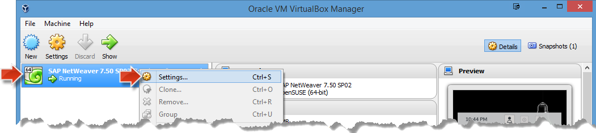

2.  Choose **Settings...** to open a settings dialog.

3.  Select the **Shared Folders** item.

    

4.  Click on the **folder icon with green plus** (with tooltip `Adds new shared folder`) to open `Add Share` dialog:
    -   Folder Path: **\\<navigate to location where you extracted the SAP NetWeaver installation files>**. (see [Step 1])
    -   Folder Name: **`netweaver`**
    -   Read-only: **`not selected`** (default)
    -   Auto-Mount: **`not selected`** (default)
    -   Make Permanent: **`not selected`** (default)
    -   Click **OK**

    

5.  Click on **OK**.

    

#### Mount `netweaver` folder to the Shared Folder

1.  Use already opened `Konsole` or open a new one (KDE **Application Menu** and navigate to **System** | **Konsole**).

2.  Execute command **`mkdir netweaver`** (make directory) to create a new `netweaver` folder.

    > **Hint:** Execute command **`pwd`** (print working directory), so that you know at which location you created this folder.

    

3.  Execute command **`sudo mount -t vboxsf netweaver netweaver`** to mount (== `map`) this `netweaver` folder in the VM, to the `Shared Folder` you set up before (which also named `netweaver`).

    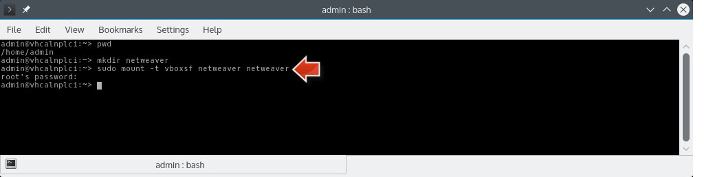

4.  Execute command **`cd netweaver`** (change dir) to navigate into the `netweaver` folder.

5.  Execute command **`ls -l`** (list directory using a long listing format) to show the contents of the mounted folder. The contents are the extracted SAP NetWeaver installation files to which openSUSE now access to.

Now you have prepared everything for the SAP NetWeaver installation.

> **Result of Step 3:** Your openSUSE Virtual Machine is now ready to install SAP NetWeaver on it. The SAP NetWeaver will be reachable within the Virtual Machine and all necessary services are running.

[ACCORDION-END]

[ACCORDION-BEGIN [Step 4:](Install SAP NetWeaver AS ABAP on Linux VM)]

In the previous steps you downloaded, extracted and mounted the installation files for a `SAP NetWeaver` system to the openSUSE Linux running inside of your local machine. You will now install the system in this virtual machine. Please note that this is a specially prepared and simplified installation of a `SAP NetWeaver` backend, and that the installation process of a live and productive instance requires more expertise on how to best tweak the system settings.
Please also be aware that the RAM settings we allocated in the VM are very minimalistic, so the system might react slower than you would expect it to run, if it were installed properly on a dedicated server.

1.  Open a `Konsole` terminal window: ( **Application Menu** | **System** | **Konsole** ).

2.  Inside the mounted `netweaver` folder execute command **`ls -l`** to see that amongst other files and folders the `install.sh` is available. This is the installation script to start the installation of the SAP NetWeaver system.

3.  Execute **`chmod +x install.sh`** to enable the execution of the installer.

    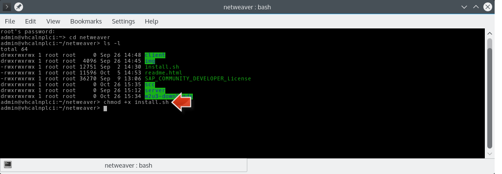

4.  Execute **`sudo ./install.sh`** to start the installation.

5.  Hit **ENTER** key when `Hit enter to continue` message appears.

6.  Hit **SPACE** key until `Do you agree to the above license` message comes up.

7.  Read and accept the license agreement and confirm with `yes`, if you agree to the terms of condition.

8.  When prompted for the OS users password, choose a strong password for your ABAP OS users (Users like `npladm`). **The password should be minimum length 8 characters, contain at least one capital letter and one number; e.g. `Appl1ance`.**

    > **Note:** The install script will fail if you choose a password that is too weak.

9.  Installation will start and take about 20 minutes.

      

10. If the installation was successful, you should see the following message:
    ```
    Instance on host vhcalnplci started
    Installation of NPL successful
    ```

    

> **Result of Step 4:** You have successfully installed a `SAP NetWeaver AS ABAB` within your Virtual Machine. This SAP NetWeaver instance comes filled with data for tests and demonstrations.

[ACCORDION-END]

[ACCORDION-BEGIN [Step 5:](Start SAP NetWeaver AS ABAB)]

1.  Use already opened `Konsole` or open a new one ( **Application Menu** | **System** | **Konsole** ).

2.  Execute the following three commands to start and check the installed SAP NetWeaver AS ABAP:

3.  Execute **`su -l npladm`** (will ask for `SAP NetWeaver AS ABAP` `system password`) to switch to `NetWeaver Admin` user, so that you act in this `Konsole` as this user and its permissions.

    > **Hint:** This user has been created during the ABAP installation in above Step 5 and only this user has the permissions to start, stop and check the status of the installed ABAP on the VM.
    >
    > **Note:** The `-` (or `-l`) parameter for the `su` (`switch user`) command creates a shell environment the same as if you had logged in with that different user.  Without the `-l` parameter, you're running the `sapcontrol` command in the shell environment of the current user.

4.  Execute **`startsap ALL`** to start the ABAP server (if not already).

5.  Execute **`sapcontrol -nr 00 -function GetProcessList`** to check that the processes are running and are all `GREEN`

    > **Note:** As `startsap ALL` can take some time, repeat the command execution a few times until all four processes `(IGS Watchdog, Dispatcher, Gateway, ICM)` are `GREEN`.

    The result should look as follows:

    ```
    GetProcessList
    OK
    name, description, dispstatus, textstatus, starttime, elapsedtime, pid
    igswd_mt, IGS Watchdog, GREEN, Running, 2017 ... , ... , ...
    disp+work, Dispatcher, GREEN, Running, 2017 ... , ... , ...
    gwrd, Gateway, GREEN, Running, 2017 ... , ... , ...
    icman, ICM, GREEN, Running, 2017 ... , ... , ...
    ```

    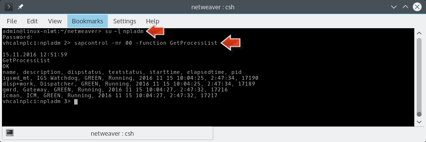

> **Result of Step 5:** You have started your local `SAP Netweaver` instance and all processes are running.

[ACCORDION-END]

[ACCORDION-BEGIN [Step 6:](Create snapshot of virtual machine)]

After the installation of the `SAP NetWeaver AS ABAP` finished successfully, you should create a snapshot to preserve this state as you already did after the Linux installation. You can then always revert to this snapshot VM state, in case your VM image should get broken for whatever reason.

1.  In the running `Oracle VM VirtualBox` window menu: Choose **Machine** | **Take Snapshot...**.

    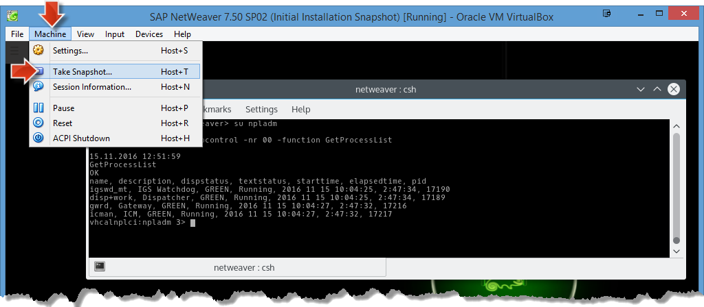

2.  In the opened window enter **`ABAP Installation Snapshot`** and click **OK**.

    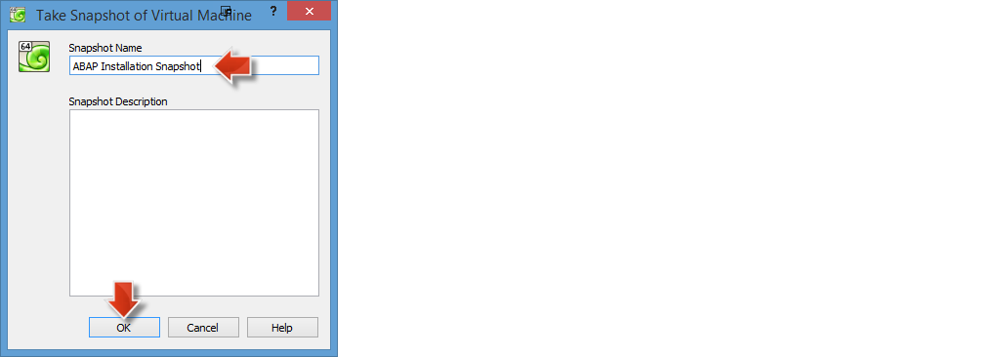

> **Result of Step 6:** `ABAP installation` snapshot has been created.

[ACCORDION-END]

[ACCORDION-BEGIN [Step 7 (Windows):](Install and set up SAP GUI Client)]

The `SAP GUI` (also known as: `SAP Logon` or `SAP Front End`) is the front-end application to connect to SAP backend systems like the `SAP NetWeaver AS ABAP`.

> **Hint:** If you have already a `SAP GUI / SAP Logon` installed on your computer, you may use it and skip the installation and continue with the next step.

#### Install SAP GUI Client

> **Hint:** If you encounter any issues, you may also refer to the [SAP Front End Installation Guide](http://www.sap.com/documents/2014/10/bed91652-5a7c-0010-82c7-eda71af511fa.html).

In your host OS navigate to the location where you extracted the SAP NetWeaver AS ABAP installation files and open the folder `client`.

1.  Go to folder `/client/SAPGUI4Windows`

2.  Right-click on `SAP_GUI_7.40_PL1_20150108_1618.exe` and choose `Run as administrator` from context menu to launch the installation wizard.

    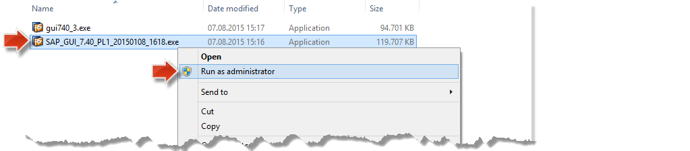

3.  If you get a Windows security prompt (as you are requesting administrator privileges), you need to confirm `User Account Control` dialog with **OK**.

4.  Click through the installation wizard and keep the default values and make sure that `SAPGUI 7.40 PL1` checkbox is selected.

5.  The wizard should finish with a success message which you confirm with `Close`.

    

> **Result:** The `/SAP/FrontEnd/SAPgui/saplogon.exe` file inside Windows program files folder has been created to launch `SAP Logon` application. A shortcut to `SAP Frontend` is placed in your Windows Start menu.

#### Add SAP NetWeaver to SAP GUI and Log On

1.  Open the `SAP Logon` application (also known as `SAP GUI`) from Windows Start menu.

    

2.  Add your local SAP NetWeaver AS ABAP installation as new system:

3.  Click **New** icon from the `SAP GUI` toolbar to open `Create New System Entry` wizard.

    

4.  Select **`User Specified System`** entry and click **Next**.

    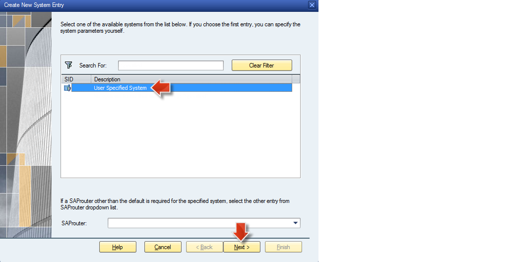

5.  On the next page enter the following details:

    -   Description : **`Local NetWeaver`**
    -   Application Server: **`127.0.0.1`**
    -   Instance Number : **`00`**
    -   System ID: **`NPL`**

        

6.  Click **Finish** to create a new system entry.

    

7.  Logon to the new system:

8.  Right-click on the newly created entry `Local NetWeaver` and click on **Log on** option of the context menu.

    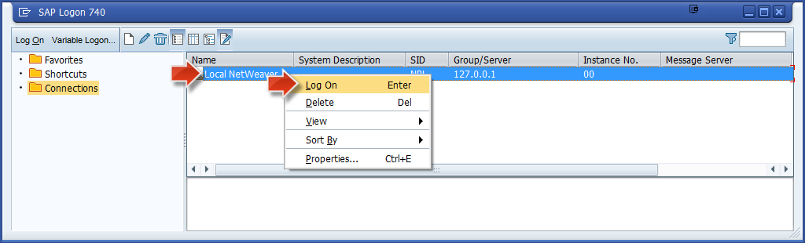

9.  To log on to the system for the first time, use the following credentials:

    -   Client: **`001`**
    -   User: **`Developer`**
    -   Password: **`Appl1ance`**
    -   Language: **`EN`**

    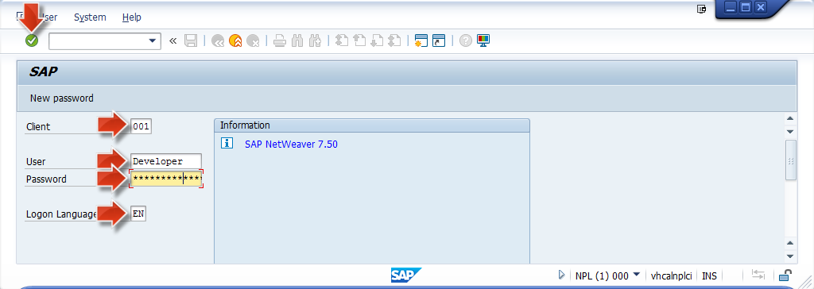

10. Click green **Accept** icon to log on to the system with the specified credentials.

11. Click also green **Accept** icon on the opened `Copyright` dialog so that the `SAP Easy Access` entry page of the local SAP NetWeaver system is displayed.

    

> **Hint (optional):** The `Favorites` links like `Launchpad` as you can see in the before opened `SAP Easy Access` page will only work, if you add the following entry to the `hosts` file in your `host operating system` (Windows: open the file `C:\\Windows\\System32\\drivers\\etc\\hosts` in a text editor with administrator privileges):  **`127.0.0.1 vhcalnplci vhcalnplci.dummy.nodomain`**


> **Result of Step 7**: The `SAP GUI` has been installed and you have logged on to your SAP NetWeaver as user `Developer`.

[ACCORDION-END]

[ACCORDION-BEGIN [Step 7 (Mac OS):](Install and set up SAP GUI Client)]

The `SAP GUI` (also known as: `SAP Logon` or `SAP Front End`) is the front-end application to connect to SAP backend systems like the `SAP NetWeaver AS ABAP`.

> **Hint:** If you have already a `SAP GUI / SAP Logon` installed on your computer, you may use it and skip the installation and continue with the next step.

#### Install SAP GUI Client

> **Hint:** If you encounter any issues, you may also refer to the [SAP Front End Installation Guide](http://www.sap.com/documents/2014/10/bed91652-5a7c-0010-82c7-eda71af511fa.html).

In your host OS navigate to the location where you extracted the SAP NetWeaver AS ABAP installation files and open the folder `client`.

1.  Go to folder `/client/JavaGUI`

2.  Double-click on `PlatinGUI740_8-OSX.JAR` file to run it with `JAR Launcher.app` so that the `SAP Front End installer` opens.

    

3.  Click **Next** to open `Readme` page.

4.  Click again **Next** to open `Installation Options` page.

5.  Keep the defaults and click **Install** to start the installation.

6.  The wizard should finish with a success message which you confirm with **Close**.

    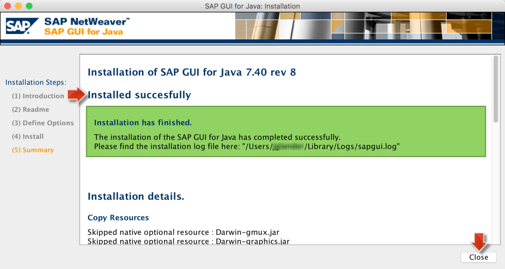

#### Add SAP NetWeaver to SAP GUI and Log On

1.  Open `SAP GUI` application by double-clicking `/Applications/SAP Clients/SAPGUI/SAPGUI.app` file.

    

2.  **New** icon to open `Connection Properties` dialog

3.  Enter `Description`: **`Local NetWeaver`**

4.  Click `Advanced` tab

    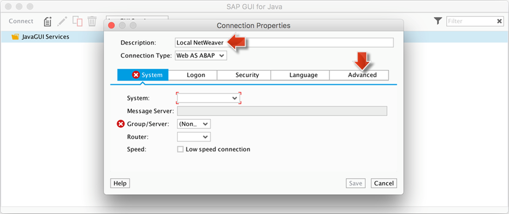

5.  On `Advanced` tab select **`Expert mode`** option.

6.  In the text area field enter **`conn=/H/127.0.0.1/S/3200`**

    

7.  Click **Save** to create a new system entry.

    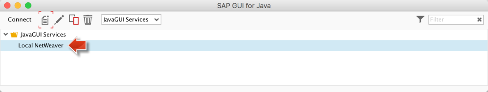

8.  Log on to the new system.

9.  Right-click on the new entry `Local NetWeaver` and click on **Connect** option of the context menu.

    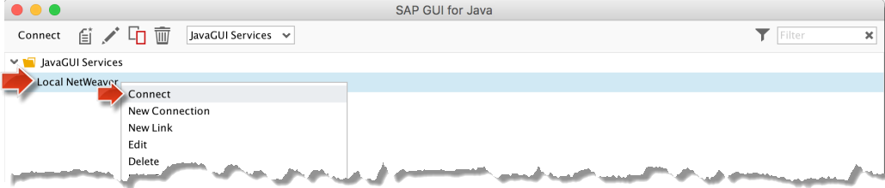

10. To log on to the system for the first time, use the following credentials:

    -   Client: **`001`**
    -   User: **`Developer`**
    -   Password: **`Appl1ance`**
    -   Language: **`EN`**

    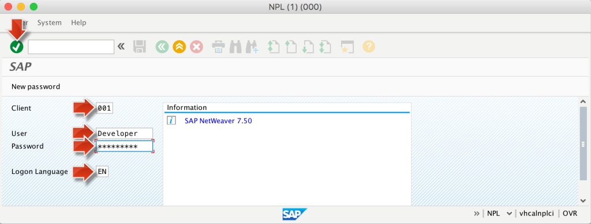

11. Click green **Accept** icon to log into the system with the specified credentials.

12. Click also green **Accept** icon on the opened `Copyright` dialog so that the `SAP Easy Access` entry page of the local SAP NetWeaver system is displayed.

    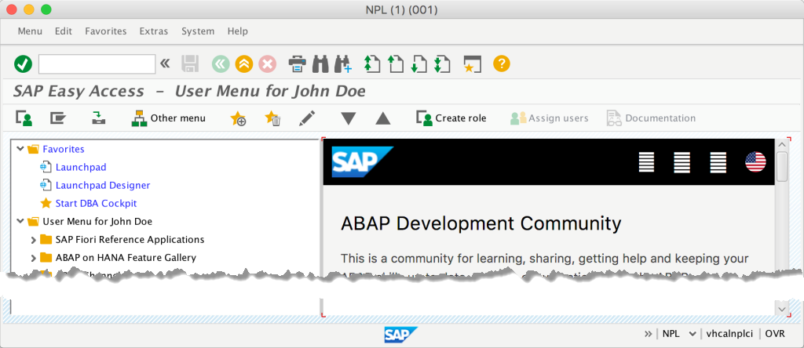

> **Hint (optional):** The `Favorites` links like `Launchpad` as you can see in the before opened `SAP Easy Access` page will only work, if you add the following entry to the `hosts` file in your `host operating system`. (Mac OS: open `Terminal` and type  **`_sudo nano /etc/hosts_`**): **`127.0.0.1 vhcalnplci vhcalnplci.dummy.nodomain`**


> **Result of Step 7**: The `SAP GUI` has been installed and you have logged on to your SAP NetWeaver as user `Developer`.

[ACCORDION-END]

[ACCORDION-BEGIN [Step 8:](Install SAP system license)]

To work with the installed local `SAP NetWeaver AS ABAP` system you have to request a `Demo license` for free as described in the following steps.

1.  Open `SAP GUI` and login with the `SAP*` user.

2.  Enter **`SLICENSE`** in the transaction field in the upper left corner.

    

3.  Click green **ENTER** icon to launch the `SLICENSE` transaction.

4.  Copy & paste Hardware Key from the opened transaction page.

    

5.  Open the [SAP Sneak Preview License Key Request](https://go.support.sap.com/minisap/#/minisap) page.

6.  Choose `NPL - SAP NetWeaver 7.x (Sybase ASE)` from the list under `Available SAP Systems for Windows & Linux`.

7.  Enter your Salutation, trial user first name, last name and e-mail address in the requested fields.

8.  Enter the `Hardware key` value which you copied from `SLICENSE` transaction before.

9.  Read and agree to the license agreement by checking the checkbox.

10. Click **Generate**.

    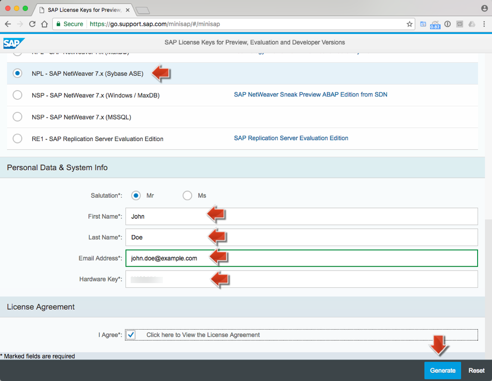

11. The license file named `NPL.txt` gets generated and is downloaded to the `Downloads` folder of your browser tab.

12. Switch to the SAP GUI window.

13. On the transaction `SLICENSE` page click the button **Install**.

    > **Note:** If the Install button is not visible, scroll down.

    

14. In the file picker, navigate to the license file `NPL.TXT` and open it.

15. On the `SAP GUI Security` window click **Allow** to grant access to the file.

16. Then a successfully installed window should appear on which you click the green **Continue** icon.

17. Finally, a new `Valid License Entry` is added to the table on the `Digital Signed Licenses` tab.

    

18. **Close** the window where the transaction `SLICENSE` has been opened.

> **Result of Step 8:** The `SAP NetWeaver AS ABAB` installation is now licensed.

[ACCORDION-END]

[ACCORDION-BEGIN [Step 9:](Create snapshot with license)]

After you added the license to your `SAP NetWeaver AS ABAP`, you should again create a `VM Snapshot` in order to preserve this state.

1.  In the running `Oracle VM VirtualBox` window menu: Choose **Machine** | **Take Snapshot...**.

2.  In the opened window enter `ABAP with License` and click **OK**.

> **Result of Step 9:** `ABAP with License` snapshot has been created.

[ACCORDION-END]

[ACCORDION-BEGIN [Step 10:](Stop/start the virtual machine)]

#### Stopping SAP NetWeaver AS ABAP and closing Virtual Machine

When you are not working on the tutorial, it is recommended to shutdown the openSUSE VM in which the `SAP NetWeaver AS ABAP` is running.

> **Note:** First reason for this is that the SAP NetWeaver system might take a considerable amount of system resources on your host OS machine. The second reason is that the shutdown and restart with snapshot procedure of the VM with the ABAP system is sometimes the best way to get out of certain SAP NetWeaver related problems (e.g. SAP NetWeaver processes does not result in GREEN status after executing 'startup ALL').

Shutdown of the VM should be done in two steps, first stopping the ABAP and secondly closing the VM:

1.  In the running `Oracle VM VirtualBox` open KDE `Application Menu`.

2.  Open a `Konsole` ( **System** | **Konsole** ) and execute the following three commands:

3.  Execute **`su -l npladm`** (will ask for `SAP NetWeaver AS ABAP` `system password`) to switch to the `NetWeaver Admin` user, so that you act in this `Konsole` as this user and its permissions.

4.  Execute **`stopsap ALL`** to stop the ABAP server.

    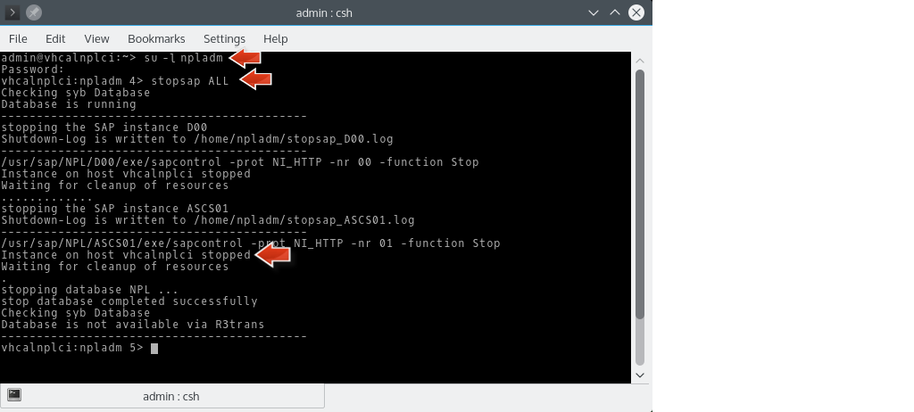

5.  In the running `Oracle VM VirtualBox` window menu: Open **File** | **Close...**.

    

6.  In the opened `Close Virtual Machine` window select the **Power off the machine** option.

    > **Hint:** With this option the current state will not be preserved and if VM is restarted the last saved snapshot will be taken as system state.

    

7.  Click **OK** so that the VM window is closed.

#### Restore Virtual Machine and start SAP NetWeaver AS ABAP

After you have stopped the ABAP and closed the VM as described in above section, we now describe how you launch the VM, start the SAP NetWeaver AS ABAP there and verify that the system processes are running as they should.

We will describe this startup of the VM from the latest existing snapshot you created.

> **Hint:** Keep in mind that in following tutorials you will be pointed to this `How to start a VM` section. Then you might already have another latest snapshot that the one after described below.

1.  In `VirtualBox Manager` restore the latest snapshot:

2.  Select **Snapshots** button in the upper right corner.

3.  Open the snapshot tree nodes and select the latest node before the `Current State` node (e.g. **ABAP with License Snapshot**).

4.  Open context menu on selected node and chose **Restore Snapshot**.

    

5.  If the `Virtual Box - Question` window pops up then:

    -   **`Deselect`** checkbox `Create a snapshot of current machine state option`.
    -   Click **Restore**.

    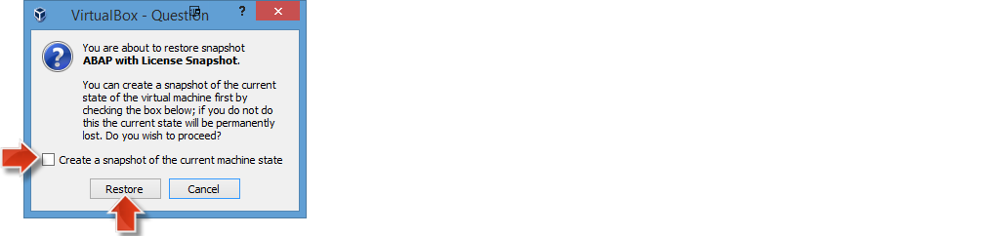

    > **Result:** The state of the selected VM is restored to this snapshot and can be started now.

6.  Select `SAP NetWeaver 7.50 SP02` VM node and click **Start** button to start the new VM. It opens a new window `Oracle VM VirtualBox` and starts the virtual machine.

    > **Hint:** Hit the RETURN key to accept the default menu entries (first `Boot from Harddisk` and second `openSUSE`) so that you do not have to wait a few seconds for auto-start.

      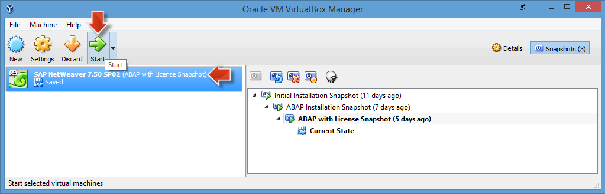

7.  In the running `Oracle VM VirtualBox` open KDE **Application Menu**.

8.  Open a `Konsole` ( **System** | **Konsole**).

9.  Check Network connection:

10.  Execute **`sudo ifconfig`** (will ask for root password).

11.  Make sure, that you find `inet addr:10.0.2.15` as part of the output result.

    > **Note:** If you don't get this `inet addr`, then try to execute **`sudo rcnetwork restart`** and check again.

    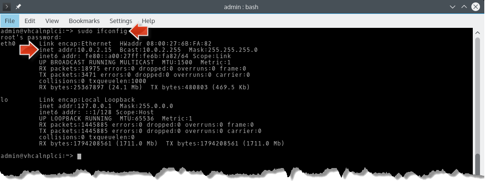

12.  Start `SAP NetWeaver AS ABAP`:

13.  Execute **`su -l npladm`** (will ask for `SAP NetWeaver AS ABAP` `system password`) to switch to `NetWeaver Admin` user, so that you act in this `Konsole` as this user and its permissions.

14.  Execute **`startsap ALL`** to start the ABAP server.

15.  Execute **`sapcontrol -nr 00 -function GetProcessList`** to check that the processes are running and are all `GREEN`.

    > **Note:** As the system start may take some time, you should repeat the command execution of **`sapcontrol -nr 00 -function GetProcessList`** a few times, until all four processes `(IGS Watchdog, Dispatcher, Gateway, ICM)` are `GREEN`.

    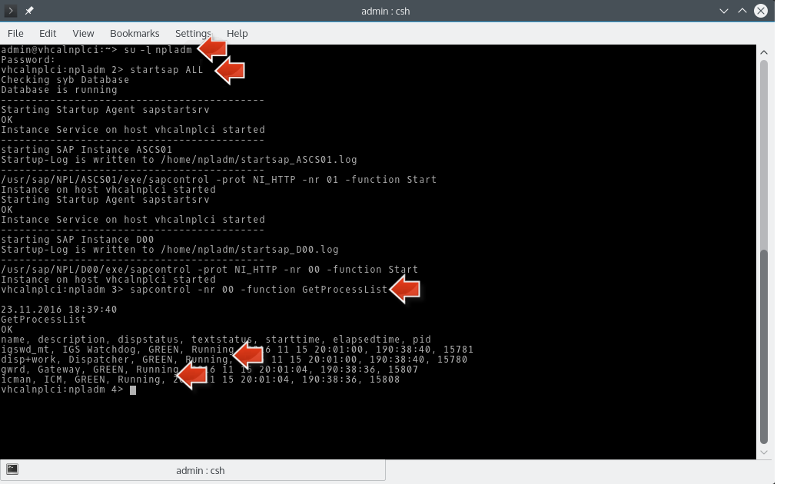

    The result should look as follows:

    ```
    GetProcessList
    OK
    name, description, dispstatus, textstatus, starttime, elapsedtime, pid
    igswd_mt, IGS Watchdog, GREEN, Running, 2017 ... , ... , ...
    disp+work, Dispatcher, GREEN, Running, 2017 ... , ... , ...
    gwrd, Gateway, GREEN, Running, 2017 ... , ... , ...
    icman, ICM, GREEN, Running, 2017 ... , ... , ...
    ```

> **Result of Step 10:** Your SAP NetWeaver and your Virtual Machine instance have been shut down and restarted from the latest Snapshot correctly. This should be done every time you want to suspend your VM.

[ACCORDION-END]

You have now successfully installed a SAP NetWeaver AS ABAP 7.50 system, which you may use for evaluation and personal education purposes. There are also a number of other tutorials, which are based on this installation of the server.
