## Prerequisites
- **Proficiency:** Intermediate
- **Tutorials:**
  - [Sign up for a free trial account on SAP Cloud Platform](https://developers.sap.com/tutorials/hcp-create-trial-account.html)
  - [Install SAP NetWeaver in openSUSE](https://developers.sap.com/tutorials/cp-s4-ext-install-nw.html)

## Next Steps
[Data Mart Scenario (Part 2): Replicate data using SLT](https://developers.sap.com/tutorials/cp-s4-ext-slt2-setup-slt.html)

## Details
### You will learn

You will create a new SAP HANA database schema in your SAP Cloud Platform Neo environment. You will run administrative steps and assign appropriate roles to the database user `SYSTEM` and create a second database user `ACME`, which you will use in the forthcoming exercises. Finally, you will set up your SAP HANA Development Environment in your Eclipse IDE and connect it to your new SAP HANA database.

### Time to Complete
**30 Mins**
---

[ACCORDION-BEGIN [Step 1:](Create new SAP HANA database on SAP Cloud Platform)]

In this step you will create a new [SAP HANA Multitenant Database Container (MDC)](https://help.sap.com/saphelp_hanaplatform/helpdata/en/62/3afd167e6b48bf956ebb7f2142f058/content.htm) in your SAP Cloud Platform account. In this tutorial we will refer to it as `HANA database`.
You want to replicate data from your on-premises SAP NetWeaver backend system into this database so that you can work with this data independently from backend system availability.

1.  Log in to your [SAP Cloud Platform Trial](https://account.hanatrial.ondemand.com/cockpit/) account and select the `Neo Trial` environment.

    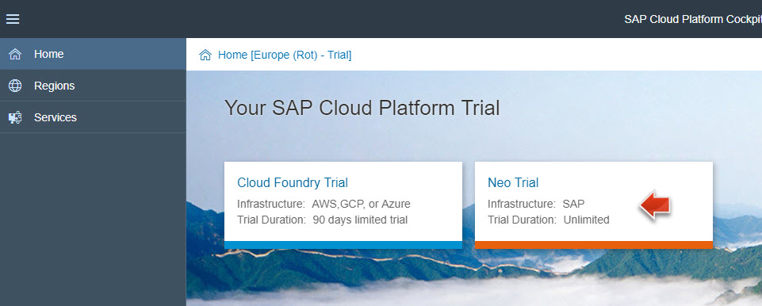

2.  Click on the **<p-user>trial** link to open the account dashboard, in case it is not already opened.

    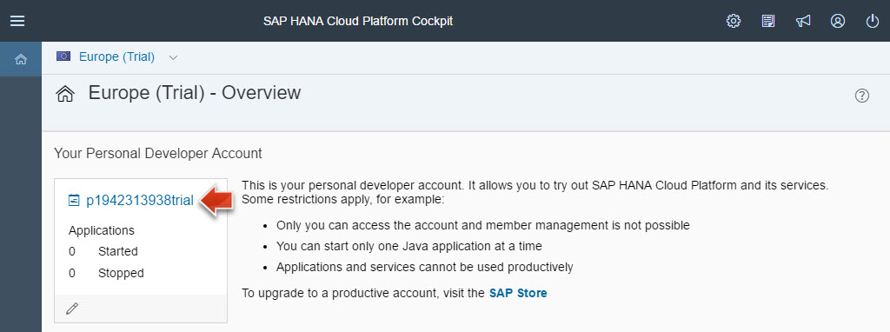

3.  Navigate to **SAP HANA / SAP ASE** | **Databases & Schemas**.

4.  Click on **New**.

    

5.  Enter the following values:

    -   Schema ID:  **`hana`**
    -   Database System: **`HANA MDC (<trial>)`**
    -   SYSTEM User Password: **`<enter a password and remember it>`** (min 15 characters)
    -   Repeat Password: **`<repeat password>`**
    -   Keep the default values of the other parameters.
    -   Click on **Save**.

    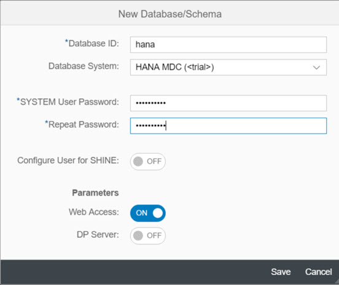

6.  Wait. The database creation process may take around 10 minutes. The final event log entry should state `Tenant DB creation finished successfully (created and configured)`.

    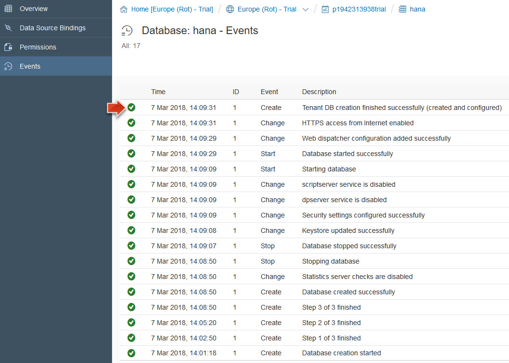

    > **Warning:**	The HANA database in your trial account is stopped automatically every 12 hours. So if you don't complete this tutorial in one sitting, you will need to restart the database before you continue with this tutorial. Additionally, please not that **if the SAP HANA multitenant database remains stopped for two weeks, it will be deleted from your SAP CP trial account!** In the SAP Cloud Platform Cockpit you can see the remaining time until this happens:
    > 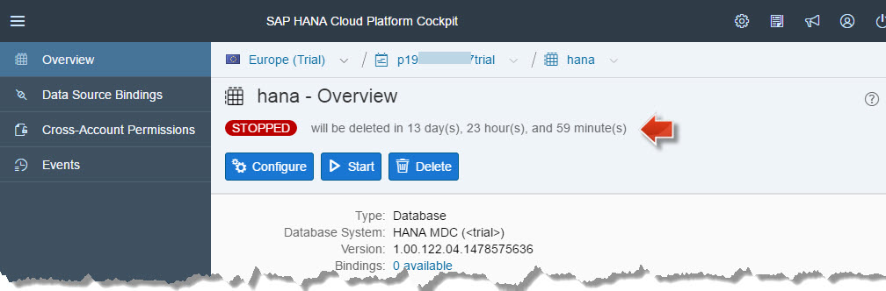

> **Result of Step 1:** You have now created and started your own SAP HANA database running in your SAP Cloud Platform trial account.

[ACCORDION-END]

[ACCORDION-BEGIN [Step 2:](Create new SAP HANA database user)]

In this step you will log in to the `SAP HANA Cockpit` (not to be confused with the `SAP Cloud Platform Cockpit`). This is a web interface that allows you to administer and monitor the HANA database running in your SAP Cloud Platform account. You will create a new database user called `ACME` that will be used for all consecutive interactions with the database. It is not a recommended practice to work with the `SYSTEM` user - created by default - so that there is always an admin user available with extended privileges, in case the ACME user should get locked or compromised.

2.  Click on **`hana`**, to open the overview page for your newly created HANA MDC database.

    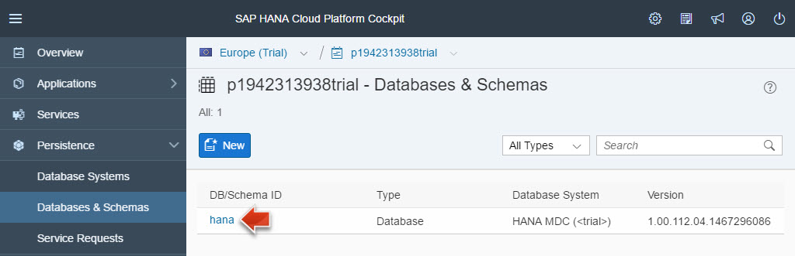

3.  Open the `Administration Tools` by clicking on **SAP HANA Cockpit**

    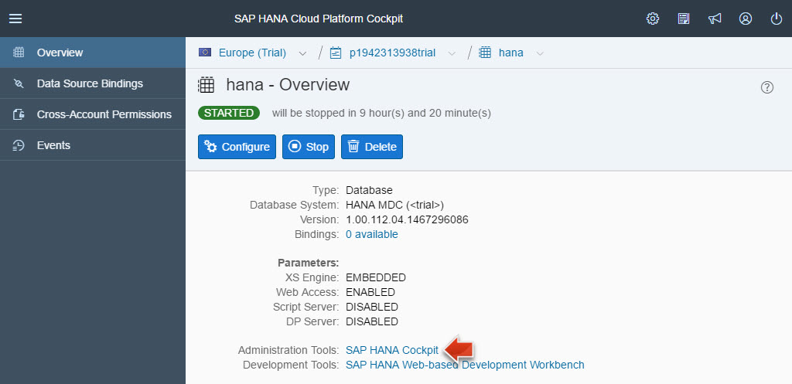

4.  Login with the user `SYSTEM` and the password you set in step 1.

5.  An information dialog opens, telling you that you are not authorized to open the SAP HANA Cockpit. Once you click on **OK**, the user `SYSTEM` will be assigned the necessary roles. Click on **Continue**.

    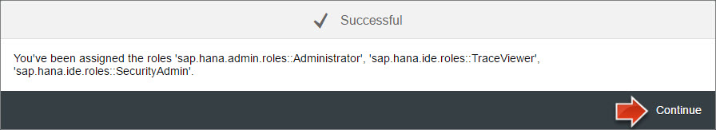

6.  You should see a `Successful` dialog window, which you confirm with **Continue** to open the HANA cockpit in a new window.

7.  Click on the `Manage Roles and Users` tile.

    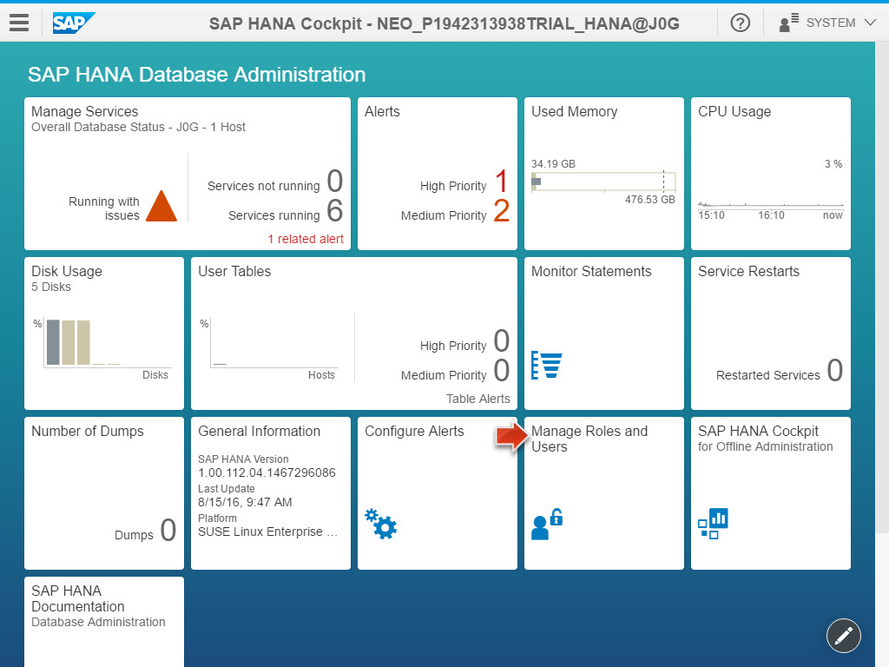

8.  A new tab `SAP HANA Web-based Development Workbench: Security` has opened for managing database users and their roles on the HANA database.

    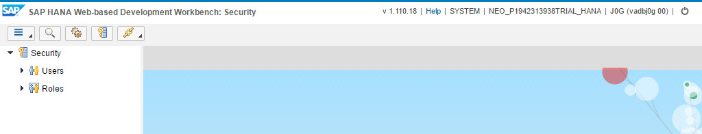

9.  Select **New** | **User** from the menu.

    

10. Enter **`ACME`** as `username` and provide an `initial password`. It will be changed upon first logon with the ACME user.

    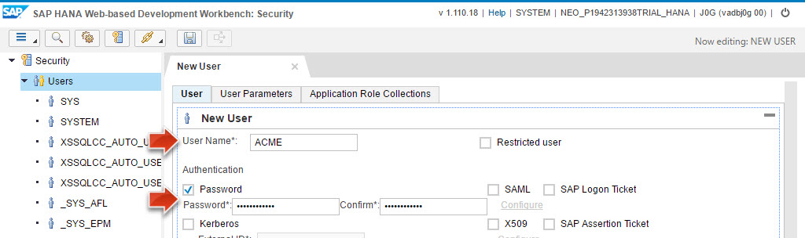

11. Navigate to the tab **Granted Roles** and add the following roles by pressing the **`+`** icon:
    -   `sap.hana.xs.ide.roles::Developer` `(for doing database development, e.g. enabling OData services)`
    -   `MODELING` `(for modeling HANA analytical views)`

    

12. Switch to the tab **System Privileges** and add the following system privileges by pressing the **`+`** icon:
    -   `CREATE SCHEMA` `(for SLT replication)`
    -   `ROLE ADMIN` `(for SLT replication)`
    -   `USER ADMIN` `(for SLT replication and to reactivate the SYSTEM user in case it should get locked.)`

    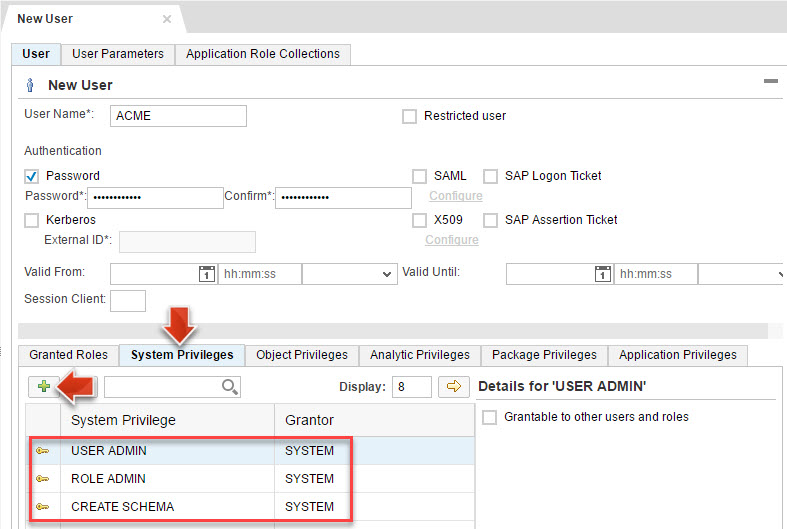

13. Navigate to the tab **Package Privileges**
    -   Add the `.REPO_PACKAGE_ROOT` by pressing the **`+`** icon.
    -   In the right-hand section `Privileges for 'Root Package'`, select the checkbox `ALL` for granting write access to the root folder.

    

14. Click **Save** icon in the toolbar of the `Security` cockpit.

    

15. Please verify that the user has been saved by checking the event log in the bottom right corner.

    

> **Result of Step 2:** You have now created a new user ACME in the SAP HANA database running in your SAP Cloud Platform trial account. This new user has now the required roles and privileges for replicating data from a SAP NetWeaver system.

[ACCORDION-END]

[ACCORDION-BEGIN [Step 3:](Install SAP HANA Development plugins in Eclipse)]

In this step you will download and install the SAP HANA Development plugins for your `Eclipse IDE`.

1.  Go to [https://www.eclipse.org](https://www.eclipse.org) and download `Eclipse Neon`.

2.  Install the `Eclipse IDE for Java Developers` - in windows, you might need to right-click the installer and select the option **Run as Administrator**.

3.  In case you are working in an environment requiring a network proxy to connect to the internet, you can set the proxy here: **Window** | **Preferences** | **General** | **Network Connections**

4.  From the Eclipse menu, choose **Help** | **Install New Software…**

5.  Copy the repository URL [https://tools.hana.ondemand.com/neon/](https://tools.hana.ondemand.com/neon/) and paste it in the `Work with` field and then press the Enter (or Return) key.

6.  From the results, select the packages **ABAP Development Tools for SAP NetWeaver** and **SAP HANA Tools** and install the same:

    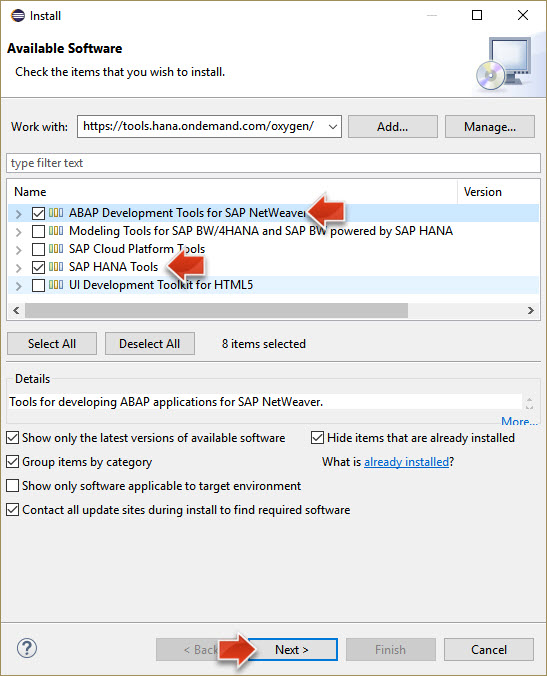

7.  You will need to accept the license terms, confirm that you want to install the plugins from the SAP repository and then restart Eclipse.

> **Result of Step 3:** You have now successfully installed the `ABAP Development Tools for SAP NetWeaver` and `SAP HANA Tools` plugins in your Eclipse IDE.

[ACCORDION-END]

[ACCORDION-BEGIN [Step 4:](Connect dev environment to SAP HANA)]

In this step you will connect this SAP HANA Development Environment to the SAP HANA database running in your SAP Cloud Platform trial account.

1.  Open your Eclipse IDE.

3.  Add the `SAP HANA Development` perspective, by clicking on **Window** | **Perspective** | **Open Perspective** | **Other** or by clicking the **Open Perspective** icon in the toolbar.

    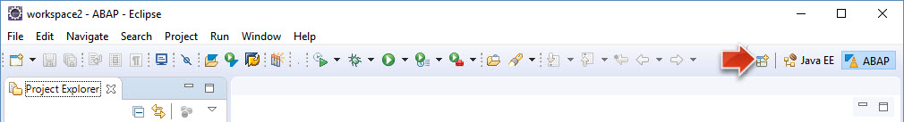

4.  Open the `SAP HANA Development` perspective.

5.  Now open the `Systems` view from the menu: **Window** | **Show View** | **Other** | **SAP HANA** | **Systems** | **Open**.

6.  Click on the little arrow next to the **Create** icon to open a context menu and select **Add Cloud System...**

    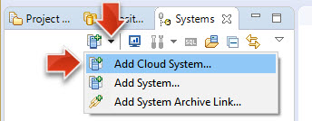

7.  In the `Add SAP Cloud Platform System` you need to provide the logon data of your SAP CP trial account, NOT of your HANA database:
    -   Account name: **`<your SAP CP trial account name>`**
    -   User name: **`<your SAP CP trial account user>`**
    -   Password: **`<your SAP CP trial account password>`**
    -   Click on **Next**.

    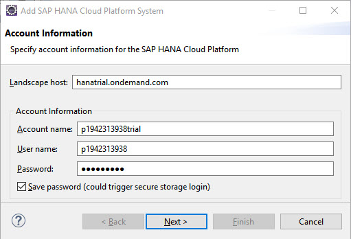

8.  In the `SAP HANA Schemas and Databases` wizard screen, please provide the following information:
    -   Database: **`hana`**
    -   Database User: **`ACME`**
    -   Database Password: **`<initial password you set above>`**
    -   Uncheck the **`Save database password`** checkbox, as you will change the `initial password` in the next step.
    -   Click on **Finish**

    

9.  Change the `initial password` for the `ACME` user:
    -   Old password: **`<initial ACME password>`**
    -   Password: **`<set a permanent password for the ACME user>`**
    -   Repeat: **`<repeat permanent password>`**
    -   Click **OK**.

    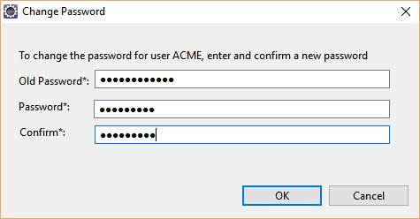

    -   You should now see a successful confirmation message: `Password for user ACME changed.`

10. You can now see that a `System` has been added in the section on the left. It represents a connection to the SAP HANA database in your SAP CP account with the ACME user.

    

> **Result Step 4:** You have now successfully set up the `SAP HANA Development` environment in your Eclipse IDE. You have changed the initial password for the ACME database user and connected the SAP HANA Development environment to the SAP HANA database running in your SAP Cloud Platform account.

[ACCORDION-END]
