## Prerequisites
 - **Proficiency:** Intermediate
 - **Tutorials:** [Data Mart Scenario (Part 1): Set up SAP HANA database on SAP Cloud Platform](https://developers.sap.com/tutorials/cp-s4-ext-slt1-hana-mdc.html)
 - **Systems, Tools, Services:**
   -   SAP HANA database in SAP Cloud Platform trial account
   -   SAP S/4HANA backend system in `VirtualBox`
   -   SAP Cloud Connector in `VirtualBox`
   -   ABAP in Eclipse
   -   SAP Landscape Transformation Replication Server

## Next Steps
- [Data Mart Scenario (Part 3): Create an OData Service in SAP HANA](https://developers.sap.com/tutorials/cp-s4-ext-slt3-hana-odata.html)

## Details
### You will learn
In this tutorial you will set up a data replication job using the SAP Landscape Transformation Replication Server (SLT). This replication job will replicate sales order data, product data and product ratings from your SAP backend system to the SAP HANA database running in your SAP Cloud Platform account.

### Time to Complete
**60 Mins**
---

[ACCORDION-BEGIN [Step 1:](Ensure SAP HANA database is running)]

In this step you will ensure that the SAP HANA database you created in the previous tutorial is started. In the trial environment the database is stopped every 12 hours.

1.  Log in to your [SAP Cloud Platform Trial](https://account.hanatrial.ondemand.com/cockpit/) account.

2.  Navigate to **Neo trial** | **SAP HANA / SAP ASE** | **Databases & Schemas** and click on the `hana` database you created in the previous tutorial.

    

3.  If your database status is `STOPPED`, you need to click on the **Start** button.

    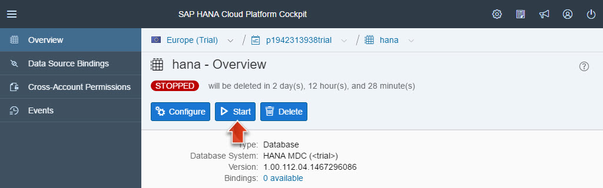

4.  The startup procedure should take no more than 30 seconds. You need to refresh the browser manually in order to see the status change.

5.  Your database should now be in status `STARTED`.

    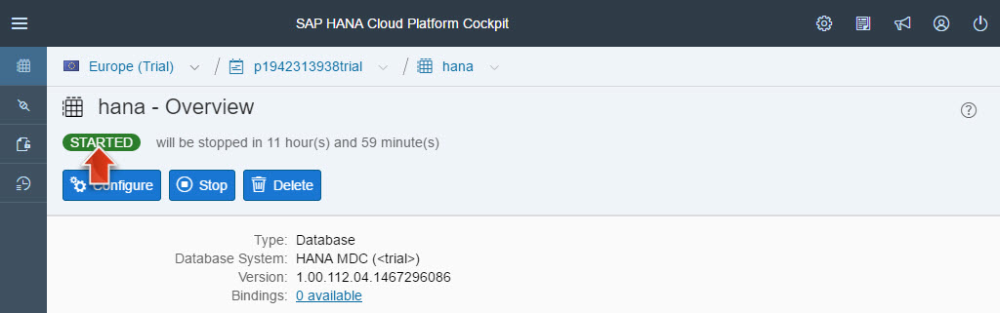

[ACCORDION-END]

[ACCORDION-BEGIN [Step 2:](Ensure VM with SAP NetWeaver is running)]

1.  Start your virtual machine with the NetWeaver installation (created in the previous tutorial).

2.  Open a `Konsole` terminal window ( **Application Menu** | **System** | **Konsole** ).

3.  Execute the following three commands to start and check the installed SAP NetWeaver AS ABAP:

4.  Execute **`su -l npladm`** (will ask for `SAP NetWeaver AS ABAP` `system password`) to switch to `NetWeaver Admin` user, so that you act in this `Konsole` as this user and its permissions.

5.  Execute **`startsap ALL`** to start the ABAP server (if not already).

6.  Execute **`sapcontrol -nr 00 -function GetProcessList`** to check that the processes are running and are all `GREEN`

    > **Note:** As `startsap ALL` can take some time, repeat the command execution a few times until all four processes `(IGS Watchdog, Dispatcher, Gateway, ICM)` are `GREEN`.

    The result should look as follows:

    ```
    GetProcessList
    OK
    name, description, dispstatus, textstatus, starttime, elapsedtime, pid
    igswd_mt, IGS Watchdog, GREEN, Running, 2017 ... , ... , ...
    disp+work, Dispatcher, GREEN, Running, 2017 ... , ... , ...
    gwrd, Gateway, GREEN, Running, 2017 ... , ... , ...
    icman, ICM, GREEN, Running, 2017 ... , ... , ...
    ```

    

[ACCORDION-END]

[ACCORDION-BEGIN [Step 3:](Ensure environment  connected to SAP HANA DB)]

1.  Open your Eclipse IDE.

2.  Ensure that you have opened the `SAP HANA Development` perspective and the `Systems` view.

    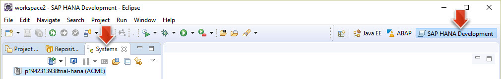

3.  In case you are not logged on yet, right-click on your HANA system and select `Log on` from the context menu. In the consecutive popup provide the password you specified for the `ACME` database user in the previous tutorial.

    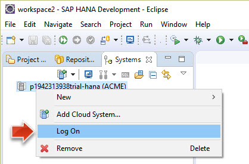

4.  Expand the `Catalog` folder. You can now see the existing schemas of your HANA database.

    

> **Result of Step 3:** You have successfully connected your SAP HANA Development environment to the SAP HANA database running in your SAP Cloud Platform account using the dedicated ACME database user. You are now able to inspect the contents of the database in Eclipse.

[ACCORDION-END]

[ACCORDION-BEGIN [Step 4:](Set up service channel in SAP Cloud Connector)]

In this step you will install the current version of `SAP Cloud Connnector` and set up a `Service Channel`. This service allows your SAP NetWeaver backend system to connect to the HANA database running in your SAP Cloud Platform account.

1.  Install SAP Cloud Connector as described in [this tutorial](https://www.sap.com/developer/tutorials/cp-connectivity-install-cloud-connector.html). You may chose to install this in your host operating system, or in the openSUSE Linux running in your `VirtualBox` VM.

2.  Connect the SAP Cloud COnnector to your SAP Cloud Platform trial account.

4.  Click on **On-Premise to Cloud** and the **+** (Add...) icon.

    

5.  Specify the Service Channel Type: `HANA Database` and press **Next**.

    | Property              | Value      |
    | --------------------- | ---------- |
    | HANA Instance Name    | **`hana`** |
    | Local Instance Number | **`01`**   |
    | Enabled               | **`true`** |

    -   Click on **Finish**.

    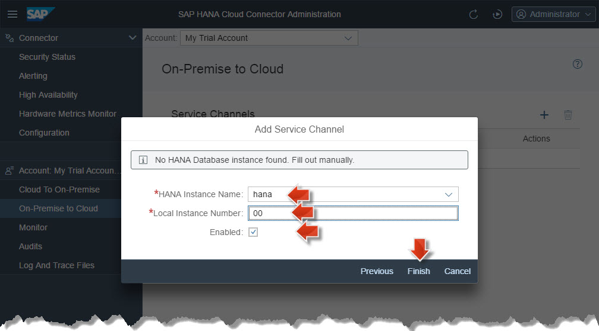

6.  You can see that a new Service Channel has been created and enabled. The service state icon should be green.

    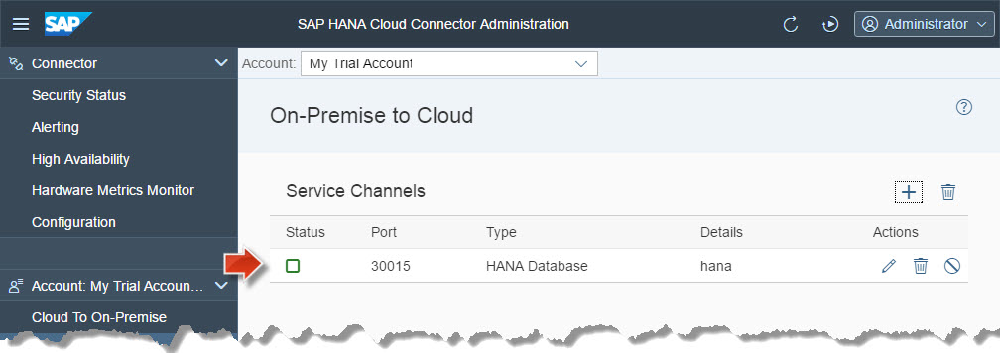

> **Result of Step 4:** You have now installed SAP Cloud Connector and set up a Service Channel to your SAP Cloud Platform account, establishing the communication channel between your SAP NetWeaver backend system and the SAP HANA database in your SAP CP account.

[ACCORDION-END]

[ACCORDION-BEGIN [Step 5:](Set up SLT data replication)]

In this step you will set up a data replication job between your SAP NetWeaver backend system and the SAP HANA database running in your SAP Cloud Platform account. You will do this using SLT by opening the SAP backend transaction `LTRC`.

1.  Open up Eclipse and switch to the `ABAP` perspective by selecting **Window** | **Perspective** | **Open Perspective** | **Other** | **ABAP**. (Alternatively, you might also use SAP Logon to perform these steps.)

    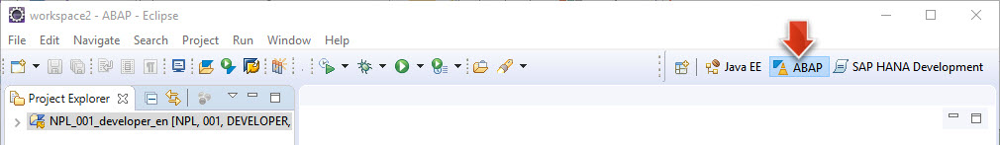

2.  Double-click on your ABAP Project `NPL_001_xxxxxx` to connect to the SAP NetWeaver backend system running in your `VirtualBox`.

3.  In case you get asked, log on using the following credentials:

    | Property | Value           |
    | -------- | --------------- |
    | Client   | **`001`**       |
    | User     | **`Developer`** |
    | Password | **`Appl1ance`** |

4.  Click on **Run** | **Run ABAP Development Object...** from the menu, or select the corresponding icon from the toolbar.

    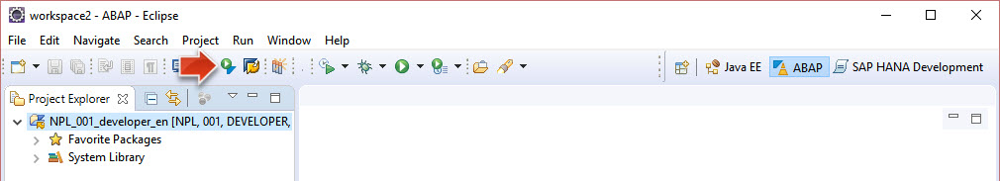

5.  Search for and select the transaction `LTRC` and click on **OK**.

    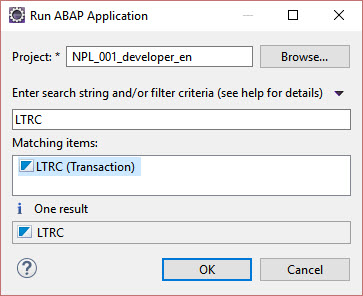

6.  A new window called `SAP LT Replication Server - Cockpit: Overview` will open in Eclipse. This is the transaction that allows us to set up replication jobs in the SAP NetWeaver backend system.

7.  Click on the **Create Configuration** button.

    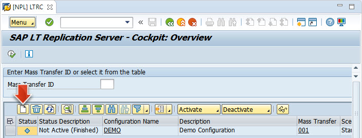

    > **Hint:** In Eclipse installations in MacOS, the button `Create Configuration` does not respond with the first click. The work-around for this bug is to click on some other button in the toolbar first, for example, the button `i` and then now click on the button `Create Configuration`. Now it opens a new wizard.

8.  In the wizard, enter the following data, and leave the remaining settings as default:
    -   **Specify General Data** | **General Data**:
    -   Configuration Name: `SLT_REPLICATION` (Please use this name, as we will refer to it later.)
    -   Click **Next**

    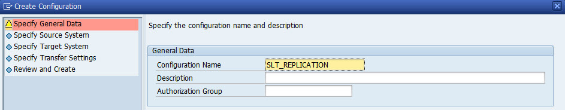

9.  **Specify Source System** | **System Data**:

    | Property              | Value          |
    | --------------------- | -------------- |
    | RFC Connection        | **`selected`** |
    | RFC Destination       | **`NPL`**      |
    | Allow Multiple Usage  | **`selected`** |

    -   Click **Next**

    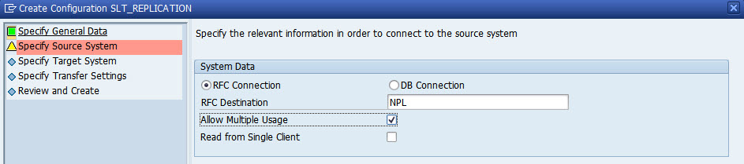

10. **Specify Target System** | **System Data**:

    | Property                 | Value           |
    | ------------------------ | --------------- |
    | DB Connection            | **`selected`**  |
    | Database System          | **`HANA`**      |
    | Administration User Name | **`ACME`**      |
    | Password                 | **`<ACME user password>`** (You changed the initial password of the ACME user when you first logged on in the previous tutorial.) |
    | Host Name                | **`localhost`** |
    | Instance Number          | **`01`**        |
    | Logical Port Number      | **`15`**        |

    -   Click **Next**

    Please note that even though the target system is running remotely on SAP Cloud Platform, you may use the host `localhost` here, as you established a service channel in the SAP HANA Cloud Connector.

    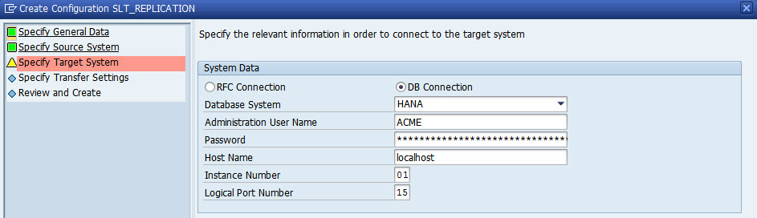

11. **Specify Transfer Settings** | **Job Options**:

    | Property | Value |
    | ------------- | ------------ |
    | Number of Data Transfer Jobs  | **`4`** |
    | Number of Initial Load Jobs  | **`4`** |
    | Number of Calculation Jobs  | **`1`** |

    -   Click on **Next**.

    These settings specify how many jobs should be used to replicate the data. We strongly advise you to use the settings specified above, as your system might become unresponsive otherwise.

    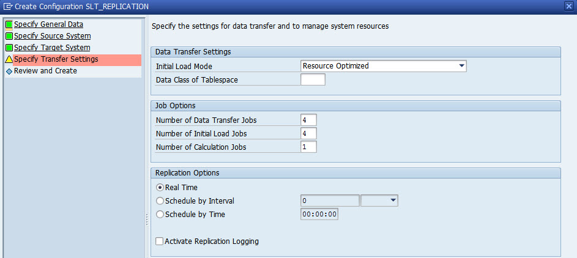

12. Review all of the settings and click on **Create**.

    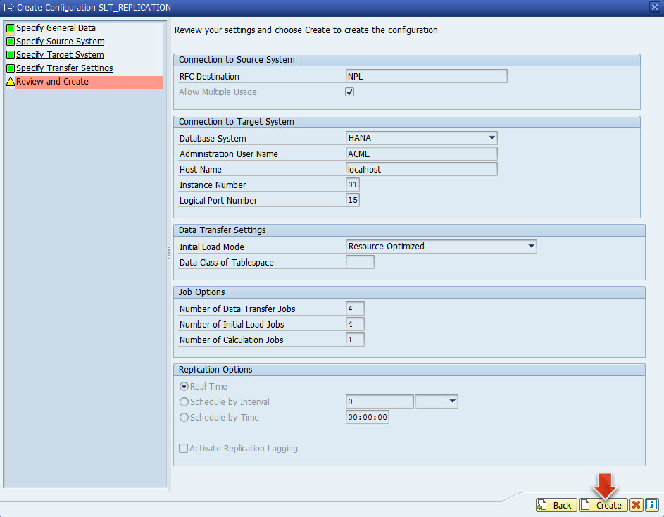

13. As a result you will now see that a new job `SLT_REPLICATION` has been created.

14. Double-click on `SLT_REPLICATION` to see that already three administrative tables are specified for replication in the `Table Overview` tab.

    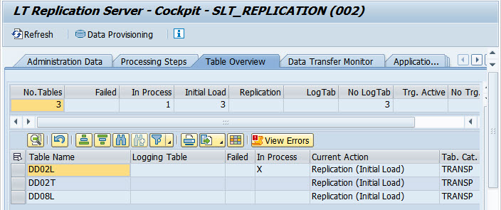

> **Result of Step 5:** You have now created an initial SLT replication job in your SAP NetWeaver backend system and are now replicating data to your SAP HANA database running in your SAP Cloud Platform account.

[ACCORDION-END]

[ACCORDION-BEGIN [Step 6:](Verify initial data replication result)]

In this step you will verify that the data replication is working as it should. You will look at the SAP HANA database running in your SAP CP account to verify that the control tables that were created in the `SLT_REPLICATION`scheme are being replicated.

1.  In Eclipse, switch to the `SAP HANA Development` perspective.

2.  In the `Systems` view on the left side, right-click on your HANA database and select **refresh** from the context menu, to retrieve the latest data from the HANA database running in your SAP CP trial account.

    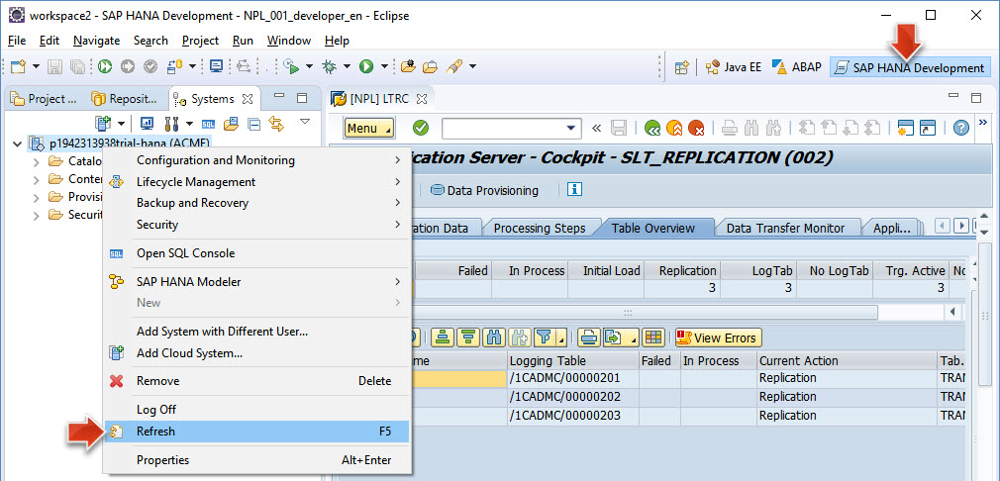

3.  Expand the node **Catalog** | **`SLT_REPLICATION`** | **Tables**.

    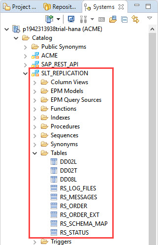

4.  Please note that the new `SLT_REPLICATION` schema now exists on the database. It was created as a result of setting up the `SLT_REPLICATION`schema in your backend system.

5.  You will now find a total list of nine tables, consisting of the three control tables in your `SLT_REPLICATION` scheme and some additional six tables starting with `RS*`.

> **Result of Step 6:** You have verified that the data replication is working. The new `SLT_REPLICATION` schema now exists on your SAP HANA database running in your SAP Cloud Platform account. It was created as a result of setting up the `SLT_REPLICATION`schema in your SAP NetWeaver backend system.

[ACCORDION-END]

[ACCORDION-BEGIN [Step 7:](Add data tables to SLT replication job)]

In this step we are going to add the actual backend database tables containing sales order and product data to the `SLT_REPLICATION`scheme and start the replication of these tables to the HANA database running on SAP CP.

1.  Go back to the `LTRC` transaction. (This is the window with the title `LT Replication Server - Cockpit` in your Eclipse IDE.)

2.  Click on **Data Provisioning** in the toolbar.

    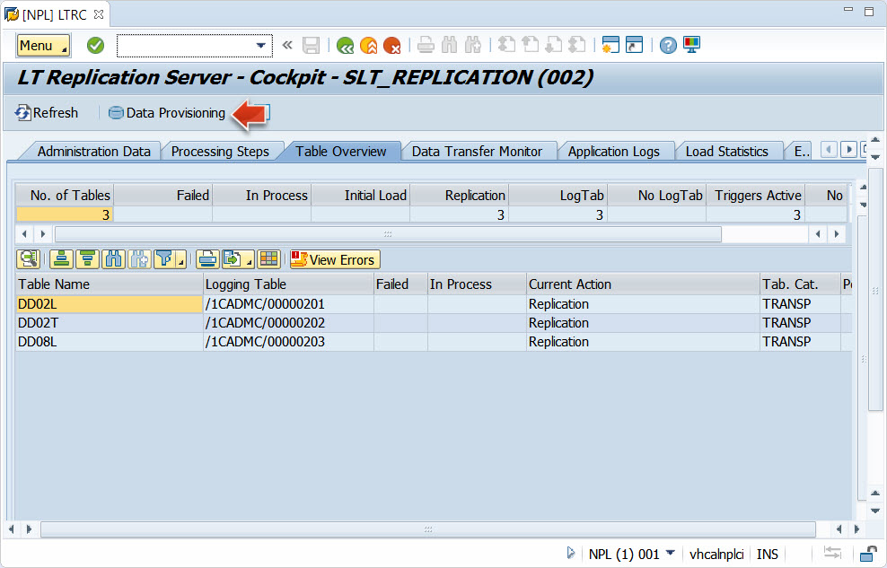

3.  Click on the icon for `Multiple selection` to the right of the text field.

    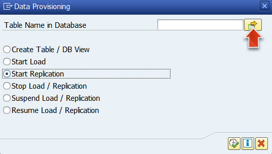

4.  Enter the following table names to be replicated, and click on **Execute**:

    | Database Table Name | Table Contents        |
    |---------------------|-----------------------|
    | `SNWD_PD` | (Product ID, price, category)   |
    | `SNWD_SO` | (Ordered quantities)            |
    | `SNWD_SO_I` | (Ordered Items)               |
    | `SNWD_SO_SL` | (Ordered quantities)         |
    | `SNWD_TEXTS` | (Product names)              |
    | `SNWD_REV_HEAD` | (Average ratings)         |

    

    > **Note:** Even though you can only see the `SNWD_PD` entry in the `Table Name in Database` field, the other entries are also selected in the background due to the multiple selection. You can see this, as the icon next to the text field is now green.

5.  Select the `Start Replication` radio button, and click on **Execute** to start the data replication.

    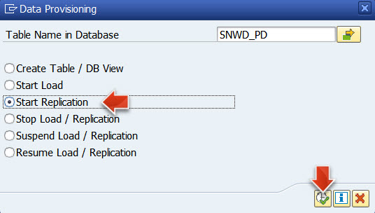

6.  The tables selected for replication will be in status `Scheduled` first, then in status `Replication (Initial Load)` and finally in status `Replication`. You need to reload the screen, in order to track the status changes.

    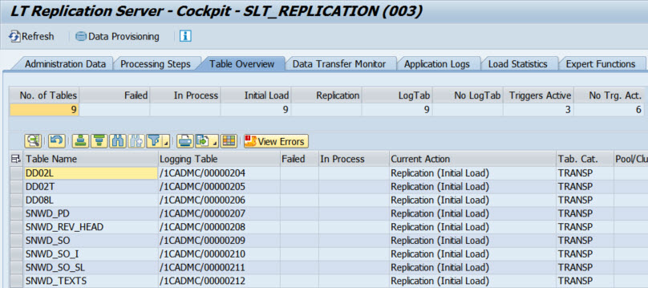

    Please note how the indicators and states in the `Current Action` and `In Process` columns change with each `refresh`.

    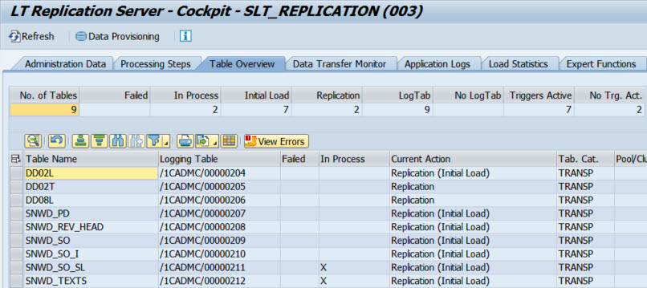

7.  Switch to the tab `Data Transfer Monitor` to see which data transfers are still outstanding.

    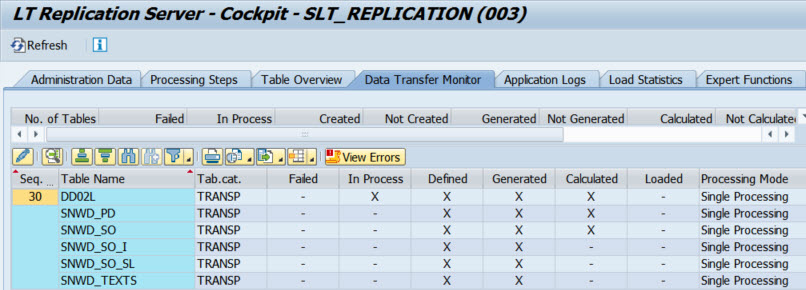

8.  Click on **Refresh** repeatedly to see the progress.

9.  Finally, as a result, in the `Table Overview` tab, all the tables should have the status `Replication`.

    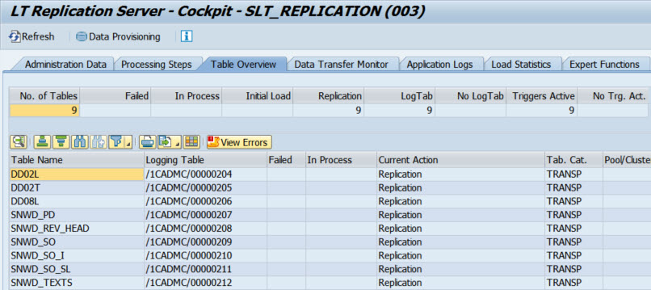

> **Result of Step 7:**  You have now added all data tables to the `SLT_REPLICATION` scheme and started the replication process. Please be aware that this is a very resource intensive process and might take some time if you are doing this course using the minimum system requirements.

[ACCORDION-END]

[ACCORDION-BEGIN [Step 8:](Verify successful data replication)]

In this step you are going to verify that the data replication is running successfully. Please note that the replication will run continuously, and not only do an initial load. You will open the transaction SE16 in the SAP NetWeaver backend system and you will compare the table contents to the same table in your SAP HANA database on SAP CP using the SAP HANA Development perspective in your Eclipse IDE.

1.  In the `Systems` view of the `SAP HANA Development` perspective, open your database in SAP CP and perform a refresh.

    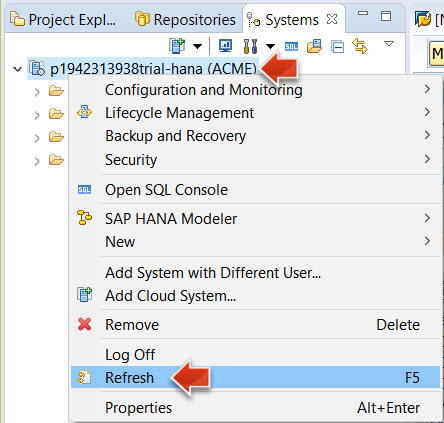

2.  Navigate to **Catalog** | **SLT Replication** | **Tables**

3.  You can see that the new tables have now been added to the tables of the `SLT_TRANSFORMATION` replication scheme.

    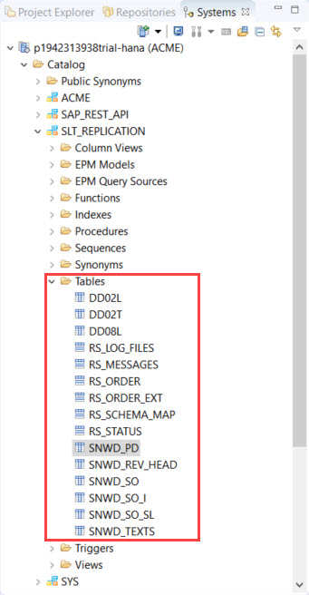

4.  Perform a right click on the `SNWD_PD` table and select **Open Content**.

    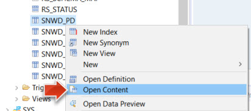

5.  As a result, you will see that the table in your HANA DB on SAP CP now contains `123 entries`. If the number is less than that, wait, refresh and see if the number is increasing. This would mean that the initial data replication is still running.

    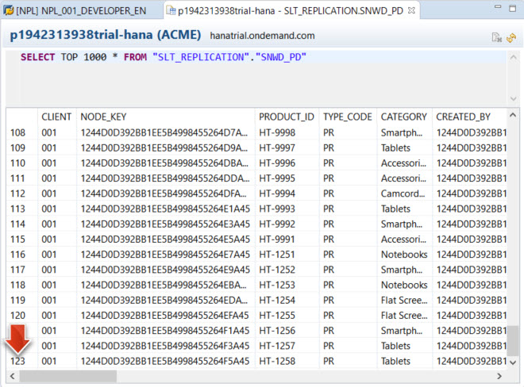

6.  Now you want to verify that the same amount of entries exist in the source `SNWD_PD` table in your local backend system.

7.  In the `ABAP` perspective in Eclipse, select **Run** | **Run ABAP Development Object**.

    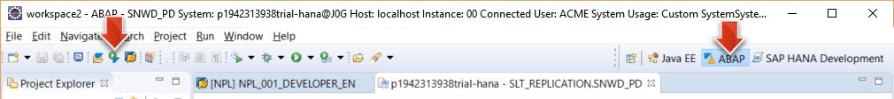

8.  Search and open transaction `SE16`.

9.  Enter table name `SNWD_PD`, hit **ENTER** and then execute the transaction to open the database table.

    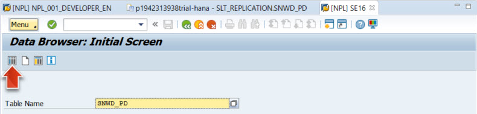

10. In the toolbar of the transaction click on `Number of Entries`. As a result, you can see that the source database table in your backend system also contains `123 entries`.
    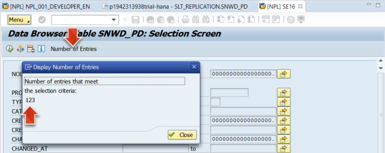

> **Result of Step 8:** You have verified that the business data is successfully being replicated to the SAP HANA database running in your SAP Cloud Platform account.

[ACCORDION-END]

[ACCORDION-BEGIN [Step 9:](Create VM snapshot)]

After you have successfully replicated the tables using SAP Landscape Transformation Server to the SAP HANA in the SAP Cloud Platform, please take a snapshot of this Virtual Machine state. You can revert to this snapshot, in case your system should get corrupted for any reason.

1.  In the running Oracle VM `VirtualBox` window menu: **Choose Machine** | **Take Snapshot...**

    

2.  In the opened window enter a name `ABAP with SCC and SLT Replication` and click on **OK**.

> **Result of Step 9:** You have created a snapshot of your backend system status as a backup.

[ACCORDION-END]
