## Prerequisites
 - **Proficiency:** Intermediate
 - **Tutorials:**
   - [Data Mart Scenario (Part 2): Replicate data using SLT](https://www.sap.com/developer/tutorials/cp-s4-ext-slt2-setup-slt.html)
 - **Systems, Tools, Services:**
   -   SAP HANA database in SAP Cloud Platform trial account
   -   SAP S/4HANA backend system in VirtualBox
   -   SAP Cloud Connector in VirtualBox
   -   ABAP in Eclipse
   -   SAP Landscape Transformation Replication Server

## Details
### You will learn
In this tutorial you will create a HANA XS development project for the HANA database running on SAP Cloud Platform. You will create a new database view to analyze product data in your database. You will then create an OData service based on this new analytical view, so that you can consume and use the data in a SAP Fiori application to analyze this data.

### Time to Complete
**80 Mins**
---

[ACCORDION-BEGIN [Step 1:](Ensure SAP HANA database is running)]

In this step you will ensure that the SAP HANA database operating in your SAP Cloud Platform trial account is started, as databases in the trial environment are stopped every 12 hours.

1.  Open your [SAP Cloud Platform trial account](https://account.hanatrial.ondemand.com/cockpit#/).

2.  Navigate to **Neo Trial** | **SAP HANA / SAP ASE** | **Databases & Schemas** and click on the `hana` database which you created in a previous part of this tutorial.

    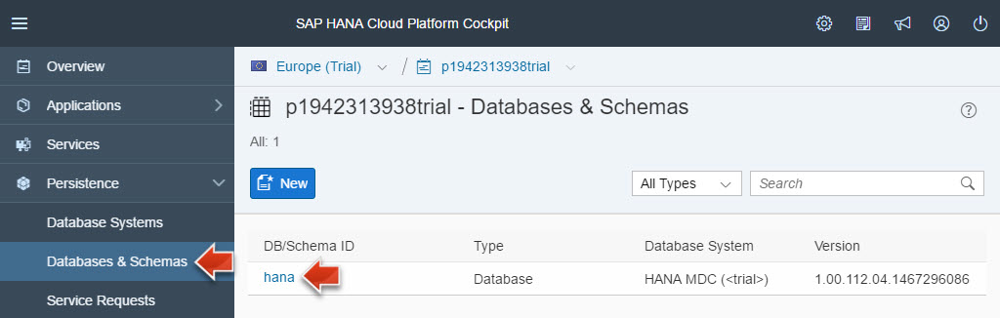

3.  If your database is in status `STOPPED`, you need to click on the **Start** Button.

    

4.  The startup procedure should take no more than 30 seconds. You need to refresh the browser manually in order to see the status change.

5.  Your database should now be in status `STARTED`.

    

> **Result of Step 1:** You have now verified that the SAP HANA database operating in your SAP Cloud Platform account is started.

[ACCORDION-END]

[ACCORDION-BEGIN [Step 2:](Ensure VM with NetWeaver ABAP is running)]

In this step you will verify that your SAP NetWeaver system is running and operational. If you took a longer break or shut down your system, you might want to restore the VirtualBox snapshot `ABAP with SCC and SLT Replication` before you continue.

1.  Log on to your SAP NetWeaver backend system as described in step 5 of the preceding tutorial [Replicate Data using SLT](https://www.sap.com/developer/tutorials/cp-s4-ext-slt2-setup-slt).

2.  If you cannot log on to the system, then open your `openSUSE` desktop in `VirtualBox`, otherwise you may continue with step 3 below.

3.  Open a `Konsole` terminal ( **Application Menu** | **System** | **Konsole** ).

4.  Execute the following three commands to start and check the installed NetWeaver AS ABAP:

5.  Execute **`su -l npladm`** (will ask for `SAP NetWeaver AS ABAP` `system password`) to switch to `NetWeaver Admin` user.

6.  Execute **`startsap ALL`** to start the ABAP server (if not already).

7.  Execute **`sapcontrol -nr 00 -function GetProcessList`** to check that the processes are running and are all `GREEN`

> **Result of Step 2:** You have verified that your SAP NetWeaver backend system is running and operational.

[ACCORDION-END]

[ACCORDION-BEGIN [Step 3:](Ensure SAP Cloud Connector is running)]

In this step you will verify that your SAP Cloud Connector is running and operational.

1.  In the running `Oracle VM VirtualBox` open a `Konsole` (KDE **Application Menu** | **System** | **Konsole**)

2.  Check `SCC` status:

3.  Execute **`sudo service scc_daemon status`** (will ask for root password) to get the SCC status output.

4.  If status output is:

    -   `Active: active` then Cloud Connector is up and running and you can continue with the tutorial.

        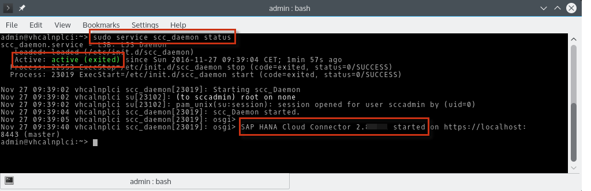

    -   `Active: inactive` then start SAP Cloud Connector using the following command: **`sudo service scc_daemon start`** and check the status again as explained above.

        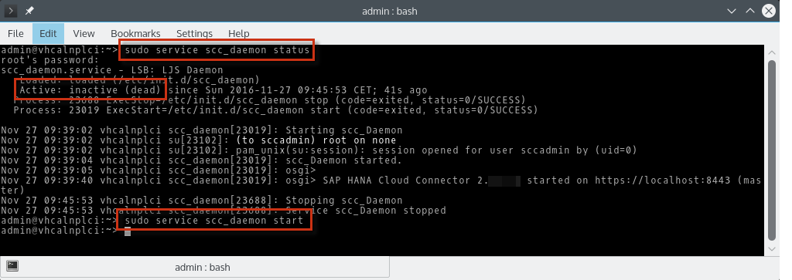

> **Result of Step 3:** Your SAP Cloud Connector is up and running.

[ACCORDION-END]

[ACCORDION-BEGIN [Step 4:](Create analytical view and OData service)]

In this step you are going to import a new database view to your SAP HANA database that is used to analyze the product data in your company. You are going to enable this view as OData service, so that you can build a graphical UI extension on top of this service.

1.  Open Eclipse and switch to the `SAP HANA Development` perspective. You should be looking at the **SAP HANA** | **Repositories** view.

    

2.  Right-click on your HANA database in the `Repositories` view. From the context menu, select `Create Repository Workspace`. If necessary, provide your logon data for the ACME user.

    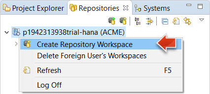

3.  In the popup, use the default settings to `Create a new Repository Workspace` and click on **Finish**.

    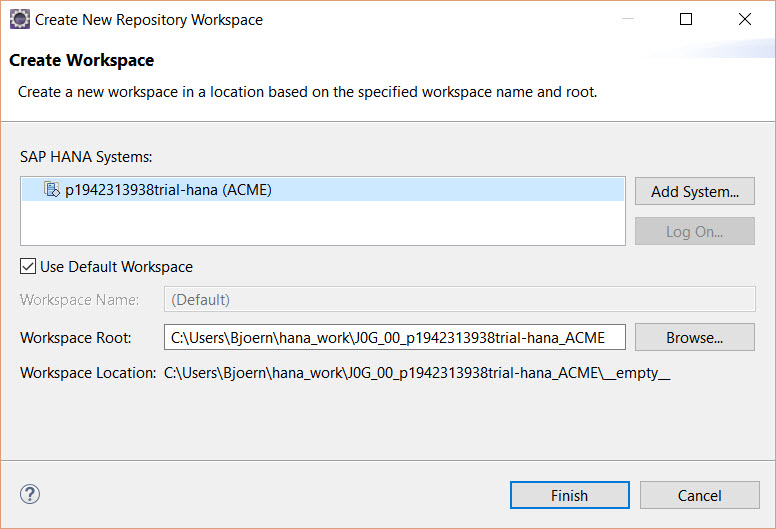

4.  Switch to the `Project Explorer` view.

5.  Create a new XS Project, by clicking on **File** | **New** | **XS Project**.

    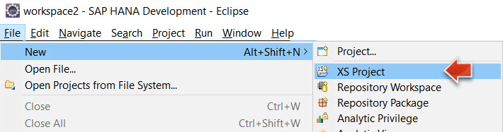

6.  In the `New XS Project` wizard, leave the default settings unless specified otherwise:
    - Project Name: `s4ext`
    - Create a new `HANA` working set:
        -   Click on **Working sets** | **New...**
        -   Working set name: `HANA`
        -   Do not select any working set contents.
        -   Click on **Finish**.
    - Select the checkbox for `Add project to working sets`
    - Working Sets: `HANA`
    - Click on **Next**.

    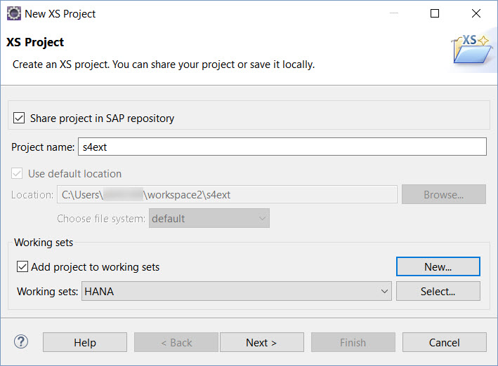

    - Repository Package: `com.acme.s4ext`
    - Click on **Next**.

    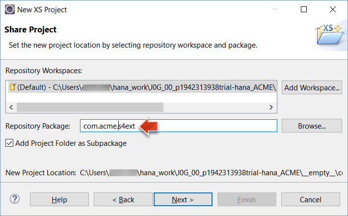

    - Uncheck the `Access Objects` for `XS Application Access` and `XS Application Descriptor`. They should NOT be selected.

    > **Hint:** Later we will import the sources for this project and this import will contain a `.xsacces` and a `.xsapp` file. So they are not needed here.

    - Click on **Finish**.

    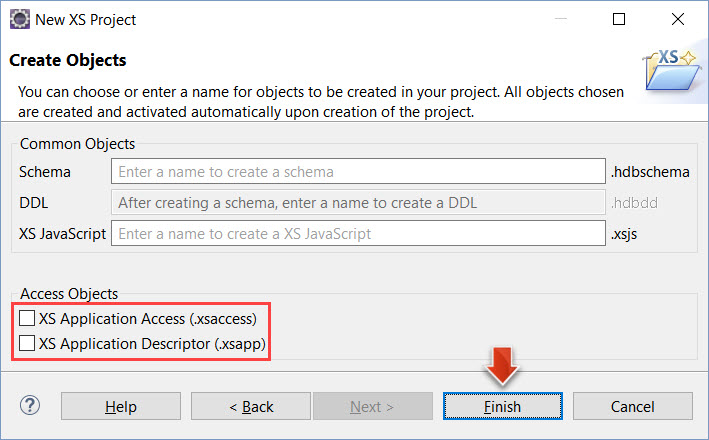

7.  Add the working set `HANA` to the `Project Explorer` view, by clicking on the **Project Explorer menu** | **Select Working Set...**.

    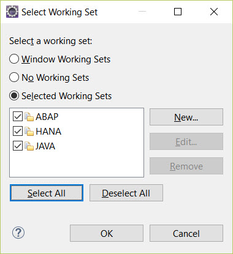

8.  Expand the `HANA` working set.

9.  Open the context menu for the `s4ext` project and select **Import...**

    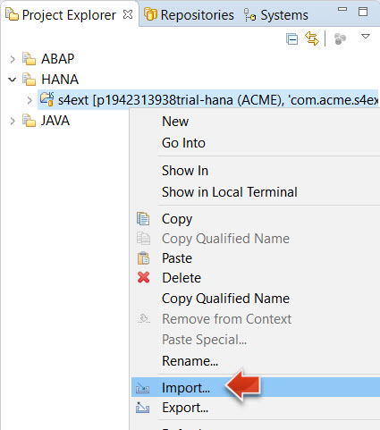

10. Select **General** | **Archive File** | **Next**.

    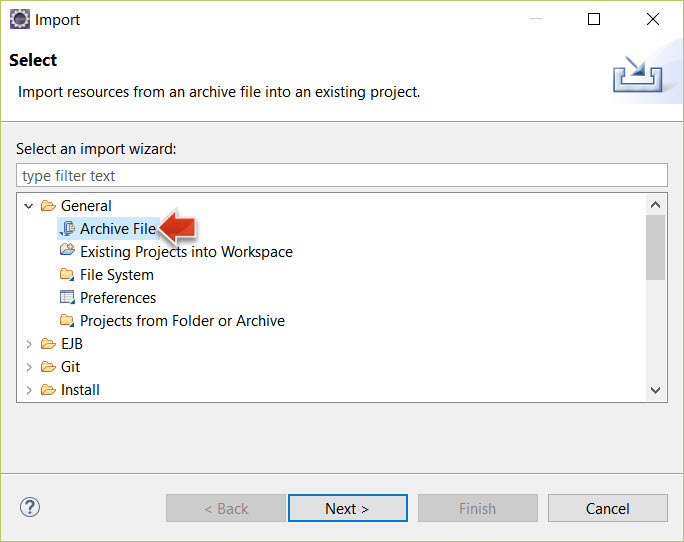

11. Download and select the [`hana-analytic-service.zip`](https://github.com/SAP/cloud-s4-datamart-tutorial/tree/master/hana) archive (containing the files to create the database view and the OData service) to your download folder from the official SAP GitHub repo.

12. In the Eclipse import wizard, click on **Browse..**, select the `hana-analytic-service.zip` file you just downloaded, and click on **Finish**.

    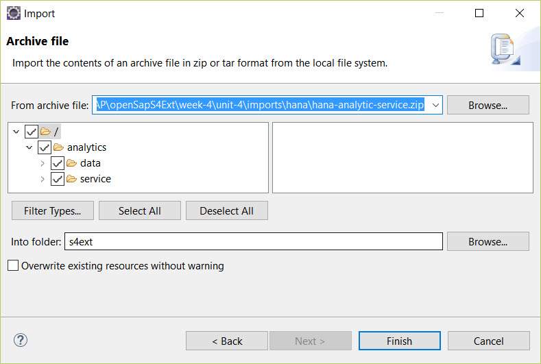

13. In the `Project Exporer` view, expand **`s4ext`** | **analytics** | **data** and **`s4ext`** | **analytics** | **service**. You will see the new view `product.calculationview` and the `analytics.xsodata` OData service.

    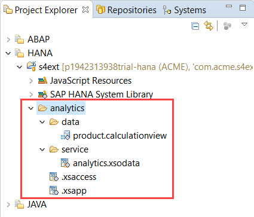

    > **Hint:** If **Eclipse Text file encoding** is not set to `UTF-8` you will get errors, similar to the following screen shot:
    > 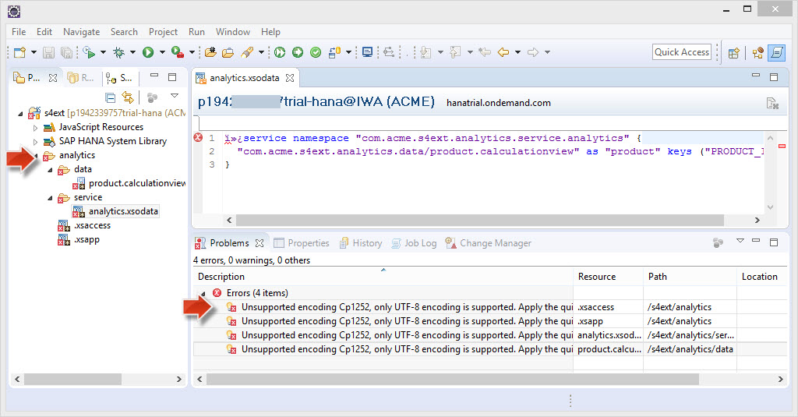

14. Now you need to activate the inactive objects in the HANA database:

    - Select the `s4ext` project.
    - From the toolbar in the `SAP HANA Development` perspective, select `Activate All SAP HANA Development Objects`.

    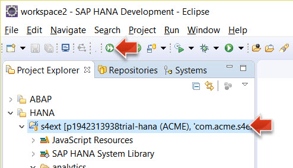

    - Click on **Select All** and on **OK**.

    > **Hint:** Deselect artifacts that might be generated by your operating system, e.g. in Mac OS the file `.DS_Store`.

    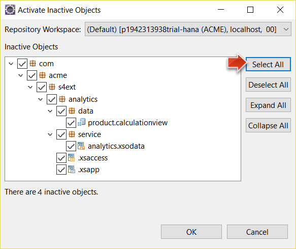

> **Result of Step 4:** You have now imported and activated a new database view `(product.calculationview)` to your SAP HANA database that is used to analyze the product data in your company. You have enabled this view as an OData service `(analytics.xsodata)`, so that you can build a graphical UI extension on top of this service.

[ACCORDION-END]

[ACCORDION-BEGIN [Step 5:](Understand the product calculation view)]

This step is designed to help you to explore and understand the data model that you are going to use to build the analytical extension.

1.  Go to Eclipse and open the `SAP HANA Development` perspective.

2.  In the Project Explorer, navigate to **HANA** | **`s4ext`** | **analytics** | **data** and double-click on the `product.calculationview`.

    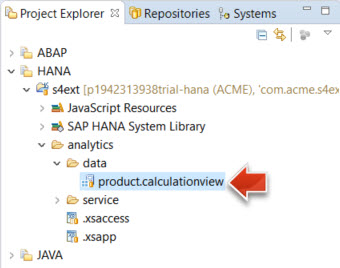

3.  Inspect the details of the `Semantics` entity to understand the underlying data model.

    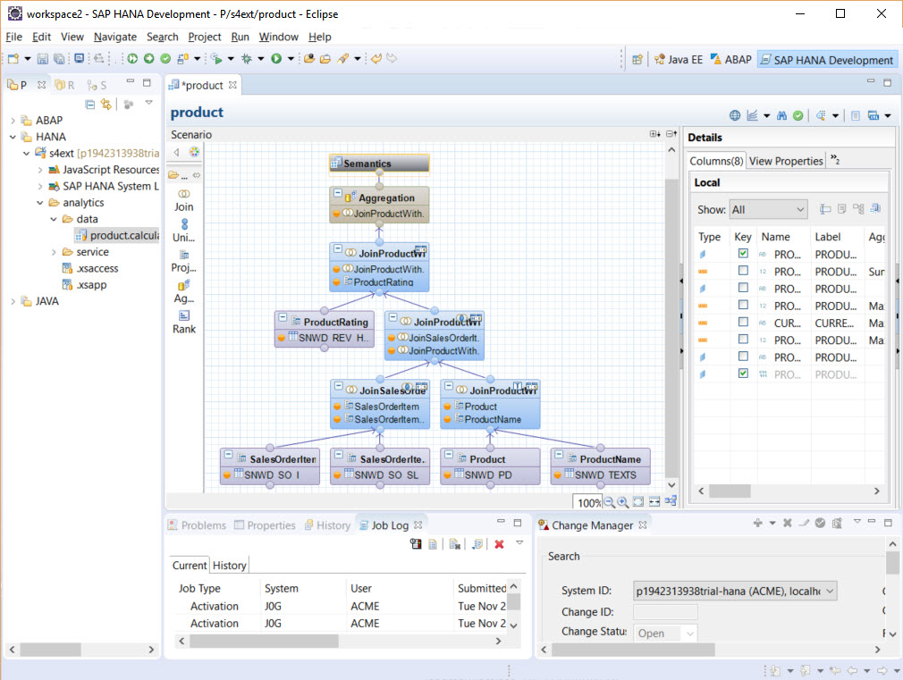

4.  In the toolbar of the `product.calculationview`, click on the small arrow next to the `Data Preview` icon to open a context menu and select `Open in Data Preview Editor`.

    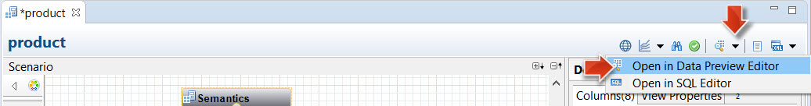

5.  The `Data Preview Editor` allows you to create an ad-hoc analysis of the data on your database table. Create a new analysis as follows:

    - Drag and drop the attribute `PRODUCT_NAME` onto the `Labels axis`.
    - Drag and drop the measure `PRODUCT_QUANTITY` onto the `Values axis`.
    - As a result you can see the aggregated product quantities per product.

    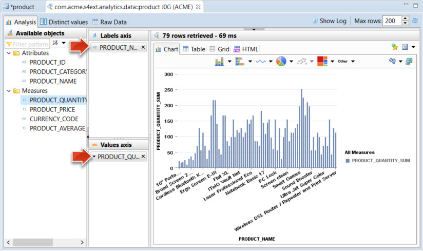

6.  Click on the `Raw Data` tab and do an ascending sort of the `PRODUCT_QUANTITY` column. You will find that the `PRODUCT_QUANTITY` for the `Benda Laptop 1408` is `10`.

    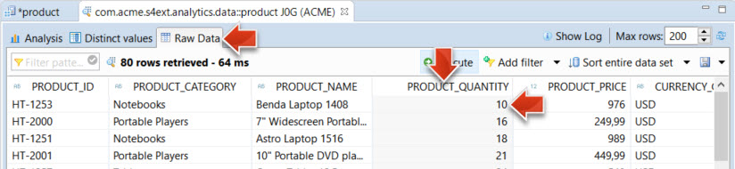

7.  You now want to increase the quantity by ordering five additional `Benda Laptop 1408`.

8.  Open the local SAP Fiori Launchpad in your backend system by opening **`https://localhost:44300/sap/bc/ui5_ui5/ui2/ushell/shells/abap/FioriLaunchpad.html`**. Log in using your backend user credentials (User: **`Developer`** / Password: **`Appl1ance`**).

9.  Open the **Employee (EPM)** | **Shop** demo application.

    

10. Search for `Benda` and click on **Add to Cart**.

    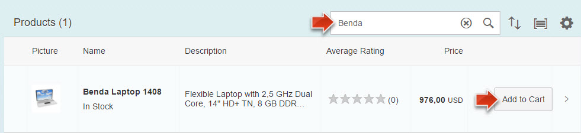

11. Open the `Shopping Cart`, increase the `Order quantity` to the value `5` and click on `Go to Checkout`.

    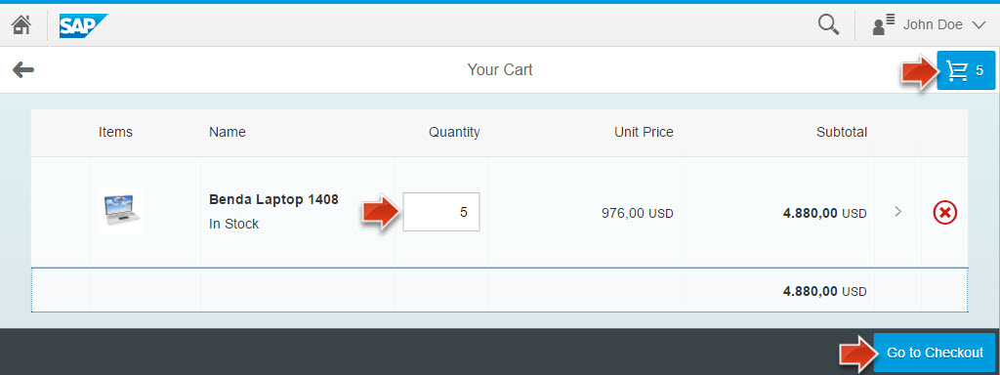

12. Click on **Buy Now** to confirm the order of 5 additional `Benda Laptops`. You should see a success message, confirming that your order has been sent to the IT.

    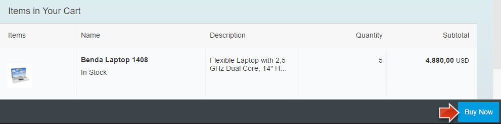

    >**Note:** You just ordered 5 laptops using the Shop application directly in your SAP S/4HANA backend system. This change is now directly reflected in the database in this backend system. Now this change in the local database table will be replicated to the SAP HANA database in your SAP CP account (using the `SLT_REPLICATION` job you set up earlier this week).

13. Go back to Eclipse and check the `Raw Data` view. Click on **Execute** to refresh the data coming from the SAP HANA database running in your SAP Cloud Platform trial account. You can now see that the data replication is still running, as the `PRODUCT_QUANTITY` has now increased to `15`.

    

> **Result of Step 5:** You now have a better understanding of the underlying data model used in our demo, and how this is modelled as a database view on your SAP HANA database. Also, you have confirmed that the continuous data replication is working using the SLT data replication you set up in the previous tutorial.

[ACCORDION-END]

[ACCORDION-BEGIN [Step 6:](Understand the analytics OData service)]

In this step you will verify that the OData service exposing the analytical view data is working correctly.

1.  Go to Eclipse and open the `SAP HANA Development` perspective.

2.  In the `Project Explorer` view, navigate to **HANA** | **`s4ext`** | **analytics** | **service** and double-click on the `analytics.xsodata` file.

    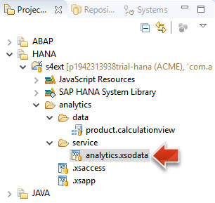

3.  If you inspect the contents of the file, you will note that the code states that the view `com.acme.s4ext.analytics.data/product.calculationview` should be exposed as OData service.

4.  Execute the OData service, by selecting **Run** | **Run as...** from the toolbar.

    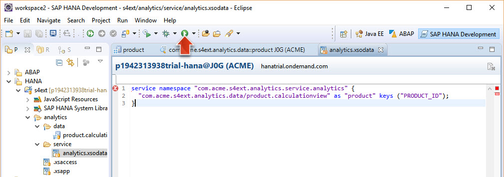

5.  As a result your browser will open the OData service. Note that the service is exposed from the SAP HANA database running in your SAP Cloud Platform account. To see the data, you need to log on using your ACME database user:

    - Username: `ACME`
    - Password: `<assigned by you>`

    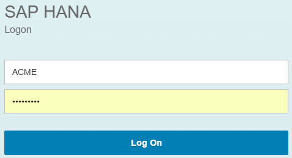

6.  You may now view and explore the created OData service.

7.  Create a new bookmark in Google Chrome called `Product Analytic OData`.

    

8.  To see the product entities add `/product` at the end of the URL of the OData service.

    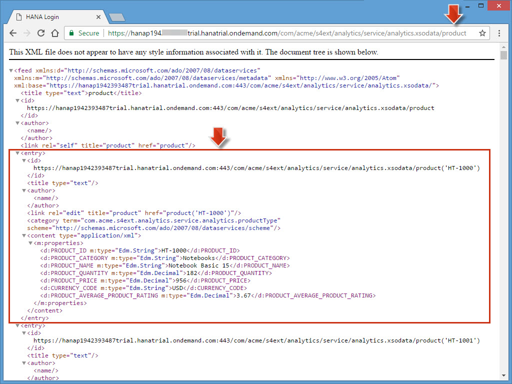

	> **Warning:** Please check if the `PRODUCT_NAME` is shown or if you only have `null` as shown in the screen shot below. The issue is that the data in the backend is only stored in English, and the browser submits your default language. So if you change your language settings and set the default language to English, you should be able to see results. Just open `chrome://chrome/settings/languages` in `Chrome` and configure the default language.
	>
	>    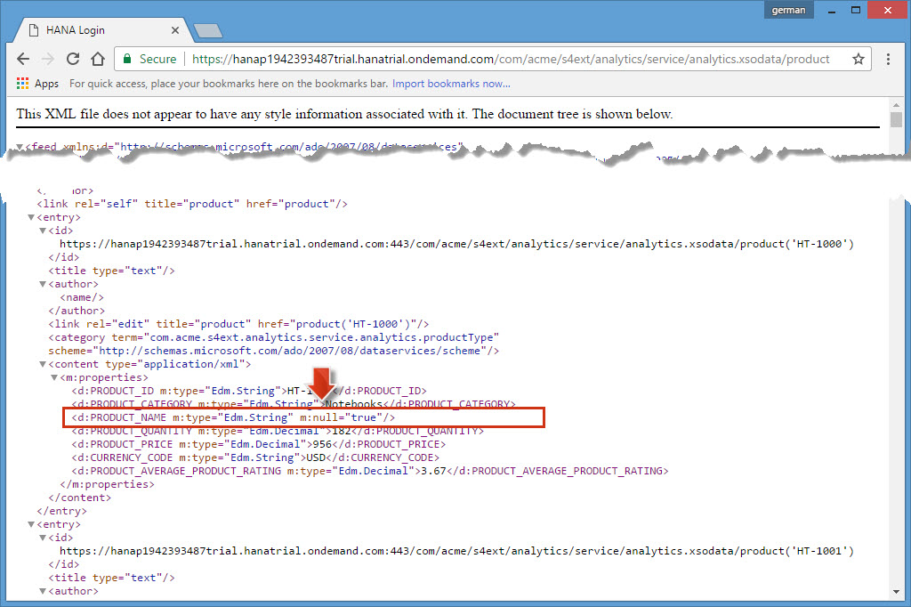

> **Result of Step 6:** You have now verified that the product analytic OData service that is exposed from the HANA database in your SAP Cloud Platform trial account is working and exposed to the internet.

[ACCORDION-END]

[ACCORDION-BEGIN [Step 7:](Create destination for analytical OData service)]

In this step you create a new destination in your SAP Cloud Platform account to allow the SAP Web IDE to connect to the OData service, exposed by the SAP HANA database in your account. You will verify that the destination is working correctly by creating a sample application in the Web IDE.

1. Log in to your [SAP Cloud Platform](https://account.hanatrial.ondemand.com/cockpit/) trial account.

2.  Navigate to **Neo Trial** | **Connectivity** | **Destinations**, and click on **New Destination**.

    - **Destination Configuration**

        | Property | Value |
        | ------------- | ------------ |
        | Name | **`hana-internet-http`** |
        | Type | **`HTTP`** |
        | Description | **`Product Analytic API`** |
        | URL | **`<Insert the URL for the Product Analytic OData service>`** (e.g. `https://hana<SAP CP user id>trial.hanatrial.ondemand.com/com/acme/s4ext/analytics/service/analytics.xsodata`|
        | Authentication | **`BasicAuthentication`** |
        | User | **`ACME`** |
        | Password | **`<your ACME password>`** |

    - **Additional Properties**

        | Property | Value |
        | ------------- | ------------ |
        | **`WebIDEAdditionalData`** | **`full_url`** |
        | **`WebIDEEnabled`** | **`true`** |
        | **`WWebIDEUsage`** | **`odata_xs,odata_gen`** |
        | **`Use default JDK truststore`** | **`checked`** |

    - Click **Save**.

    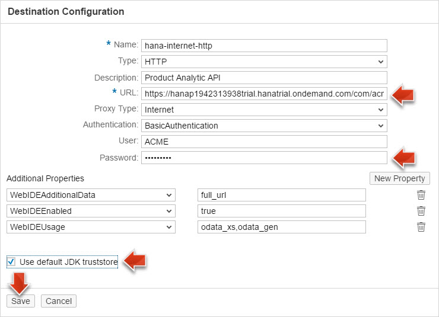

3. As a result, you now have a new destination called `hana-internet-http` in the destination list.

4. You now want to verify that the new destination is working. The best way to do this is to create a sample application in the SAP Web IDE.

5. Open the `SAP Web IDE` in your SAP Cloud Platform Cockpit by navigating to **Services** | **SAP Web IDE** | **Go to service**. In case you have not yet used the Web IDE, you will need to enable this service first.

6. Go to **File** | **New** | **Project from Template**

    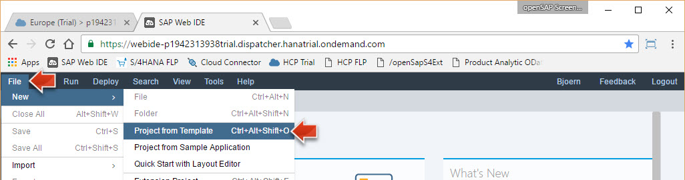

7. Select the `List Report Application` template and click on **Next**.

    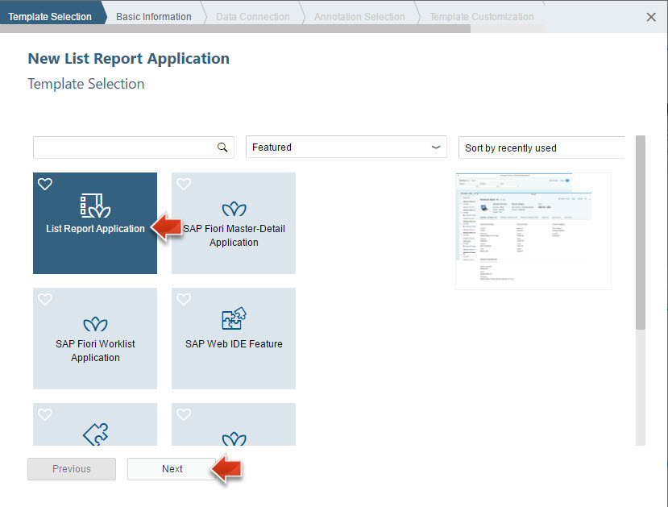

8. Specify any name and title

    - Project Name: `analytic`
    - Title: `analytic`
    - Click on **Next**.

    

9. Select **Service URL** | **Product Analytic API**. When selected you can find the `analytics.xsodata` service in the `Service` section below. Expand this service, to view the database tables of the view exposed as OData service. This proves that the service is working correctly, as this data was retrieved from the service.

    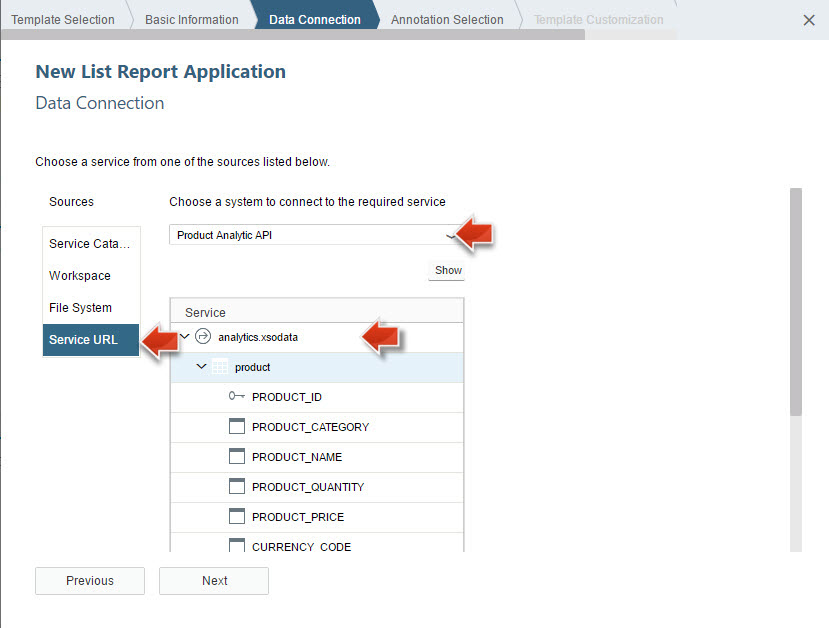

    > **Hint:** If you can't find the **Service URL** | **Product Analytic API** do a hard browser reload or clear your browser cache and reload the `SAP Web IDE` again.

10. You may now cancel the wizard.

> **Result of Step 7:** You have now verified that the destination that connects the Product Analytic OData service (exposed from the SAP HANA database in your SAP CP account) is working and can be used in SAP Web IDE. This means that you can now build an application on SAP CP using this OData service.

[ACCORDION-END]

[ACCORDION-BEGIN [Step 8:](Import/run product analytics SAP Fiori application)]

In this step you will import a prepared SAP Fiori application, which will allow you to analyze the product data exposed from the data mart you created above.

1.  Download the [`productanalytics.zip`](https://github.com/SAP/cloud-s4-datamart-tutorial/tree/master/html5) archive containing the `Product Analytics` SAPUI5 application from the official SAP GitHub repository.

2.  Open `SAP Web IDE` from your [SAP Cloud Platform Cockpit](https://account.hanatrial.ondemand.com/cockpit#/) by navigating to **Neo Trial** | **Services** | **SAP Web IDE**.

3.  On the home screen of SAP Web IDE, click on **File** | **Import from File System**.

    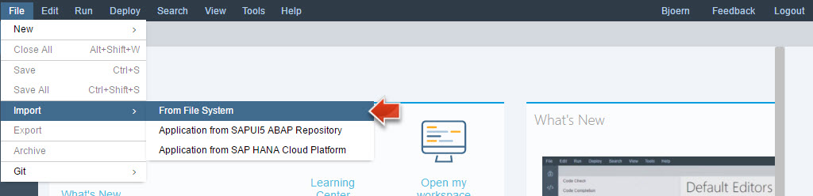

4.  Click on **Browse...** and select the downloaded `productanalytics.zip` file from your file system. Make sure that `Extract Archive` is selected, and `Import to` folder `/productanalytics` is specified. Click **OK** to import the application.

    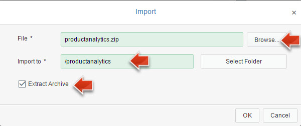

5.  Switch to the `Development` perspective in SAP Web IDE.

    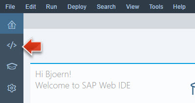

6.  If you want, explore the imported source code to understand how the application was created.

7.  Right-click on the imported `productanalytics` application in the folder structure and select **Run** | **Run as** | **Web Application** from the context menu.

    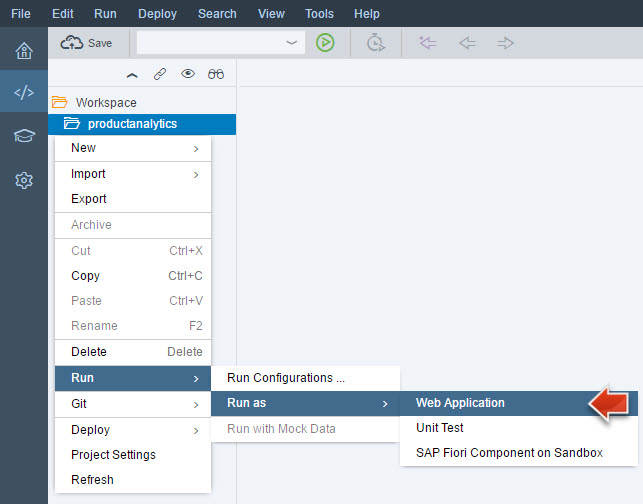

8.  The SAP Fiori application `Product Procurement Analytics` opens in a new browser tab.

    >**Warning:** You need to set your browser language to `EN` (english) for the application to work correctly. The issue is the following: When calling an OData service, the browser also passes the preferred language to the backend. Then the backend will send back the text labels for the requested language. However, in our case the texts for the `Enterprise Procurement Model` which is the basis for this tutorial is only maintained in English. This breaks our SAP Fiori analytical application, and you would only see one bar in the chart as a result, if your browser language is not set to English.

9.  Click on `Refine Product Analytics` on top and drag the slider for the `Minimum ordered Quantity`. Note how this changes the analysis chart below.

    

    >**Note:** You might need to scroll down a bit in the application to see some products, as there are a few products that have not been ordered at all.

10. Click on the **star icon** to figure out which products have the worst user rating in your company by changing the slider for the `Minimum Rating`.

    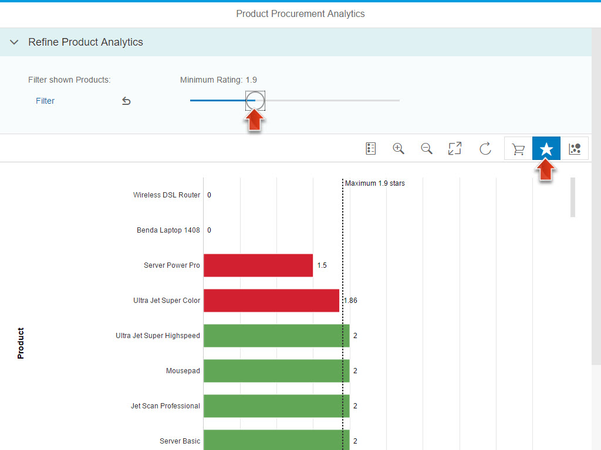

11. Click the **bubble chart icon** to come to the analytics page that combines the product order quantity, user ratings, as well as the product price in one single view.

    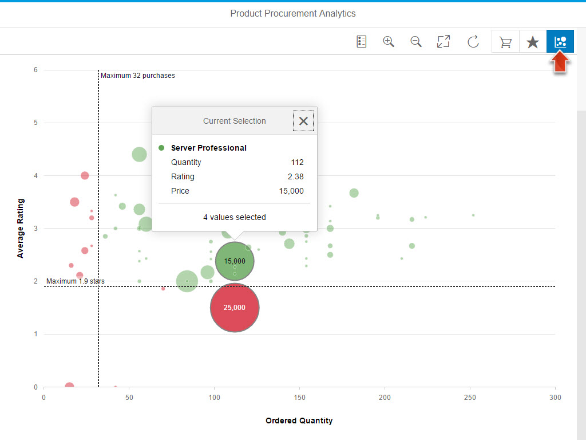

> **Result of Step 8:** You now have a working SAP Fiori application, which allows you to analyze product data exposed from the data mart in your SAP Cloud Platform account.

[ACCORDION-END]

[ACCORDION-BEGIN [Step 9:](Deploy application to SAP Cloud Platform)]

In this step you will deploy the `Product Analytics` application to your SAP Cloud Platform trial account.

1.  Go back to `SAP Web IDE`.

2.  In the `Development` view, right-click on the node `productanalytics` and select **Deploy** | **Deploy to SAP Cloud Platform**.

    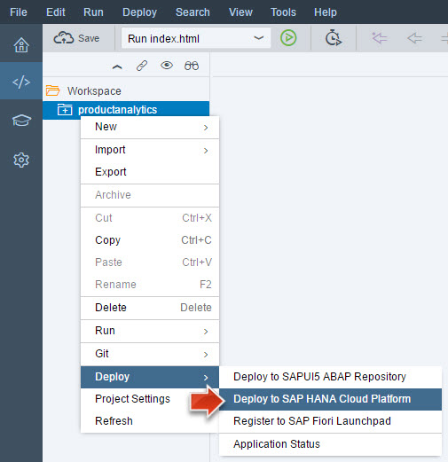

3.  If necessary, provide the logon credentials for your SAP Cloud Platform trial account.

4.  Select the radio button `Deploy a new application`, leave the default values and click on **Deploy**.

    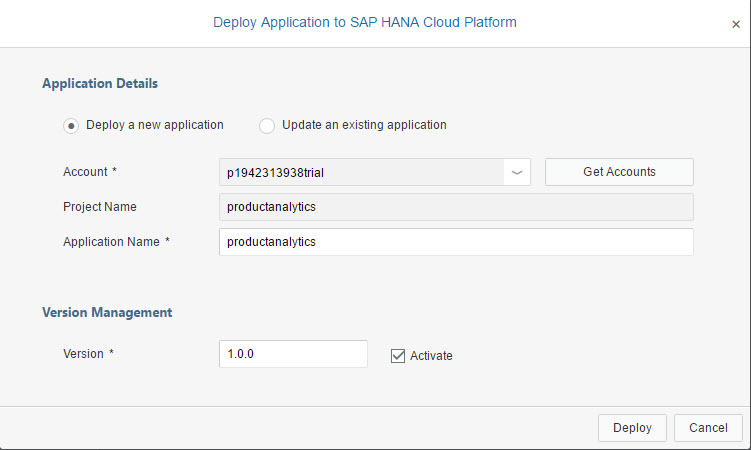

5.  Now your application has been successfully deployed to your account on SAP Cloud Platform. Optionally, you could also register your application to an existing SAP Fiori Launchpad.

    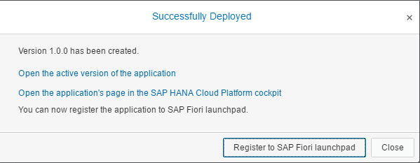

> **Result of Step 9:** You have now deployed the Product Analytics application to your SAP Cloud Platform trial account.

[ACCORDION-END]
