## Prerequisites
- **Proficiency:** Intermediate
- **Tutorials:** [Install SAP NetWeaver in openSUSE](https://www.sap.com/developer/tutorials/cp-s4-ext-install-nw.html)
- **Systems, Tools, Services:**
    -  SAP GUI
    -  Web browser (Google Chrome)
    -  SAP NetWeaver AS ABAP 7.50 SP2

## Next Steps
[Exposing Back-End APIs to the Cloud](https://www.sap.com/developer/tutorials/cp-s4-ext-ui2-cloud-connector.html)

## Details
### You will learn
You will learn how to enable and expose OData services from a SAP NetWeaver backend system, which is the application server for SAP S/4HANA on-premises. The exposed OData services can be used to develop custom UIs using SAPUI5 and SAP Fiori.

### Time to Complete
**20 Mins**

---

[ACCORDION-BEGIN [Step 1:](Check SAP NetWeaver is operational)]

In this step you will verify that the `SAP NetWeaver` system you installed in the preceding tutorial is operational. 

1.  Open VirtualBox and make sure that your openSUSE VM is started.

2.  Execute **`su -l npladm`** to switch to the user `npladm`. You will be asked for the SAP NetWeaver system password.

3.  Execute **`sapcontrol -nr 00 -function GetProcessList`** to check that the processes are running and are all `GREEN`

    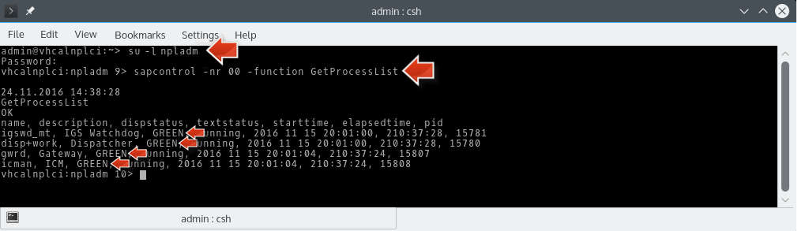

4.  In case it is in a different state, you should make sure all services are stopped, by executing **`stopsap ALL`**.

5.  Now start the services again using the command **`startsap ALL`**.

6.  Execute **`sapcontrol -nr 00 -function GetProcessList`** to check that the processes are running and are all `GREEN`

    

7.  If this doesn't help, you can restore the VirtualBox snapshot `ABAP with License`. You should still verify the all processes are `GREEN`.

> **Result of Step 1:** You have verified that your SAP NetWeaver system is operational.

[ACCORDION-END]

[ACCORDION-BEGIN [Step 2:](Find and activate OData services)]

In this step you will learn how to enable an OData service in your SAP NetWeaver / SAP S/4HANA on-premises backend system. You will do this using the ABAP transaction **SICF**. The `Internet Communication Framework (ICF)` allows an SAP system to communicate via internet standard protocols (HTTP, HTTPS and SMTP).

1.  Log on to your SAP NetWeaver backend using the SAP Logon application. (Default user is `developer`; default password is `Appl1ance`.)

2.  Open transaction `SICF`.

    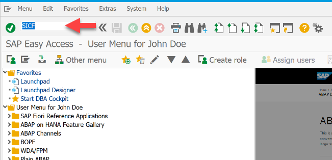

3.  Keep the default filter (`Hierarchy Type`: **SERVICE**) of the `SICF editor` and click the **Execute icon** on the `Define Service` toolbar to open the hierarchy tree of available services.

    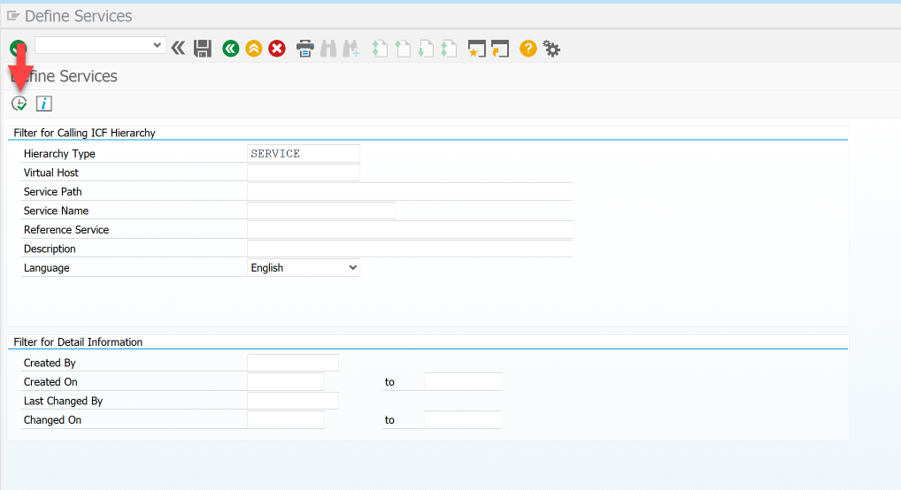

5.  In the **Virtual Hosts/Services** column expand tree item **`default host`** | **`sap`** | **`opu`** | **`odata`** | **`sap`**.

    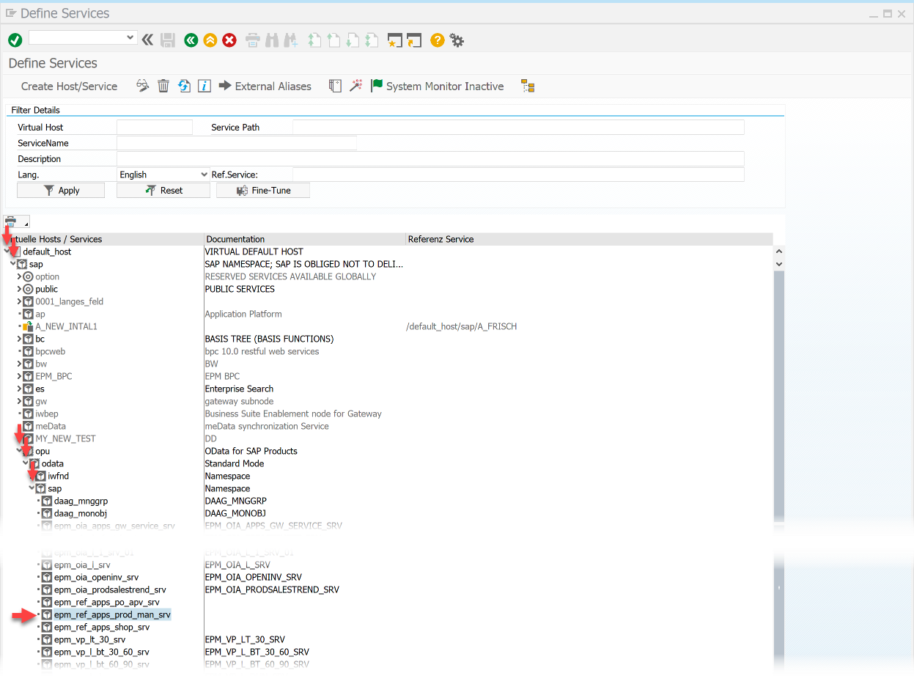

    > **Note:** This location `sap/opu/odata/sap` is the location where you find OData services as delivered with any SAP NetWeaver AS ABAP. There you also find the OData services from the Reference applications of the [Enterprise Procurement Model (EPM)](http://www.sap.com/documents/2012/09/2a404253-5b7c-0010-82c7-eda71af511fa.html), a demonstration data model on which the business cases and challenges of this tutorial are based on. It also contains a `Manage Products` sample application, which we will use and extend in this tutorial. But first we will look at the underlying OData service of this application.

6.  Select tree item **`default host`** | **`sap`** | **`opu`** | **`odata`** | **`sap`** | **`epm_ref_apps_prod_man_srv`**.

7.  Open **right-click context menu**.

8.  Make sure that **Activate Service** is grayed out, which means that the service is already activated.

    > **Note:** If an OData service is not activated you can use this **Activate Service** to activate it.

    

> **Result of Step 2:** You have found the OData service **`epm_ref_apps_prod_man_srv`** which the **Manage Products** `EPM` sample application uses and confirmed that it is activated.

[ACCORDION-END]

[ACCORDION-BEGIN [Step 3:](Open SAP Gateway client)]

In this step you will learn about SAP Gateway transactions to explore details of a specific OData services in the SAP NetWeaver back-end. You will use the transaction **`IWFND/MAINT_SERVICE`** to search for a specific OData service. For the found OData service you open the **SAP Gateway Client** that provides a REST client tool, specialized for testing OData services.

1.  In your SAP GUI
    - Enter **`/n/IWFND/MAINT_SERVICE`** in the command field and press `Enter` to open the **Activate and Maintain Services** transaction.

    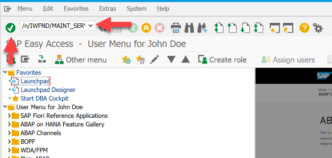

3.  Click **Filter** button in the toolbar of the `Activate and Maintain Services` page.

    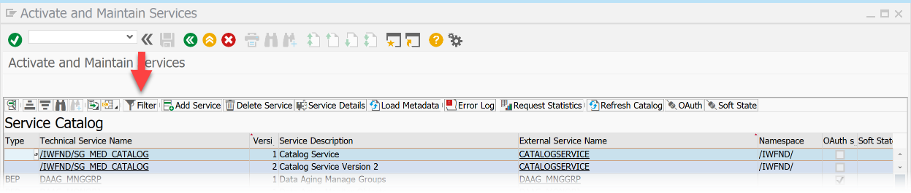

4.  In the opened **Filter for Service Catalog** window
    - Enter filter string **`*PROD*`** as `Technical Service Name`
    - Click **green accept icon** with tooltip `Continue`.

    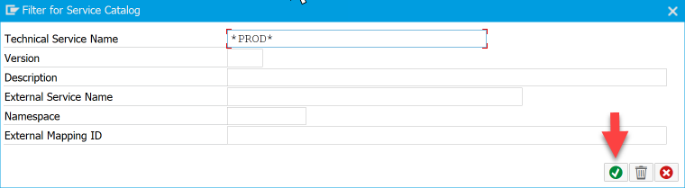

    > **Result:** The **Service Catalog** table only displays those services that contain **PROD** in their technical name.

5.  Select the table row of the **`EPM_REF_APPS_PROD_MAN_SRV`** service (external service name), which is the same as before found in transaction `SICF`.

    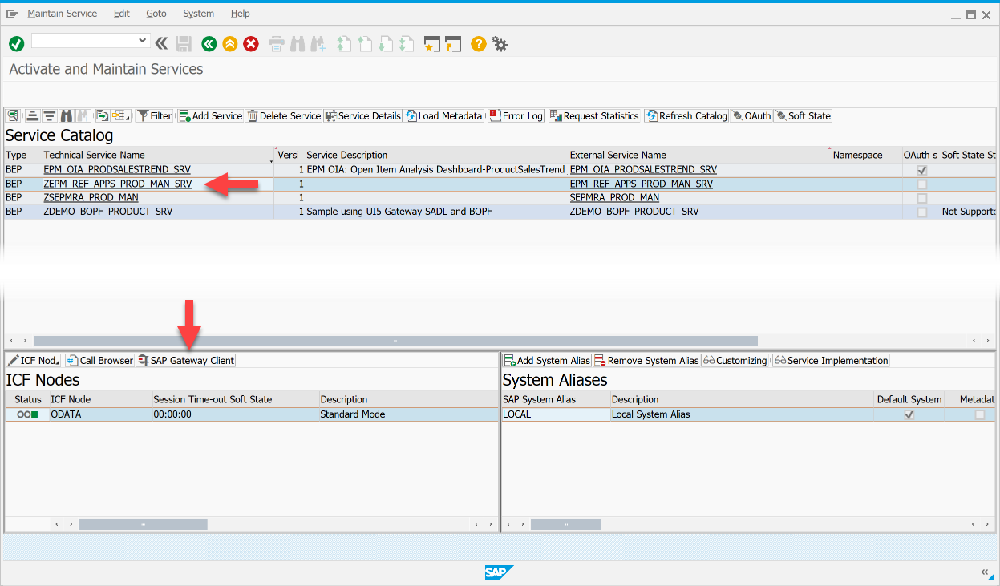

6.  Click **SAP Gateway Client** button in `ICF Nodes` area at the bottom to explore more details of the selected OData service.
    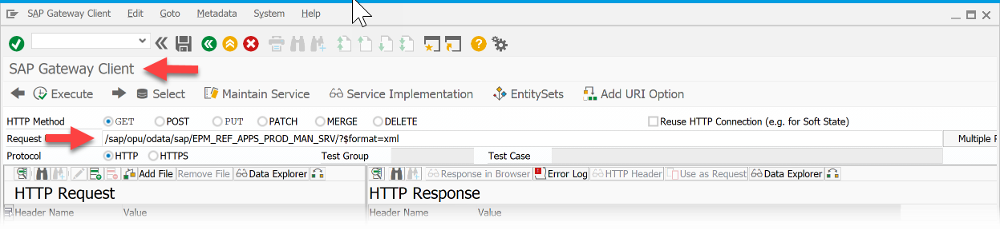

> **Result of Step 3:** You have opened the SAP Gateway client for the `EPM_REF_APPS_PROD_MAN_SRV` service.

[ACCORDION-END]

[ACCORDION-BEGIN [Step 4:](Explore EPM Manage Products OData service)]

The OData service **`EPM_REF_APPS_PROD_MAN_SRV`** which we explore here offers the data of a `Manage Products` application. This standard application does not feature information on product ratings, but we were asked by the business department in our company to add the product ratings to the application. So in this step we will check if the OData service contains information on product ratings, which we might use to extend the UI.

In this step you will explore the `EPM_REF_APPS_PROD_MAN_SRV` OData Service and learn what data it contains.

1.  Click toolbar button **Execute** to test the `GET` HTTP response of the OData service **`EPM_REF_APPS_PROD_MAN_SRV`**.

    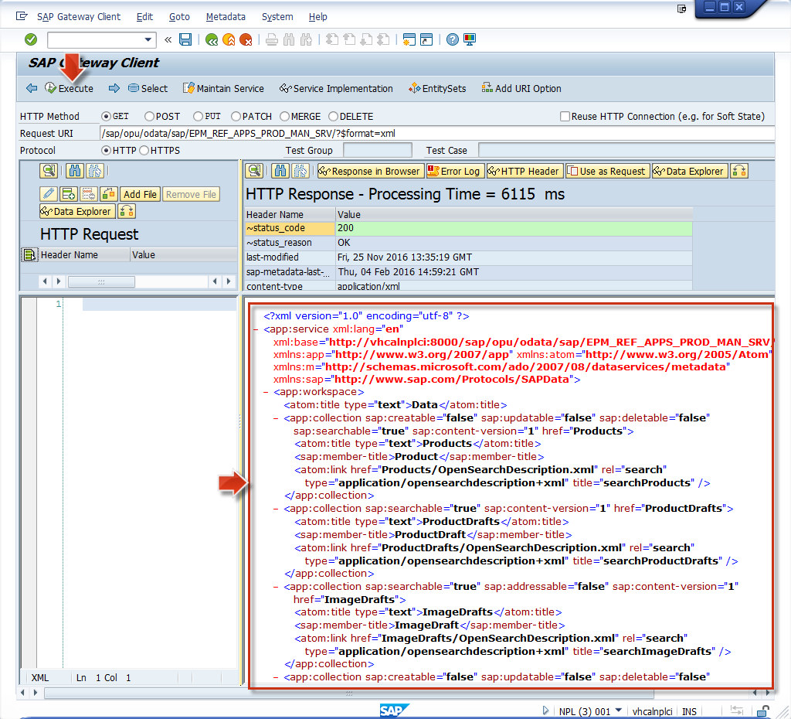

2.  Click **Data Explorer** button to get more specific data of this OData service.

    

    > **Result:** The Response is now structured in a **service document with entities** like Products, Suppliers etc. which the service offers.
    >
    > 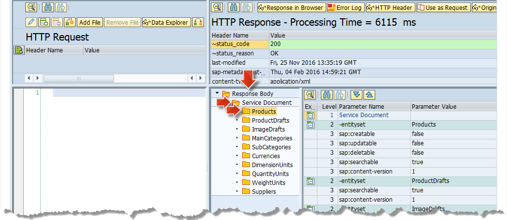

3.  Click **Entity Sets** on the main toolbar of the `SAP Gateway Client` page to get all Entity Sets provided by the OData service.

    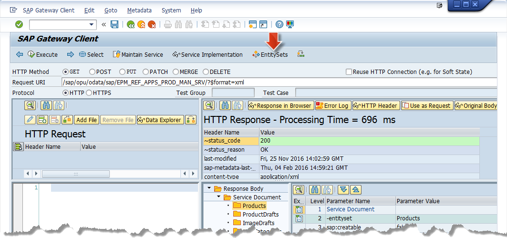

4.  Select the **Products** entity set and click on the **green accept icon**

    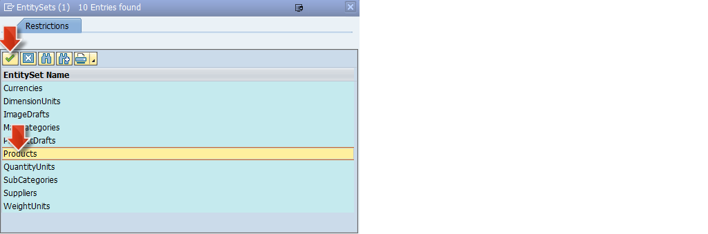

    > **Result:** The request URI changed to `/sap/opu/odata/sap/EPM_REF_APPS_PROD_MAN_SRV**/Products**`, i.e. the `Products` string was added at the end.

5.  Click toolbar button **Execute** to get the `GET` HTTP response of the OData service **`EPM_REF_APPS_PROD_MAN_SRV`** but this time specifically for the **Products entity set**

    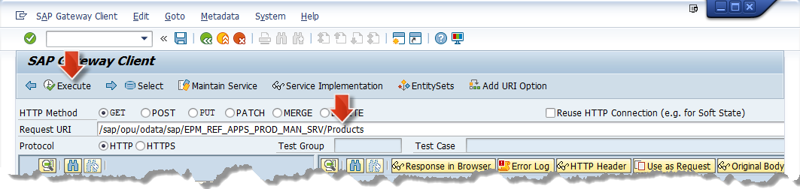

6.  **Double-click on any Product** (e.g. `HT-1000`) in the HTTP Response area to see the all properties the service offers for each product.

    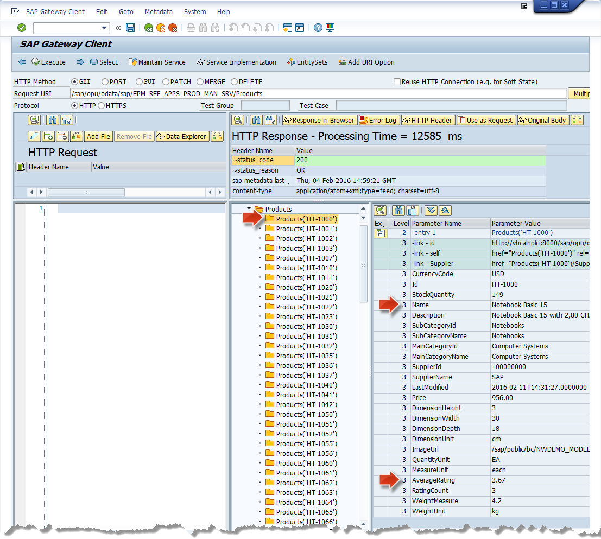

> **Result of Step 4:** By means of the ABAP transaction `/IWFND/MAINT_SERVICE` and the `SAP Gateway Client` you have seen how to explore the data of a specific OData service. Especially the **Products** entity set of the **`EPM_REF_APPS_PROD_MAN_SRV`** OData service contains also a property value **`AverageRating`** which will be used later.

[ACCORDION-END]

[ACCORDION-BEGIN [Step 5:](Identify OData service used by SAP Fiori app)]

In this step you will learn to find out, which OData service is used by a SAP Fiori / SAPUI5 application. To do so, you will take a closer look at the **Manage Products** application which resides in the SAP Fiori Launchpad (FLP), which is exposed from your SAP NetWeaver / SAP S/4HANA system.

1.  Open **S/4HANA FLP** by pasting following link in your web browser:
    **`https://localhost:44300/sap/bc/ui5_ui5/ui2/ushell/shells/abap/FioriLaunchpad.html`**

    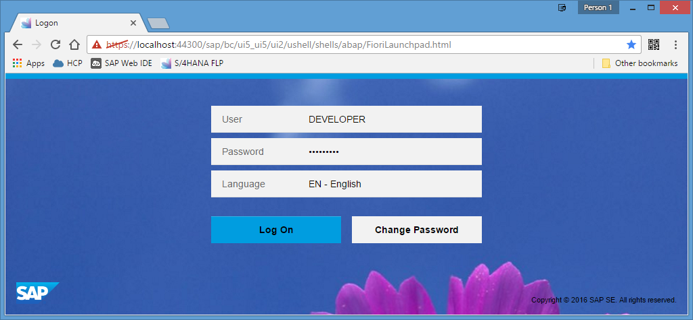

2.  On opened FLP login page enter:

    -   `User`: **`DEVELOPER`**
    -   `Password`: **`Appl1ance`**
    -   Click **Log On** to enter the FLP (launching Fiori launchpad application the first time could again took some time, just wait.)

    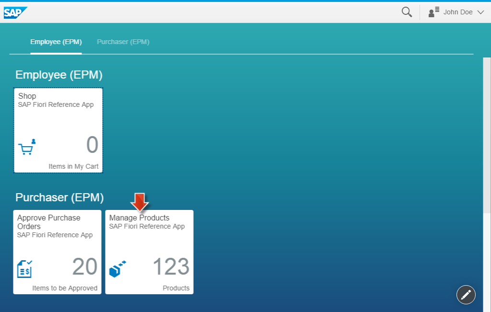

3.  Click **Manage Products** tile on the FLP to open the SAP Fiori reference application in which you can manage products coming from a Enterprise Procurement Model (EPM) defined in SAP NetWeaver AS ABAP back-end.

    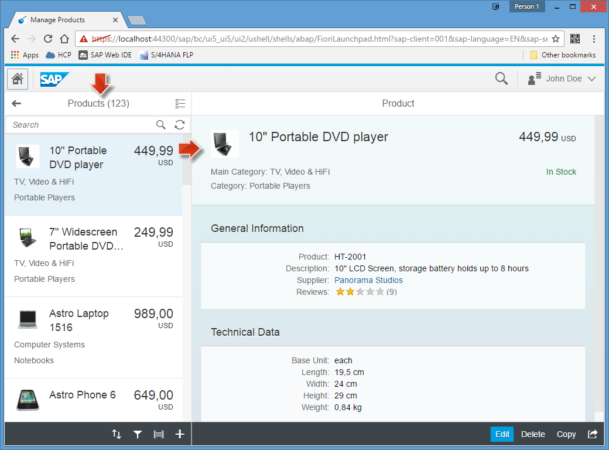

4.  Open Developer Tools in Google Chrome:
    -   Open the Google Chrome menu, by clicking on the **3 dots icon** in the in the upper right corner.
    -   Select **More tools** | **Developer tools**.
    -   Keyboard shortcut: Windows: `Ctrl + Shift + I` / Mac OS: `Cmd + Alt + I`

    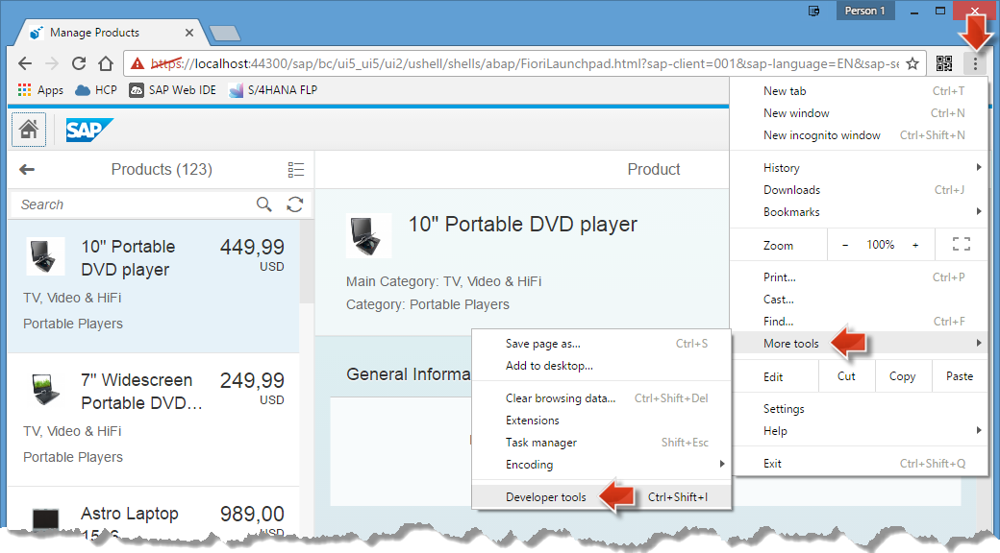

5.  On opened developer tools (by default on the right side of the Web browser)
    -   Click on **Network** tab.

        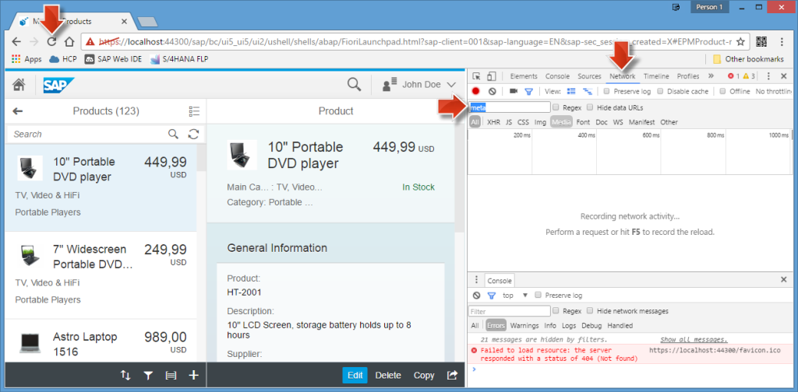

    -   Enter **`meta`** as string in the filter field of the network tab.
    -   Click **Refresh** icon of the Web browser.

    > **Result:** The first entry of the filtered HTTP network requests starts with **$metadata?** and is the OData service which provides the products data of the Fiori application.
    >
    > 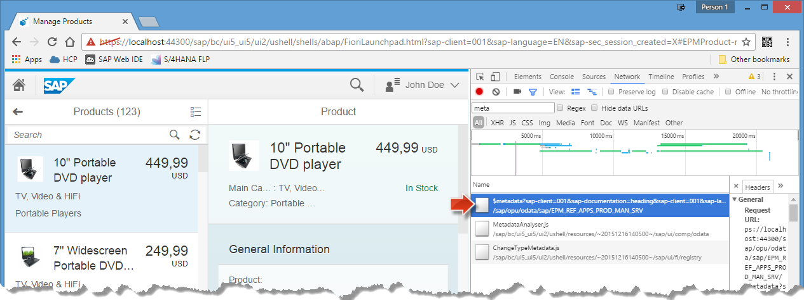

6.  Double-click on row **$metadata?sap-documentation=heading&sap-language=EN** to open the OData service metadata from the SAP NetWeaver AS ABAP 7.50 server.

    > **Result:** The service response gets displayed in a new browser tab, describing the data model of the **`EPM_REF_APPS_PROD_MAN_SRV`** OData service. As before in the SAP Gateway Client you can find in the metadata service output in the Web browser the properties of the product entity, e.g. the Average Rating.
    >
    >   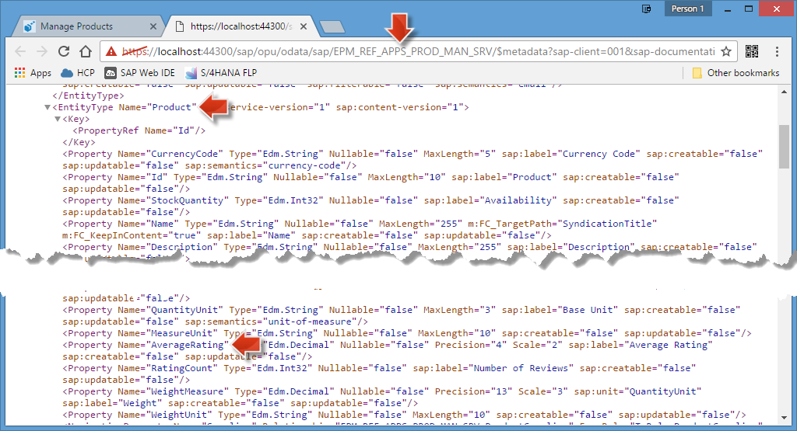

> **Result of Step 5:** You now know how to find out which OData services are used in a SAPUI5 / SAP Fiori application.

[ACCORDION-END]

You have now successfully completed this tutorial and exposed the **`EPM_REF_APPS_PROD_MAN_SRV`** OData service from your SAP NetWeaver system. You may now continue with the next tutorial in this series to learn how to make this service accessible on SAP Cloud Platform: [Expose OData services to SAP Cloud Platform](https://www.sap.com/developer/tutorials/cp-s4-ext-ui2-cloud-connector.html)
