## Prerequisites
- **Proficiency:** Intermediate
- **Tutorials:**
    -  [Sign up for a free trial account on SAP Cloud Platform](https://www.sap.com/developer/tutorials/hcp-create-trial-account.html)
    -  [SAP S/4HANA on-premises UI extension (Part 1): Enabling OData APIs in SAP NetWeaver](https://www.sap.com/developer/tutorials/cp-s4-ext-ui1-expose-odata.html)
- **Systems, Tools, Services:**
    -  On host OS: VirtualBox, SAP Development Tools
    -  In Google Chrome browser: SAP Cloud Platform Cockpit (SAP CP Cockpit), SAP Cloud Connector Administrator

## Next Steps
[SAP S/4HANA on-premises UI extension (Part 3): Creating an SAP Fiori Launchpad in the Cloud](https://www.sap.com/developer/tutorials/cp-s4-ext-ui3-cloud-portal.html)

## Details
### You will

In this tutorial you will learn how to establish connectivity between SAP Cloud Platform and your SAP NetWeaver on-premises system. You will set up SAP Cloud Connector in your on-prem environment and allow SAP Cloud Platform to reach certain resources on your SAP NetWeaver server. Finally, you will set up a destination in SAP Cloud Platform to allow access to the `EPM Manage Products` OData service.

### Time to Complete
**30 Mins**

---

[ACCORDION-BEGIN [Step 1:](Install SAP Cloud Connector for Linux)]

In this step you will download and install SAP Cloud Connector on openSUSE inside your VirtualBox VM.

1.  Open the Firefox web browser within your Virtual Machine and open page [SAP Development Tools](http://tools.hana.ondemand.com).

2.  Go to **Cloud** and scroll to section **Cloud Connector**.

    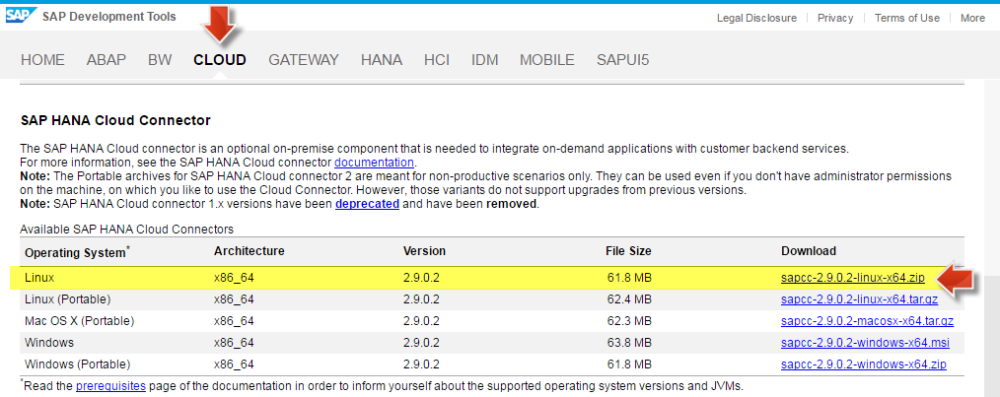

3.  Download the **Linux** installer `sapcc-XXX-linux-x64.zip`, read and then agree to the End User License Agreement. Click button **I Have Read And Agree** to start the download.
    >**Note:** If the popup "What should Firefox do with this file?" appears, choose `Save File` and click **OK**.

    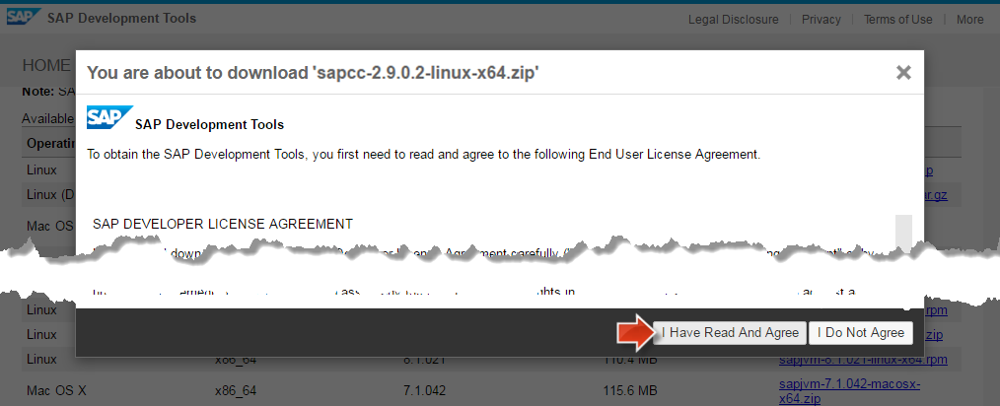

4.  Open the command shell via start menu (enter **Konsole** in KDE desktop or **Xterm** in GNU desktop). By default the command shell opens the admin user's home directory `<admin user name>@vhcalnplci`.

5. Execute **`cd ./Downloads`** to go to the downloads folder, where the installer of SAP Cloud Connector is stored.

    >**Note:** With the command **`ls -al`** you can verify, that the recently downloaded installer named `sapcc-XXX-linux-x64.zip` is in place.

6.  Enter command **`sudo unzip sapcc-XXX-linux-x64.zip`** (replace placeholder `XXX` with the given release version, e.g. **2.9.0.2**).

7.  Enter command **`sudo rpm -i com.sap.scc-ui-XXX.x86_64.rpm`** (replace `XXX` with the given version number e.g. **2.9.0-7**).

    > **Note:** You can autocomplete the package name with the **Tab** key while entering the command **`sudo rpm -i com.`**.

8.  Press the **Return** key to start the installation process:
    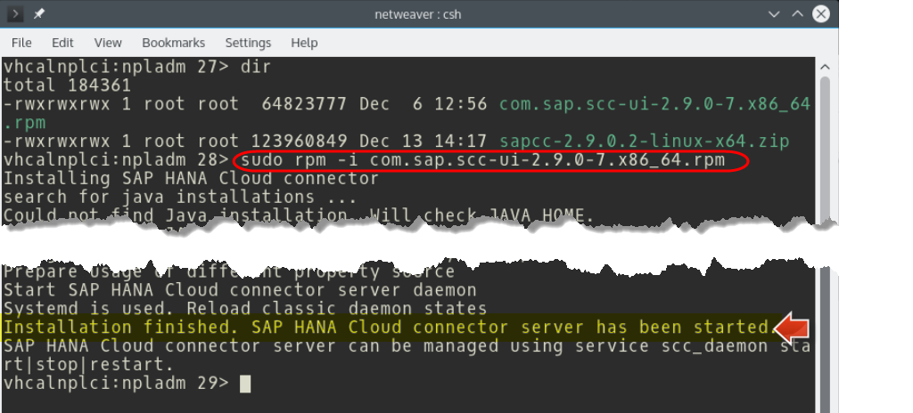

9.  Enter command **`sudo service scc_daemon status`**.

    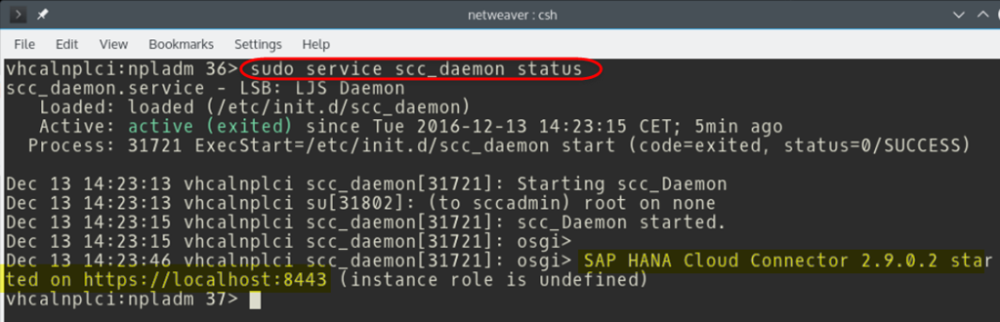

> **Result:** SAP Cloud Connector is successfully installed and the connector daemon is running on the Linux guest OS.

[ACCORDION-END]

[ACCORDION-BEGIN [Step 2:](Connect cloud connector to trial account)]

Once SAP Cloud Connector has been installed and the connector daemon has been started, you can log on and perform the initial configuration. You will also establish a connection between the cloud connector and your SAP Cloud Platform (SAP CP) trial account.

1.  Open the Google Chrome web browser on your host OS and enter URL **`https://localhost:8443`**.

2.  In Google Chrome you get informed that your connection is not secure. Press the **Advanced** button and click the link **Proceed to localhost (unsafe)**.

    

4.  Enter user credentials:
    -   User Name: **Administrator**
    -   Password: **manage**

    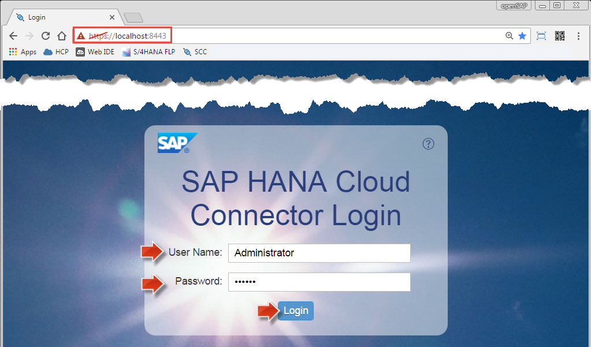

5.  Apply the following steps for the initial setup of the new cloud connector instance:
    -   Change the admin password from **manage** to one of your choice.
    -   Keep the default installation type **Master (Primary installation)** selected.
    -   Click **Save**.

    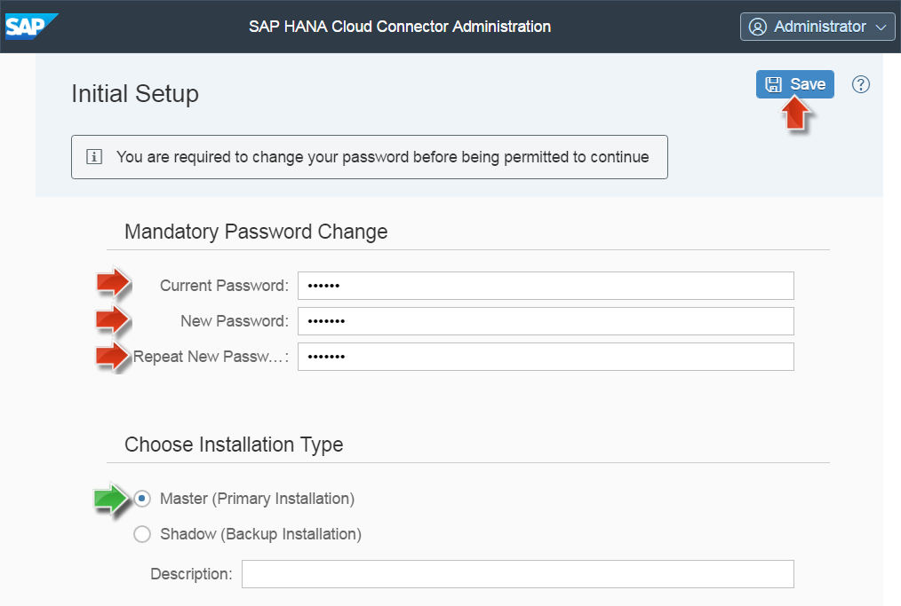

6.  Add the credentials for your SAP Cloud Platform trial account here. If you don't have an account yet, please follow this tutorial first: ([Create a trial account on SAP Cloud Platform](https://www.sap.com/developer/tutorials/hcp-create-trial-account.html))

    **First Account**

    | Property | Value |
    | ------------- | ------------ |
    | Landscape Host | **`hanatrial.ondemand.com`** |
    | Account Name | **`p19XXXtrial`** (paste it from the clipboard, see step 2 in the note below) |
    | Display Name | **`My Trial Account`** |
    | Account User | **`p19XXX`** (paste it from the clipboard, see step 3 in the note below) |
    | Password | `enter your own password!` |
    | Location ID | Must be kept empty! |

    > **Note:** How to get your SAP CP trial account name and user:
    >
    > -   **Step 1:** In Google Chrome browser open new tab and logon to SAP CP Cockpit with URL <https://account.hanatrial.ondemand.com>. Enter your user credentials.
    > -   **Step 2:** On the Overview page scroll to section **Account Information** and copy the **Account name** into the clipboard, e.g. **`p1942128127trial`**.
    >
    >    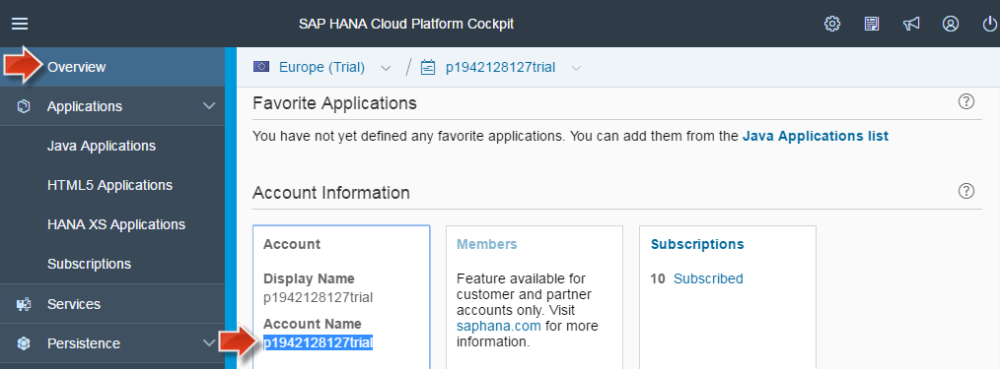
    >
    > -   **Step 3:** In the SAP CP Cockpit toolbar press the user icon at the right side. Copy the **ID** into the clipboard, e.g. **P1942128127**.
    >
    >     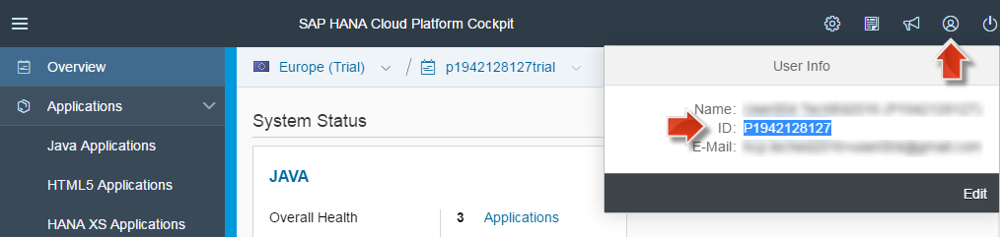

    **HTTPS Proxy**

    Enter **Host** and **Port** fields if you are working behind a firewall with a proxy.

    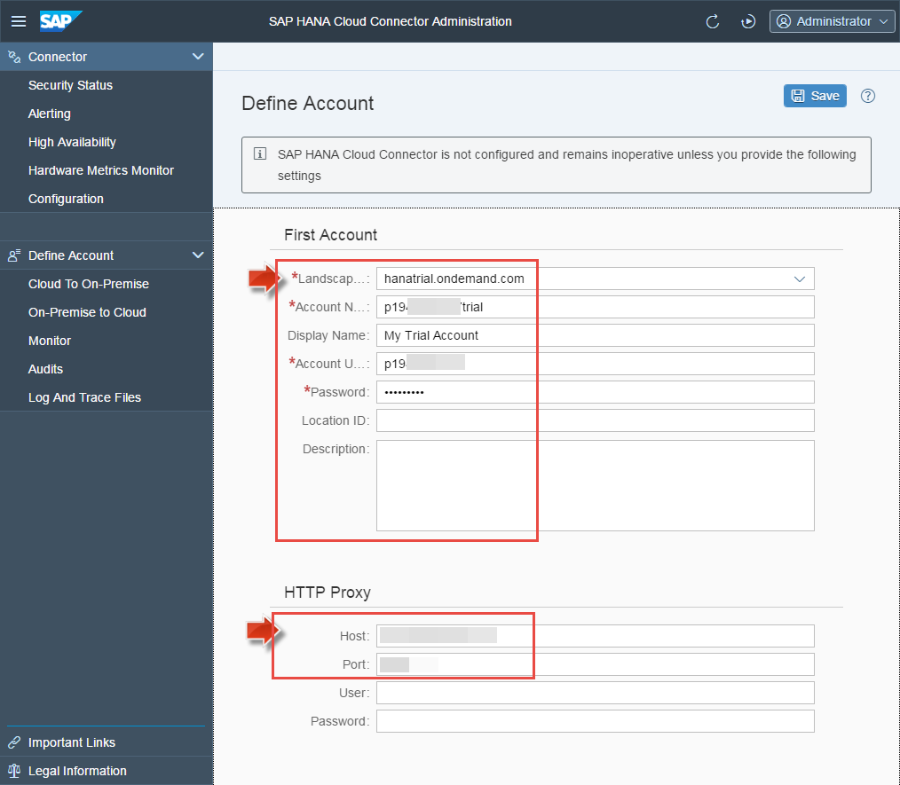

7.  Click **Save**.

    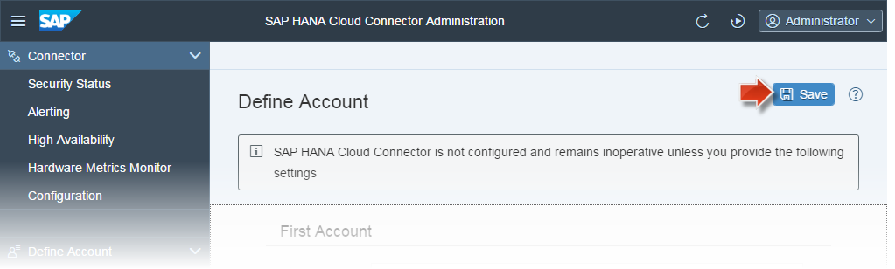

> **Result:** After the initial configuration was successfully set up the **Connector** view displays a new dashboard entry for the newly added SAP CP trial account.
>
> 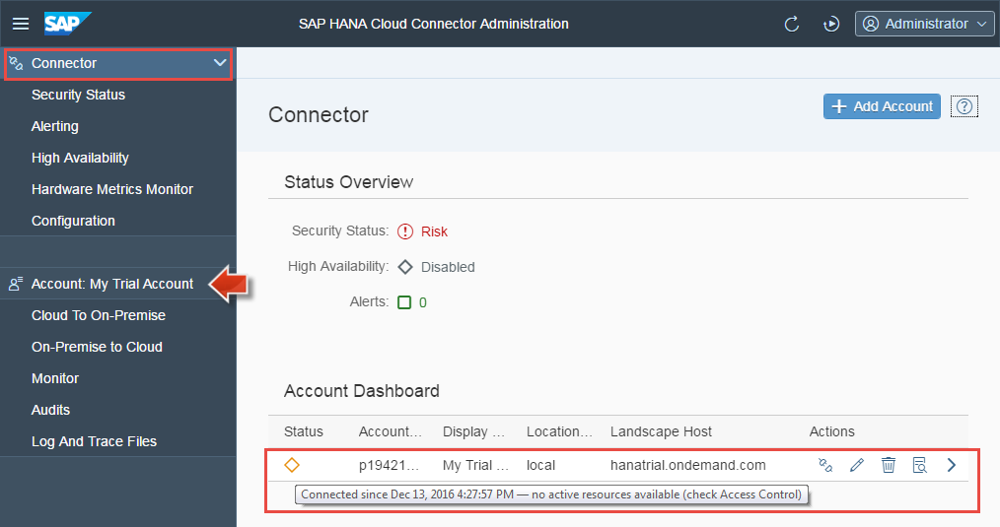
>
> Click on tree item **Account: My Trial Account** to view more account details.
>
> 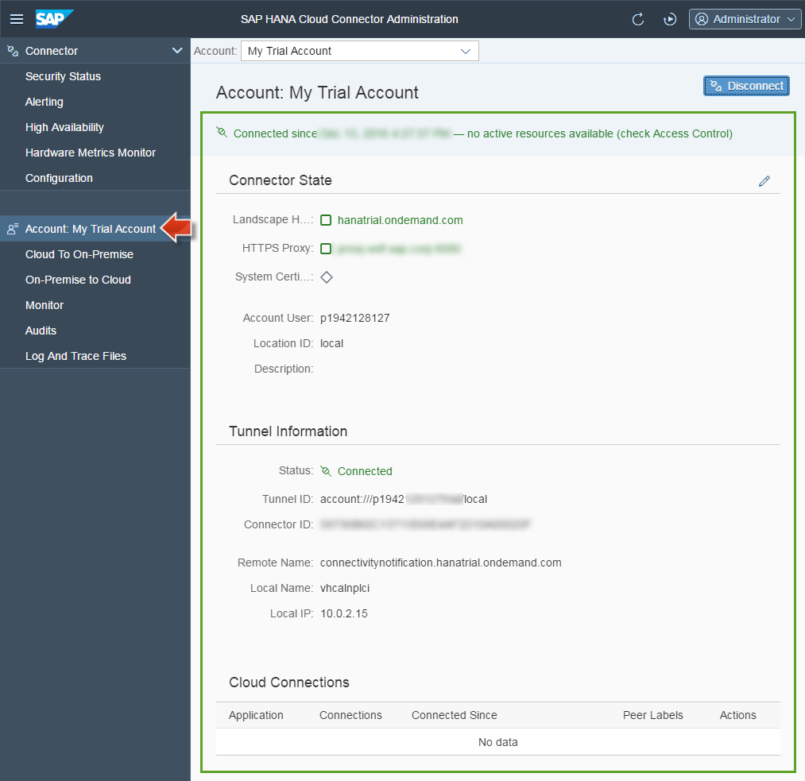
>
> **Related Resources:** For more details see SAP Cloud Platform Documentation:
>
> -   [Installing the Cloud Connector](https://help.hana.ondemand.com/help/frameset.htm?57ae3d62f63440f7952e57bfcef948d3.html)
> -   [Initial Configuration](https://help.hana.ondemand.com/help/frameset.htm?db9170a7d97610148537d5a84bf79ba2.html)

[ACCORDION-END]

[ACCORDION-BEGIN [Step 3:](Check connection)]

Check connectivity in your SAP CP trial account:

1.  In Google Chrome browser select the tab with the SAP CP Cockpit.

2.  In SAP CP Cockpit go to **Connectivity** | **Cloud Connectors**. The green `Connected` text indicates, that your SAP CP trial account is successfully connected with your SAP Cloud Connector installation that is running on your local Linux VM.

    

> **Result of Step 5:** You successfully set up the initial configuration of the SAP Cloud Connector that is running on your Linux VM (i.e. in your own corporate network). It is connected with Your SAP CP trial account hosted on the SAP Cloud Platform trial landscape  **`hanatrial.ondemand.com`**.

[ACCORDION-END]

[ACCORDION-BEGIN [Step 4:](Enable access to SAP S/4HANA resources)]

To allow your SAP Cloud Platform applications to access SAP S/4HANA back-end system services, you need to adjust the access control management in your SAP Cloud Connector installation.

1.  In your browser, go back to the **SAP Cloud Connector Administrator** tab.

2.  In the navigation pane select item **Account: My Trial Account** | **Cloud To On-Premise**.

3.  Choose tab **Access Control** to add corporate network hosts that can be accessed from your SAP CP trial account.

4.  Click on the **+** icon in section `Mapping Virtual To Internal System` to add a new mapping.

5.  In the dialog set following options:

    **Add System Mapping**

    Property   | Value
    -----------| ------------
    Back-end Type    | **`ABAB-System`**
    Protocol         | **`HTTPS`**
    Internal Host    | **`localhost`**
    Internal Port    | **`44300`**
    Virtual Host     | **`s4h`**
    Virtual Port     | **`443`**
    Principal Type   | **`none`**
    Description      | you can leave this empty

    >**Note:** The virtual host **`s4h:443`** specifies the host name to be used for the HTTP destination configuration in SAP Cloud Platform. The virtual host can be a fake name and does not need to exist.

6.  When it says `Trust for principal propagation not configured` on the last step of the dialog, click **Finish**.

    For this backend system we also need to provide the resource URL path(s) that shall be exposed for access from SAP Cloud Platform:

7.  Click on the **+** icon in section `Resources Accessible On s4h:443` to add the resource(s).

8.  In the dialog set following options:

    **Add Resource**

    Property   | Value
    -----------| ------------
    URL Path      | **`/sap/`**
    Enabled       | **`checked`**
    Access Policy | **`Path and all sub-paths`**
    Description      | you can leave this empty

>  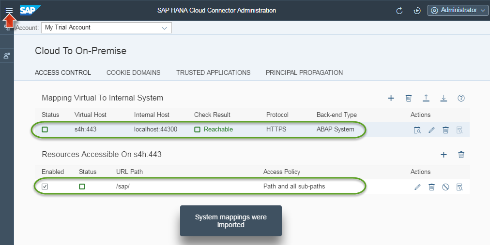
>
> **Related Resources:** For more details see SAP Cloud Platform Documentation: [Configuring Access Control](https://help.hana.ondemand.com/help/frameset.htm?e7d4927dbb571014af7ef6ebd6cc3511.html).

> **Result of Step 6:** You have configured your SAP Cloud Connector to allow access from your SAP Cloud Platform account to all HTTPS resources underneath the path `https://localhost:44300/sap/*`.

[ACCORDION-END]

[ACCORDION-BEGIN [Step 5:](Take snapshot of Linux VM in VirtualBox)]

1.  In the Linux VM window select menu item **Machine** | **Take snapshot**.

2.  Enter snapshot name **NetWeaver & Cloud Connector** and click **OK**.

[ACCORDION-END]

[ACCORDION-BEGIN [Step 6:](Create HTTP destination in trial account)]

Based on the exposed SAP S/4HANA back-end system that is connected with your SAP CP trial account you now create a new `HTTP destination`. It points to the virtual back-end host `http://s4h:443` and will be used in SAP Web IDE for building a new application.

1.  In Google Chrome, open your **SAP Cloud Platform Cockpit**.

2.  Navigate to your trial account overview by clicking on **Neo Trial**.

3.  In the **Connectivity** | **Cloud Connectors** view a new host entry is added.

    > **Result:** Now the cloud knows about the SAP back-end system and can access it via connectivity destinations to be defined next.
    >
    > | (Virtual) Host | Protocol | Back-End Type   | Resources     |
    > | -------------- | -------- | --------------- | ------------- |
    > | **`s4h:443`**    | **HTTP** | **ABAP System** | **Available** |
    >
    > 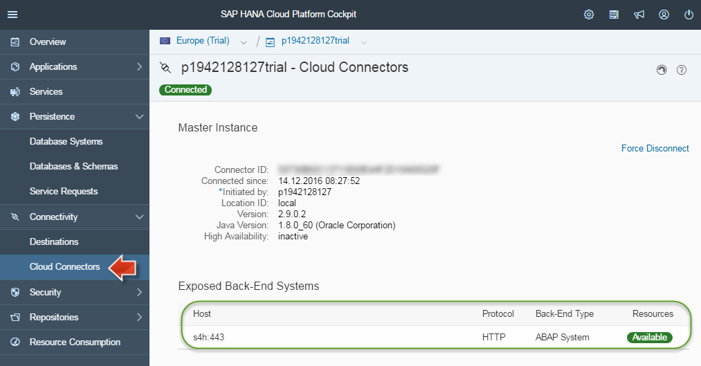

4.  In the SAP CP Cockpit tab of your browser open **Connectivity** | **Destinations**.

5.  Click on **`New Destinations`** and fill in the following settings:

    **Destination Configuration**

    Property   | Value
    -----------| ------------
    Name       | **`s4h-onpremise-http`**
    Type       | **`HTTP`**
    Descriptor | **`S/4HANA HTTP API`**
    URL        | **`http://s4h:443`**
    Proxy Type | **`OnPremise`**
    Authentication | **`BasicAuthentication`**
    User | **DEVELOPER**
    Password | this password was assigned by you after logging on for the first time with the user DEVELOPER. The tutorial recommended to use the password **`Appl1ance`**.

6.  In the section **`Additional Properties`**, click on **`New Property`** and create the following two properties:

    Additional Property | Value
    --------------------|------------
    `WebIDEEnabled`       | **`true`**
    `WebIDEUsage`        | **`odata_abap,ui5_execute_abap,dev_abap`**

    > **Note:** The URL `http://s4h:443` points to the virtual SAP Cloud Connector host **`s4h:443`**
    > The additional properties `WebIDEEnabled` and `WebIDEUsage` allow SAP Web IDE to call `design-time-specific` OData services from the ABAP backend  (e.g. `odata_abap` for the OData functionality of SAP Gateway, which allows SAP Web IDE to access the OData service catalog of the ABAP backend system).

7.  Click **Save**.

    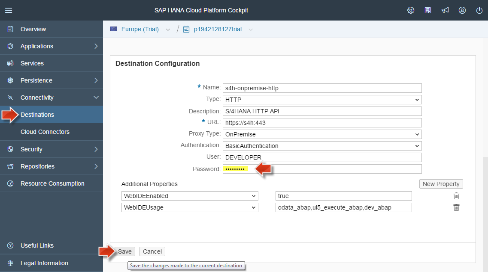

    The newly created HTTP destination configuration is displayed in read-only mode:

    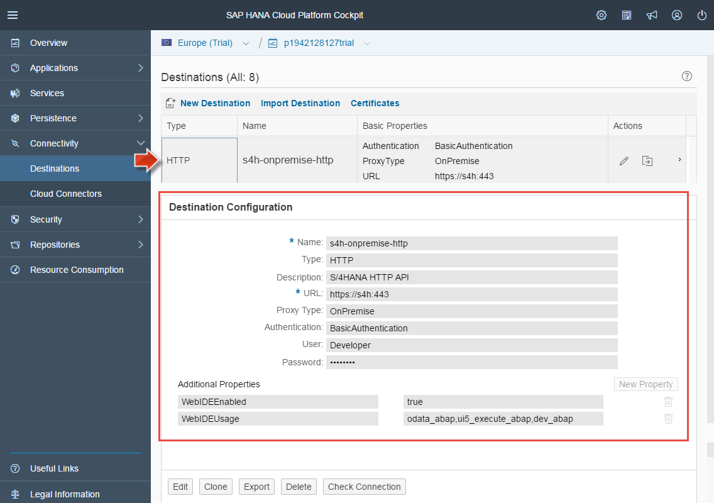

8.  Click **Check Connection** to test system communication between SAP Cloud Platform and the SAP back-end on network level.

    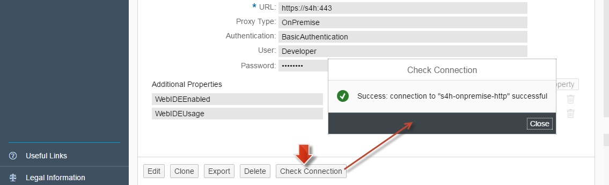

> **Result:** You added a new HTTP destination to your SAP CP trial account that points to the S/4HANA back-end system and enables OData service access via virtual host `http://s4h:443`.
>
> **Related Resources:** For more details see SAP Cloud Platform Documentation:
>
> -   [Destinations](https://help.hana.ondemand.com/help/frameset.htm?1e110da0ddd8453aaf5aed2485d84f25.html)
> -   [Creating HTTP Destinations](https://help.hana.ondemand.com/help/frameset.htm?1e110da0ddd8453aaf5aed2485d84f25.html)
> -   [SAP Web IDE - Connecting Remote Systems](https://help.hana.ondemand.com/webide/frameset.htm?5c3debce758a470e8342161457fd6f70.html)

[ACCORDION-END]

[ACCORDION-BEGIN [Step 7:](Test OData service access in SAP Web IDE)]

With the HTTP destination in place you can use SAP Web IDE to browse the OData services that are exposed by the SAP S/4HANA on-premises back-end.

1.  In Google Chrome browser open your **SAP Web IDE** in a new tab:
    - Open your **SAP Cloud Platform Cockpit**
    - Navigate to your trial account overview by clicking on **Neo Trial**
    - Open **Services**
    - Search for and open service **SAP Web IDE**
    - Click on **Go to Service**

2.  On the `Welcome` page in section `Create a Project` click on **New Project from Template**.

    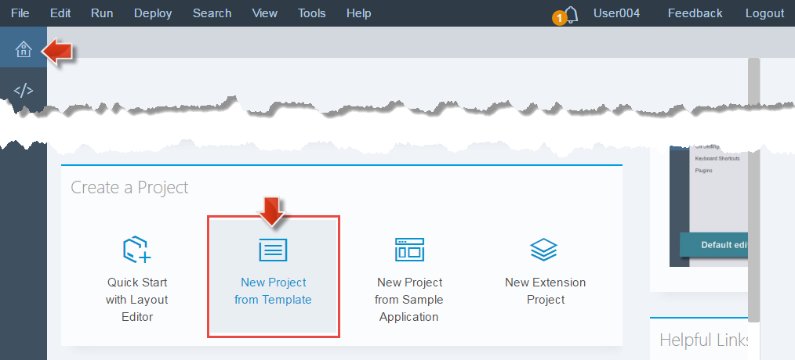

3.  Click on tile **List Report Application** and click **Next**.

    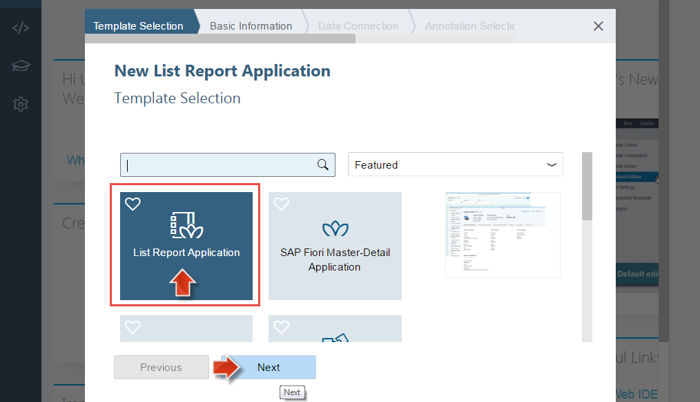

4.  Enter "Project Name" **Test**, "Title" **Test** and click **Next**.

5.  In the "Data Connection" step keep the default source `Service Catalog` selected and choose the system entry `S/4HANA HTTP API` from the dropdown list to load all exposed services into the table.

6.  In the filter field enter **`PROD`** to view all matching OData services including **`EPM_REF_APPS_PROD_MAN_SRV`**.

    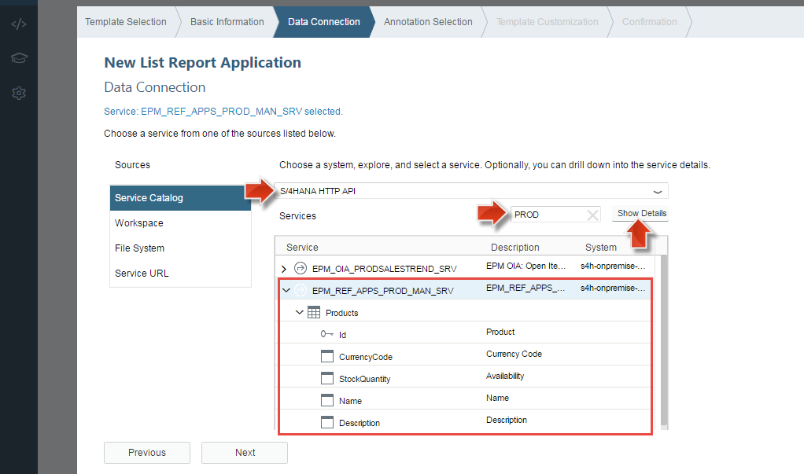

7.  Click **Show Details** to get closer information on the selected  **`EPM_REF_APPS_PROD_MAN_SRV`** OData service.

    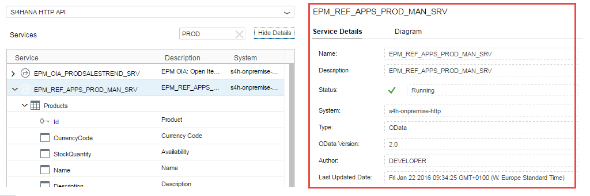

8.  Click the **Cancel** button in the upper right corner of the template creation dialog. We come back to SAP Web IDE later when we create the UX extension part.

    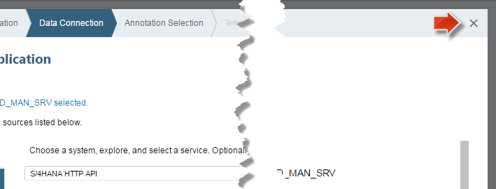

> **Result of Step 9:** The SAP Cloud Connector is installed on your Linux VM with a secure connection between your SAP CP trial account and the SAP back-end system. The OData service **`EPM_REF_APPS_PROD_MAN_SRV`** can be selected in SAP Web IDE to build an application consuming it. This proves that everything is working as it should.

[ACCORDION-END]

You have now successfully completed this tutorial. In the next part of the tutorial, you will learn how to set up a SAP Fiori Launchpad on SAP Cloud Platform using the Cloud Portal service: [Create SAP Fiori Launchpad on SAP Cloud Platform](https://www.sap.com/developer/tutorials/cp-s4-ext-ui3-cloud-portal.html)
