## Prerequisites
- **Proficiency:** Intermediate
- **Tutorials:** [Create SAP Fiori Launchpad on SAP Cloud Platform](https://www.sap.com/developer/tutorials/cp-s4-ext-ui3-cloud-portal)
- **Systems, Tools, Services:**
    -  in Google Chrome browser: SAP Web IDE, SAP CP cockpit

## Details
### You will learn
In this tutorial you will learn how to import, develop, test and deploy HTML5 applications using SAP Web IDE on SAP Cloud Platform. You first import the Fiori app `Manage Products` from the ABAP MIME repository of a SAP S/4HANA on-premises back-end system to your SAP CP trial account. By adding new SAPUI5 custom code you create an extension app that sorts, groups and filters data. Finally You will integrate the extension app in the Fiori Launchpad in your SAP Cloud Platform trial account.

### Time to Complete
**30 Mins**

---

[ACCORDION-BEGIN [Step 1:](Check SAP Cloud Connector is operational)]

1.  In the running `Oracle VM VirtualBox` open a `Konsole` (KDE **Application Menu** | **System** | **Konsole**)

2.  To check the `SCC` status execute **`sudo service scc_daemon status`** (will ask for root password).

3.  If status output is:
    -   `Active: active` then Cloud Connector is up and running.

        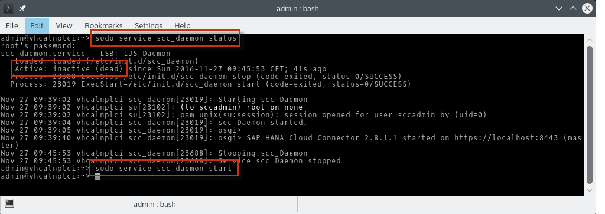

    -   `Active: inactive` then start Cloud Connector: **`sudo service scc_daemon start`**

        -   Then **Check _SCC_ status** again.

        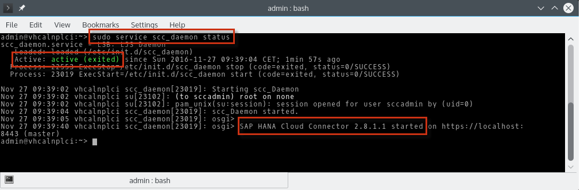

4.  If you run into problems you can restore your VirtualBox snapshot `NetWeaver & Cloud Connector`.

> **Result of Step 1:** You have verified that SAP Cloud Connector is up and running.

[ACCORDION-END]

[ACCORDION-BEGIN [Step 2:](Import Fiori app from ABAP repository)]

In this step you will take a look at the default `manage products` application and find out that it does not contain all the features we require.

1.  Open `S/4HANA Fiori Launchpad` by opening the URL **`https://localhost:44300/sap/bc/ui5_ui5/ui2/ushell/shells/abap/FioriLaunchpad.html`** in your browser

    >**Note:** You can find this link by:
    - Open SAP Easy Access (SAP Logon).
    - Select **Favorites** | **Launchpad** and open context menu (using a right-click).
    - Click **Change Favorites** entry.
    - Copy the URL and replace the beginning part of the URL `http://vhcalnplci.dummy.nodomain:8000` with `https://localhost:44300`.

2.  Enter your user credentials **`Developer`** / **`Appl1ance`** to log in.
    -   The launchpad contains the groups `Employee (EPM)` and `Purchase (EPM)` with three applications `Shop`, `Approve Purchase Order` and `Manage Products`.

3.  Click on tile **Manage Products** to start the standard Fiori application that is running in the SAP S/4HANA back-end system.

    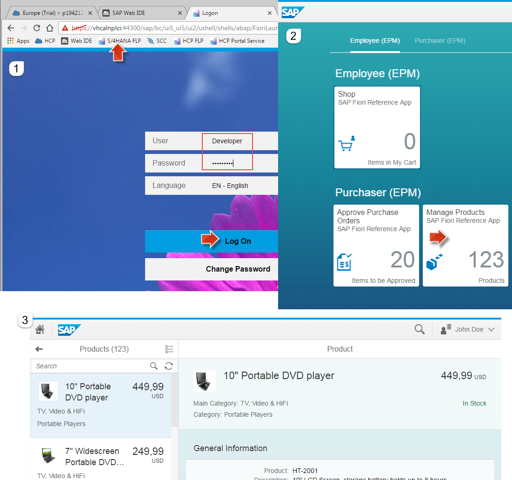

4.  Press the footer toolbar buttons **Group** and **Filter** to see, that the standard Fiori app running in the S/4HANA back-end does not provide any capability to "sort by" or to "filter by" `Average Ratings`.

    

[ACCORDION-END]

[ACCORDION-BEGIN [Step 3:](Import Manage Products app)]

In this step you will learn how to import a standard SAPUI5 app, which is located in your SAP S/4HANA on-premises back-end into the SAP Web IDE.

1.  In Google Chrome browser open your `SAP Web IDE` in a new tab:
    - Open your **SAP Cloud Platform Cockpit**
    - Navigate to your trial account overview by clicking on **Neo Trial**
    - Open **Services**
    - Search for and open service **SAP Web IDE**
    - Click on **Go to Service**

    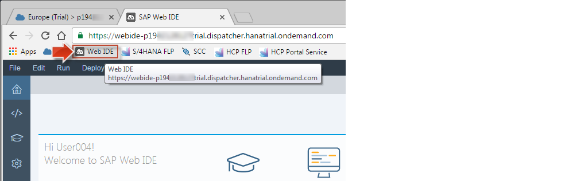

2.  Go to the SAP Web IDE and choose menu item **File** | **Import** | **Application from SAPUI5 ABAP Repository**.

    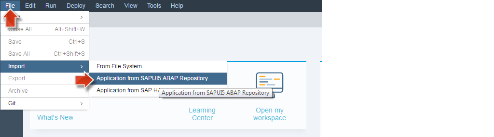

3.  In the popup dialog enter query string **`prod`** to filter the applications that are available in the SAPUI5 ABAP Repository of the SAP back-end system.

4.  Select application `EPMRA_PRODMAN` (SAP Fiori Reference Application `Manage Products`).

5.  Rename the `Target Folder` to **`manageproducts`** (from default `EPMRA_PRODMAN`).

6.  Click **OK** to fetch this application from the SAPUI5 ABAP Repository (on back-end side) to the SAP Web IDE on SAP Cloud Platform.

    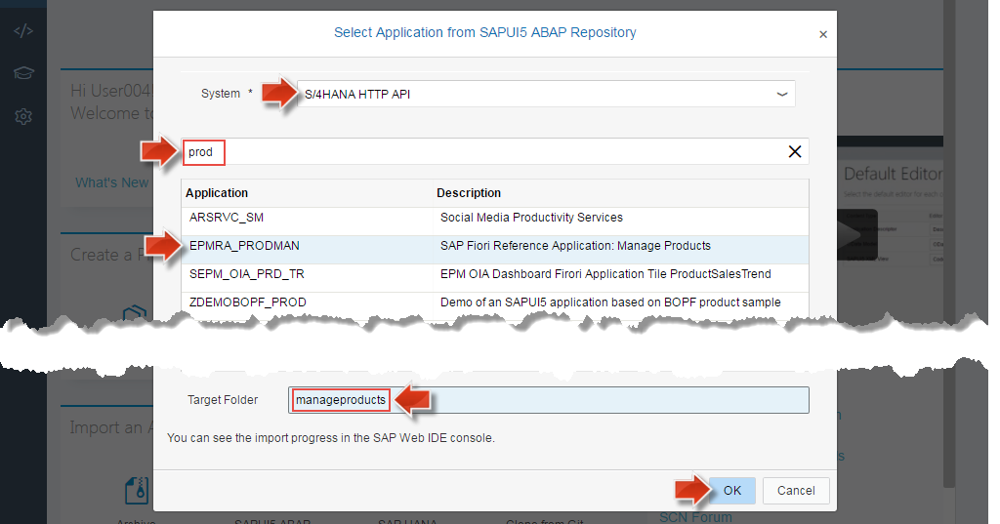

    >**Note:** The so-called [SAP Fiori Reference Apps](http://scn.sap.com/docs/DOC-59963) `Shop` and `Manage Products` used in this tutorial are sample applications for learning purposes. They do not access `real` product master data from the S/4HANA backend but are connected to the `Enterprise Procurement Model`.

7.  In the workspace tree click on the folder icon of the newly imported project **manageproducts** to view its content.

    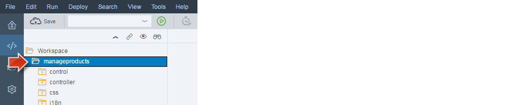

8.  Double-click on file **Workspace** | **manageproducts** | **neo-app.json**. The **neo-app.json** file provides the integration details between the user interface and the backend. Look at the destination **`s4h-onpremise-http`** that is used in the extension app. This destination is blending in the backend system in the path of the application.

    ```json
    {
      "welcomeFile": "index.html",
      "routes": [
        {
          "path": "/sap/opu/odata",
          "target": {
            "type": "destination",
            "name": "s4h-onpremise-http",
            "entryPath": "/sap/opu/odata"
          },
          "description": "S/4HANA HTTP API"
        },
        \[...]
      ]
    }
    ```

9.  To run the application click on node **manageproducts** and click the **Run** toolbar button (icon with green arrow symbol). In the popup click **Open Run Configuration**.

    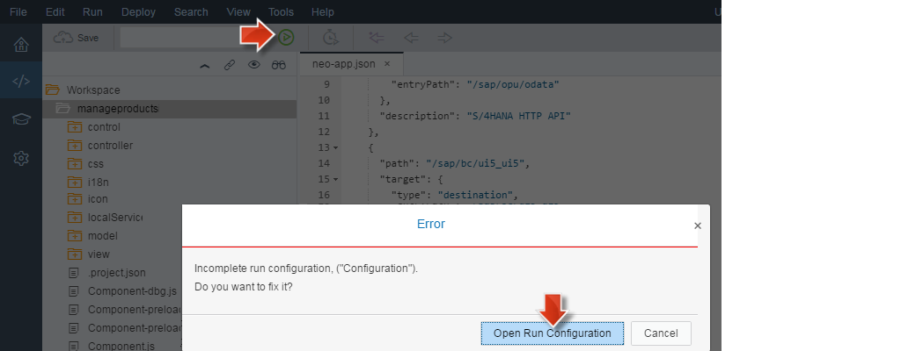

10.  Click the **+** button and select menu item **SAP Fiori Component on Sandbox**.

    

11.  In the next wizard step keep all settings defined in run configuration `Run Component.js` unchanged. Click **Save and Run** to start the application in a new browser tab.

    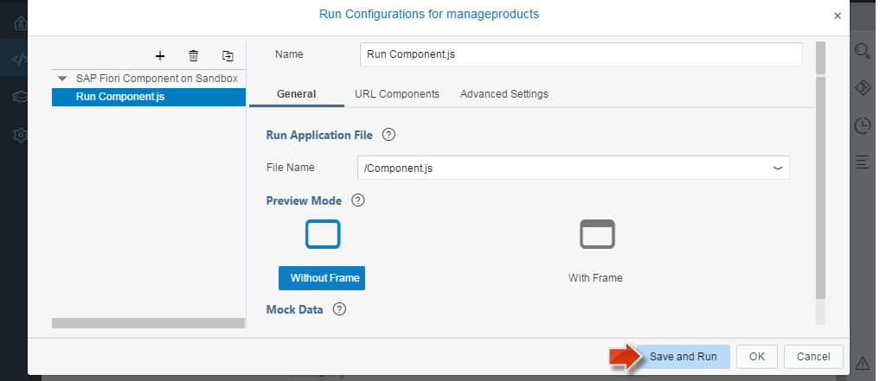

> **Result of Step 3:** You imported the existing Fiori app `Manage Products` from the SAP S/4HANA back-end into your SAP CP trial account by using SAP Web IDE. Within the application preview of SAP Web IDE you see that the imported application does not yet display image resources to be retrieved from the SAP S/4HANA back-end system.
>
> 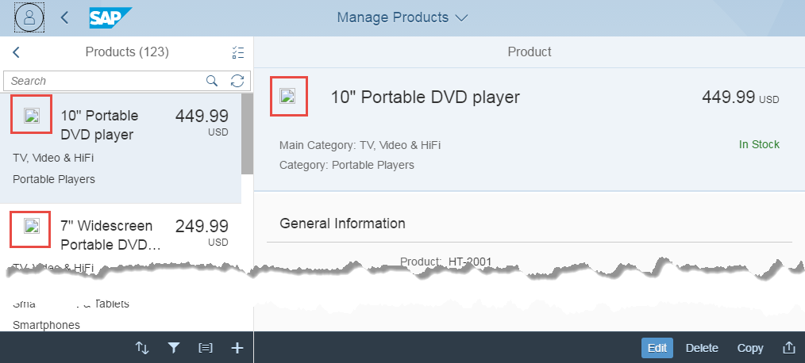

[ACCORDION-END]

[ACCORDION-BEGIN [Step 4:](Explore how Fiori app talks with backend)]

In this step you will explore how the Fiori application `Manage Products` communicates with Cloud Platform to fetch OData service data and image files from the SAP S/4HANA back-end system. By using the Google Chrome Developer Tools and by changing the **neo-app.json** file in SAP Web IDE you make the missing images appear in the application front end.

Inspect Missing Image Resources with Chrome Developer Tools

1.  Open Developer Tools in Google Chrome:

2.  Click the utmost right button in the browser toolbar (or press **Alt + F**) to customize and control Google Chrome.

3.  Select menu item **More tools** | **Developer tools** or press **Ctrl + Shit + I**.

    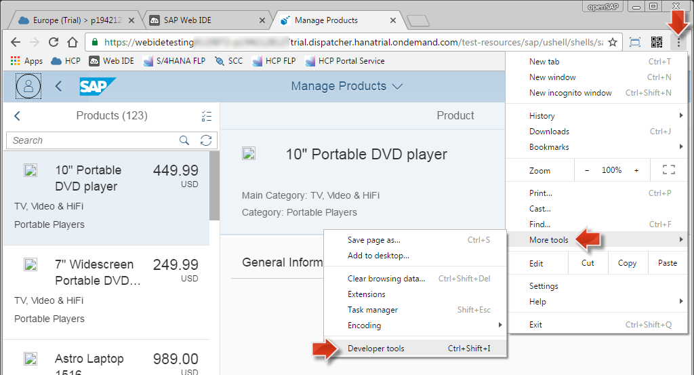

4.  Click on the `Network` panel and reload the page:

    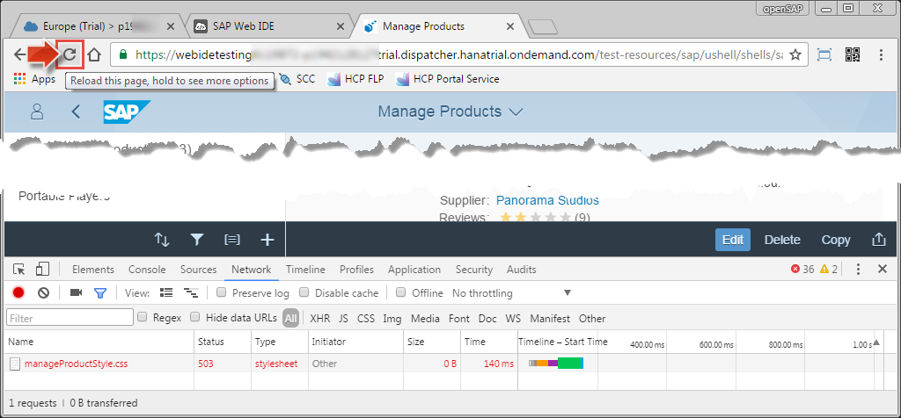

5.  Look at lines with Status **404** and double-click one of them e.g. `HT-2001.jpg`. In the preview tab You see the message text **HTTP Status 404 - Not found**.

    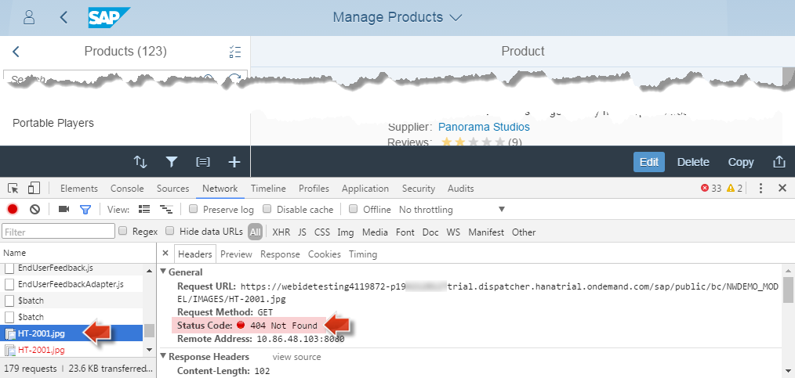

6.  See the image URL in the address bar: **`https://\[...]dispatcher.hanatrial.ondemand.com/sap/public/bc/NWDEMO_MODEL/IMAGES/HT-2001.jpg`** and note that all images are loaded from the path **sap/public/bc**.

    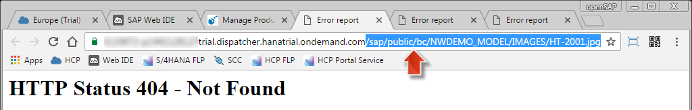

    To open access to MIME resources from back-end path **sap/public/bc** you need to edit the **neo-app.json** file that currently defines access to the **sap/opu** path. You can either additionally expose the **sap/opu** path or  open access by truncating the existing path from **/sap/opu/odata** to **/sap** (as described by Thomas in the video).

7.  In SAP Web IDE select tab **neo-app.json**.
    -   In the destination named `s4h-onpremise-http` shorten the `path` and `entryPath` values from **/sap/opu/odata** to **/sap**.

        ```json
        {
        "welcomeFile": "index.html",
        "routes": [
          {
            "path": "/sap",
            "target": {
              "type": "destination",
              "name": "s4h-onpremise-http",
              "entryPath": "/sap"
            },
            "description": "S/4HANA HTTP API"
          },
          ...
          ]
          }
        ```

    -   Save the file.

        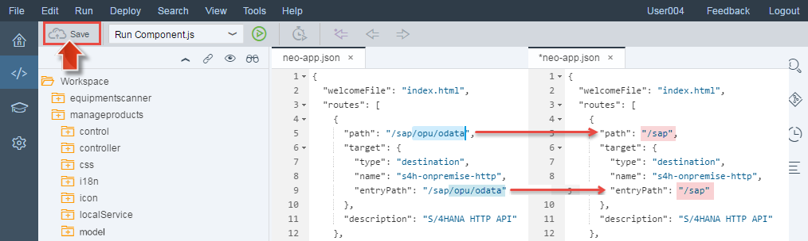

8.  Click the **Manage Products** browser tab and refresh the page.

    > **Note:** to refresh the browser cache hold **CONTROL** key (on a mac) or use shortcut **CTRL+F5**).

> **Result of Step 4:** You adapted the imported manage products application to use the **`s4h-onpremise-http`** destination of the connectivity services. As a result, you can now also see the images for the products.
>
> 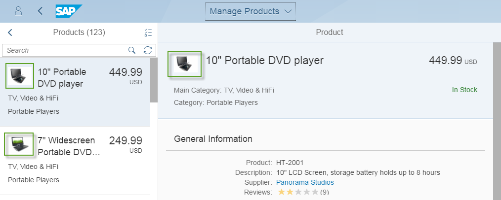

[ACCORDION-END]

[ACCORDION-BEGIN [Step 5:](Import/test extended Fiori app)]

In the next step you will extend the imported Fiori app by adding sort, filter and grouping functions with new SAPUI5 custom code. After importing the ready-to-run extension app into SAP Web IDE you explore the new functions on front end side and in the SAPUI5 source code.

1.  Download the file [rating-extension.zip](./imports/html5/rating-extension.zip?raw=true) and open it in your ZIP client to view all changed project files.

2.  In the SAP Web IDE project tree click **manageproducts**:

3.  Open context menu item **Import** | **From File System**.

    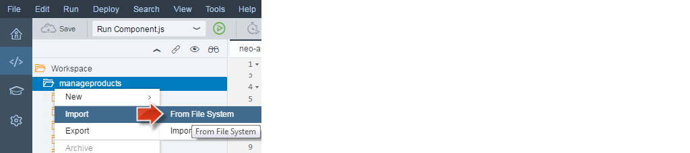

4.  In the Import dialog choose file **rating-extension.zip** you downloaded before.

5.  To change the `Import to` field click **Select Folder** and choose **Workspace** | **manageproducts** and click  **OK**.

    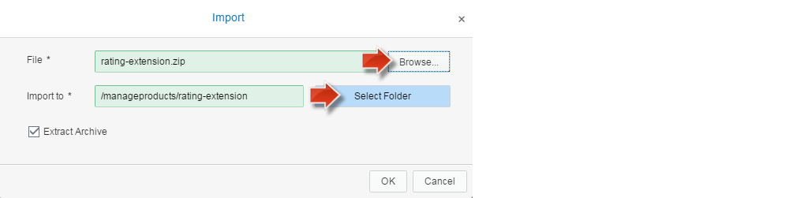

    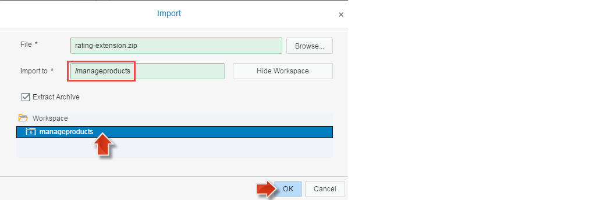

6.  Confirm the warning message `Folder "manageproducts" already contains files. Files with the same name will be overwritten.` and click **OK**.

    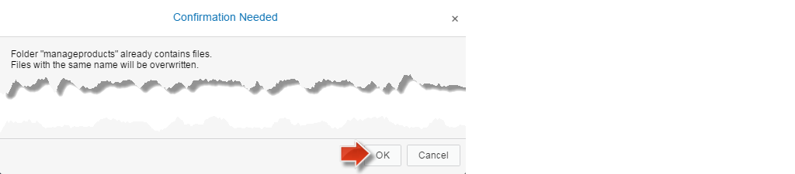

    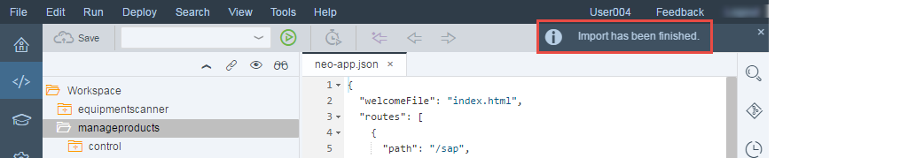

7.  Run the application once more by clicking the **Run** toolbar button.

    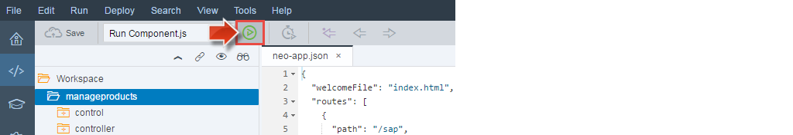

8.  In the left side of the footer toolbar click the sort, filter and grouping buttons to view the new **Average Rating** entries. Filter by **Average Rating: 1-2 (low)**.

    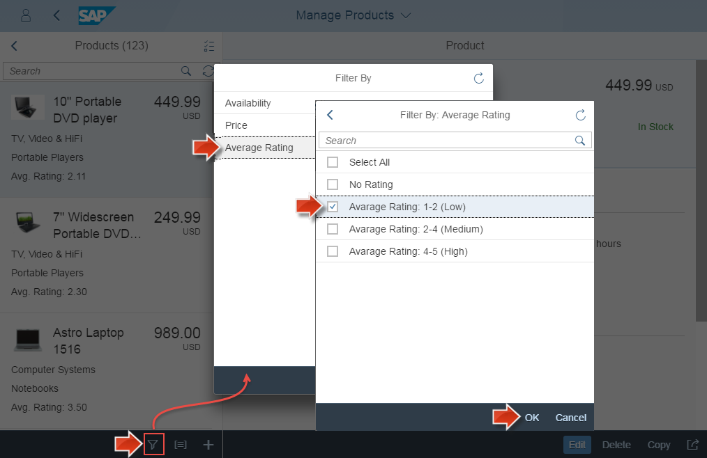

> **Result of Step 5:** With the new functions of the extended **Manage Products** Fiori application the procurement manager is able to easily filter by average user rating so that low-rated products can be found easily.
>
>  

[ACCORDION-END]

[ACCORDION-BEGIN [Step 6:](Explore custom code)]

1.  Move back to the SAP Web IDE tab and open the file **Workspace** | **manageproducts** | **view** | **`ProductFilterDialog.fragment.xml`** with  double-click.

2.  The code block that was added during ZIP-file import is delimited by the lines **&lt;!-- begin** and **&lt;!-- end**. Also read the related description at the beginning to better understand the contained source code. You can also read the full source code here: [`ProductFilterDialog.fragment.xml`](./src/html/manageproducts/view/ProductFilterDialog.fragment.xml).

3.  Open the file **Workspace** | **manageproducts** | **view** | **`ProductGroupingDialog.fragment.xml`** ([`ProductGroupingDialog.fragment.xml`](./src/html/manageproducts/view/ProductGroupingDialog.fragment.xml)) with  double-click to view the added source code:

    ```xml
    <!-- Extending S/4HANA with SAP CP -->
    <!-- * UX Extension: Adding filtering/sorting/grouping for AverageRating property -->
    <!-- begin -->
    <ViewSettingsItem id="avgRatingGroupItem"  text="{/#Product/AverageRating/@sap:label}" key="AverageRating" />
    <!-- end   -->
    ```

4.  Open the file **Workspace** | **manageproducts** | **view** | **`ProductSortDialog.fragment.xml`** ([`ProductSortDialog.fragment.xml`](./src/html/manageproducts/view/ProductSortDialog.fragment.xml) with double-click to view the added source code:

    ```xml
    <!-- Extending S/4HANA with SAP CP -->
    <!-- * UX Extension: Adding filtering/sorting/grouping for AverageRating property -->
    <!-- begin -->
    <ViewSettingsItem id="avgRatingSortItem" text="{/#Product/AverageRating/@sap:label}" key="AverageRating" />
    <!-- end -->
    ```

5.  To look at the added controller logic that handles the new grouping function open the file **Workspace** | **manageproducts** | **controller** | **`SubControllerForFGS.js`**, see [`SubControllerForFGS.js`](./src/html/manageproducts/controller/SubControllerForFGS.js). Go through this source code and check how it is done by reading the comment code lines.

[ACCORDION-END]

[ACCORDION-BEGIN [Step 7:](Deploy extended app to SAP Cloud Platform)]

In the last step you deployed an extended SAP Fiori app to the git repository of your SAP CP trial account.

The `manageproducts` SAPUI5 project that was imported from the local SAP NetWeaver AS ABAP system already contains a minified JavaScript file `Component-preload.js` to improve loading performance. If you want modify this project after import you need to make sure that this `Component-preload.js` is built again so that it also contains the changed source code. Otherwise the running application will not show any changes you apply to the project.

Execute the following steps to ensure that the `Component-preload.js` is later built correctly and therefore contains the UX extension code at run-time:

1.  Click **Workspace** | **manageproducts** and choose context menu item **Project Settings**.

    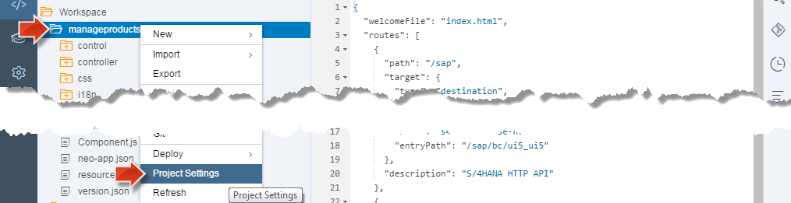

2.  Select tree item **Project Types** and mark checkbox `Project Type` **SAPUI5 Client Build**. Click **Save**.

    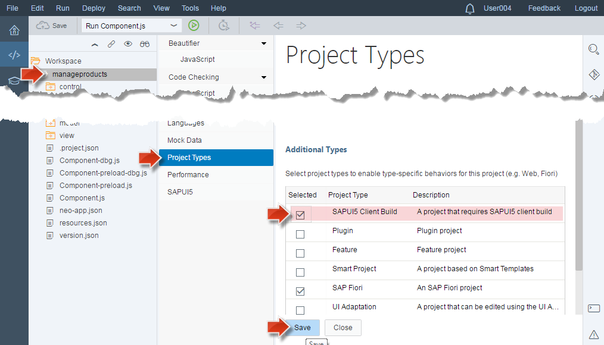

3.  Click **Workspace** | **manageproducts** and choose context menu item **Deploy** | **Deploy to SAP Cloud Platform**.

    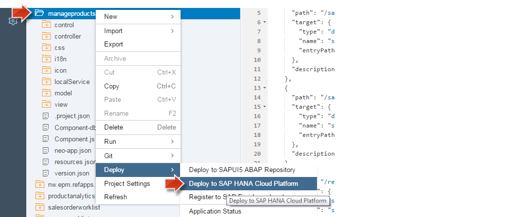

4.  In the `Deploy Application to SAP Cloud Platform` dialog keep all default settings and click **Deploy**.

    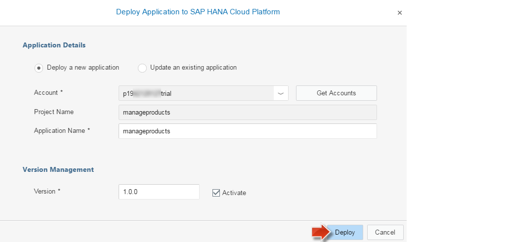

> **Result of Step 7:** The `manageproducts` Fiori app was successfully deployed to the Git repository of Your SAP CP trial account.
>
> 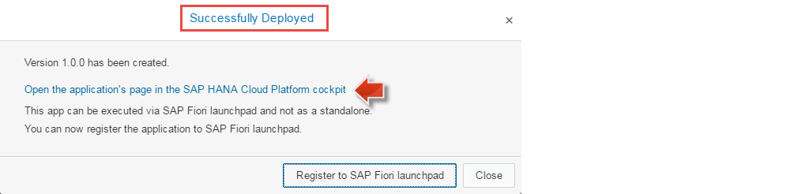
>
> By following the link `Open the application's page in the SAP Cloud Platform cockpit` you can find more application details like `status` and `active version`.
>
> 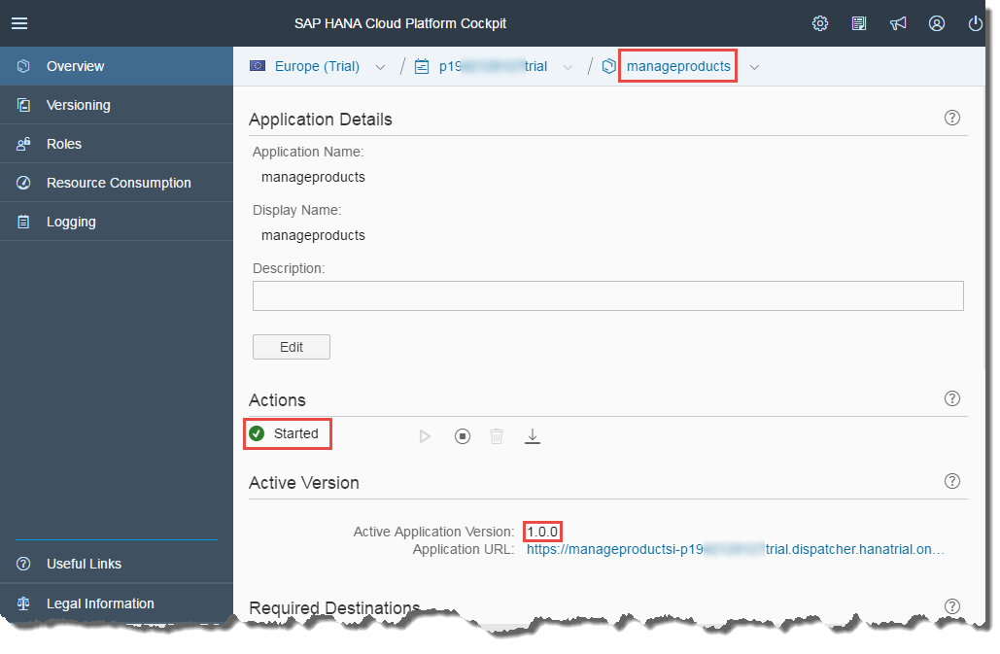

[ACCORDION-END]

[ACCORDION-BEGIN [Step 8:](Register app to Fiori launchpad)]

Back in the browser tab with SAP Web IDE you can directly proceed to register the deployed Fiori app `manageproducts` in SAP Web IDE.

1.  In the confirmation popup click **Register to SAP Fiori launchpad**.

    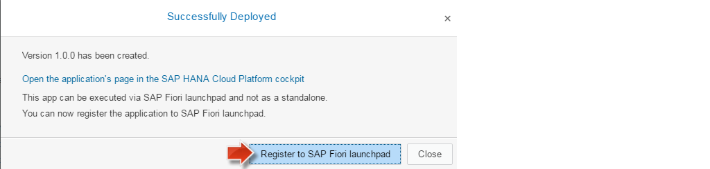

    > **Note:** In case you closed the confirmation popup before, select  **manageproducts** in the project tree and click context menu item **Deploy** | **Register to SAP Fiori Launchpad**.

2.  Under `General Information` click **Next**.

    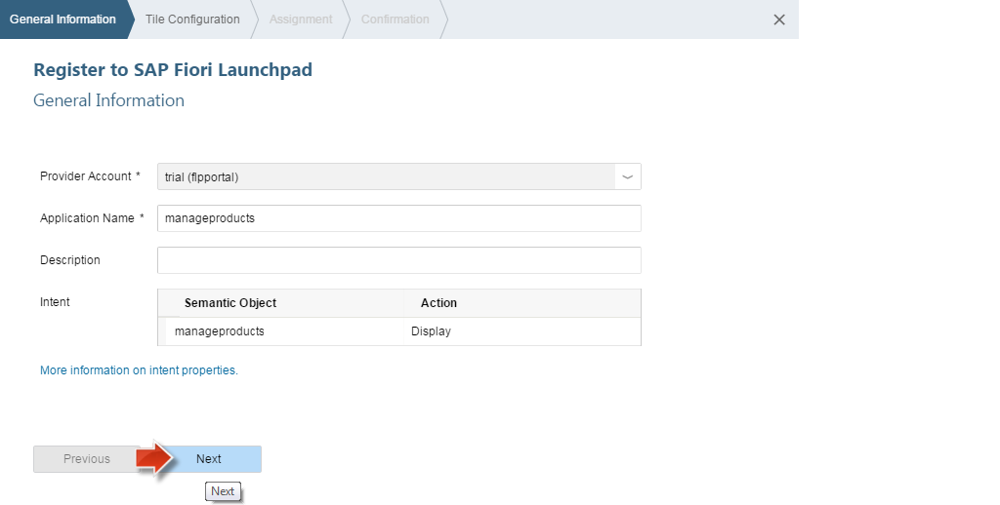

3.  Under `Tile Configuration` enter title and subtitle and click **Next**:
    -   Title: **Manage Products**
    -   Subtitle: **Rating**

    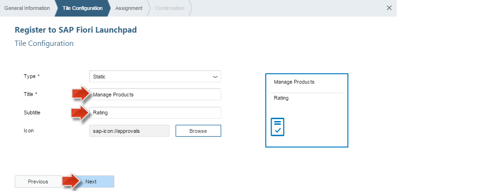

6.  Under `Assignment` select the site, catalog and group and click **Next**:
    -   Site: **Procurement Launchpad**
    -   Catalog: **Procurement Application**
    -   Group: **Product Management**

    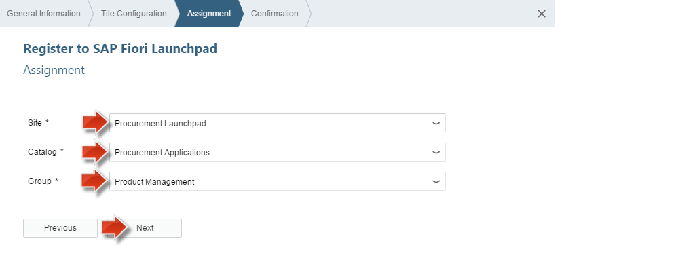

7.  Under `Confirmation` click **Finish**.

    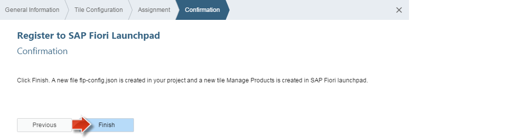

8.  In the confirmation popup **Successfully Registered** click the link **Open SAP Fiori launchpad**.

    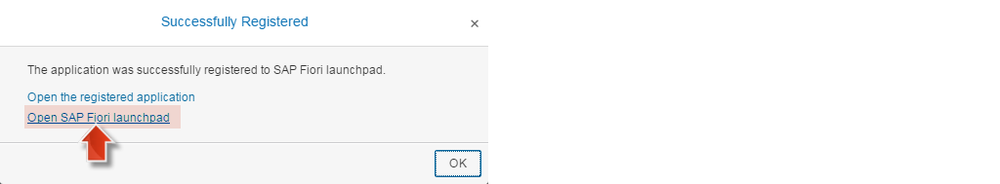

> **Result of Step 8:** On the launchpad you see the new application tile **Manage Products** in group **Product Management**.
> 	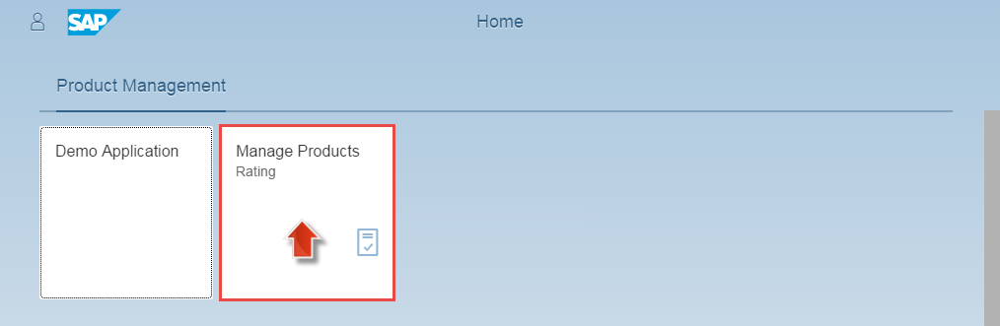

[ACCORDION-END]

[ACCORDION-BEGIN [Step 9:](Look for low-rated products in app)]

In the last step you explore the extended functions in the `Manage Products` Fiori front end that enable the Procurement manager to filter and group products by the average ratings from corporate employees.

1.  In the left side of the footer toolbar click the sort button and click radio button **Average Rating**.

    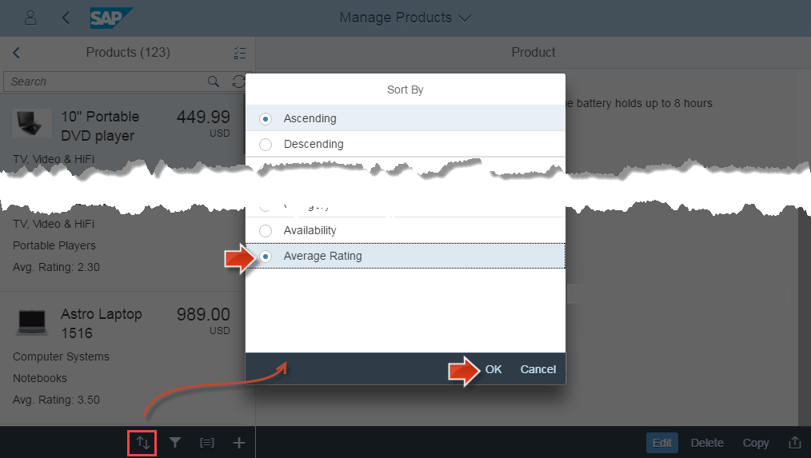

2.  In the Products master view scroll up to the first product entries with low ratings starting from 0.00.

    

3.  In the footer toolbar click the group button and group by **Category**. Click **OK**.

    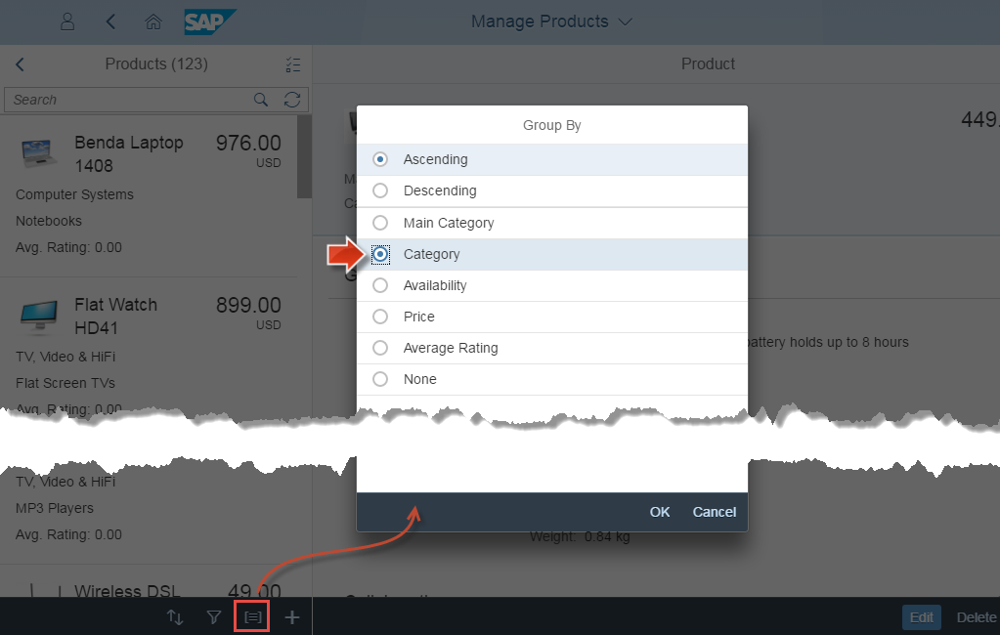

> **Result of Step 9**: In the products table all products are grouped by category wherein the low-rated products are listed first:
> 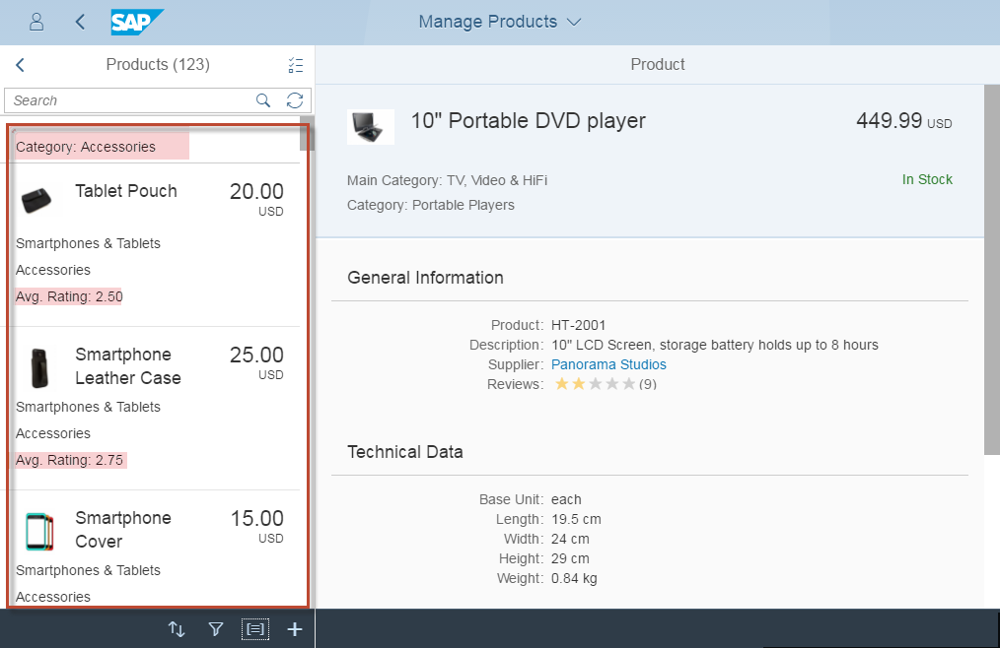

[ACCORDION-END]

You have now successfully completed this tutorial group. You know know how you can provide access to data and applications from your SAP S/4HANA on-premises system to users on SAP Cloud Platform. You have also learned how to embed applications in a SAP Fiori Launchpad on
