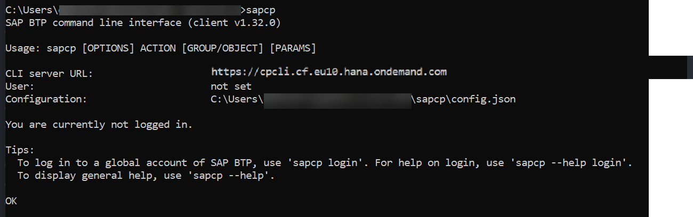
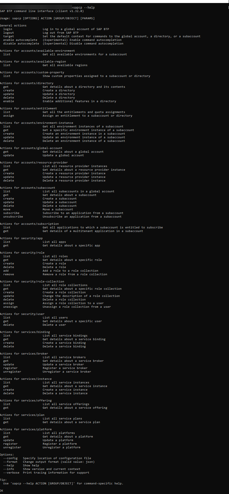
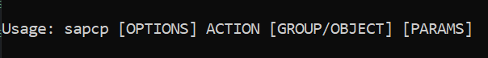
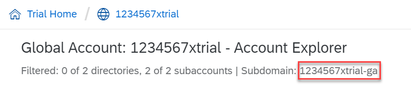
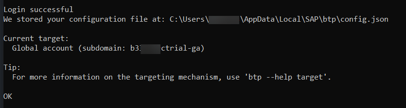

## Prerequisites
 - You have access to a trial account on SAP BTP
 - You are familiar with [the basic concepts of SAP BTP, Trial](cp-trial-quick-onboarding)

## Details
### You will learn
  - What the SAP BTP command line interface (btp CLI) is
  - For which global accounts you can use the btp CLI
  - How the btp CLI works
  - Where and how to download and install the client
  - How commands are structured
  - How to get help in the btp CLI
  - Where to find documentation

>With the release of the btp CLI client version 2.0 on March 25, 2021, the executable file name was changed from `sapcp` to `btp`. This change is reflected in all documentation, including this tutorial. If you still have a 1.X version of sapcp CLI, see [Migrating from sapcp to btp](https://help.sap.com/viewer/65de2977205c403bbc107264b8eccf4b/Cloud/en-US/4f1fe8dd2739467cb7bcab63f918b8dc.html).

---

[ACCORDION-BEGIN [Step 1: ](What is the btp CLI?)]

The btp CLI is **an alternative to the cockpit** for users who prefer working on the command line. It consists of a client and a server. The client is installed on your computer and it interacts with SAP BTP through a server. You connect to this CLI server when you log on to your global account through the btp CLI.

The base call to enter on the command line is `btp`.

Here are some of the tasks you can use the btp CLI for:

- Creating subaccounts and directories
- Managing entitlements of global accounts and subaccounts
- Managing users and their authorizations in global accounts and subaccounts
- Subscribing to applications

[DONE]
[ACCORDION-END]


[ACCORDION-BEGIN [Step 1: ](For which global accounts can I use the btp CLI?)]

SAP is currently migrating all global accounts from the existing cloud management tools feature set A to the renovated cloud management tools feature set B. One of the innovations of feature set B is the command line interface (btp CLI) for account management. With a trial account, you can try out the btp CLI and other features of feature set B.  

Here you can read more about the [Cloud Management Tools Feature Set B Innovations](https://help.sap.com/viewer/3504ec5ef16548778610c7e89cc0eac3/Cloud/en-US/caf4e4e23aef4666ad8f125af393dfb2.html).


[DONE]
[ACCORDION-END]

[ACCORDION-BEGIN [Step 2: ](btp CLI and cf CLI - What's the difference?)]

You may have worked with the [Cloud Foundry CLI (cf CLI)](cp-cf-download-cli) to manage your Cloud Foundry environment. To avoid confusion, here's how the **btp CLI** relates to the **cf CLI**:
The btp CLI is the CLI for working with global accounts on SAP BTP. You use the btp CLI for all tasks on global account, directory, and subaccount level. Going down the account hierarchy, the last step with btp CLI is creating a Cloud Foundry environment instance, which essentially creates a Cloud Foundry org. From org level onwards, i.e. for managing members in orgs and spaces, creating spaces, as well as assigning quota to orgs and spaces, you use the cf CLI.

[VALIDATE_1]
[ACCORDION-END]


[ACCORDION-BEGIN [Step 3: ](Download and install the CLI client)]

Go to the <a href="https://tools.hana.ondemand.com/#cloud-btpcli">SAP Development Tools</a> page to download the latest version of the CLI client for your operating system. Unpack the archive and copy the client file (there is only one file inside, for example, `btp.exe`) to your local system. Make sure that you have read and write permissions in the target folder to run the executable.

In Windows, open the command line to the directory where the client file is located and enter `btp`. For example, you can open the folder and type `cmd` into the address bar.

If you are using macOS, make sure that the client file is in your PATH and open a terminal session. Note that btp CLI may be blocked because it is "from an unidentified developer". Please refer to the macOS documentation to learn how to bypass this.



You get version and usage information, you learn where the configuration file is located, and you get useful tips how to log in and get help in the client.

[DONE]
[ACCORDION-END]

[ACCORDION-BEGIN [Step 4: ](Display the help overview)]

Now type in the following to show a list of all available commands and options:

```Bash
btp --help
```


[DONE]
[ACCORDION-END]


[ACCORDION-BEGIN [Step 5: ](Understand the command syntax: usage)]



Each command starts with the base call `btp`. The syntax of the command itself is very close to natural language: It starts with a verb, i.e. the *action*, followed by a *group/object* combination. So you build a command by combining `btp` with an action (let's say *list*) and a group/object combination (let's say *accounts/subaccount*):  `btp list accounts/subaccount`


[DONE]
[ACCORDION-END]

[ACCORDION-BEGIN [Step 5: ](Understand the command syntax: options)]

Additionally, **options** and **parameters** can be added to a command. As you've seen in the overview of all commands, there are the following options that you can add at the beginning of each command. For example, to get help on a specific command or to use the verbose mode.

```Bash
btp --help list accounts/subaccount
```

```Bash
btp --verbose list accounts/subaccount
```


>The `--help` option can also be placed at the end of a command, for example `btp list accounts/subaccount --help`.

[VALIDATE_3]
[ACCORDION-END]


[ACCORDION-BEGIN [Step 5: ](Understand the command syntax: parameters)]

**Parameters** are added to the end, after the group/object combination. A command can have one **positional parameter** as the first one, followed by other optional or mandatory parameters. The positional parameter is used without a key, all others have a key. The command help specifies the optionality of all parameters and describes what you can or have to add.

For example:

```Bash
btp assign security/role-collection "Global Account Administrator" --to-user example@mail.com --of-idp my-idp
```

"Global Account Administrator" is the positional parameter, and the other two parameters have keys (`--to-user` and `--of-idp`).

[DONE]
[ACCORDION-END]

[ACCORDION-BEGIN [Step 6: ](Log in to your global account)]

Now let's log in. Login is always on global account level. Make sure you know the subdomain of your global account. You can find in the cockpit:

!

Enter the following command:

```Bash
btp login
```

The client proposes the CLI server URL for your trial and you can confirm with ENTER. Once you're logged in, it should look like this:



[DONE]
[ACCORDION-END]

[ACCORDION-BEGIN [Step 7:](Try it out and get more information)]

Here are a few simple examples of commands on global account level that you can try out:

|  Task                                   | Command
|  :-------------                         | :-------------
|  List subaccounts                       | `btp list accounts/subaccount`
|  Get details of the global accounts     | `btp get accounts/global-account`
|  List role collections                  | `btp list security/role-collection`


Or go through the documentation to learn more:

- [Account Administration Using the SAP BTP Command Line Interface](https://help.sap.com/viewer/65de2977205c403bbc107264b8eccf4b/Cloud/en-US/7c6df2db6332419ea7a862191525377c.html)
- [Commands in the btp CLI](https://help.sap.com/viewer/65de2977205c403bbc107264b8eccf4b/Cloud/en-US/a03a5550cdd44fa48ff78d70ca7c9651.html)
- Check out this tutorial: [Automate Account Operations with the Command Line Interface (CLI)](cp-cli-automate-operations)

[DONE]
[ACCORDION-END]


---
