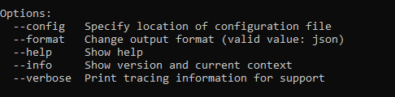

# Get Started with the SAP BTP Command Line Interface (btp CLI)
<!-- description --> Find out what the btp CLI is, download the btp CLI client, and learn how to use it.

## Prerequisites
 - You have access to a global account on SAP BTP that is on feature set B. See [Get an Account on SAP BTP to Try Out Free Tier Service Plans](btp-free-tier-account).
 - You are familiar with [the basic concepts of SAP BTP](https://help.sap.com/docs/BTP/65de2977205c403bbc107264b8eccf4b/73beb06e127f4e47b849aa95344aabe1.html).

## You will learn
  - What the SAP BTP command line interface (btp CLI) is
  - For which global accounts you can use the btp CLI
  - How the btp CLI works
  - Where and how to download and install the client
  - How commands are structured
  - How to get help in the btp CLI
  - Where to find documentation

---

### What is the btp CLI?

The btp CLI is **an alternative to the cockpit** for users who prefer working on the command line. It consists of a client and a server. The client is installed on your computer and it interacts with SAP BTP through a server. You connect to this CLI server (https://cpcli.cf.eu10.hana.ondemand.com) when you log on to your global account through the btp CLI.

The base call to enter on the command line is `btp`.

Here are some of the tasks you can use the btp CLI for:

- Creating subaccounts and directories
- Managing entitlements of global accounts and subaccounts
- Managing users and their authorizations in global accounts and subaccounts
- Subscribing to applications
- Consuming services that are decoupled from the existing environments (referred to as "Other" environment in the Discovery Center), see [Consuming Services in Other Environments Using SAP Service Manager](https://help.sap.com/docs/SERVICEMANAGEMENT/09cc82baadc542a688176dce601398de/0714ac254e83492281d95e25548b388c.html)


### For which global accounts can I use the btp CLI?

SAP is currently migrating all global accounts from the existing cloud management tools feature set A to the renovated cloud management tools feature set B. One of the innovations of feature set B is the command line interface (btp CLI) for account management.

Here you can read more about the [Cloud Management Tools Feature Set B Innovations](https://help.sap.com/viewer/3504ec5ef16548778610c7e89cc0eac3/Cloud/en-US/caf4e4e23aef4666ad8f125af393dfb2.html).


### btp CLI vs environment-specific CLIs

Cloud Foundry: You may have worked with the [Cloud Foundry CLI (cf CLI)](cp-cf-download-cli) to manage your Cloud Foundry environment. To avoid confusion, here's how the **btp CLI** relates to the **cf CLI**:
The btp CLI is the CLI for working with global accounts on SAP BTP. You use the btp CLI for all tasks on global account, directory, and subaccount level. Going down the account hierarchy, the last step with btp CLI is creating a Cloud Foundry environment instance, which essentially creates a Cloud Foundry org. From org level onwards, i.e. for managing service instances and members in orgs and spaces, creating spaces, as well as assigning quota to orgs and spaces, you need to use the cf CLI.

Kyma: The same goes for Kyma: You use the btp CLI for all tasks on global account, directory, and subaccount level. The last step in the btp CLI is create a Kyma environment instance, aka a Kyma cluster. You then need to download the configuration file that you need to access your Kyma cluster. To work in the cluster and manage your Kyma service instances, you need the kubectl. See [Creating SAP BTP, Kyma runtime via the btp CLI](https://blogs.sap.com/2022/02/24/creating-sap-btp-kyma-runtime-via-the-sap-btp-cli/) and [Accessing a Kyma Instance Using kubectl](https://help.sap.com/docs/BTP/65de2977205c403bbc107264b8eccf4b/3e25944e491049b2aeec68c562a5ee48.html).

"Other" Environments: SAP Service Manager allows you to consume services from any runtime environment directly from the subaccount. We refer to this as "other" environment. For this environment type "other", you can use the btp CLI to manage services, instances, plans, and the like, because these are managed on subaccount level. See [Working With Resources of SAP Service Manager Using the btp CLI](https://help.sap.com/docs/BTP/65de2977205c403bbc107264b8eccf4b/fe6a53bfe48e4831b2f5ae7f06d4f07d.html).


### Download and install the btp CLI client

1. Go to the <a href="https://tools.hana.ondemand.com/#cloud-btpcli">SAP Development Tools</a> page to download the latest version of the btp CLI client for your operating system.
2. Extract the client executable from the tar.gz archive as follows:
    - Linux: Use the terminal to extract the tar.gz archive with `tar -vxzf <tar.gz name>`
    - macOS: Open the tar.gz file with a double click.
    - Windows: Use PowerShell to extract the tar.gz archive with `tar -vxzf <tar.gz name>`. Alternatively, use an external tool to extract the executable file to your system.
3. Copy the client executable from the unpacked folder to a directory of your choice. We recommend the following:
    - Linux: `/usr/local/bin`
    - macOS: `/usr/local/bin`
    - Windows: `C:/Users/<your-user>`
4. Ensure that the directory with the btp executable is in your PATH.
    - macOS and Linux: Start the terminal and try executing `btp`. The above-mentioned location should be part of your PATH by default.
    - Windows: We recommend to add the location of the btp.exe to your path. In Windows search, enter "System Properties" and, under **Advanced**, open **Environment Variables**. Under **User variables**, open **Path** and add the file location of the btp.exe (C:\Users\<your-user>). Now you can run the btp CLI by entering `btp`into Command Prompt or PowerShell.
5. Open a terminal and enter `btp`.

The output should look similar to this screenshot:


### Display help

Now type in the following to get syntax instructions and examples help calls:

```Bash
btp help
```


You can call up help in the client on different levels, from an introductory help page `btp help`, over help for individual actions, to quite extensive command-specific help. You can either type `btp help [...]` or append `--help` to the end of (incomplete) commands:

|  Syntax     | Example
|  :------------- | :-------------
|  `btp help <ACTION>`           | `btp help list`
|  `btp help <GROUP>`           | `btp help accounts`
|  `btp help <GROUP/OBJECT>`    | `btp help accounts/subaccount`
|  `btp help <ACTION> <GROUP/OBJECT>`            | `btp help list accounts/subaccount`
|  `btp <ACTION> <GROUP/OBJECT> --help`            | `btp list accounts/subaccount --help`
|  `btp <ACTION> --help`            | `btp list --help`


### Log in to your global account

Now let's log in: 

The **CLI server URL** (https://cpcli.cf.eu10.hana.ondemand.com) is proposed at login - just accept it with ENTER. This server routes client requests to the platform services. Note that there is just this one central CLI server, independent of the regions in which your subaccounts reside. 

You have two options for login:

We recommend to login with single sign-on through a browser. To do this, use:

```Bash
btp login --sso
```

For login on the command-line, use:

```Bash
btp login
```

If you have enabled Two-Factor-Authentication, you need to append the token to your password. 

Once you're authenticated, you will automatically be logged in to your global account. If you have access to more than one global account, the CLI will display a list of global accounts  from which you can select one. 

When you're logged in, it should look similar to this:


### Understand the command syntax


Each command starts with the base call `btp`. The syntax of the command itself is very close to natural language: It starts with a verb, i.e. the *action*, followed by a *group/object* combination. So you build a command by combining `btp` with an action (let's say *list*) and a group/object combination (let's say *accounts/subaccount*):  `btp list accounts/subaccount`

Additionally, **options** and **parameters** can be added to a command. As you've seen in the overview of all commands, there are the following options that you can add at the beginning of each command. For example, to use the verbose mode.

```Bash
btp --verbose list accounts/subaccount
```



>To call help, you can always place `--help` at the end of a command, even if it's not complete. For example, `btp list --help`, `btp accounts --help`.

**Parameters** are added to the end, after the group/object combination. A command can have one **positional parameter** as the first one, followed by other optional or mandatory parameters. The positional parameter is used without a key, all others have a key. The command help specifies the optionality of all parameters and describes what you can or have to add.

For example:

```Bash
btp assign security/role-collection "Global Account Administrator" --to-user example@mail.com --of-idp my-idp
```

"Global Account Administrator" is the positional parameter, and the other two parameters have keys (`--to-user` and `--of-idp`).


### Understand the context you've targeted 

Your first login takes you into a global account. Now, all commands are executed on global account level, unless you specify a different context. Remember you can manage the global account and its directories and subaccounts with the btp CLI. So if you want to change the context in which commands are executed to a directory or a subaccount, you can do so using the target command. There are two different ways of using this command: 

For an easy, interactive selection of the new target, use: 

```Bash
btp target
```
This will display the children and let you navigate up and down the account hierarchy. 

For directly setting a new target, use:

```Bash
btp target [--subaccount <ID> | --directory <ID> | --global-account <SUBDOMAN>] 
```

The targeting mechanism works according to the hierarchy of entities in the global account:

- After initial login, a global account is targeted.

- If a subaccount or directory is targeted and you run a command that only works on a higher level, the command will be executed in the parent directory or global account of the current target. For example, `list accounts/subaccount` lists all subaccounts of the global account, even if a subaccount or a directory is targeted.

- If a subaccount or directory is targeted, you can execute commands in its parent directory or global account by adding parameters `-dir` or `-ga` without a value. For example, if a subaccount is targeted, `btp list security/user` lists the users of that subaccount. To list the users of the parent directory or global account, use: `btp list security/user -dir` or  `btp list security/user -ga`.

>To find out your current target, use `btp --info`.

>To set the target back to the current global account, use `btp target -ga`.


### Enable command autocompletion


We recommend to enable command autocompletion so you won't have to remember or keep looking up individual commands. Command autocompletion saves you keystrokes when entering command actions, group-object combinations, and their parameters. Autocompletion is supported for  Bash, PowerShell, and Zsh.

```Bash
btp enable autocomplete <SHELL>
```
Enter a partial command action, group-object combination, or parameter, and then press the Tab key. The command line either automatically completes your command or, when there's more than one option available, it displays a list of suggested command actions/options/parameters. When a suggestion list is displayed, use the Tab or arrow keys to move through the list and press Enter to make a selection.

When you enable command autocompletion, a script containing all the autocomplete commands is downloaded and installed in your file system. Additionally, the RC file of your shell is modified so the script is called at startup.

The autocompletion option remains enabled in future sessions in your current client, until you disable it. To disable command autocompletion and uninstall the autocomplete script, run `disable autocomplete <shell>`.


### Try it out and get more information


Here are a few simple examples of commands on global account level that you can try out:

|  Task                                   | Command
|  :-------------                         | :-------------
|  List subaccounts                       | `btp list accounts/subaccount`
|  Get details of the global accounts     | `btp get accounts/global-account`
|  List role collections                  | `btp list security/role-collection`


To learn more:

- See the documentation on SAP Help Portal: [Account Administration Using the SAP BTP Command Line Interface](https://help.sap.com/viewer/65de2977205c403bbc107264b8eccf4b/Cloud/en-US/7c6df2db6332419ea7a862191525377c.html).
- Check out this tutorial: [Automate Account Operations with the Command Line Interface (CLI)](cp-cli-automate-operations).
- And watch the videos in this [series of live streams on YouTube about the btp CLI](https://help.sap.com/products/link-disclaimer?site=https%3A%2F%2Fwww.youtube.com%2Fplaylist%3Flist%3DPL6RpkC85SLQDXx827kdjKc6HRvdMRZ8P5).


---
