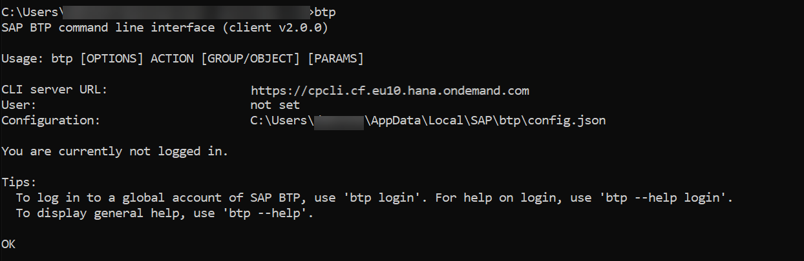
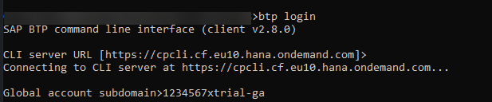
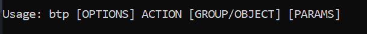

## Prerequisites
 - You have access to a trial account on SAP BTP
 - You are familiar with [the basic concepts of SAP BTP, Trial](cp-trial-quick-onboarding)

## Details
### You will learn
  - What the SAP BTP command line interface (btp CLI) is
  - For which global accounts you can use the btp CLI
  - How the btp CLI works
  - Where and how to download and install the client
  - How commands are structured
  - How to get help in the btp CLI
  - Where to find documentation

>With the release of the btp CLI client version 2.0 on March 25, 2021, the executable file name was changed from `sapcp` to `btp`. This change is reflected in all documentation, including this tutorial. If you still have a 1.X version of sapcp CLI, see [Migrating from sapcp to btp](https://help.sap.com/viewer/65de2977205c403bbc107264b8eccf4b/Cloud/en-US/4f1fe8dd2739467cb7bcab63f918b8dc.html).

---

[ACCORDION-BEGIN [Step 1: ](What is the btp CLI?)]

The btp CLI is **an alternative to the cockpit** for users who prefer working on the command line. It consists of a client and a server. The client is installed on your computer and it interacts with SAP BTP through a server. You connect to this CLI server (https://cpcli.cf.eu10.hana.ondemand.com) when you log on to your global account through the btp CLI.

The base call to enter on the command line is `btp`.

Here are some of the tasks you can use the btp CLI for:

- Creating subaccounts and directories
- Managing entitlements of global accounts and subaccounts
- Managing users and their authorizations in global accounts and subaccounts
- Subscribing to applications

[DONE]
[ACCORDION-END]


[ACCORDION-BEGIN [Step 2: ](For which global accounts can I use the btp CLI?)]

SAP is currently migrating all global accounts from the existing cloud management tools feature set A to the renovated cloud management tools feature set B. One of the innovations of feature set B is the command line interface (btp CLI) for account management. With a trial account, you can try out the btp CLI and other features of feature set B.

Here you can read more about the [Cloud Management Tools Feature Set B Innovations](https://help.sap.com/viewer/3504ec5ef16548778610c7e89cc0eac3/Cloud/en-US/caf4e4e23aef4666ad8f125af393dfb2.html).


[DONE]
[ACCORDION-END]

[ACCORDION-BEGIN [Step 3: ](btp CLI and cf CLI - What's the difference?)]

You may have worked with the [Cloud Foundry CLI (cf CLI)](cp-cf-download-cli) to manage your Cloud Foundry environment. To avoid confusion, here's how the **btp CLI** relates to the **cf CLI**:
The btp CLI is the CLI for working with global accounts on SAP BTP. You use the btp CLI for all tasks on global account, directory, and subaccount level. Going down the account hierarchy, the last step with btp CLI is creating a Cloud Foundry environment instance, which essentially creates a Cloud Foundry org. From org level onwards, i.e. for managing members in orgs and spaces, creating spaces, as well as assigning quota to orgs and spaces, you use the cf CLI.

[VALIDATE_1]
[ACCORDION-END]


[ACCORDION-BEGIN [Step 4: ](Download and install the btp CLI client)]

1. Go to the <a href="https://tools.hana.ondemand.com/#cloud-btpcli">SAP Development Tools</a> page to download the latest version of the btp CLI client for your operating system.
2. Extract the client executable from the tar.gz archive as follows:
    - Linux: Use the terminal to extract the tar.gz archive with `tar -vxzf <tar.gz name>`
    - macOS: Open the tar.gz file with a double click
    - Windows: Use PowerShell to extract the tar.gz archive with `tar -vxzf <tar.gz name>`. Alternatively, use an external tool to extract the executable file to your system.
3. Run btp from within the extracted folder or ensure that it's in your PATH. In Windows, for example, you can open the folder and type `cmd` or `powershell` into the address bar. On macOS, make sure that the client file is in your PATH and open a terminal session. Note that btp CLI may be blocked because it is "from an unidentified developer". Please refer to the macOS documentation to learn how to bypass this.



You get version and usage information, you learn where the configuration file is located, and you get useful tips how to log in and get help in the client.

>To use the examples provided here in PowerShell, you may want to configure an alias for btp.exe with `btp <path-to-folder-with-btp.exe>\btp`.

[DONE]
[ACCORDION-END]


[ACCORDION-BEGIN [Step 5: ](Display help)]

Now type in the following to get syntax instructions and examples help calls:

```Bash
btp help
```


You can call up help in the client on different levels, from an introductory help page `btp help`, over help for individual actions, to quite extensive command-specific help. You can either type `btp help [...]` or append `--help` to the end of (incomplete) commands:

|  Syntax     | Example
|  :------------- | :-------------
|  `btp help <ACTION>`           | `btp help list`
|  `btp help <GROUP>`           | `btp help accounts`
|  `btp help <GROUP/OBJECT>`    | `btp help accounts/subaccount`
|  `btp help <ACTION> <GROUP/OBJECT>`            | `btp help list accounts/subaccount`
|  `btp <ACTION> <GROUP/OBJECT> --help`            | `btp list accounts/subaccount --help`
|  `btp <ACTION> --help`            | `btp list --help`

[DONE]
[ACCORDION-END]


[ACCORDION-BEGIN [Step 9: ](Log in to your global account)]

Now let's log in. To do so, you need the CLI server URL (https://cpcli.cf.eu10.hana.ondemand.com) and the subdomain of your global account:

The **CLI server URL** is proposed at login - just accept it with ENTER. Note that there is just this one central CLI server, independent of the regions in which your subaccounts reside. This server is the back-end of the CLI that routes all requests to the platform services.

   

You can find the **global account subdomain** in the cockpit:

  

You have two options for login:

For login on the command-line, enter:

```Bash
btp login
```
For login with single sign-on through a browser, enter:

```Bash
btp login --sso
```

Once you're logged into your global account, it should look similar to this:


> If you get an error about your btp CLI client being "too new" and not supported by the server, please return to Step 4 of this tutorial and download an earlier version of the CLI, to either match the server version stated, or one version below. For example, if the server version is stated as 2.9.0 and you have version 2.10.0 of the btp CLI, you can download version 2.8.0 of the btp CLI and then continue with this tutorial. [This issue](https://github.com/SAP-samples/devtoberfest-2021/issues/53) may contain further information that you might find useful.

[DONE]
[ACCORDION-END]

[ACCORDION-BEGIN [Step 6: ](Understand the command syntax: usage)]



Each command starts with the base call `btp`. The syntax of the command itself is very close to natural language: It starts with a verb, i.e. the *action*, followed by a *group/object* combination. So you build a command by combining `btp` with an action (let's say *list*) and a group/object combination (let's say *accounts/subaccount*):  `btp list accounts/subaccount`


[DONE]
[ACCORDION-END]

[ACCORDION-BEGIN [Step 7: ](Understand the command syntax: options)]

Additionally, **options** and **parameters** can be added to a command. As you've seen in the overview of all commands, there are the following options that you can add at the beginning of each command. For example, to use the verbose mode.

```Bash
btp --verbose list accounts/subaccount
```


>To call help, you can always place `--help` at the end of a command, even if it's not complete. For example, `btp list --help`, `btp accounts --help`.

[DONE]
[ACCORDION-END]


[ACCORDION-BEGIN [Step 8: ](Understand the command syntax: parameters)]

**Parameters** are added to the end, after the group/object combination. A command can have one **positional parameter** as the first one, followed by other optional or mandatory parameters. The positional parameter is used without a key, all others have a key. The command help specifies the optionality of all parameters and describes what you can or have to add.

For example:

```Bash
btp assign security/role-collection "Global Account Administrator" --to-user example@mail.com --of-idp my-idp
```

"Global Account Administrator" is the positional parameter, and the other two parameters have keys (`--to-user` and `--of-idp`).

[DONE]
[ACCORDION-END]

[ACCORDION-BEGIN [Step 10: ](Understand the context you've targeted )]

Your first login takes you into the global account whose subdomain you've entered at login. Now, all commands are executed on global account level, unless you specify a different context. Remember you can manage the global account and its directories and subaccounts with the btp CLI. So if you want to change the context in which commands are executed to a directory or a subaccount, you can do so using the target command:

```Bash
btp target --subaccount <my-subaccount-ID>
```
OR

```Bash
btp target --directory <my-directory-ID>
```

The targeting mechanism works according to the hierarchy of entities in the global account:

- After initial login, the global account is targeted.

- If a subaccount or directory is targeted and you run a command that only works on a higher level, the command will be executed in the parent directory or global account of the current target. For example, `list accounts/subaccount` lists all subaccounts of the global account, even if a subaccount or a directory is targeted.

- If a subaccount or directory is targeted, you can execute commands in its parent directory or global account by adding parameters `-dir` or `-ga` without a value. For example, if a subaccount is targeted, `btp list security/user` lists the users of that subaccount. To list the users of the parent directory or global account, use: `btp list security/user -dir` or  `btp list security/user -ga`.

>To find out your current target, use `btp --info`.

>To set the target back to the global account, use `btp target -ga`.

[DONE]
[ACCORDION-END]

[ACCORDION-BEGIN [Step 11: ](Enable command autocompletion)]

We recommend to enable command autocompletion so you won't have to remember or keep looking up individual commands. Command autocompletion saves you keystrokes when entering command actions, group-object combinations, and their parameters. Autocompletion is supported for  Bash, PowerShell, and Zsh.

```Bash
btp enable autocomplete <shell>
```
Enter a partial command action, group-object combination, or parameter, and then press the Tab key. The command line either automatically completes your command or, when there's more than one option available, it displays a list of suggested command actions/options/parameters. When a suggestion list is displayed, use the Tab or arrow keys to move through the list and press Enter to make a selection.

When you enable command autocompletion, a script containing all the autocomplete commands is downloaded and installed in your file system. Additionally, the RC file of your shell is modified so the script is called at startup.

The autocompletion option remains enabled in future sessions in your current client, until you disable it. To disable command autocompletion and uninstall the autocomplete script, run `disable autocomplete <shell>`.

[DONE]
[ACCORDION-END]


[ACCORDION-BEGIN [Step 11:](Try it out and get more information)]

Here are a few simple examples of commands on global account level that you can try out:

|  Task                                   | Command
|  :-------------                         | :-------------
|  List subaccounts                       | `btp list accounts/subaccount`
|  Get details of the global accounts     | `btp get accounts/global-account`
|  List role collections                  | `btp list security/role-collection`


To learn more:

- See the documentation on SAP Help Portal: [Account Administration Using the SAP BTP Command Line Interface](https://help.sap.com/viewer/65de2977205c403bbc107264b8eccf4b/Cloud/en-US/7c6df2db6332419ea7a862191525377c.html).
- Check out this tutorial: [Automate Account Operations with the Command Line Interface (CLI)](cp-cli-automate-operations).
- And watch the videos in this [series of live streams on YouTube about the btp CLI](https://help.sap.com/products/link-disclaimer?site=https%3A%2F%2Fwww.youtube.com%2Fplaylist%3Flist%3DPL6RpkC85SLQDXx827kdjKc6HRvdMRZ8P5).

[DONE]
[ACCORDION-END]


---
