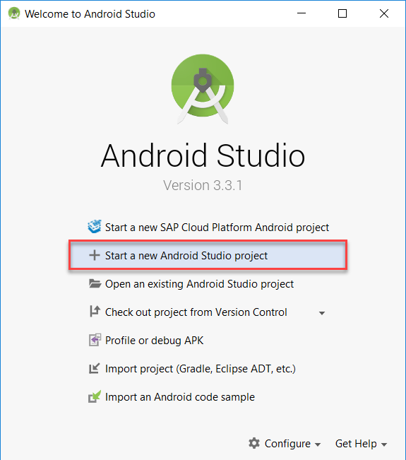
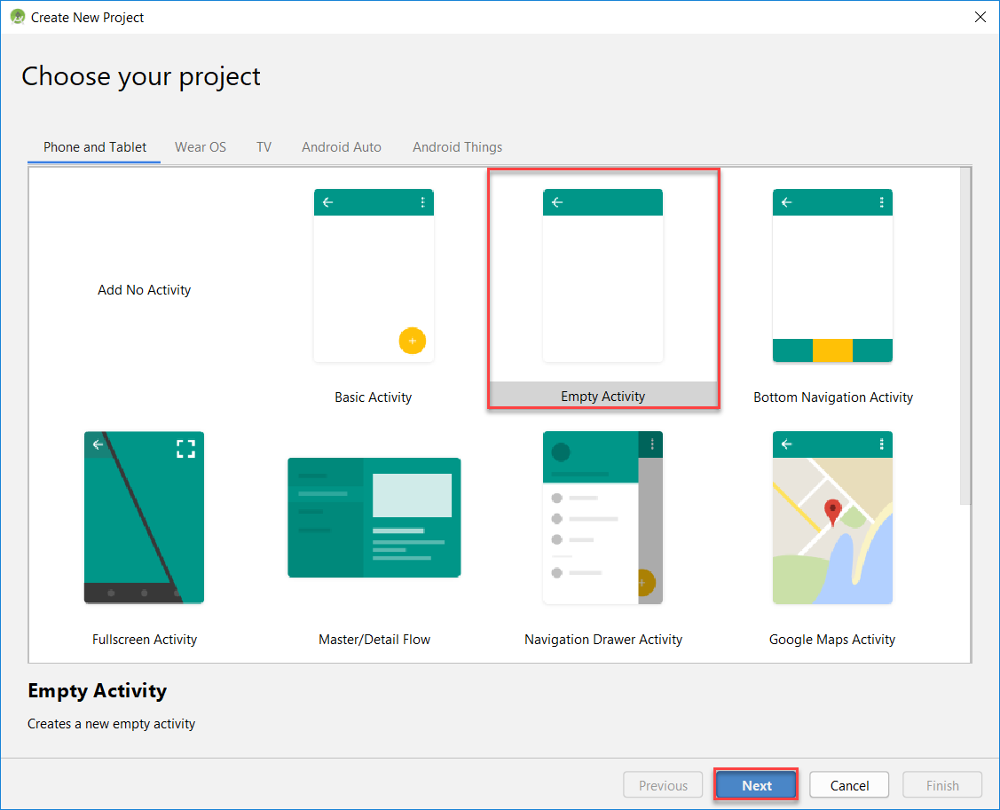
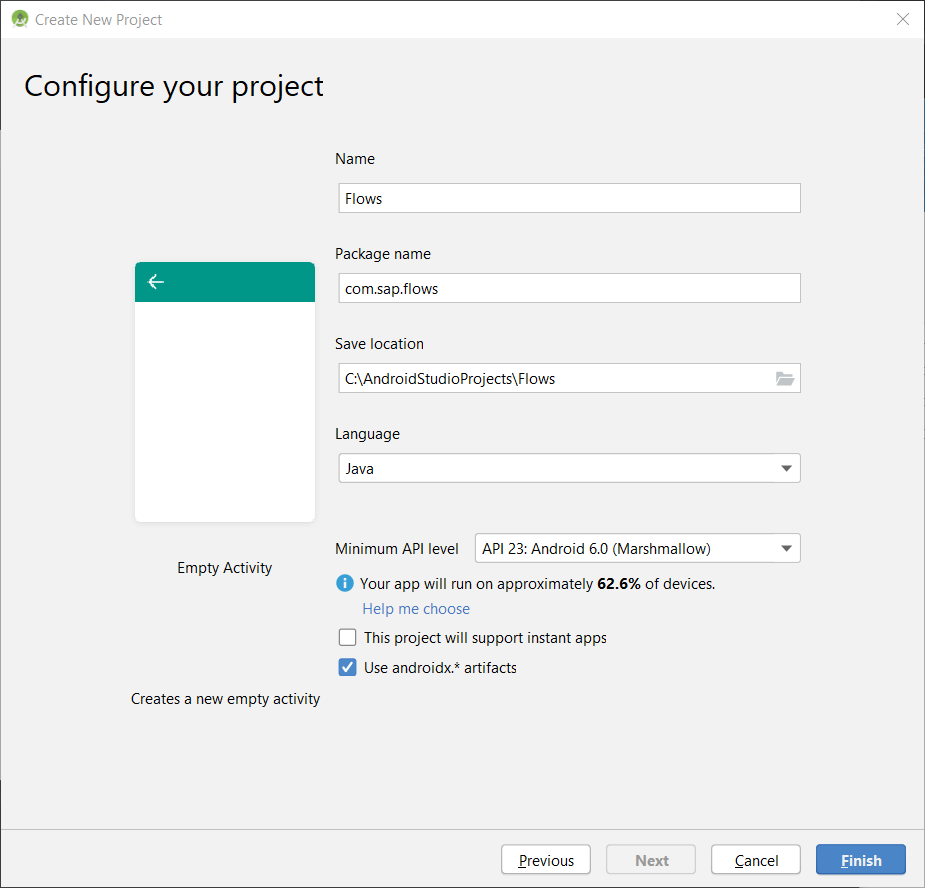
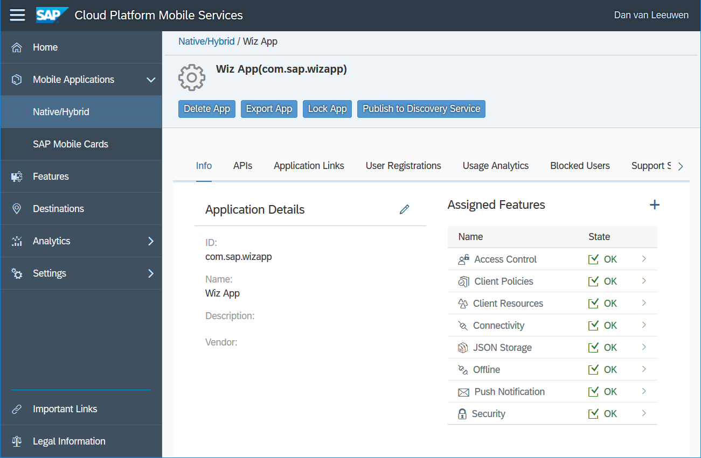
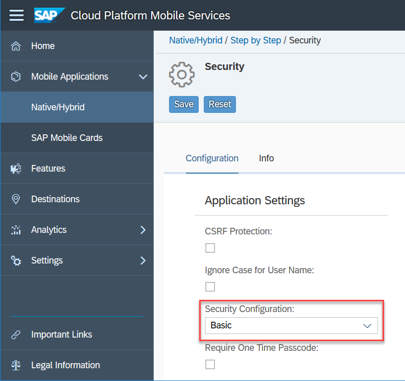
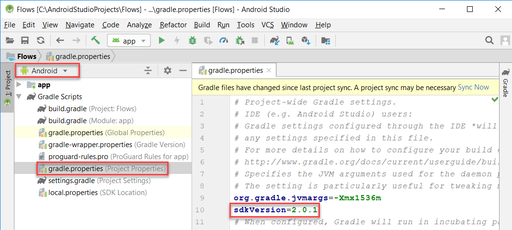
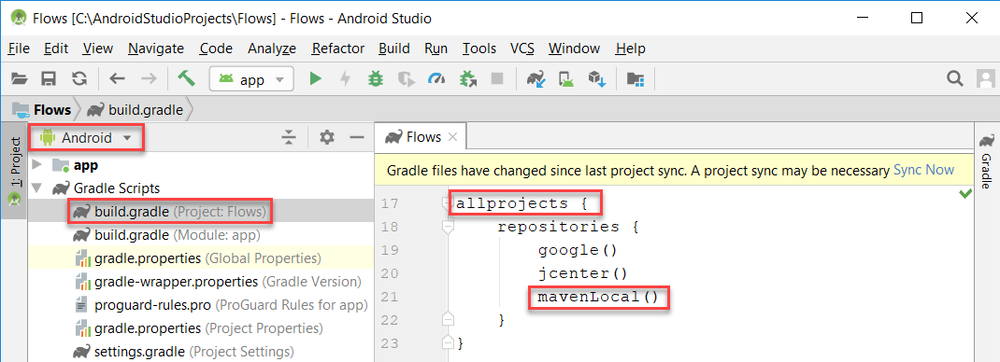
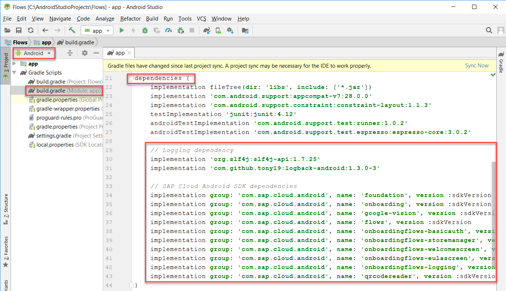
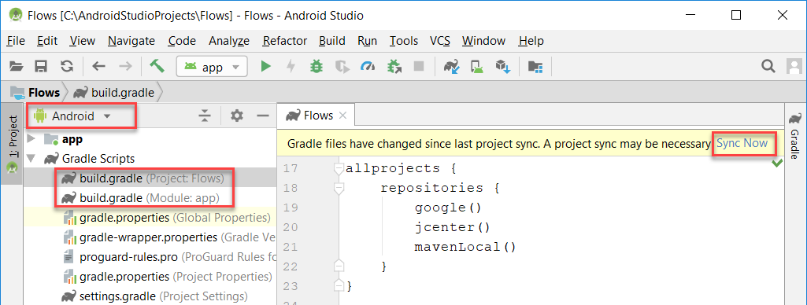
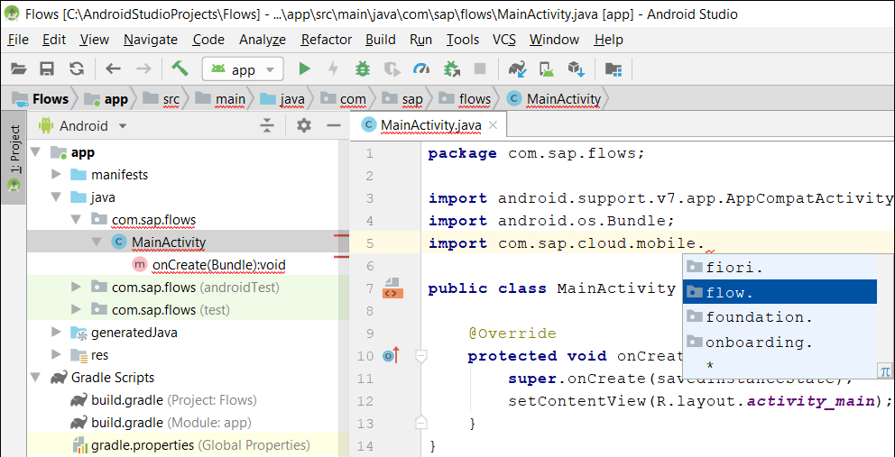

## Prerequisites
 - **SAP Cloud Platform SDK for Android:** Version `2.1.1`
 - Complete step 1 of [Try Out SAP Cloud Platform SDK for Android Wizard](cp-sdk-android-wizard-app)


## Details
### You will learn
  - How to create a project in Android Studio without using SAP Cloud Platform SDK for Android wizard
  - How to import SAP libraries such as foundation, flows, onboarding, and SAP Fiori into the project

The [Flows](https://help.sap.com/doc/c2d571df73104f72b9f1b73e06c5609a/Latest/en-US/docs/flows/Overview.html) library is a new feature of the SAP Cloud Platform SDK for Android 2.0.  It can reduce and simplify the code in an application related to onboarding and exchanging client policy data with Mobile Services.  A great overview is provided by `Britt Womelsdorf` at [A Closer Look at Android Flows](https://blogs.sap.com/2019/03/25/a-closer-look-at-android-flows/).

---

[ACCORDION-BEGIN [Step 1: ](Create the project)]
Open **Android Studio**.


Choose **Start a new Android Studio project**.



Choose **Empty Activity** and click **Next**.



Provide the below values and click **Finish**.

| Field | Value |
|----|----|
| Name | **Flows** |
| Package Name | **`com.sap.flows`** |
| Language | **Java** |




[DONE]
[ACCORDION-END]

[ACCORDION-BEGIN [Step 2: ](Configure app in Mobile Services)]

The app configuration with an ID of `com.sap.wizapp` was created in [Try Out SAP Cloud Platform SDK for Android Wizard](cp-sdk-android-wizard-app) and will be used in this tutorial.



Further details on how to access the Mobile Services cockpit are provided at [Enable SAP Cloud Platform Mobile Services](https://developers.sap.com/tutorials/fiori-ios-hcpms-setup.html).

This tutorial assumes that **Basic** is selected as the apps **Security Configuration**.



[DONE]
[ACCORDION-END]


[ACCORDION-BEGIN [Step 3: ](Add SAP Cloud Platform SDK for Android libraries to the project)]

Open the project's **`gradle.properties`** file.  

Add a new `gradle` setting **`sdkVersion=2.1.1`** to specify the version of the SAP Cloud Platform SDK for Android being used as shown below.



Open the project's **`build.gradle`** file.

Specify the location where the SAP Cloud Platform SDK libraries can be located by adding **`mavenLocal()`** to the **`allProjects`** > **repositories** block as shown below.



The value **`mavenLocal()`** will resolve to the folder `C:\Users\user_name\.m2\repository` on Windows or to `/Users/user/.m2/repository` on a Mac.

Specify the libraries to include by adding the below libraries to the **app's `build.gradle`** file in the **dependencies** block as shown below.



```Java
// Logging dependency
implementation 'org.slf4j:slf4j-api:1.7.25'
implementation 'com.github.tony19:logback-android:1.3.0-3'

// SAP Cloud Android SDK dependencies
implementation group: 'com.sap.cloud.android', name: 'foundation', version :sdkVersion
implementation group: 'com.sap.cloud.android', name: 'onboarding', version :sdkVersion
implementation group: 'com.sap.cloud.android', name: 'google-vision', version :sdkVersion
implementation group: 'com.sap.cloud.android', name: 'flows', version :sdkVersion
implementation group: 'com.sap.cloud.android', name: 'onboardingflows-basicauth', version :sdkVersion
implementation group: 'com.sap.cloud.android', name: 'onboardingflows-storemanager', version :sdkVersion
implementation group: 'com.sap.cloud.android', name: 'onboardingflows-welcomescreen', version :sdkVersion
implementation group: 'com.sap.cloud.android', name: 'onboardingflows-eulascreen', version :sdkVersion
implementation group: 'com.sap.cloud.android', name: 'onboardingflows-logging', version :sdkVersion // Supported in version 2.1.0 and higher
implementation group: 'com.sap.cloud.android', name: 'qrcodereader', version :sdkVersion
```

Press **Sync Now** on either of the two **`build.gradle`** files.



Notice that the flow package is now available when entering the import **`com.sap.cloud.mobile.`**



Congratulations!  An Android app has been created that imports the SAP Flows libraries.

[VALIDATE_1]
[ACCORDION-END]


---
