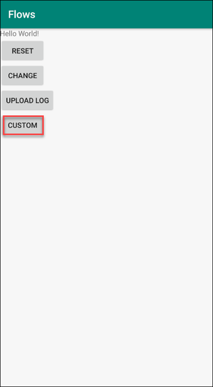
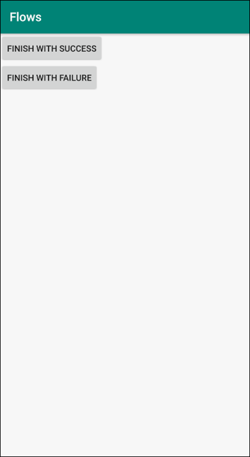

## Prerequisites
 - Completed the previous tutorial in this mission

## Details
### You will learn
  - How to show a screen in a custom step

The below steps will demonstrate how to create a [Custom Step Implementation](https://help.sap.com/doc/c2d571df73104f72b9f1b73e06c5609a/Latest/en-US/docs/flows/Overview.html#custom-step-implementation) using the **`AsyncResultStep`** interface instead of the Step interface.  One example use for this is to show a screen.

---

[ACCORDION-BEGIN [Step 1: ](Add code to show a custom activity)]

Right-click on the package **`com.sap.flows`** and choose **New > Activity > Empty Activity**.  Name the activity **`CustomActivity`**.

Replace the code in **`CustomActivity`** with the below code.

```Java
package com.sap.flows;

import android.support.v7.app.AppCompatActivity;
import android.os.Bundle;
import android.view.View;

public class CustomActivity extends AppCompatActivity {

    @Override
    protected void onCreate(Bundle savedInstanceState) {
        super.onCreate(savedInstanceState);
        setContentView(R.layout.activity_custom);
    }

    public void onFinishSuccess(View v){
        setResult(-1);
        finish();
    }

    public void onFinishFailure(View v){
        setResult(1);
        finish();
    }
}
```

The `CustomActivity` class implements methods that will be called when the flow's steps are executed. The `onSuccess` call needs to have -1 as its `setResult` argument, while other functions can have any positive integer.

Replace the contents of **`res/layout/activity_custom.xml`** with the following code.

```XML
<?xml version="1.0" encoding="utf-8"?>
<LinearLayout xmlns:android="http://schemas.android.com/apk/res/android"
    xmlns:tools="http://schemas.android.com/tools"
    android:layout_width="match_parent"
    android:layout_height="match_parent"
    tools:context=".CustomActivity"
    android:orientation="vertical">

    <Button
        android:id="@+id/finishSuccess"
        android:layout_width="wrap_content"
        android:layout_height="wrap_content"
        android:text="Finish with Success"
        android:onClick="onFinishSuccess"
        tools:layout_editor_absoluteX="1dp"
        tools:layout_editor_absoluteY="0dp" />
    <Button
        android:id="@+id/finishFail"
        android:layout_width="wrap_content"
        android:layout_height="wrap_content"
        android:text="Finish with Failure"
        android:onClick="onFinishFailure"
        tools:layout_editor_absoluteX="1dp"
        tools:layout_editor_absoluteY="0dp" />
</LinearLayout>
```

This creates the activity screen layout that will contain 2 buttons to test the custom activity.

Create a class called **`CustomStep`** and replace the generated code with the following.

```Java
package com.sap.flows;

import com.sap.cloud.mobile.flow.AsyncResultStep;
import com.sap.cloud.mobile.flow.FlowContext;
import com.sap.cloud.mobile.flow.FlowManagerException;
import com.sap.cloud.mobile.flow.ResultActionHandler;
import com.sap.cloud.mobile.flow.StepActionHandler;
import com.sap.cloud.mobile.flow.StepName;
import com.sap.cloud.mobile.flow.onboarding.OnboardingContext;
import com.sap.cloud.mobile.flow.onboarding.presenter.FlowPresentationActionHandler;
import com.sap.cloud.mobile.flow.onboarding.presenter.FlowPresentationContext;

public class CustomStep implements AsyncResultStep {
    private OnboardingContext context;
    private StepActionHandler actionHandler;

    @StepName("custom")
    public void launchActivity(FlowContext flowContext, StepActionHandler stepActionHandler){
        context = (OnboardingContext) flowContext;
        actionHandler = stepActionHandler;
        FlowPresentationActionHandler flowPresentationActionHandler = context.getFlowPresenationActionHandler();
        if (flowPresentationActionHandler != null) {
            flowPresentationActionHandler.present(10000, CustomActivity.class.getName());
        } else {
            actionHandler.onFailure(new IllegalArgumentException("FlowPresentationActionHandler Expected"));
        }
    }

    @Override
    public ResultActionHandler getResultActionHandler() {
        return new ResultActionHandler() {
            @Override
            public void onResult(FlowContext flowContext) {
                if (((FlowPresentationContext) flowContext).getResultCode() == -1) {
                    actionHandler.onSuccess(context);
                } else {
                    actionHandler.onFailure(new FlowManagerException("Failed",flowContext));
                }
            }
        };
    }
  }
```

Notice that in the `CustomStep` class, a `@StepName` annotation is added.  The method will be executed when the `CustomStep` class is included in a flow named custom.

Add the following methods to **`MainActivity.java`**.

```Java
private void startCustomFlow() {
    Flow flow = new Flow("custom");
    flow.setSteps(new Step[] {
        new CustomStep()  // shows finish on success or failure button screen
    });

    flowManagerService.execute(flow, flowContext, new FlowActionHandler() {
        @Override
        public void onFailure(Throwable t) {
            LOGGER.debug("onFailure in custom called: " + t);
            showAlertDialog("Custom", t);
        }

        @Override
        public void onSuccess(FlowContext result) {
            LOGGER.debug("Custom flow completed successfully.");
        }
    });
}

public void onCustom(View v) {
    startCustomFlow();
}
```

Add the following code to **`activity_main.xml`** below the other Button tags.

```Java
<Button
    android:id="@+id/b_custom"
    android:layout_width="wrap_content"
    android:layout_height="wrap_content"
    android:onClick="onCustom"
    android:text="Custom" />
```

[VALIDATE_1]
[ACCORDION-END]

[ACCORDION-BEGIN [Step 2: ](Try it out)]

Run the app and tap the **Custom** button.



Tap the **Finish with Success** button to close the activity.



Tap the **Finish with Failure** button to call the `onFailure` callback and display an `AlertDialog`.

Congratulations!  The code to create a custom asynchronous step that shows a screen was added.

[DONE]
[ACCORDION-END]
