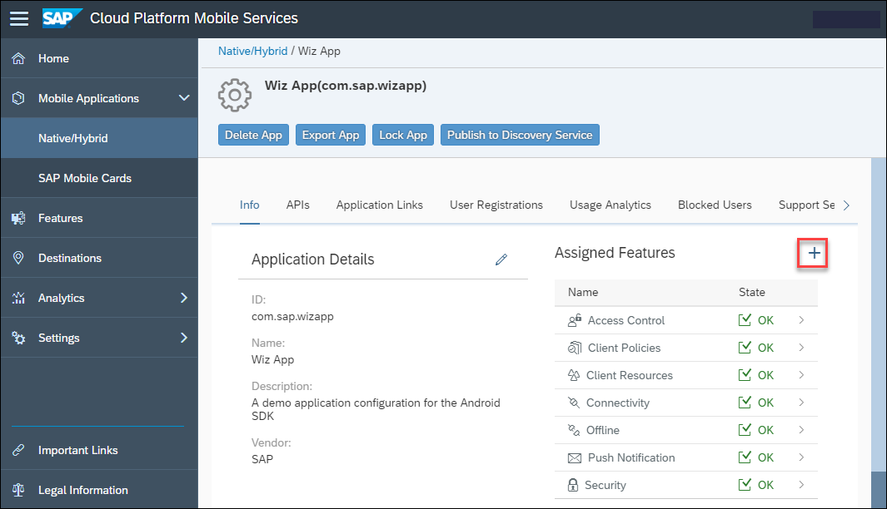
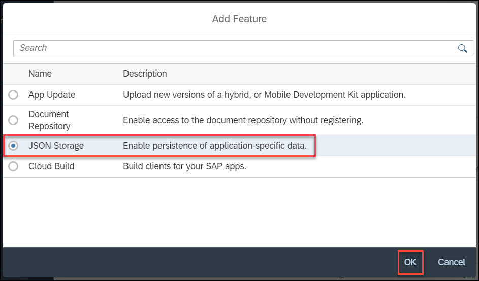
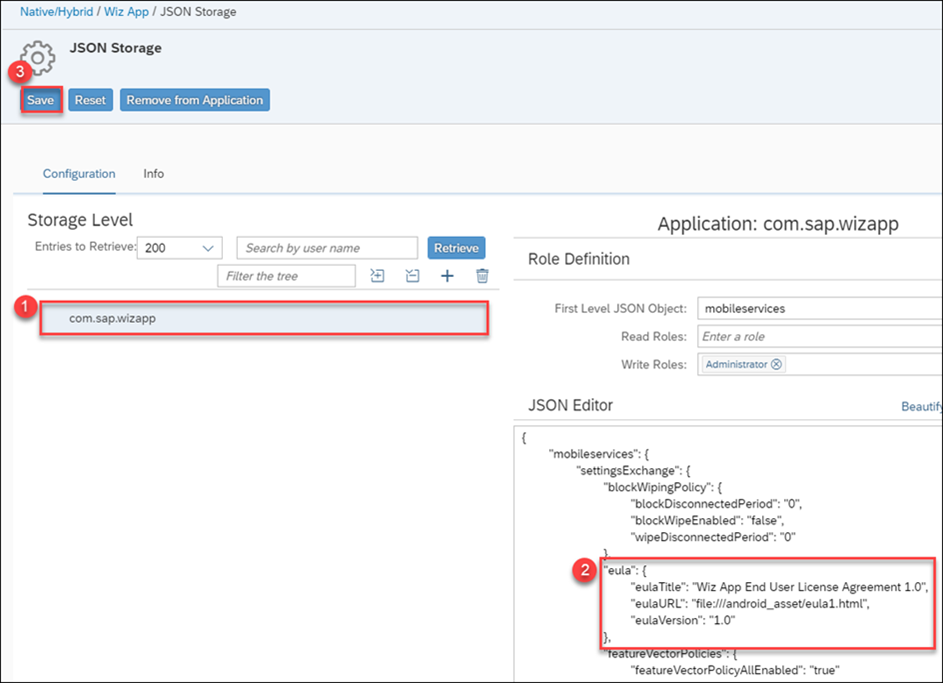
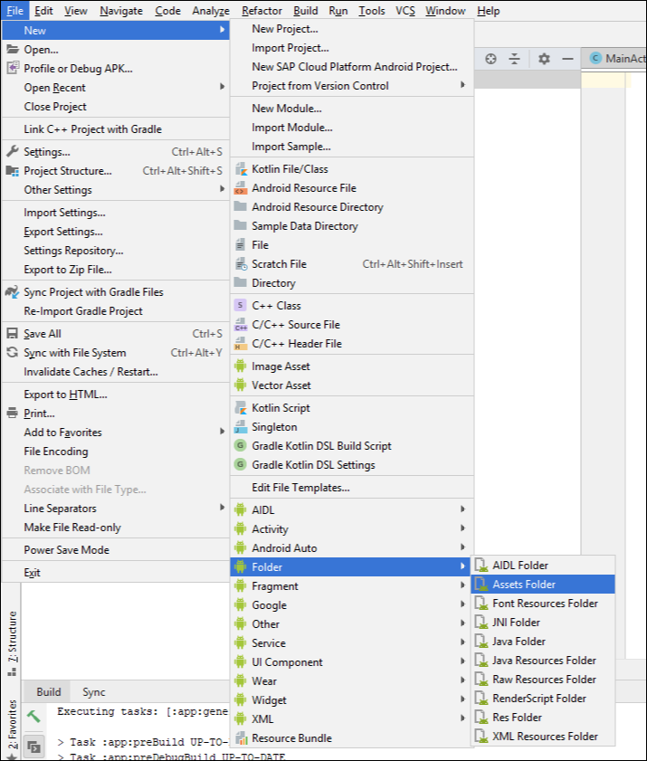
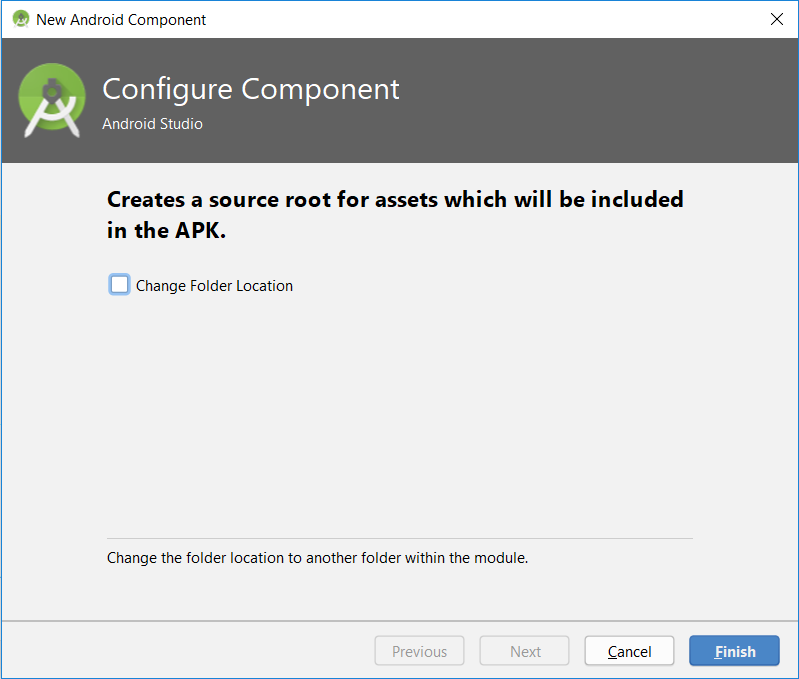
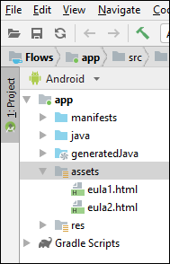
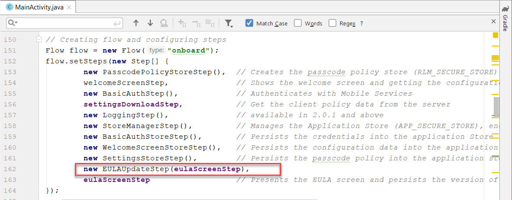
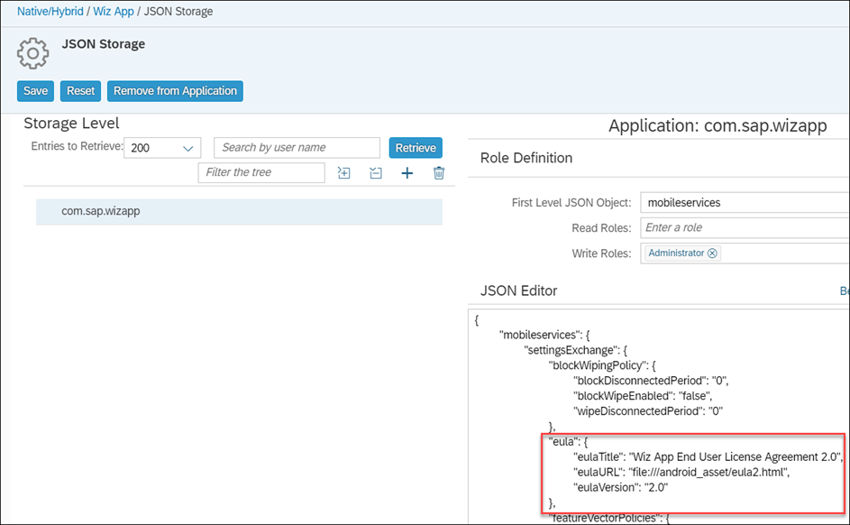
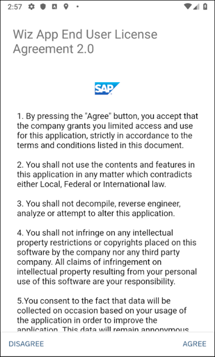

## Prerequisites
 - Completed the previous tutorial in this mission

## Details
### You will learn
  - How to create a custom flow step
  - How to use the JSON storage feature of Mobile Services

JSON data stored in the server will contain an end user license agreement (EULA) version, title and URL.  The custom step in the application will compare the server version of the EULA to the version stored in the application store.  If these values are different, it indicates that the user agreed to an older EULA and will be asked to accept the newer EULA.

---

[ACCORDION-BEGIN [Step 1: ](Add EULA custom JSON to Mobile Services)]

In the Mobile Services Cockpit, add the JSON Storage feature as shown below.





Add the following JSON.

```JSON
"eula": {
    "eulaTitle": "Wiz App End User License Agreement 1.0",
    "eulaURL": "file:///android_asset/eula1.html",
    "eulaVersion": "1.0"
},
```



[DONE]
[ACCORDION-END]

[ACCORDION-BEGIN [Step 2: ](Create two EULA agreements)]

Choose **File > New > Folder > Assets Folder**.



Click **Finish**.



Create two files named **`eula1.html`** and **`eula2.html`**.



Replace the contents of **`eula1.html`** and **`eula2.html`** with the HTML below.

**`eula1.html`**

```HTML
<html>
<p>
  1. By pressing the "Agree" button, you accept that the company grants you limited access and use for
    this application, strictly in accordance to the terms and conditions listed in this document.<br><br>
  2. You shall not use the contents and features in this application in any matter which contradicts either
    Local, Federal or International law.<br><br>
  3. You shall not decompile, reverse engineer, analyze or attempt to alter this application.<br><br>
  4. You shall not infringe on any intellectual property restrictions or copyrights placed on this
    software by the company nor any third party company. All claims of infringement on intellectual property
    resulting from your personal use of this software are your responsibility.<br><br>
  5. The company holds the right to terminate your license agreement without any prior notice upon its
    sole discretion.<br><br>
  6. Failure to honor these terms and conditions will result in immediate termination of your license
    and if necessary, legal prosecution.
</p>
</html>
```

**`eula2.html`**

```HTML
<html>
<p>
    1. By pressing the "Agree" button, you accept that the company grants you
        limited access and use for this application, strictly in accordance to the
        terms and conditions listed in this document.<br><br>
    2. You shall not use the contents and features in this application in any matter which
        contradicts either Local, Federal or International law.<br><br>
    3. You shall not decompile, reverse engineer, analyze or attempt to alter this application.<br><br>
    4. You shall not infringe on any intellectual property restrictions or copyrights placed on this
        software by the company nor any third party company. All claims of infringement on intellectual
        property resulting from your personal use of this software are your responsibility.<br><br>
    5.You consent to the fact that data will be collected on occasion based on your usage of the
        application in order to improve the application. This data will remain annonymous and not contain
        any personal data or details.<br><br>
    6. You shall not falsify usage information in malicious intent or any other intent.<br><br>
    7. The company holds the right to terminate your license agreement without any
        prior notice upon its sole discretion.<br><br>
    8. Failure to honor these terms and conditions will result in immediate termination of your license
        and if necessary, legal prosecution.<br><br>
</p>
</html>
```

The EULA files alternatively could be hosted on a web server. For simplicity in this tutorial they are being included in the assets folder.


[DONE]
[ACCORDION-END]


[ACCORDION-BEGIN [Step 3: ](Add code to create and use a custom step)]

Create a new class named **`ClientPolicyManager`** by right-clicking on the package **`com.sap.flows`** and choosing **New > Java Class**.

Replace the code for the class **`ClientPolicyManager`** with the below code.

```Java
package com.sap.flows;

import android.support.annotation.NonNull;

import com.sap.cloud.mobile.flow.onboarding.ClientPolicy;
import com.sap.cloud.mobile.flow.onboarding.SecureStore;
import com.sap.cloud.mobile.flow.onboarding.SecureStoreException;
import com.sap.cloud.mobile.foundation.common.SettingsParameters;
import com.sap.cloud.mobile.foundation.settings.Settings;

import org.json.JSONObject;
import org.slf4j.Logger;
import org.slf4j.LoggerFactory;

import java.util.concurrent.CountDownLatch;

import okhttp3.OkHttpClient;

public class ClientPolicyManager {

    private static ClientPolicy policyFromServer;
    private static Logger LOGGER = LoggerFactory.getLogger(MyApplication.class);

    private SettingsParameters settingsParameters;
    private SecureStore secureStore;
    private OkHttpClient okHttpClient;

    private final static String EULA = "eula";
    private final static String EULA_VERSION = "eulaVersion";
    private final static String EULA_TITLE = "eulaTitle";
    private final static String EULA_URL = "eulaURL";

    public ClientPolicyManager(SettingsParameters sParameters, SecureStore sStore, OkHttpClient httpClient) {
        this.settingsParameters = sParameters;
        this.secureStore = sStore;
        this.okHttpClient = httpClient;
    }

    public void getClientPolicyFromServer() {
        policyFromServer = null;

        if (settingsParameters != null) {
            CountDownLatch downloadLatch = new CountDownLatch(1);
            Settings settings = new Settings(okHttpClient, settingsParameters);
            settings.load(Settings.SettingTarget.DEVICE, "mobileservices/settingsExchange", new PolicyCallbackListener(downloadLatch, secureStore));

            try {
                downloadLatch.await();
            } catch (InterruptedException e) {
                e.printStackTrace();
            }
        }
    }

    private class PolicyCallbackListener implements Settings.CallbackListener {
        private CountDownLatch downloadLatch;
        private SecureStore secureStore;

        public PolicyCallbackListener(CountDownLatch downloadLatch, SecureStore sStore) {
            this.downloadLatch = downloadLatch;
            this.secureStore = sStore;
        }

        public ClientPolicy getPolicyFromServer() {
            return policyFromServer;
        }

        @Override
        public void onSuccess(@NonNull JSONObject result) {

            JSONObject eulaJson = result.optJSONObject(EULA);
            if (eulaJson != null) {
                double eulaVersion = eulaJson.optDouble(EULA_VERSION, 1.0);
                String eulaMessage = eulaJson.optString(EULA_TITLE, "End User License Agreement");
                String eulaURL = eulaJson.optString(EULA_URL, "file:///android_asset/eula1.html");

                try {
                    secureStore.put(EULA_VERSION, eulaVersion);
                    secureStore.put(EULA_TITLE, eulaMessage);
                    secureStore.put(EULA_URL, eulaURL);

                    LOGGER.debug("EULAUpdate : successfully updated secureStore values");
                } catch (SecureStoreException e) {
                    e.printStackTrace();
                }
            }

            downloadLatch.countDown();
        }

        @Override
        public void onError(@NonNull Throwable throwable) {
            throwable.printStackTrace();
            policyFromServer = null;
            downloadLatch.countDown();
        }
    }
}
```

Create a new class named **`EULAUpdateStep`** by right-clicking on the package **`com.sap.flows`** and choosing **New > Java Class**.

Replace the code for the class **`EULAUpdateStep`** with the below code.

```Java
package com.sap.flows;

import com.sap.cloud.mobile.flow.FlowContext;
import com.sap.cloud.mobile.flow.Step;
import com.sap.cloud.mobile.flow.StepActionHandler;
import com.sap.cloud.mobile.flow.StepName;
import com.sap.cloud.mobile.flow.StepNames;
import com.sap.cloud.mobile.flow.onboarding.OnboardingContext;
import com.sap.cloud.mobile.flow.onboarding.SecureStore;
import com.sap.cloud.mobile.flow.onboarding.SecureStoreException;
import com.sap.cloud.mobile.flow.onboarding.eulascreen.EulaScreenStep;
import com.sap.cloud.mobile.foundation.common.SettingsParameters;
import com.sap.cloud.mobile.foundation.logging.Logging;
import com.sap.cloud.mobile.onboarding.eula.EULAScreenSettings;

import org.slf4j.Logger;
import org.slf4j.LoggerFactory;

import ch.qos.logback.classic.Level;

public class EULAUpdateStep implements Step {

    private static Logger LOGGER = LoggerFactory.getLogger(MyApplication.class);
    private EulaScreenStep eulaScreenStep;
    private final String EULA_VERSION = "eulaVersion";
    private final String EULA_TITLE = "eulaTitle";
    private final static String EULA_URL = "eulaURL";

    public EULAUpdateStep(EulaScreenStep eulaStep) {
        this.eulaScreenStep = eulaStep;
    }

    @StepNames({@StepName("onboard"), @StepName("restore")})
    public void update(FlowContext flowContext, StepActionHandler stepActionHandler) {
        OnboardingContext onboardingContext = (OnboardingContext) flowContext;

        LOGGER.debug("EULAUpdateStep: In onboard update Step");

        SettingsParameters settingsParameters = onboardingContext.getOnboardingParameters().getSettingsParameters();
        SecureStore policyStore = onboardingContext.getPasscodePolicyStore();
        ClientPolicyManager clientPolicyManager = new ClientPolicyManager(settingsParameters, policyStore, onboardingContext.getOkHttpClient());

        try {
            LOGGER.debug("EULAUpdateStep : Executing try-catch statement");

            clientPolicyManager.getClientPolicyFromServer();

            double eulaVersion = onboardingContext.getPasscodePolicyStore().get(EULA_VERSION);
            String eulaTitle = onboardingContext.getPasscodePolicyStore().get(EULA_TITLE);
            String eulaURL = onboardingContext.getPasscodePolicyStore().get(EULA_URL);
            LOGGER.debug("eulaVersion from passcode policy store = " + eulaVersion);

            eulaScreenStep.setEulaVersion(eulaVersion + "");
            EULAScreenSettings eulaScreenSettings = new EULAScreenSettings();
            eulaScreenSettings.setEULATitle(eulaTitle);
            eulaScreenSettings.setEULAUrl(eulaURL);

            eulaScreenStep.setEulaScreenSettings(eulaScreenSettings);

            LOGGER.debug("EULAUpdate : Updated eulaScreenSettings successfully");
            stepActionHandler.onSuccess(flowContext);

        } catch (SecureStoreException e) {
            e.printStackTrace();
            LOGGER.debug("EULAUpdate: Update failed");
            stepActionHandler.onFailure(e);
        }
    }
}
```

Notice above that the class implements Step.

The method update will be called for an onboard and restore flow type which was specified with the `@StepName(...)` annotation.

In the class **`MainActivity`**, add the following step to the array of onboarding steps before the **`eulaScreenStep`**.



```Java
new EULAUpdateStep(eulaScreenStep),
```

Repeat the above step for the restore flow.

[VALIDATE_1]
[ACCORDION-END]

[ACCORDION-BEGIN [Step 4: ](Try it out)]

After running the app, tap on the Reset button.  The new EULA screen with its contents from `eula1.html` will appear.


Change the JSON in management cockpit to reference version 2 of the EULA.



When the app starts again, the restore flow is taken and it detects that the EULA has changed so a new EULA screen is shown with contents from `eula2.html` after you've entered your passcode.



Note it may take a few minutes before the new JSON setting comes into effect.
Typically, a EULA will evolve over time, developing stricter regulations as policies change, which makes updating EULAs with ease and getting user permissions essential for applications.

Congratulations!  You have added a custom flow step to the app.

[DONE]
[ACCORDION-END]


---
