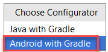
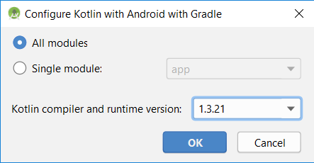
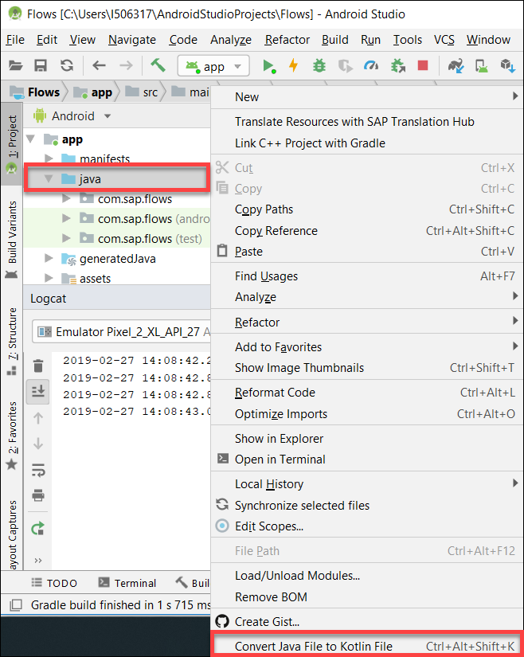
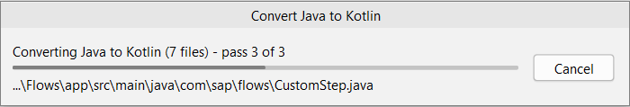
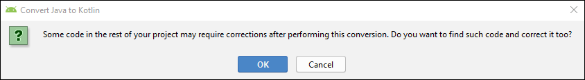
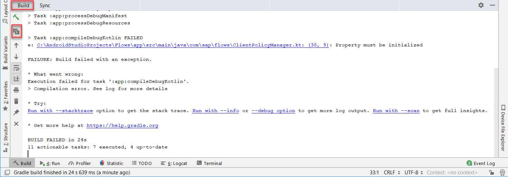

## Prerequisites
 - Completed the previous tutorial in this mission

## Details
### You will learn
  - How to convert an Android Studio project from Java to `Kotlin`


[`Kotlin`](https://developer.android.com/kotlin) is a new language that supports Android development.  It is more concise and has state of the art language features while being interoperable with Java.

---

[ACCORDION-BEGIN [Step 1: ](Convert from Java to Kotlin)]

Before proceeding, optionally clean the project (`gradlew clean` in the terminal window) and make a backup copy of the project as you cannot convert back from `Kotlin` to Java.

Specify the `configurator` and `Kotlin` version to be used by navigating to **`Tools > Kotlin > Configure Kotlin in Project`**.



Select the latest available `Kotlin` compiler and runtime version.



Right-click on the java folder and choose **`Convert Java File to Kotlin File`**.





Click OK to the popup that asks if you will correct the project.



>Note, the conversion process does not convert commented code.

[DONE]
[ACCORDION-END]

[ACCORDION-BEGIN [Step 2: ](Fix conversion errors)]

Build the app.

Notice that there is a compilation error.



To fix the error in **`ClientPolicyManager.kt`** properly initialize the **`policyFromServer`** variable by adding a setter to its initialization. Click the error in the `Logcat` to open to **`ClientPolicyManager.kt`** and replace the variable with the code below.

```Java
var policyFromServer: ClientPolicy?
    get() = policyFromServer
    set(value) {}
```

Within **`StoreHelper.java`** replace `LOGGER.debug("isOnboarded value = " + onboardFinished!!)` with the following code.

```Java
LOGGER.debug("isOnboarded value = $onboardFinished")
```

[DONE]
[ACCORDION-END]


[ACCORDION-BEGIN [Step 3: ](Try it out)]

Uninstall the app.

Run the app.  

Try out the various features of the app.

Congratulations!  You have now converted a Java app to `Kotlin`.  By finishing the tutorials in this mission you should have a better understanding of how the SAP Flows framework simplifies the code needed to onboard a user to the SAP Cloud Platform Mobile Services and interact with client policies.

[VALIDATE_1]
[ACCORDION-END]

---
