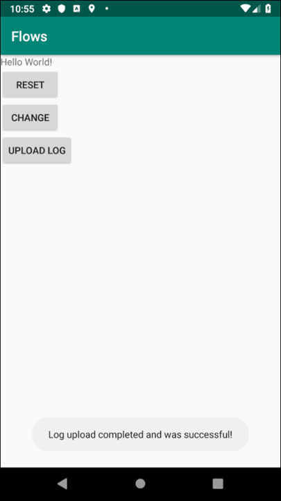
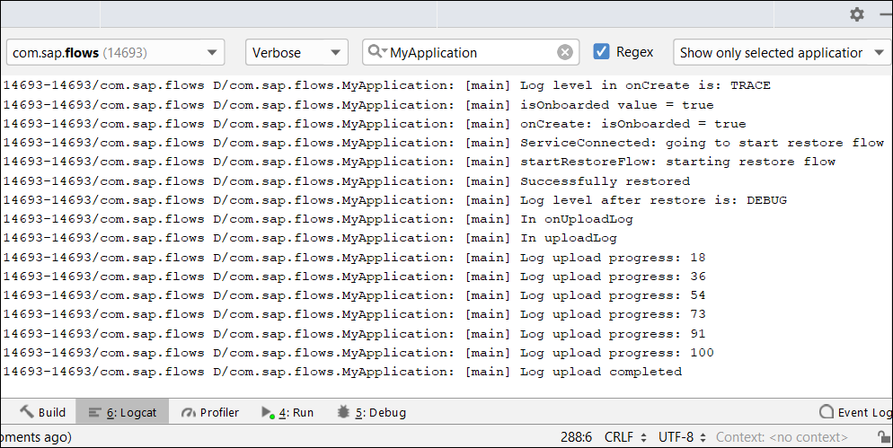

## Details
### You will learn
  - How to make a log upload request reusing values provided by the flows framework

When the app is opened, the restore or onboard flow will have initialized an `OKHttpClient` to communicate with Mobile Services.  The `OKHttpClient` instance will be reused for the log upload method call.  Additional values such as the `serviceURL` are available which would be needed in an online or offline OData request.

---

[ACCORDION-BEGIN [Step 1: ](Add code to upload the log)]

Add the `uploadLog` method below to the bottom of the **`MainActivity`** class.

```Java
public void uploadLog() {
    LOGGER.debug("In uploadLog");
    myLogUploadListener = new Logging.UploadListener() {
        @Override
        public void onSuccess() {
            LOGGER.debug("Log upload completed");
            Toast.makeText(getApplicationContext(), "Log upload completed and was successful!",
                    Toast.LENGTH_LONG).show();
            Logging.removeLogUploadListener(myLogUploadListener);
        }

        @Override
        public void onError(@NonNull Throwable throwable) {
            LOGGER.debug("Log upload encountered an error with message: " + throwable.getMessage());
            Toast.makeText(getApplicationContext(), "Log upload failed with error message: " + throwable.getMessage(),
                    Toast.LENGTH_LONG).show();
            Logging.removeLogUploadListener(myLogUploadListener);
        }

        @Override
        public void onProgress(int percentUploaded) {
            LOGGER.debug("Log upload progress: " + percentUploaded);
        }
    };

    Logging.addLogUploadListener(myLogUploadListener);

      // String serviceURL = flowContext.getOnboardingParameters().getSettingsParameters().getBackendUrl();
      // String deviceID = flowContext.getOnboardingParameters().getSettingsParameters().getDeviceId();
      OkHttpClient okHttpClient = flowContext.getOkHttpClient();
      SettingsParameters sp = flowContext.getOnboardingParameters().getSettingsParameters();
      Logging.uploadLog(okHttpClient, sp, Logging.UploadType.MERGE);
}
```

The above method uploads the existing log to Mobile Services and displays the result of the action. Notice that the `Logging.uploadLog` method requires an `OkHttpClient` and `SettingsParameters` variables that are retrieved from the `flowContext`.

Add the following line to the **`onUploadLog`** method.

```Java
uploadLog();
```

[VALIDATE_1]
[ACCORDION-END]

[ACCORDION-BEGIN [Step 2: ](Try it out)]

Tap Upload Log and a toast message will appear shortly after.



As well, the `Logcat` will contain details of the log upload.



>If you receive the error below, ensure Client Log Upload is checked under Client Policies on the Mobile Services Cockpit.


Congratulations!  The code to obtain the `OkHttpClient` and `SettingsParameters` from the flow was added and used in a log upload call.

[DONE]
[ACCORDION-END]


---
