## Prerequisites
 - Completed the previous tutorial in this mission which created the initial project and imported the flows libraries

## Details
### You will learn
  - How to add onboarding flow code to an app
  - Customization options for the onboarding flow

The first time the app is opened is called an onboarding flow.  A welcome screen will be shown.  The configuration data containing information about which Mobile Services server to connect to as well as the credentials to do so will be obtained and stored during this flow.  The app will ask the user for a passcode or fingerprint to be used to unlock the app and request that the user accept the End User License Agreement (EULA).

---

[ACCORDION-BEGIN [Step 1: ](Add code for the onboard flow)]

Right-click on the package **`com.sap.flows`** and choose **New > Java Class**.

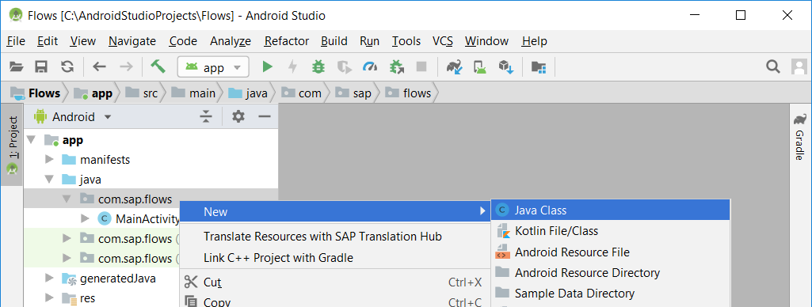

Specify that the name of the new class is **`MyApplication`**.

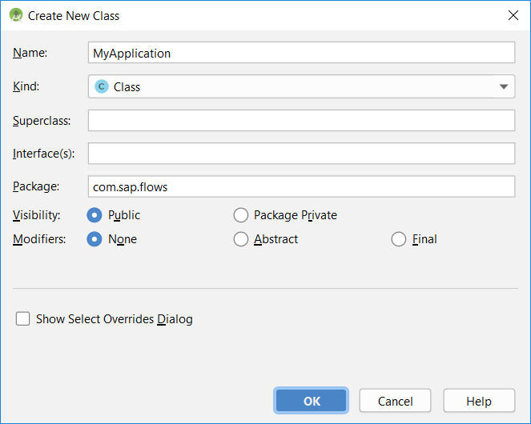

Replace the code for the class **`MyApplication.java`** with the code below.

```Java
package com.sap.flows;

import android.app.Application;

import com.sap.cloud.mobile.foundation.authentication.AppLifecycleCallbackHandler;

public class MyApplication extends Application {
    @Override
    public void onCreate() {
        super.onCreate();
        registerActivityLifecycleCallbacks(AppLifecycleCallbackHandler.getInstance());
    }
}
```

This class enables the basic authentication dialog to have access to the top activity, so it can be shown.

In the **`manifests/AndroidManifest.xml`** file, add the below entry and change **`allowBackup`** to false.

```XML
android:name=".MyApplication"
```

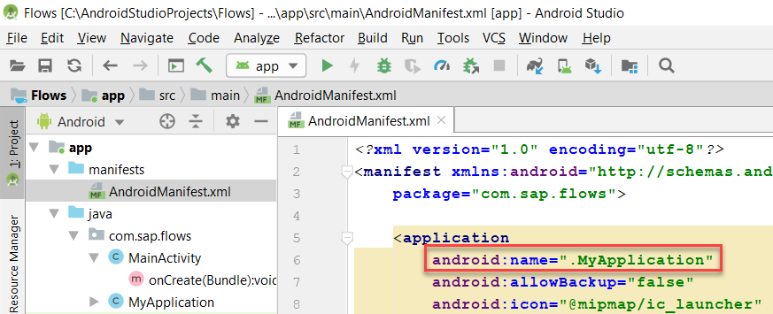

Change the project to use JDK 1.8 for source and target by navigating to File > Project Structure or by clicking the toolbar icon.

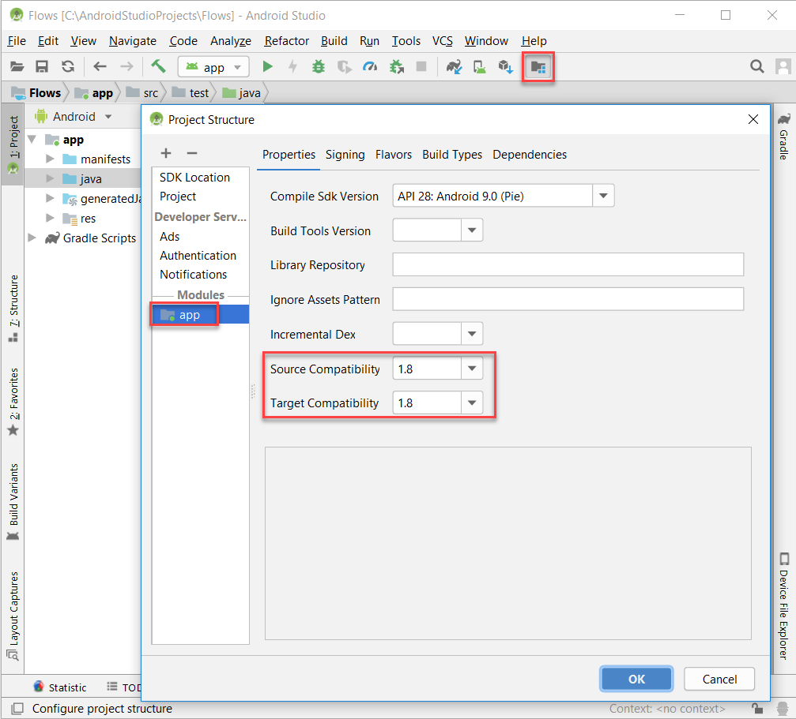

Create a new layout resource file in the **`res/layout`** folder called **`splash_screen.xml`**.  Replace its contents with the following code. The splash screen will be shown until the onboarding or restore flow is complete.

```XML
<?xml version="1.0" encoding="utf-8"?>
<LinearLayout xmlns:android="http://schemas.android.com/apk/res/android"
    android:orientation="vertical" android:layout_width="fill_parent"
    android:layout_height="fill_parent"
    android:gravity="center">

    <ImageView android:id="@+id/splashscreen" android:layout_width="wrap_content"
        android:layout_height="wrap_content"
        android:src="@mipmap/ic_launcher_round"/>

    <TextView android:layout_width="fill_parent"
        android:layout_height="wrap_content"
        android:text="Wiz App"
        android:textAlignment="center"/>
</LinearLayout>
```

Replace the code in **`MainActivity.java`** with the following code.
```Java
package com.sap.flows;

//imports for entire Flows tutorial are added here
import android.app.Activity;
import android.content.ComponentName;
import android.content.DialogInterface;
import android.content.Intent;
import android.graphics.Color;
import android.os.Bundle;
import android.os.IBinder;
import android.provider.Settings;
import android.support.annotation.NonNull;
import android.support.v7.app.AlertDialog;
import android.support.v7.app.AppCompatActivity;
import android.util.Log;
import android.view.View;
import android.widget.Toast;

import com.sap.cloud.mobile.flow.Flow;
import com.sap.cloud.mobile.flow.FlowActionHandler;
import com.sap.cloud.mobile.flow.FlowContext;
import com.sap.cloud.mobile.flow.FlowManagerService;
import com.sap.cloud.mobile.flow.ServiceConnection;
import com.sap.cloud.mobile.flow.Step;
import com.sap.cloud.mobile.flow.onboarding.OnboardingContext;
import com.sap.cloud.mobile.flow.onboarding.basicauth.BasicAuthStep;
import com.sap.cloud.mobile.flow.onboarding.basicauth.BasicAuthStoreStep;
import com.sap.cloud.mobile.flow.onboarding.eulascreen.EulaScreenStep;
import com.sap.cloud.mobile.flow.onboarding.logging.LoggingStep;
import com.sap.cloud.mobile.flow.onboarding.presenter.FlowPresentationActionHandlerImpl;
import com.sap.cloud.mobile.flow.onboarding.storemanager.ChangePasscodeStep;
import com.sap.cloud.mobile.flow.onboarding.storemanager.PasscodePolicyStoreStep;
import com.sap.cloud.mobile.flow.onboarding.storemanager.SettingsDownloadStep;
import com.sap.cloud.mobile.flow.onboarding.storemanager.SettingsStoreStep;
import com.sap.cloud.mobile.flow.onboarding.storemanager.StoreManagerStep;
import com.sap.cloud.mobile.flow.onboarding.welcomescreen.WelcomeScreenStep;
import com.sap.cloud.mobile.flow.onboarding.welcomescreen.WelcomeScreenStoreStep;
import com.sap.cloud.mobile.foundation.common.EncryptionError;
import com.sap.cloud.mobile.foundation.common.SettingsParameters;
import com.sap.cloud.mobile.foundation.configurationprovider.ConfigurationProvider;
import com.sap.cloud.mobile.foundation.configurationprovider.JsonConfigurationProvider;
import com.sap.cloud.mobile.foundation.logging.Logging;
import com.sap.cloud.mobile.foundation.securestore.OpenFailureException;
import com.sap.cloud.mobile.onboarding.launchscreen.LaunchScreenSettings;
import com.sap.cloud.mobile.onboarding.qrcodereader.QRCodeConfirmSettings;
import com.sap.cloud.mobile.onboarding.qrcodereader.QRCodeReaderSettings;

import org.slf4j.Logger;
import org.slf4j.LoggerFactory;

import java.net.MalformedURLException;

import ch.qos.logback.classic.Level;
import okhttp3.OkHttpClient;

public class MainActivity extends AppCompatActivity  {
    private FlowManagerService flowManagerService;
    private OnboardingContext flowContext;
    private String appID = "com.sap.wizapp";
    private static Logger LOGGER = LoggerFactory.getLogger(MyApplication.class);
    private Logging.UploadListener myLogUploadListener;
    private SettingsDownloadStep settingsDownloadStep = new SettingsDownloadStep();
    private EulaScreenStep eulaScreenStep = new EulaScreenStep();

    ServiceConnection connection = new ServiceConnection() {
        public void onServiceConnected(ComponentName className, IBinder service) {
            // This is called when the connection with the service has been
            // established, giving us the service object we can use to
            // interact with the service.  Because we have bound to a explicit
            // service that we know is running in our own process, we can
            // cast its IBinder to a concrete class and directly access it.
            flowManagerService = ((FlowManagerService.LocalBinder)service).getService();
            startOnboardingFlow();
        }
        public void onServiceDisconnected(ComponentName className) {
            // This is called when the connection with the service has been
            // unexpectedly disconnected -- that is, its process crashed.
            // Because it is running in our same process, we should never
            // see this happen.
            flowManagerService = null;
        }
    };

    @Override
    protected void onCreate(Bundle savedInstanceState) {
        super.onCreate(savedInstanceState);

        getSupportActionBar().hide();
        setContentView(R.layout.splash_screen);

        initializeLogging(Level.TRACE);
        LOGGER.debug("Log level in onCreate is: " + Logging.getRootLogger().getLevel().toString());

        // Uncomment the below line to not show the passcode screen.  Requires that Passcode Policy is disabled in the management cockpit
        //settingsDownloadStep.passcodePolicy = null;
        eulaScreenStep.setEulaVersion("0.1");

        this.bindService(new Intent(this, FlowManagerService.class),
                this.connection, Activity.BIND_AUTO_CREATE);
    }

    private void initializeLogging(Level level) {
        Logging.ConfigurationBuilder cb = new Logging.ConfigurationBuilder()
                .logToConsole(true)
                .initialLevel(level);  // levels in order are all, trace, debug, info, warn, error, off
        Logging.initialize(this.getApplicationContext(), cb);
    }

    private void startOnboardingFlow() {
        flowContext = new OnboardingContext();

        // setting details on the welcome screen and store
        WelcomeScreenStep welcomeScreenStep = new WelcomeScreenStep();
        welcomeScreenStep.setApplicationId(appID);
        welcomeScreenStep.setApplicationVersion("1.0");
        welcomeScreenStep.setDeviceId(android.provider.Settings.Secure.getString(this.getContentResolver(), Settings.Secure.ANDROID_ID));

        LaunchScreenSettings lss = new LaunchScreenSettings();
        lss.setDemoAvailable(false);
        lss.setLaunchScreenTitles(new String[]{"Wiz App"});
        lss.setLaunchScreenHeadline("Now with Flows!");
        lss.setLaunchScreenDescriptions(new String[] {"See how easy it is to onboard with Flows"});
        lss.setLaunchScreenImages(new int[]{R.drawable.graphic_airplane});
        welcomeScreenStep.setWelcomeScreenSettings(lss);

        // adds the QR code activation screen during onboarding
        //welcomeScreenStep.setProviders(new ConfigurationProvider[] {new JsonConfigurationProvider()});

        // skips the Scan Succeeded screen after scanning the QR code
        //QRCodeConfirmSettings qrcs = new QRCodeConfirmSettings();
        //QRCodeReaderSettings qrcrs = new QRCodeReaderSettings();
        //qrcrs.setSkipConfirmScreen(true);
        //welcomeScreenStep.setQrCodeConfirmSettings(qrcs);
        //welcomeScreenStep.setQrCodeReaderSettings(qrcrs);

        // Creating flow and configuring steps
        Flow flow = new Flow("onboard");
        flow.setSteps(new Step[] {
                new PasscodePolicyStoreStep(),  // Creates the passcode policy store (RLM_SECURE_STORE)
                welcomeScreenStep,              // Shows the welcome screen and getting the configuration data
                new BasicAuthStep(),            // Authenticates with Mobile Services
                settingsDownloadStep,           // Get the client policy data from the server
                new LoggingStep(),              // available in 2.0.1 and above
                new StoreManagerStep(),         // Manages the Application Store (APP_SECURE_STORE), encrypted using passcode key
                new BasicAuthStoreStep(),       // Persists the credentials into the application Store
                new WelcomeScreenStoreStep(),   // Persists the configuration data into the application store
                new SettingsStoreStep(),        // Persists the passcode policy into the application store
                eulaScreenStep                  // Presents the EULA screen and persists the version of the EULA into the application store

        });

        // Preparing the flow context
        flowContext.setContext(getApplication());
        flowContext.setFlowPresentationActionHandler(new FlowPresentationActionHandlerImpl(this));

        flowManagerService.execute(flow, flowContext, new FlowActionHandler() {
            @Override
            public void onFailure(Throwable t) {
                // flowManagerService failed to execute so create an alert dialog to inform users of errors
                LOGGER.debug("Failed to onboard.  " + t.getMessage());
                showAlertDialog("Onboard", t);
            }

            @Override
            public void onSuccess(FlowContext result) {
                initializeLogging(Level.DEBUG); // TODO remove when https://support.wdf.sap.corp/sap/support/message/1980000361 is fixed

                LOGGER.debug("Successfully onboarded");

                // remove the splash screen and replace it with the actual working app screen
                getSupportActionBar().show();
                setContentView(R.layout.activity_main);
            }
        });
    }

    public void onUploadLog(View view) {
        LOGGER.debug("In onUploadLog");
    }

    public void onChange(View view) {
        LOGGER.debug("In onChange");
    }

    public void onReset(View view) {
        LOGGER.debug("In onReset");
    }

    public void showAlertDialog(String flow, Throwable t) {
        // create an alert dialog because an error has been thrown
        AlertDialog alertDialog = new AlertDialog.Builder(MainActivity.this).create();
        alertDialog.setTitle("Failed to execute " + flow + " Flow");
        alertDialog.setMessage((t.getMessage().equals("Eula Rejected") ? "EULA Rejected" : "" + t.getMessage()));

        // dismisses the dialog if OK is clicked, but if the EULA was rejected then app is reset
        alertDialog.setButton(AlertDialog.BUTTON_POSITIVE, "OK",
                new DialogInterface.OnClickListener() {
                    public void onClick(DialogInterface dialog, int which) {
//                        if (t.getMessage().equals("Eula Rejected") || flow.equals("Onboard")) {
//                            startResetFlow();
//                        }
                        dialog.dismiss();
                    }
                });

        // changes the colour scheme
        alertDialog.setOnShowListener(new DialogInterface.OnShowListener() {
            @Override
            public void onShow(DialogInterface dialog) {
                alertDialog.getButton(AlertDialog.BUTTON_POSITIVE).setTextColor(Color.parseColor("#008577"));
            }
        });

        alertDialog.show();
    }
}
```

Replace the XML in **`res/layout/activity_main.xml`** with the following code which will add three buttons, reset, change and upload log.

```XML
<?xml version="1.0" encoding="utf-8"?>
<android.support.constraint.ConstraintLayout xmlns:android="http://schemas.android.com/apk/res/android"
    xmlns:app="http://schemas.android.com/apk/res-auto"
    xmlns:tools="http://schemas.android.com/tools"
    android:layout_width="match_parent"
    android:layout_height="match_parent"
    tools:context="com.sap.flows.MainActivity">

    <ScrollView
        android:layout_width="match_parent"
        android:layout_height="match_parent">

        <LinearLayout
            android:layout_width="match_parent"
            android:layout_height="match_parent"
            android:orientation="vertical">

            <TextView
                android:layout_width="wrap_content"
                android:layout_height="wrap_content"
                android:text="Hello World!" />

            <Button
                android:id="@+id/b_reset"
                android:layout_width="wrap_content"
                android:layout_height="wrap_content"
                android:onClick="onReset"
                android:text="Reset" />

            <Button
                android:id="@+id/b_change"
                android:layout_width="wrap_content"
                android:layout_height="wrap_content"
                android:onClick="onChange"
                android:text="Change" />
            <Button
                android:id="@+id/b_uploadLog"
                android:layout_width="wrap_content"
                android:layout_height="wrap_content"
                android:onClick="onUploadLog"
                android:text="Upload Log" />

        </LinearLayout>
    </ScrollView>
</android.support.constraint.ConstraintLayout>
```

Right-click on the res folder, choose **New > Directory** and name it **raw**.  

Right-click on the **raw** folder, choose **New > File** and name it **`configurationprovider.json`**.  

Copy the below contents into the file.  

```Java
{
    "auth":[{"type":"basic.default","config":{},"requireOtp":false}],
    "host":"hcpms-p1743065160trial.hanatrial.ondemand.com",
    "port":443,
    "protocol":"https",
    "appID":"com.sap.wizapp"
}
```

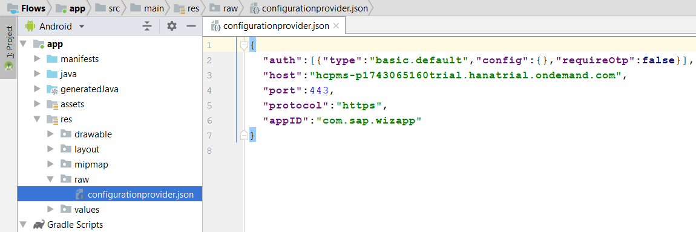

>Note that if this file is not provided, an onboarding screen asking the user to scan a QR code containing the onboarding details or to enter their email address (to get configuration data from the discovery service) will appear.

Update the host value to match your Mobile Services host.  This value can be seen in the management cockpit under API's as shown below.

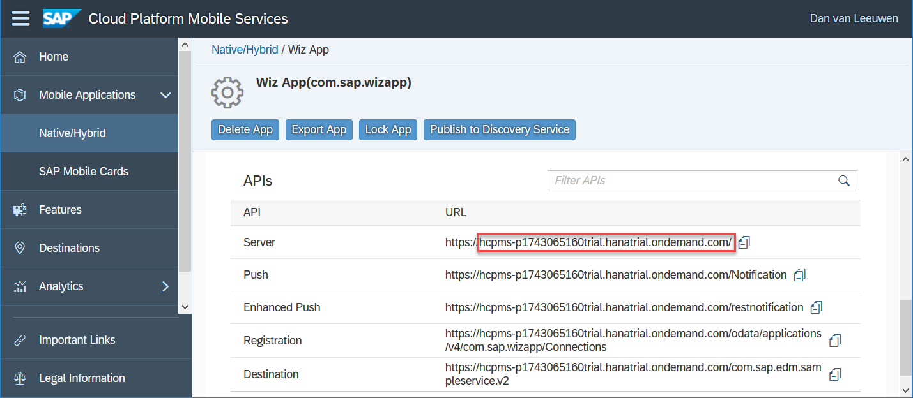


[DONE]
[ACCORDION-END]

[ACCORDION-BEGIN [Step 2: ](Try it out)]

Run the app and the splash screen will appear briefly.

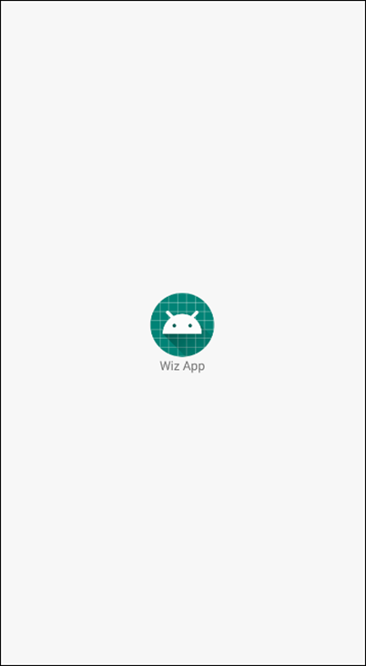

The Welcome screen is shown the first time the app is run.

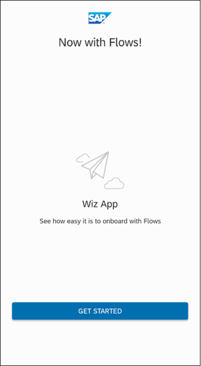

After tapping Get Started, an authentication screen is shown. Enter your Mobile Services credentials.

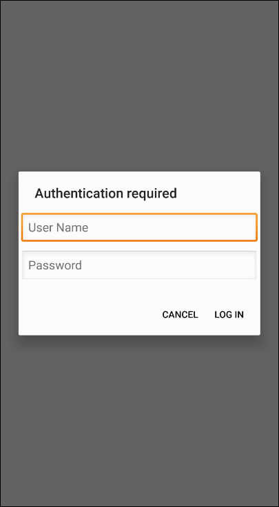

The passcode screen enables the setting of an app level passcode.

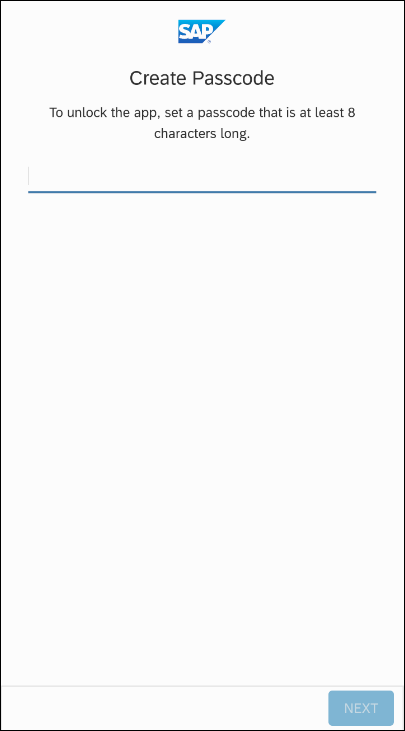

The previously entered passcode must be verified.

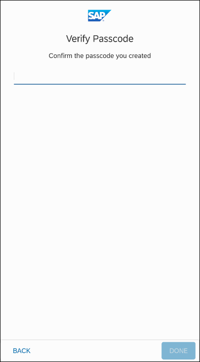

An option is provided to be able to unlock the passcode screen of the app using a fingerprint.


The End User License Agreement needs to be accepted in order to complete the onboarding.


The app's main screen.

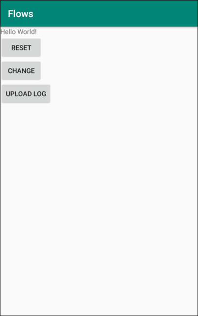

After completing the onboarding process, the registration can be seen in the Mobile Services Cockpit. Navigate to Native/Hybrid > Wiz App > User Registrations and a new registration will appear in the Registered Users table.

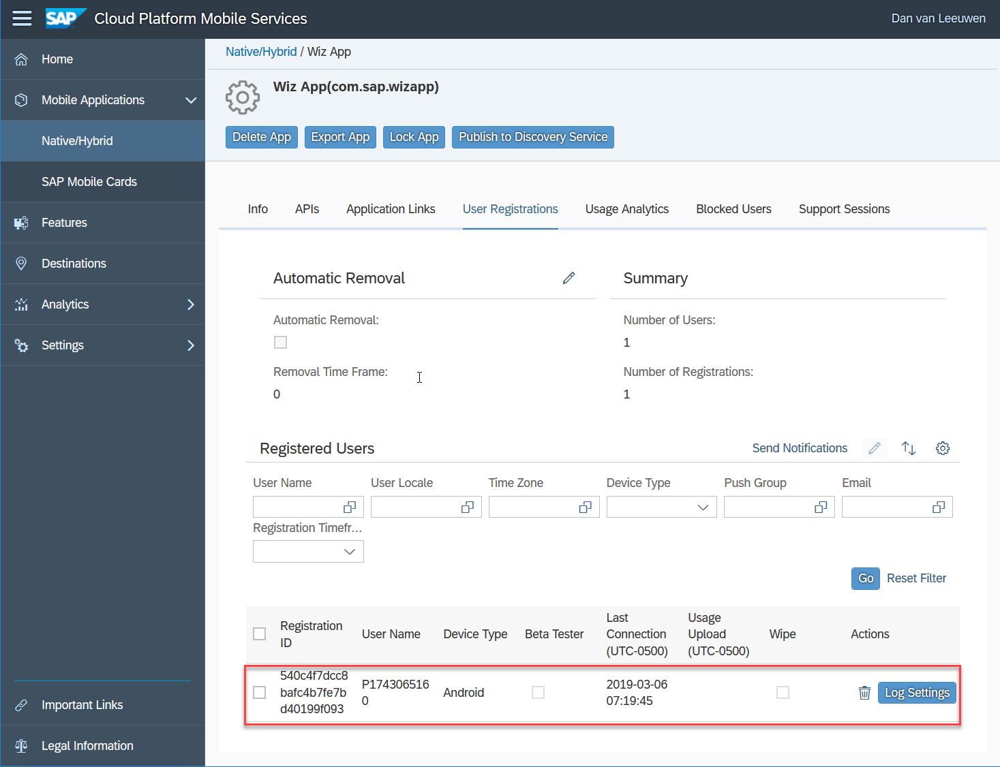

[VALIDATE_1]
[ACCORDION-END]


[ACCORDION-BEGIN [Step 3: ](Disable passcode)]

The following changes can be made to not show the passcode screen.

Within the management cockpit, disable the Passcode Policy under Client Policies by unchecking it.

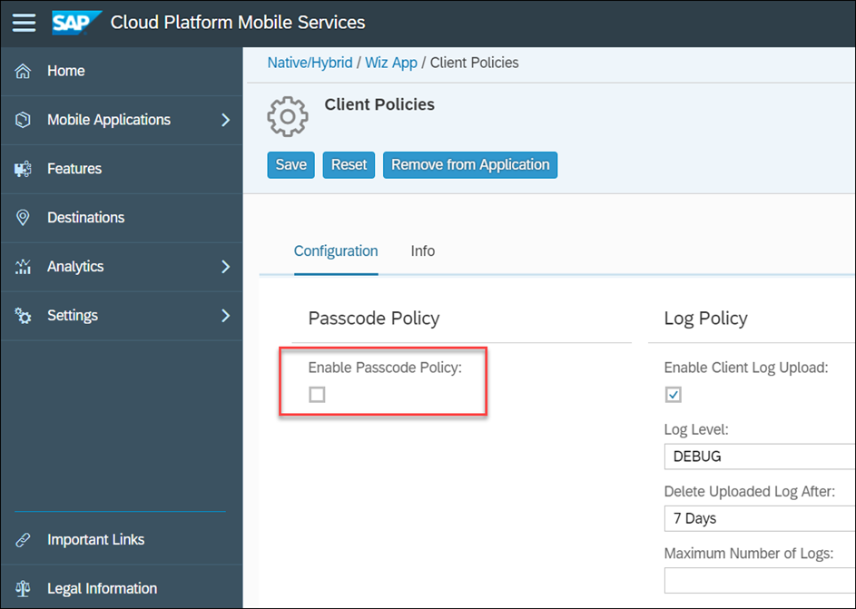

In the class, **`MainActivity`**, in the method **`onCreate`**, uncomment the below line.

```Java
settingsDownloadStep.passcodePolicy = null;
```

Delete and reinstall the app.

Notice that the passcode screens are not shown.


[DONE]
[ACCORDION-END]

[ACCORDION-BEGIN [Step 4: ](Use a QR code to onboard)]

The following changes can be made to change the method of initial onboarding to use a QR code scanner.

The QR code containing the onboarding info is available in the management cockpit.

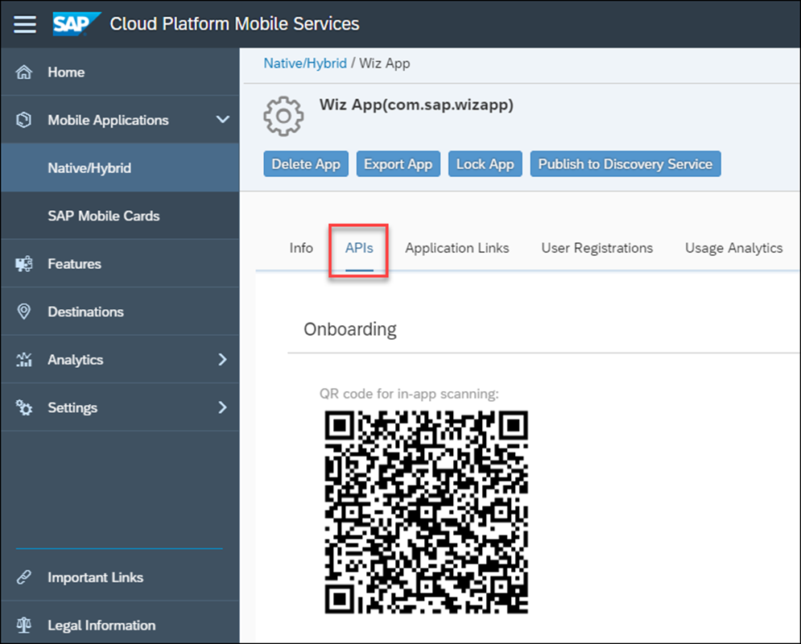

Uncomment the following line from the **`startOnboardingFlow`** method.

```Java
welcomeScreenStep.setProviders(new ConfigurationProvider[] {new JsonConfigurationProvider()});
```

Uninstall the app.

Run the app and tap Get Started.  The below screen will now appear.

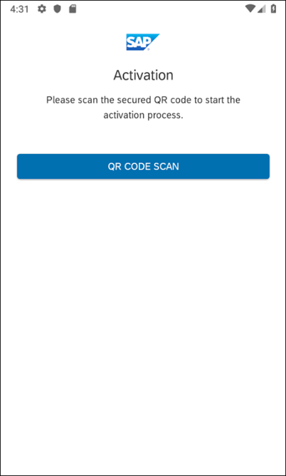

When using an emulator, tap on the button shown below to browse to the file used as a result of taking a picture.

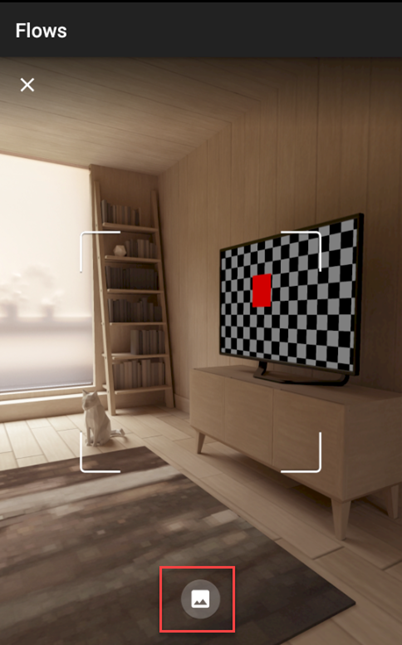

Save the QR code to a file.

Drag and drop it on to the emulator.

Browse to the just added file.

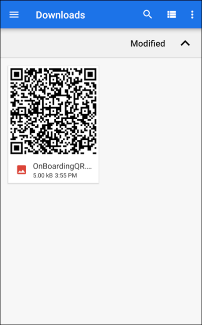

The Scan succeeded screen will appear and the onboarding will proceed as before.

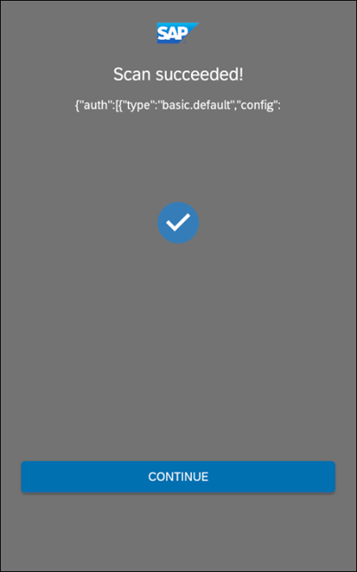

The Scan succeeded screen is optional and can be not shown by removing the comments from the code below in the **`startOnboardingFlow`** method.

```Java
QRCodeConfirmSettings qrcs = new QRCodeConfirmSettings();
QRCodeReaderSettings qrcrs = new QRCodeReaderSettings();
qrcrs.setSkipConfirmScreen(true);
welcomeScreenStep.setQrCodeConfirmSettings(qrcs);
welcomeScreenStep.setQrCodeReaderSettings(qrcrs);
```

[DONE]
[ACCORDION-END]

[ACCORDION-BEGIN [Step 5: ](Customize the onboarding screens)]

The onboarding screens can be further customized.

The SAP logo can be replaced with your company's logo by following [Changing the Logo on Every Screen](https://help.sap.com/doc/c2d571df73104f72b9f1b73e06c5609a/Latest/en-US/docs/fioriui/onboarding/layout_design_customizing.html#changing-the-logo-on-every-screen).

The text of the buttons or descriptions can be modified. The following are some examples.

```Java
// Changes the description of the QR code screen shown previously
ActivationSettings as = new ActivationSettings();
as.setActivationInstruction("Scan the QR code emailed to you by your administrator.");
```

Congratulations!  The code to perform an initial onboarding to Mobile Services has been added and a few customization options have been explored.

[DONE]
[ACCORDION-END]
