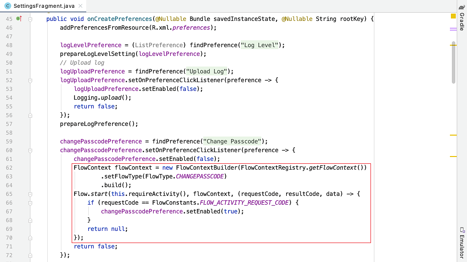
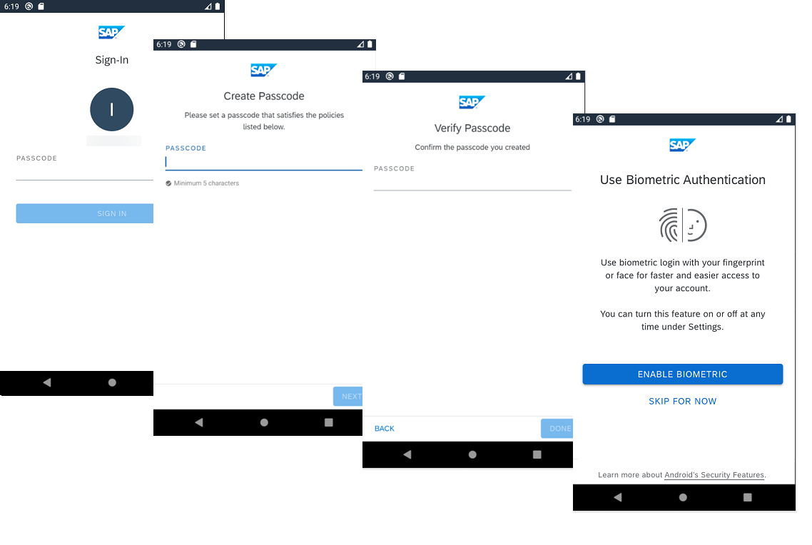
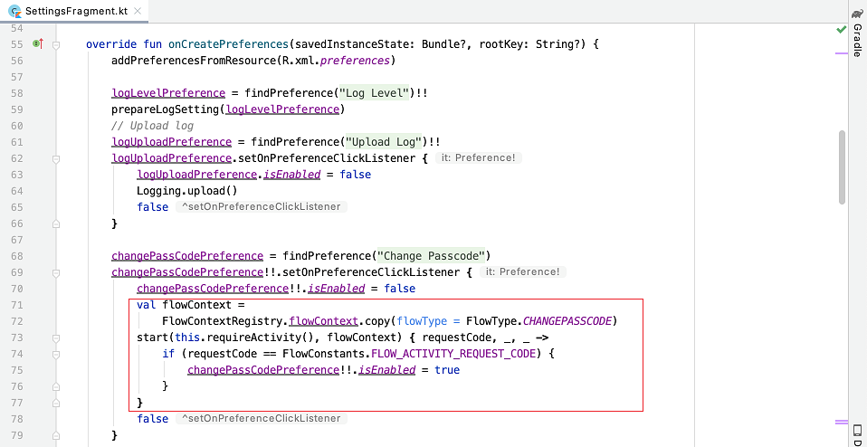
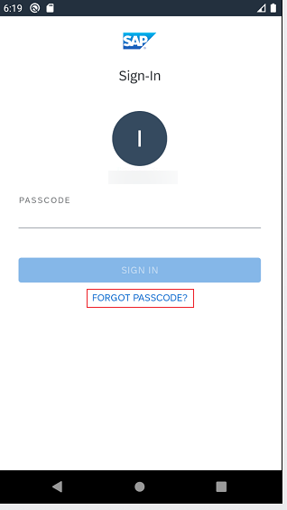
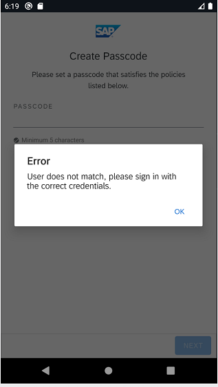

## Prerequisites
- You completed [Try Out the SAP BTP SDK Wizard for Android](cp-sdk-android-wizard-app).
- You completed [Get Familiar with the Flows Component by a Wizard Generated Application](cp-sdk-android-flows-wizard).

## Details
### You will learn
  - How to change passcode with the Flows component
  - How to handle forgetting passcode scenario with the Flows Component
  - How to verify passcode with the Flows component

---

[ACCORDION-BEGIN [Step 1: ](Handle passcode change with the Flows component)]

[OPTION BEGIN [Java]]

1.  Open the project you [previously created](cp-sdk-android-wizard-app) using the SAP BTP SDK Wizard for Android.

2.  In Android Studio, on Windows, press **`Ctrl+N`**, or, on a Mac, press **`command+O`**, and type **`SettingsFragment`** to open `SettingsFragment.java`.

3.  On Windows, press **`Ctrl+F12`**, or, on a Mac, press **`command+F12`**, and type **`onCreatePreferences`** to move to the `onCreatePreferences` method. To start the flow to change passcode, the flow type must be **`FlowType.CHANGEPASSCODE`** for the **`FlowContext`** instance. Upon starting the flow with this **`FlowContext`** instance, the entire process to change passcode will be handled automatically.

    !

4.  The "change passcode" flow will firstly display the sign-in screen for user to input current passcode. When sign-in is successful with correct passcode, the flow will open "Create Passcode" and "Verify Passcode" screens for user to input and verify the new passcode. The subsequent step is optional, when biometric authentication is enabled in the passcode policy and is also supported on the device, the "Enable Biometric" screen will be displayed. User can decide whether or not to enable biometric authentication for this app. Then the flow is finished and the new passcode will take effect.

    !

    Notice that in the sign-in screen of a "change passcode" flow, the **FORGOT PASSCODE?** button is invisible and the **SWTICH OR ADD USER** button in multi-user mode is also invisible.

[OPTION END]

[OPTION BEGIN [Kotlin]]

1.  Open the project you [previously created](cp-sdk-android-wizard-app) using the SAP BTP SDK Wizard for Android.

2.  In Android Studio, on Windows, press **`Ctrl+N`**, or, on a Mac, press **`command+O`**, and type **`SettingsFragment`** to open `SettingsFragment.kt`.

3.  On Windows, press **`Ctrl+F12`**, or, on a Mac, press **`command+F12`**, and type **`onCreatePreferences`** to move to the `onCreatePreferences` method. To start the flow to change passcode, the flow type must be **`FlowType.CHANGEPASSCODE`** for the **`FlowContext`** instance. Upon starting the flow with this **`FlowContext`** instance, the entire process to change passcode will be handled automatically.

    !

4.  The "change passcode" flow will firstly display the sign-in screen for user to input current passcode. When sign-in is successful with correct passcode, the flow will open "Create Passcode" and "Verify Passcode" screens for user to input and verify the new passcode. The subsequent step is optional, when biometric authentication is enabled in the passcode policy and is also supported on the device, the "Enable Biometric" screen will be displayed. User can decide whether or not to enable biometric authentication for this app. Then the flow is finished and the new passcode will take effect.

    !

    Notice that in the sign-in screen of a "change passcode" flow, the **FORGOT PASSCODE?** button is invisible and the **SWTICH OR ADD USER** button in multi-user mode is also invisible.

[OPTION END]

[VALIDATE_1]
[ACCORDION-END]

[ACCORDION-BEGIN [Step 2: ](Handle forgetting passcode with the Flows component)]

[OPTION BEGIN [Java]]

1.  In the app generated from the SAP BTP SDK Wizard for Android, there is a **FORGOT PASSCODE?** button on the sign-in screen. When the app is locked and user forgot the passcode to unlock the app, user can click this button to start a "forgot passcode" flow and reset the passcode.

    !

2.  The "forgot passcode" flow actually starts an onboarding flow. The differences between a "forgot passcode" flow and a standard onboarding flow are:

    - The EULA screen is always excluded in the "forgot passcode" flow.

    - The "forgot passcode" flow remembers the user ID that is performing the "forgot passcode" action and if the user tries to onboard with another user ID, the flow will terminate with a warning dialog.

    !

3.  To start a "forgot passcode" flow, set the flow type as **`FlowType.FORGOT_PASSCODE`** and set the user ID who forgot the passcode for the **`FlowContext`** instance, and then call the `start` method of the `Flow` class to start the flow.

    ```Java
    FlowContext flowContext = new FlowContextBuilder()
                .setApplication(new AppConfig.Builder().applicationId("app_id").addAuth(
                        new BasicAuth()).build())
                .setFlowType(FlowType.FORGOT_PASSCODE)
                .setForgotPasscodeUserId("TestUser")
                .build();
    Flow.start(this, flowContext);
    ```

[OPTION END]

[OPTION BEGIN [Kotlin]]

1.  In the app generated from the SAP BTP SDK Wizard for Android, there is a **FORGOT PASSCODE?** button on the sign-in screen. When the app is locked and user forgot the passcode to unlock the app, user can click this button to start a "forgot passcode" flow and reset the passcode.

    !

2.  The "forgot passcode" flow actually starts an onboarding flow. The differences between a "forgot passcode" flow and a standard onboarding flow are:

    - The EULA screen is always excluded in the "forgot passcode" flow.

    - The "forgot passcode" flow remembers the user ID that is performing the "forgot passcode" action and if the user tries to onboard with another user ID, the flow will terminate with a warning dialog.

    !

3.  To start a "forgot passcode" flow, set the flow type as **`FlowType.FORGOT_PASSCODE`** and set the user ID who forgot the passcode for the **`FlowContext`** instance, and then call the `start` method of the `Flow` class to start the flow.

    ```Kotlin
    val flowContext = FlowContextBuilder()
                .setApplication(AppConfig.Builder().applicationId("app_id")
                                    .addAuth(BasicAuth())
                                    .build())
                .setFlowType(FlowType.FORGOT_PASSCODE)
                .setForgotPasscodeUserId("TestUser")
                .build()
    Flow.start(this, flowContext)
    ```

[OPTION END]

[VALIDATE_2]
[ACCORDION-END]

[ACCORDION-BEGIN [Step 3: ](Handle passcode verification with the Flows component)]

[OPTION BEGIN [Java]]

1.  Users might be asked to enter passcode or authenticate with biometric again before modifying some sensitive information in the app. The "verify passcode" flow is designed for this purpose.

2.  To start a "verify passcode" flow, set the flow type as **`FlowType.VERIFY_PASSCODE`** and then call the `start` method of the `Flow` class to start the flow.

    ```Java
    FlowContext flowContext = new FlowContextBuilder()
                .setApplication(new AppConfig.Builder().applicationId("app_id").addAuth(
                        new BasicAuth()).build())
                .setFlowType(FlowType.VERIFY_PASSCODE)
                .build();
    Flow.start(this, flowContext);
    ```

3.  When biometric authentication is enabled by the user, the flow will display the "Sign In with Biometric" screen for user to authenticate with biometric information.

    !

    Otherwise, the flow will display the sign-in screen for user to input passcode. Notice that unlike the sign-in screen used for app unlock, the **FORGOT PASSCODE** button and the **SWITH OR ADD USER** button in multi-user mode are always invisible for the sign-in screen of a "verify passcode" flow.

    !

[OPTION END]

[OPTION BEGIN [Kotlin]]

1.  Users might be asked to enter passcode or authenticate with biometric again before modifying some sensitive information in the app. The "verify passcode" flow is designed for this purpose.

2.  To start a "verify passcode" flow, set the flow type as **`FlowType.VERIFY_PASSCODE`** and then call the `start` method of the `Flow` class to start the flow.

    ```Kotlin
    val flowContext = FlowContextBuilder()
                .setApplication(AppConfig.Builder().applicationId("app_id")
                                    .addAuth(BasicAuth())
                                    .build())
                .setFlowType(FlowType.VERIFY_PASSCODE)
                .build()
    Flow.start(this, flowContext)
    ```

3.  When biometric authentication is enabled by the user, the flow will display the "Sign In with Biometric" screen for user to authenticate with biometric information.

    !

    Otherwise, the flow will display the sign-in screen for user to input passcode. Notice that unlike the sign-in screen used for app unlock, the **FORGOT PASSCODE** button and the **SWITH OR ADD USER** button in multi-user mode are always invisible for the sign-in screen of a "verify passcode" flow.

    !

[OPTION END]

Congratulations! You now have learned how to handle your passcode with the Flows component!

[DONE]
[ACCORDION-END]

---
