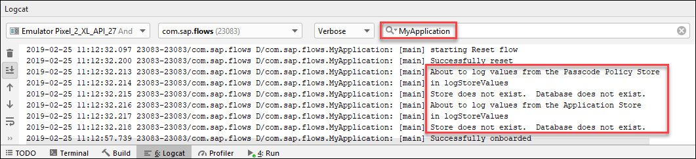

## Prerequisites
 - Completed the previous tutorial in this mission which added the restore flow

## Details
### You will learn
  - How to add a reset flow to an app
  - The effect of the reset flow on the secure stores


The result of the reset flow will be that the data in the stores will be cleared and the onboarding flow will be called.

---

[ACCORDION-BEGIN [Step 1: ](Add the code for the reset flow)]

Add the following method to your class in **`MainActivity.java`**.

```Java
private void startResetFlow() {
    LOGGER.debug("starting Reset flow");

    StoreHelper.reset();

    // Creating flow and configuring steps
    Flow flow = new Flow("reset");
    flow.setSteps(new Step[]{
            new StoreManagerStep(),         // clears the application store (APP_SECURE_STORE)
            new BasicAuthStep(),            // removes any saved cookies
            new PasscodePolicyStoreStep()   // clears the passcode policy store (RLM_SECURE_STORE) and creates a new one
    });

    // Preparing flow context
    flowContext.setContext(this.getApplication());
    flowContext.setFlowPresentationActionHandler(new FlowPresentationActionHandlerImpl(this));

    flowManagerService.execute(flow, flowContext, new FlowActionHandler() {
        @Override
        public void onFailure(Throwable t) {
            LOGGER.debug("Reset failed. ");
            showAlertDialog("Reset", t);
        }

        @Override
        public void onSuccess(FlowContext result) {
            LOGGER.debug("Successfully reset");

            // show splash screen again then start onboarding flow
            getSupportActionBar().hide();
            setContentView(R.layout.splash_screen);

            // After the reset, the stores should be empty
            LOGGER.debug("About to log values from the Passcode Policy Store");
            StoreHelper.logStoreValues(((OnboardingContext) result).getPasscodePolicyStore());
            LOGGER.debug("About to log values from the Application Store");
            StoreHelper.logStoreValues(((OnboardingContext) result).getApplicationStore());
            startOnboardingFlow();
        }
    });
}
```

The added method calls the `StoreHelper's` reset method which clears data in the stores and then starts the onboarding flow.

Add the following line to the **`onReset`** method.

```Java
startResetFlow();
```

Within the **`showAlertDialog`** method, uncomment the following code.

```Java
if (t.getMessage().equals("Eula Rejected") || flow.equals("Onboard")) {
    startResetFlow();
}
```
This will ensure that if the EULA is rejected, or if onboarding fails, then the onboarding flow will begin again.

[VALIDATE_1]
[ACCORDION-END]

[ACCORDION-BEGIN [Step 2: ](Try it out)]

Tap the **`Reset`** button.


The Welcome screen should appear.


As well, the stores will have their values cleared.



If there are additional stores to be reset, such as an offline store, code could be added in added in the `StoreHelper's resetData` method to handle this.

Congratulations! The code to perform a reset flow has been added.

[VALIDATE_2]
[ACCORDION-END]
---
