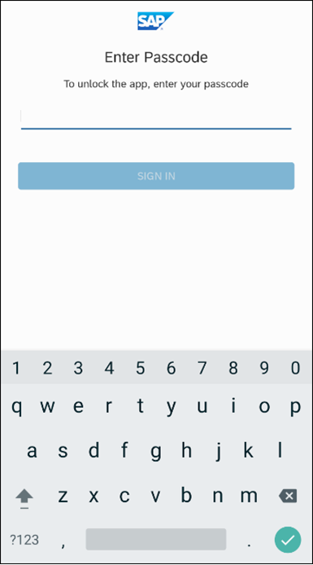
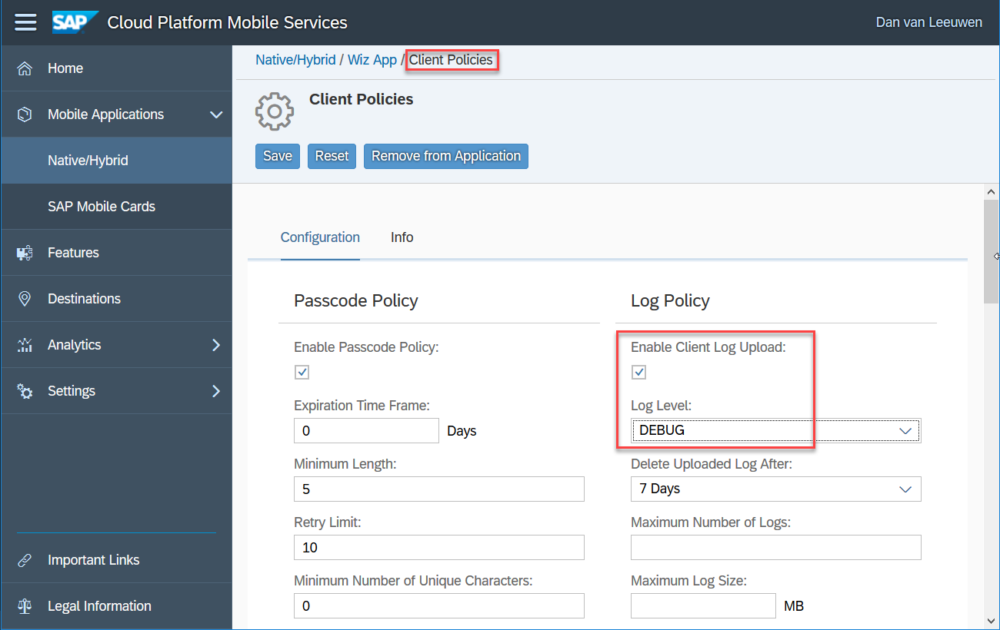
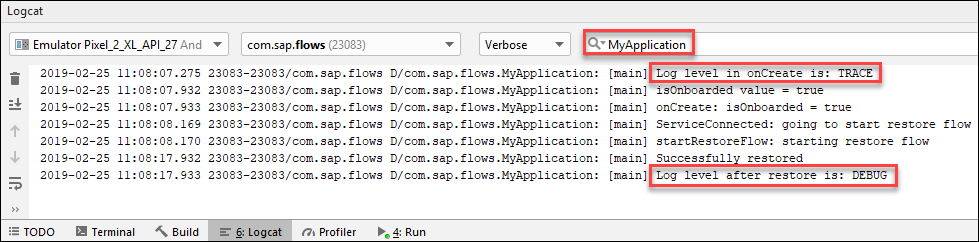
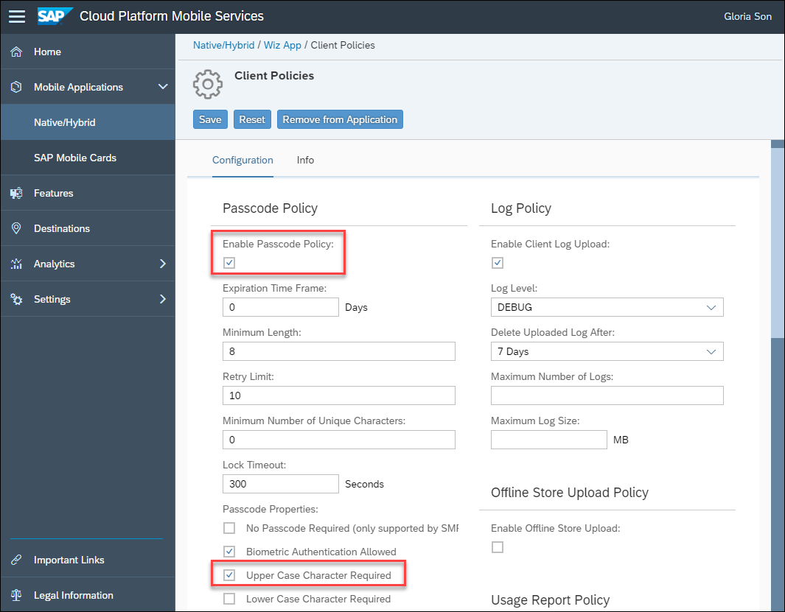
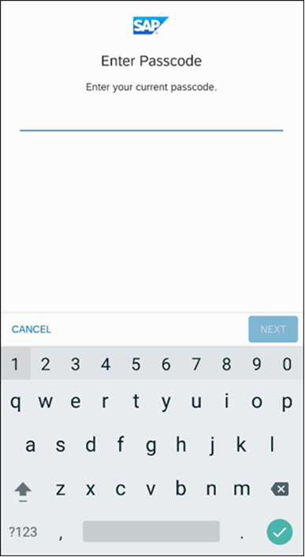
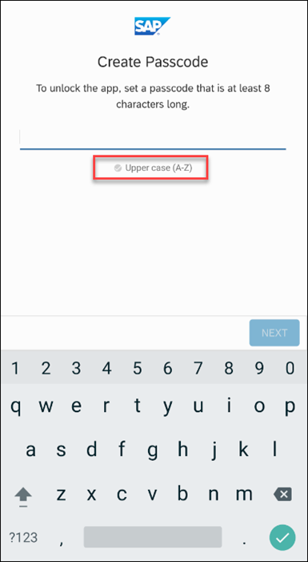

## Prerequisites
 - Completed the previous tutorial in this mission which added code to access the secure stores

## Details
### You will learn
  - How to add a restore flow to an app
  - How the restore flow responds to changes in the client policy

The user's credentials and the configuration data (such as which Mobile Services server to connect to) will be loaded from the secure application store.

---

[ACCORDION-BEGIN [Step 1: ](Add code for the restore flow)]

Add the following code into the class in **`MainActivity.java`**.

```Java
public void startRestoreFlow() {
    LOGGER.debug("startRestoreFlow: starting restore flow");
    flowContext = new OnboardingContext();

    // Creating flow and configuring steps
    Flow flow = new Flow("restore");
    flow.setSteps(new Step[]{
            new PasscodePolicyStoreStep(),    // Opens the passcode policy store (RLM_SECURE_STORE)
            new StoreManagerStep(),           // Opens the application store (APP_SECURE_STORE)
            new WelcomeScreenStoreStep(),     // Reads the previously stored config data and adds it to the context
            new SettingsStoreStep(),          // Reads the previously stored passcode policy and adds it to the context
            new BasicAuthStep(),              // Creates an instance of the OKHttpClient
            new BasicAuthStoreStep(),         // Restores the authentication data from the application store
            settingsDownloadStep,             // Get the client policy data from the server
            new LoggingStep(),                // available in 2.0.1+
            new ChangePasscodeStep(),         // If required by a change in client policy, display the change passcode screen
            eulaScreenStep                    // Presents the EULA screen if the EULA version has been updated
    });

    // Preparing the flow context
    flowContext.setContext(getApplication());
    flowContext.setFlowPresentationActionHandler(new FlowPresentationActionHandlerImpl(this));

    flowManagerService.execute(flow, flowContext, new FlowActionHandler() {
        @Override
        public void onFailure(Throwable t) {
            // flowManagerService failed to execute so will show error dialog
            LOGGER.debug("Failed to restore: " + t);
            showAlertDialog("Restore", t);
        }

        @Override
        public void onSuccess(FlowContext result) {
            initializeLogging(flowContext.getPolicy().getLogLevel());  // TODO remove when https://support.wdf.sap.corp/sap/support/message/1980000361 is fixed
            // flowManagerService executed successfully so remove the splash screen and replace it with the actual working app screen
            getSupportActionBar().show();
            setContentView(R.layout.activity_main);
            LOGGER.debug("Successfully restored");
            LOGGER.warn("Log level after restore is: " + Logging.getRootLogger().getLevel().toString());
        }
    });
}
```

This reloads the configurations from the app's state and shows the screen where users have to input their passcode. Notice that the order of the steps is different from the onboard flow. The suggested order of steps is covered at [Flow Types](https://help.sap.com/doc/c2d571df73104f72b9f1b73e06c5609a/Latest/en-US/docs/flows/Overview.html#flow-types).

Find the method **`onServiceConnected`** and replace the line `startOnboardingFlow();` with the below code.

```Java
if (isOnboarded) {
    LOGGER.debug("ServiceConnected: going to start restore flow");
    startRestoreFlow();
} else {
    LOGGER.debug("ServiceConnected: going to start onboarding flow");
    startOnboardingFlow();
}
```

This code segment determines if the user had already been shown the Onboarding flow. If they have, then the Restore flow is taken, otherwise the Onboarding flow is taken. The `isOnboarding` variable is stored in the passcode policy store in order to be persisted between application restarts.

[VALIDATE_1]
[ACCORDION-END]

[ACCORDION-BEGIN [Step 2: ](Try it out)]

The restore flow is shown if the user has already completed the onboard flow and is re-opening the app.

If the app is closed and reopened, and the passcode policy is enabled, the enter passcode screen will appear.  



The main screen is shown after the passcode screen.


The log shows that the `isOnboarded` variable is true indicating that the restore flow should be run rather than the onboard flow.


[VALIDATE_2]
[ACCORDION-END]


[ACCORDION-BEGIN [Step 3: ](Update the logging level)]

One benefit of the flows framework is the ability for the app to respond to changes in server policies automatically. In this step, the client app will respond to changes made in the management cockpit to the logging level.

To change the Log Level across all users, navigate to the Mobile Services Cockpit and under Client Policies, check **`Enable Client Log Upload`**.  Change the log level to **`DEBUG`** in the Log Level dropdown box.



When the app is next restored, the log level should reflect the value set in the management cockpit.

>It may take a few minutes before the change to the client policy is in effect.



[DONE]
[ACCORDION-END]

[ACCORDION-BEGIN [Step 4: ](Update the passcode policy)]

In this step, the client app will respond to changes made in the management cockpit to the passcode policy.

To change the Passcode Policy, navigate to the Mobile Services Cockpit and under **`Client Policies`**, check **`Enable Passcode Policy`**.  This allows restrictions to be placed on the passcode that users will have to enter. For this example, check **`Upper Case Character Required`**.

>It may take a few minutes before the change to the client policy is in effect.



Ensure that the below line in **`MainActivity`**, in the **`onCreate`** method, is commented out.

`settingsDownloadStep.passcodePolicy = null;`

When the app is opened again, a screen will appear to enter your passcode.



 Then the Create Passcode screen will appear.



Congratulations!  The code to perform a restore flow has been added and how the flow responds to changes in the client policy has been explored.

[DONE]
[ACCORDION-END]


---
