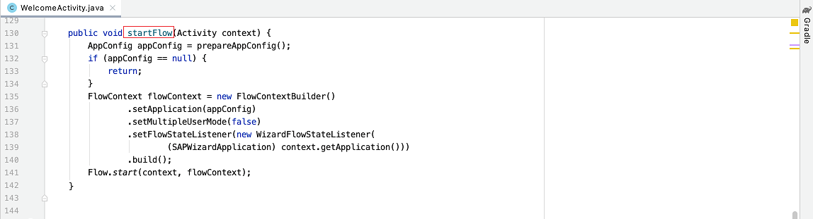
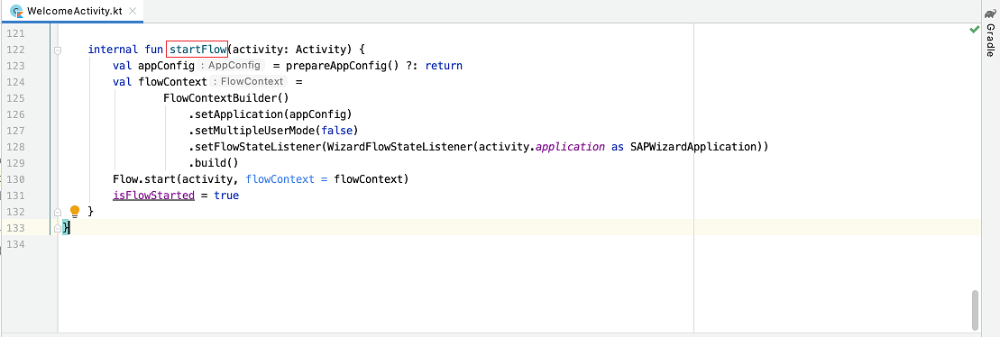
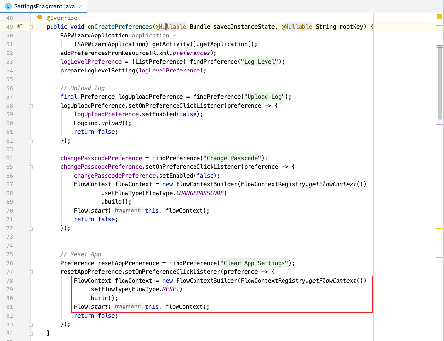
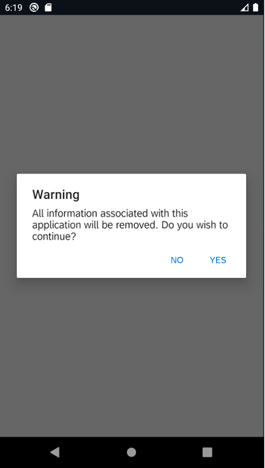
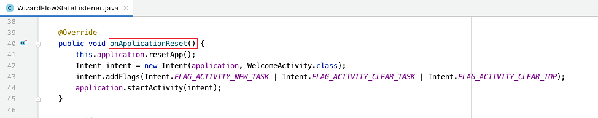
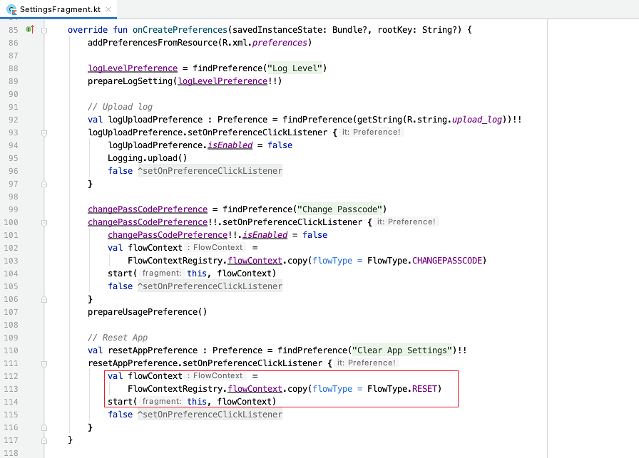
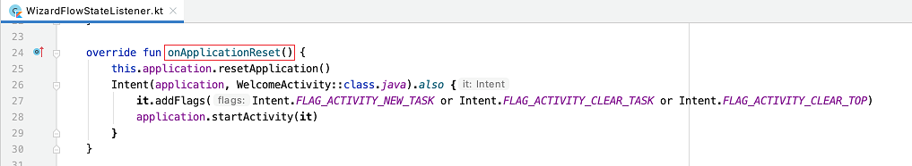

## Prerequisites
- You completed [Try Out the SAP BTP SDK Wizard for Android](cp-sdk-android-wizard-app).
- You completed [Get Familiar with the Flows Component by a Wizard Generated Application](cp-sdk-android-flows-wizard).
- You completed [Customize the Onboarding Flow](cp-sdk-android-flows-onboarding).

## Details
### You will learn
  - How to handle application restore and passcode timeouts using the Flows component
  - How to reset an application using the Flows component

---

[ACCORDION-BEGIN [Step 1: ](Application restore)]

After onboarding, the next time users open the mobile app, the restore flow will be started. Basically, the restore flow consists of the screen unlocking the app with either the passcode or biometric information, if enabled. The restore flow will also check whether the passcode is expired based on the setting defined in the passcode policy. If the passcode is expired, the restore flow will ask the user to create a new passcode and launch a "change passcode" flow.

Similar to the onboarding flow, the restore flow will also listen to the flow states and notify corresponding events to the client code.

The flows component will automatically determine whether to use the onboarding or restore flow, so the app can use the same client code for both flows.

[OPTION BEGIN [Java]]

1.  Open the project you [previously created](cp-sdk-android-wizard-app) using the SAP BTP SDK Wizard for Android.

2.  In Android Studio, on Windows, press **`Ctrl+N`**, or, on a Mac, press **`command+O`**, and type **`WelcomeActivity`** to open `WelcomeActivity.java`.

3.  On Windows, press **`Ctrl+F12`**, or, on a Mac, press **`command+F12`**, and type **`startFlow`** to move to the `startFlow` method. As we mentioned in [Get Familiar with the Flows Component by a Wizard Generated Application](cp-sdk-android-flows-wizard), this method starts an onboarding flow. After onboarding, the next time the app starts, the same method is called and the Flows component detects that the user is already onboarded and starts the restore flow. The client code does not need handle the logic to explicitly start a restore flow.

    !

4.  The restore flow will notify the same events as the onboarding flow and one additional `UnlockWithPasscode` event, which is specific to the restore flow. When the app is unlocked using a passcode, the client code can get the passcode from the `onUnlockWithPasscode` callback of the `FlowStateListener` instance and open the secure store. [Customize the Onboarding Flow](cp-sdk-android-flows-onboarding) explains the events notified in the onboarding flow.

5.  When the app is put to background, the Flows component will monitor whether the passcode is timed out based on the "Lock Timeout" value defined in the passcode policy. When the passcode is timed out and the app is put to foreground again, a timeout unlock flow will be started. This is the `FlowType.TIMEOUT_UNLOCK` flow type, which is used internally by the Flows component for the passcode timeout scenario. This flow's function is exactly the same as that of the restore flow.

[OPTION END]

[OPTION BEGIN [Kotlin]]

1.  Open the project you [previously created](cp-sdk-android-wizard-app) using the SAP BTP SDK Wizard for Android.

2.  In Android Studio, on Windows, press **`Ctrl+N`**, or, on a Mac, press **`command+O`**, and type **`WelcomeActivity`** to open `WelcomeActivity.kt`.

3.  On Windows, press **`Ctrl+F12`**, or, on a Mac, press **`command+F12`**, and type **`startFlow`** to move to the `startFlow` method. As we mentioned in [Get Familiar with the Flows Component by a Wizard Generated Application](cp-sdk-android-flows-wizard), this method starts an onboarding flow. After onboarding, the next time the app starts, the same method is called and the Flows component detects that the user is already onboarded and starts the restore flow. The client code does not need handle the logic to explicitly start a restore flow.

    !

4.  The restore flow will notify the same events as the onboarding flow and one additional `UnlockWithPasscode` event, which is specific to the restore flow. When the app is unlocked using a passcode, the client code can get the passcode from the `onUnlockWithPasscode` callback of the `FlowStateListener` instance and open the secure store. [Customize the Onboarding Flow](cp-sdk-android-flows-onboarding) explains the events notified in the onboarding flow.

5.  When the app is put to background, the Flows component will monitor whether the passcode is timed out based on the "Lock Timeout" value defined in the passcode policy. When the passcode is timed out and the app is put to foreground again, a timeout unlock flow will be started. This is the `FlowType.TIMEOUT_UNLOCK` flow type, which is used internally by the Flows component for the passcode timeout scenario. This flow's function is exactly the same as that of the restore flow.

[OPTION END]

[VALIDATE_1]
[ACCORDION-END]

[ACCORDION-BEGIN [Step 2: ](Reset an application)]

There may be occasions when the user wants to reset the app to initial state. The reset flow is designed to clear all the application data, user data, and security data managed by the Flows component.

[OPTION BEGIN [Java]]

1.  Open the project you [previously created](cp-sdk-android-wizard-app) using the SAP BTP SDK Wizard for Android.

2.  In Android Studio, on Windows, press **`Ctrl+N`**, or, on a Mac, press **`command+O`**, and type **`SettingsFragment`** to open `SettingsFragment.java`.

3.  On Windows, press **`Ctrl+F12`**, or, on a Mac, press **`command+F12`**, and type **`onCreatePreferences`** to move to the `onCreatePreferences` method. To start the flow to reset the application, set the flow type to **`FlowType.RESET`** for the **`FlowContext`** instance, and then start the flow with this **`FlowContext`** instance. The entire process to reset application will be handled automatically.

    !

4.  When the reset flow is started, the default behavior, is for a dialog to be displayed, asking the user for confirmation.

    !

    You can customize your client code so that the reset flow hides this dialog by overriding the **`isResetConfirmationNeeded`** function of the **`FlowOptions`** instance to return **`false`** and set this **`FlowOptions`** instance for the **`FlowContext`** instance to start the reset flow.

    ```Java
    FlowContext flowContext = new FlowContextBuilder()
                .setFlowType(FlowType.RESET)
                .setFlowOptions(new FlowOptions(){
                    @Override
                    public boolean isResetConfirmationNeeded() {
                        return false;
                    }
                }).build();
    Flow.start(this, flowContext);
    ```

5.  Before removing all the data managed by the Flows component, the reset flow will notify the `ApplicationReset` event. You can use the `onApplicationReset` callback of the `FlowStateListener` instance to insert its own logic for application reset, for example to clear the data managed by the client code and un-register the push token.

    In Android Studio, on Windows, press **`Ctrl+N`**, or, on a Mac, press **`command+O`**, and type **`WizardFlowStateListener`** to open `WizardFlowStateListener.java`. On Windows, press **`Ctrl+F12`**, or, on a Mac, press **`command+F12`**, and type **`onApplicationReset`** to move to the `onApplicationReset` method.

    !

[OPTION END]

[OPTION BEGIN [Kotlin]]
1.  Open the project you [previously created](cp-sdk-android-wizard-app) using the SAP BTP SDK Wizard for Android.

2.  In Android Studio, on Windows, press **`Ctrl+N`**, or, on a Mac, press **`command+O`**, and type **`SettingsFragment`** to open `SettingsFragment.kt`.

3.  On Windows, press **`Ctrl+F12`**, or, on a Mac, press **`command+F12`**, and type **`onCreatePreferences`** to move to the `onCreatePreferences` method. To start the flow to reset application, set the flow type to **`FlowType.RESET`** for the **`FlowContext`** instance, and then start the flow with this **`FlowContext`** instance. The entire process to reset application will be handled automatically.

    !

4.  When the reset flow is started, the default behavior is for a dialog to be displayed, asking the user for confirmation.

    !

    You can customize your client code so that the reset flow hides this dialog by setting the value of **`needConfirmWhenReset`** parameter to **`false`** for the **`FlowOptions`** instance and set this **`FlowOptions`** instance for the **`FlowContext`** instance to start the reset flow.

    ```Kotlin
    val flowContext =
            FlowContextBuilder()
                    .setFlowType(FlowType.RESET)
                    .setFlowOptions(FlowOptions(
                            needConfirmWhenReset = false
                    ))
                    .build()
    Flow.start(this, flowContext)
    ```

5.  Before removing all the data managed by the Flows component, the reset flow will notify the `ApplicationReset` event. You can use the `onApplicationReset` callback of the `FlowStateListener` instance to insert its own logic for application reset, for example to clear the data managed by the client code and un-register the push token.

    In Android Studio, on Windows, press **`Ctrl+N`**, or, on a Mac, press **`command+O`**, and type **`WizardFlowStateListener`** to open `WizardFlowStateListener.kt`. On Windows, press **`Ctrl+F12`**, or, on a Mac, press **`command+F12`**, and type **`onApplicationReset`** to move to the `onApplicationReset` method.

    !

[OPTION END]

Congratulations! You now have learned how to restore and reset application using the Flows component!

[VALIDATE_2]
[ACCORDION-END]

---
