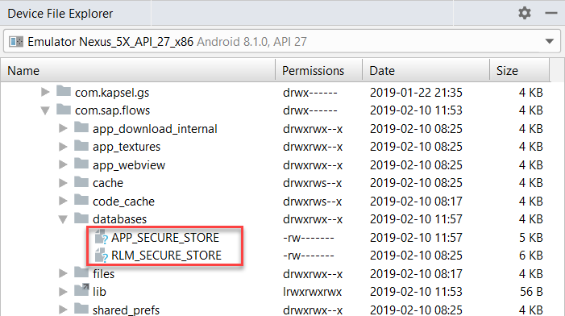
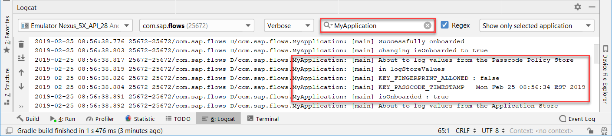
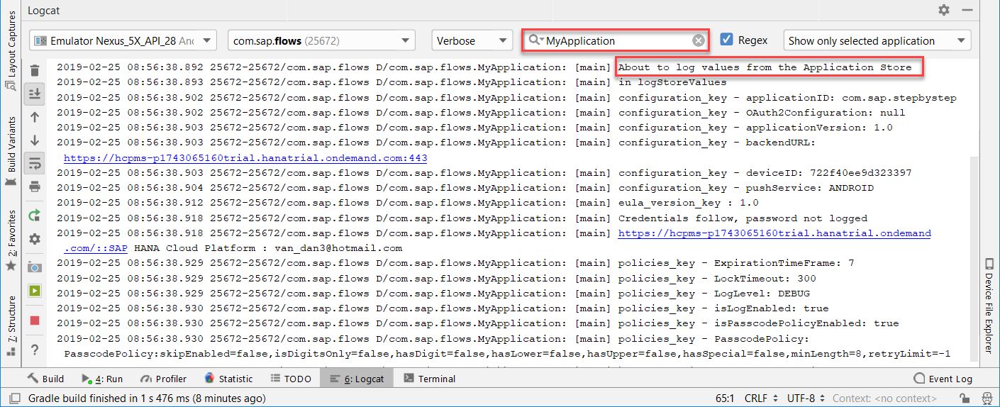

## Prerequisites
 - Completed the previous tutorial in this mission which added code to onboard

## Details
### You will learn
  - How to read and update values in the secure stores

There are two stores that are created during the onboarding process. The passcode policy store (`RLM_SECURE_STORE` where `RLM` stands for retry limit) contains items that need to be accessed before the application store is unlocked using the user provided passcode or fingerprint. An example of this is the number of times the user is able to provide an incorrect passcode in a row.

The `APP_SECURE_STORE` is unlocked via the user's passcode and contains authentication credentials and configuration data such as the mobile service's server host, port, and the app's EULA version.

---

[ACCORDION-BEGIN [Step 1: ](Add code to access the secure stores)]

Create a new class named **`StoreHelper`** by right-clicking on the package **`com.sap.flows`** and choosing **New > Java Class**.

Replace the generated code with following code.

```Java
package com.sap.flows;

import android.content.Context;

import com.sap.cloud.mobile.flow.onboarding.ClientPolicy;
import com.sap.cloud.mobile.flow.onboarding.OnboardingParameters;
import com.sap.cloud.mobile.flow.onboarding.SecureStore;
import com.sap.cloud.mobile.flow.onboarding.SecureStoreException;
import com.sap.cloud.mobile.flow.onboarding.storemanager.PasscodePolicyStoreStep;
import com.sap.cloud.mobile.flow.onboarding.storemanager.StoreManagerStep;
import com.sap.cloud.mobile.foundation.common.EncryptionError;
import com.sap.cloud.mobile.foundation.common.EncryptionUtil;
import com.sap.cloud.mobile.foundation.common.SettingsParameters;
import com.sap.cloud.mobile.foundation.securestore.FileMissingException;
import com.sap.cloud.mobile.foundation.securestore.OpenFailureException;
import com.sap.cloud.mobile.foundation.securestore.SecureKeyValueStore;
import com.sap.cloud.mobile.onboarding.passcode.PasscodePolicy;

import java.net.MalformedURLException;
import java.util.Date;
import java.util.GregorianCalendar;

import org.slf4j.Logger;
import org.slf4j.LoggerFactory;

public class StoreHelper {
    private static final String IS_ONBOARDED_KEY = "isOnboarded";
    private static final String EULA_VERSION = "EULA_VERSION";

    private static SecureKeyValueStore policyStore = null;
    private static SecureKeyValueStore authStore = null;

    private static Logger LOGGER = LoggerFactory.getLogger(MyApplication.class);

    private static void policyStoreNullCheck(Context context) {
        if (policyStore == null) {
            policyStore = new SecureKeyValueStore(context, PasscodePolicyStoreStep.DATABASE);
        }
    }

    private static void authStoreNullCheck(Context context) {
        if (authStore == null) {
            authStore = new SecureKeyValueStore(context, StoreManagerStep.DATABASE);
        }
    }

    private static void policyStoreOpenCheck() throws EncryptionError, OpenFailureException {
        if (!policyStore.isOpen()) {
            policyStore.open(EncryptionUtil.getEncryptionKey(PasscodePolicyStoreStep.ALIAS));
        }
    }

    private static void authStoreOpenCheck() throws EncryptionError, OpenFailureException {
        if (!authStore.isOpen()) {
            authStore.open(EncryptionUtil.getEncryptionKey(StoreManagerStep.ALIAS));
        }
    }

    public static void reset() {
        if (policyStore != null) {
            policyStore.close();
            policyStore = null;
        }
    }

    public static void setIsOnboarded(Context context, boolean isOnboarded) {
        // places the isOnboarded variable into the policy store
        try {
            policyStoreNullCheck(context);
            policyStoreOpenCheck();
            policyStore.put(IS_ONBOARDED_KEY, isOnboarded);
        } catch (EncryptionError encryptionError) {
            encryptionError.printStackTrace();
        } catch (OpenFailureException e) {
            e.printStackTrace();
        }
    }

    public static boolean isOnboarded(Context context) {
        // grabs isOnboarded variable from the policy store if possible and stores it in onboardFinished
        Boolean onboardFinished = false;
        try {
            policyStoreNullCheck(context);
            policyStoreOpenCheck();
            onboardFinished = policyStore.getBoolean(IS_ONBOARDED_KEY);
            LOGGER.debug("isOnboarded value = " + onboardFinished);
        } catch (EncryptionError encryptionError) {
            encryptionError.printStackTrace();
        } catch (OpenFailureException e) {
            e.printStackTrace();
        }
        return onboardFinished != null ? onboardFinished : false;
    }

    public static void logStoreValues(SecureStore store) {
        LOGGER.debug("in logStoreValues");
        try {
            String[] keys = store.keys();
            for (String key : keys) {
                if (store.get(key).getClass() == OnboardingParameters.class) {
                    OnboardingParameters onboardingParameters = (OnboardingParameters)store.get(key);
                    try {
                        onboardingParameters.build();
                        SettingsParameters settingsParameters = onboardingParameters.getSettingsParameters();
                        // logs values from configuration_key
                        LOGGER.debug(key + " - applicationID: " + onboardingParameters.getApplicationId());
                        LOGGER.debug(key + " - OAuth2Configuration: " + onboardingParameters.getOAuth2Configuration());
                        LOGGER.debug(key + " - applicationVersion: " + settingsParameters.getApplicationVersion());
                        LOGGER.debug(key + " - backendURL: " + settingsParameters.getBackendUrl());
                        LOGGER.debug(key + " - deviceID: " + settingsParameters.getDeviceId());
                        LOGGER.debug(key + " - pushService: " + settingsParameters.getPushService());
                    }
                    catch (MalformedURLException e) {
                        LOGGER.debug("Unable to build the settings parameters. " + e.getMessage());
                    }
                } else if (store.get(key).getClass() == ClientPolicy.class) {
                    // grabs values belonging to policies_key
                    ClientPolicy clientPolicy = ((ClientPolicy)store.get("policies_key"));
                    PasscodePolicy passcodePolicy = clientPolicy.getPasscodePolicy();
                    LOGGER.debug(key + " - ExpirationTimeFrame: " + clientPolicy.getExpirationTimeFrame());
                    LOGGER.debug(key + " - LockTimeout: " + clientPolicy.getLockTimeout());
                    LOGGER.debug(key + " - LogLevel: " + clientPolicy.getLogLevel());
                    LOGGER.debug(key + " - isLogEnabled: " + clientPolicy.isLogEnabled());
                    LOGGER.debug(key + " - isPasscodePolicyEnabled: " + clientPolicy.isPasscodePolicyEnabled());
                    if (passcodePolicy != null) {
                        LOGGER.debug(key + " - PasscodePolicy: " + passcodePolicy.toString());
                    }
                } else if (key.contains("https://")) {
                    // gets credentials
                    String[] link = store.get(key);
                    LOGGER.debug("Credentials follow, password not logged");
                    LOGGER.debug(key + " : " + link[0]);
                } else if (key.equals("KEY_PASSCODE_TIMESTAMP")) {
                    // converts date objects to readable format
                    Date date = new Date(((GregorianCalendar)store.get("KEY_PASSCODE_TIMESTAMP")).getTimeInMillis());
                    LOGGER.debug(key + " - " + date.toString());
                }
                else {
                    LOGGER.debug(key + " : " + store.get(key));
                }
            }
        } catch (SecureStoreException sse) {
            LOGGER.debug("Secure Store Exception: " + sse.getMessage());
        } catch (FileMissingException fme) {
            LOGGER.debug("Store does not exist.  "  + fme.getMessage());
        }
    }
}
```

Add the following variable to the top of the **`MainActivity`** class.

```Java
private boolean isOnboarded;
```

Add the following code segment to the **`onCreate`** method in **`MainActivity.java`** after initializing the logging.

```Java
// grab the isOnboarded value from the StoreHelper/policies store
isOnboarded = StoreHelper.isOnboarded(getApplication());
LOGGER.debug("onCreate: isOnboarded = " + isOnboarded);
```

The `isOnboarded` variable becomes important in the next section in determining whether the restore flow should be taken.

Add the following code to the **`startOnboardingFlow`** method in the **`onSuccess`** callback after line `setContentView(...);`.

```Java
// save the onboarded status
LOGGER.debug("changing isOnboarded to true");
StoreHelper.setIsOnboarded(getApplicationContext(), true);

// log values from the stores
LOGGER.debug("About to log values from the Passcode Policy Store");
StoreHelper.logStoreValues(((OnboardingContext) result).getPasscodePolicyStore());
LOGGER.debug("About to log values from the Application Store");
StoreHelper.logStoreValues(((OnboardingContext) result).getApplicationStore());
```

[DONE]
[ACCORDION-END]

[ACCORDION-BEGIN [Step 2: ](Try it out)]

Uninstall and reinstall the app.

Code to support the restore flow will be added in the next part.

Onboard the app.

The stores can be seen using the explorer at **data > data > `com.sap.flows` > databases**.



By using the `logStoreValues` method defined in the `StoreHelper`, the values in the stores can be displayed. The values stored in the Passcode Policy store are shown below. The `isOnboarded` Boolean was created in the `MainActivity` class and is an example of how variables can be written into the stores.



The `KEY_REMAINING_ATTEMPTS=10` value will appear following a successful restore flow.

The values stored in the Application Store are shown below.



Further information about the secure store feature can found at [Secure Store](https://help.sap.com/doc/c2d571df73104f72b9f1b73e06c5609a/Latest/en-US/docs/user-guide/foundation/SecureStore.html).

Congratulations!  You now have a better understanding of the secure stores created by the onboard flow.

[VALIDATE_1]
[ACCORDION-END]


---
