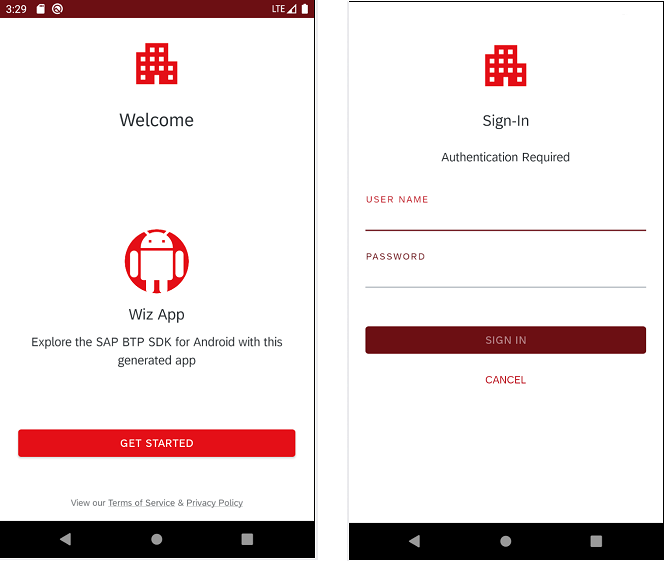

# Customize the Styles and Themes
<!-- description --> Learn how to customize the styles and themes for the UI screens in Flows component of SAP BTP SDK for Android.

## Prerequisites
- You have [Set Up a BTP Account for Tutorials](group.btp-setup). Follow the instructions to get an account, and then to set up entitlements and service instances for the following BTP services.
    - **SAP Mobile Services**
- You completed [Get Familiar with the Flows Component by a Wizard Generated Application](cp-sdk-android-flows-wizard).

## You will learn
  - How to customize the look and feel for the UI screens of Flows component

## Intro
An enterprise mobile application usually has its own branding theme, and therefore requires the onboarding screens inside the Flows components to have the same look and feel as the other business screens in the app. SAP BTP SDK for Android version 3.4 provides the enhancement for customizing themes and styles for onboarding UI screens. With this enhancement, it's easier for client code to do following customizations:

- Define the logo image, as well as its height and width.
- Customize the styles for text input fields.
- Customize the text styles.
- Customize the button styles.
- Customize the theme colors.

---

### Examine the UI styles in a wizard-generated application


1.  Open the project you previously created using the SAP BTP SDK Wizard for Android.

2.  Press **`Shift`** twice and type **`styles.xml`** to open the `styles.xml` file. The default themes and styles for the wizard-generated app are defined in this file.

3.  Press **`Shift`** twice and type **`colors.xml`** to open the `colors.xml` file. The default colors for the wizard-generated app are defined in this file.


### Define your own styles


1.  Define your logo. To change the logo image at the top of each onboarding screen , define the following style in the `styles.xml` file.

    ```XML
    <style name="OnboardingLogo">
        <!-- The value is always @drawable/<your_logo_name_without_ext> -->
        <!-- Do not add the file extension e.g. .png -->
        <item name="android:src">@drawable/custom_logo</item>
        <item name="android:layout_height">72dp</item>
        <item name="android:layout_width">72dp</item>
    </style>
    ```
2.  Define styles for flat and raised button. Both raised and flat button styles can be customized by specifying **`onboarding_button_flat_ref`** and **`onboarding_button_raised_ref`**. And the client code can also define the button background color and text color for different states.

    ```XML
    <!-- onboarding flat button -->
    <item name="onboarding_button_flat_ref">@style/Widget.Onboarding.Button.Borderless</item>
    <item name="onboarding_button_flat_text">@color/sap_ui_flat_button_text_color</item>
    <item name="onboarding_button_flat_text_disabled">
        @color/onboarding_button_flat_text_disabled
    </item>
    <item name="onboarding_button_flat_background">
        @color/onboarding_button_flat_background
    </item>

    <!-- onboarding raised button -->
    <item name="onboarding_button_raised_ref">@style/Widget.Onboarding.Button.Borderless</item>
    <item name="onboarding_button_raised_background_pressed">@color/onboarding_button_raised_background_pressed</item>
    <item name="onboarding_button_raised_background_disabled">@color/onboarding_button_raised_background_disabled</item>
    <item name="onboarding_button_raised_background">@color/onboarding_button_raised_background</item>
    ```

3.  Define styles for text input fields. The onboarding screens use the Fiori UI component **`SimplePropertyFormCell`** for the text input fields. Client code can customize the style and text color for the component.

    ```XML
    <!-- SimplePropertyFormCell -->
    <item name="onboarding_simple_property_focused_ref">
        @style/Onboarding.SimplePropertyFormCell.Focused
    </item>
    <item name="onboarding_simple_property_focused_text_color">@color/onboarding_formcell_text</item>
    <item name="onboarding_simple_property_unfocused_ref">
        @style/Onboarding.SimplePropertyFormCell.Unfocused
    </item>
    <item name="onboarding_simple_property_unfocused_text_color">@color/onboarding_base_text</item>
    ```

    Besides the above theme attributes, client code can customize the active border for **`SimplePropertyFormCell`** in the `colors.xml` file.

    ```XML
    <!-- SimplePropertyFormCell active value border -->
    <color name="sap_ui_field_active_border_color">@color/onboarding_active_border</color>
    ```

4.  Define the theme. Put all the customized styles in a theme extended from the parent theme **`FioriTheme.Onboarding`**, so the client code can only provide the customized styles and simply use the default style in **`FioriTheme.Onboarding`** for the others.

    ```XML
    <!-- styles.xml -->
    <style name="AppTheme" parent="FioriTheme.Onboarding">

        <!-- Customize your theme here. -->
        <item name="colorPrimary">@color/colorPrimary</item>
        <item name="colorPrimaryDark">@color/colorPrimaryDark</item>
        <item name="colorAccent">@color/colorAccent</item>

        <!-- Sign In screen avatar background -->
        <item name="onboarding_avatar_background">@color/colorPrimary</item>
        <!-- If commented out, the default value in the 'onboarding' theme will be used.
        <item name="onboarding_avatar_text_color">@color/onboarding_avatar_text_color</item>
        -->

        <!-- onboarding raised button -->
        <item name="onboarding_button_raised_background_pressed">@color/colorPrimary</item>
        <item name="onboarding_button_raised_background_disabled">@color/colorPrimaryDark</item>
        <item name="onboarding_button_raised_background">@color/colorPrimary</item>

        <!-- onboarding flat button -->
        <item name="onboarding_button_flat_text">@color/colorAccent</item>
        <item name="onboarding_button_flat_text_disabled">@color/colorPrimaryDark</item>
        <item name="onboarding_button_flat_background">@color/onboarding_default_background</item>

        <!-- SimplePropertyFormCell -->
        <item name="onboarding_simple_property_focused_text_color">@color/colorAccent</item>
        <item name="onboarding_simple_property_unfocused_text_color">@color/colorPrimaryDark</item>
    </style>

    <style name="OnboardingLogo">
        <!-- The value is always @drawable/<your_logo_name_without_ext> -->
        <!-- Do not add the file extension e.g. .png -->
        <item name="android:src">@drawable/custom_logo</item>
        <item name="android:layout_height">72dp</item>
        <item name="android:layout_width">72dp</item>
    </style>
    ```

    Define the colors in `colors.xml` file.

    ```XML
    <!-- colors.xml -->
    <!-- Primary colors -->
    <color name="colorPrimary">@color/colorPrimaryRed</color>
    <color name="colorPrimaryDark">@color/colorPrimaryDarkRed</color>
    <color name="colorAccent">@color/colorAccentRed</color>

    <!-- Red Theme -->
    <color name="colorPrimaryRed">#d12920</color>
    <color name="colorPrimaryDarkRed">#631216</color>
    <color name="colorAccentRed">#ab1d22</color>

    <!-- SimplePropertyFormCell active value border -->
    <color name="sap_ui_field_active_border_color">@color/colorPrimaryDark</color>
    ```


### Integrate with the Flows component


[OPTION BEGIN [Java]]

1.  To notify the customized theme to the Flows component, create a **`FlowOptions`** instance that overrides the **`getApplicationTheme`** function to return the theme ID and set this **`FlowOptions`** instance for the **`FlowContext`** instance to start the flow.

    ```Java
    FlowContext flowContext = new FlowContextBuilder()
                .setApplication(appConfig)
                .setFlowOptions(new FlowOptions(){
                    @Override
                    public boolean getApplicationTheme() {
                        return R.style.AppTheme;
                    }
                }).build();
    Flow.Companion.start(context, flowContext, (code, result, data) -> {
        if(result == RESULT_OK) {
            startMainBusinessActivity();
        }
        return null;
    });
    ```

2.  After applying the customized theme and style, the look and feel of the wizard-generated app are changed accordingly.

    <!-- border -->

[OPTION END]

[OPTION BEGIN [Kotlin]]

1.  To notify the customized theme to the Flows component, set the theme ID as the value of **`appTheme`** parameter for the **`FlowOptions`** instance and set this **`FlowOptions`** instance for the **`FlowContext`** instance to start the flow.

    ```Kotlin
    val flowContext = FlowContext(
        appConfig = AppConfig.Builder().applicationId("app_id").build(),
        flowOptions = FlowOptions(
            appTheme = R.style.AppTheme
        )
    )
    Flow.start(this@WelcomeActivity, flowContext) { requestCode, resultCode, _ ->
        if (resultCode == Activity.RESULT_OK) {
            startMainBusinessActivity()
        }
    }
    ```

2.  After applying the customized theme and style, the look and feel of the wizard-generated app are changed accordingly.

    <!-- border -->

[OPTION END]


### Customize the UI screens without the predefined flows


Client code may use its own screens in onboarding process or implement customized flows instead of predefined flows, and want to apply themes to the activities or the fragments.

[OPTION BEGIN [Java]]

1.  To customize an activity, client code must define the theme in the AndroidManifest.xml file.

    ```XML
    <!-- AndroidManifest.xml -->
    <activity
        android:name=".WelcomeActivity"
        android:theme="@style/AppTheme.NoActionBar">
        <intent-filter>
            <action android:name="android.intent.action.MAIN" />
            <category android:name="android.intent.category.LAUNCHER" />
        </intent-filter>
    </activity>

    <!-- styles.xml -->
    <style name="AppTheme.NoActionBar" parent="AppTheme">
    ...
    </style>
    ```

2.  To customize a fragment, such as a `FlowStepFragment` for a customized flow, use the following code in the `onCreateView` method of the fragment.

    ```Java
    public View onCreateView(@NonNull LayoutInflater inflater, @Nullable ViewGroup container,
            @Nullable Bundle savedInstanceState) {
        ContextThemeWrapper themeWrapper = new ContextThemeWrapper(getActivity(), R.style.AppTheme);
        CustomStepFragmentBinding binding = CustomStepFragmentBinding.inflate(inflater.cloneInContext(themeWrapper), container, false);
        return binding.getRoot();
    }
    ```

[OPTION END]

[OPTION BEGIN [Kotlin]]

1.  To customize an activity, client code must define the theme in the AndroidManifest.xml file.

    ```XML
    <!-- AndroidManifest.xml -->
    <activity
        android:name=".WelcomeActivity"
        android:theme="@style/AppTheme.NoActionBar">
        <intent-filter>
            <action android:name="android.intent.action.MAIN" />
            <category android:name="android.intent.category.LAUNCHER" />
        </intent-filter>
    </activity>

    <!-- styles.xml -->
    <style name="AppTheme.NoActionBar" parent="AppTheme">
    ...
    </style>
    ```

2.  To customize a fragment, such as a `FlowStepFragment` for a customized flow, use the following code in the `onCreateView` method of the fragment.

    ```Kotlin
    override fun onCreateView(
        inflater: LayoutInflater, container: ViewGroup?,
        savedInstanceState: Bundle?
    ): View {
        val themeWrapper = ContextThemeWrapper(
                activity,
                R.style.AppTheme
            )
        val binding = CustomStepFragmentBinding.inflate(layoutInflater.cloneInContext(themeWrapper), container, false)
        return binding.root
    }
    ```

[OPTION END]

>Please see [Flows Theme and Style](https://help.sap.com/doc/f53c64b93e5140918d676b927a3cd65b/Cloud/en-US/docs-en/guides/features/onboarding/android/newflows/FlowStyles.html) for more information on UI customization.

Congratulations! You now have learned how to customize the styles and themes for the UI screens of Flows component!


---
