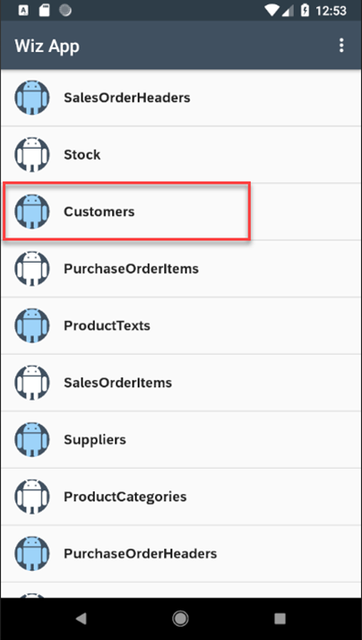
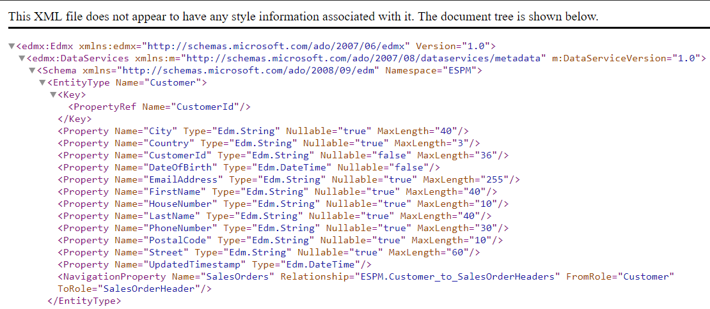
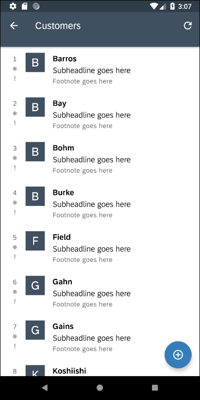
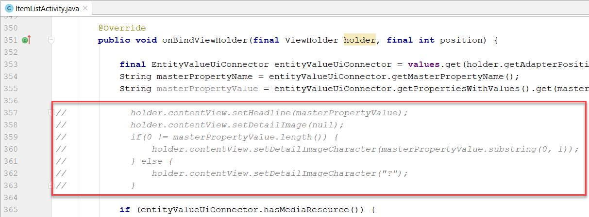
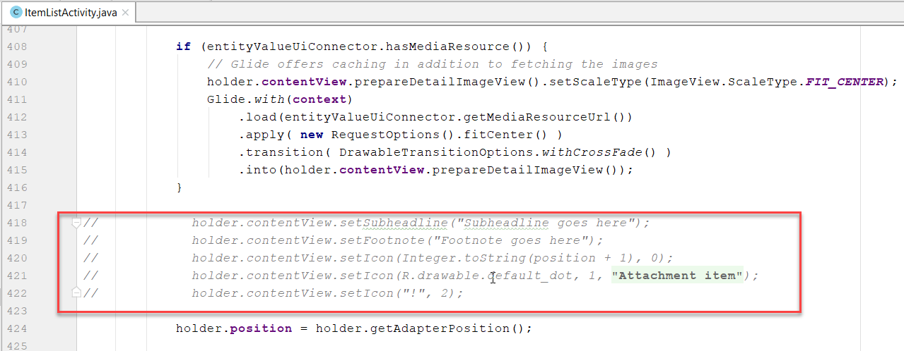
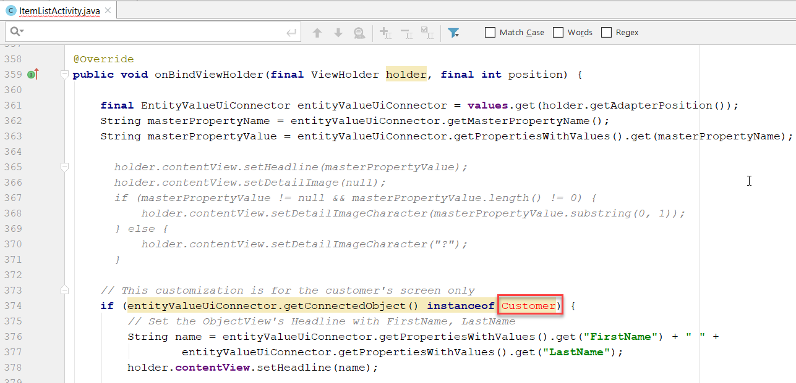
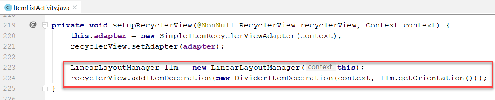

## Details
### You will learn  
- How to customize the values displayed in a Fiori for Android Object Cell

---

[ACCORDION-BEGIN [Step 1: ](Change master property for customer's screen)]
Run the previously created project.

Tap on the **Customers** entity.




Notice that it displays the customer's city rather than the customer's name.


This is because the app was generated from the OData service's metadata, which does not indicate which of the many fields from the customer entity to display.  To create a sample user interface the SDK wizard uses the first property found as the value to display.  To view the complete metadata document, open the file `com_sap_edm_sampleservice_v2.xml` in the res > raw folder in the generated project.




In Android Studio, on Windows press **`Ctrl+N`** or on a Mac press **`command+O`** and return **`CustomersUiConnector`** to open the `CustomersUiConnector.java` file.

Change the value from **`City`** to **`LastName`** for the variable **`masterPropertyName`**.


Run the app and notice that the Customers screen now displays the customer's last name.




Each customer is displayed in an <a target="_blank" href="https://help.sap.com/doc/c2d571df73104f72b9f1b73e06c5609a/Latest/en-US/docs/fioriui/object_cell.html">Object Cell</a>, which is one of the Fiori UI for Android controls.


As seen above, an Object Cell can display more than one field.  In the next two sections, the app will be modified to display different content in the Object Cells and a separator decoration will be added between rows.

[VALIDATE_1]
[ACCORDION-END]

[ACCORDION-BEGIN [Step 2: ](Display name, address, and image)]

In Android Studio, on Windows press **`Ctrl+N`** or on a Mac press **`command+O`** and return **`ItemListActivity`** to open the `ItemListActivity.java` file.


On Windows press **`Ctrl+F12`** or on a Mac press **`command+F12`** and return **`onBindViewHolder`** to move to the `onBindViewHolder` method.


**Comment out (select and press `Ctrl / or Command /`)** the following lines of code which set the `ObjectCell's` headline, and detail image.




Below the commented lines, add the following code.

```Java
// This customization is for the customer's screen only
if (entityValueUiConnector.getConnectedObject() instanceof Customer) {
    // Set the ObjectCell's Headline with FirstName, LastName
    String name = entityValueUiConnector.getPropertiesWithValues().get("FirstName") + " " +
            entityValueUiConnector.getPropertiesWithValues().get("LastName");
    holder.contentView.setHeadline(name);

    // Set the ObjectCell's SubHeadline with address
    String country = entityValueUiConnector.getPropertiesWithValues().get("Country");
    String address = entityValueUiConnector.getPropertiesWithValues().get("HouseNumber");
    address = address + " " + entityValueUiConnector.getPropertiesWithValues().get("Street");
    address = address + " " + entityValueUiConnector.getPropertiesWithValues().get("City");
    holder.contentView.setSubheadline(address);

    // Set the Status to be the country code
    holder.contentView.setStatus(country, 1);

    // Use a different image
    Drawable drawable = ContextCompat.getDrawable(getApplicationContext(), R.drawable.ic_account_circle_black_24dp);
    holder.contentView.setDetailImage(drawable);

    // Set the ObjectCell to only show 2 lines per row instead of 3
    holder.contentView.setLines(2);
}
else {
    holder.contentView.setHeadline(masterPropertyValue);
    holder.contentView.setDetailImage(null);
    if(0 != masterPropertyValue.length()) {
        holder.contentView.setDetailImageCharacter(masterPropertyValue.substring(0, 1));
    } else {
        holder.contentView.setDetailImageCharacter("?");
    }

    holder.contentView.setSubheadline("Subheadline goes here");
    holder.contentView.setFootnote("Footnote goes here");
    holder.contentView.setIcon(Integer.toString(position + 1), 0);
    holder.contentView.setIcon(R.drawable.default_dot, 1, R.string.attachment_item_content_desc);
    holder.contentView.setIcon("!", 2);
}
```

Below the just pasted code, comment out (select and press Ctrl /) the lines that set the **`Subheadline`**, **`Footnote`** and **`Icon`** as that is now conditionally handled in the previously added code.




Notice that two of the classes, `Customer` and `Drawable` cannot be resolved and are shown in red.  




Select each class and on Windows press **`Alt+Enter`** or on a Mac press **`option+return`** to make use of Android Studio quick fix to add the missing imports.  If prompted with multiple options, select `Import Class`.


Run the app and notice the Customer's screen has been improved.


[VALIDATE_2]
[ACCORDION-END]

[ACCORDION-BEGIN [Step 3: ](Add a divider)]

We can continue to enhance the Customer view by adding a divider between Object Cells in the Recycler View.

On Windows press **`Ctrl+F12`** or on a Mac press **`command+F12`** and return **`setupRecyclerView`** to move to the `setupRecyclerView` method.

Add the below lines:

```Java
LinearLayoutManager llm = new LinearLayoutManager(this);
recyclerView.addItemDecoration(new DividerItemDecoration(context, llm.getOrientation()));
```




Notice that two of the classes, `LinearLayoutManager` and `DividerItemDecoration` cannot be resolved.  Select each class and on Windows press **`Alt+Enter`** or on a Mac press **`option+return`** to make use of Android Studio quick fix to add the missing imports.

Run the app and notice that each row in the Recycler View has a divider.


>Further information on Fiori for Android can be found at <a target="_blank" href="https://help.sap.com/doc/c2d571df73104f72b9f1b73e06c5609a/Latest/en-US/docs/fioriui/fiori_ui_overview.html">Fiori UI Overview</a>, <a target="_blank" href="https://experience.sap.com/fiori-design-android/object-cell/">Fiori Android Design Guidelines</a> and <a target="_blank" href="https://github.com/SAP/cloud-sdk-android-fiori-ui-components">Fiori UI Demo Application</a>.

Congratulations! You have customized the display of a Fiori for Android Object Cell.

[DONE]
[ACCORDION-END]
---
