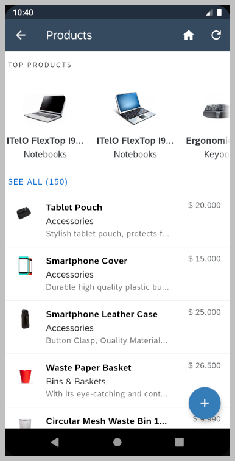
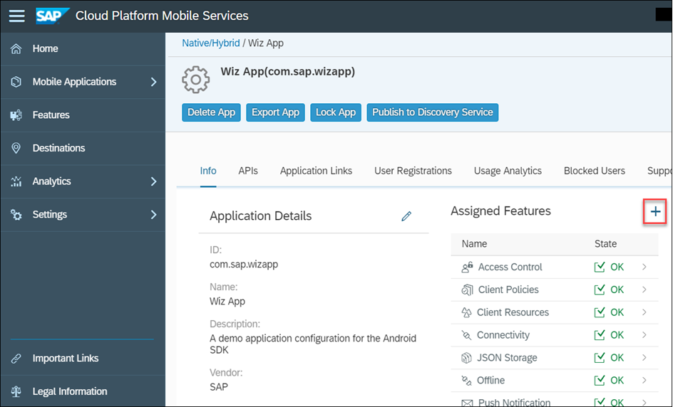
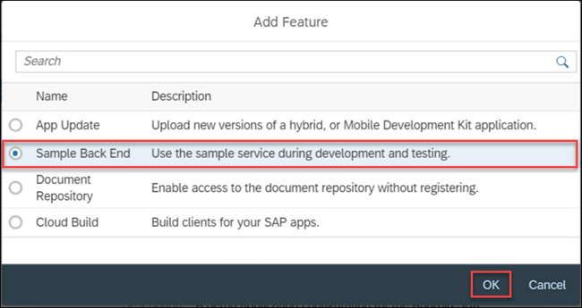
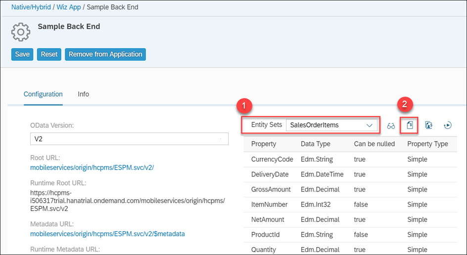

## Prerequisites  
- Completed [Try Out SAP Cloud Platform SDK for Android Wizard](https://developers.sap.com/tutorials/cp-sdk-android-wizard-app.html)


## Details
### You will learn
- How to customize the values displayed in an object cell
- How to modify the navigation between screens
- How to change menu options
- How to add a Fiori search UI enabling the filtering of object cells on a list screen
- How to add a collection view showing the top products
---

[ACCORDION-BEGIN [Step 1: ](Examine the product's list screen)]

Run the previously created project.

Tap on the **Products** entity.


Notice that it displays the category name rather than the product name.


The category name is displayed (rather than the product name) because the app was generated from the OData service's metadata which does not indicate which of the many fields from the product entity to display.  When creating the sample user interface, the SDK wizard uses the first property found as the value to display.  To view the complete metadata document, open the file **`res/raw/com_sap_edm_sampleservice_v2.xml`**.


Each product is displayed in an [object cell](https://help.sap.com/doc/c2d571df73104f72b9f1b73e06c5609a/Latest/en-US/docs/fioriui/object_cell.html), which is one of the Fiori UI for Android controls.


As seen above, an object cell is used to display information about an entity.

[DONE]
[ACCORDION-END]


[ACCORDION-BEGIN [Step 2: ](Update the product's list screen)]
In this section, the object cell will be configured to show a product's name, category, description and price.  As well, a separator decoration will be added between cells, and the sort order will be modified.

In Android Studio, on Windows press **`Ctrl+N`** or on a Mac press **`command+O`** and type **`ProductsListActivity`** to open `ProductsListActivity.java`.


On Windows press **`Ctrl+F12`** or on a Mac press **`command+F12`** and type **`populateObjectCell`** to move to the `populateObjectCell` method.

 Change the parameter in **`getDataValue`** from **`Product.category`** to **`Product.name`**.  This will cause the product name to be shown as the headline value of the object cell.

```Java
DataValue dataValue = productEntity.getDataValue(Product.name);
```

At the end of the `populateObjectCell` method, find the below lines that set the `subheadline`, `footnote` and `icon`.

```
objectCell.setSubheadline("Subheadline goes here");
objectCell.setFootnote("Fottnote goes here");

if (masterPropertyValue == null || masterPropertyValue.isEmpty()) {
    objectCell.setIcon("?", 0);
} else {
    objectCell.setIcon(masterPropertyValue.substring(0,1), 0);
}
objectCell.setIcon(R.drawable.default_dot, 1, R.string.attachment_item_content_desc);
objectCell.setIcon("!", 2);
```

Replace them with the code below which will display category, description, and price.
```Java
dataValue = productEntity.getDataValue(Product.category);
if (dataValue != null) {
    objectCell.setSubheadline(dataValue.toString());
}
dataValue = productEntity.getDataValue(Product.shortDescription);
if (dataValue != null) {
    objectCell.setFootnote(dataValue.toString());
}

dataValue = productEntity.getDataValue(Product.price);
if (dataValue != null) {
    objectCell.setStatusWidth(200);
    objectCell.setStatus("$ " + dataValue.toString(), 1);
}
```

On Windows press **`Ctrl+F12`** or on a Mac press **`command+F12`** and type **`setupRecyclerView`** to move to the `setupRecyclerView` method.

After the `if (recyclerView == null)` line, paste the following code that adds a divider between product items.

```Java
LinearLayoutManager llm = new LinearLayoutManager(this);
DividerItemDecoration dividerItemDecoration = new DividerItemDecoration(recyclerView.getContext(), llm.getOrientation());
recyclerView.addItemDecoration(dividerItemDecoration);
recyclerView.setLayoutManager(llm);
```

If classes `LinearLayoutManager` and `DividerItemDecoration` appear red, this indicates that Android Studio could not locate the classes.  Select each class and on Windows press **`Alt+Enter`** or on a Mac press **`option+return`** to make use of Android Studio quick fix to add the missing imports.  

An alternate option is to enable the below setting.


On Windows press **`Ctrl+N`** or on a Mac press **`command+O`** and type **`Repository`** to open `Repository.java`.

On Windows press **`Ctrl+F12`** or on a Mac press **`command+F12`** and type **`initialRead`** to move to the `initialRead` method.

Below the line that calls the **`orderBy`** method of **`dataQuery`**, add the following to specify the sort order to be by category and then by name for products.

```Java
if (entitySet.getEntityType() == ESPMContainerMetadata.EntityTypes.product) {
    dataQuery.thenBy(Product.name, SortOrder.ASCENDING);
}
```

After the change the code should appear as shown below.

```
if (orderByProperty != null) {
    dataQuery = dataQuery.orderBy(orderByProperty, SortOrder.ASCENDING);
    if (entitySet.getEntityType() == ESPMContainerMetadata.EntityTypes.product) {
        dataQuery.thenBy(Product.name, SortOrder.ASCENDING);
    }
}
```

Run the app and notice the products screen has been formatted to show the product's name, category, description, price and the entries are now sorted by category and then name.


[VALIDATE_2]
[ACCORDION-END]


[ACCORDION-BEGIN [Step 3: ](Customize the `ProductCategories` list screen)]

Examine the **`ProductCategories`** screen.


In this section the screen's title will be updated, the object cell will be configured to show the category name, main category name, the number of products in a category and a separator decoration will be added between cells.

Press **Shift** twice and type **`strings.xml`** to open `res/values/stings.xml`

Add the following entry.

```XML
<string name="product_categories_title">Product Categories</string>
```

On Windows press **`Ctrl+N`** or on a Mac press **`command+O`** and type **`ProductCategoriesListActivity`** to open `ProductCategoriesListActivity.java`.

On Windows press **`Ctrl+F12`** or on a Mac press **`command+F12`** and type **`onCreate`** to move to the `onCreate` method.

Add the following line after toolbar has been initialized which will set the screen's title.

```Java
toolbar.setTitle(getResources().getString(R.string.product_categories_title));
```

On Windows press **`Ctrl+F12`** or on a Mac press **`command+F12`** and type **`populateObjectCell`** to move to the `populateObjectCell` method.


At the end of the method, find the below lines that set the `subheadline`, `footnote` and `icon`.

```
objectCell.setSubheadline("Subheadline goes here");
objectCell.setFootnote("Footnote goes here");
if (masterPropertyValue == null || masterPropertyValue.isEmpty()) {
    objectCell.setIcon("?", 0);
} else {
    objectCell.setIcon(masterPropertyValue.substring(0,1), 0);
}
objectCell.setIcon(R.drawable.default_dot, 1, R.string.attachment_item_content_desc);
objectCell.setIcon("!", 2);
```

Replace them to instead display main category, hide the footnote and show the number of products per category.

```Java
dataValue = productCategoryEntity.getDataValue(ProductCategory.mainCategoryName);
if (dataValue != null) {
    objectCell.setSubheadline(dataValue.toString());
}

objectCell.setLines(2);  //Not using footnote

dataValue = productCategoryEntity.getDataValue(ProductCategory.numberOfProducts);
if (dataValue != null) {
    objectCell.setStatusWidth(220);
    objectCell.setStatus(dataValue.toString() + " Products", 1);
}
```

On Windows press **`Ctrl+F12`** or on a Mac press **`command+F12`** and type **`setupRecyclerView`** to move to the `setupRecyclerView` method.

After the `if (recyclerView == null)` line, paste the following code that adds a divider between categories.

```Java
LinearLayoutManager llm = new LinearLayoutManager(this);
DividerItemDecoration dividerItemDecoration = new DividerItemDecoration(recyclerView.getContext(), llm.getOrientation());
recyclerView.addItemDecoration(dividerItemDecoration);
recyclerView.setLayoutManager(llm);
```

Run the app again and notice the title, `subheadline`, and `status` are now used and the `icons` and `footnote` are no longer shown.


[DONE]
[ACCORDION-END]

[ACCORDION-BEGIN [Step 4: ](Customize the navigation)]

In this section, the app will be modified to initially show the Product Categories screen when opened.  Selecting a category will navigate to a Products list screen for the selected category.  The floating action button on the Categories screen will be removed.

On Windows press **`Ctrl+N`** or on a Mac press **`command+O`** and type **`LogonActivity`** to open `LogonActivity.java`.

On Windows press **`Ctrl+F12`** or on a Mac press **`command+F12`** and type **`startEntitySetListActivity`** to move to the `startEntitySetListActivity` method.

Add the following line below the other Intent declaration.

```Java
Intent pcIntent = new Intent(LogonActivity.this, ProductCategoriesListActivity.class);
```

After the call to `startActivityForResult`, add the below line.

```Java
startActivity(pcIntent);
```

This will cause the Product Category screen to be the first screen seen when opening the app but as the Entity List screen is opened first, it can be navigated to by pressing the up or back button.  The `EntityList` screen contains the settings menu so to simply things, this screen is still displayed.

On Windows press **`Ctrl+N`** or on a Mac press **`command+O`** and type **`ProductCategoriesListActivity`** to open `ProductCategoriesListActivity.java`.

On Windows press **`Ctrl+F12`** or on a Mac press **`command+F12`** and type **`onCreate`** to move to the `onCreate` method.

Find the below code.

```
if (navigationPropertyName != null && parentEntityData != null) {
    FloatingActionButton fab = findViewById(R.id.fab);
    fab.hide();
} else {
    createFloatingButton();
}
```

Replace it with the following code.

```Java
FloatingActionButton fab = findViewById(R.id.fab);
fab.hide();
```

On Windows press **`Ctrl+F12`** or on a Mac press **`command+F12`** and type **`onCreateOptionsMenu`** to move to the `onCreateOptionsMenu` method.

Add the following line below the `inflater.inflate` call which will remove the home menu from the Product Categories screen which is now the home screen of the app.

```Java
menu.removeItem(R.id.menu_home);
```

On Windows press **`Ctrl+F12`** or on a Mac press **`command+F12`** and type **`showDetailActivity`** to move to the `showDetailActivity` method.

Select the body of the method and comment it out by pressing on Windows **`Ctrl+/`** or on a Mac **`command+/`**.

On Windows press **`Ctrl+F12`** or on a Mac press **`command+F12`** and type **`setOnClickListener`** to move to the `setOnClickListener` method.

Replace the code with following which will enable the navigation from the Category list screen to the Product list screen.

```Java
holder.view.setOnClickListener(view -> {
    Intent productsIntent = new Intent(ProductCategoriesListActivity.this, ProductsListActivity.class);
    productsIntent.putExtra("category", productCategoryEntity.getCategoryName());
    view.getContext().startActivity(productsIntent);
});
```

On Windows press **`Ctrl+N`** or on a Mac press **`command+O`** and type **`ProductsListActivity`** to open `ProductsListActivity.java`.

On Windows press **`Ctrl+F`** or on a Mac press **`command+F`** and search for `adapter.setItems(products)`.   Replace that line with the following code which will filter the products list to only show products for a selected category.

```Java
String category = getIntent().getStringExtra("category");
if (category != null) {
    List<Product> matchingProducts = new ArrayList<>();
    for (Product product : products) {
        if (product.getCategory() != null && product.getCategory().equals(category)) {
            matchingProducts.add(product);
        }
    }
    adapter.setItems(matchingProducts);
}
else {
    adapter.setItems(products);
}
```

Run the app again and notice the Product Categories screen is now the first screen shown, that the home menu is no longer shown, and that selecting a category shows the products list screen which now displays only products for the selected category.


[DONE]
[ACCORDION-END]


[ACCORDION-BEGIN [Step 5: ](Add category filtering with a FioriSearchView)]

In this section a search field will be added to `ProductCategoriesListActivity` enabling a user to filter the results displayed on the product category screen.

First, create a new **drawable** resource file **`res/drawable/ic_search_icon.xml`** and use the following XML.

```XML
<vector xmlns:android="http://schemas.android.com/apk/res/android"
    android:width="24dp"
    android:height="24dp"
    android:viewportWidth="24"
    android:viewportHeight="24">
    <path
        android:fillColor="#FFF"
        android:pathData="M15.5,14h-0.79l-0.28,-0.27C15.41,12.59 16,11.11 16,9.5 16,5.91 13.09,3 9.5,3S3,5.91 3,9.5 5.91,16 9.5,16c1.61,0 3.09,-0.59 4.23,-1.57l0.27,0.28v0.79l5,4.99L20.49,19l-4.99,-5zM9.5,14C7.01,14 5,11.99 5,9.5S7.01,5 9.5,5 14,7.01 14,9.5 11.99,14 9.5,14z"/>
</vector>
```

The current menu `res/menu/itemlist_menu.xml` is shared among all list screens.  We will now use a new XML file for the Product Categories screen.

Add a new **menu** resource file named **`res/menu/product_categories_menu.xml`** and use the below XML for its contents.

```XML
<?xml version="1.0" encoding="utf-8"?>
<menu xmlns:android="http://schemas.android.com/apk/res/android"
    xmlns:app="http://schemas.android.com/apk/res-auto">

    <item
        android:id="@+id/action_search"
        android:icon="@drawable/ic_search_icon"
        android:title="Search"
        app:actionViewClass="com.sap.cloud.mobile.fiori.search.FioriSearchView"
        app:showAsAction="always|collapseActionView"
        style="@style/FioriSearchView" />

    <item
        android:id="@+id/menu_refresh"
        android:icon="@drawable/ic_menu_refresh"
        app:showAsAction="always"
        android:title="@string/menu_refresh"/>
</menu>
```

On Windows press **`Ctrl+N`** or on a Mac press **`command+O`** and type **`ProductCategoryListAdapter`** to open the `ProductCategoryListAdapter` class which is in the ProductCategoriesListActivity.java file.

Add the following member.
```Java
private List<ProductCategory> allProductCategories;
```

On Windows press **`Ctrl+F12`** or on a Mac press **`command+F12`** and type **`setItems`** to move to the `setItems` method.

Add the following to the top of the function.

```Java
if (allProductCategories == null) {
    allProductCategories = new ArrayList<>(currentProductCategories);
}
```

On Windows press **`Ctrl+F12`** or on a Mac press **`command+F12`** and type **`onCreateOptionsMenu`** to move to the `onCreateOptionsMenu` method.

Replace the contents of the method with the code below code which uses the new `product_categories_menu` and set a listener that will filter the list of categories in the list when text is entered in the search view.

```Java
MenuInflater inflater = getMenuInflater();
inflater.inflate(R.menu.product_categories_menu, menu);
FioriSearchView searchView = (FioriSearchView) menu.findItem(R.id.action_search).getActionView();
searchView.setBackgroundResource(R.color.transparent);
// make sure to import android.support.v7.widget.SearchView
searchView.setOnQueryTextListener(new SearchView.OnQueryTextListener() {
  @Override
  public boolean onQueryTextSubmit(String s) {
      return false;
  }

  @Override
  public boolean onQueryTextChange(String newText) {
      if(adapter == null) {
          return false;
      }

      List filteredCategoriesList = new ArrayList();
      if (newText != null && newText.trim().length() > 0) {
          for (int i = 0; i < adapter.allProductCategories.size(); i++) {
              ProductCategory pc = adapter.allProductCategories.get(i);
              if (pc.getCategoryName().toLowerCase().contains(newText.toLowerCase())) {
                  filteredCategoriesList.add(pc);
              }
          }
      }
      else {
          filteredCategoriesList = adapter.allProductCategories;
      }
      adapter.productCategories = filteredCategoriesList;
      recyclerView.setAdapter(adapter);
      return false;
  }
});
return true;
```

Run the app again and notice that there is a search toolbar item.


Try it out and notice that it filters the product categories that are shown the list.


>Further information on the Fiori search UI can be found at [Fiori for Android Design Guidelines](https://experience.sap.com/fiori-design-android/search-2/) and [Fiori Search User Interface](https://help.sap.com/doc/c2d571df73104f72b9f1b73e06c5609a/Latest/en-US/docs/fioriui/fiori_search_ui.html).

[DONE]
[ACCORDION-END]

[ACCORDION-BEGIN [Step 6: ](Add top products section with a CollectionView)]

In this section a top products section will be added to the product categories list screen that displays the products that have the most sales as shown below.



First we'll generate additional sales data in the sample OData service.

Navigate to **Native/Hybrid** > **Wiz App** and add an Assigned Feature.


Choose the **Sample Back End** and click OK.


Change the Entity Sets dropdown to **`SalesOrderItems`** and then click the generate sample sales orders icon 5 times. This will create more sales order items that we can use to base our top products on, based on the quantity sold.


In Android Studio, on Windows press **`Ctrl+Shift+N`** or on a Mac press **`command+Shift+O`** and type **`activity_item_list`** to open `activity_item_list.xml` from the res/layout folder.

Add the following attribute to the **`Toolbar`** and **`LinearLayout`** tags. This attribute allows the `CollectionView` and `Toolbar` to disappear from the top as you scroll down.

```xml
app:layout_scrollFlags="scroll|enterAlways"
```

Add the below XML before the closing `AppBarLayout` tag. This adds the actual `CollectionView` to the phone layout.

```xml
<com.sap.cloud.mobile.fiori.object.CollectionView
    app:layout_scrollFlags="scroll|enterAlways"
    xmlns:android="http://schemas.android.com/apk/res/android"
    xmlns:app="http://schemas.android.com/apk/res-auto"
    android:id="@+id/collectionView"
    android:layout_height="wrap_content"
    android:layout_width="match_parent"
    android:layout_below="@id/toolbar"
    android:background="@color/background"
    tools:minHeight="200dp">
</com.sap.cloud.mobile.fiori.object.CollectionView>
```

To support the app on a tablet, on Windows, press **`Ctrl+Shift+N`** or on a Mac press **`command+Shift+O`** and type **`activity_item_list`** to open `activity_item_list.xml` from the res/layout-w900dp folder.

Add the following attribute to the two `LinearLayout` tags within the `AppBarLayout` tag.

```xml
app:layout_scrollFlags="scroll|enterAlways"
```

Replace the **`SwipeRefreshLayout`** tag and any nested tags within it with the code below. This adds the `CollectionView` within the Product Categories pane when created.

```xml
<LinearLayout
    android:layout_width="@dimen/item_width"
    android:layout_height="match_parent"
    android:orientation="vertical"
    android:id="@+id/wrapperLayout" >

    <com.sap.cloud.mobile.fiori.object.CollectionView
        app:layout_scrollFlags="scroll|enterAlways"
        xmlns:android="http://schemas.android.com/apk/res/android"
        xmlns:app="http://schemas.android.com/apk/res-auto"
        android:id="@+id/collectionView"
        android:layout_height="wrap_content"
        android:layout_width="@dimen/item_width"
        android:layout_below="@id/toolbar"
        android:background="@color/background"
        tools:minHeight="200dp">
    </com.sap.cloud.mobile.fiori.object.CollectionView>

    <android.support.v4.widget.SwipeRefreshLayout
        xmlns:android="http://schemas.android.com/apk/res/android"
        android:id="@+id/swiperefresh"
        android:layout_width="@dimen/item_width"
        android:layout_height="match_parent">

        <android.support.v7.widget.RecyclerView
            xmlns:android="http://schemas.android.com/apk/res/android"
            xmlns:tools="http://schemas.android.com/tools"
            android:id="@+id/item_list"
            android:name="com.company.collectionview.ItemListFragment"
            android:layout_width="@dimen/item_width"
            android:layout_height="match_parent"
            app:layoutManager="android.support.v7.widget.LinearLayoutManager"
            tools:context="com.company.collectionview.ItemListActivity"
            tools:listitem="@layout/fragment_item_list" />
    </android.support.v4.widget.SwipeRefreshLayout>

</LinearLayout>
```

On Windows press **`Ctrl+N`** or on a Mac press **`command+O`** and type **`ProductCategoriesListActivity`** to open `ProductCategoriesListActivity.java`.

Add the following variables to the top of the class.

```Java
private List<Product> productList = new ArrayList<>();
private HashMap<String, Integer> salesList = new HashMap<>();
private HashMap<String, Product> productTracker = new HashMap<>();
```

Add the following methods to the `ProductCategoriesListActivity` class.

```Java
// function to sort hashmap by values
public static HashMap<String, Integer> sortByValue(HashMap<String, Integer> hm) {
    // Create a list from elements of HashMap
    List<Map.Entry<String, Integer>> list = new LinkedList<Map.Entry<String, Integer> >(hm.entrySet());

    // Sort the list
    Collections.sort(list, new Comparator<Map.Entry<String, Integer>>() {
        public int compare(Map.Entry<String, Integer> o1, Map.Entry<String, Integer> o2) {
            return (o2.getValue()).compareTo(o1.getValue());
        }
    });

    // put data from sorted list to linked hashmap
    HashMap<String, Integer> temp = new LinkedHashMap<String, Integer>();
    for (Map.Entry<String, Integer> aa : list) {
        temp.put(aa.getKey(), aa.getValue());
        LOGGER.debug("CollectionView: id = " + aa.getKey() + ", count = " + aa.getValue());
    }
    return temp;
}

// function to query the products
private void queryProducts() {
    SAPServiceManager sapServiceManager = ((SAPWizardApplication)getApplication()).getSAPServiceManager();
    ESPMContainer espmContainer = sapServiceManager.getESPMContainer();
    DataQuery query = new DataQuery().orderBy(Product.productID);
    LOGGER.debug("CollectionView" + query.toString());
    espmContainer.getProductsAsync(query, (List<Product> queryProducts) -> {
        LOGGER.debug("CollectionView: executed query in onCreate");
        for (Product product : queryProducts) {
            LOGGER.debug("CollectionView" + product.getName() + " : " + product.getProductID() + " : " + product.getPrice());
            productTracker.put(product.getProductID(), product);
        }

        LOGGER.debug("CollectionView: size of topProducts = " + queryProducts.size());
        createTopProductsList();
        CollectionView cv = findViewById(R.id.collectionView);
        createCollectionView(cv);
    }, (RuntimeException re) -> {
        LOGGER.debug("CollectionView: An error occurred during products async query:  "  + re.getMessage());
    });
}

// function to order product list by the sorted sales list
private void createTopProductsList(){
    Iterator it = salesList.entrySet().iterator();
    while (it.hasNext()) {
        Map.Entry pair = (Map.Entry)it.next();
        productList.add(productTracker.get(pair.getKey()));
        it.remove();
    }
}

// function to set features of the CollectionView
private void createCollectionView(CollectionView cv) {
    LOGGER.debug("CollectionView: in createCollectionView method");
    cv.setHeader(" Top Products");
    cv.setFooter(" SEE ALL (" + productTracker.size() + ")");

    // if the footer "SEE ALL" is clicked then the Products page will open
    cv.setFooterClickListener(new View.OnClickListener() {
        @Override
        public void onClick(View v) {
            Intent intent = new Intent();
            intent.setClass(ProductCategoriesListActivity.this, ProductsListActivity.class);
            ProductCategoriesListActivity.this.startActivity(intent);
        }
    });

    // if any object is clicked in CollectionView then the Product's detail page for that object will open
    cv.setItemClickListener(new FioriItemClickListener() {
        @Override
        public void onClick(@NonNull View view, int position) {
            LOGGER.debug("You clicked on: " + productList.get(position).getName() + "(" + productList.get(position).getProductID() + ")");
            showProductDetailActivity(view.getContext(), UIConstants.OP_READ, productList.get(position));
        }

        @Override
        public void onLongClick(@NonNull View view, int position) {
            Toast.makeText(getApplicationContext(), "You long clicked on: " + position, Toast.LENGTH_SHORT).show();
        }
    });

    CollectionViewAdapter collectionViewAdapter = new CollectionViewAdapter();
    cv.setCollectionViewAdapter(collectionViewAdapter);

    if (getResources().getBoolean(R.bool.two_pane)) {
        refreshLayout = findViewById(R.id.swiperefresh);
        LinearLayout linearLayout = findViewById(R.id.wrapperLayout);
        int height = linearLayout.getHeight() - cv.getHeight();
        refreshLayout.setMinimumHeight(height);
    }
}

// opens the product's detail page activity
private void showProductDetailActivity(@NonNull Context context, @NonNull String operation,
                                @Nullable Product productEntity) {
    LOGGER.debug("within showProductDetailActivity for " + productEntity.getName());
    Intent intent = new Intent(context, ProductsDetailActivity.class);
    intent.putExtra(BundleKeys.OPERATION, operation);
    if (operation.equals(UIConstants.OP_UPDATE) || operation.equals(UIConstants.OP_READ)) {
        intent.putExtra(BundleKeys.ENTITY_INSTANCE, productEntity);
    }
    context.startActivity(intent);
}

public class CollectionViewAdapter extends CollectionView.CollectionViewAdapter {
    private List<Product> products;

    public CollectionViewAdapter() {
        products = productList;
    }

    @Override
    public void onBindViewHolder(@NonNull CollectionView.CollectionViewAdapter.CollectionViewItemHolder collectionViewItemHolder, int i) {
        CollectionViewItem cvi = collectionViewItemHolder.collectionViewItem;
        Product prod = products.get(i);
        String productName = prod.getName();

        cvi.setDetailImage(null);
        cvi.setHeadline(productName);
        cvi.setSubheadline(prod.getCategoryName() + "");
        cvi.setImageOutlineShape(AbstractEntityCell.IMAGE_SHAPE_OVAL);

        if (prod.getPictureUrl() == null) {
            // no picture is available so use a character from the product string as the image thumbnail
            cvi.setDetailImageCharacter(productName.substring(0, 1));
            cvi.setDetailCharacterBackgroundTintList(com.sap.cloud.mobile.fiori.R.color.sap_ui_contact_placeholder_color_1);
        } else {
            SAPServiceManager sapServiceManager = ((SAPWizardApplication)getApplication()).getSAPServiceManager();
            cvi.prepareDetailImageView().setScaleType(ImageView.ScaleType.FIT_CENTER);
            Glide.with(getApplicationContext())
                .load(EntityMediaResource.getMediaResourceUrl(prod, sapServiceManager.getServiceRoot()))
                // import com.bumptech.glide.Glide for RequestOptions()
                .apply(new RequestOptions().fitCenter())
                .transition(DrawableTransitionOptions.withCrossFade())
                .into(cvi.prepareDetailImageView());
        }
    }

    @Override
    public int getItemCount() {
        return products.size();
    }
}
```


On Windows press **`Ctrl+F12`** or on a Mac press **`command+F12`** and type **`onCreate`** to move to the `onCreate` method.

Copy and paste the following lines of code to the bottom of the method.

```Java
// get the DataService class which we will use to query the Back-End OData service
SAPServiceManager sapServiceManager = ((SAPWizardApplication)getApplication()).getSAPServiceManager();
ESPMContainer espmContainer = sapServiceManager.getESPMContainer();

// Query the SalesOrderItems and order by gross amount received from sales
// Change the orderBy arguments to SalesOrderItem.property_name to rearrange the CollectionView order of products
DataQuery dq = new DataQuery().orderBy(SalesOrderItem.productID);
espmContainer.getSalesOrderItemsAsync(dq, (List<SalesOrderItem> querySales) -> {
    LOGGER.debug("CollectionView: executed sales order query in onCreate");
    if (querySales != null) {
        for (SalesOrderItem sale : querySales) {
            if (salesList.containsKey(sale.getProductID())) {
                salesList.put(sale.getProductID(), salesList.get(sale.getProductID()).intValue() + sale.getQuantity().intValue());
            } else {
                salesList.put(sale.getProductID(), sale.getQuantity().intValue());
            }
            LOGGER.debug("CollectionView" + sale.getProductID() + ": " + sale.getQuantity() + ": " + sale.getGrossAmount());
        }

        salesList = sortByValue(salesList);

        LOGGER.debug("CollectionView: salesList size = " + salesList.size());
        queryProducts();
    } else {
        LOGGER.debug("CollectionView: sales query list is null");
    }
}, (RuntimeException re) -> {
    LOGGER.debug("CollectionView: An error occurred during async sales query:  "  + re.getMessage());
});
```

Run the app and notice the Product Categories screen now has a component at the top of the screen that allows horizontal scrolling to view different products. Tap on an item to see more details.  Alternatively, tap on SEE ALL to see all the products.  Also notice that when the screen is scrolled down, the top products scrolls off the screen.


>For further details see [Collection View in Fiori for Android Design Guidelines](https://experience.sap.com/fiori-design-android/collection-view/) and [Collection View](https://help.sap.com/doc/c2d571df73104f72b9f1b73e06c5609a/Latest/en-US/docs/fioriui/collection_view.html)


>Further information on Fiori for Android and the generated app can be found at [Fiori UI Overview](https://help.sap.com/doc/c2d571df73104f72b9f1b73e06c5609a/Latest/en-US/docs/fioriui/fiori_ui_overview.html), [Fiori for Android Design Guidelines](https://experience.sap.com/fiori-design-android/explore/), [Fiori UI Demo Application](https://github.com/SAP/cloud-sdk-android-fiori-ui-components) and the `WizardAppReadme.md` file located in the generated app.

Congratulations!  You now have made use of Fiori for Android and have an understanding on some of the ways that the wizard generated application can be customized to show different fields on the list screens, alter control flow,  add or remove menu items, perform a search, and use a collection view.

[DONE]
[ACCORDION-END]
---
