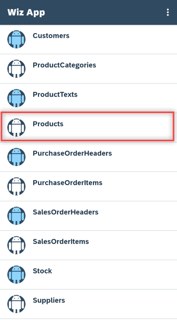
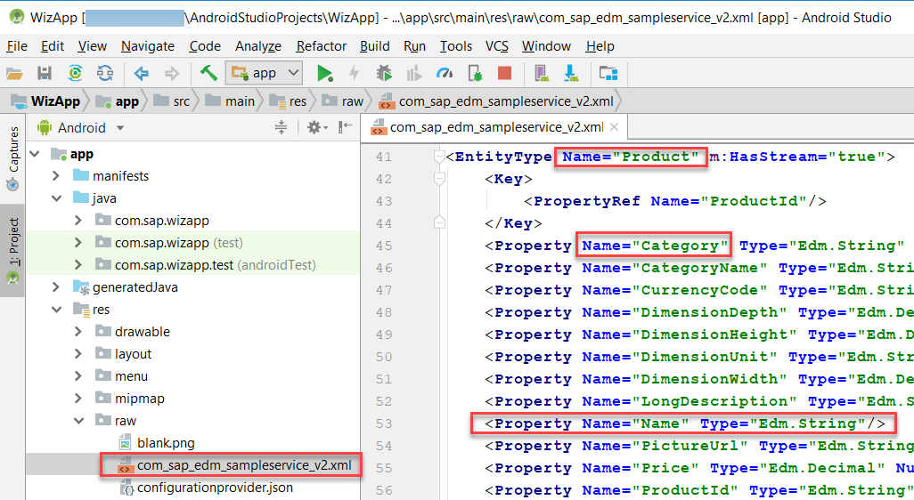
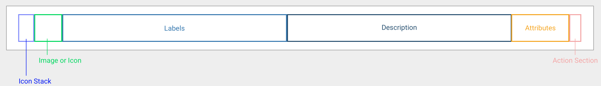
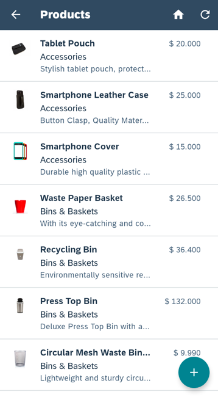
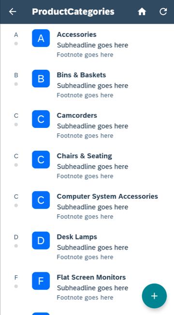
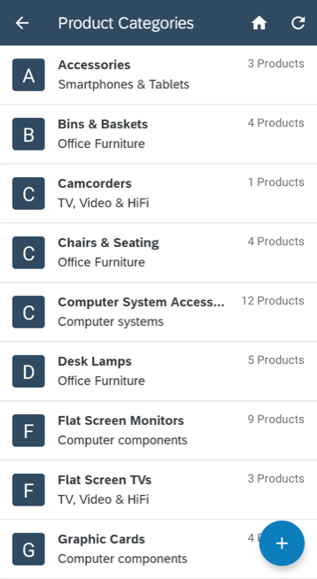
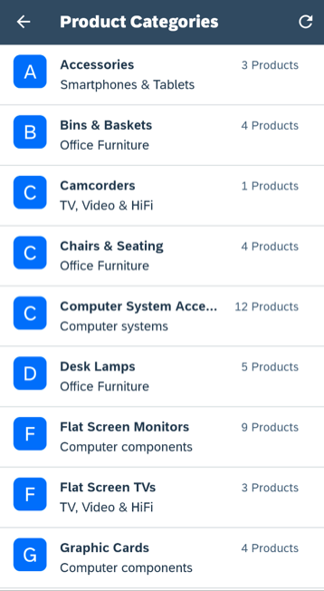
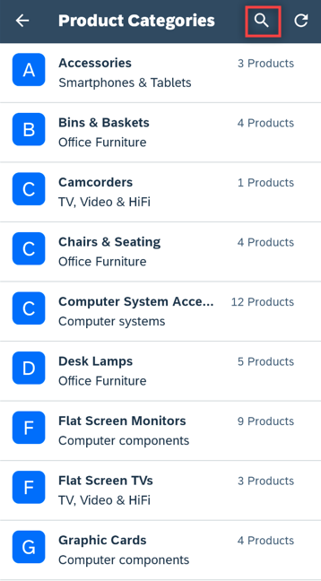
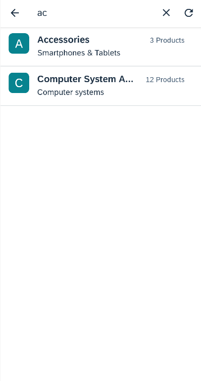

## Details
### You will learn
- How to customize the values displayed in an Object Cell
- How to modify the navigation between screens
- How to change menu options
- How to add a `FioriSearchView` enabling the filtering of Object Cells on a list screen
---

[ACCORDION-BEGIN [Step 1: ](Examine the Product's List Screen)]

Run the previously created project.

Tap on the **Products** entity.



Notice that it displays the category name rather than the product name.


The category name is displayed (rather than the product name) because the app was generated from the OData service's metadata which does not indicate which of the many fields from the product entity to display.  When creating the sample user interface, the SDK wizard uses the first property found as the value to display.  To view the complete metadata document, open the file **`res/raw/com_sap_edm_sampleservice_v2.xml`**.



Each product is displayed in an <a target="_blank" href="https://help.sap.com/doc/c2d571df73104f72b9f1b73e06c5609a/Latest/en-US/docs/fioriui/object_cell.html">Object Cell</a>, which is one of the Fiori UI for Android controls.



As seen above, an Object Cell is used to display information about an entity.

[DONE]
[ACCORDION-END]


[ACCORDION-BEGIN [Step 2: ](Update the Product's List Screen)]
In this section, the Object Cell will be used to show a products name, category, description and price, a separator decoration will be added between cells, and the sort order will be modified.

In Android Studio, on Windows press **`Ctrl+N`** or on a Mac press **`command+O`** and type **`ProductsListActivity`** to open `ProductsListActivity.java`.


On Windows press **`Ctrl+F12`** or on a Mac press **`command+F12`** and type **`populateObjectCell`** to move to the `populateObjectCell` method.

 Change the parameter in **`getDataValue`** from **`Product.category`** to **`Product.name`**.  This will cause the product name to be shown as the headline value of the Object Cell.

```Java
DataValue dataValue = product.getDataValue(Product.name);
```

Also in the `populateObjectCell` method, find the below lines that set the `subheadline`, `footnote` and `icon`.

```Java
objectCell.setSubheadline("Subheadline goes here");
objectCell.setFootnote("Fottnote goes here");

if (masterPropertyValue == null || masterPropertyValue.isEmpty()) {
    objectCell.setIcon("?", 0);
} else {
    objectCell.setIcon(masterPropertyValue.substring(0,1), 0);
}
objectCell.setIcon(R.drawable.default_dot, 1, R.string.attachment_item_content_desc);
objectCell.setIcon("!", 2);
```

Replace them with the code below which will display category, description, and price.
```Java
dataValue = product.getDataValue(Product.category);
if (dataValue != null) {
    objectCell.setSubheadline(dataValue.toString());
}
dataValue = product.getDataValue(Product.shortDescription);
if (dataValue != null) {
    objectCell.setFootnote(dataValue.toString());
}

dataValue = product.getDataValue(Product.price);
if (dataValue != null) {
    objectCell.setStatusWidth(200);
    objectCell.setStatus("$ " + dataValue.toString(), 1);
}
```

On Windows press **`Ctrl+F12`** or on a Mac press **`command+F12`** and type **`setupRecyclerView`** to move to the `setupRecyclerView` method.

After the `if (recyclerView == null)` line, paste the following code that adds a divider between product items.

```Java
LinearLayoutManager llm = new LinearLayoutManager(this);
DividerItemDecoration dividerItemDecoration = new DividerItemDecoration(recyclerView.getContext(), llm.getOrientation());
recyclerView.addItemDecoration(dividerItemDecoration);
recyclerView.setLayoutManager(llm);
```

If classes `LinearLayoutManager` and `DividerItemDecoration` appear red, this indicates that Android Studio could not locate the classes.  Select each class and on Windows press **`Alt+Enter`** or on a Mac press **`option+return`** to make use of Android Studio quick fix to add the missing imports.  

An alternate option is to enable the below setting.


On Windows press **`Ctrl+N`** or on a Mac press **`command+O`** and type **`Repository`** to open `Repository.java`.

On Windows press **`Ctrl+F12`** or on a Mac press **`command+F12`** and type **`initialRead`** to move to the `initialRead` method.

Below the line that sets the **`orderBy`** property of **`dataQuery`**, add the following to specify the sort order to be by category and then by name for products.

```Java
if (entitySet.getEntityType() == ESPMContainerMetadata.EntityTypes.product) {
    dataQuery.thenBy(Product.name, SortOrder.ASCENDING);
}
```

Run the app and notice the products screen has been formatted to show the product's name, category, description, price and the entries are now sorted by category and then name.



[VALIDATE_2]
[ACCORDION-END]


[ACCORDION-BEGIN [Step 3: ](Customize the ProductCategory List Screen)]

Examine the **`ProductCategories`** screen.



In this section the screen's title will be updated, the Object Cell will be used to show the category name, main category name, the number of products in a category and a separator decoration will be added between cells.

Press shift twice and type **`strings.xml`** to open `res/values/stings.xml`

Add the following entry.

```XML
<string name="product_categories_title">Product Categories</string>
```

On Windows press **`Ctrl+N`** or on a Mac press **`command+O`** and type **`ProductCategoriesListActivity`** to open `ProductCategoriesListActivity.java`.

On Windows press **`Ctrl+F12`** or on a Mac press **`command+F12`** and type **`onCreate`** to move to the `onCreate` method.

Add the following line after toolbar has been initialized which will set the screen's title.

```Java
toolbar.setTitle(getResources().getString(R.string.product_categories_title));
```

On Windows press **`Ctrl+F12`** or on a Mac press **`command+F12`** and type **`populateObjectCell`** to move to the `populateObjectCell` method.


Find the below lines that set the `subheadline`, `footnote` and `icon`.

```Java
objectCell.setSubheadline("Subheadline goes here");
objectCell.setFootnote("Footnote goes here");
if (masterPropertyValue == null || masterPropertyValue.isEmpty()) {
    objectCell.setIcon("?", 0);
} else {
    objectCell.setIcon(masterPropertyValue.substring(0,1), 0);
}
objectCell.setIcon(R.drawable.default_dot, 1, R.string.attachment_item_content_desc);
objectCell.setIcon("!", 2);
```

Replace them to instead display main category, hide the footnote and show the number of products per category.

```Java
dataValue = productCategory.getDataValue(ProductCategory.mainCategoryName);
if (dataValue != null) {
    objectCell.setSubheadline(dataValue.toString());
}

objectCell.setLines(2);  //Not using footnote

dataValue = productCategory.getDataValue(ProductCategory.numberOfProducts);
if (dataValue != null) {
    objectCell.setStatusWidth(220);
    objectCell.setStatus(dataValue.toString() + " Products", 1);
}
```

On Windows press **`Ctrl+F12`** or on a Mac press **`command+F12`** and type **`setupRecyclerView`** to move to the `setupRecyclerView` method.

After the `if (recyclerView == null)` line, paste the following code that adds a divider between categories.

```Java
LinearLayoutManager llm = new LinearLayoutManager(this);
DividerItemDecoration dividerItemDecoration = new DividerItemDecoration(recyclerView.getContext(), llm.getOrientation());
recyclerView.addItemDecoration(dividerItemDecoration);
recyclerView.setLayoutManager(llm);
```

Run the app again and notice the title, `subheadline`, and `status` are now used and the `icons` and `footnote` are no longer shown.



[DONE]
[ACCORDION-END]

[ACCORDION-BEGIN [Step 4: ](Customize the Navigation)]

In this section, the app will be modified to initially show the Product Categories screen when opened.  Selecting a category will navigate to a Products list screen for the selected category.  The floating action button on the Categories screen will be removed.

On Windows press **`Ctrl+N`** or on a Mac press **`command+O`** and type **`LogonActivity`** to open `LogonActivity.java`.

On Windows press **`Ctrl+F12`** or on a Mac press **`command+F12`** and type **`startEntitySetListActivity`** to move to the `startEntitySetListActivity` method.

Add the following line below the other Intent declaration.

```Java
Intent pcIntent = new Intent(LogonActivity.this, ProductCategoriesListActivity.class);
```

After the call to `startActivityForResult`, add the below line.  This will cause the Product Category screen to be the first screen seen when opening the app but as the Entity List screen is opened first, it can be navigated to by pressing the up or back button.

```Java
startActivity(pcIntent);
```


On Windows press **`Ctrl+N`** or on a Mac press **`command+O`** and type **`ProductCategoriesListActivity`** to open `ProductCategoriesListActivity.java`.

On Windows press **`Ctrl+F12`** or on a Mac press **`command+F12`** and type **`onCreate`** to move to the `onCreate` method.

Find the below code.

```Java
if (navigationPropertyName != null && parentEntityData != null) {
    FloatingActionButton fab = findViewById(R.id.fab);
    fab.hide();
} else {
    createFloatingButton();
}
```

Replace it with the following code.

```Java
FloatingActionButton fab = findViewById(R.id.fab);
fab.hide();
```

On Windows press **`Ctrl+F12`** or on a Mac press **`command+F12`** and type **`onCreateOptionsMenu`** to move to the `onCreateOptionsMenu` method.

Add the following line below the `inflater.inflate` call which will remove the home menu from the Product Categories screen which is now the home screen of the app.

```Java
menu.removeItem(R.id.menu_home);
```

On Windows press **`Ctrl+F12`** or on a Mac press **`command+F12`** and type **`showDetailActivity`** to move to the `showDetailActivity` method.

Select the body of the method and comment it out by pressing on Windows **`Ctrl+/`** or on a Mac **`command+/`**.

On Windows press **`Ctrl+F12`** or on a Mac press **`command+F12`** and type **`setOnClickListener`** to move to the `setOnClickListener` method.

Replace the code with following which will enable the navigation from the Category list screen to the Product list screen.

```Java
holder.view.setOnClickListener(view -> {
    Intent productsIntent = new Intent(ProductCategoriesListActivity.this, ProductsListActivity.class);
    productsIntent.putExtra("category", productCategory.getCategoryName());
    view.getContext().startActivity(productsIntent);
});
```

On Windows press **`Ctrl+N`** or on a Mac press **`command+O`** and type **`ProductsListActivity`** to open `ProductsListActivity.java`.

On Windows press **`Ctrl+F`** or on a Mac press **`command+F`** and search for `adapter.setItems(products)`.   Replace that line with the following code which will filter the products list to only show products for a selected category.

```Java
String category = getIntent().getStringExtra("category");
if (category != null) {
    List<Product> matchingProducts = new ArrayList<>();
    for (Product product : products) {
        if (product.getCategory() != null && product.getCategory().equals(category)) {
            matchingProducts.add(product);
        }
    }
    adapter.setItems(matchingProducts);
}
else {
    adapter.setItems(products);
}
```

Run the app again and notice the Product Categories screen is now the first screen shown, that the home menu is no longer shown, and that selecting a category shows the products list screen which now displays only products for the selected category.




[DONE]
[ACCORDION-END]


[ACCORDION-BEGIN [Step 5: ](Add Category Filtering with a FioriSearchView)]

In this section a search field will be added to `ProductCategoriesListActivity` enabling a user to filter the results displayed on the product category screen.

First, create a new drawable resource file **`res/drawable/ic_search_icon.xml`** and use the following XML.

```XML
<vector xmlns:android="http://schemas.android.com/apk/res/android"
    android:width="24dp"
    android:height="24dp"
    android:viewportWidth="24"
    android:viewportHeight="24">
    <path
        android:fillColor="#FFF"
        android:pathData="M15.5,14h-0.79l-0.28,-0.27C15.41,12.59 16,11.11 16,9.5 16,5.91 13.09,3 9.5,3S3,5.91 3,9.5 5.91,16 9.5,16c1.61,0 3.09,-0.59 4.23,-1.57l0.27,0.28v0.79l5,4.99L20.49,19l-4.99,-5zM9.5,14C7.01,14 5,11.99 5,9.5S7.01,5 9.5,5 14,7.01 14,9.5 11.99,14 9.5,14z"/>
</vector>
```

The current menu `res/menu/itemlist_menu.xml` is shared among all list screens.  We will now use a new XML file for the Product Categories screen.

Add a new menu resource named **`res/menu/product_categories_menu.xml`** and use the below XML for its contents.

```XML
<?xml version="1.0" encoding="utf-8"?>
<menu xmlns:android="http://schemas.android.com/apk/res/android"
    xmlns:app="http://schemas.android.com/apk/res-auto">

    <item
        android:id="@+id/action_search"
        android:icon="@drawable/ic_search_icon"
        android:title="Search"
        app:actionViewClass="com.sap.cloud.mobile.fiori.search.FioriSearchView"
        app:showAsAction="always|collapseActionView"
        style="@style/FioriSearchView" />

    <item
        android:id="@+id/menu_refresh"
        android:icon="@drawable/ic_menu_refresh"
        app:showAsAction="always"
        android:title="@string/menu_refresh"/>
</menu>
```

On Windows press **`Ctrl+N`** or on a Mac press **`command+O`** and type **`ProductCategoriesListActivity`** to open `ProductCategoriesListActivity.java`.

On Windows press **`Ctrl+F12`** or on a Mac press **`command+F12`** and type **`onCreateOptionsMenu`** to move to the `onCreateOptionsMenu` method.

Comment out the code to inflate entity menu and instead use the new `product_categories_menu`.

```Java
//inflater.inflate(R.menu.itemlist_menu, menu);
//menu.removeItem(R.id.menu_home);
inflater.inflate(R.menu.product_categories_menu, menu);
```

On Windows press **`Ctrl+F`** or on a Mac press **`command+F`** and search for `public class ProductCategoryListAdapter`.  

Add the following member.
```Java
private List<ProductCategory> allProductCategories;
```

On Windows press **`Ctrl+F12`** or on a Mac press **`command+F12`** and type **`setItems`** to move to the `setItems` method.

Add the following to the top of the function.

```Java
if (allProductCategories == null) {
    allProductCategories = new ArrayList<>(currentProductCategories);
}
```

On Windows press **`Ctrl+F12`** or on a Mac press **`command+F12`** and type **`onCreateOptionsMenu`** to move to the `onCreateOptionsMenu` method.

Add the following lines right above the return statement which will set a listener that will filter the list of categories in the list when text is entered in the search view.

```Java
FioriSearchView searchView = (FioriSearchView) menu.findItem(R.id.action_search).getActionView();
searchView.setBackgroundResource(R.color.transparent);
// make sure to import android.support.v7.widget.SearchView
searchView.setOnQueryTextListener(new SearchView.OnQueryTextListener() {
  @Override
  public boolean onQueryTextSubmit(String s) {
      return false;
  }

  @Override
  public boolean onQueryTextChange(String newText) {
      if(adapter == null) {
          return false;
      }

      List filteredCategoriesList = new ArrayList();
      if (newText != null && newText.trim().length() > 0) {
          for (int i = 0; i < adapter.allProductCategories.size(); i++) {
              ProductCategory pc = adapter.allProductCategories.get(i);
              if (pc.getCategoryName().toLowerCase().contains(newText.toLowerCase())) {
                  filteredCategoriesList.add(pc);
              }
          }
      }
      else {
          filteredCategoriesList = adapter.allProductCategories;
      }
      adapter.productCategories = filteredCategoriesList;
      recyclerView.setAdapter(adapter);
      return false;
  }
});
```

Now when you run the app again there is a filter search box that changes which product categories appear in the list.





>Further information on Fiori for Android can be found at <a target="_blank" href="https://help.sap.com/doc/c2d571df73104f72b9f1b73e06c5609a/Latest/en-US/docs/fioriui/fiori_ui_overview.html">Fiori UI Overview</a>, <a target="_blank" href="https://experience.sap.com/fiori-design-android/object-cell/">Fiori Android Design Guidelines</a> and <a target="_blank" href="https://github.com/SAP/cloud-sdk-android-fiori-ui-components">Fiori UI Demo Application</a>.

You should now have an understanding on some of the ways that the wizard generated application can be customized to show different fields on the list screens, alter control flow, and add or remove menu items.

[DONE]
[ACCORDION-END]
---
