## Prerequisites
- You completed [Try Out the SAP BTP SDK Wizard for Android](cp-sdk-android-wizard-app).
- You completed [Offline-Enable Your Android Application](cp-sdk-android-wizard-app-offline).

## Details
### You will learn
  - How the Android SDK supports multi-user mode
  - How to enable multi-user mode for an online app
  - How to enable multi-user mode for an offline app
  - How to use several multi-user mode related APIs

---

[ACCORDION-BEGIN [Step 1: ](Introduction)]

The Flows component of the SAP BTP SDK for Android provides the following functions to enable multi-user mode for your application:

- Handle the onboarding process for multiple users.

- Handle user information and user data management.

- To enable multi-user for an online application developed using Flows component, you only need need turn on `multipleUserMode` in `FlowContext` class.

The following cases are not supported in multi-user mode:

- Biometric authentication is not supported. The biometric screen will not be shown in the onboarding or unlock processes.

- `NoAuth` authentication type is not supported. Even if multi-user mode is turned on, an application using the `NoAuth` authentication type will revert to single user mode.

- `No passcode policy` is not supported. A default passcode policy will be used if the server has disabled it.

[VALIDATE_1]
[ACCORDION-END]

[ACCORDION-BEGIN [Step 2: ](Enable multi-user mode for a wizard-generated online application)]

[OPTION BEGIN [Java]]

1.  Open the project you previously created using the SAP BTP SDK Wizard for Android.

2.  In Android Studio, on Windows, press **`Ctrl+N`**, or, on a Mac, press **`command+O`**, and type **`WelcomeActivity`** to open `WelcomeActivity.java`.

3.  On Windows, press **`Ctrl+F12`**, or, on a Mac, press **`command+F12`**, and type **`startFlow`** to move to the `startFlow` method. For the **`FlowContext`** instance, change the parameter of the **`setMultipleUserMode`** method from **`false`** to **`true`**:

    ```Java
    FlowContext flowContext = new FlowContextBuilder()
                .setApplication(appConfig)
                .setMultipleUserMode(true)
                .setFlowStateListener(new WizardFlowStateListener(
                        (SAPWizardApplication) context.getApplication()))
                .build();
    ```

    Notice that the setting will only take effect when the very first user onboards. Once a user is onboarded,  
    this setting will be saved in the local database. All subsequent flows will use the same setting from the database and ignore the one inside **`flowContext`**. To change this setting, you need to reset the application to bring up the onboarding process, and the new setting will be updated in the local database after onboarding.

4.  Re-run (quit first) the app and notice that the onboarding process is the same as for single-user mode, except that no biometric authentication screen is shown. After onboarding, put the app in background until the unlock screen appears. In multi-user mode, there is a **SWTICH OR ADD USER** button at the bottom of the screen.

    !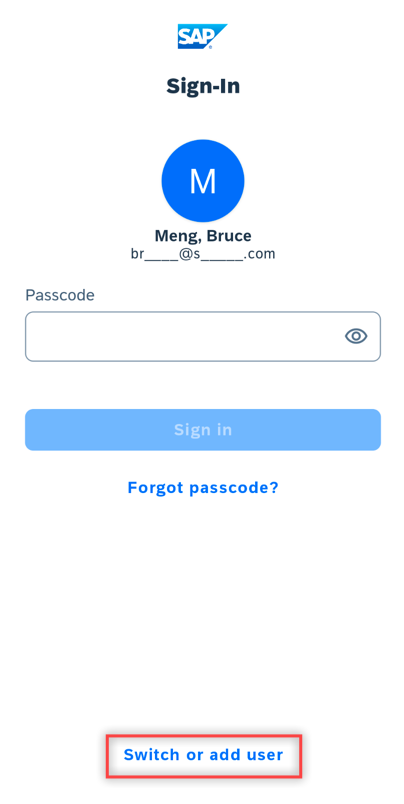

    When the button is clicked, the user list is displayed. You can either select an existing user from the list or click the **ADD USER** icon at the right top of the screen. This will start the onboarding process for the new user.

    !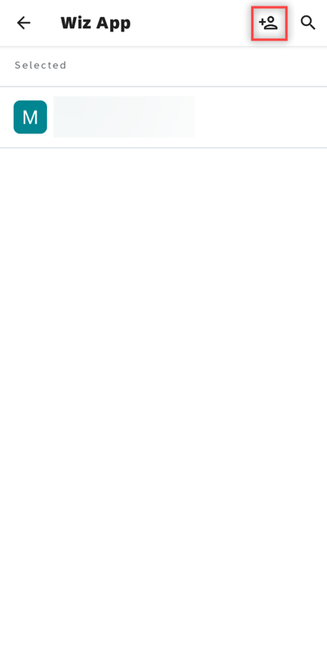

[OPTION END]

[OPTION BEGIN [Kotlin]]

1.  Open the project you previously created using the SAP BTP SDK Wizard for Android.

2.  In Android Studio, on Windows, press **`Ctrl+N`**, or, on a Mac, press **`command+O`**, and type **`WelcomeActivity`** to open `WelcomeActivity.kt`.

3.  On Windows, press **`Ctrl+F12`**, or, on a Mac, press **`command+F12`**, and type **`startFlow`** to move to the `startFlow` method. For the **`FlowContext`** instance, change the parameter of the **`setMultipleUserMode`** method from **`false`** to **`true`**:

    ```Kotlin
    val flowContext =
                FlowContextBuilder()
                    .setApplication(appConfig)
                    .setMultipleUserMode(true)
                    .setFlowStateListener(WizardFlowStateListener(activity.application as SAPWizardApplication))
                    .build()
    ```

    Notice that the setting will only take effect when the very first user onboards. Once a user is onboarded, this setting will be saved in the local database. All subsequent flows will use the same setting from the database and ignore the one inside **`flowContext`**. To change this setting, you need to reset the application to bring up the onboarding process, and the new setting will be updated in the local database after onboarding.

4.  Re-run (quit first) the app and notice that the onboarding process is same as for single-user mode, except that no biometric authentication screen is shown. After onboarding, put the app in background until the sign in screen appears. In multi-user mode, there is a **SWTICH OR ADD USER** button at the bottom of the screen.

    !

    When the button is clicked, the user list is displayed. You can either select an existing user from the list or click the **ADD USER** icon at the right top of the screen. This will start the onboarding process for the new user.

    !

[OPTION END]

[DONE]
[ACCORDION-END]

[ACCORDION-BEGIN [Step 3: ](Enable multi-user mode for a wizard-generated offline app)]

[OPTION BEGIN [Java]]

1.  For an offline application, you have to enable the **Allow Upload of Pending Changes from Previous User** option on the server side first. Go to the [SAP Mobile Services cockpit](https://mobile-service-cockpit-web.cfapps.eu10.hana.ondemand.com/) and select your application from the application list. Click **Mobile Settings Exchange** in the assigned features list:

    !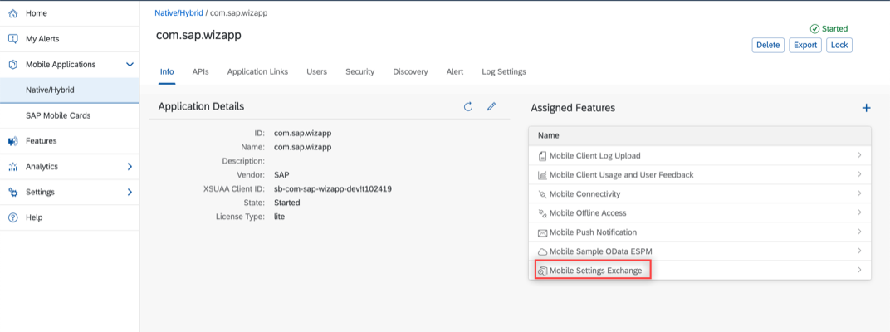

    Scroll down to the bottom of the **Client Configuration** tab and enable the **Allow Upload of Pending Changes from Previous User** option:

    !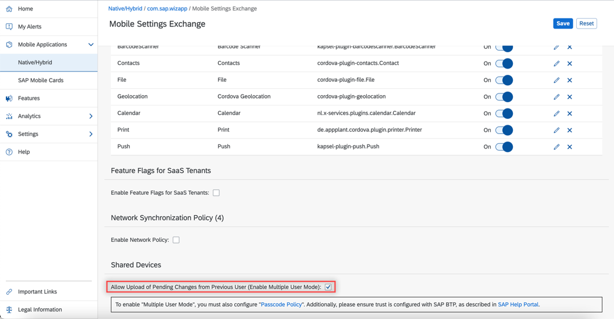

2.  Open the project you previously created using the SAP BTP SDK Wizard for Android.

3.  Enable **`setMultipleUserMode`** for **`FlowContext`** instance same as online app.

4.  In Android Studio, on Windows, press **`Ctrl+N`**, or, on a Mac, press **`command+O`**, and type **`OfflineWorkerUtil`** to open `OfflineWorkerUtil.java`.

5.  On Windows, press **`Ctrl+F12`**, or, on a Mac, press **`command+F12`**, and type **`initializeOffline`** to move to the `initializeOffline` method. Notice that for the **`OfflineODataParameters`** instance, the value of the **`isForceUploadOnUserSwitch`** parameter is set based on the value of `runtimeMultipleUserMode`. This value is retrieved from the **`UserSecureStoreDelegate.getInstance().getRuntimeMultipleUserModeAsync()`** API call.

    !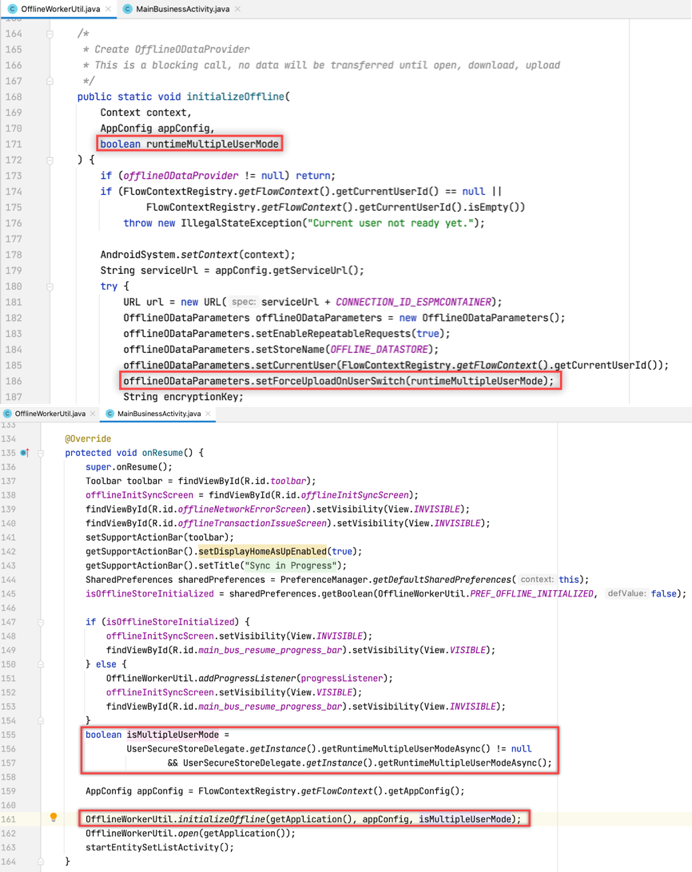

6.  Unlike the single-user mode scenario, the encryption key is not generated by the client code, but rather retrieved from the server by SDK. Client code can acquire the key using the **`UserSecureStoreDelegate.getInstance().getOfflineEncryptionKey()`** API call.

7.  Re-run (quit first) the app. Notice that the onboarding process and add/switch user process are the same as for the online app.

[OPTION END]

[OPTION BEGIN [Kotlin]]

1.  For an offline application, you have to enable the **Allow Upload of Pending Changes from Previous User** option on the server side first. Go to the [SAP Mobile Services cockpit](https://mobile-service-cockpit-web.cfapps.eu10.hana.ondemand.com/) and select your application from the application list. Click **Mobile Settings Exchange** in the assigned features list:

    !

    Scroll down to the bottom of the **Client Configuration** tab and enable the **Allow Upload of Pending Changes from Previous User** option:

    !

2.  Open the project you previously created using the SAP BTP SDK Wizard for Android.

3.  Enable **`setMultipleUserMode`** for **`FlowContext`** instance same as online app.

4.  In Android Studio, on Windows, press **`Ctrl+N`**, or, on a Mac, press **`command+O`**, and type **`OfflineWorkerUtil`** to open `OfflineWorkerUtil.kt`.

5.  On Windows, press **`Ctrl+F12`**, or, on a Mac, press **`command+F12`**, and type **`initializeOffline`** to move to the `initializeOffline` method. Notice that for the **`OfflineODataParameters`** instance, the value of the **`isForceUploadOnUserSwitch`** parameter is set based on the value of `runtimeMultipleUserMode`. This value is retrieved from the **`UserSecureStoreDelegate.getInstance().getRuntimeMultipleUserMode()!!`** API call.

    !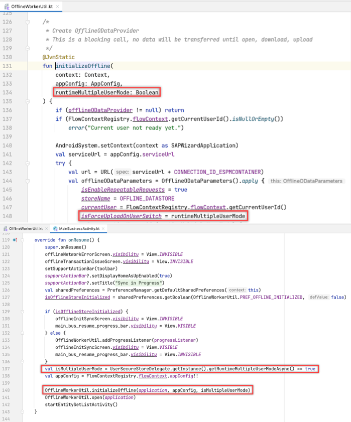

6.  Unlike the single-user mode scenario, the encryption key is not generated by the client code, but rather retrieved from the server by SDK. Client code can acquire the key using the **`UserSecureStoreDelegate.getInstance().getOfflineEncryptionKey()`** API call.

7.  Re-run (quit first) the app. Notice that the onboarding process and add/switch user process are the same as for the online app.

[OPTION END]

[DONE]
[ACCORDION-END]

[ACCORDION-BEGIN [Step 4: ](Handle offline pending changes when switching users)]

[OPTION BEGIN [Java]]

1.  In the offline multi-user mode scenario, when a user makes changes to the local offline store, the changes may not be uploaded to the server when the device is handed over to another user. After the new user clicks **SWTICH OR ADD USER** button to sign in or do onboarding, the pending changes will be uploaded to the server automatically.

2.  If there is an error during synchronization, a screen will be displayed, notifying the user about the synchronization failure.

    If synchronization failed because there is no internet connection, a network error screen will be displayed.

    !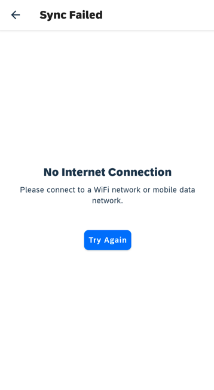

    If synchronization failed due to a transaction issue, a transaction error screen will be displayed.

    !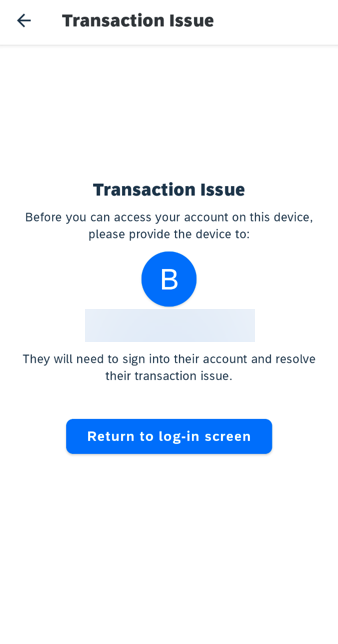

3.  The SDK provides a UI component for the two screens and apps can reference the screens to provide error handling.

    Open the project you previously created using the SAP BTP SDK Wizard for Android, press **`Shift`** twice and type **`activity_main_business.xml`** to open `res\layout\activity_main_business.xml`. To reference the two screens, the layout XML file includes **`com.sap.cloud.mobile.fiori.onboarding.OfflineNetworkErrorScreen`** and **`com.sap.cloud.mobile.fiori.onboarding.OfflineTransactionIssueScreen`**.

    !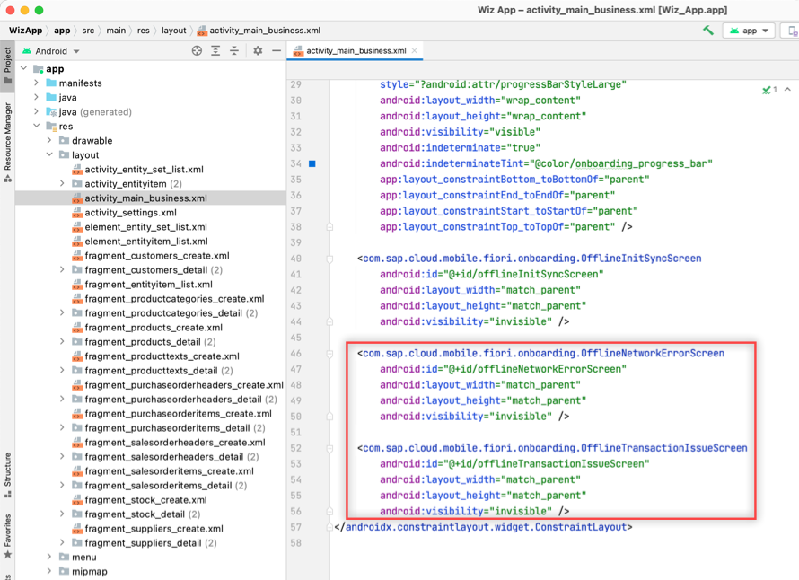

4.  For the **`OfflineNetworkErrorScreen`**, the client code implements the logic for button click events.   

    On Windows, press **`Ctrl+N`**, or, on a Mac, press **`command+O`**, and type **`MainBusinessActivity`** to open `MainBusinessActivity.java`.

    On Windows, press **`Ctrl+F12`**, or, on a Mac, press **`command+F12`**, and type **`offlineNetworkErrorAction`** to move to the `offlineNetworkErrorAction` method. When the network error occurs, make the **`OfflineNetworkErrorScreen`** visible and provide your logic for the button click event.

    !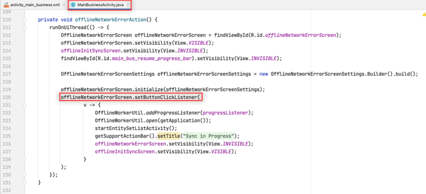

5.  For **`OfflineTransactionIssueScreen`**, the client code needs to set the user information of previous user and implement the logic for button click events.

    On Windows, press **`Ctrl+F12`**, or, on a Mac, press **`command+F12`**, and type **`offlineTransactionIssueAction`** to move to the `offlineTransactionIssueAction` method. When the transaction error occurs, make the **`OfflineTransactionIssueScreen`** visible, set the information of the previous user and provide your logic for the button click event. To get the information of the previous user, call the `getPreviousUser` method of the `OfflineODataProvider` class to get the user ID and then call the `getUserInfoByIdAsync` method of the `UserSecureStoreDelegate` class to get the user information.

    !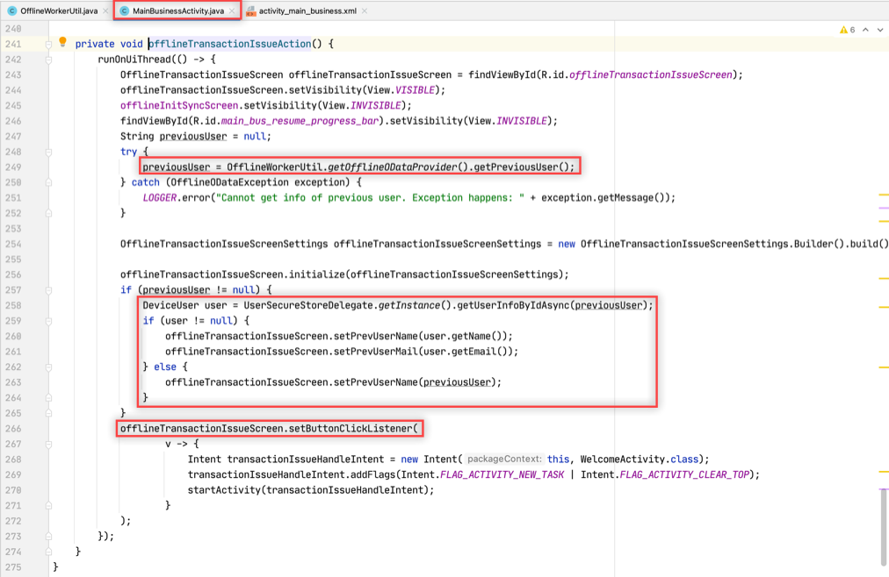

[OPTION END]

[OPTION BEGIN [Kotlin]]

1.  In the offline multi-user mode scenario, when a user makes changes to the local offline store, the changes may not be uploaded to the server when the device is handed over to another user. After the new user clicks **SWTICH OR ADD USER** button to sign in or do onboarding, the pending changes will be uploaded to the server automatically.

2.  If there is an error during synchronization, a screen will be displayed, notifying the user about the synchronization failure.

    If synchronization failed because there is no internet connection, a network error screen will be displayed.

    !

    If synchronization failed due to a transaction issue, a transaction error screen will be displayed.

    !

3.  The SDK provides a UI component for the two screens and apps can reference the screens to provide error handling.

    Open the project you previously created using the SAP BTP SDK Wizard for Android, press **`Shift`** twice and type **`activity_main_business.xml`** to open `res\layout\activity_main_business.xml`. To reference the two screens, the layout XML file includes **`com.sap.cloud.mobile.fiori.onboarding.OfflineNetworkErrorScreen`** and **`com.sap.cloud.mobile.fiori.onboarding.OfflineTransactionIssueScreen`**.

    !

4.  For the **`OfflineNetworkErrorScreen`**, the client code implements the logic for button click events.   

    On Windows, press **`Ctrl+N`**, or, on a Mac, press **`command+O`**, and type **`MainBusinessActivity`** to open `MainBusinessActivity.kt`.

    On Windows, press **`Ctrl+F12`**, or, on a Mac, press **`command+F12`**, and type **`offlineNetworkErrorAction`** to move to the `offlineNetworkErrorAction` method. When the network error occurs, make the **`OfflineNetworkErrorScreen`** visible and provide your logic for the button click event.

    !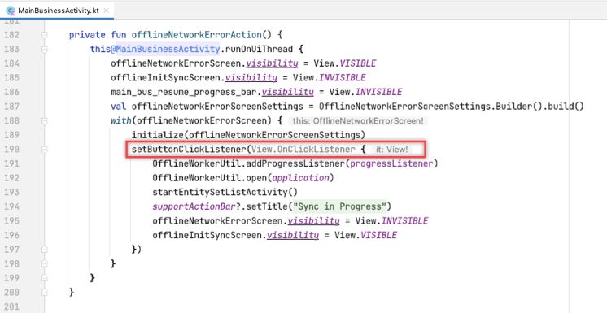

5.  For **`OfflineTransactionIssueScreen`**, the client code needs to set the user information of previous user and implement the logic for button click events.

    On Windows, press **`Ctrl+F12`**, or, on a Mac, press **`command+F12`**, and type **`offlineTransactionIssueAction`** to move to the `offlineTransactionIssueAction` method. When the transaction error occurs, make the **`OfflineTransactionIssueScreen`** visible, set the information of the previous user and provide your logic for the button click event. To get the information of the previous user, call the `getPreviousUser` method of the `OfflineODataProvider` class to get the user ID and then call the `getUserInfoByIdAsync` method of the `UserSecureStoreDelegate` class to get the user information.

    !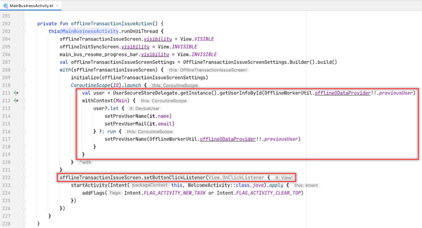

[OPTION END]

[DONE]
[ACCORDION-END]

[ACCORDION-BEGIN [Step 5: ](APIs to help customize a multi-user mode app)]

[OPTION BEGIN [Java]]

1.  The Flows component exposes two APIs in the **`UserSecureStoreDelegate`** class for you to acquire user information by ID, such as user name and email:

    **`fun getUserInfoByIdAsync(userId: String) : DeviceUser?`**

    **`fun getUserInfoById(userId: String): DeviceUser?`**

    The **`getUserInfoByIdAsync`** function is mainly used by the Java code. Notice that this function can only be called after the onboarding or restore flow.

2.  After onboarding, the setting for multi-user mode enablement is saved in the local database. To get this setting, the **`UserSecureStoreDelegate`** class exposes the following API:

    **`suspend fun getRuntimeMultipleUserMode(): Boolean?`**

    **`fun getRuntimeMultipleUserModeAsync(): Boolean?`**

    The **`getRuntimeMultipleUserModeAsync`** function is mainly used by the Java code.

3.  The Flows component exposes two APIs in **`FlowActionHandler`** class for you to obfuscate the user name and email displayed on the Sign-in screen:

    **`open fun obfuscateUserName(name: String): String`**

    **`fun obfuscateEmail(email: String): String`**

    Notice that a default obfuscate algorithm is provided in the APIs. You can override the APIs to provide your own obfuscate algorithm.

4.  The **`FlowStateListener`** class provides one callback, **`onUserSwitched(newUser: DeviceUser, oldUser: DeviceUser?)`**, for you to handle the user switch event.

    As a sample implementation of this callback, you can examine a wizard-generated offline app. In Android Studio, on Windows, press **`Ctrl+N`**, or, on a Mac, press **`command+O`**, and type **`WizardFlowStateListener`** to open `WizardFlowStateListener.java`.

    On Windows, press **`Ctrl+F12`**, or, on a Mac, press **`command+F12`**, and type **`onUserSwitched`** to move to the `onUserSwitched` method. Examine the code and notice that it does some clean and reset work:

    !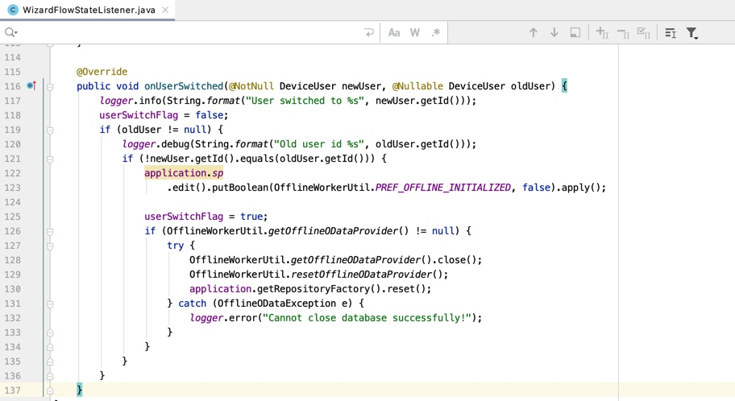

    You can provide your own logic in this callback when the user switch event is notified.

[OPTION END]

[OPTION BEGIN [Kotlin]]

1.  The Flows component exposes two APIs in the **`UserSecureStoreDelegate`** class for you to acquire user information by ID, such as user name and email:

    **`fun getUserInfoByIdAsync(userId: String) : DeviceUser?`**

    **`fun getUserInfoById(userId: String): DeviceUser?`**

    The **`getUserInfoByIdAsync`** function is mainly used by the Java code. Notice that this function can only be called after the onboarding or restore flow.

2.  After onboarding, the setting for multi-user mode enablement is saved in the local database. To get this setting, the **`UserSecureStoreDelegate`** class exposes the following API:

    **`suspend fun getRuntimeMultipleUserMode(): Boolean?`**

    **`fun getRuntimeMultipleUserModeAsync(): Boolean?`**

    The **`getRuntimeMultipleUserModeAsync`** function is mainly used by the Java code.

3.  The Flows component exposes two APIs in **`FlowActionHandler`** class for you to obfuscate the user name and email displayed on the Sign-in screen:

    **`open fun obfuscateUserName(name: String): String`**

    **`fun obfuscateEmail(email: String): String`**

    Notice that a default obfuscate algorithm is provided in the APIs. You can override the APIs to provide your own obfuscate algorithm.

4.  The **`FlowStateListener`** class provides one callback, **`onUserSwitched(newUser: DeviceUser, oldUser: DeviceUser?)`**, for you to handle the user switch event.

    As a sample implementation of this callback, you can examine a wizard-generated offline app. In Android Studio, on Windows, press **`Ctrl+N`**, or, on a Mac, press **`command+O`**, and type **`WizardFlowStateListener`** to open `WizardFlowStateListener.kt`.

    On Windows, press **`Ctrl+F12`**, or, on a Mac, press **`command+F12`**, and type **`onUserSwitched`** to move to the `onUserSwitched` method. Examine the code and notice that it does some clean and reset work:

    !

    You can provide your own logic in this callback when user switch event is notified.

[OPTION END]

Congratulations! You have learned how to enable multi-user mode for your android applications!

[DONE]
[ACCORDION-END]

---
