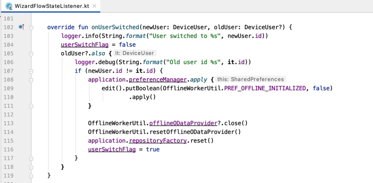

## Prerequisites
- You completed [Try Out the SAP Cloud Platform SDK for Android Wizard](cp-sdk-android-wizard-app).

## Details
### You will learn
  - How the Android SDK supports multi-user feature
  - How to enable multi-user feature for an online app
  - How to enable multi-user feature for an offline app
  - Several multi-user related APIs
---

[ACCORDION-BEGIN [Step 1: ](Intro to Android SDK multi-user feature)]

The Flows component of SAP Android SDK provides the following functions to enable multi-user feature for your application:

- Handle onboarding process for multiple users.

- Handle user information and user data management.

- To enable multi-user for an online application developed using Flows component, you only need need turn on `multipleUserMode` in `FlowContext` class.

Following cases are not supported in multi-user mode:

- Biometric authentication is not supported. The biometric screen will not be shown in onboarding or unlock process.

- Authentication type `NoAuth` is not supported. Even if multi-user mode is turned on, the application with `NoAuth` authentication type will go to single user mode.

- `No passcode policy` is not supported. A default passcode policy is used if server disables it.

[VALIDATE_1]
[ACCORDION-END]

[ACCORDION-BEGIN [Step 2: ](Enable multi-user for wizard generated online application)]

[OPTION BEGIN [Java]]

1.  Open the previously created project from wizard generation.

2.  In Android Studio, on Windows, press **`Ctrl+N`**, or, on a Mac, press **`command+O`**, and type **`WelcomeActivity`**, to open `WelcomeActivity.java`.

3.  On Windows, press **`Ctrl+F12`**, or, on a Mac, press **`command+F12`**, and type **`startFlow`**, to move to the `startFlow` method. For the **`FlowContext`** instance, change the parameter of the method **`setMultipleUserMode`** from **`false`** to **`true`**.:

    ```Java
    FlowContext flowContext = new FlowContextBuilder()
                .setApplication(appConfig)
                .setMultipleUserMode(true)
                .setFlowStateListener(new WizardFlowStateListener(
                        (SAPWizardApplication) context.getApplication()))
                .build();
    ```

    Notice that the setting will only take effect with the very first user onboarding. Once a user is onboarded,  
    this setting will be saved into local database, all flows afterwards will use the same setting from the database and ignore the one inside **`flowContext`**.

4.  Re-run (quit first) the app and notice that the onboarding process is same as single user mode, except that no biometric authentication screen is shown. After onboarding, put the app in background until the unlock screen appears. In multi-user mode, there is a button **SWTICH OR ADD USER** at the bottom of the screen.

    !

    Click the button, the user list is shown. You can either select existing user from the list or click the **ADD USER** icon on the right top of the screen. This will start the onboarding process for the new user.

    !

[OPTION END]

[OPTION BEGIN [Kotlin]]

1.  Open the previously created project from wizard generation.

2.  In Android Studio, on Windows, press **`Ctrl+N`**, or, on a Mac, press **`command+O`**, and type **`WelcomeActivity`**, to open `WelcomeActivity.kt`.

3.  On Windows, press **`Ctrl+F12`**, or, on a Mac, press **`command+F12`**, and type **`startFlow`**, to move to the `startFlow` method. For the **`FlowContext`** instance, change the parameter of the method **`setMultipleUserMode`** from **`false`** to **`true`**.:

    ```Kotlin
    val flowContext =
                FlowContextBuilder()
                    .setApplication(appConfig)
                    .setMultipleUserMode(true)
                    .setFlowStateListener(WizardFlowStateListener(activity.application as SAPWizardApplication))
                    .build()
    ```

    Notice that the setting will only take effect with the very first user onboarding. Once a user is onboarded, this setting will be saved into local database, all flows afterwards will use the same setting from the database and ignore the one inside **`flowContext`**.

4.  Re-run (quit first) the app and notice that the onboarding process is same as single user mode, except that no biometric authentication screen is shown. After onboarding, put the app in background until the sign in screen appears. In multi-user mode, there is a button **SWTICH OR ADD USER** at the bottom of the screen.

    !

    Click the button, the user list is shown. You can either select existing user from the list or click the **ADD USER** icon on the right top of the screen. This will start the onboarding process for the new user.

    !

[OPTION END]

[DONE]
[ACCORDION-END]

[ACCORDION-BEGIN [Step 3: ](Enable multi-user for wizard generated offline app)]

[OPTION BEGIN [Java]]

1.  For offline application, enable **Allow Upload of Pending Changes from Previous User** option on server side first. Go to the [SAP Cloud Platform Mobile Services cockpit](https://mobile-service-cockpit-web.cfapps.eu10.hana.ondemand.com/) and select your application from the application list. Click **Mobile Settings Exchange** in the assigned features list:

    !

    Scroll down to the bottom of **Client Configuration** tab and enable  **Allow Upload of Pending Changes from Previous User** option

    !

2.  Open the previously created project from wizard generation. Enable **`setMultipleUserMode`** for **`FlowContext`** instance same as online app.

3.  In Android Studio, on Windows, press **`Ctrl+N`**, or, on a Mac, press **`command+O`**, and type **`OfflineWorkerUtil`**, to open `OfflineWorkerUtil.java`.

4.  On Windows, press **`Ctrl+F12`**, or, on a Mac, press **`command+F12`**, and type **`initializeOffline`**, to move to the `initializeOffline` method. For the **`OfflineODataParameters`** instance, change the parameter of the method **`setForceUploadOnUserSwitch`** from **`false`** to **`true`**:

    ```Java
    offlineODataParameters.setForceUploadOnUserSwitch(true);
    ```
5.  Re-run (quit first) the app. Notice that the onboarding process and add/switch user process are same as online app.

[OPTION END]

[OPTION BEGIN [Kotlin]]

1.  For offline application, enable **Allow Upload of Pending Changes from Previous User** option on server side first. Go to the [SAP Cloud Platform Mobile Services cockpit](https://mobile-service-cockpit-web.cfapps.eu10.hana.ondemand.com/) and select your application from the application list. Click **Mobile Settings Exchange** in the assigned features list:

    !

    Scroll down to the bottom of **Client Configuration** tab and enable  **Allow Upload of Pending Changes from Previous User** option

    !

2.  Open the previously created project from wizard generation. Enable **`setMultipleUserMode`** for **`FlowContext`** instance same as online app.

3.  In Android Studio, on Windows, press **`Ctrl+N`**, or, on a Mac, press **`command+O`**, and type **`OfflineWorkerUtil`**, to open `OfflineWorkerUtil.kt`.

4.  On Windows, press **`Ctrl+F12`**, or, on a Mac, press **`command+F12`**, and type **`initializeOffline`**, to move to the `initializeOffline` method. For the **`OfflineODataParameters`** instance, change the value of parameter **`isForceUploadOnUserSwitch`** from **`false`** to **`true`**:

    ```Kotlin
    val offlineODataParameters = OfflineODataParameters().apply {
                timeout = 5
                isEnableRepeatableRequests = true
                storeName = OFFLINE_DATASTORE
                currentUser = FlowContextRegistry.flowContext.getCurrentUserId()
                isForceUploadOnUserSwitch =
                    true
                val encryptionKey = UserSecureStoreDelegate.getInstance().getOfflineEncryptionKey()
                val key = if (encryptionKey == null) {
                    val encryptionKeyBytes =
                        EncryptionUtil.getEncryptionKey(OFFLINE_DATASTORE_ENCRYPTION_KEY_ALIAS)
                    val defaultKey = Base64.encodeToString(encryptionKeyBytes, Base64.NO_WRAP)
                    Arrays.fill(encryptionKeyBytes, 0.toByte())
                    defaultKey
                } else encryptionKey
                storeEncryptionKey = key
            }.also {
                // Set the default application version
                val customHeaders = it.customHeaders
                customHeaders[APP_VERSION_HEADER] = appConfig.applicationVersion
                // In case of offlineODataParameters.customHeaders returning a new object if customHeaders from offlineODataParameters is null, set again as below
                it.setCustomHeaders(customHeaders)
            }
    ```

5.  Re-run (quit first) the app. Notice that the onboarding process and add/switch user process are same as online app.

[OPTION END]

[DONE]
[ACCORDION-END]

[ACCORDION-BEGIN [Step 4: ](APIs to help customize multi-user app)]

[OPTION BEGIN [Java]]

1.  Flows component exposes two APIs in **`UserSecureStoreDelegate`** class for you to get user information by ID, such as user name and email:

    **`fun getUserInfoByIdAsync(userId: String) : DeviceUser?`**

    **`fun getUserInfoById(userId: String): DeviceUser?`**

    The function **`getUserInfoByIdAsync`** is mainly for Java code to use. Notice that this function can only be called after onboarding or restore flow.

2.  After onboarding, the setting for multi-user enablement is saved into local database. To get this setting, **`UserSecureStoreDelegate`** class exposes following API:

    **`suspend fun getRuntimeMultipleUserMode(): Boolean?`**

    **`fun getRuntimeMultipleUserModeAsync(): Boolean?`**

    The function **`getRuntimeMultipleUserModeAsync`** is mainly for Java code to use.

3.  Flows component exposes two APIs in **`FlowActionHandler`** class for you to obfuscate user name and email displayed on sign in screen:

    **`open fun obfuscateUserName(name: String): String`**

    **`fun obfuscateEmail(email: String): String`**

    Notice that a default obfuscate algorithm is provided in the APIs. You can override the APIs to provide your own obfuscate algorithm.

4.  The **`FlowStateListener`** class provides one callback **`onUserSwitched(newUser: DeviceUser, oldUser: DeviceUser?)`** for you to handle user switch event.

    As a sample implementation of this callback, you can examine a wizard generated offline app. In Android Studio, on Windows, press **`Ctrl+N`**, or, on a Mac, press **`command+O`**, and type **`WizardFlowStateListener`**, to open `WizardFlowStateListener.java`.

    On Windows, press **`Ctrl+F12`**, or, on a Mac, press **`command+F12`**, and type **`onUserSwitched`**, to move to the `onUserSwitched` method. Examine the code and notice that it does some clean and reset work:

    !

    You can provide your own logic in this callback when user switch event is notified.

[OPTION END]

[OPTION BEGIN [Kotlin]]

1.  Flows component exposes two APIs in **`UserSecureStoreDelegate`** class for you to get user information by ID, such as user name and email:

    **`fun getUserInfoByIdAsync(userId: String) : DeviceUser?`**

    **`fun getUserInfoById(userId: String): DeviceUser?`**

    The function **`getUserInfoByIdAsync`** is mainly for Java code to use. Notice that this function can only be called after onboarding or restore flow.

2.  After onboarding, the setting for multi-user enablement is saved into local database. To get this setting, **`UserSecureStoreDelegate`** class exposes following API:

    **`suspend fun getRuntimeMultipleUserMode(): Boolean?`**

    **`fun getRuntimeMultipleUserModeAsync(): Boolean?`**

    The function **`getRuntimeMultipleUserModeAsync`** is mainly for Java code to use.

3.  Flows component exposes two APIs in **`FlowActionHandler`** class for you to obfuscate user name and email displayed on sign in screen:

    **`open fun obfuscateUserName(name: String): String`**

    **`fun obfuscateEmail(email: String): String`**

    Notice that a default obfuscate algorithm is provided in the APIs. You can override the APIs to provide your own obfuscate algorithm.

4.  The **`FlowStateListener`** class provides one callback **`onUserSwitched(newUser: DeviceUser, oldUser: DeviceUser?)`** for you to handle user switch event.

    As a sample implementation of this callback, you can examine a wizard generated offline app. In Android Studio, on Windows, press **`Ctrl+N`**, or, on a Mac, press **`command+O`**, and type **`WizardFlowStateListener`**, to open `WizardFlowStateListener.kt`.

    On Windows, press **`Ctrl+F12`**, or, on a Mac, press **`command+F12`**, and type **`onUserSwitched`**, to move to the `onUserSwitched` method. Examine the code and notice that it does some clean and reset work:

    !

    You can provide your own logic in this callback when user switch event is notified.

[OPTION END]

[DONE]
[ACCORDION-END]

---
