## Details
### You will learn
- How the offline feature works, through demonstration
- How the synchronization code works
- How to handle errors that occur while syncing
---

[ACCORDION-BEGIN [Step 1: ](Generate and run an offline app)]

1.  Follow the instructions at [Try Out the SAP BTP SDK Wizard for Android](cp-sdk-android-wizard-app) to create a new application using the SAP BTP SDK Wizard for Android and select **Offline** for the OData option on the **Project Features** tab. The push feature is not needed for this application.

    !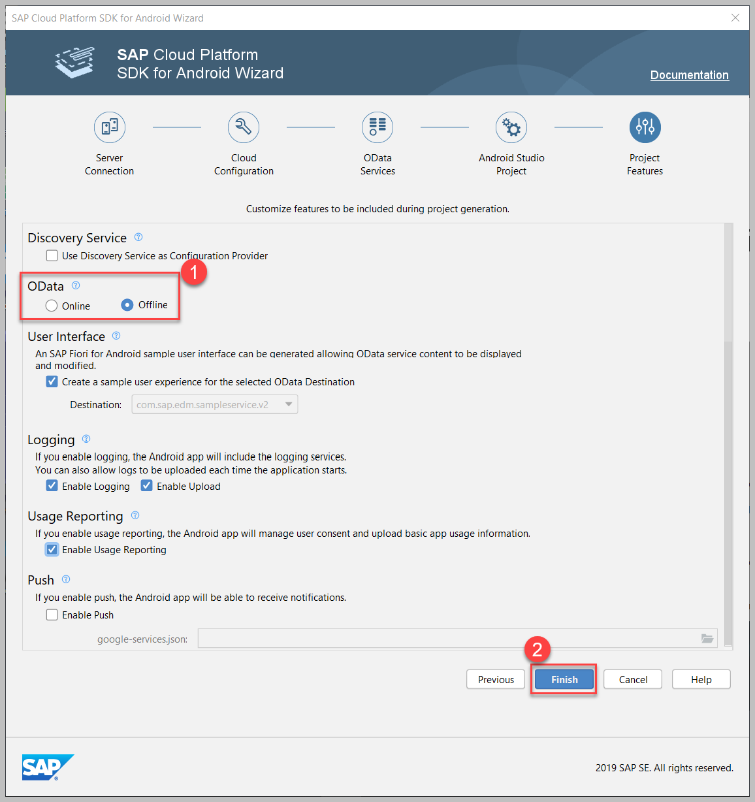

2.  Run the app. After the login process, a screen is displayed explaining that the offline store is opening. As the screen suggests, opening the offline store for the first time can take up to a few minutes. One technique to decrease this initial time is to only download data that is relevant to the user, such as customers that belong in their sales region.

    !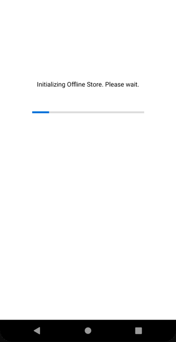

3.  When you get to the app's home page, turn on **airplane mode** on your device, or disable Wi-Fi and data.

    !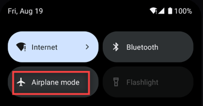

4.  The entity list screen is populated based on the `metadata.xml` file retrieved when the application was created. Tap the **Products** list item.

    !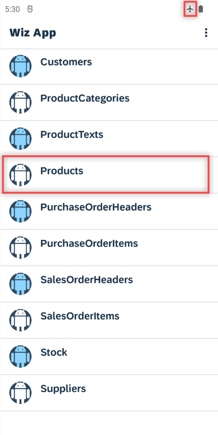

    The **Products** screen makes a data request to display the available products. Notice that it succeeds without a working network connection. The data request is fulfilled from the offline store that was previously created and populated on the device. Tap the **Accessories** item to display the detail screen.

    !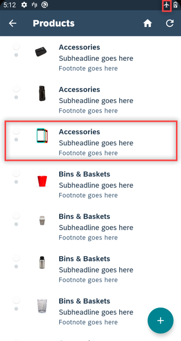

5.  On the detail screen, tap the edit toolbar icon.

    !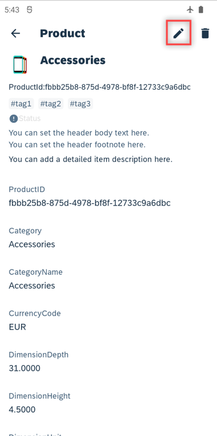

6.  Make a change to the currency code and tap the save toolbar icon.

    !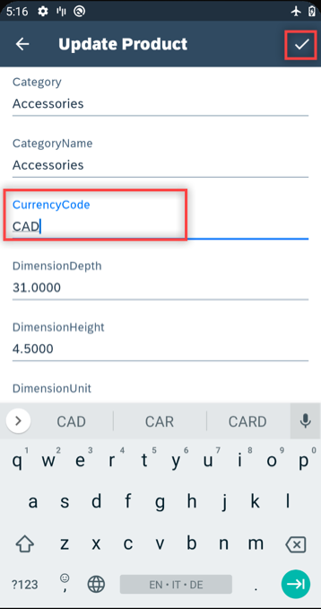

7.  Navigate back to the app's **Home** screen and tap **Synchronize** using the three-dot-menu in the top right of the title bar.

    !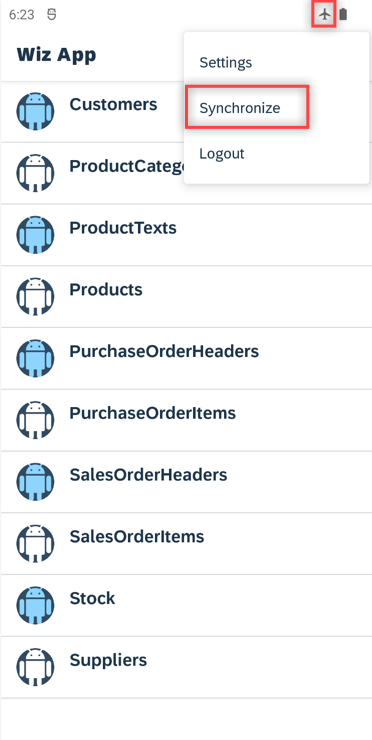

    The sync should fail because you haven't turned airplane mode off yet.

    !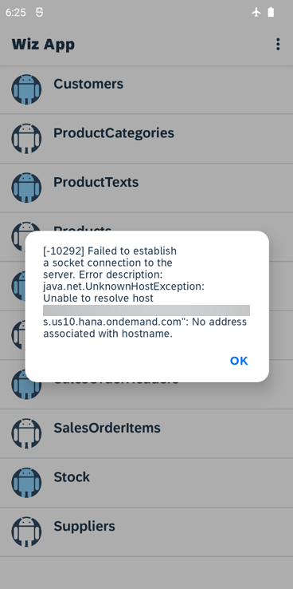

8.  Turn off airplane mode or re-enable Wi-Fi/data and attempt a sync again. You will see a notification that describes the sync action.

    !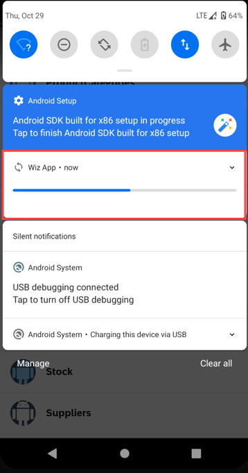

    When the sync completes, the change you made will have been applied to the back end.

[VALIDATE_3]
[ACCORDION-END]

[ACCORDION-BEGIN [Step 2: ](Examine the encryption key)]

To protect the data in offline store, you must enable offline store encryption by supplying an encryption key.

[OPTION BEGIN [Java]]
1.  In Android Studio, on Windows, press **`Ctrl+N`**, or, on a Mac, press **`command+O`**, and type **`OfflineWorkerUtil`**, to open `OfflineWorkerUtil.java`.

2.  On Windows, press **`Ctrl+F12`**, or, on a Mac, press **`command+F12`**, and type **`initializeOffline`**, to move to the `initializeOffline` method. Call the **`setStoreEncryptionKey`** method of **`OfflineODataParameters`** instance to encrypt offline store.

    !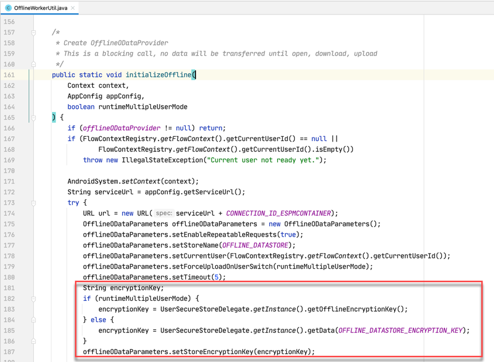

[OPTION END]

[OPTION BEGIN [Kotlin]]
1.  In Android Studio, on Windows, press **`Ctrl+N`**, or, on a Mac, press **`command+O`**, and type **`OfflineWorkerUtil`**, to open `OfflineWorkerUtil.kt`.

2.  On Windows, press **`Ctrl+F12`**, or, on a Mac, press **`command+F12`**, and type **`initializeOffline`**, to move to the `initializeOffline` method. Call the **`setStoreEncryptionKey`** method of **`OfflineODataParameters`** instance to encrypt offline store.

    !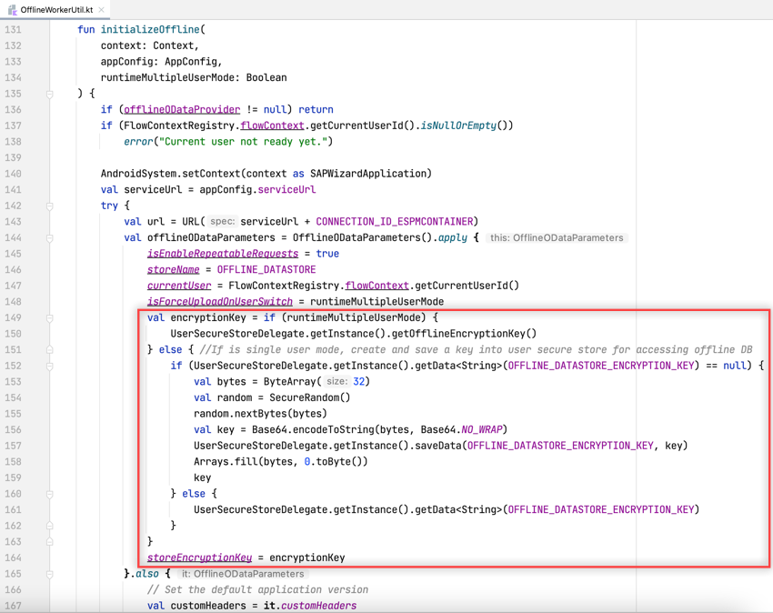

[OPTION END]

[DONE]
[ACCORDION-END]

[ACCORDION-BEGIN [Step 3: ](Examine the defining queries)]

>Make sure you are selecting the right language above.

[OPTION BEGIN [Java]]
The offline store is populated based on objects called in using `OfflineODataDefiningQuery`. The defining queries are located in `OfflineWorkerUtil.java`, in the `initializeOffline` method.

```Java
OfflineODataDefiningQuery customersQuery = new OfflineODataDefiningQuery("Customers", "Customers", false);
OfflineODataDefiningQuery productsQuery = new OfflineODataDefiningQuery("Products", "Products", true);
```

[OPTION END]

[OPTION BEGIN [Kotlin]]
The offline store is populated based on objects called in using `OfflineODataDefiningQuery`. The defining queries are located in `OfflineWorkerUtil.kt`, in the `initializeOffline` method.

```Kotlin
val customersQuery = OfflineODataDefiningQuery("Customers", "Customers", false)
val productsQuery = OfflineODataDefiningQuery("Products", "Products", true)
```

[OPTION END]

Defining queries tell the `OfflineODataProvider` (the class that manages the offline store) which entity sets to store on the device. In the case of the wizard-generated application, there is a defining query for each available entity by default, meaning that each entity is stored offline and available if the user doesn't have an internet connection. For more information, see [Defining Queries](https://help.sap.com/doc/f53c64b93e5140918d676b927a3cd65b/Cloud/en-US/docs-en/guides/features/offline/common/defining-an-application-configuration-file/defining-queries.html).

>With an offline-enabled app, requests made against the entity sets that are included in the defining requests will always be fulfilled from the local offline store.

[VALIDATE_1]
[ACCORDION-END]

[ACCORDION-BEGIN [Step 4: ](Examine the offline service and service manager)]

>Make sure you are selecting the right language above.

The application allows users to make changes against a local offline store and synchronize manually at any time. The sync operation is performed by a [worker](https://developer.android.com/topic/libraries/architecture/workmanager/basics). There are three operations that must be implemented in order to use the offline store functionality: `open`, `download`, and `upload`. As their names suggest, the operations open the offline store, download server changes, and upload user changes, respectively. In the wizard-generated application, `OfflineOpenWorker` implements `open` during initialization and `OfflineSyncWorker` implements a sync operation, which requires `download` first, and then `upload`.

[OPTION BEGIN [Java]]

1.  In Android Studio, on Windows, press **`Ctrl+N`**, or, on a Mac, press **`command+O`**, and type **`OfflineOpenWorker`** to open `OfflineOpenWorker.java` and examine the `open` method.

    !

    The worker's work is to call the `open` method of the `OfflineODataProvider` class to perform the open operation and pass the given callbacks through.

    The `OfflineOpenWorker` class is called by `open` method in `OfflineWorkerUtil.java` which is called by `WizardFlowStateListener` when the user logs into the application.

    !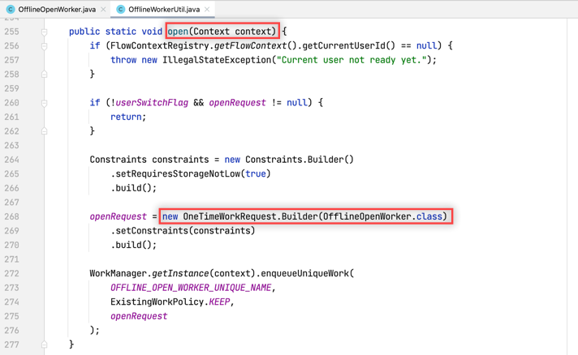

    !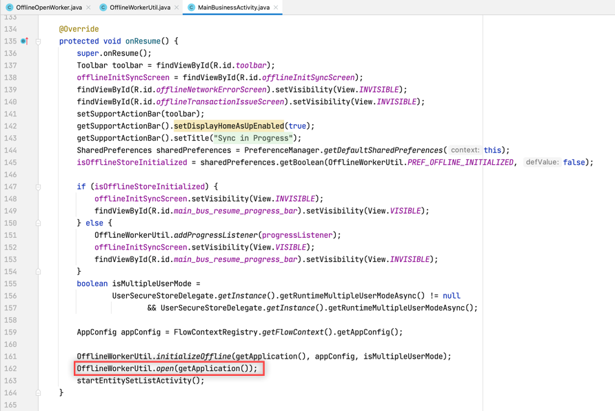

2.  In Android Studio, on Windows, press **`Ctrl+N`**, or, on a Mac, press **`command+O`**, and type **`OfflineSyncWorker`** to open `OfflineSyncWorker.java` and examine the `download` and `upload` methods.

    !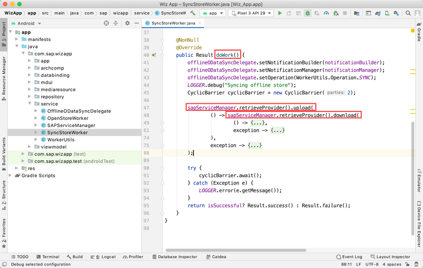

    The worker's work is to call the `download` and `upload` method of the `OfflineODataProvider` class to perform the sync operation and pass the given callbacks through.

    The `OfflineSyncWorker` class is called by the `sync` method in `OfflineWorkerUtil.java`, which is called by `EntitySetListActivity` when the user wants to perform a sync. When an entity is created locally in the offline store, its primary key is left unset. This is because when the user performs an `upload`, the server will set the primary key for the client. An `upload` and a `download` are normally performed together because the `download` may return updated values from the server, such as a newly-created primary key.

    !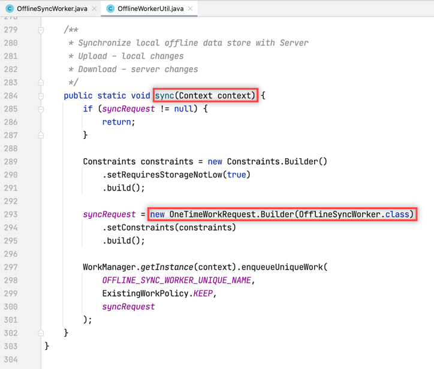

    !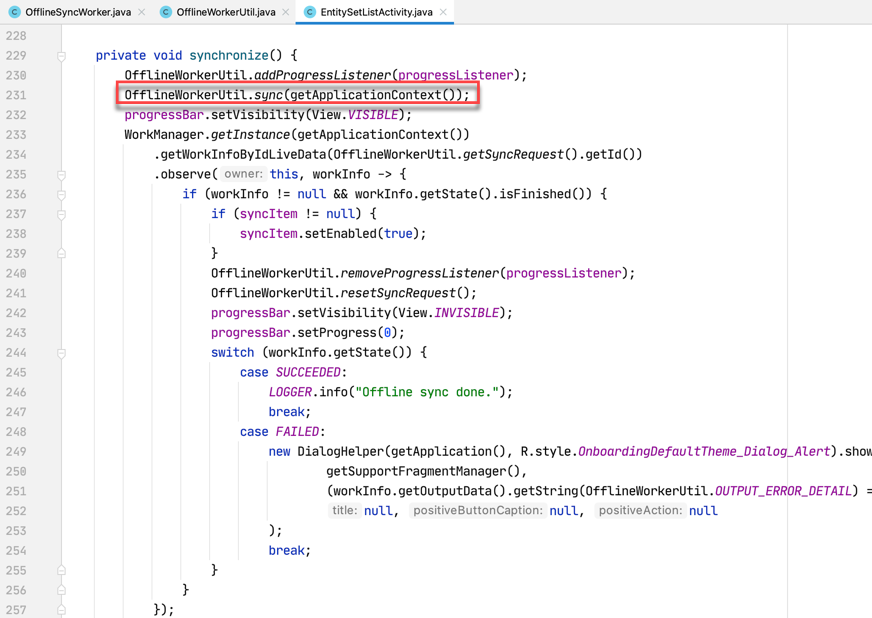

[OPTION END]

[OPTION BEGIN [Kotlin]]

1.  In Android Studio, on Windows, press **`Ctrl+N`**, or, on a Mac, press **`command+O`**, and type **`OfflineOpenWorker`** to open `OfflineOpenWorker.kt` and examine the `open` method.

    !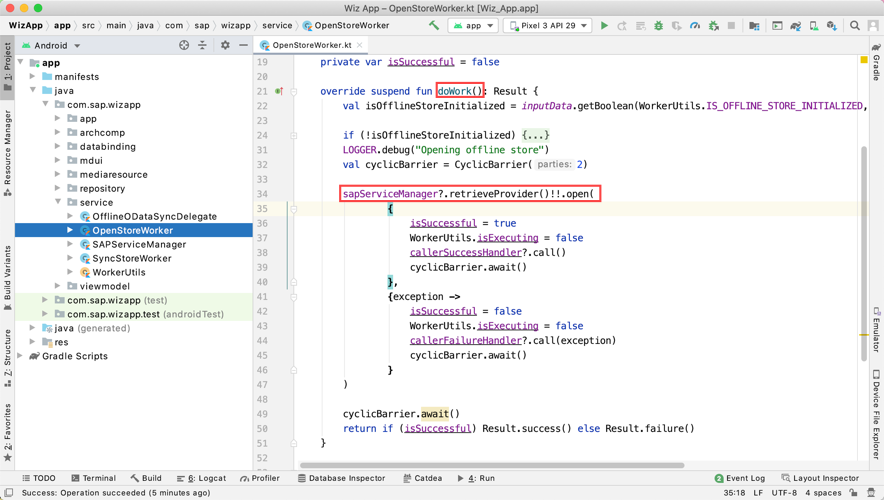

    The worker's work is to call the `open` method of the `OfflineODataProvider` class to perform the open operation and pass the given callbacks through.

    The `OfflineOpenWorker` class is called by `open` method in `OfflineWorkerUtil.kt` which is called by `WizardFlowStateListener` when the user logs into the application.

    !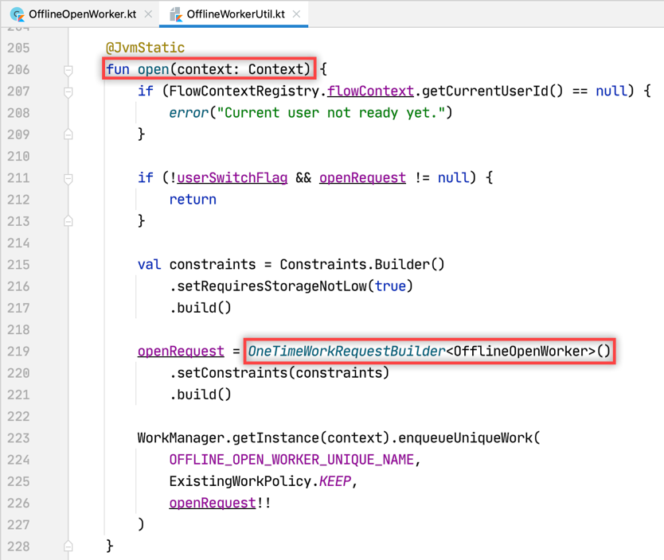

    !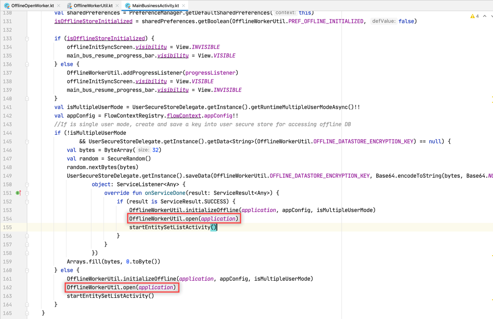

2.  In Android Studio, on Windows, press **`Ctrl+N`**, or, on a Mac, press **`command+O`**, and type **`OfflineSyncWorker`** to open `OfflineSyncWorker.kt` and examine the `download` and `upload` methods.

    !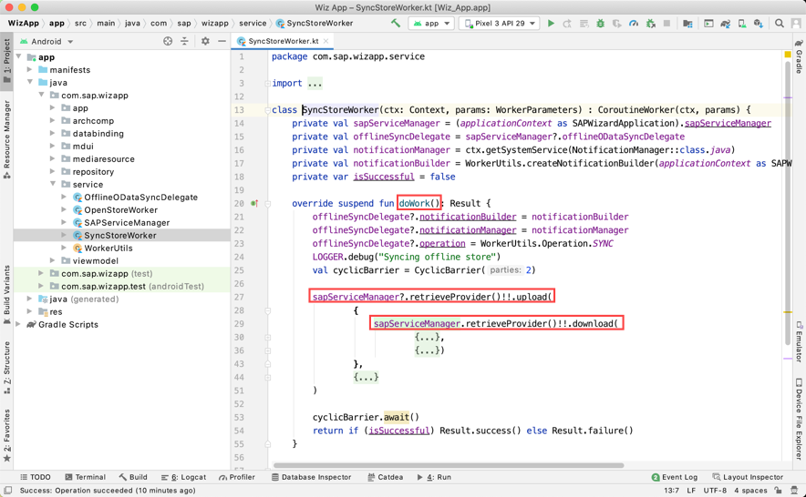

    The worker's work is to call the `download` and `upload` method of the `OfflineODataProvider` class to perform the sync operation and pass the given callbacks through.

    The `OfflineSyncWorker` class is called by the `sync` method in `OfflineWorkerUtil.kt`, which is called by `EntitySetListActivity` when the user wants to perform a sync. When an entity is created locally in the offline store, its primary key is left unset. This is because when the user performs an `upload`, the server will set the primary key for the client. An `upload` and a `download` are normally performed together because the `download` may return updated values from the server, such as a newly-created primary key.

    !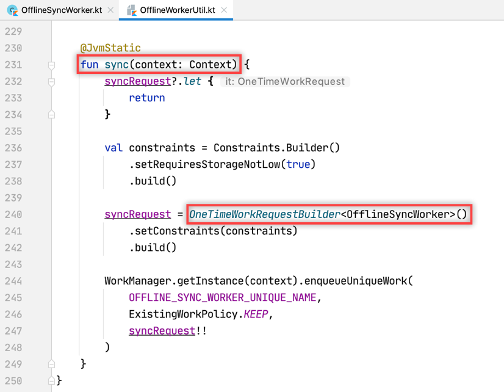

    !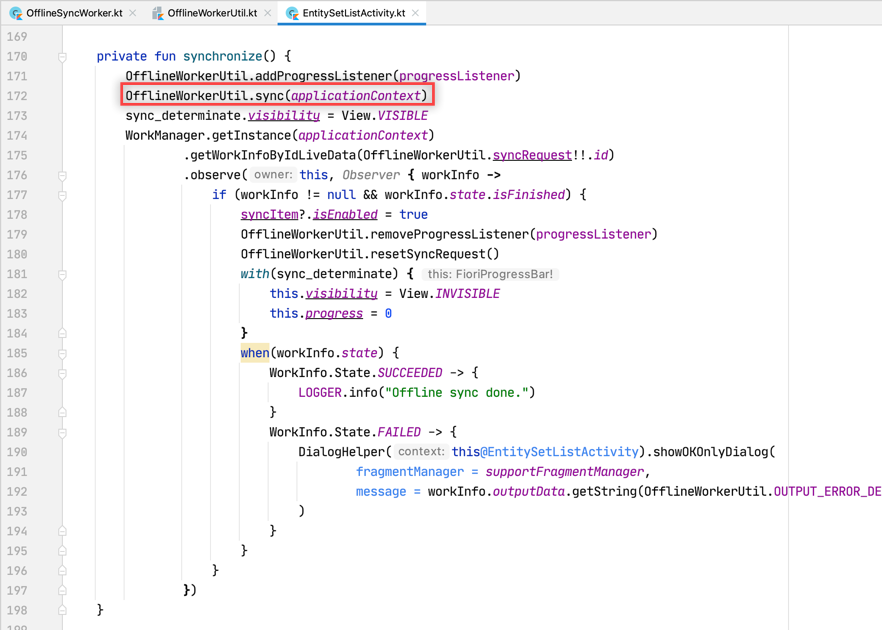

[OPTION END]

For more information about how the offline store works, see the [Working With Offline Stores](https://help.sap.com/doc/f53c64b93e5140918d676b927a3cd65b/Cloud/en-US/docs-en/guides/features/offline/common/working-with-offline-stores.html).

[VALIDATE_2]
[ACCORDION-END]

[ACCORDION-BEGIN [Step 5: ](Introduce a synchronization error)]

When syncing changes made while offline, conflicts can occur. One example might be if two people attempted to update a description field for the same product. Another might be updating a record that was deleted by another user. The [`ErrorArchive`](https://help.sap.com/doc/f53c64b93e5140918d676b927a3cd65b/Cloud/en-US/docs-en/guides/features/offline/common/handling-errors-and-conflicts/accessing-errorarchive.html) provides a way to see details of any of the conflicts that may have occurred. The following instructions demonstrate how to use `ErrorArchive`.

1.  Update a **SalesOrderItem** and change its quantity to be zero and save it. Update a second item and change its quantity to a different non-zero number and save it.

    !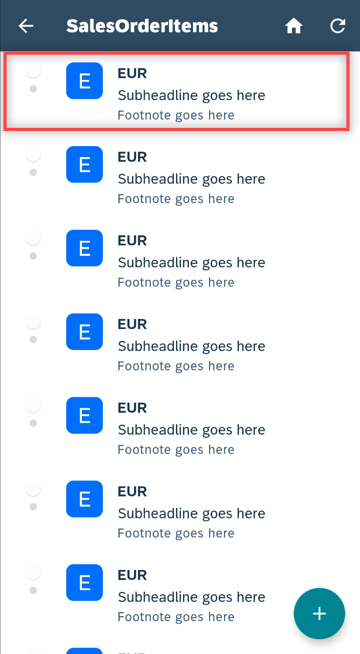

    !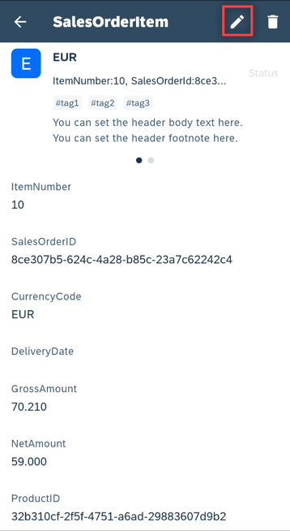

    !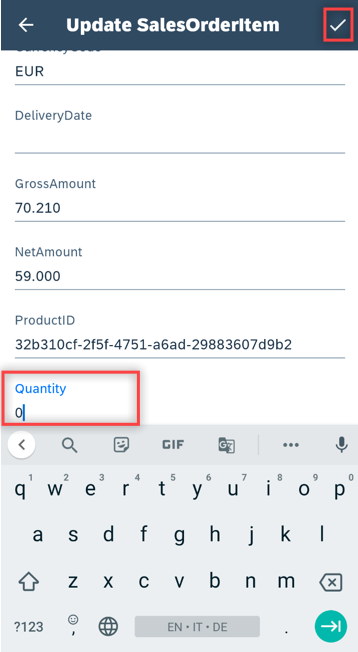

    Notice that the items are now marked with a yellow indicator to indicate that an item has been locally modified but not yet synced.

    !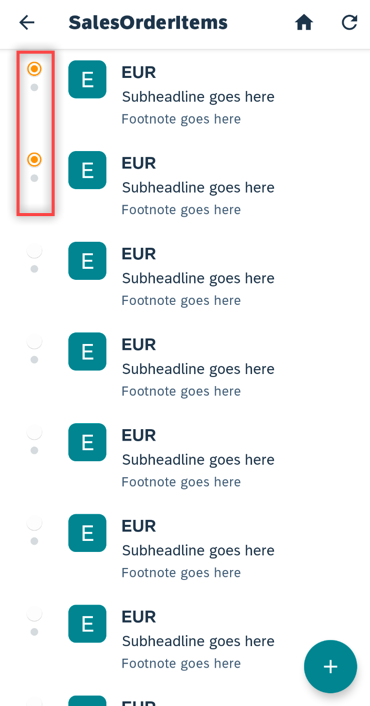

2.  Attempt a sync, and you'll notice that the sync completes, but if you examine the **SalesOrderItems** list, one item has a red mark beside it, indicating it is in an error state. This is because the back end has a check that **SalesOrderItems** cannot have zero for their quantity. This check does not exist in the local offline store, so the update succeeds locally but fails when the offline store is synced.

    !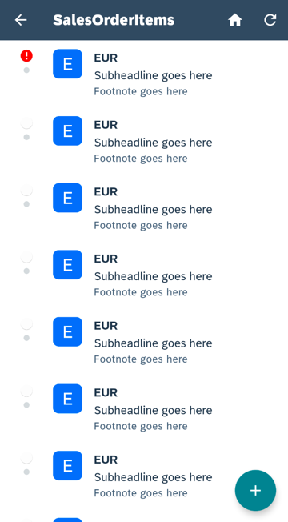

[DONE]
[ACCORDION-END]

[ACCORDION-BEGIN [Step 6: ](Display ErrorArchive details)]

In this section we will create an **Error Information** screen that displays the details from the `ErrorArchive`.

[OPTION BEGIN [Java]]

1.  Press **`Shift`** twice and type **`strings.xml`** to open `res\values\strings.xml`.

2.  Add the following values.

    ```XML
    <string name="error_header">Error Information</string>
    <string name="request_method">Request Method</string>
    <string name="request_status">Request Status</string>
    <string name="request_message">Request Message</string>
    <string name="request_body">Request Body</string>
    <string name="request_url">Request URL</string>
    ```

3.  Create a new activity in the `app/java/com.sap.wizapp/mdui` folder by right-clicking, then selecting **New** > **Activity** > **Empty Activity**. Name the new activity **`ErrorActivity`**.

4.  Press **`Shift`** twice and type **`activity_error`** to open `res/layout/activity_error.xml`.

5.  Replace its contents with the following XML.

    ```XML
    <?xml version="1.0" encoding="utf-8"?>
    <LinearLayout xmlns:android="http://schemas.android.com/apk/res/android"
        xmlns:app="http://schemas.android.com/apk/res-auto"
        xmlns:tools="http://schemas.android.com/tools"
        android:layout_width="match_parent"
        android:layout_height="match_parent"
        tools:context=".mdui.ErrorActivity"
        android:orientation="vertical">

        <com.google.android.material.appbar.AppBarLayout
            android:id="@+id/app_bar"
            android:layout_width="match_parent"
            android:layout_height="wrap_content"
            android:theme="@style/AppTheme.AppBarOverlay">

            <androidx.appcompat.widget.Toolbar
                android:id="@+id/toolbar"
                android:layout_width="match_parent"
                android:layout_height="?attr/actionBarSize"
                app:popupTheme="@style/AppTheme.PopupOverlay"
                app:titleTextColor="@color/colorWhite" />

        </com.google.android.material.appbar.AppBarLayout>

        <ScrollView
            xmlns:android="http://schemas.android.com/apk/res/android"
            android:layout_height="wrap_content"
            android:layout_width="match_parent">

            <LinearLayout
                xmlns:android="http://schemas.android.com/apk/res/android"
                android:layout_height="wrap_content"
                android:layout_width="match_parent"
                android:orientation="vertical">

                <TextView
                    android:layout_width="match_parent"
                    android:layout_height="wrap_content"
                    android:padding="@dimen/key_line_16dp"
                    style="@style/Test.ObjectCell.Headline"
                    android:text="@string/error_header"/>

                <View
                    android:layout_width="match_parent"
                    android:layout_marginTop="@dimen/key_line_16dp"
                    android:layout_height="1dp"
                    android:background="?android:attr/listDivider" />

                <TextView
                    android:layout_width="match_parent"
                    android:layout_height="wrap_content"
                    android:padding="@dimen/key_line_16dp"
                    style="@style/FioriTextStyle.OVERLINE"
                    android:text="@string/request_message"/>

                <TextView
                    android:id="@+id/requestMessageTextView"
                    android:layout_width="match_parent"
                    android:layout_height="wrap_content"
                    android:paddingLeft="@dimen/key_line_16dp"
                    android:paddingRight="@dimen/key_line_16dp"
                    style="@style/TextAppearance.Fiori.Subtitle1"
                    android:singleLine="false"
                    android:text="@string/request_message"/>

                <View
                    android:layout_width="match_parent"
                    android:layout_marginTop="@dimen/key_line_16dp"
                    android:layout_height="1dp"
                    android:background="?android:attr/listDivider" />

                <TextView
                    android:layout_width="match_parent"
                    android:layout_height="wrap_content"
                    android:padding="@dimen/key_line_16dp"
                    style="@style/FioriTextStyle.OVERLINE"
                    android:text="@string/request_body"/>

                <TextView
                    android:id="@+id/requestBodyTextView"
                    android:layout_width="match_parent"
                    android:layout_height="wrap_content"
                    android:paddingLeft="@dimen/key_line_16dp"
                    android:paddingRight="@dimen/key_line_16dp"
                    style="@style/TextAppearance.Fiori.Subtitle1"
                    android:singleLine="false"
                    android:text="@string/request_body"/>

                <View
                    android:layout_width="match_parent"
                    android:layout_marginTop="@dimen/key_line_16dp"
                    android:layout_height="1dp"
                    android:background="?android:attr/listDivider" />

                <TextView
                    android:layout_width="match_parent"
                    android:layout_height="wrap_content"
                    android:padding="@dimen/key_line_16dp"
                    style="@style/FioriTextStyle.OVERLINE"
                    android:text="@string/request_url"/>

                <TextView
                    android:id="@+id/requestURLTextView"
                    android:layout_width="match_parent"
                    android:layout_height="wrap_content"
                    android:paddingLeft="@dimen/key_line_16dp"
                    android:paddingRight="@dimen/key_line_16dp"
                    style="@style/TextAppearance.Fiori.Subtitle1"
                    android:singleLine="false"
                    android:text="@string/request_url"/>

                <View
                    android:layout_width="match_parent"
                    android:layout_marginTop="@dimen/key_line_16dp"
                    android:layout_height="1dp"
                    android:background="?android:attr/listDivider" />

                <View
                    android:layout_width="match_parent"
                    android:layout_height="1dp"
                    android:background="?android:attr/listDivider" />

                <TextView
                    android:layout_width="match_parent"
                    android:layout_height="wrap_content"
                    android:padding="@dimen/key_line_16dp"
                    style="@style/FioriTextStyle.OVERLINE"
                    android:text="@string/request_status"/>

                <TextView
                    android:id="@+id/requestStatusTextView"
                    android:layout_width="match_parent"
                    android:layout_height="wrap_content"
                    android:paddingLeft="@dimen/key_line_16dp"
                    style="@style/TextAppearance.Fiori.Subtitle1"
                    android:text="@string/request_status"/>

                <View
                    android:layout_width="match_parent"
                    android:layout_marginTop="@dimen/key_line_16dp"
                    android:layout_height="1dp"
                    android:background="?android:attr/listDivider" />

                <TextView
                    android:layout_width="match_parent"
                    android:layout_height="wrap_content"
                    android:padding="@dimen/key_line_16dp"
                    style="@style/FioriTextStyle.OVERLINE"
                    android:text="@string/request_method"/>

                <TextView
                    android:id="@+id/requestMethodTextView"
                    android:layout_width="match_parent"
                    android:layout_height="wrap_content"
                    android:paddingLeft="@dimen/key_line_16dp"
                    style="@style/TextAppearance.Fiori.Subtitle1"
                    android:text="@string/request_method"/>

                <View
                    android:layout_width="match_parent"
                    android:layout_marginTop="@dimen/key_line_16dp"
                    android:layout_height="1dp"
                    android:background="?android:attr/listDivider" />
            </LinearLayout>
        </ScrollView>
    </LinearLayout>
    ```

6.  Replace the `ErrorActivity.java` generated activity code with the following code.

    In the package statement and the import, if needed, replace `com.sap.wizapp` with the package name of your project.

    ```Java
    package com.sap.wizapp.mdui;

    import androidx.appcompat.app.AppCompatActivity;
    import androidx.appcompat.widget.Toolbar;
    import android.os.Bundle;
    import android.view.MenuItem;
    import android.widget.TextView;

    import com.sap.wizapp.R;

    public class ErrorActivity extends AppCompatActivity {

        @Override
        protected void onCreate(Bundle savedInstanceState) {
            super.onCreate(savedInstanceState);
            setContentView(R.layout.activity_error);
            Toolbar toolbar = findViewById(R.id.toolbar);
            setSupportActionBar(toolbar);
            getSupportActionBar().setDisplayHomeAsUpEnabled(true);
            int errorCode = getIntent().getIntExtra("ERROR_CODE", 0);
            String errorMethod = getIntent().getStringExtra("ERROR_METHOD");
            String requestURL = getIntent().getStringExtra("ERROR_URL");
            String errorMessage = getIntent().getStringExtra("ERROR_MESSAGE");
            String body = getIntent().getStringExtra("ERROR_BODY");
            ((TextView) (findViewById(R.id.requestStatusTextView))).setText("" + errorCode);

            if (errorMethod != null) {
                ((TextView) (findViewById(R.id.requestMethodTextView))).setText(errorMethod);
            }
            if (requestURL != null) {
                ((TextView) (findViewById(R.id.requestURLTextView))).setText(requestURL);
            }
            if (errorMessage != null) {
                ((TextView) (findViewById(R.id.requestMessageTextView))).setText(errorMessage);
            }
            if (body != null) {
                ((TextView) (findViewById(R.id.requestBodyTextView))).setText(body);
            }
        }

        @Override
        public boolean onOptionsItemSelected(MenuItem item) {
            finish();
            return super.onOptionsItemSelected(item);
        }
    }
    ```

7.  On Windows, press **`Ctrl+N`**, or, on a Mac, press **`command+O`**, and type **`EntitySetListActivity`** to open `EntitySetListActivity.java`.

8.  In the `synchronize` method, find the line that performs the `OfflineWorkerUtil.sync` method call.

    !

9.  Right after the `progressBar.setVisibility(View.INVISIBLE);` line, in the `SUCCEEDED` case of sync work state, add the following code, which queries the error archive and displays information to the user about the first error encountered:

    ```Java
    OfflineODataProvider provider = OfflineWorkerUtil.getOfflineODataProvider();
    try {
        List<OfflineODataErrorArchiveEntity> errorArchive = provider.getErrorArchive();

        for (OfflineODataErrorArchiveEntity errorEntity : errorArchive) {
            String requestURL = errorEntity.getRequestURL();
            String method = errorEntity.getRequestMethod();
            String message = errorEntity.getMessage();
            Integer statusCode = errorEntity.getHttpStatusCode() != null  ?  errorEntity.getHttpStatusCode() : 0;
            String body = errorEntity.getRequestBody();

            LOGGER.error("RequestURL: " + requestURL);
            LOGGER.error("HTTP Status Code: " + statusCode);
            LOGGER.error("Method: " + method);
            LOGGER.error("Message: " + message);
            LOGGER.error("Body: " + body);

            Intent errorIntent = new Intent(EntitySetListActivity.this, ErrorActivity.class);
            errorIntent.putExtra("ERROR_URL", requestURL);
            errorIntent.putExtra("ERROR_CODE", statusCode);
            errorIntent.putExtra("ERROR_METHOD", method);
            errorIntent.putExtra("ERROR_BODY", body);
            try {
                JSONObject jsonObj = new JSONObject(message);
                errorIntent.putExtra("ERROR_MESSAGE", jsonObj.getJSONObject("error").getString("message"));
            } catch (JSONException e) {
                e.printStackTrace();
            }

            // Reverts all failing entities to the previous state or set
            // offlineODataParameters.setEnableIndividualErrorArchiveDeletion(true);
            // to cause the deleteEntity call to only revert the specified entity
            // https://help.sap.com/doc/f53c64b93e5140918d676b927a3cd65b/Cloud/en-US/docs-en/guides/features/offline/common/handling-failed-requests/reverting-error-state.html
            // provider.deleteEntity(errorEntity, null, null);
            startActivity(errorIntent);
            break; //For simplicity, only show the first error encountered
        }
    } catch (OfflineODataException e) {
        e.printStackTrace();
    }
    ```

    After modification, the `SUCCEEDED` block should look like this:

    ```Java
    case SUCCEEDED:
      LOGGER.info("Offline sync done.");
      OfflineODataProvider provider = OfflineWorkerUtil.getOfflineODataProvider();
      try {
          List<OfflineODataErrorArchiveEntity> errorArchive = provider.getErrorArchive();

          for (OfflineODataErrorArchiveEntity errorEntity : errorArchive) {
              String requestURL = errorEntity.getRequestURL();
              String method = errorEntity.getRequestMethod();
              String message = errorEntity.getMessage();
              Integer statusCode = errorEntity.getHttpStatusCode() != null  ?  errorEntity.getHttpStatusCode() : 0;
              String body = errorEntity.getRequestBody();

              LOGGER.error("RequestURL: " + requestURL);
              LOGGER.error("HTTP Status Code: " + statusCode);
              LOGGER.error("Method: " + method);
              LOGGER.error("Message: " + message);
              LOGGER.error("Body: " + body);

              Intent errorIntent = new Intent(EntitySetListActivity.this, ErrorActivity.class);
              errorIntent.putExtra("ERROR_URL", requestURL);
              errorIntent.putExtra("ERROR_CODE", statusCode);
              errorIntent.putExtra("ERROR_METHOD", method);
              errorIntent.putExtra("ERROR_BODY", body);
              try {
                  JSONObject jsonObj = new JSONObject(message);
                  errorIntent.putExtra("ERROR_MESSAGE", jsonObj.getJSONObject("error").getString("message"));
              } catch (JSONException e) {
                  e.printStackTrace();
              }

              // Reverts all failing entities to the previous state or set
              // offlineODataParameters.setEnableIndividualErrorArchiveDeletion(true);
              // to cause the deleteEntity call to only revert the specified entity
              // https://help.sap.com/doc/f53c64b93e5140918d676b927a3cd65b/Cloud/en-US/docs-en/guides/features/offline/common/handling-failed-requests/reverting-error-state.html
              // provider.deleteEntity(errorEntity, null, null);
              startActivity(errorIntent);
              break; //For simplicity, only show the first error encountered
          }
      } catch (OfflineODataException e) {
          e.printStackTrace();
      }
      break;
    ```

10.  Run the app again, and re-attempt the sync. When the sync fails, you should see the following error screen.

    !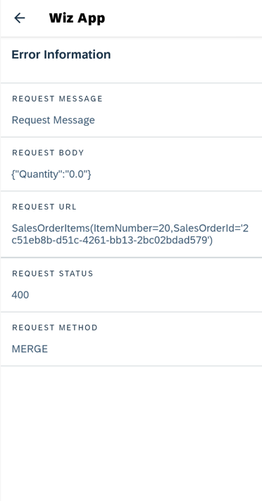

    You can see that the HTTP status code, method, and message are included. When the application attempted a sync, the entity being updated didn't pass the backend checks, produced a `DataServiceException`, and is now in the error state. All entities that did not produce errors are successfully synced. One way to correct the exception would be to change the quantity from 0 to a valid positive number. Another would be to delete the `ErrorArchive` entry, reverting the entity to its previous state. For more information on error handling, see [Handling Errors and Conflicts](https://help.sap.com/doc/f53c64b93e5140918d676b927a3cd65b/Cloud/en-US/docs-en/guides/features/offline/common/handling-errors-and-conflicts/handling-errors-and-conflicts.html) and [Handling Failed Requests](https://help.sap.com/doc/f53c64b93e5140918d676b927a3cd65b/Cloud/en-US/docs-en/guides/features/offline/common/handling-failed-requests/handling-failed-requests.html).

[OPTION END]

[OPTION BEGIN [Kotlin]]

1.  Press **`Shift`** twice and type **`strings.xml`** to open `res\values\strings.xml`.

2.  Add the following values.

    ```XML
    <string name="error_header">Error Information</string>
    <string name="request_method">Request Method</string>
    <string name="request_status">Request Status</string>
    <string name="request_message">Request Message</string>
    <string name="request_body">Request Body</string>
    <string name="request_url">Request URL</string>
    ```

3.  Create a new activity in the `app/java/com.sap.wizapp/mdui` folder by right-clicking, then selecting **New** > **Activity** > **Empty Activity**. Name the new activity **`ErrorActivity`**.

4.  Press **`Shift`** twice and type **`activity_error`** to open `res/layout/activity_error.xml`.

5.  Replace its contents with the following XML.

    ```XML
    <?xml version="1.0" encoding="utf-8"?>
    <LinearLayout xmlns:android="http://schemas.android.com/apk/res/android"
        xmlns:app="http://schemas.android.com/apk/res-auto"
        xmlns:tools="http://schemas.android.com/tools"
        android:layout_width="match_parent"
        android:layout_height="match_parent"
        tools:context=".mdui.ErrorActivity"
        android:orientation="vertical">

        <com.google.android.material.appbar.AppBarLayout
            android:id="@+id/app_bar"
            android:layout_width="match_parent"
            android:layout_height="wrap_content"
            android:theme="@style/AppTheme.AppBarOverlay">

            <androidx.appcompat.widget.Toolbar
                android:id="@+id/toolbar"
                android:layout_width="match_parent"
                android:layout_height="?attr/actionBarSize"
                app:popupTheme="@style/AppTheme.PopupOverlay"
                app:titleTextColor="@color/colorWhite" />

        </com.google.android.material.appbar.AppBarLayout>

        <ScrollView
            xmlns:android="http://schemas.android.com/apk/res/android"
            android:layout_height="wrap_content"
            android:layout_width="match_parent">

            <LinearLayout
                xmlns:android="http://schemas.android.com/apk/res/android"
                android:layout_height="wrap_content"
                android:layout_width="match_parent"
                android:orientation="vertical">

                <TextView
                    android:layout_width="match_parent"
                    android:layout_height="wrap_content"
                    android:padding="@dimen/key_line_16dp"
                    style="@style/Test.ObjectCell.Headline"
                    android:text="@string/error_header"/>

                <View
                    android:layout_width="match_parent"
                    android:layout_marginTop="@dimen/key_line_16dp"
                    android:layout_height="1dp"
                    android:background="?android:attr/listDivider" />

                <TextView
                    android:layout_width="match_parent"
                    android:layout_height="wrap_content"
                    android:padding="@dimen/key_line_16dp"
                    style="@style/FioriTextStyle.OVERLINE"
                    android:text="@string/request_message"/>

                <TextView
                    android:id="@+id/requestMessageTextView"
                    android:layout_width="match_parent"
                    android:layout_height="wrap_content"
                    android:paddingLeft="@dimen/key_line_16dp"
                    android:paddingRight="@dimen/key_line_16dp"
                    style="@style/TextAppearance.Fiori.Subtitle1"
                    android:singleLine="false"
                    android:text="@string/request_message"/>

                <View
                    android:layout_width="match_parent"
                    android:layout_marginTop="@dimen/key_line_16dp"
                    android:layout_height="1dp"
                    android:background="?android:attr/listDivider" />

                <TextView
                    android:layout_width="match_parent"
                    android:layout_height="wrap_content"
                    android:padding="@dimen/key_line_16dp"
                    style="@style/FioriTextStyle.OVERLINE"
                    android:text="@string/request_body"/>

                <TextView
                    android:id="@+id/requestBodyTextView"
                    android:layout_width="match_parent"
                    android:layout_height="wrap_content"
                    android:paddingLeft="@dimen/key_line_16dp"
                    android:paddingRight="@dimen/key_line_16dp"
                    style="@style/TextAppearance.Fiori.Subtitle1"
                    android:singleLine="false"
                    android:text="@string/request_body"/>

                <View
                    android:layout_width="match_parent"
                    android:layout_marginTop="@dimen/key_line_16dp"
                    android:layout_height="1dp"
                    android:background="?android:attr/listDivider" />

                <TextView
                    android:layout_width="match_parent"
                    android:layout_height="wrap_content"
                    android:padding="@dimen/key_line_16dp"
                    style="@style/FioriTextStyle.OVERLINE"
                    android:text="@string/request_url"/>

                <TextView
                    android:id="@+id/requestURLTextView"
                    android:layout_width="match_parent"
                    android:layout_height="wrap_content"
                    android:paddingLeft="@dimen/key_line_16dp"
                    android:paddingRight="@dimen/key_line_16dp"
                    style="@style/TextAppearance.Fiori.Subtitle1"
                    android:singleLine="false"
                    android:text="@string/request_url"/>

                <View
                    android:layout_width="match_parent"
                    android:layout_marginTop="@dimen/key_line_16dp"
                    android:layout_height="1dp"
                    android:background="?android:attr/listDivider" />

                <View
                    android:layout_width="match_parent"
                    android:layout_height="1dp"
                    android:background="?android:attr/listDivider" />

                <TextView
                    android:layout_width="match_parent"
                    android:layout_height="wrap_content"
                    android:padding="@dimen/key_line_16dp"
                    style="@style/FioriTextStyle.OVERLINE"
                    android:text="@string/request_status"/>

                <TextView
                    android:id="@+id/requestStatusTextView"
                    android:layout_width="match_parent"
                    android:layout_height="wrap_content"
                    android:paddingLeft="@dimen/key_line_16dp"
                    style="@style/TextAppearance.Fiori.Subtitle1"
                    android:text="@string/request_status"/>

                <View
                    android:layout_width="match_parent"
                    android:layout_marginTop="@dimen/key_line_16dp"
                    android:layout_height="1dp"
                    android:background="?android:attr/listDivider" />

                <TextView
                    android:layout_width="match_parent"
                    android:layout_height="wrap_content"
                    android:padding="@dimen/key_line_16dp"
                    style="@style/FioriTextStyle.OVERLINE"
                    android:text="@string/request_method"/>

                <TextView
                    android:id="@+id/requestMethodTextView"
                    android:layout_width="match_parent"
                    android:layout_height="wrap_content"
                    android:paddingLeft="@dimen/key_line_16dp"
                    style="@style/TextAppearance.Fiori.Subtitle1"
                    android:text="@string/request_method"/>

                <View
                    android:layout_width="match_parent"
                    android:layout_marginTop="@dimen/key_line_16dp"
                    android:layout_height="1dp"
                    android:background="?android:attr/listDivider" />
            </LinearLayout>
        </ScrollView>
    </LinearLayout>
    ```

6.  Replace the `ErrorActivity.kt` generated activity code with the following code.

    In the package statement and the import, if needed, replace `com.sap.wizapp` with the package name of your project.

    ```Kotlin
    package com.sap.wizapp.mdui

    import androidx.appcompat.app.AppCompatActivity
    import android.os.Bundle
    import android.view.MenuItem
    import android.view.View
    import android.widget.TextView

    import com.sap.wizapp.R

    class ErrorActivity : AppCompatActivity() {

        override fun onCreate(savedInstanceState: Bundle?) {
            super.onCreate(savedInstanceState)
            setContentView(R.layout.activity_error)
            setSupportActionBar(findViewById(R.id.toolbar))
            supportActionBar!!.setDisplayHomeAsUpEnabled(true)
            val errorCode = intent.getIntExtra("ERROR_CODE", 0)
            val errorMethod = intent.getStringExtra("ERROR_METHOD")
            val requestURL = intent.getStringExtra("ERROR_URL")
            val errorMessage = intent.getStringExtra("ERROR_MESSAGE")
            val body = intent.getStringExtra("ERROR_BODY")
            (findViewById<View>(R.id.requestStatusTextView) as TextView).text = "".plus(errorCode)

            errorMethod?.let {
                (findViewById<View>(R.id.requestMethodTextView) as TextView).text = it
            }
            requestURL?.let {
                (findViewById<View>(R.id.requestURLTextView) as TextView).text = it
            }
            errorMessage?.let {
                (findViewById<View>(R.id.requestMessageTextView) as TextView).text = it
            }
            body?.let {
                (findViewById<View>(R.id.requestBodyTextView) as TextView).text = it
            }
        }

        override fun onOptionsItemSelected(item: MenuItem): Boolean {
            finish()
            return super.onOptionsItemSelected(item)
        }
    }

    ```

7.  On Windows, press **`Ctrl+N`**, or, on a Mac, press **`command+O`**, and type **`EntitySetListActivity`** to open `EntitySetListActivity.kt`.

8.  In the `synchronize` method, find the line that performs the `OfflineWorkerUtil.sync` method call.

    !

9.  Right after the `sync_determinate.visibility = View.INVISIBLE` line, in the `WorkInfo.State.SUCCEEDED` block, add the following code, which queries the error archive and displays information to the user about the first error encountered:

    ```Kotlin
    val provider = OfflineWorkerUtil.offlineODataProvider

    try {
        val errorArchive = provider!!.errorArchive

        for (errorEntity in errorArchive) {
            val requestURL = errorEntity.requestURL
            val method = errorEntity.requestMethod
            val message = errorEntity.message
            val statusCode = errorEntity.httpStatusCode ?: 0
            val body = errorEntity.requestBody

            LOGGER.error("RequestURL: $requestURL")
            LOGGER.error("HTTP Status Code: $statusCode")
            LOGGER.error("Method: $method")
            LOGGER.error("Message: $message")
            LOGGER.error("Body: $body")

            val errorIntent = Intent(this@EntitySetListActivity, ErrorActivity::class.java)

            errorIntent.putExtra("ERROR_URL", requestURL)
            errorIntent.putExtra("ERROR_CODE", statusCode)
            errorIntent.putExtra("ERROR_METHOD", method)
            errorIntent.putExtra("ERROR_BODY", body)

            try {
                val jsonObj = JSONObject(message)
                errorIntent.putExtra("ERROR_MESSAGE", jsonObj.getJSONObject("error").getString("message"))
            } catch (e: JSONException) {
                e.printStackTrace()
            }

            // Reverts all failing entities to the previous state or set
            // offlineODataParameters.setEnableIndividualErrorArchiveDeletion(true);
            // to cause the deleteEntity call to only revert the specified entity
            // https://help.sap.com/doc/f53c64b93e5140918d676b927a3cd65b/Cloud/en-US/docs-en/guides/features/offline/common/handling-failed-requests/reverting-error-state.html
            // provider.deleteEntity(errorEntity, null, null);
            startActivity(errorIntent)
            break //For simplicity, only show the first error encountered
        }
    } catch (e: OfflineODataException) {
        e.printStackTrace()
    }
    ```

    After modification, the `WorkInfo.State.SUCCEEDED` block should look like this:

    ```Kotlin
    WorkInfo.State.SUCCEEDED -> {
        LOGGER.info("Offline sync done.")
        val provider = OfflineWorkerUtil.offlineODataProvider

        try {
            val errorArchive = provider!!.errorArchive

            for (errorEntity in errorArchive) {
                val requestURL = errorEntity.requestURL
                val method = errorEntity.requestMethod
                val message = errorEntity.message
                val statusCode = errorEntity.httpStatusCode ?: 0
                val body = errorEntity.requestBody

                LOGGER.error("RequestURL: $requestURL")
                LOGGER.error("HTTP Status Code: $statusCode")
                LOGGER.error("Method: $method")
                LOGGER.error("Message: $message")
                LOGGER.error("Body: $body")

                val errorIntent = Intent(this@EntitySetListActivity, ErrorActivity::class.java)

                errorIntent.putExtra("ERROR_URL", requestURL)
                errorIntent.putExtra("ERROR_CODE", statusCode)
                errorIntent.putExtra("ERROR_METHOD", method)
                errorIntent.putExtra("ERROR_BODY", body)

                try {
                    val jsonObj = JSONObject(message)
                    errorIntent.putExtra("ERROR_MESSAGE", jsonObj.getJSONObject("error").getString("message"))
                } catch (e: JSONException) {
                    e.printStackTrace()
                }

                // Reverts all failing entities to the previous state or set
                // offlineODataParameters.setEnableIndividualErrorArchiveDeletion(true);
                // to cause the deleteEntity call to only revert the specified entity
                // https://help.sap.com/doc/f53c64b93e5140918d676b927a3cd65b/Cloud/en-US/docs-en/guides/features/offline/common/handling-failed-requests/reverting-error-state.html
                // provider.deleteEntity(errorEntity, null, null);
                startActivity(errorIntent)
                break //For simplicity, only show the first error encountered
            }
        } catch (e: OfflineODataException) {
            e.printStackTrace()
        }
    }
    ```


10.  Run the app again, and re-attempt the sync. When the sync fails, you should see the following error screen.

    !

    You can see that the HTTP status code, method, and message are included. When the application attempted a sync, the entity being updated didn't pass the backend checks and produced a `DataServiceException` and is now in the error state. All entities that did not produce errors are successfully synced. One way to correct the exception would be to change the quantity from 0 to a valid positive number. Another would be to delete the `ErrorArchive` entry, reverting the entity to its previous state. For more information on error handling, see [Handling Errors and Conflicts](https://help.sap.com/doc/f53c64b93e5140918d676b927a3cd65b/Cloud/en-US/docs-en/guides/features/offline/common/handling-errors-and-conflicts/handling-errors-and-conflicts.html) and [Handling Failed Requests](https://help.sap.com/doc/f53c64b93e5140918d676b927a3cd65b/Cloud/en-US/docs-en/guides/features/offline/common/handling-failed-requests/handling-failed-requests.html).

[OPTION END]

>Further information on using the offline feature can be found at [Step by Step with the SAP BTP SDK for Android — Part 6 — Offline OData](https://blogs.sap.com/2018/10/15/step-by-step-with-the-sap-cloud-platform-sdk-for-android-part-6-offline-odata/).

Congratulations! You have created an offline-enabled app using the SAP BTP SDK Wizard for Android and examined how the `ErrorArchive` can be used to view synchronization errors!

[DONE]
[ACCORDION-END]

---
