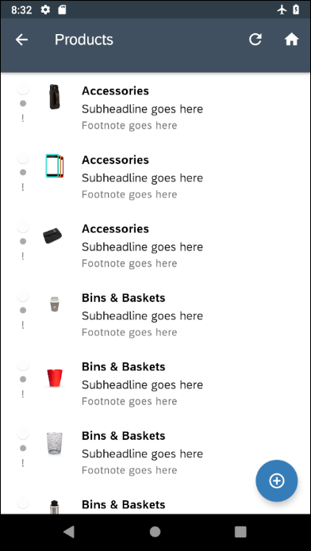
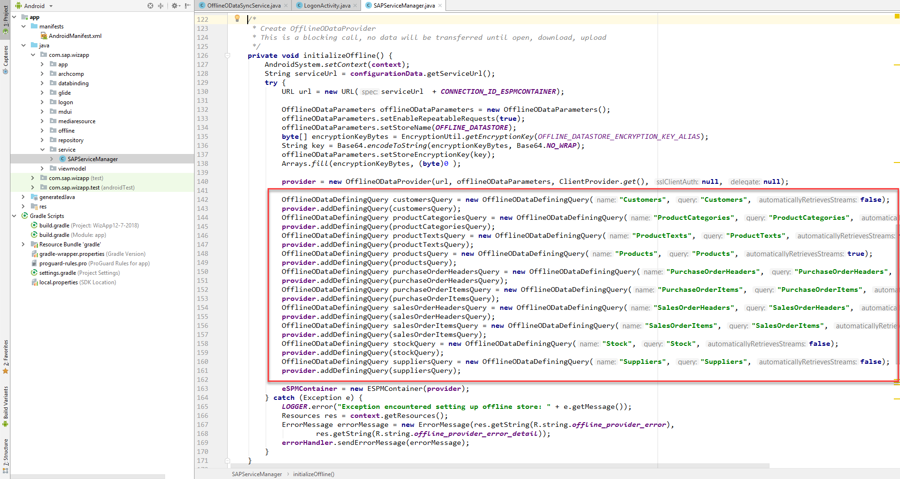
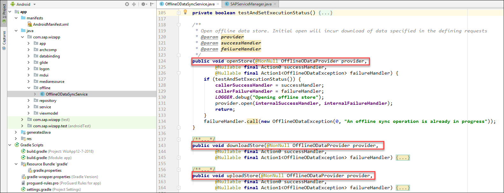
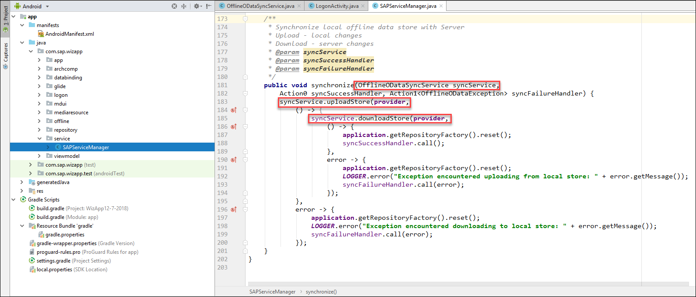

## Details
### You will learn
- How the offline feature works, through demonstration
- How the synchronization code works
- How to handle errors that occur while syncing
---

[ACCORDION-BEGIN [Step 1: ](Generate and Run an Offline App)]

Create a new application using the SAP Cloud Platform SDK for Android wizard and select **Offline** for the OData option.


Run the app.

After logging in and setting a passcode, you'll be met by a screen explaining that the offline store is opening.  As the screen suggests, opening the offline store for the first time can take up to a few minutes.  One technique to decrease this initial time is to only download data that is relevant to the user such as customers that belong in their sales region.


When you get to the app's home page, turn on **airplane mode** on your device, or disable Wi-Fi and data.


Tap the **Products** list item and see that the products load without a working internet connection. They load because they were downloaded to the offline store while the store was being set up.




Change, for example, the currency code.

Save your changes.


Navigate back to the app's home screen tap on **Synchronize** using the three dot menu in the top right of the title bar.


The sync should fail because you haven't turned off airplane mode yet.


Turn off airplane mode or re-enable Wi-Fi/data and attempt a sync again. You will see a notification that describes the sync action.


When the sync completes, the change you made will have been applied to the backend.

[VALIDATE_3]
[ACCORDION-END]

[ACCORDION-BEGIN [Step 2: ](Examine the Defining Queries)]

The offline store is populated based on objects called `OfflineODataDefiningQuery`. The defining queries are located in `SAPServiceManager.java`, in the `initializeOffline` method.



Defining Queries tell the `OfflineODataProvider` (the class that manages the offline store) which entity sets to store on the device.  In the case of the wizard generated application, there is a Defining Query for each available entity by default, meaning that each entity is stored offline and available if the user doesn't have an internet connection. For more information, see [Defining Queries](https://help.sap.com/doc/c2d571df73104f72b9f1b73e06c5609a/Latest/en-US/docs/user-guide/odata/Offline_OData_Defining_Application_Configuration_File.html#defining-queries).

>With an Offline enabled app, requests made against the entity sets that are included in the defining requests will always be fulfilled from the local offline store.

[VALIDATE_1]
[ACCORDION-END]

[ACCORDION-BEGIN [Step 3: ](Examine the Offline Service and Service Manager)]

 The application allows users to make changes against a local offline store and synchronize manually at any time. The sync operation is performed by a [Foreground Service](https://developer.android.com/guide/components/services#Foreground). In the wizard-generated application, the `OfflineODataSyncService` is the foreground service. There are three operations that must be implemented in order to use the offline store functionality, namely `openStore`, `downloadStore`, `uploadStore`. As their names suggest, the operations open the offline store, download server changes, upload user changes respectively. Go to **`OfflineODataSyncService.java`** and examine the three methods.

 

The service is simply a wrapper for the corresponding methods of the `OfflineODataProvider` class.  The methods perform the `open`/`download`/`upload` operations and pass the given callbacks through.


The `openStore` method is called by `LogonActivity.java`, when the user logs in to the application and binds the `OfflineODataSyncService`. For more information, see [Creating a bound service](https://developer.android.com/guide/components/services#CreatingBoundService).


The `uploadStore` and `downloadStore` methods are called by `SAPServiceManager` when the user wants to perform a sync. When an entity is created locally in the offline store, its primary key is left unset. This is because when the user performs an `upload`, the server will set the primary key for the client. An `upload` and a `download` are normally performed together because the `download` may return updated values from the server such as a newly created primary key.



For more information about how the offline store works, see the [Offline API](https://help.sap.com/doc/c2d571df73104f72b9f1b73e06c5609a/Latest/en-US/docs/user-guide/odata/Offline_OData_Introduction.html)

[VALIDATE_2]
[ACCORDION-END]

[ACCORDION-BEGIN [Step 4: ](Handling Errors)]

When syncing changes made while offline, conflicts can occur.  One example might be if two people attempted to update a description field of the same product.  Another might be updating a record that was deleted by another user.  The `ErrorArchive` provides a way to see details of any of conflicts that have occurred.  The following instructions will demonstrate this.

Update a **`SalesOrderItem`** and change its quantity to be zero and save it.  Update a second item and change its quantity to a different non zero number and save it.


Notice that the items are now marked with a yellow indicator to indicate that an item has been locally modified but not yet synced.


Attempt a sync, and you'll notice that the sync completes but if you examine the `SalesOrderItems` list, one item has a red mark beside it indicating it is in an error state. This is because the back end has a check that `SalesOrderItems` cannot have zero for their quantity.  This check does not exist in the local offline store, so the update succeeds locally but fails when the offline store is synced.


Next, we will create an "Error Information" page that displays the details from the `ErrorArchive`.  
Add the following strings to `res\values\strings.xml`.

```XML
<string name="error_header">Error Information</string>
<string name="request_method">Request Method</string>
<string name="request_status">Request Status</string>
<string name="request_message">Request Message</string>
<string name="request_body">Request Body</string>
<string name="request_url">Request URL</string>
```

Create a new activity in the **`mdui`** folder by right clicking, then selecting New > Activity > Empty Activity. Name the new activity `ErrorActivity`. Replace the generated XML layout file `activity_error.xml` with the following XML.

```XML
<?xml version="1.0" encoding="utf-8"?>
<LinearLayout xmlns:android="http://schemas.android.com/apk/res/android"
    xmlns:app="http://schemas.android.com/apk/res-auto"
    xmlns:tools="http://schemas.android.com/tools"
    android:layout_width="match_parent"
    android:layout_height="match_parent"
    tools:context=".mdui.ErrorActivity"
    android:orientation="vertical">

    <ScrollView
        xmlns:android="http://schemas.android.com/apk/res/android"
        android:layout_height="wrap_content"
        android:layout_width="match_parent">

        <LinearLayout
            xmlns:android="http://schemas.android.com/apk/res/android"
            android:layout_height="wrap_content"
            android:layout_width="match_parent"
            android:orientation="vertical">

            <TextView
                android:layout_width="match_parent"
                android:layout_height="wrap_content"
                android:padding="@dimen/key_line_16dp"
                style="@style/Test.ObjectCell.Headline"
                android:text="@string/error_header"/>

            <View
                android:layout_width="match_parent"
                android:layout_marginTop="@dimen/key_line_16dp"
                android:layout_height="1dp"
                android:background="?android:attr/listDivider" />

            <TextView
                android:layout_width="match_parent"
                android:layout_height="wrap_content"
                android:padding="@dimen/key_line_16dp"
                style="@style/FioriTextStyle.OVERLINE"
                android:text="@string/request_message"/>

            <TextView
                android:id="@+id/requestMessageTextView"
                android:layout_width="match_parent"
                android:layout_height="wrap_content"
                android:paddingLeft="@dimen/key_line_16dp"
                android:paddingRight="@dimen/key_line_16dp"
                style="@style/TextAppearance.Fiori.Subtitle1"
                android:singleLine="false"
                android:text="@string/request_message"/>

            <View
                android:layout_width="match_parent"
                android:layout_marginTop="@dimen/key_line_16dp"
                android:layout_height="1dp"
                android:background="?android:attr/listDivider" />

            <TextView
                android:layout_width="match_parent"
                android:layout_height="wrap_content"
                android:padding="@dimen/key_line_16dp"
                style="@style/FioriTextStyle.OVERLINE"
                android:text="@string/request_body"/>

            <TextView
                android:id="@+id/requestBodyTextView"
                android:layout_width="match_parent"
                android:layout_height="wrap_content"
                android:paddingLeft="@dimen/key_line_16dp"
                android:paddingRight="@dimen/key_line_16dp"
                style="@style/TextAppearance.Fiori.Subtitle1"
                android:singleLine="false"
                android:text="@string/request_body"/>

            <View
                android:layout_width="match_parent"
                android:layout_marginTop="@dimen/key_line_16dp"
                android:layout_height="1dp"
                android:background="?android:attr/listDivider" />

            <TextView
                android:layout_width="match_parent"
                android:layout_height="wrap_content"
                android:padding="@dimen/key_line_16dp"
                style="@style/FioriTextStyle.OVERLINE"
                android:text="@string/request_url"/>

            <TextView
                android:id="@+id/requestURLTextView"
                android:layout_width="match_parent"
                android:layout_height="wrap_content"
                android:paddingLeft="@dimen/key_line_16dp"
                android:paddingRight="@dimen/key_line_16dp"
                style="@style/TextAppearance.Fiori.Subtitle1"
                android:singleLine="false"
                android:text="@string/request_url"/>

            <View
                android:layout_width="match_parent"
                android:layout_marginTop="@dimen/key_line_16dp"
                android:layout_height="1dp"
                android:background="?android:attr/listDivider" />

            <View
                android:layout_width="match_parent"
                android:layout_height="1dp"
                android:background="?android:attr/listDivider" />

            <TextView
                android:layout_width="match_parent"
                android:layout_height="wrap_content"
                android:padding="@dimen/key_line_16dp"
                style="@style/FioriTextStyle.OVERLINE"
                android:text="@string/request_status"/>

            <TextView
                android:id="@+id/requestStatusTextView"
                android:layout_width="match_parent"
                android:layout_height="wrap_content"
                android:paddingLeft="@dimen/key_line_16dp"
                style="@style/TextAppearance.Fiori.Subtitle1"
                android:text="@string/request_status"/>

            <View
                android:layout_width="match_parent"
                android:layout_marginTop="@dimen/key_line_16dp"
                android:layout_height="1dp"
                android:background="?android:attr/listDivider" />

            <TextView
                android:layout_width="match_parent"
                android:layout_height="wrap_content"
                android:padding="@dimen/key_line_16dp"
                style="@style/FioriTextStyle.OVERLINE"
                android:text="@string/request_method"/>

            <TextView
                android:id="@+id/requestMethodTextView"
                android:layout_width="match_parent"
                android:layout_height="wrap_content"
                android:paddingLeft="@dimen/key_line_16dp"
                style="@style/TextAppearance.Fiori.Subtitle1"
                android:text="@string/request_method"/>

            <View
                android:layout_width="match_parent"
                android:layout_marginTop="@dimen/key_line_16dp"
                android:layout_height="1dp"
                android:background="?android:attr/listDivider" />
        </LinearLayout>
    </ScrollView>
</LinearLayout>
```

And replace the `ErrorActivity.java` generated activity code with the below code.

In the package statement and the import replace `com.sap.wizapp` with the package name of your project.

```Java
package com.company.offlinesample.mdui;

import android.support.v7.app.AppCompatActivity;
import android.os.Bundle;
import android.view.MenuItem;
import android.widget.TextView;

import com.sap.wizapp.R;

public class ErrorActivity extends AppCompatActivity {

    @Override
    protected void onCreate(Bundle savedInstanceState) {
        super.onCreate(savedInstanceState);
        setContentView(R.layout.activity_error);
        getSupportActionBar().setDisplayHomeAsUpEnabled(true);
        int errorCode = getIntent().getIntExtra("ERROR_CODE", 0);
        String errorMethod = getIntent().getStringExtra("ERROR_METHOD");
        String requestURL = getIntent().getStringExtra("ERROR_URL");
        String errorMessage = getIntent().getStringExtra("ERROR_MESSAGE");
        String body = getIntent().getStringExtra("ERROR_BODY");
        ((TextView) (findViewById(R.id.requestStatusTextView))).setText("" + errorCode);

        if (errorMethod != null) {
            ((TextView) (findViewById(R.id.requestMethodTextView))).setText(errorMethod);
        }
        if (requestURL != null) {
            ((TextView) (findViewById(R.id.requestURLTextView))).setText(requestURL);
        }
        if (errorMessage != null) {
            ((TextView) (findViewById(R.id.requestMessageTextView))).setText(errorMessage);
        }
        if (body != null) {
            ((TextView) (findViewById(R.id.requestBodyTextView))).setText(body);
        }
    }

    @Override
    public boolean onOptionsItemSelected(MenuItem item) {
        finish();
        return super.onOptionsItemSelected(item);
    }
}
```

Now, in `EntitySetListActivity.java`, in the `synchronize` method, find the line that performs the `sapServiceManager.synchronize` method call.


Between the `progressBar.setVisibility(View.INVISIBLE);` line and the `syncCompleteHandler.call();` line in the success callback, add the following code that queries the error archive and displays information to the user about the first error encountered.

```Java
SAPServiceManager serviceManager = ((SAPWizardApplication)getApplication()).getSAPServiceManager();
OfflineODataProvider provider = serviceManager.getProvider();
try {
    List<OfflineODataErrorArchiveEntity> errorArchive = provider.getErrorArchive();

    for (OfflineODataErrorArchiveEntity errorEntity : errorArchive) {
        String requestURL = errorEntity.getRequestURL();
        String method = errorEntity.getRequestMethod();
        String message = errorEntity.getMessage();
        Integer statusCode = errorEntity.getHttpStatusCode() != null  ?  errorEntity.getHttpStatusCode() : 0;
        String body = errorEntity.getRequestBody();

        LOGGER.error("RequestURL: " + requestURL);
        LOGGER.error("HTTP Status Code: " + statusCode);
        LOGGER.error("Method: " + method);
        LOGGER.error("Message: " + message);
        LOGGER.error("Body: " + body);

        Intent errorIntent = new Intent(EntitySetListActivity.this, ErrorActivity.class);
        errorIntent.putExtra("ERROR_URL", requestURL);
        errorIntent.putExtra("ERROR_CODE", statusCode);
        errorIntent.putExtra("ERROR_METHOD", method);
        errorIntent.putExtra("ERROR_BODY", body);
        try {
            JSONObject jsonObj = new JSONObject(message);
            errorIntent.putExtra("ERROR_MESSAGE", jsonObj.getJSONObject("error").getString("message"));
        } catch (JSONException e) {
            e.printStackTrace();
        }

        // Reverts all failing entities to the previous state or set
        // offlineODataParameters.setEnableIndividualErrorArchiveDeletion(true);
        // to cause the deleteEntity call to only revert the specified entity
        // https://help.sap.com/doc/c2d571df73104f72b9f1b73e06c5609a/Latest/en-US/docs/user-guide/odata/Offline_OData_Handling_Failed_Requests.html#reverting-an-error-state
        // provider.deleteEntity(errorEntity, null, null);
        startActivity(errorIntent);
        break; //For simplicity, only show the first error encountered
    }
} catch (OfflineODataException e) {
    e.printStackTrace();
}
```

Run the app again, and re-attempt the synchronize. You don't have to recreate the `SalesOrderItem` because it was created locally and is still in your offline store. Now, when the sync fails, you should be brought to the following error screen.


You can see that the HTTP status code, method, and message are included. When the application attempted a sync, the entity being updated didn't pass the backend checks and produced a `DataServiceException` and is now in the error state.  All entities who didn't produce errors successfully synced.  One way to correct the exception would be to change the quantity from 0 to a valid positive number.  Another would be to delete the `ErrorArchive` entry reverting the entity to its previous state.  For more information on error handling visit [Handling Errors and Conflicts](https://help.sap.com/doc/c2d571df73104f72b9f1b73e06c5609a/Latest/en-US/docs/user-guide/odata/Offline_OData_Handling_Errors_And_Conflicts.html) and [Handling Failed Requests](https://help.sap.com/doc/c2d571df73104f72b9f1b73e06c5609a/Latest/en-US/docs/user-guide/odata/Offline_OData_Handling_Failed_Requests.html).

>Further information on using the offline feature can be found at <a target="_blank" href="https://blogs.sap.com/2018/10/15/step-by-step-with-the-sap-cloud-platform-sdk-for-android-part-6-offline-odata/">Step by Step with the SAP Cloud Platform SDK for Android — Part 6 — Offline OData</a>.

Congratulations! You have created an offline enabled app using the SAP Cloud Platform SDK for Android and examined how the `ErrorArchive` can be used to examine conflicts!

[DONE]
[ACCORDION-END]

---
