## Details
### You will learn  
- How to enable Offline OData in your Android application
- How to display images while offline
- How to add a loading indicator


---

[ACCORDION-BEGIN [Step 1: ](Add offline OData dependency)]

In Android Studio, add the following line to the list of dependencies in the app's **`build.gradle`** file to include the Offline OData framework and click on **`Sync Now`**.  After the sync completes, it will be possible to use the libraries in the `offline-odata` component.

```Java
implementation group:'com.sap.cloud.android', name:'offline-odata', version: sdkVersion
```

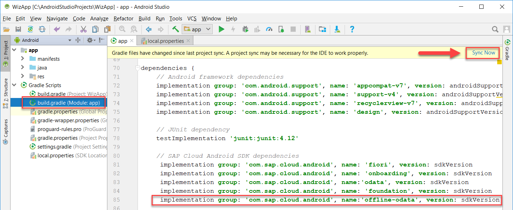


Optionally (required if using a physical device), in the app's **`build.gradle`** file, add the content below to the **`defaultConfig`** block:

```Java
ndk {
    // exclude 64 bit libraries as offline library is 32 bit only
    abiFilters "armeabi-v7a", "x86"
}
```
[DONE]
[ACCORDION-END]

[ACCORDION-BEGIN [Step 2: ](Add code to open the offline store)]

On Windows press **`Ctrl+N`** or on a Mac press **`command+O`** and enter **`SAPServiceManager`** to open `SAPServiceManager.java`.

Add the following imports.  
>They will appear grey until they are used in the following steps.

```Java
import android.content.Context;
import android.util.Log;
import android.widget.Toast;
import com.sap.cloud.mobile.odata.core.AndroidSystem;
import com.sap.cloud.mobile.odata.offline.OfflineODataDefiningQuery;
import com.sap.cloud.mobile.odata.offline.OfflineODataException;
import com.sap.cloud.mobile.odata.offline.OfflineODataParameters;
import com.sap.cloud.mobile.odata.offline.OfflineODataProvider;
import java.net.MalformedURLException;
import java.net.URL;
```

In the `SAPServiceManager` class, select the variable, **`OnlineODataProvider`** and replace it with the two following variables.

```Java
//private OnlineODataProvider provider;
private OfflineODataProvider provider;
private static final String TAG = SAPServiceManager.class.getName();
```

In `SAPServiceManager` delete or comment out the methods **`openODataStore`** and **`getServiceRoot`**.


Add the following methods.

```Java
public void openODataStore(Action0 callback, Context context) {
    setupOfflineOData(callback, context);
}

private void setupOfflineOData(Action0 callback, Context context) {
    try {
        if (configurationData.loadData()) {
            Toast.makeText(context, "Opening the offline store which may take a few moments the first time it is opened.", Toast.LENGTH_LONG).show();
            // Initialize application context for use by OfflineODataProvider
            AndroidSystem.setContext(context);
            // commonly set parameters include setStoreEncryptionKey, setStoreName, setStorePath
            OfflineODataParameters offParam = new OfflineODataParameters();
            String serviceUrl = configurationData.getServiceUrl();
            URL url = new URL(serviceUrl + CONNECTION_ID_ESPMCONTAINER);
            provider = new OfflineODataProvider(url, offParam, ClientProvider.get());
            // Specifies which entities we wish to include in the offline store
            provider.addDefiningQuery(new OfflineODataDefiningQuery("Customers", "Customers", false));
            provider.addDefiningQuery(new OfflineODataDefiningQuery("ProductCategories", "ProductCategories", false));
            provider.addDefiningQuery(new OfflineODataDefiningQuery("ProductTexts", "ProductTexts", false));
            provider.addDefiningQuery(new OfflineODataDefiningQuery("Products", "Products", false));
            provider.addDefiningQuery(new OfflineODataDefiningQuery("PurchaseOrderHeaders", "PurchaseOrderHeaders", false));
            provider.addDefiningQuery(new OfflineODataDefiningQuery("PurchaseOrderItems", "PurchaseOrderItems", false));
            provider.addDefiningQuery(new OfflineODataDefiningQuery("SalesOrderItems", "SalesOrderItems", false));
            provider.addDefiningQuery(new OfflineODataDefiningQuery("Stock", "Stock", false));
            provider.addDefiningQuery(new OfflineODataDefiningQuery("Suppliers", "Suppliers", false));
        }
  } catch (MalformedURLException e) {
      e.printStackTrace();
  } catch (OfflineODataException e) {
      e.printStackTrace();
  }
  // opens the offline store.  This can take a minute or so the first time it is called as it is created and populated.
  Log.d(TAG, "About to call open on the offline store.");
  provider.open(() -> {
      Log.d(TAG, "Offline store opened.");
      eSPMContainer = new ESPMContainer(provider);
      callback.call();
      syncOfflineData();  // TODO could be triggered via a menu action
  }, (OfflineODataException offlineODataException) -> {
      Log.d(TAG, "Offline store did not open.", offlineODataException);
  });
}

public void syncOfflineData() {
    // send the local changes to the back end OData service
    Log.d(TAG, "About to call provider.upload.");
    provider.upload(() -> {
        Log.d(TAG, "Successfully uploaded the changed data.");
        // get changes from the back end OData service.
        provider.download(() -> {
            Log.d(TAG, "Successfully downloaded the changed data.");
        }, (error) -> {
            Log.d(TAG, "Failed when downloading the changed data with error: " + error.getMessage());
        });
    }, (error) -> {
        Log.d(TAG, "Failed when uploading the changed data with error: " + error.getMessage());
    });
}

public String getServiceRoot() {
    if (configurationData.loadData()) {
        String serviceUrl = configurationData.getServiceUrl();
        if (serviceRoot == null) {
            serviceRoot = serviceUrl + "/" + CONNECTION_ID_ESPMCONTAINER;
        }
    }
    else {
        throw new IllegalStateException("SAPService manager configurationData.loadData() failed.");
    }
    return serviceRoot;
}
```
On Windows press **`Ctrl+N`** or on a Mac press **`command+O`** and enter **`LogonActivity.java`**.

On Windows press **`Ctrl+F`** or on a Mac press **`command+F`**  and enter **`openODataStore`**.

In the `startEntitySetListActivity` method, add the application context to the `openODataStore` call as a parameter as shown below.   This can be done by replacing the second last line of the method with the below code.


```Java
}, getApplicationContext());
```

[VALIDATE_1]
[VALIDATE_2]
[ACCORDION-END]

[ACCORDION-BEGIN [Step 3: ](Run the offline enabled application)]
Run the application.  Upon reaching the home screen, it may take a few moments for the offline store to open.

>The first time the app is opened it will take longer to open the offline store as it needs to be created and populated.  Make sure Wi-Fi is enabled. Consult the `Logcat` log (filter by the term `SAPServiceManager` as shown to refine the `Logcat` output) and wait for the following messages to appear:

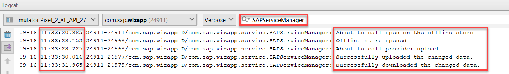


>The entities screen is generated from the file `res/raw/com_sap_edm_sampleservice_v2.xml` and does not make a network request which is why it can be displayed before the offline store is opened.

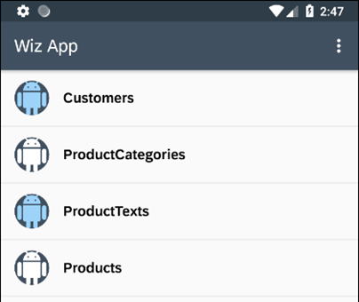


Turn on airplane mode on your device (swipe down from the top of the emulator and click on the airplane icon) which simulates having no network connection. Notice that Wi-Fi and mobile data are switched off.


Navigate to the list of customers by tapping the "Customers" row.  Notice that the request succeeds without a network connection.

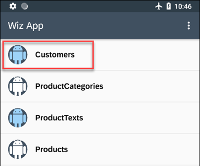


>The customer's screen shown below will look different if the tutorial `cp-sdk-android-wizard-app-customize` was not completed.

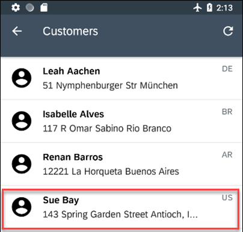


Tap on a customer.

To edit the customer tap the "Edit Customer" icon.


Change a field of a customer such as the city, and save your changes.

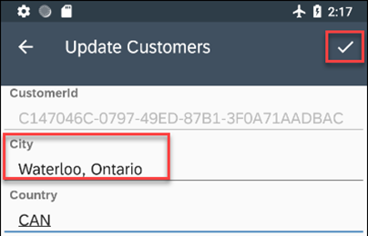


To show that the data is synchronized turn off airplane mode and fully close the app.

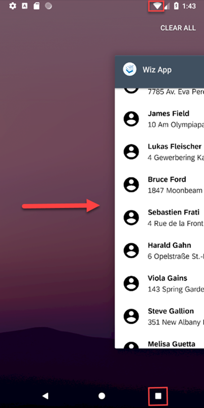


Re-open the app and check the `Logcat`. It shows the upload and download operations were successful. The previously made change is now synced with the backend OData service.


>This example does not handle conflicts. Details on this topic are available at <a target="_blank" href="https://help.sap.com/doc/c2d571df73104f72b9f1b73e06c5609a/Latest/en-US/docs/user-guide/odata/Offline_OData_Handling_Errors_And_Conflicts.html">Offline OData Conflicts</a>.

[VALIDATE_3]
[VALIDATE_4]
[ACCORDION-END]

[ACCORDION-BEGIN [Step 4: ](Offline enablement of images)]
If you go to the Products page, you will see that the images are not shown.  

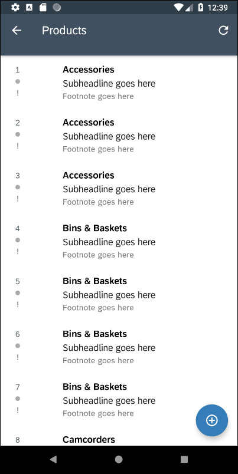


To fix this problem, go to the **`ItemListActivity.java`** file.  Find the method **`onBindViewHolder`** inside the **`SimpleItemRecyclerViewAdapter`** class.

Find the following `if` statement.

 `if (entityValueUiConnector.hasMediaResource())`

Replace it with the below code.

```Java
if (entityValueUiConnector.hasMediaResource()) {
    ESPMContainer espmContainer = ((SAPWizardApplication)getApplication()).getSAPServiceManager().getESPMContainer();
    EntityValue item;
    if (entityValueUiConnector.getConnectedObject().getDataType().equals(ESPMContainerMetadata.EntityTypes.product)) {
        DataQuery singleProduct = new DataQuery()
                .where(Product.productID.equal(entityValueUiConnector.getPropertiesWithValues().get("ProductId")));
        item = espmContainer.getProduct(singleProduct);
        ByteStream byteStream = espmContainer.downloadMedia(item);
        byte[] data = byteStream.readAndClose();
        Bitmap productImage = BitmapFactory.decodeByteArray(data, 0, data.length);
        holder.contentView.prepareDetailImageView().setScaleType(ImageView.ScaleType.CENTER_INSIDE);
        holder.contentView.setDetailImage(new BitmapDrawable(Resources.getSystem(), productImage));
    }
}
```

In **`SAPServiceManager.java`**, in the **`setupOfflineOData`** method, change the parameter **`automaticallyRetrieveStreams`** from false to true for the Products entity.

Uninstall the app.  Since the defining requests were changed, the offline database will need to be recreated.

Run the app and after the offline store has opened, tap on Products to open the Products screen.  You will see that there are now images for each product:

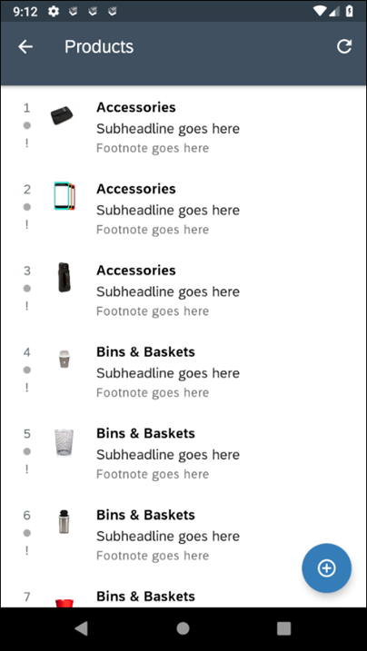

[DONE]
[ACCORDION-END]

[ACCORDION-BEGIN [Step 5: ](Display Fiori Indicator while offline store opens)]

In this section a <a target="_blank" href="https://help.sap.com/doc/c2d571df73104f72b9f1b73e06c5609a/Latest/en-US/docs/fioriui/fiori_indicator.html">Fiori Indicator</a>  will be shown while the offline store is opening which can take a while the first time it is opened or if there is a lot of data to be synced.

Press shift twice and enter `strings.xml` to open `res/values/stings.xml`.
Add the values below to this file:
```Xml
<string name="loading_store_text">Opening offline store. This may take a while.</string>
<string name="loading_store_failed_text">Offline store failed to open.\nCheck your network connection and try again later.</string>
<string name="try_again_button_text">TRY AGAIN</string>
```


Add following code to `res/layout/activity_logon.xml` just above the `</android.support.constraint.ConstraintLayout>` closing tag:

```Xml
<com.sap.cloud.mobile.fiori.indicator.FioriProgressBar
    android:id="@+id/loadingOfflineStore"
    style="@style/FioriProgressbar.Checkout"
    android:layout_width="wrap_content"
    android:layout_height="wrap_content"
    android:indeterminate="true"
    android:visibility="gone"
    app:layout_constraintBottom_toBottomOf="parent"
    app:layout_constraintLeft_toLeftOf="parent"
    app:layout_constraintRight_toRightOf="parent"
    app:layout_constraintTop_toTopOf="parent" />

<TextView
    android:id="@+id/loadingStoreTextView"
    android:layout_width="wrap_content"
    android:layout_height="wrap_content"
    android:layout_marginBottom="8dp"
    android:text="@string/loading_store_text"
    android:textColor="@color/dark_gray"
    android:visibility="gone"
    android:gravity="center"
    app:layout_constraintBottom_toTopOf="@id/tryAgainButton"
    app:layout_constraintLeft_toLeftOf="parent"
    app:layout_constraintRight_toRightOf="parent"
    tools:text="Opening offline store. This may take a while." />

<Button
    android:id="@+id/tryAgainButton"
    style="@style/FioriButton.Raised"
    android:layout_width="wrap_content"
    android:layout_height="wrap_content"
    android:text="@string/try_again_button_text"
    android:visibility="gone"
    android:layout_marginBottom="8dp"
    android:onClick="tryAgainButtonPressed"
    app:layout_constraintBottom_toBottomOf="parent"
    app:layout_constraintLeft_toLeftOf="parent"
    app:layout_constraintRight_toRightOf="parent" />
```


Add the following methods to `LogonActivity.java`:

```Java
public TextView getLoadingStoreTextView() {
    return findViewById(R.id.loadingStoreTextView);
}

public FioriProgressBar getLoadingSpinner() {
    return findViewById(R.id.loadingOfflineStore);
}

public Button getTryAgainButton() {
    return findViewById(R.id.tryAgainButton);
}

public void tryAgainButtonPressed(View button) {
    startEntitySetListActivity();
}
```


Make the following changes to the `startEntitySetListActivity` method:

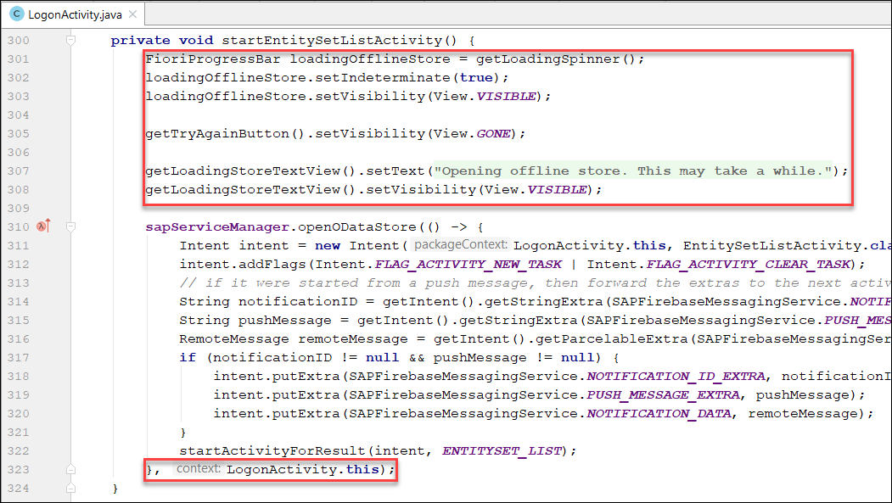

```Java
FioriProgressBar loadingOfflineStore = getLoadingSpinner();
loadingOfflineStore.setIndeterminate(true);
loadingOfflineStore.setVisibility(View.VISIBLE);

getTryAgainButton().setVisibility(View.GONE);

getLoadingStoreTextView().setText(R.string.loading_store_text);
getLoadingStoreTextView().setVisibility(View.VISIBLE);
```

```Java
}, LogonActivity.this);
```


In `SAPServiceManager.java`, add a callback parameter to the `setupOfflineOData` method:

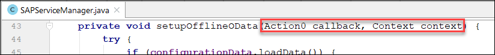


```Java
private void setupOfflineOData(Action0 callback, Context context) {
```

In the same method, make the following changes to the provider's `open` callback:

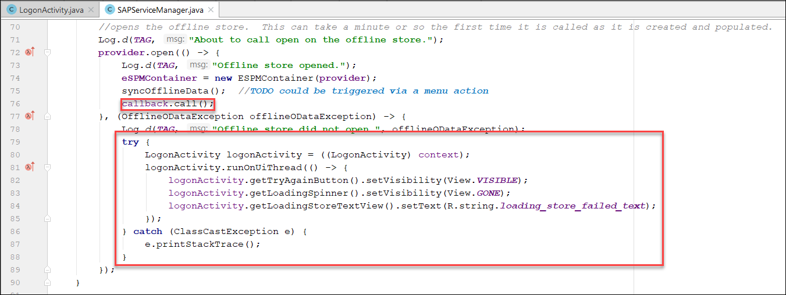

```Java
callback.call();
```

```Java
try {
    LogonActivity logonActivity = ((LogonActivity) context);
    logonActivity.runOnUiThread(() -> {
        logonActivity.getTryAgainButton().setVisibility(View.VISIBLE);
        logonActivity.getLoadingSpinner().setVisibility(View.GONE);
        logonActivity.getLoadingStoreTextView().setText(R.string.loading_store_failed_text);
	});
} catch (ClassCastException e) {
	e.printStackTrace();
}
```

Replace the `openODataStore` method with the code below.

```Java
public void openODataStore(Action0 callback, Context context) {
    setupOfflineOData(callback, context);
}
```

Uninstall and reinstall the app. Notice that a loading screen appears before the home screen. This loading screen communicates to the user that the Offline Store is opening and the app is not ready to be used yet.


If the Offline Store fails to open, the following screen will appear:

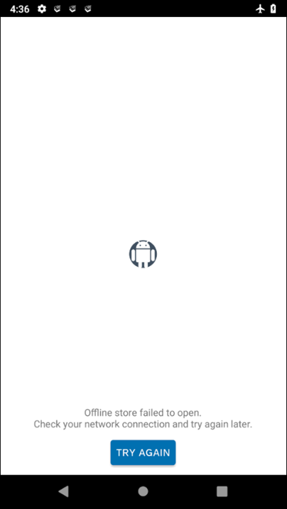


Alternatively, when the Offline Store opens successfully, the user will be automatically presented with the app's home screen.

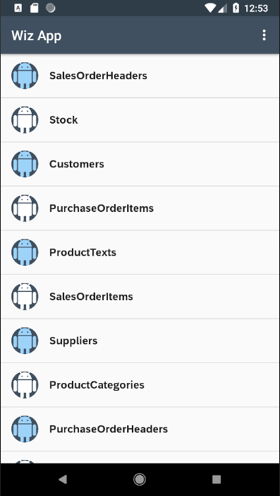

>Further information on Offline OData can be found at <a target="_blank" href="https://help.sap.com/doc/c2d571df73104f72b9f1b73e06c5609a/Latest/en-US/docs/user-guide/odata/Offline_OData_Introduction.html">Offline API</a>.

Congratulations! You have created an offline enabled application.

[DONE]
[ACCORDION-END]

---
