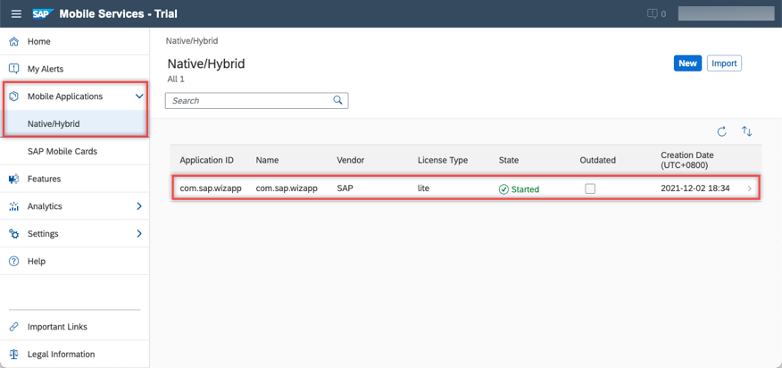
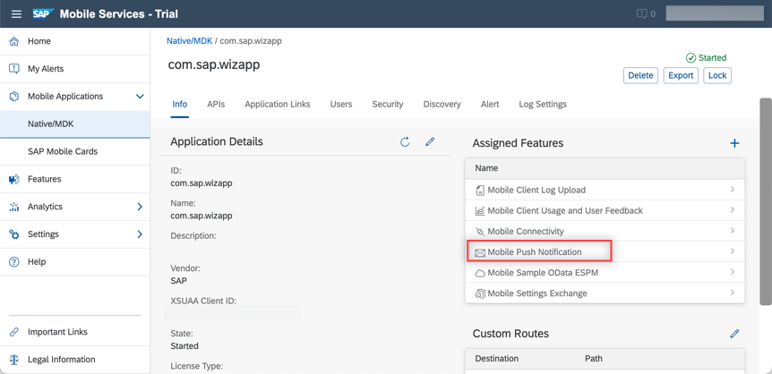
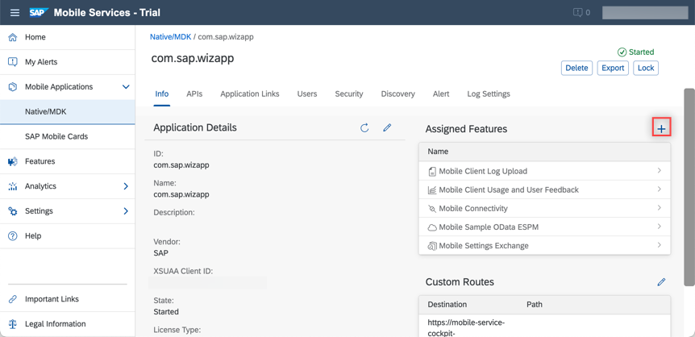
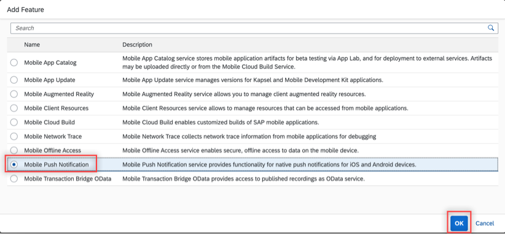
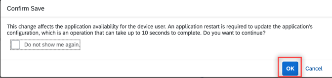
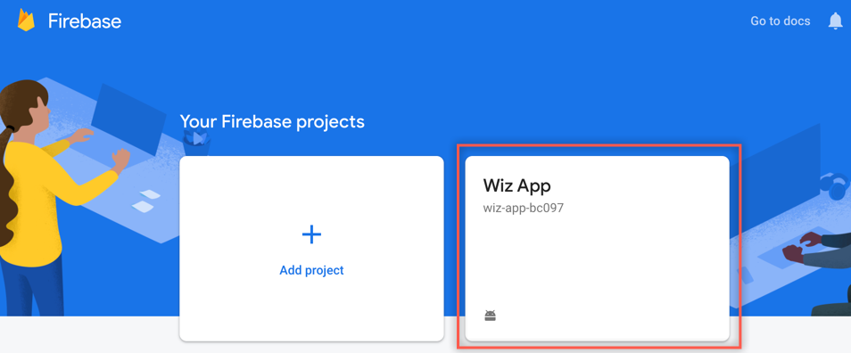
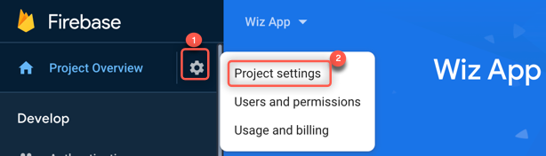
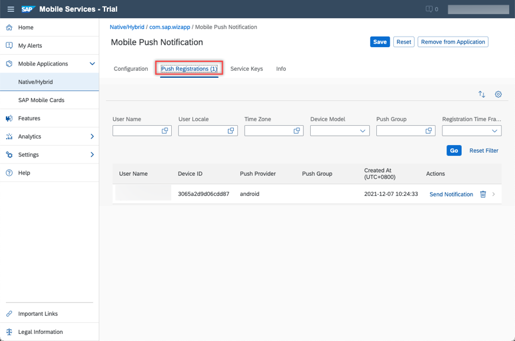
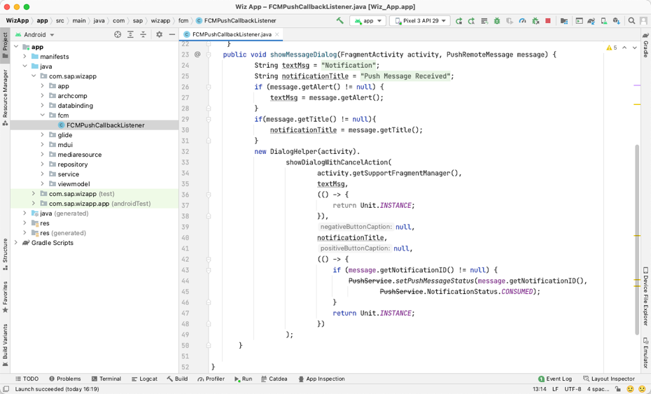
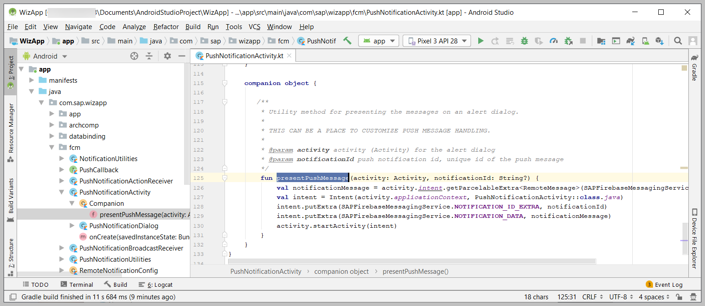

# Send Notifications to Your Android Application
<!-- description --> Add foreground and background notifications to your application using Google Firebase.

## Prerequisites
- You completed [Try Out the SAP BTP SDK Wizard for Android](cp-sdk-android-wizard-app).

## You will learn
- How to configure SAP BTP for push
- How to configure Mobile Services for push
- Foreground notifications
- Background notifications

---

### Configure Mobile Services for push notifications

1. Go to [SAP Mobile Services Cockpit](https://mobile-service-cockpit-web.cfapps.eu10.hana.ondemand.com/), select the **com.sap.wizapp** application.

    <!-- border -->

2. Select **Mobile Push Notification**.

    <!-- border -->

    >If you don't see the option, follow the screenshots to add this feature:
    >
    > - <!-- border -->
    > - <!-- border -->
    > - <!-- border -->

3. The **Mobile Push Notification** screen requires information from [Firebase](https://firebase.google.com/).

    <!-- border -->

4. In the [Firebase console](https://console.firebase.google.com/), select project **Wiz App**, and then go to **Project settings**.

    - <!-- border -->

    - <!-- border -->

5. Select the **Cloud Messaging** tab and copy the **Server Key** and **Sender ID** values from Firebase to the SAP Mobile Services **Mobile Push Notification** settings screen. Click **Save** to save changes.

    - <!-- border -->

    - <!-- border -->

### Send a notification

1. Switch to **Push Registrations** on the **Mobile Push Notification** settings page.

    <!-- border -->

2. Select certain registration to send notifications.

    <!-- border -->

    >It may be difficult to tell which registration to choose. The last field on the page shows the last time a given registration made a request. If you are unsure which registration to choose, navigate through a few screens in the application and then press the **GO** button to refresh the display, or select all of them and send a greeting to all the registrations.

    >If you don't see the **Send Notifications** button, try logging out and back into the management cockpit.

3. Specify the notification text to send to the app.

    <!-- border -->

### Foreground notification

Notice that the app shows the notification.

<!-- border -->

### Background notification

>Make sure you are selecting the right language above.

1. On an emulator or mobile device, open another app, such as Chrome, which will cause the Wiz App to no longer be the foreground app.

2. If you now send another notification, you will notice that because the app is in the background, or not running, a notification is placed in the notification drawer.

    <!-- border -->

3. Tapping the notification will bring the app to the foreground or open the app.

    <!-- border -->

    >If the app was not running when the notification was tapped, due to a change made in the previous tutorial, you can view it by pressing **Back** and navigating from the **Categories** screen to the **Entity** list screen.

Currently, the message is displayed in a dialog with cancel action.

You can add custom logic to the app to decide on the action to take, such as displaying the new Office Furniture category.

[OPTION BEGIN [Java]]

<!-- border -->

[OPTION END]

[OPTION BEGIN [Kotlin]]

<!-- border -->

[OPTION END]

>For further information on push, see [Push Notifications](https://help.sap.com/doc/f53c64b93e5140918d676b927a3cd65b/Cloud/en-US/docs-en/guides/features/push/android/push.html), [Push API Notification Scenarios](https://help.sap.com/viewer/38dbd9fbb49240f3b4d954e92335e670/Cloud/en-US/aaec2dbe78ec4fc08ef0a605a899e3dd.html), and [About FCM Messages](https://firebase.google.com/docs/cloud-messaging/concept-options).

Congratulations! You have seen how an app can make use of foreground and background notifications.

---
