## Prerequisites
- You completed [Try Out SAP BTP SDK Wizard for Android](cp-sdk-android-wizard-app).


## Details
### You will learn
- An overview of how the generated app supports different languages
- How to sign up for the SAP Translation Hub
- How to use the SAP Translation Hub from within an Android Studio Project


The SAP Translation Hub is currently not available on SAP Cloud Foundry. So if you didn't enable SAP Translation Hub service before, you can skip this tutorial.

---

[ACCORDION-BEGIN [Step 1: ](Language Support in the Generated App)]

The wizard generates an Android app that contains translated strings for multiple languages as shown below.

!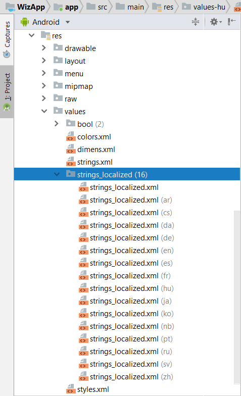

The language codes (ar, cs, da, de, en, es, etc.) can be looked up at [Codes for the Representation of Names of Languages](http://www.loc.gov/standards/iso639-2/php/code_list.php).

Strings used within the app are read from the appropriate version of the `strings_localized` or `strings.xml` file.  The `strings.xml` file contains strings that are provided at design time, such as the screen names from `metadata.xml` or the app name. Android Studio provides a Translations Editor that you can use to view the values across the localized strings files. Right-click on the `strings.xml` file and choose **Open Translations Editor**.

>Notice in the screenshot below that the resources that are from the `strings.xml` file, such as **Suppliers**, are not translated. These will get translated in Step 3.

!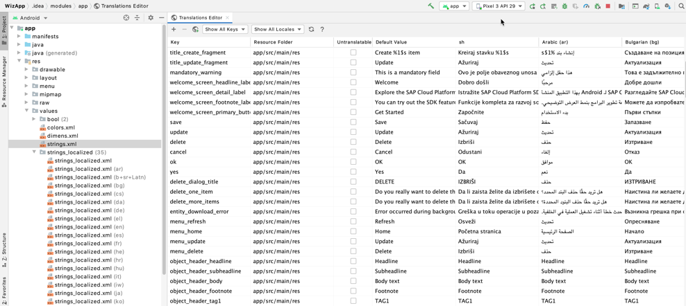

The following code in the `WelcomeActivity` class, in the `onCreate` method, is an example of the code used to read from a strings file.

[OPTION BEGIN [Java]]

```Java
new LaunchScreenSettings.Builder()
                .setHeaderLineLabel(getString(R.string.welcome_screen_headline_label))
```

[OPTION END]

[OPTION BEGIN [Kotlin]]

```Kotlin
LaunchScreenSettings.Builder()
                .setHeaderLineLabel(getString(R.string.welcome_screen_headline_label))
```

[OPTION END]

The `getString` method determines what the current local language is on the device or emulator and then reads from the matching strings file.

You can set the language on an Android device or emulator using **Settings > System > Languages & input > Languages**. A second language, such as French, can also be added.

!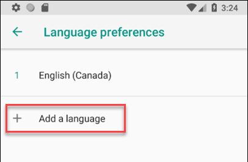

 Select the default language by long pressing on a language and dragging it to the top of the list.

 !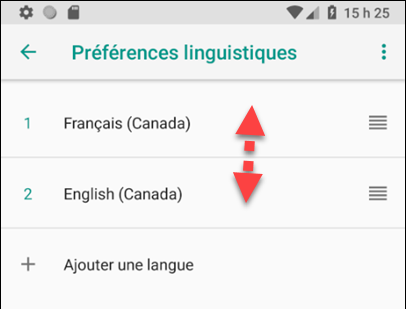

When the app is restarted, it now shows strings in the preferred language if that language is supported by the app. If the language is not currently supported, the strings will be in English by default.

!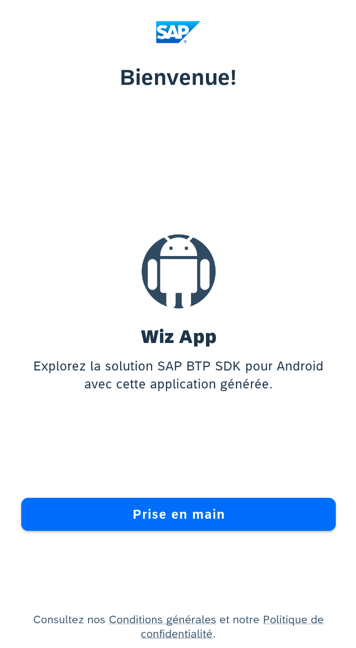

For additional information, see:

- [Localize your app](https://developer.android.com/guide/topics/resources/localization)

- [Support different languages and cultures](https://developer.android.com/training/basics/supporting-devices/languages)

- [Localize the UI with Translations Editor](https://developer.android.com/studio/write/translations-editor)

[VALIDATE_1]
[ACCORDION-END]

[ACCORDION-BEGIN [Step 2: ](Sign Up for the SAP Translation Hub)]

The [SAP Translation Hub](https://help.sap.com/viewer/product/SAP_TRANSLATION_HUB/Cloud/en-US) enables translation of resources to specified languages. SAP Translation Hub is currently not available on SAP Cloud Foundry. Since we cannot enable the SAP Translation Hub on Cloud Foundry yet, we cannot follow Step 3 to use the SAP Translation Hub wizard to generate new languages for the project.

[DONE]
[ACCORDION-END]

[ACCORDION-BEGIN [Step 3: ](Add a new Language to Your Project)]

>If you have enabled SAP Translation Hub service and the service URL is still available, then you can follow the steps to complete this part.

1. Right-click on a file in the **Project Explorer** and choose **Translate Resources with SAP Translation Hub**.

    !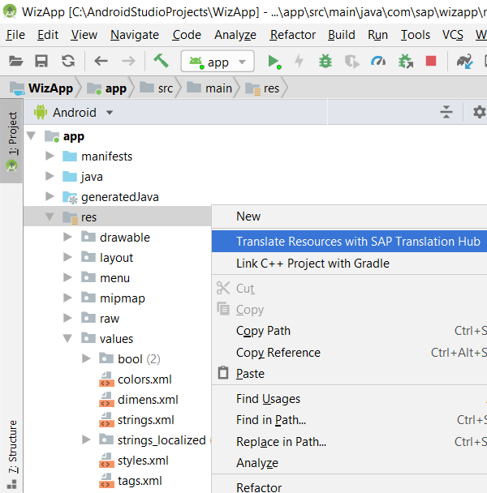

2. Fill in the necessary information:

    - **Account Name** – (optional) To save your settings for reuse, provide a name for this profile and select the **Save Account Information** check box. This name is used to identify the profile in the **Accounts List** available from **Accounts**.

    - **URL** – The URL of the SAP Translation Hub service.

    - **Username** and **Password** – The credentials of your SAP BTP account.

    !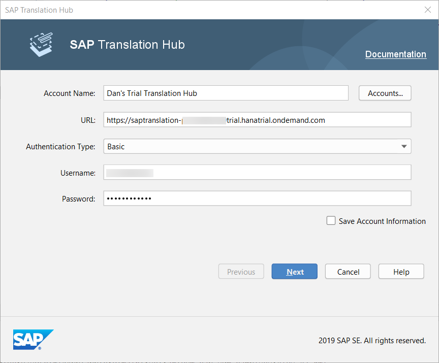

3. Click **Next** and choose **Create New SAP Translation Hub project**.

    !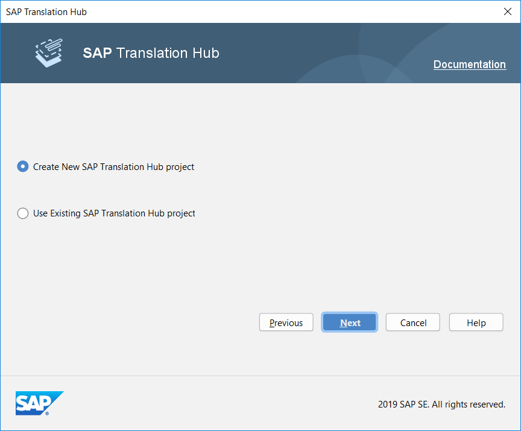

4. Choose the **Domain** of the application, specify the **Source Language** as English, and select the target language to add (in this case, Catalan).

    !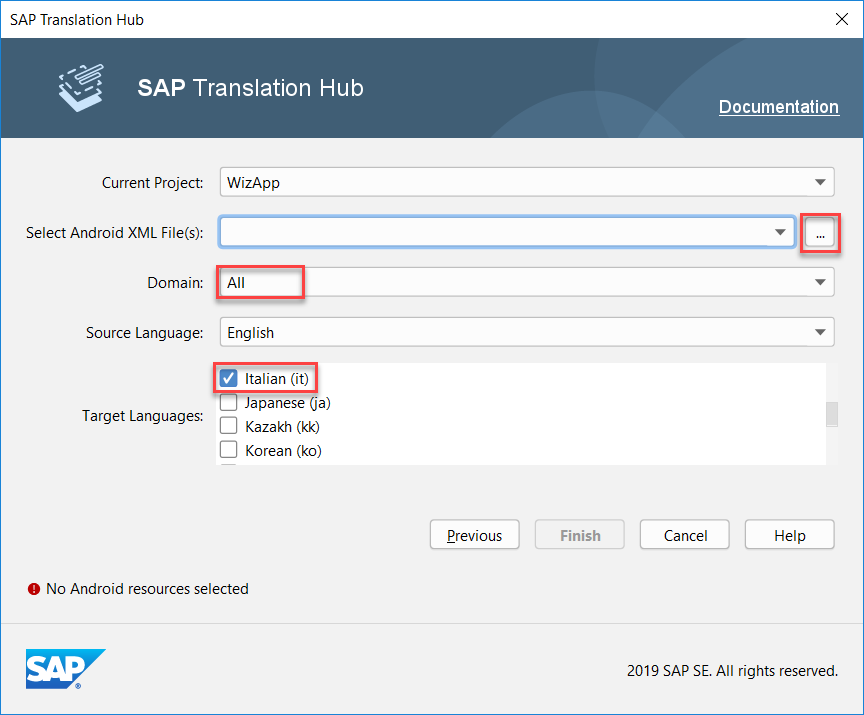

5. Select the source file to be used for the translation, either `strings.xml` or `strings_localized.xml`.

    !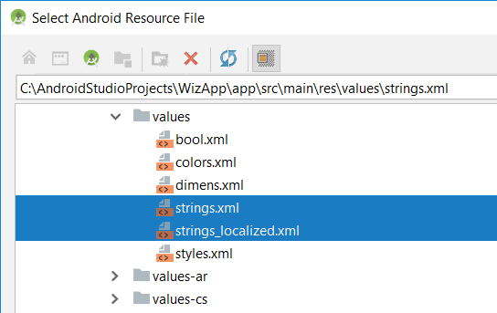

6. Press **Finish** and wait for a few moments. The **Event Log** should print `Success: Project translated successfully`.

    There should now be two additional files, `strings_localized.xml(ca)` and `strings.xml(ca)`.

    !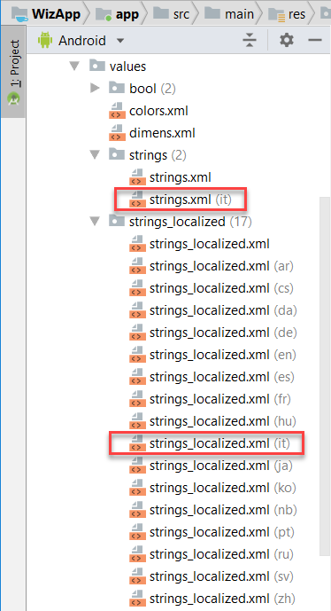

7. In the emulator or device, set the preferred language to be Catalan, then run the app and notice that the app now displays Catalan strings.

    !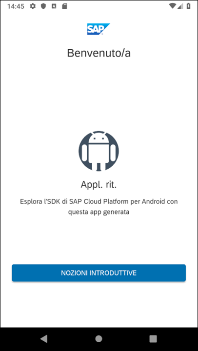

>Some of the strings in the app are part of the foundation or Fiori library and their strings are not easily accessible to be localized.  A couple of examples are the basic authentication screen and the passcode screen.

>For further information on this feature, see [SAP Translation Hub](https://help.sap.com/viewer/product/SAP_TRANSLATION_HUB/Cloud/en-US).

Congratulations! You have learned how to use the SAP Translation Hub to quickly add translations to your application!

[DONE]
[ACCORDION-END]

---
