## Prerequisites
- You completed [Try Out SAP Cloud Platform SDK for Android Wizard](cp-sdk-android-wizard-app).

## Details
### You will learn
- An overview of how the generated app supports different languages
- How to sign up for the SAP Translation Hub
- How to use the SAP Translation Hub from within an Android Studio Project
---

[ACCORDION-BEGIN [Step 1: ](Language Support in the Generated App)]

The wizard generates an Android app that contains translated strings for multiple languages as shown below.


The language codes (ar, cs, da, de, en, es, etc.) can be looked up at [Codes for the Representation of Names of Languages](http://www.loc.gov/standards/iso639-2/php/code_list.php).


Strings used within the app are read from the appropriate version of the `strings_localized` or `strings.xml` file.  The `strings.xml` file contains strings that are provided at design time, such as the screen names from `metadata.xml` or the app name. Android Studio provides a Translations Editor that you can use to view the values across the localized strings files. Right-click on the `strings.xml` file and choose **Open Translations Editor**.

>Notice in the screenshot below that the resources that are from the `strings.xml` file, such as **Suppliers**, are not translated. These will get translated in Step 3.


The following code in the `WelcomeActivity` class, in the `onCreate` method, is an example of the code used to read from a strings file.

[OPTION BEGIN [Java]]

```Java
new LaunchScreenSettings.Builder()
                .setHeaderLineLabel(getString(R.string.welcome_screen_headline_label))
```

[OPTION END]

[OPTION BEGIN [Kotlin]]

```Kotlin
LaunchScreenSettings.Builder()
                .setHeaderLineLabel(getString(R.string.welcome_screen_headline_label))
```

[OPTION END]

The `getString` method determines what the current local language is on the device or emulator and then reads from the matching strings file.

You can set the language on an Android device or emulator using **Settings > System > Languages & input > Languages**. A second language, such as French, can also be added.


 Select the default language by long pressing on a language and dragging it to the top of the list.

 

When the app is restarted, it now shows strings in the preferred language if that language is supported by the app. If the language is not currently supported, the strings will be in English by default.


For additional information, see:

  - [Localize your app](https://developer.android.com/guide/topics/resources/localization)

  - [Support different languages and cultures](https://developer.android.com/training/basics/supporting-devices/languages)

  - [Localize the UI with Translations Editor](https://developer.android.com/studio/write/translations-editor)


[VALIDATE_1]
[ACCORDION-END]


[ACCORDION-BEGIN [Step 2: ](Sign Up for the SAP Translation Hub)]

The [SAP Translation Hub](https://help.sap.com/viewer/product/SAP_TRANSLATION_HUB/Cloud/en-US) enables translation of resources to specified languages. SAP Translation Hub is currently only available on **Neo** trial landscapes and not on SAP **Cloud Foundry**. You have to create a workaround to access SAP Translation Hub in your **Neo** trial environment, as follows:

1.  Open [SAP Cloud Platform cockpit](https://cockpit.hanatrial.ondemand.com/cockpit/#/home/trial).

2.  Scroll down to the **Environment** section and click **Access Neo Trial** to go to SAP Cloud Platform management cockpit page.

    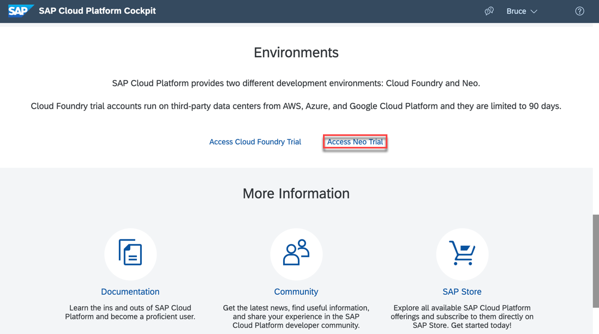

3.  In the SAP Cloud Platform management cockpit, in **Services**, click **Enable** for the **SAP Translation Hub**.

    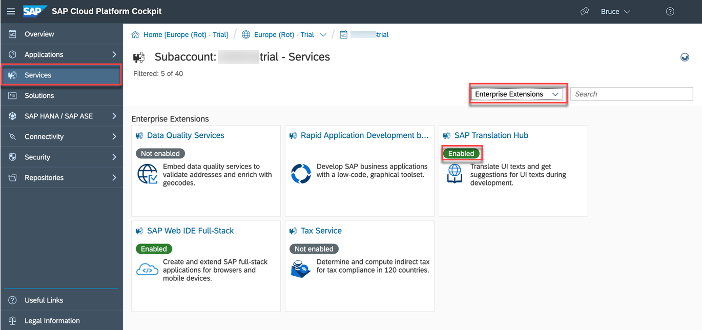

4.  Click on the tile and then choose **Go to UI for Translation Workflow**. This navigates to Translation Hub service UI page.

    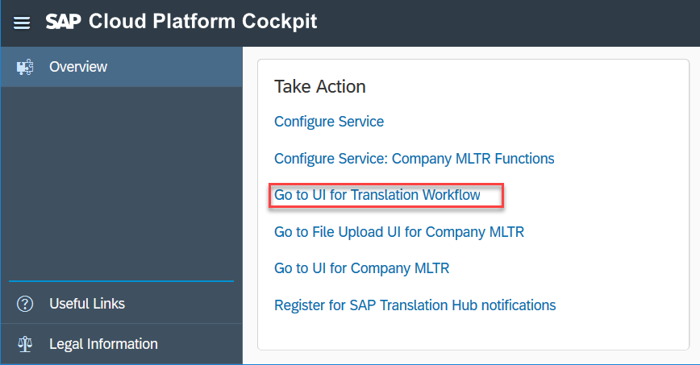

    Notice that there are no existing translation projects in the **Translation Projects** page. In the next section ( **Step 3** ), you will use a SAP Translation Hub wizard integrated into Android Studio to create a translation project and request new language files for Italian, which is currently not supported by the generated app.

    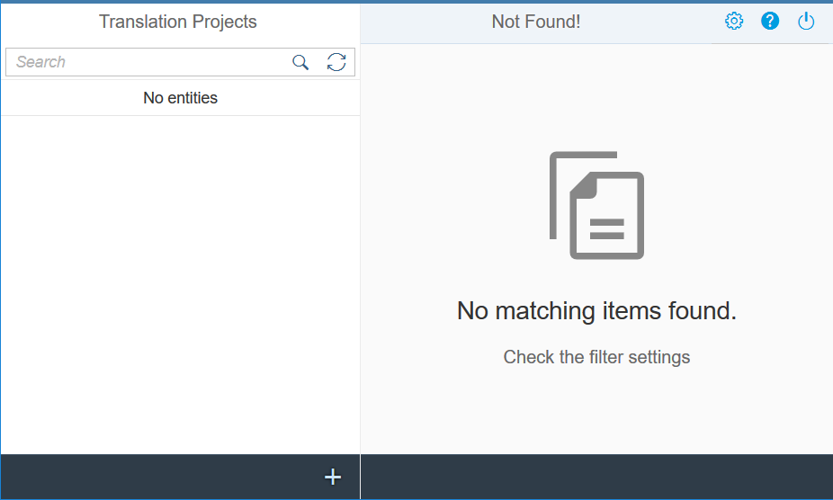

    >Note that the SAP Translation Hub wizard in the SAP Cloud Platform SDK for Android is currently not compatible with the SAP Translation Hub in the SAP Cloud Platform trial account. You can, however, press the **+** icon to create a new translation project, upload `strings_localized.xml`, and request a translation, as shown below. One of the benefits of this method is that feedback is returned on the expected quality of the translation.

    >1. Click **+** to create a translation project:
    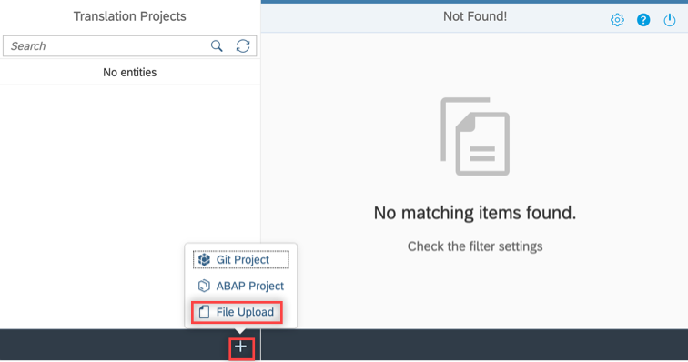

    >2. Fill in the required information (marked with a red star) in **Project Metadata**.
    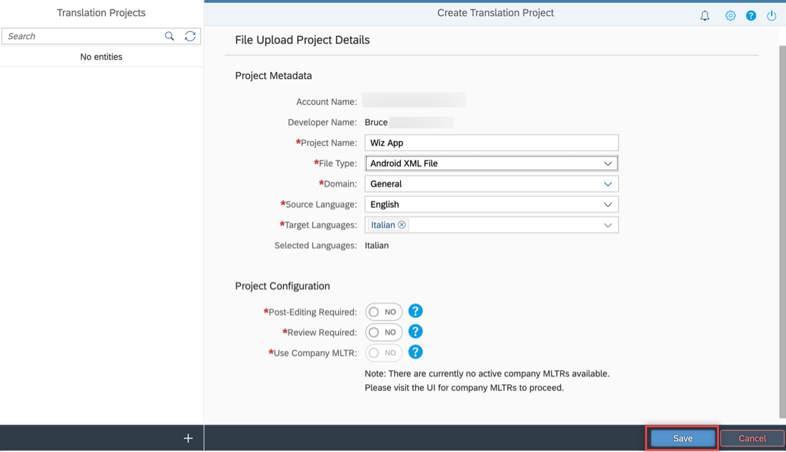

    >3. Click **Upload File**.
    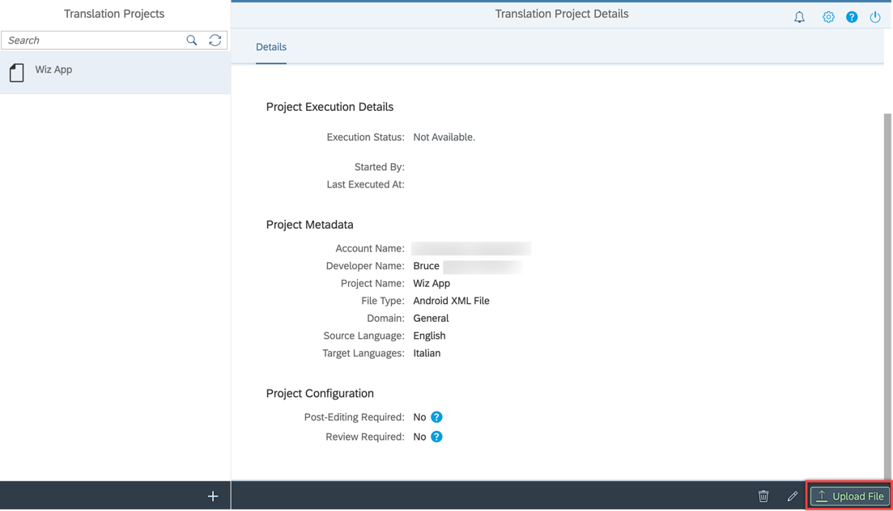

    >4. Browse to select `strings_localized.xml` to upload and translate.
    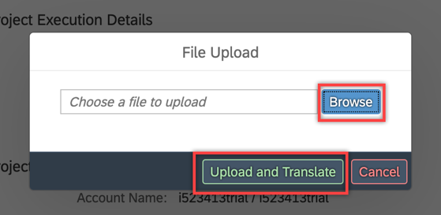

    >5. When translation has completed successfully, click the **Translations** tab.
    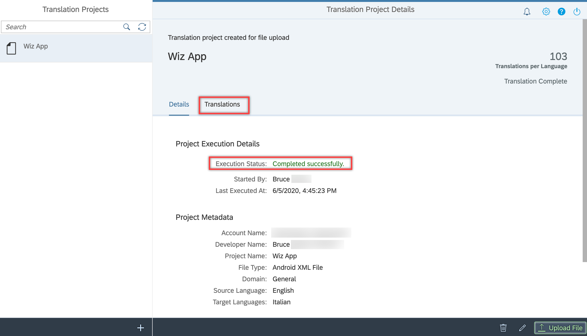

    >6. In this page, you can view the feedback of the translation:
    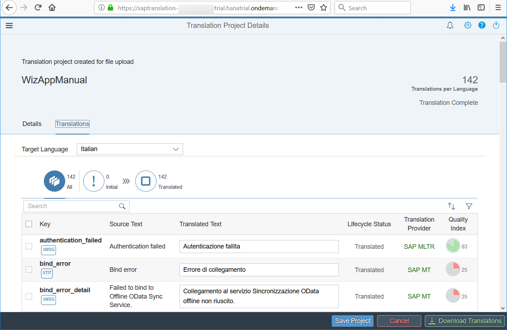

[DONE]
[ACCORDION-END]


[ACCORDION-BEGIN [Step 3: ](Add a new Language to Your Project)]

1.  Right-click on a file in the **Project** Explorer and choose **Translate Resources with SAP Translation Hub**.

    !

2.  Fill in the necessary information:

    -	**Account Name** – (optional) To save your settings for reuse, provide a name for this profile and select the Save Account Information check box. This name is used to identify the profile in the Accounts List available from Accounts.

    - **URL** – The URL of the Translation Hub service. You can obtain this URL from the SAP Translation Hub service cockpit (refer to point 4 in **Step 2** above where you are navigated to Translation Hub service UI page).

        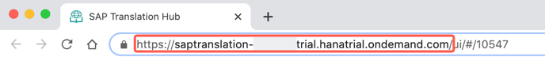

    - **Username** and **Password** – The credentials of your SAP Cloud Platform account.

    

3.  Click **Next** and choose **Create New SAP Translation Hub project**.

    

4.  Choose the **Domain** of the application, specify the **Source Language** as English, and select the target language to add (in this case, Italian).

    

5.  Select the source file to be used for the translation, either `strings.xml` or `strings_localized.xml`.

    

6.  Press **Finish** and wait for a few moments. The **Event Log** should print `Success: Project translated successfully`.

    There should now be two additional files, `strings_localized_it.xml` and `strings_it.xml`.

    

7.  In the emulator or device, set the preferred language to be Italian, then run the app and notice that the app now displays Italian strings.

    

>Some of the strings in the app are part of the foundation or Fiori library and their strings are not easily accessible to be localized.  A couple of examples are the basic authentication screen and the passcode screen.

>For further information on this feature, see [SAP Translation Hub](https://help.sap.com/viewer/product/SAP_TRANSLATION_HUB/Cloud/en-US).

Congratulations! You have learned how to use the SAP Translation Hub to quickly add translations to your application!


[DONE]
[ACCORDION-END]

---
