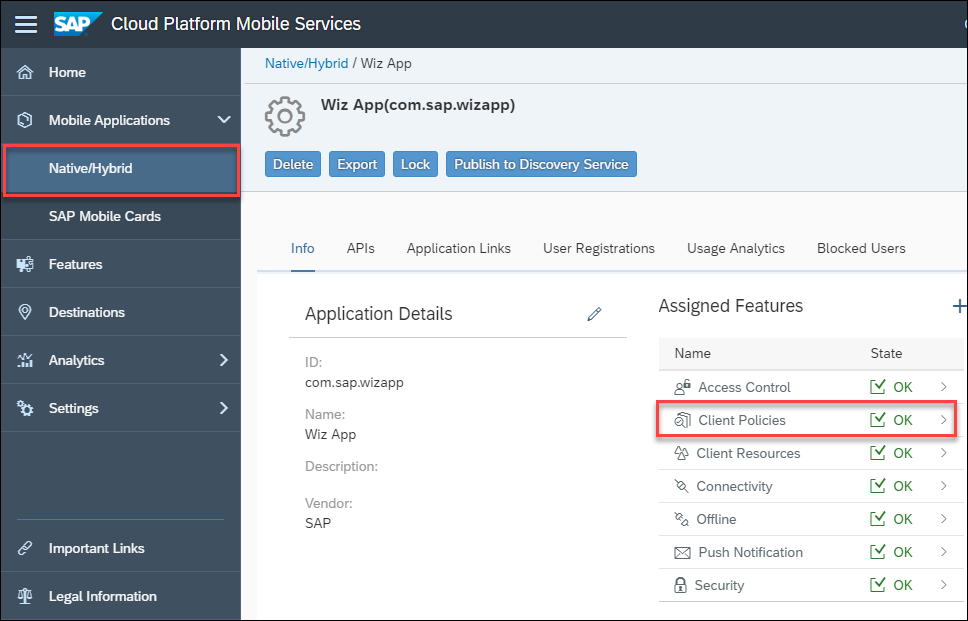

## Details
### You will learn
- How the Usage Reporting feature works, through demonstration
- How to customize the consent screen
- How to further instrument the wizard app
- How to add code to enable auto-upload of usage data based on the client policy
---

[ACCORDION-BEGIN [Step 1: ](Explore the usage feature)]

As shown in the tutorial, [Try Out SAP Cloud Platform SDK for Android Wizard](cp-sdk-android-wizard-app), ensure that **Enable Usage Reporting** is checked when creating the app.


The app must first receive permission to collect usage information from the user.

The text displayed to the user can be customized by accessing **`res/values/strings_localized/strings_localized(en).xml`** (or by pressing **Shift Shift** then searching for **`strings_localized.xml`**) and editing the text between the string tags below.  For more details on translation, see <a href="https://developers.sap.com/group.sdk-android.html">Add New Languages to your Android Application</a>.

```xml
<string name="get_usage_permission_explanation">
  Detailed text about how data privacy pertains to this app and why it is important for the user to enable this functionality
</string>
```

When the app is first installed, the consent screen will automatically be shown to users.

Click **OK** to allow the app to track usage.


 If Not Now was clicked, the user's choice can later be changed in the app's settings screen.


From the settings menu, click **Upload Usage**.


The upload will fail with a HTTP 403 error if usage was not enabled on Mobile Services.


To review this policy setting, in the Mobile Services Cockpit, access Client Policies through **Mobile Applications > Native/Hybrid > Wiz App > Client Policies**.



The Usage Report Policy specifies if uploads of usage data are allowed and the time interval for automatic usage report uploads.

A value of 0 will initially be in the **Upload Report After** which we will use in our later implementation of automatically uploading usage reports to the server and it will mean that usage reports will not be uploaded automatically.


If an empty usage report notification is shown when **Upload Usage** is clicked, navigate away from the app by going to your phone's home screen and re-entering the app.  Then try uploading the usage report again.  Placing the app in the background will end the current usage session.


If **Upload Usage** was successful then a Toast message should pop up informing you that the usage information has been uploaded to the server.


To view the application usage report, go to your management cockpit under **Analytics > Client Data Report** and click the download icon.

Search for specific usage data from different applications, devices, operating systems and periods of time by choosing filters from the available dropdowns and clicking **Go**. Then click the download icon to get the filtered data in a `csv` file.


Open the downloaded **`client_upload.csv`**. The file contains usage entries from the app that record different actions such as button clicks and timers.

| Column  |  **Description**  |
|---|---|
| `APPLICATIONID`  | Which application the usage report events were generated from  |
| `DEVICEMODEL`  | Type of device (Samsung, Android Emulator, etc.) |
| `DEVICEPLATFORM`  | Android or iOS  |
| `DEVICEVERSION`  | Software version of the device  |
| `TIMERSTART`  | Time the event began at  |
| `TIMERDURATION`  | How long an event ran for in seconds  |
| `REGISTRATIONID`  | A unique id generated when you first register your device  |
| `USERSESSIONID`  | A unique id generated every time the application is re-opened  |
| `RECORDKEY`  | What kind of information is it describing (information about the device (`DeviceInfo`), an event within the application (`BehaviorEvent`), etc.)  |
| `RECORDTYPE`  | Describes the type of `BehaviorEvent` (e.g. `viewDisplayed`, `userInteraction`)  |
| `I_SCREEN`  | Describes the screen resolution of the device and uses the current `OSLifecycle` state as the key  |
| `I_VIEW`  | Screen/View name of where `BehaviourEvents` are generated |
| `I_ELEMENT`  | UI element or screen control that was interacted with  |
| `I_ACTION`  | Action that the user performed  |
| `I_VALUE`  | Value related to the interaction if applicable  |

In the example below, there are 3 different Android devices with varying software versions.


In the next example, the timer recorded how long the user kept the application active for on their device before exiting for 5 different sessions.  Recording how long users spend in the application is a typical measurement.  You can also  specify other processes to time such as application startup, data requests, or the time taken to open an offline store.


A session is typically defined as how long the app has been open for in the foreground, but different records within the application can also be modified to act as sessions.

There can be multiple `USERSESSIONIDs` associated with a single `REGISTRATIONID`. `REGISTRATIONID` is independent of your username and you can see a complete list of all user registrations for the app in the Mobile Cockpit through **Mobile Applications > Native/Hybrid > Wiz App > User Registrations**.

In the example below the same user registered through 2 different devices and ran 3 user sessions.


When the application is initially launched, the report comes to contain entries that describe the device screen, memory and networking capabilities in a condensed form within 4 columns, marking the end of a session.

| **`I_VALUE`**  |  **Description**  |
|---|---|
| `EnterApplication`  | Screen resolution of the device (`I_SCREEN`)  |
| location  | Location permission for the application (denied or authorized); if authorized then it will list the latitude (`I_VIEW`), longitude (`I_ELEMENT`) and city (`I_ACTION`)  |
| device  | Reiterates the screen resolution (`I_SCREEN` and `I_VIEW`), device platform (`I_ELEMENT`) and specifies the device language (`I_ACTION`) |
| memory  | RAM of the device (`I_SCREEN`), internal storage (`I_VIEW`) and available space on SD card (`I_ELEMENT`)  |


The app also records a few of the screens that users enter, and more usage reporting statements can be added in the code to track other specific screens.

In the example below, the user navigated from the Logon screen to the `EntitySetListActivity` screen and accessed the categories at positions 3 and 0, then entered the Settings screen.


The code segment that records `LogonActivity` can be found in the `onCreate` method in `LogonActivity.java`.

```Java
((SAPWizardApplication)getApplication()).getUsageUtil().eventBehaviorViewDisplayed("LogonActivity","elementID","onCreate","called");
```

The code segment that records `EntitySetListActivity` can be found in the `onCreate` method in `EntitySetListActivity.java`.

```Java
usageUtil = ((SAPWizardApplication) getApplication()).getUsageUtil();
usageUtil.eventBehaviorViewDisplayed(EntitySetListActivity.class.getSimpleName(),
				"elementId", "onCreate", "called");
```


[VALIDATE_1]
[ACCORDION-END]


[ACCORDION-BEGIN [Step 2: ](Add further usage instrumentation)]

The Usage feature can be used to instrument an app to track things that might provide an insight into user's behaviors.  

The following steps will record how often users start adding or updating products but cancel their changes.  This is somewhat similar to a metric in a shopping cart type app where it might be interesting to know how often items are added to a shopping cart, but a sale is not made.

In Android Studio, on Windows press **Ctrl+N** or on a Mac press **command+O** and type **`ProductsCreateFragment`** to open `ProductsCreateFragment.java`.

Add the following variable into the **`ProductsCreateFragment`** class near the other private variables.

```Java
private UsageUtil usageUtil;
```

On Windows press **Ctrl+F12** or on a Mac press **command+F12** and type **`onCreate`** to move to the `onCreate` method in the same file.

Find the following line

```Java
super.onCreate(savedInstanceState);
```

 Then add the following code segment immediately after

```Java
usageUtil = ((SAPWizardApplication)getActivity().getApplication()).getUsageUtil();
usageUtil.eventBehaviorUserInteraction(ProductsCreateFragment.class.getSimpleName(),
  "elementId", "createOrEditProductClicked", "Begin Create or Edit Product");
```

This generates a usage event record for when a user clicks the Add or Edit icon within Products.

On Windows press **Ctrl+F12** or on a Mac press **command+F12** and type **`onOptionsItemSelected`** to move to the `onOptionsItemSelected` method. Add the following code segment before the **`default:`** case in the same file.

```Java
case android.R.id.home:
  usageUtil = ((SAPWizardApplication)getActivity().getApplication()).getUsageUtil();
  usageUtil.eventBehaviorUserInteraction(ProductsCreateFragment.class.getSimpleName(),
    "elementId", "onBackPressed", "Create or Edit Product Cancelled");
  return true;
```

This generates the usage event record whenever the user navigates away from an editing screen without saving.

In Android Studio, on Windows press **Ctrl+N** or on a Mac press **command+O** and type **`ProductsDetailActivity`** to open `ProductsDetailActivity.java`.

On Windows press **Ctrl+F12** or on a Mac press **command+F12** and type **`onOptionsItemSelected`** to move to the `onOptionsItemSelected` method.

Modify the return statements so the case and default case end with

```Java
return false;
```

By changing the return statements to false, it ensures that the code we added to `ProductsCreateFragment.java` gets executed when we click the navigate back button.

Build and run the app again and generate usage information by accessing Products.


Then click the floating Add button to create a product.


Finally press the back button to exit the page without saving.


Repeat those steps 3 times to generate multiple entries for the usage report.

Then instead of creating a new Product, click an existing Product and click its Edit button.


Then immediately click the check mark button to save the information.


Return to your phone's home screen so that there is information stored inside the usage report and navigate back into the app. Otherwise you will receive a Usage Upload failure when trying to upload the report due to an empty usage report like in the image below.


Upload the usage by going to **Settings** and clicking **Upload Usage**.

After downloading the `client_uploads.csv` file from the Mobile Services Cockpit, you should be able to see new entries with `I_VIEW` values of `ProductsCreateFragment` and `I_ACTION` values of `onBackPressed` and `createProductClicked`.


In 4 empty cells that do not fall under the R column on the Excel spreadsheet, label two of them with **Product Create or Edit Clicked** and **Cancelled Product Create or Edit**. Next to **Product Create or Edit Clicked**, use the below formula to find the number of times the user intended to add/update a product.

```Excel
=COUNTIF(R:R, "*createOrEditProductClicked*")
```

Then next to **Cancelled Product Create or Edit**, use the below formula to find the number of times the user cancelled an add/update product action.

```Excel
=COUNTIF(R:R, "*onBackPressed*")
```

In the example, the user tried to create a Product 4 times, but cancelled 3 times.


[DONE]
[ACCORDION-END]


[ACCORDION-BEGIN [Step 3: ](Auto Upload of Usage Data)]

 Mobile Services provides a Usage Report Policy under Client Policies specifying if uploads to Mobile Services are allowed and how often they should occur. The following instructions will demonstrate how to modify the app to read and store the policy and upload the usage data to Mobile Services using the specified interval.  

Input the number of days a report should be automatically uploaded and click **Save**. For the purposes of this tutorial, use the value **1** to simplify testing later on.


In Android Studio, on Windows press **Ctrl+N** or on a Mac press **command+O** and type **`ClientPolicy`** to open `ClientPolicy.java`.

Add the following variables to the `ClientPolicy` class below the private variables.

```Java
private boolean isUsageEnabled;
private int uploadInterval;

public void setUsageEnabled(boolean usageEnabled) { isUsageEnabled = usageEnabled; }

public boolean isUsageEnabled() { return isUsageEnabled; }

public void setUploadInterval(int interval) { uploadInterval = interval; }

public int getUploadInterval() { return uploadInterval; }
```

This code creates variables to handle usage data and provides them with getters and setters.

In Android Studio, on Windows press **Ctrl+N** or on a Mac press **command+O** and type **`ClientPolicyManager`** to open `ClientPolicyManager.java`.

Add the following variables to the `ClientPolicyManager` class with the rest of the `private static final` variables.

```Java
private static final String USAGE_POLICY_ENABLED = "dataCollectionEnabled";
private static final String USAGE_POLICY_UPLOAD_AFTER_DAYS = "uploadDataAfterDays";
private static final String SETTINGS_USAGE = "usagePolicy";
```

On Windows press **Ctrl+F12** or on a Mac press **command+F12** and type **`onSuccess`** to move to the `onSuccess` method.

Place the following code right before the line `downloadLatch.countDown();`;

```Java
JSONObject usagePolicyJson = result.optJSONObject(SETTINGS_USAGE);
if (usagePolicyJson != null) {
  boolean isUsageEnabled = usagePolicyJson.optBoolean(USAGE_POLICY_ENABLED, false);
  int uploadInterval = usagePolicyJson.optInt(USAGE_POLICY_UPLOAD_AFTER_DAYS, 0);
  policyFromServer.setUsageEnabled(isUsageEnabled);
  policyFromServer.setUploadInterval(uploadInterval);
}
```

This code gets the usage policy information from the SAP Cloud and stores it inside a `ClientPolicy` object.

In Android Studio, on Windows press **Ctrl+N** or on a Mac press **command+O** and type **`LogonActivity`** to open `LogonActivity.java`.

Add the following method.

```Java
private void uploadUsage() {
    //the ExecutorService runs the code on a separate thread because getting the ClientPolicyManager data makes a significant impact on performance
    ExecutorService executorService = Executors.newSingleThreadExecutor();
    executorService.submit(() -> {
      int newDays = clientPolicyManager.getClientPolicy(true).getUploadInterval();
      UsageBroker.setDaysToWaitBetweenUpload(newDays);

      //if newDays is greater than 0 then auto-upload is considered to be enabled on Mobile Services
      if (newDays > 0) {
        // The upload will only occur if the last upload was more than newDays ago
        UsageBroker.upload(false, this, new AppUsageUploader.UploadListener() {
          @Override
          public void onSuccess() {
            Toast.makeText(getApplication(), getResources().getString(R.string.usage_upload_ok), Toast.LENGTH_LONG).show();
          }

          @Override
          public void onError(Throwable error) {
            // make sure to import com.sap.cloud.mobile.foundation.networking.HttpException;
            if (error instanceof HttpException) {
              LOGGER.debug("Usage Upload server error: {}, code = {}", ((HttpException) error).message(), ((HttpException) error).code());
            } else {
              LOGGER.debug("Usage Upload error: {}", error.getMessage());
            }
            String errorCause = error.getLocalizedMessage();
            ErrorMessage errorMessage = new ErrorMessage(getResources().getString(R.string.usage_upload_failed), errorCause, new Exception(error), false);
            errorHandler.sendErrorMessage(errorMessage);
          }

          @Override
          public void onProgress(int i) {
            LOGGER.debug("Usage upload progress: " + i);
          }
        });
      }
    });
}
```

This code sets the upload interval for the application's `UsageBroker` object and then requests an upload of usage. If the amount of days between uploading is sufficient it will upload the data and if not it will delay the upload. If the auto upload interval is 0 it will not upload any usage.

On Windows press **Ctrl+F12** or on a Mac press **command+F12** and type **`finishLogonActivity`** to move to the `finishLogonActivity` method.

In the else block, before the call to `startEntitySetListActivity`, add the below method call.

```Java
uploadUsage();
```

In Android Studio, on Windows press **Ctrl+N** or on a Mac press **command+O** and type **`SettingsFragment`** to open `SettingsFragment.java`.

Press **Ctrl+F** to find:

```Java
UsageBroker.upload(false, getContext(), new AppUsageUploader.UploadListener() {
```

Change the **false** to **true** on that line.

This will allow the user to upload the usage report via the app's settings screen regardless of the number of days specified in the policy.

When the app is run and the number of days in the policy has passed, there should be Toast notification showing that the usage report has been uploaded successfully.

To test this feature multiple times, change the date of the device/emulator in **System > Date & time** and toggle **Automatic date & time** off and change the date to a date in the future and re-run the app. The usage report should be uploaded automatically.


For more information on usage visit [Client Usage](https://help.sap.com/doc/c2d571df73104f72b9f1b73e06c5609a/Latest/en-US/docs/user-guide/foundation/Usage.html).


[DONE]
[ACCORDION-END]

---
