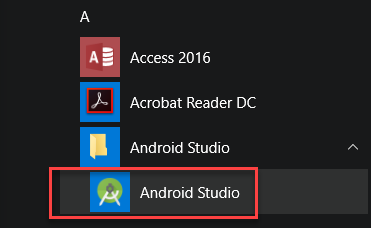
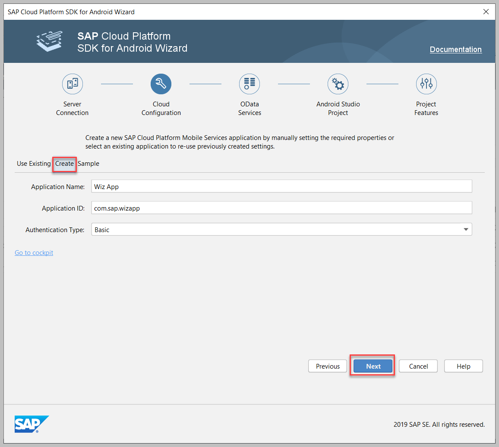
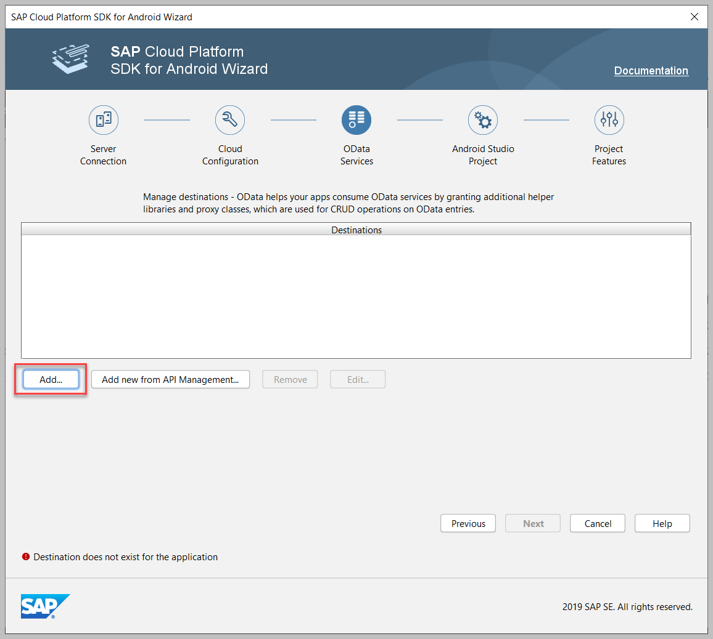
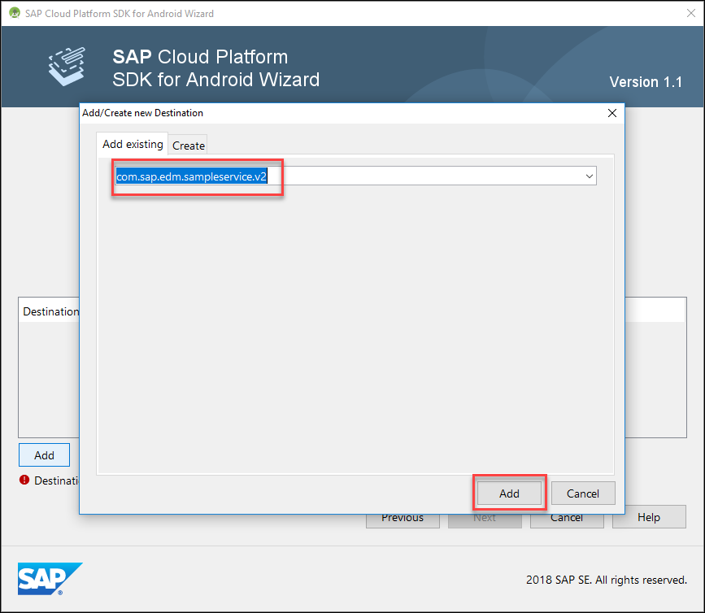
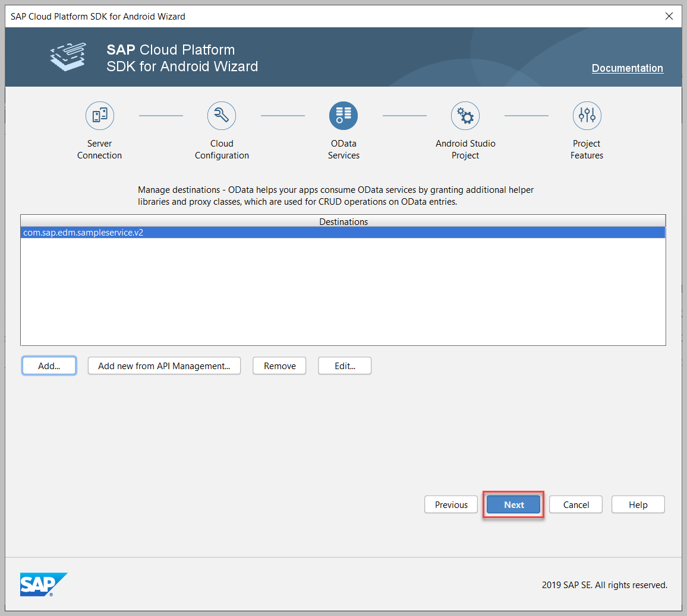
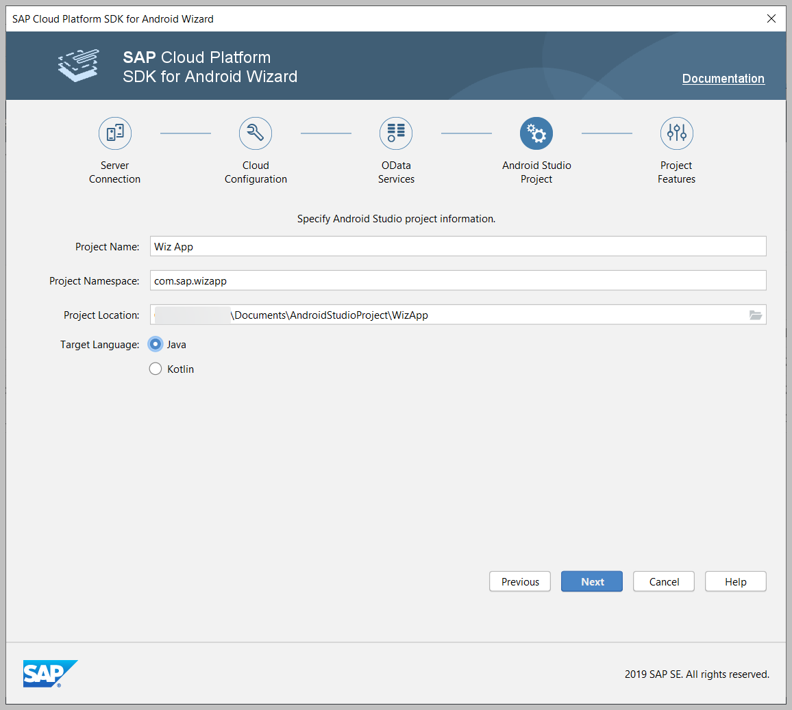
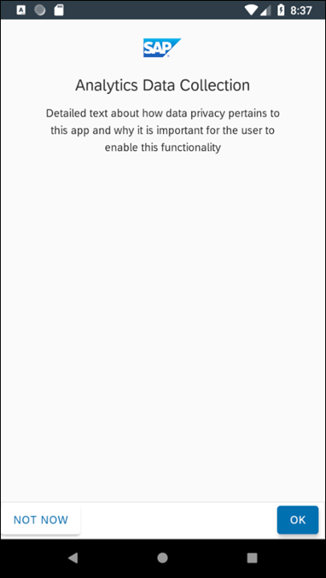

## Prerequisites
- You [created a trial account on SAP Cloud Platform](hcp-create-trial-account).
- [Enabled SAP Cloud Platform mobile services](fiori-ios-hcpms-setup) on **Neo**.
- Installed [Android Studio 3.5.x](https://developer.android.com/studio/archive).
- [Installed](https://help.sap.com/doc/c2d571df73104f72b9f1b73e06c5609a/Latest/en-US/docs/user-guide/getting-started/installing.html) version 2.2.x of the SAP Cloud Platform SDK for Android.
- Created a Google account.

## Details
### You will learn
- How to create and run an Android app using the wizard
- How to use Google Firebase to enable push notifications when generating an Android app using the wizard
- Which screens are generated by the wizard

---

[ACCORDION-BEGIN [Step 1: ](Create the project)]

1.  Open **Android Studio**.

    

2.  Choose **Start a new SAP Cloud Platform Android project**, which is an option created by the SAP Cloud Platform SDK for Android Wizard.

    

3.  The wizard can save the server connection details for multiple servers. Fill in the required fields as shown below.

    | Field | Value |
    |:----|:----|
    | Account Name | **`SAP Cloud Platform Mobile Services Trial`** |
    | Admin API URL | **`See below for how to get this URL`** |
    | Admin UI URL | **`See below for how to get this URL`** |
    | Authentication Type | **`Basic`** |
    | Username | **`Username for your trial account`** |
    | Password | **`Password for your trial account`** |
    | Save Account Information | **`Check this so that you do not have to re-enter account information on subsequent runs of the wizard`** |

4.  Go to the SAP Cloud Platform Mobile Services website and under **Important Links**, both Admin URLs are present and can be copied.

    

    

5.  Click **Next** on the **Server Connection** tab.

6.  On the **Cloud Configuration** tab, select **Create** and provide the required information.

    | Field | Value |
    |:----|:----|
    | Application Name | **`Wiz App`** |
    | Application ID | **`com.sap.wizapp`** |
    | Authentication Type | **`Basic`** |

    

7.  Click **Next** to proceed to configuring the **OData Services**.

8.  Click **Add...** to add an OData service.

    

9.  SAP Cloud Platform mobile services provide a sample back-end destination named `com.sap.edm.sampleservice.v2` that is being used here to provide data for the application. It contains product categories, product, supplier, customer and sales order data. Since you are creating a new application, add `com.sap.edm.sampleservice.v2`.

    

10.  Click **Next** to continue to the project configuration.

    

11.  On the **Android Studio Project** tab, provide the following configuration data.

    | Field | Value |
    |:----|:----|
    | Project Name | **`Wiz App`** |
    | Project Namespace | **`com.sap.wizapp`** |
    | Target Language | **`Java`** / **`Kotlin`** |

    >The screenshot below provides a Java example. Depending on which **Target Language** you choose, either Java or Kotlin code will be generated.

    

12.  On the **Project Features** tab, provide the following configuration data.

    | Field | Value |
    |:----|:----|
    | Use Discovery Service as Configuration Provider | **`uncheck`** |
    | OData | **`Online`** |
    | Create a sample user experience for the selected OData Destination | **`check`** |
    | Enable Logging | **`check`** |
    | Enable Upload | **`check`** |
    | Enable Usage Reporting | **`check`** |
    | Enable Push | **`optional`** |

    

13.  If you would like to add push notification support to your app, proceed to Step 2 which describes how to acquire the `google-services.json` file required for push messaging. Otherwise, uncheck **Enable Push**, click **Finish** and proceed to Step 3.

[VALIDATE_1]
[ACCORDION-END]

[ACCORDION-BEGIN [Step 2: ](Enable push notifications)]

If you check the **Enable Push** checkbox, an error message is displayed explaining that you need to specify a `google-services.json` file. We will obtain this file from the [Cloud Messaging](https://firebase.google.com/docs/cloud-messaging/) feature in [Google Firebase](https://firebase.google.com/).

1.  Open the [Firebase](https://console.firebase.google.com/) console and click **Create project**.

    

2.  Access **Project settings** for the newly created project.

    

3.  Add Firebase to your app.

    

    The **Android package name** must match the **Project Namespace** you used to create the app in Android Studio. In our example, the **Android package name** is **`com.sap.wizapp`**.

    

4.  Download the `google-services.json` file.

    

5.  Now browse for the `google-services.json` file in the wizard. This file is placed into the app folder of the generated project and helps enable the app to work with Google Firebase notifications.

    

    >You can add push configuration on the server as in the [Send Notifications to Your Android Application](cp-sdk-android-wizard-app-push) tutorial.

6.  Click **Finish** and proceed to Step 3.

[VALIDATE_2]
[ACCORDION-END]

[ACCORDION-BEGIN [Step 3: ](Explore the app)]

1.  Wait for the build to finish.

    

2.  Choose an emulator for running the app.
    >For more information on creating virtual devices that run in the Android Emulator, see [Create and manage virtual devices](https://developer.android.com/studio/run/managing-avds) in the Android Studio User Guide.

    

3.  Click the **Run** toolbar icon.

    

    The welcome screen is shown the first time the app is run.

    

4.  Log in with your username and password.

    

    The credentials you enter are securely stored by the app, and do not need to be re-entered the next time you open the app.

    The passcode (or fingerprint if enabled) screen provides an additional layer of security for your app.

    

5.  You can modify the passcode policy in the Mobile Service Cockpit under **Client Policies**. The passcode screen will not be displayed if the **Enable Passcode Policy** is not checked.

    

6.  Because **Enable Usage Reporting** is checked, this screen can be used to show details of how the collected data will be used. For now, select either **NOT NOW** or **OK**. **Usage Reporting** is covered in a later tutorial in this mission.

    

    The first screen of the app shows the different entities that are in the sample OData service.

    

7.  Tap **Products** to navigate to the Products list.

    

8.  Tap a list item to display the below editable detail screen.

    

>For further information on generating your app, see [Running the wizard](https://help.sap.com/doc/c2d571df73104f72b9f1b73e06c5609a/Latest/en-US/docs/user-guide/getting-started/creating_an_app.html).

Congratulations!  You have created your first Android app using the SAP Cloud Platform SDK for Android Wizard!

[VALIDATE_3]
[ACCORDION-END]

---
