## Prerequisites
- You [created a trial account on SAP BTP](hcp-create-trial-account).
- [Enabled SAP Mobile Services](fiori-ios-hcpms-setup) on **Cloud Foundry**.
- Installed [Android Studio 4.1.x](https://developer.android.com/studio/archive). Please use the specified version.
- [Downloaded](https://developers.sap.com/trials-downloads.html?search=sdk%20for%20android) and [Installed](https://help.sap.com/doc/f53c64b93e5140918d676b927a3cd65b/Cloud/en-US/docs-en/guides/getting-started/android/setup.html) version 3.3.x of the SAP BTP SDK for Android.
- Created a Google account.

## Details
### You will learn
- How to create and run an Android app using the wizard
- How to use Google Firebase to enable push notifications when generating an Android app using the wizard
- Which screens are generated by the wizard

---

[ACCORDION-BEGIN [Step 1: ](Create the project)]

>Please read **Prerequisites** first.

1.  Open **Android Studio**.

2.  Choose **Start a new SAP Business Technology Platform Android project**, which is an option created by the SAP BTP SDK Wizard for Android.

    !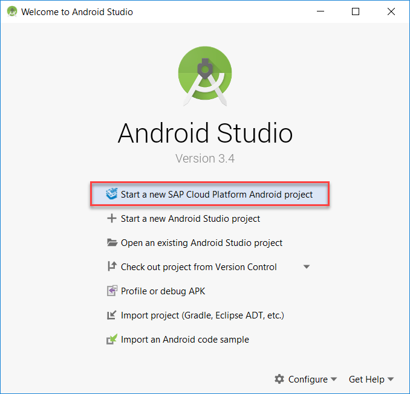

3.  The wizard can save the server connection details for multiple servers. Fill in the required fields as shown below.

    | Field | Value |
    |:----|:----|
    | Account Name | **`SAP Mobile Services Trial`** |
    | Admin API URL | **`See below for how to get this URL`** |
    | Admin UI URL | **`See below for how to get this URL`** |
    | Authentication Type | **`Basic`** |
    | Username | **`Username for your trial account`** |
    | Password | **`Password for your trial account`** |
    | Save Account Information | **`Check this so that you do not have to re-enter account information on subsequent runs of the wizard`** |

4.  Go to the [SAP Mobile Services cockpit](https://mobile-service-cockpit-web.cfapps.eu10.hana.ondemand.com/) and under **Important Links**, both Admin URLs are present and can be copied.

    !

    !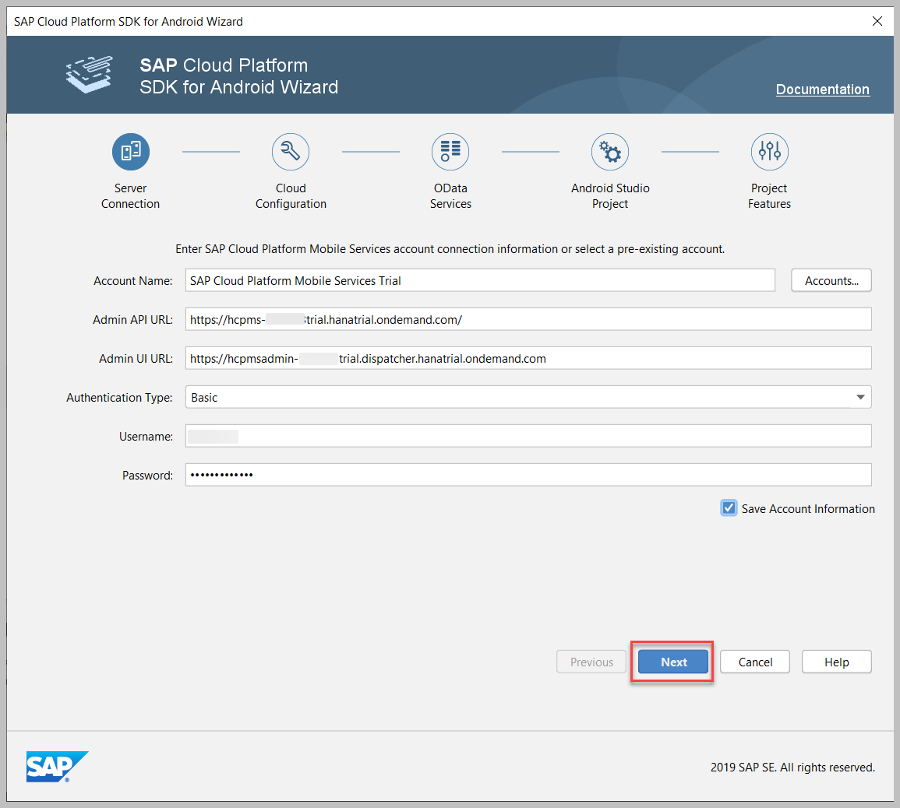

5.  Click **Next** on the **Server Connection** tab.

6.  On the **Cloud Configuration** tab, select **Sample** and set the **Application ID** to be **`com.sap.wizapp`**.

    !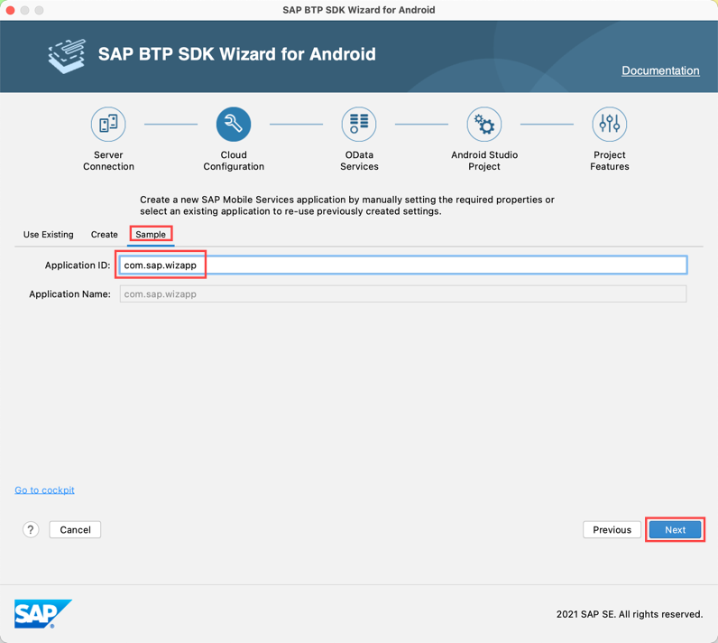

7.  SAP Mobile Services provides a sample back-end destination named `com.sap.edm.sampleservice.v2` that is being used here to provide data for the application. It contains product categories, product, supplier, customer and sales order data. Select it and click **Next**.

    !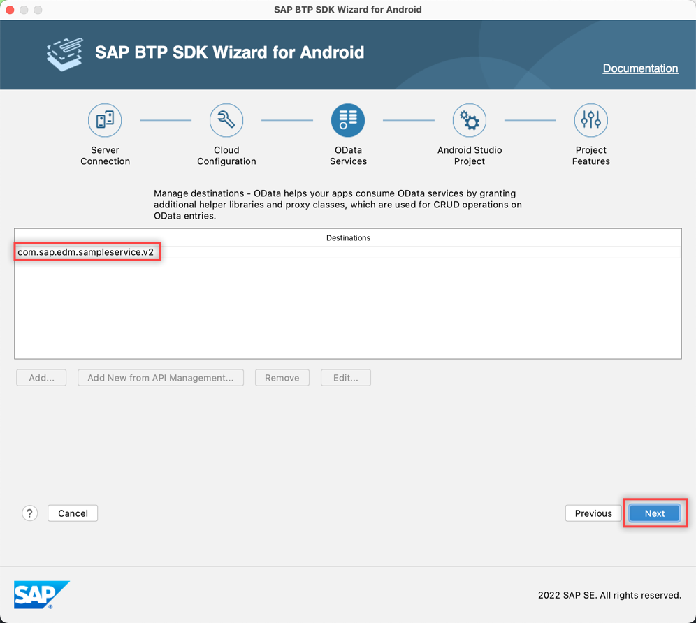

8.  On the **Android Studio Project** tab, provide the following configuration data.

    | Field | Value |
    |:----|:----|
    | Project Name | **`Wiz App`** |
    | Project Namespace | **`com.sap.wizapp`** |
    | Target Language | **`Java`** / **`Kotlin`** |

    >The screenshot below provides a Java example. Depending on which **Target Language** you choose, either Java or Kotlin code will be generated.

    !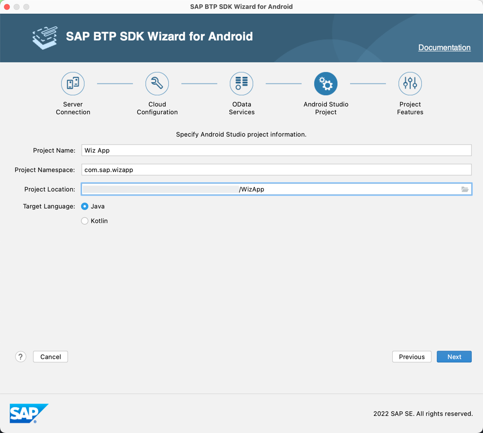

9.  On the **Project Features** tab, provide the following configuration data.

    | Field | Value |
    |:----|:----|
    | Use Discovery Service as Configuration Provider | **`uncheck`** |
    | OData | **`Online`** |
    | Create a Sample User Experience for the Selected OData Destination | **`check`** |
    | Enable Logging | **`check`** |
    | Enable Upload | **`check`** |
    | Enable Usage Reporting | **`check`** |
    | Enable Crash Reporting | **`optional`** |
    | Enable Push | **`optional`** |

    !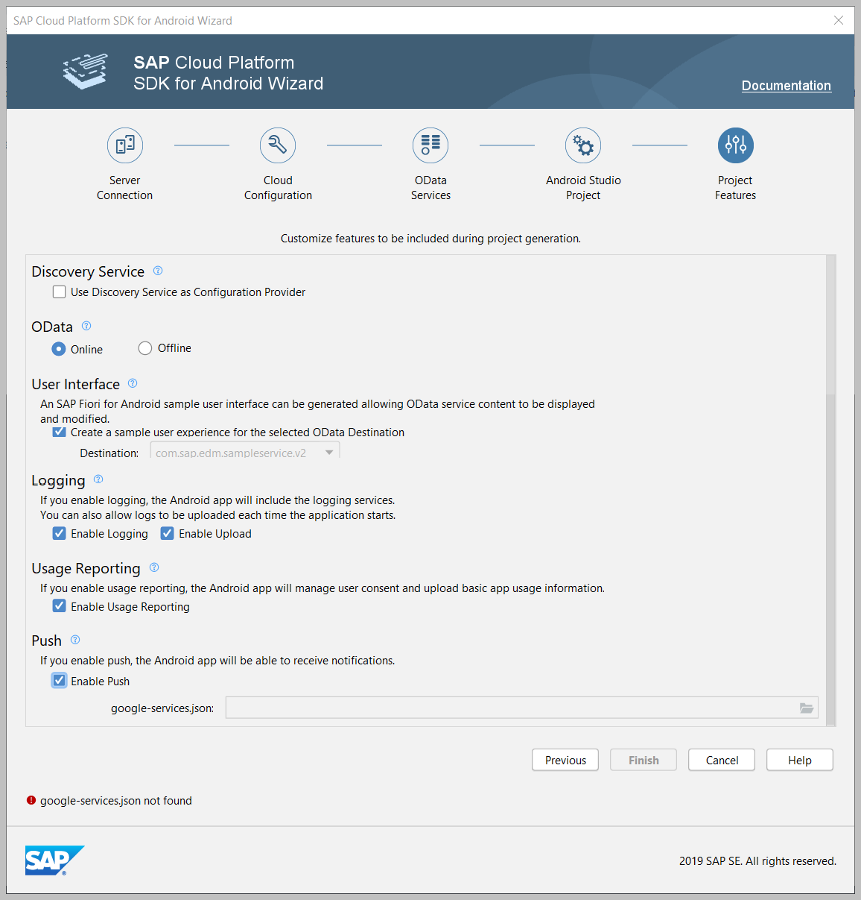

10.  If you would like to add push notification support to your app, proceed to **Step 2**, which describes how to acquire the `google-services.json` file required for push messaging. Otherwise, uncheck **Enable Push**, click **Finish** and proceed to **Step 3**.

[VALIDATE_1]
[ACCORDION-END]

[ACCORDION-BEGIN [Step 2: ](Enable push notifications)]

If you check the **Enable Push** checkbox, an error message is displayed explaining that you need to specify a `google-services.json` file. We will obtain this file from the [Cloud Messaging](https://firebase.google.com/docs/cloud-messaging/) feature in [Google Firebase](https://firebase.google.com/).

!

1.  Open the [Firebase](https://console.firebase.google.com/) console and click **Create project**. (If you have created any before, click **Add project**.)

    !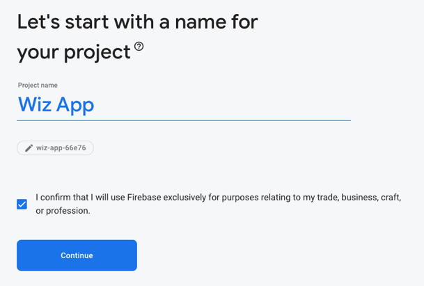

2.  Click **Continue** until a new project is successfully created.

3.  Access **Project settings** for the newly created project.

    !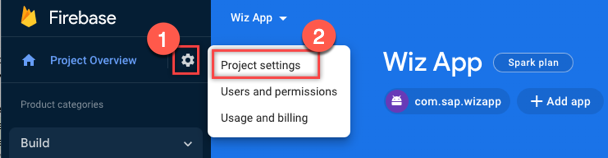

4.  Scroll down and add Firebase to your app.

    !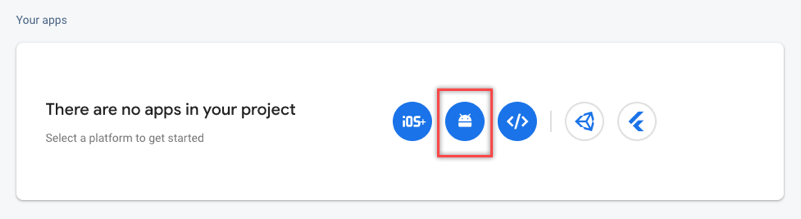

    The **Android package name** must match the **Project Namespace** you used to create the app in Android Studio. In our example, the **Android package name** is **`com.sap.wizapp`**.

    !

5.  Download the `google-services.json` file.

    !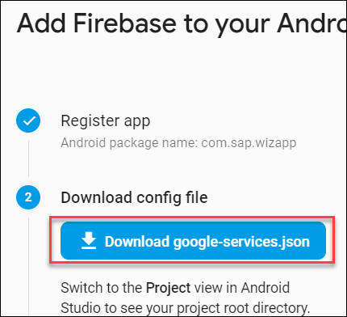

6.  Now browse for the `google-services.json` file in the wizard. This file is placed into the app folder of the generated project and helps enable the app to work with Google Firebase notifications.

    !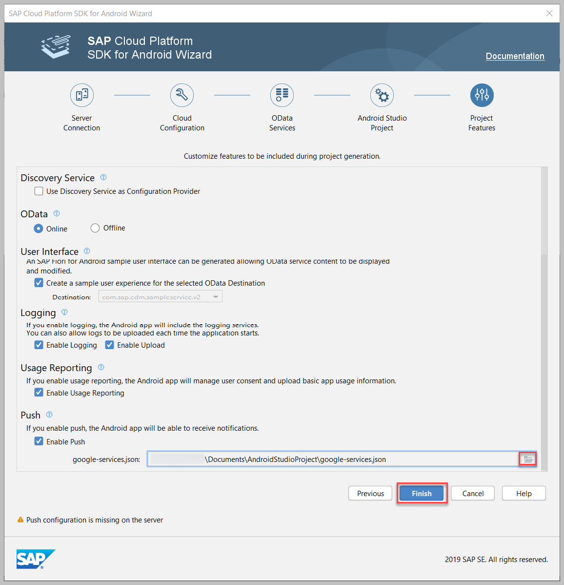

    >You can add push configuration on the server as in the [Send Notifications to Your Android Application](cp-sdk-android-wizard-app-push) tutorial.

7.  Click **Finish** and proceed to **Step 3**.

[VALIDATE_2]
[ACCORDION-END]

[ACCORDION-BEGIN [Step 3: ](Explore the app)]

1.  Wait for the build to finish.

    !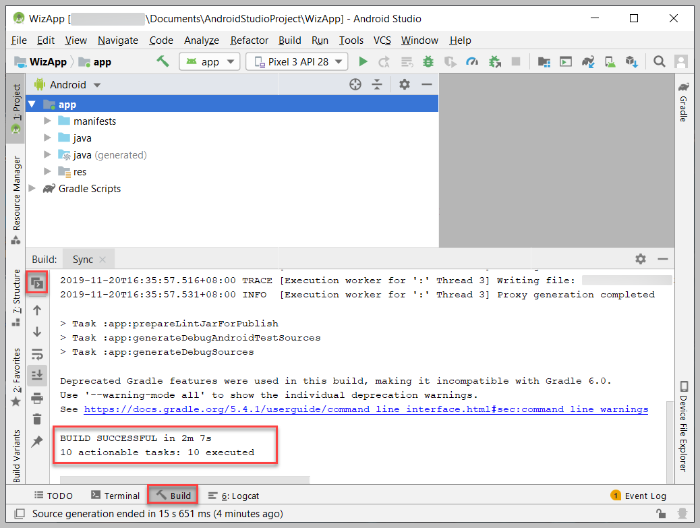

2.  Choose an emulator for running the app.
    >If you enabled push service, please make sure you install an emulator with **Target** labeled as **Google Play**. For more information on creating virtual devices that run in the Android Emulator, see [Create and manage virtual devices](https://developer.android.com/studio/run/managing-avds) in the Android Studio User Guide.

    !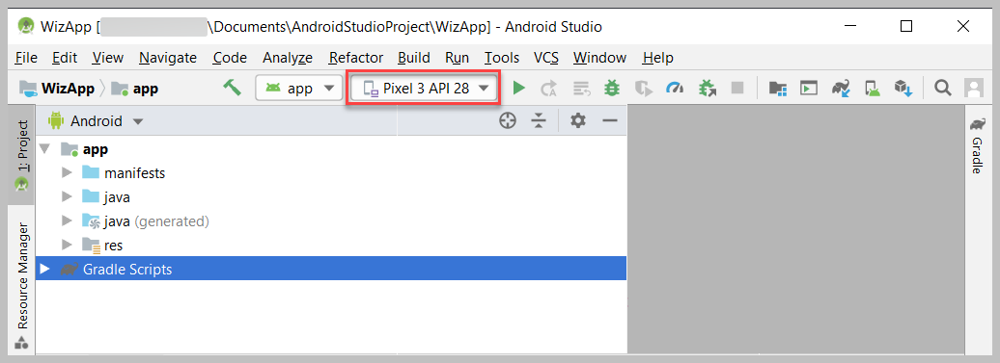

3.  Click the **Run** toolbar icon.

    !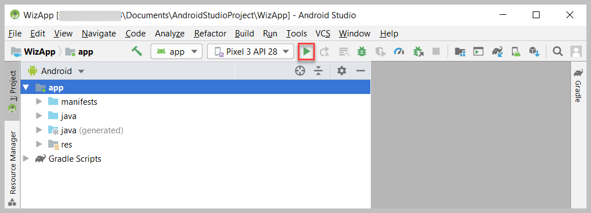

    The welcome screen is shown the first time the app is run.

    !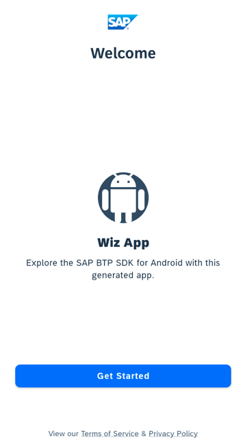

4.  Click **GET STARTED** and the license agreement screen is displayed.

    !

    Read it and click **AGREE**, you will see the **Sign-In** screen of the app. If you select **DISAGREE**, you will be asked to confirm whether to terminate onboarding. If you confirm, you will return to the **Welcome** screen. Otherwise, you can still select **AGREE** to complete onboarding and start to use the app.

    !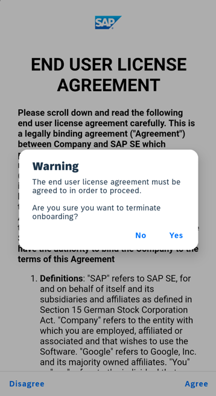

5.  Log in with your username and password.

    !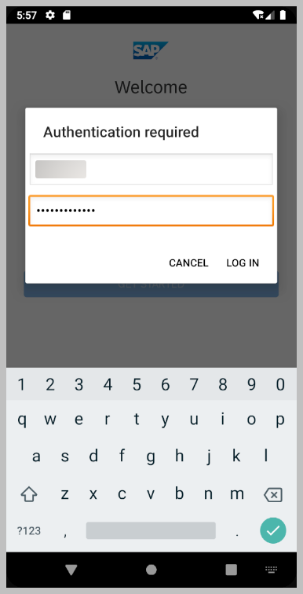

    The credentials you enter are securely stored by the app, and do not need to be re-entered the next time you open the app.

    The passcode (or fingerprint if enabled) screen provides an additional layer of security for your app.

    !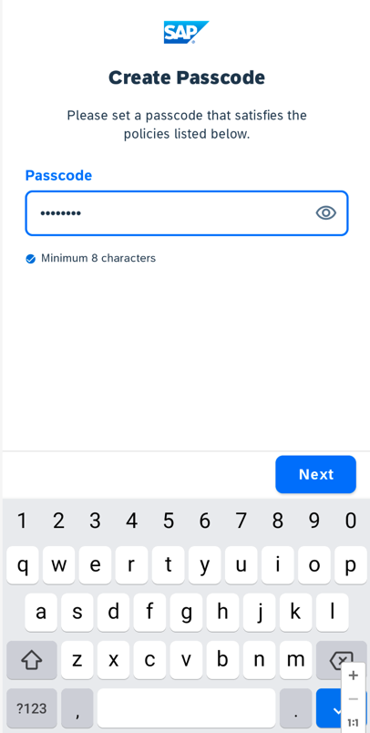

6.  You can modify the passcode policy in the [Mobile Service Cockpit](https://mobile-service-cockpit-web.cfapps.eu10.hana.ondemand.com/) under **Client Configuration** in **Mobile Settings Exchange** page. The passcode screen will not be displayed if the **Enable Passcode Policy** is not checked.

    !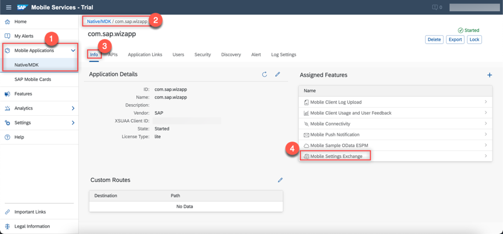

    !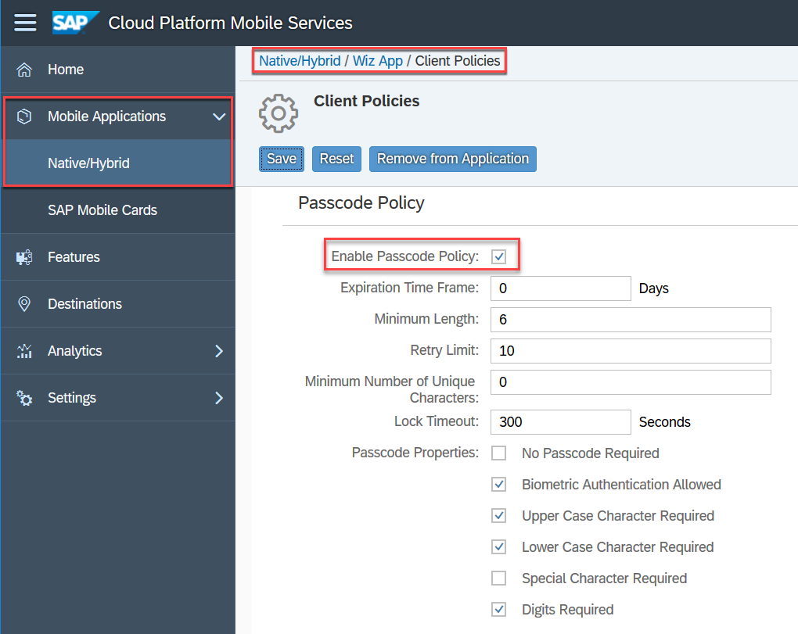

7.  Because **Enable Usage Reporting** is checked, this screen can be used to show details of how the collected data will be used. For now, select either **ALLOW** or **DENY**. **Usage Reporting** is covered in a later tutorial in this mission.

    !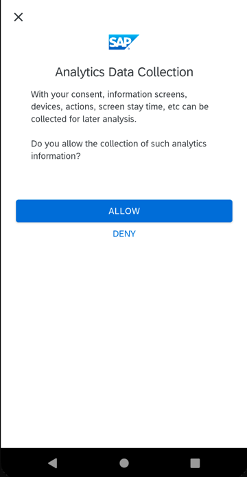

8.  Just like usage reporting, since **Enable Crash Reporting** is checked as well, this screen will be used to display details of how the collected information will be used. Select either **ALLOW** or **DENY**. If you select **DENY**, the crash information will only be stored locally.

    !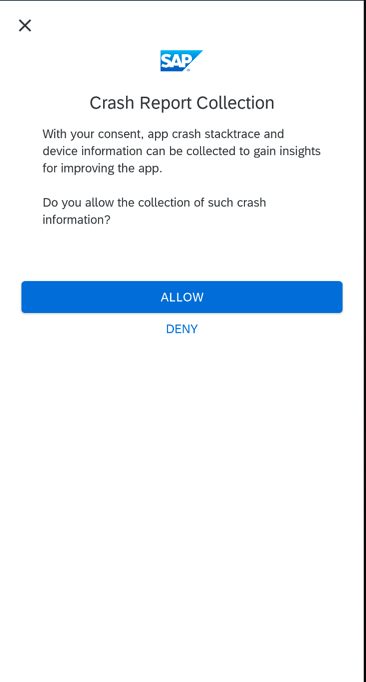

9.  The first screen of the app shows the different entities that are in the sample OData service.

    !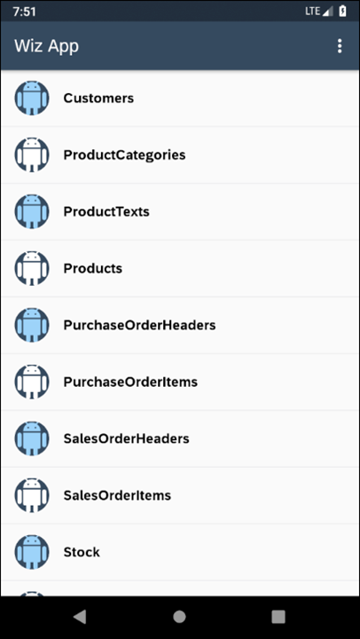

    Tap **Products** to navigate to the products list.

    !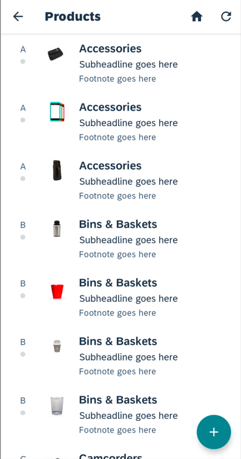

10.  Tap a list item to display the following editable detail screen.

    !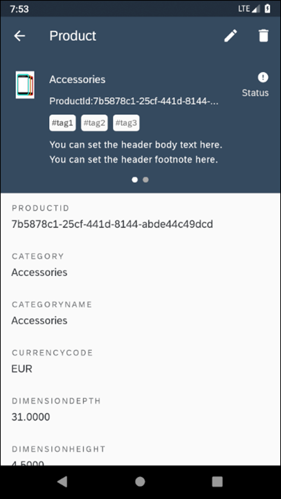

>For further information on generating your app, see [Creating Apps with the Wizard](https://help.sap.com/doc/f53c64b93e5140918d676b927a3cd65b/Cloud/en-US/docs-en/guides/getting-started/android/creating-an-app.html).

Congratulations! You have created your first Android app using the SAP BTP SDK Wizard for Android!

[VALIDATE_3]
[ACCORDION-END]

---
