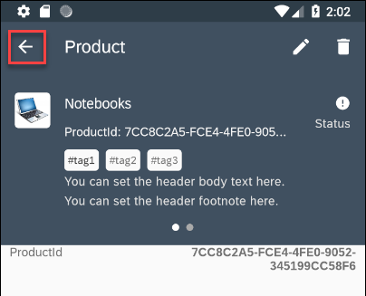
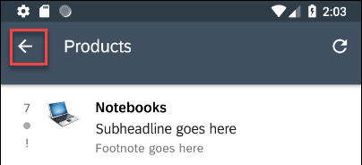
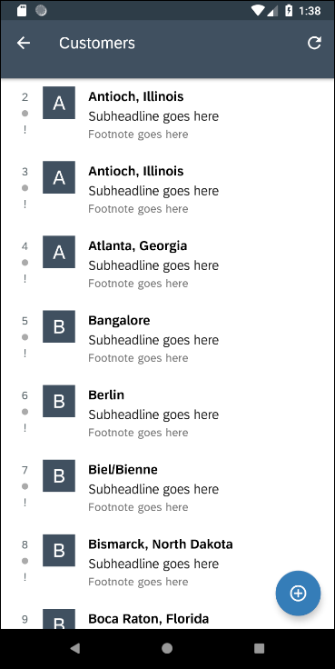
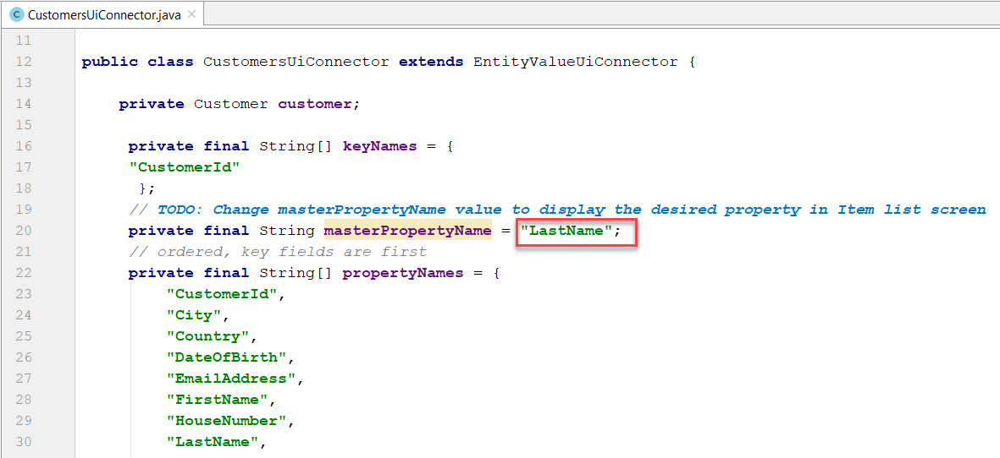
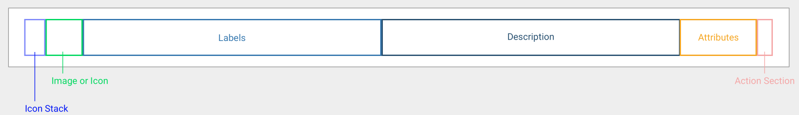
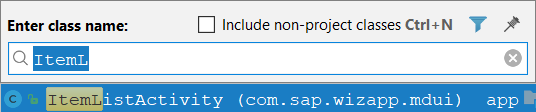
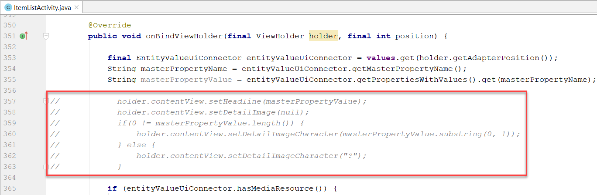
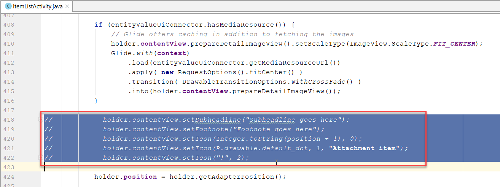
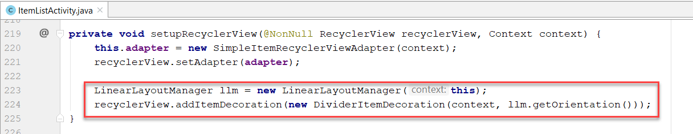
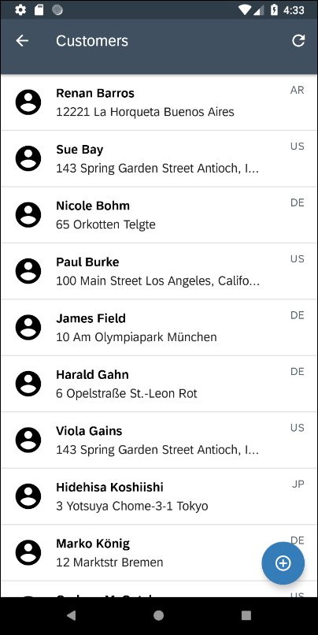

## Details
### You will learn  
  - How to enhance your Android application with Fiori for Android controls

---

[ACCORDION-BEGIN [Step 1: ](Change master property for customer's screen)]
If your application is still running on your emulator then return to the entity list screen by pressing the back button twice. If you restarted your application or restarted the emulator the first screen of the app will be the entity list screen.




Tap on the **Customers** entity.


Notice that it displays the customer's city rather than the customer's name.



This is because the app was generated from the <a target="_blank" href="https://hcpms-p2000464045trial.hanatrial.ondemand.com/mobileservices/origin/hcpms/ESPM.svc/v2/$metadata">OData service metadata</a>, which does not indicate which of the many fields from the customer entity to display.


In Android Studio, press **`Control+N`** and enter **`CustomersUiConnector`** to open the **`CustomersUiConnector.java`** file.
Change the value from **`City`** to **`LastName`** for the variable **`masterPropertyName`**.



Run the app and notice that the Customers screen now displays the customer's last name.


Each customer is displayed in an <a target="_blank" href="https://help.sap.com/doc/c2d571df73104f72b9f1b73e06c5609a/Latest/en-US/docs/fioriui/object_cell.html">Object Cell</a>, which is one of the Fiori UI for Android controls.



As seen above, an Object Cell can display more than one field.  In the next two sections, the app will be modified to display different content in the Object Cells and a separator decoration will be added between rows.

[DONE]
[ACCORDION-END]

[ACCORDION-BEGIN [Step 2: ](Display first name, last name, address and image)]

Go to Android Studio, press **`Control+N`** and enter **`ItemListActivity`** to open the `ItemListActivity.java` file.



Press **`Control+F12`** and enter **`onBindViewHolder`** to move to the `onBindViewHolder` method.


Comment out (select and press **`Ctrl+/`**) the following lines of code which set the `ObjectView's` headline, and detail image.



Below the commented lines, add the following code.

```Java
//This customization is for the customer's screen only
if (entityValueUiConnector.getConnectedObject().getDataType().equals(ESPMContainerMetadata.EntityTypes.customer)) {
    //Set the ObjectView's Headline with FirstName, LastName
    String name = entityValueUiConnector.getPropertiesWithValues().get("FirstName") + " " +
            entityValueUiConnector.getPropertiesWithValues().get("LastName");
    holder.contentView.setHeadline(name);

    //Set the ObjectView's SubHeadline with address
    String country = entityValueUiConnector.getPropertiesWithValues().get("Country");
    String address = entityValueUiConnector.getPropertiesWithValues().get("HouseNumber");
    address = address + " " + entityValueUiConnector.getPropertiesWithValues().get("Street");
    address = address + " " + entityValueUiConnector.getPropertiesWithValues().get("City");
    holder.contentView.setSubheadline(address);

    //Set the Status to be the country code
    holder.contentView.setStatus(country, 1);

    //Use a different image
    Drawable drawable = ContextCompat.getDrawable(getApplicationContext(), R.drawable.ic_account_circle_black_24dp);
    holder.contentView.setDetailImage(drawable);

    //Set the ObjectView to only show 2 lines per row instead of 3
    holder.contentView.setLines(2);
}
else {
    holder.contentView.setHeadline(masterPropertyValue);
    holder.contentView.setDetailImage(null);
    if(0 != masterPropertyValue.length()) {
        holder.contentView.setDetailImageCharacter(masterPropertyValue.substring(0, 1));
    } else {
        holder.contentView.setDetailImageCharacter("?");
    }

    holder.contentView.setSubheadline("Subheadline goes here");
    holder.contentView.setFootnote("Footnote goes here");
    holder.contentView.setIcon(Integer.toString(position + 1), 0);
    holder.contentView.setIcon(R.drawable.default_dot, 1, R.string.attachment_item_content_desc);
    holder.contentView.setIcon("!", 2);
}
```

Notice that two of the classes, `ESPMContainerMetadata` and `Drawable` cannot be resolved and are shown in red.  


Select each class and press **`Alt+Enter`** to make use of Android Studio quick fix to add the missing imports.

Comment out (select and press Ctrl /) the lines (around line 400) that set the **`Subheadline`**, **`Footnote`** and **`Icon`** as that is now conditionally handled in the previously added code.



Run the app and notice the Customer's screen has been customized.


[DONE]
[ACCORDION-END]

[ACCORDION-BEGIN [Step 3: ](Add a divider)]

Press **`Ctrl+F12`** and enter **`setupRecyclerView`** to move to the `setupRecyclerView` method.

Add the below lines:

```Java
LinearLayoutManager llm = new LinearLayoutManager(this);
recyclerView.addItemDecoration(new DividerItemDecoration(context, llm.getOrientation()));
```


Notice that two of the classes, `LinearLayoutManager` and `DividerItemDecoration` cannot be resolved.  Select each class and press  **`Alt+Enter`** to make use of Android Studio quick fix to add the missing imports.

Run the app and notice that each row in the Recycler View has a divider.



[VALIDATE_1]
[ACCORDION-END]
---
