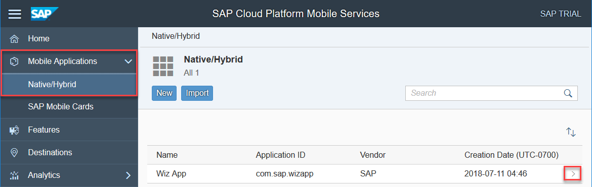
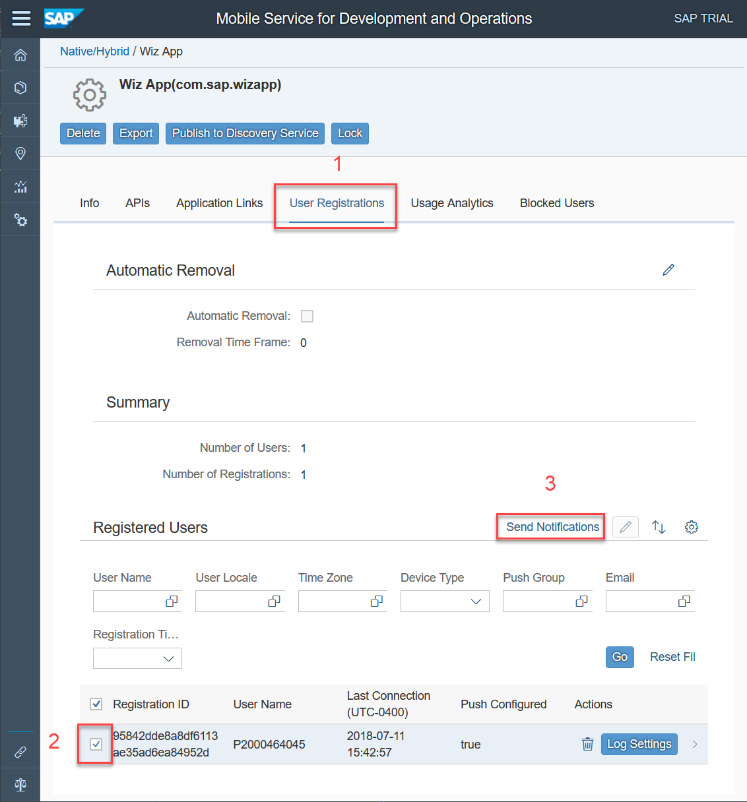
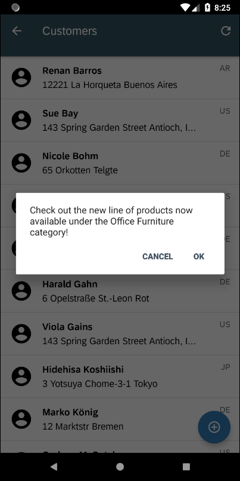

## Details
### You will learn  
  - How to add foreground notifications
  - How to add background notifications

---

[ACCORDION-BEGIN [Step 1: ](Send a notification)]

Open the <a target="_blank" href="https://hcpmsadmin-p2000464045trial.dispatcher.hanatrial.ondemand.com/sap/mobile/admin/ui/index.html">SAP Cloud Platform Mobile Services management cockpit</a> by right-clicking on the link and choose **Open link in incognito window**.

Enter the following credentials.
| Field | Value |
|:----|:----|
| Username | `p2000464045` |
| Password | `SCP!2pwd` |

Under **Mobile Applications**, select **`Wiz App`**.

Select the **User Registrations** tab to send the notification to your app.  

> It may be difficult to tell which registration to choose. The **`Last Connection`** field shows the last time a given registration made a request.  If you are unsure which registration to choose, click through a few screens in the application and then press the **GO** button to refresh the display or select all of them and send a greeting to all the registrations.

Specify the notification text to send to the app.

[DONE]
[ACCORDION-END]

[ACCORDION-BEGIN [Step 2: ](Receive foreground notification)]
Notice that the app shows the notification.

[DONE]
[ACCORDION-END]

[ACCORDION-BEGIN [Step 3: ](Receive background notification)]

On the emulator, open another app, such as Chrome, which will cause the Wiz App to no longer be the foreground app.

If you now send another notification you notice that since the app is in the background, or not running, a notification is placed in the notification drawer.

Tapping on the notification will bring the app to the foreground or open the app.

Currently, the message is displayed in an `AlertDialog`.

Custom logic could be added to the app to decide on the action to take, such as displaying the new Office Furniture category.

> Further information on push can be found at <a target="_blank" href="https://help.sap.com/doc/c2d571df73104f72b9f1b73e06c5609a/Latest/en-US/docs/user-guide/foundation/remotenotification.html">Push Notifications</a>, <a target="_blank" href="https://help.sap.com/viewer/38dbd9fbb49240f3b4d954e92335e670/Cloud/en-US/aaec2dbe78ec4fc08ef0a605a899e3dd.html">Push API Notification Scenarios</a>, and <a target="_blank" href="https://firebase.google.com/docs/cloud-messaging/concept-options">About FCM Messages</a>

[VALIDATE_1]
[ACCORDION-END]

---
