## Prerequisites  
 - **Proficiency:** Beginner

## Details
### You will learn  
  - How to create an Android app using the Android Studio integrated SAP Wizard.
  - About Fiori UI for Android and how to use Object Cells.
  - How to send a native notification to a registered user of the app.

The <a target="_blank" href="https://blogs.sap.com/2018/06/06/sap-cloud-platform-sdk-for-android-has-arrived/">SAP Cloud Platform SDK for Android</a> is available in limited release with general availability expected later this year.  


### Time to Complete
**20 Min**

---

[ACCORDION-BEGIN [Step 1: ](Setup)]

- If Android Studio is running, close it.

- If there is an existing project at `C:\AndroidStudioProjects\WizApp`, delete it.


- If there is an emulator running and an app on it named Wiz App, delete it (Long press, App info, UNINSTALL).

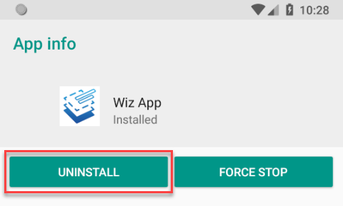

On this machine, the SAP Cloud Platform SDK for Android has been installed and configured to make use of an instance of a SAP Cloud Platform Mobile Services trial account with an application configuration that has push notifications enabled.

All set, let's begin!

[ACCORDION-END]

[ACCORDION-BEGIN [Step 2: ](Create and run the project)]
Open **Android Studio**.


Choose **Start a new SAP Cloud Platform Android project**.
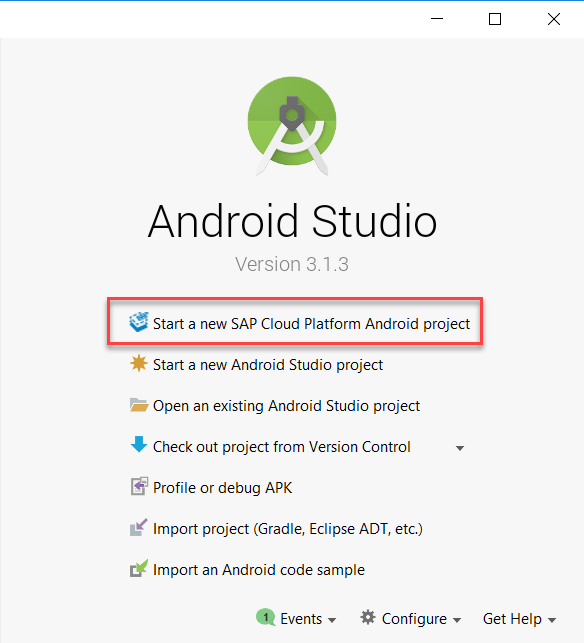

The wizard can save the server connection details for multiple servers.  A preconfigured account has been provided.

Click **Next** on the **Server Connection** tab.
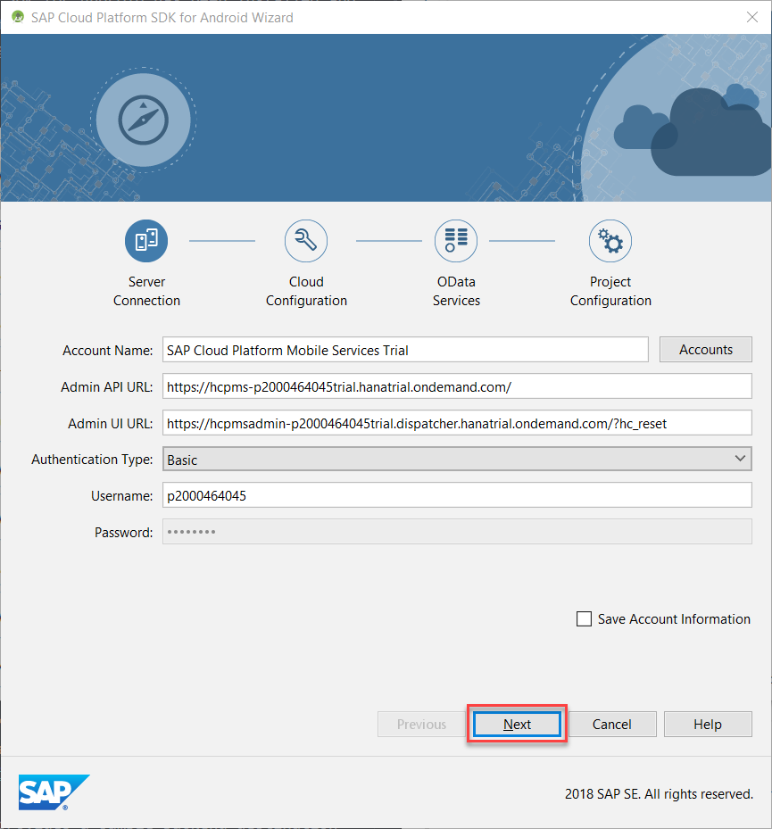
>Note: If the values are missing, the following values can be used.
>```Account Name: SAP Cloud Platform Mobile Services Trial```
>```Admin API URL: https://hcpms-p2000464045trial.hanatrial.ondemand.com/```
>```Admin UI URL: https://hcpmsadmin-p2000464045trial.dispatcher.hanatrial.ondemand.com/?hc_reset```
>```Username: p2000464045```
>```Password: SCP!2pwd```

On the **Cloud Configuration** tab:

  1. Select **Use Existing**.
  2. Choose the Application ID **`com.sap.wizapp`**.
  3. Click **Next**.

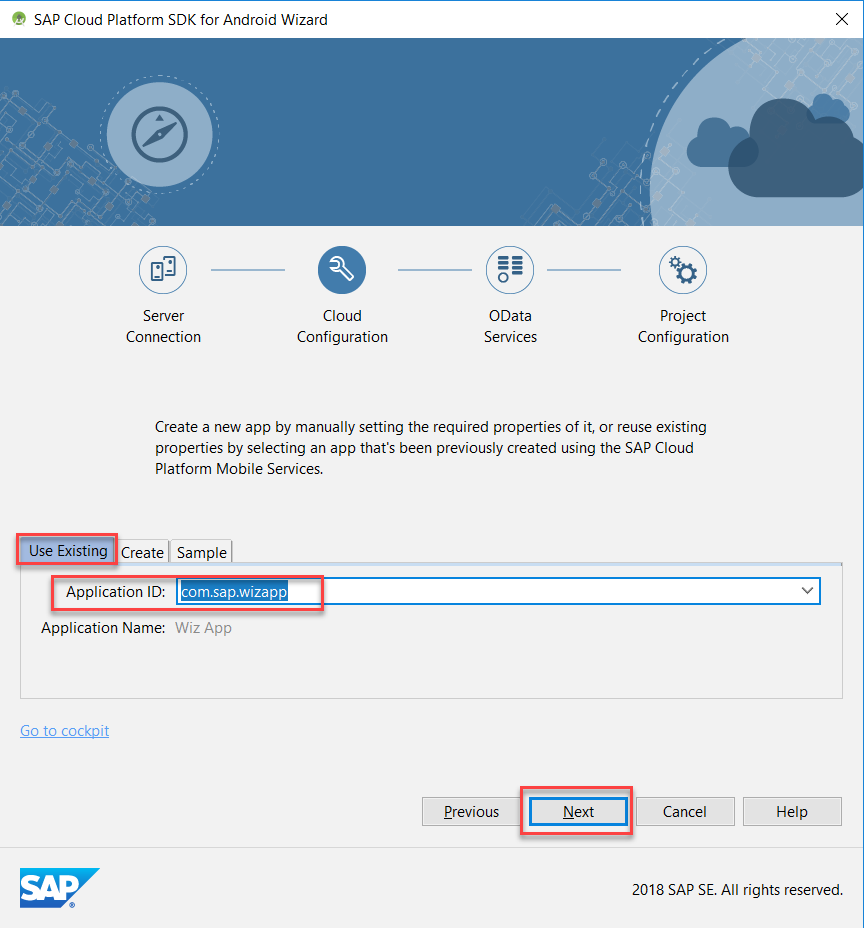

The SAP Cloud Platform Mobile Services provides a sample backend destination named `com.sap.edm.sampleservice.v2` that is being used here to provide data for the application.  It contains product categories, product, supplier, customer and sales order data.

Click **Next**.
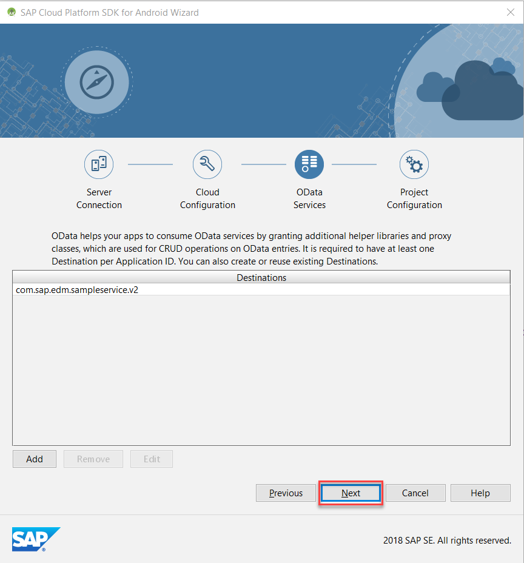

On the **Project Configuration** tab:

1. Set the **Project Name** to Wiz App.
2. Set **Project Namespace** to `com.sap.wizapp`.
3. Set **Project Location** to `C:\AndroidStudioProjects\WizApp`.
4. Check the **Enable Push** checkbox to enable push notification support in the app.
5. For **JSON File Location**, browse to `C:\AndroidStudioProjects\` and select the `google-services.json`, which will enable the app to work with Google Firebase notifications.
6. Click **Finish**.

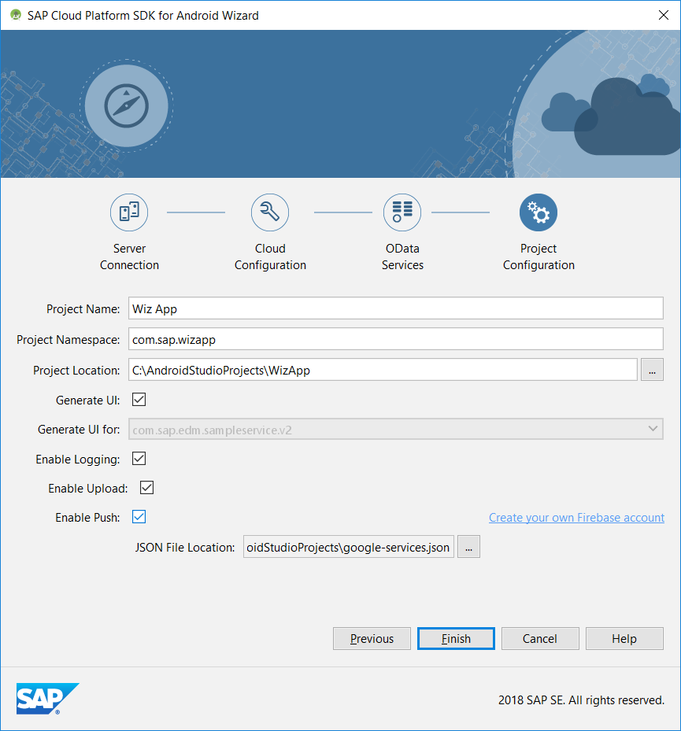

After clicking **Finish**, a project is created.
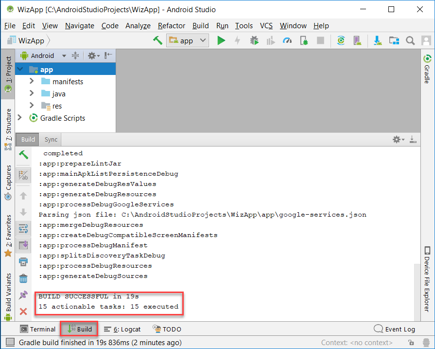

Click the **Run** toolbar icon.


Choose the emulator to run the app on.
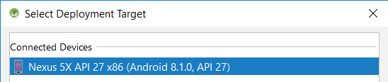

[ACCORDION-END]


[ACCORDION-BEGIN [Step 3: ](Explore the app)]
The welcome screen is shown the first time the app is run.


Sign in with the following credentials:

- User Name: `p2000464045`
- Password: `SCP!2pwd`

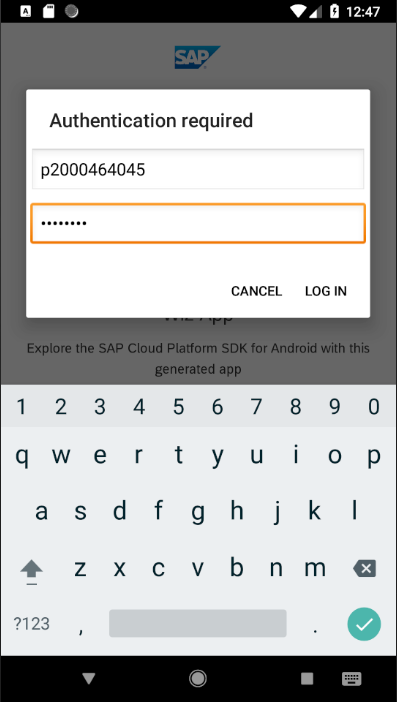
The credentials are used to authenticate against the SAP Cloud Platform Identity Service, are  securely stored by the app, and do not need to be re-entered.  Take note of the time that the authentication occurred.  This will be helpful to know to identify the correct registration in the __Send a notification__ step.


The passcode (or fingerprint if enabled) screen provides an additional layer of security for your app.
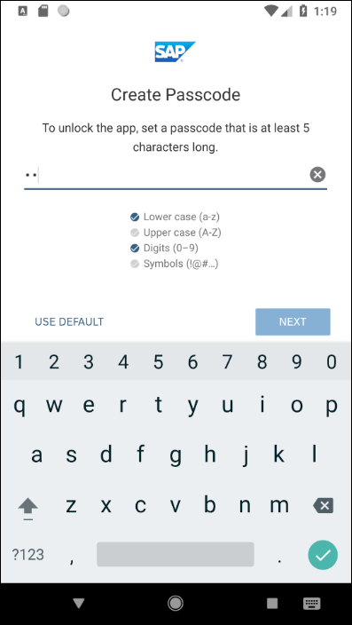

The first screen of the app shows the different entities that are in the sample OData service.


Click on `ProductCategories` to reach the below list screen.
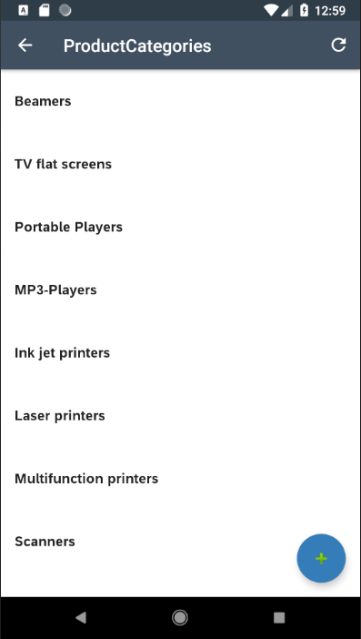

Click on a list item to show an editable detail screen.
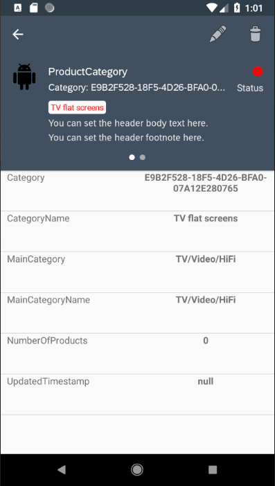


[ACCORDION-END]

[ACCORDION-BEGIN [Step 4: ](Examine the customer's screen)]
Return to the entity list screen (first screen of the app) by pressing the back button twice.
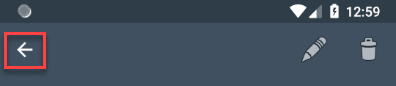

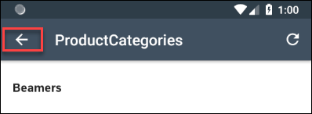

Click the **Customers** entity.


Notice that it displays the city rather than the customer name and address.  This is because the app was generated from the OData service metadata, which does not indicate which of the many fields from the customer entity to display.
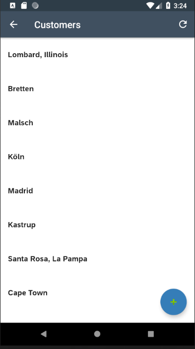

Each customer is displayed in an Object Cell, which is one of the Fiori UI for Android controls.


As seen above, an Object Cell can display more than one field.  In the next section, the app will be modified to make use of the image, the labels (headline, sub-headline), and the attributes (status) fields.  A separator decoration will be added between rows, and the customers will be shown in alphabetical order.


[ACCORDION-END]


[ACCORDION-BEGIN [Step 5: ](Add first name, last name, address, image)]

In Android Studio:

1. Press **`Control+N`** and enter **`ItemListActivity`** to open the `ItemListActivity.java` file.

2. Press **`Control+F12`** and enter **`onBindViewHolder`** to move to the `onBindViewHolder` method.
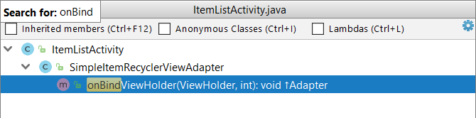
3. Find the fourth line of code.
    ```
    holder.mContentView.setHeadline(mPropValue);
    ```
    

4. Replace it with the code below.
    ```Java
    if (eValue instanceof CustomersUIConnector && mProp.equals("City")) {
        String name = eValue.getPropertiesWithValues().get("FirstName")+ " "
                + eValue.getPropertiesWithValues().get("LastName");
        String address = eValue.getPropertiesWithValues().get("HouseNumber") + " " +
                eValue.getPropertiesWithValues().get("Street") + " " +
                eValue.getPropertiesWithValues().get("City");
        String country = eValue.getPropertiesWithValues().get("Country");
        holder.mContentView.setHeadline(name);
        holder.mContentView.setSubheadline(address);
        Drawable drawable = ContextCompat.getDrawable(getApplicationContext(),
              R.drawable.ic_account_circle_black_24dp);
        holder.mContentView.setDetailImage(drawable);
        holder.mContentView.setStatus(country, 1);
    }
    else {
        holder.mContentView.setSubheadline("");
        holder.mContentView.setHeadline(mPropValue);
    }
    ```

5. Notice that two of the classes, `CustomersUIConnector` and `Drawable` cannot be resolved and are shown in red.  
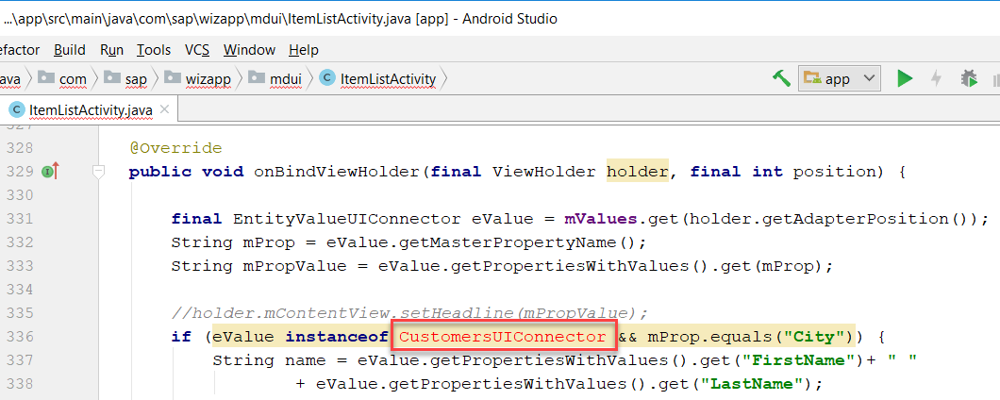
Select each class and press **`Alt+Enter`** to make use of Android Studio quick fix to add the missing imports.

[ACCORDION-END]

[ACCORDION-BEGIN [Step 6: ](Add a divider)]

1. Press **`Ctrl+F12`** and enter **`setupRecyclerView`** to move to the `setupRecyclerView` method.
2. Add the below lines.

    ```Java
    LinearLayoutManager llm = new LinearLayoutManager(this);
    recyclerView.addItemDecoration(new DividerItemDecoration(ctx, llm.getOrientation()));
    ```
    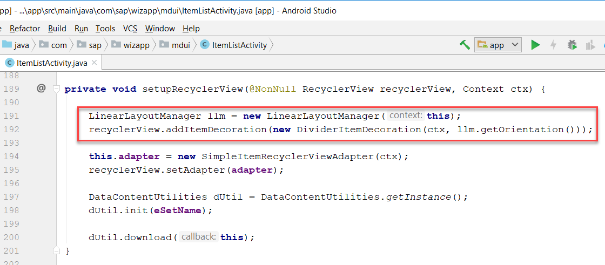
3. Notice that two of the classes, `LinearLayoutManager` and `DividerItemDecoration` cannot be resolved.  Select each class and press  **`Alt+Enter`** to make use of Android Studio quick fix to add the missing imports.

[ACCORDION-END]

[ACCORDION-BEGIN [Step 7: ](Sort by last name)]
1. Press **`Cntl+N`** and enter **`DownloadOperation`** to open the `DownloadOperation.java` file.
2. Press **`Ctrl+F`** and search for **`getCustomers`**.  
3. Replace the line (73) containing the `getCustomers` method call with the below code.

    ```Java
    DataQuery query = new DataQuery().orderBy(Customer.lastName);
    List<com.sap.cloud.android.odata.espmcontainer.Customer> customers =
          mESPMContainer.getCustomers(query);
    ```
    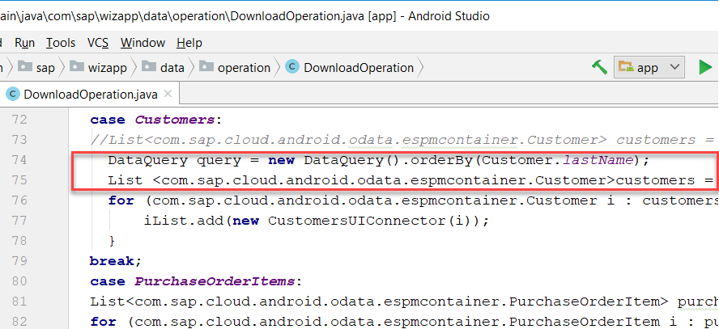
[ACCORDION-END]

[ACCORDION-BEGIN [Step 8: ](Run the modified app)]

Click the **Run** toolbar icon to run the app and try out the changes.


Notice that the **Customers** screen now contains additional fields in it's Object Cells, contains dividers, and displays in alphabetical order on the customer's last name.
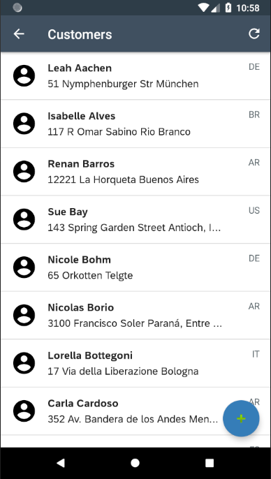


[ACCORDION-END]

[ACCORDION-BEGIN [Step 9: ](Send a notification)]
1. Open the
<a target="_blank"  href="https://hcpmsadmin-p2000464045trial.dispatcher.hanatrial.ondemand.com/sap/mobile/admin/ui/index.html#/page.apps">SAP Cloud Platform Mobile Services management cockpit</a> with the following credentials:
    - User Name: `p2000464045`
    - Password: `SCP!2pwd`
  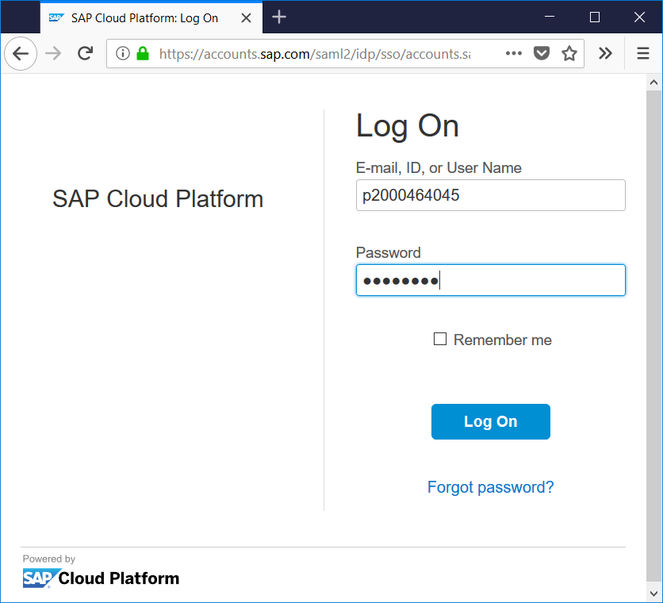
2. Under **Mobile Applications**, select `Wiz App`.
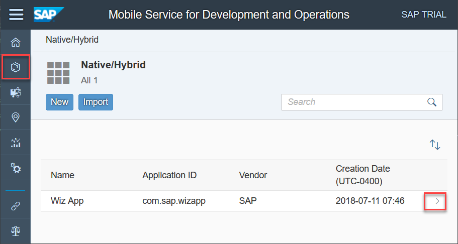
3. Select the registration to send the notification to.
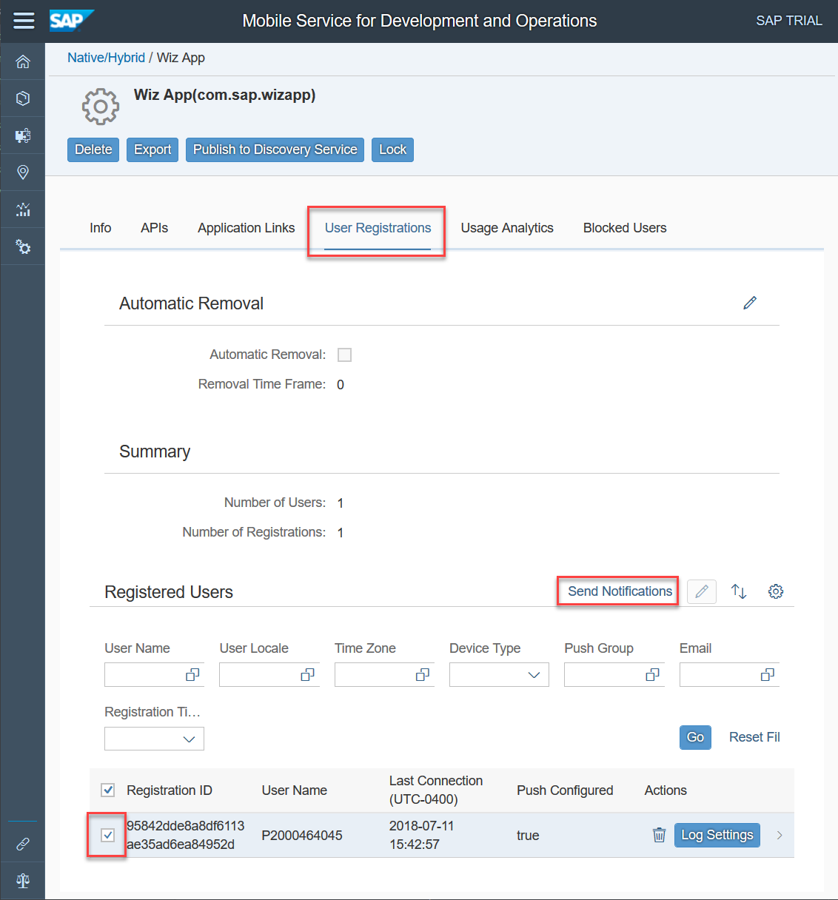
4. Specify the notification text to send to the app.
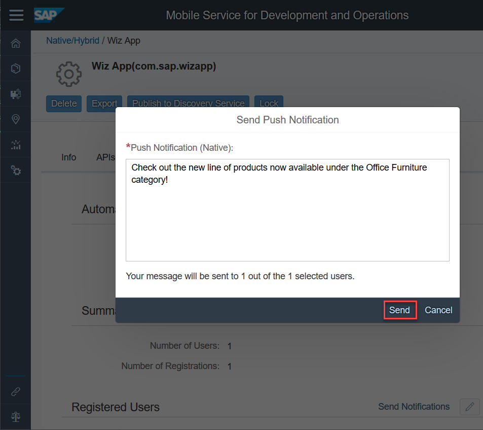


[ACCORDION-END]

[ACCORDION-BEGIN [Step 10: ](Receive the notification in the app)]

Notice that the app shows the notification.
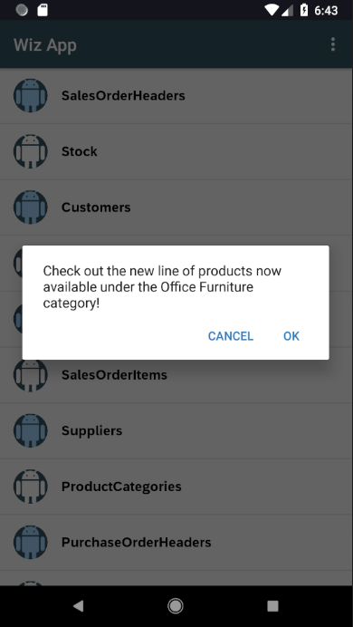

[ACCORDION-END]


[ACCORDION-BEGIN [Step 11: ](Receive notification in device notification drawer)]

On the emulator, open another app, such as Chrome, which will cause the Wiz App to no longer be the foreground app.

Send another notification.

Notice that since the app is in the background or not running, a notification is placed in the notification drawer.

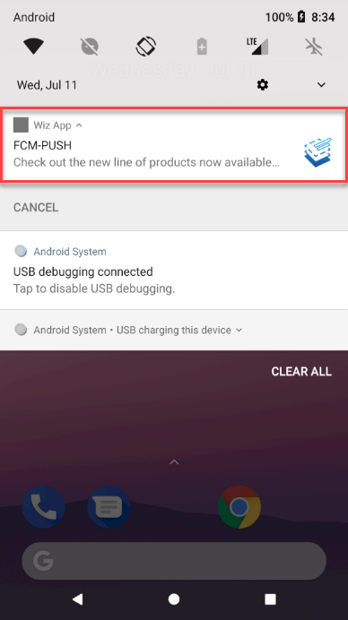

Clicking on the notification will bring the app to the foreground or open the app.  Custom logic could be added to the app to decide on the action to take, such as displaying the new Office Furniture category.

[ACCORDION-END]


[ACCORDION-BEGIN [Step 12: ](Bonus)]

Congratulations! You have now completed the SAP Cloud Platform SDK for Android tutorial.

Send one more notification with a short description of an app you might consider making with the SDK and show it to an SAP staff member for some cool swag.

[ACCORDION-END]


---
