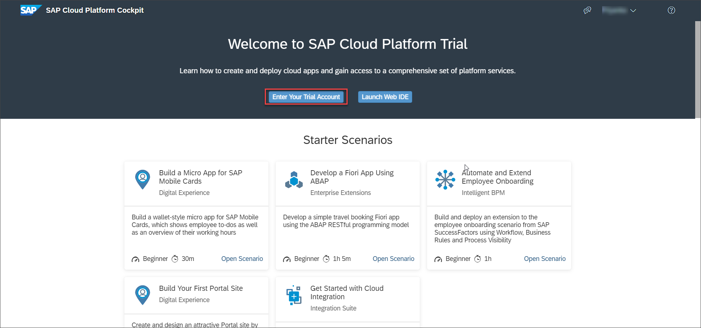
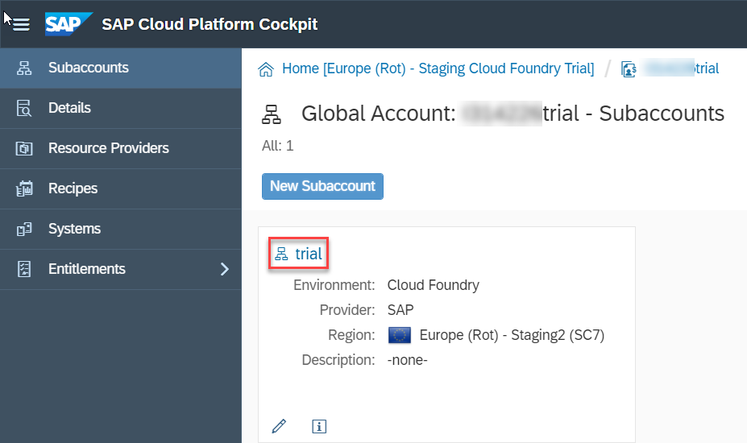
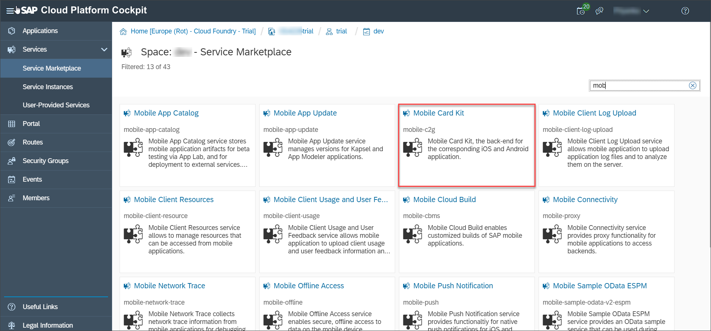
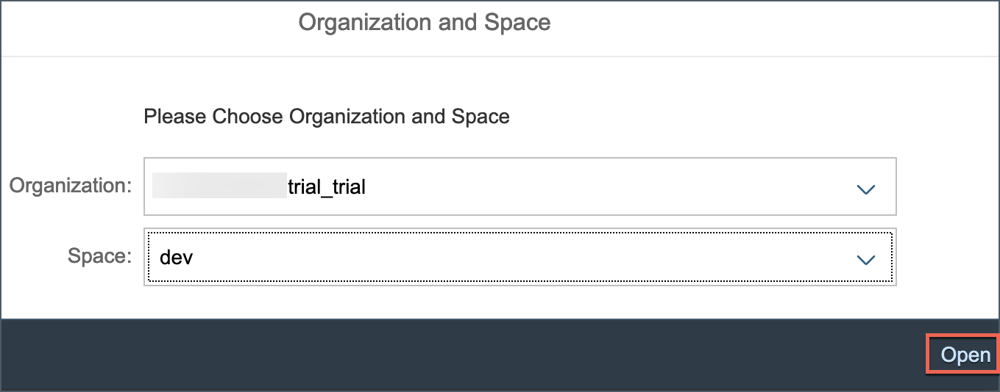
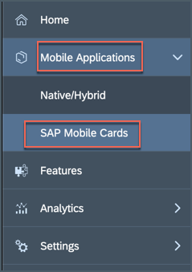
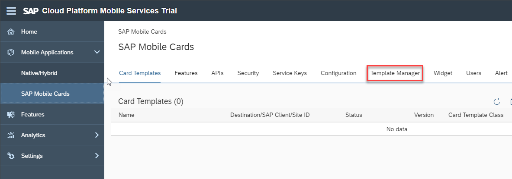
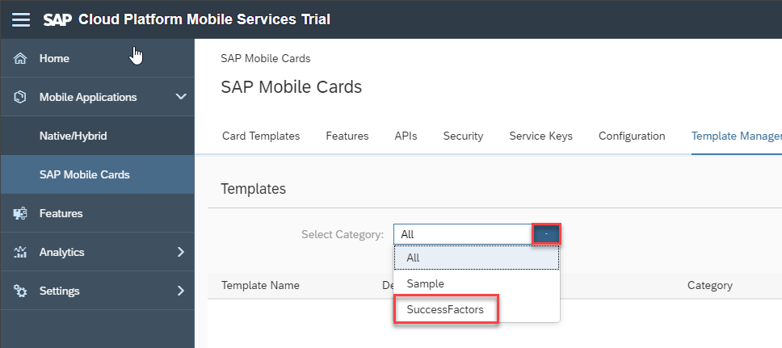
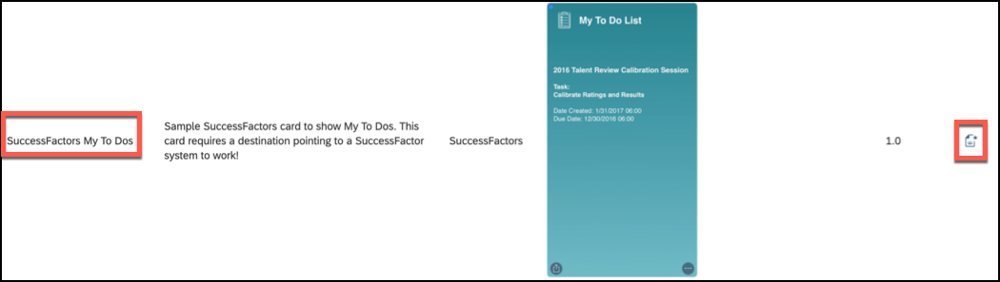
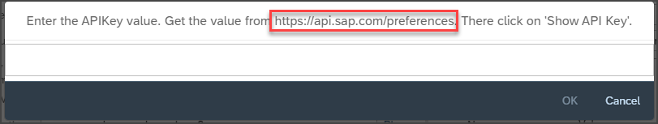
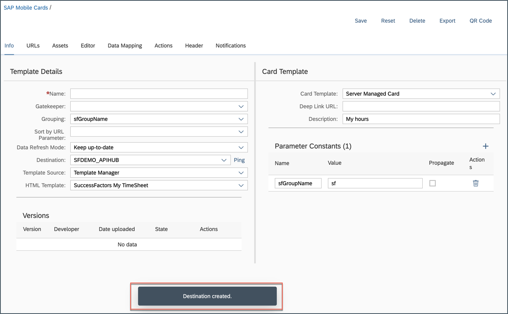

## Details
### You will learn
  - How to access the SAP Cloud Platform Mobile Services cockpit
  - How to establish connectivity to a SAP SuccessFactors API

In this tutorial, you will create a destination to connect to the SAP SuccessFactors API data source from SAP Cloud Platform Mobile Services.

---

[ACCORDION-BEGIN [Step 1: ](Understand SAP Mobile Cards)]

SAP Mobile Cards is a feature within SAP Cloud Platform Mobile Services which provides our customers access to a micro-application platform to publish data into a consumer-grade wallet or passbook-style app. It allows companies to quickly create simple, yet highly valuable quick-win apps.

You can find more details on the [SAP Mobile Cards developer page](https://developers.sap.com/topics/mobile-cards.html).

[DONE]
[ACCORDION-END]

[ACCORDION-BEGIN [Step 2: ](Go to SAP Mobile Services cockpit)]

1. On the [SAP Cloud Platform Trial landing page](https://cockpit.hanatrial.ondemand.com), choose **Enter your Trial Account** to see your global account.

    

>The trial account should contain one `subaccount` and `space`.

2. The global trial account contains one subaccount and space. Navigate to subaccount by clicking on the tile named **trial** (this name may vary if you created the subaccount manually).

    

3. Under **Spaces**, choose the available space as highlighted below.

    

4. In the left pane, choose **Services** > **Service Marketplace**.

    >The **Service Marketplace** is where you can find services to attach to any of your applications. These services are provided by SAP Cloud Platform to create, and produce applications quickly and easily. Once a service has been created, it is known as a `service instance`.

    

5. Scroll down and then choose **Mobile Card Kit**.

    

6. Choose **Support** to open **SAP Cloud Platform Mobile Services Cockpit**.

    

    >**Organization:** Organizations in CF enable collaboration among users and enable grouping of resources.

    >**Space:** Cloud Foundry has a standard working environment for individual applications: it is called a space. Spaces are individual working areas, which normally contain a single application.

7. Choose the relevant **Organization** and **Space** from the dropdown list, and then select **Open**.

    

You have now logged in to the SAP Mobile Services cockpit.

Bookmark the **Mobile Services cockpit URL** for quick access.

[DONE]
[ACCORDION-END]

[ACCORDION-BEGIN [Step 3: ](Create destination for SAP SuccessFactors sandbox)]

In this step, you will create a destination connecting to SuccessFactors sandbox system.

1. In the left pane, choose **Mobile Applications** | **SAP Mobile Cards** to view the Mobile Cards configuration.

    

    >If the SAP Mobile Cards Advisory screen pops up, choose **Close** to close it.

2. Click **Initialize**. This will create a new service instance for Mobile Cards.

    

3. Choose **Template Manager**.

    

4. Choose **SuccessFactors** from the **Select Category** drop-down list.

    

5. Scroll down and choose `SuccessFactors My TimeSheet` and select the  **Create Card Template** icon.

    

6. Click [here](https://api.sap.com/preferences) to get the `API Key`.  

    

    >For new users or first-time user of API Business Hub, generation of API Key may take a while.

7. Choose **Show API Key**.

    

8. Choose **Copy Key and Close**.

    

9. Switch back to **Mobile Services cockpit**, paste the copied API key in the open pop-up, and then choose **OK**.

    

    On successful creation, a **Destination Created** message is displayed.

    

[VALIDATE_1]
[ACCORDION-END]

In this tutorial, you have successfully created a destination connecting to a SAP SuccessFactors sandbox system. In the next tutorial, you will use this destination to create two cards displaying `TimeSheet` and `ToDos` data.

---
