## Prerequisites
**Install SAP Mobile Cards Application:** Download and install on your [iPhone](https://itunes.apple.com/us/app/sap-content-to-go/id1168110623?mt=8) or [Android](https://play.google.com/store/apps/details?id=com.sap.content2go)

## Details
### You will learn
  - How to create a SAP mobile card in the Mobile Services cockpit
  - How to subscribe to cards on your mobile device

Continuing from the destination you created in the previous tutorial, you will create two cards:

  - `**Timesheet card:**` A card that shows a user's Time Sheet log for a given date

  - `**To Do card:**` A collection of cards that captures tasks in a To-do list -- each task has a card of its own

---

[ACCORDION-BEGIN [Step 1: ](Create Timesheet card)]

Enter **Name** as `TimeSheetCard` and click **Save**.

[DONE]
[ACCORDION-END]

[ACCORDION-BEGIN [Step 2: ](Create To Do card)]

Choose **Create a New Card**.

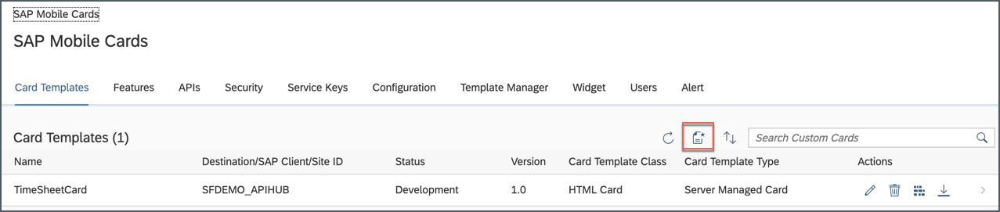

Provide the following values for the new card:

| Field | Value |
|----|----|
| **Name** | `ToDosCard` |
| **Destination** | `SFDEMO_APIHUB` |
| **Template Source** | `Template Manager` |
| **HTML Template** | `SuccessFactors My To Dos` |

> If you see a pop-up, choose **OK**.

Choose **Save**.

[DONE]
[ACCORDION-END]

[ACCORDION-BEGIN [Step 3: ](Set card status to productive)]

By default, status of newly created cards is **Development**. Cards can be subscribed to only when they are in a **Productive** state.

1. To change the card status, click on `TimeSheetCard`.

    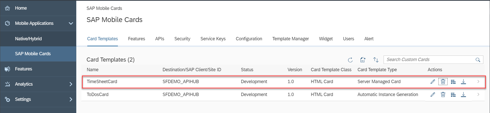

2. Under **Actions**, click on highlighted icon to change the state to **Productive**.

    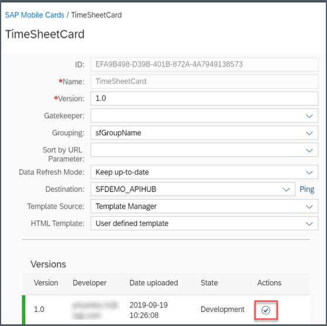

3. Choose **Yes** to confirm.

    

    You will notice that the **State** has been changed to **Productive**.

    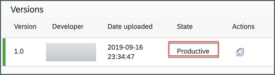

4. Repeat the above step for the `ToDosCard`. Status of both the cards should be **Productive**.

    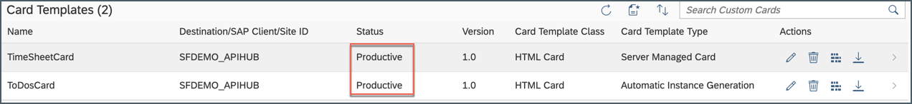

[DONE]
[ACCORDION-END]

[ACCORDION-BEGIN [Step 4: ](Configure SAP Mobile Cards client)]

>Make sure you are choosing the right device platform tab **above**.

>Make sure you have installed the SAP Mobile Cards app on your phone.

You can now start onboarding your SAP Mobile Cards client onto SAP Cloud Platform.

Choose the **APIs** tab to view the registration QR code. Scan the QR code applicable to your device type (Android or iOS).

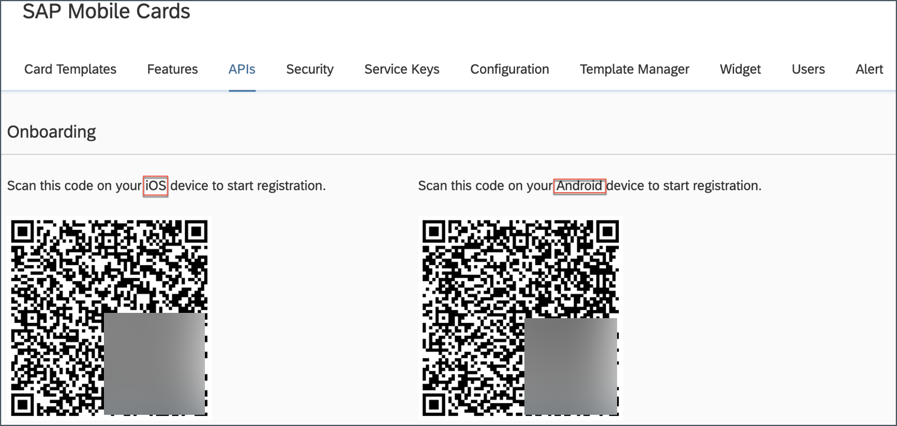

[OPTION BEGIN [Android]]

Tap **SCAN QR CODE** to begin the on-boarding process.

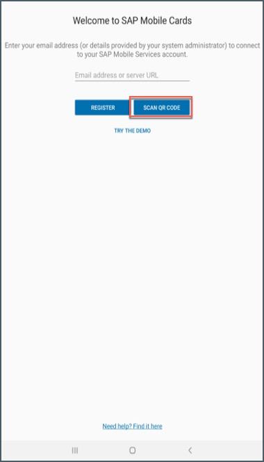

Tap **I AGREE** on `End User License Agreement`.

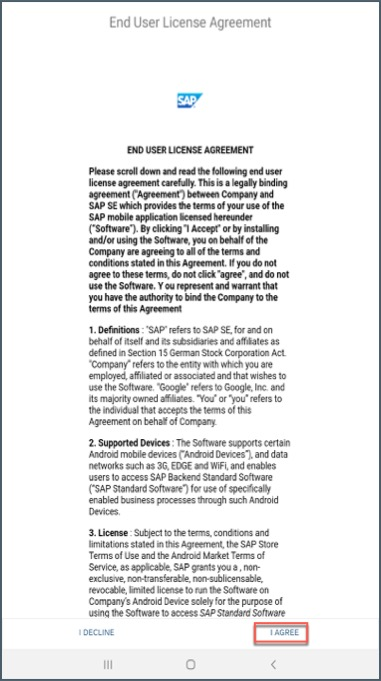

Enter your SAP Cloud Platform credentials, and choose **Log On**.

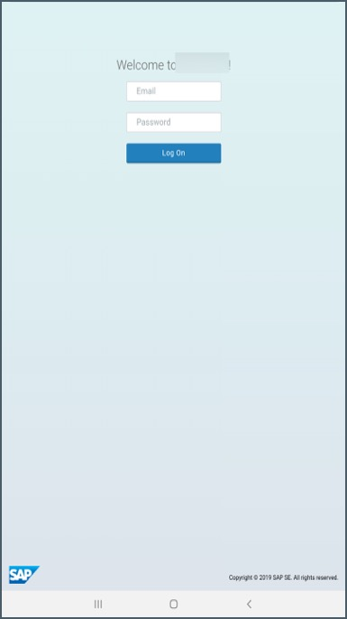

Choose a passcode with at least 5 characters to unlock the app, and tap **NEXT**.

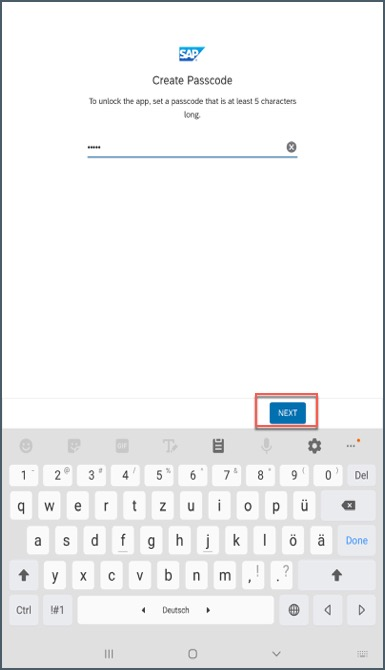

Confirm the passcode and tap **DONE**.

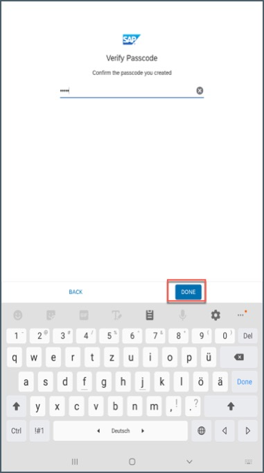

Optionally, enable fingerprint.

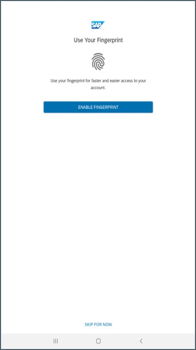

Tap the **+** icon to add subscriptions.

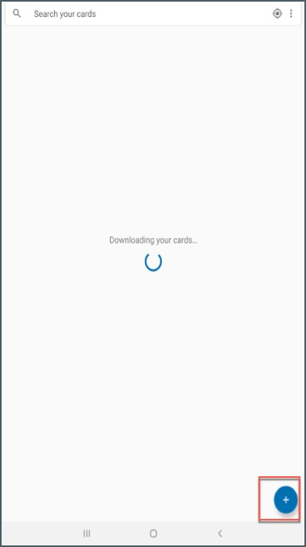

Tap **Subscriptions**.

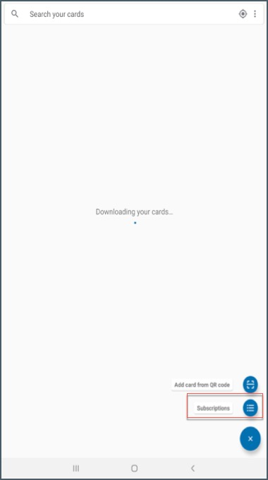

Tap **SUBSCRIBE** for `TimeSheetCard`.

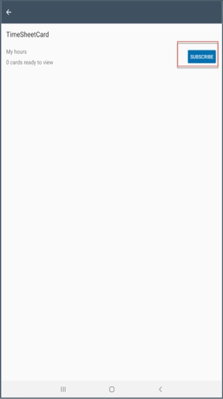

Tap on arrow key to navigate back to **All Subscriptions** list.

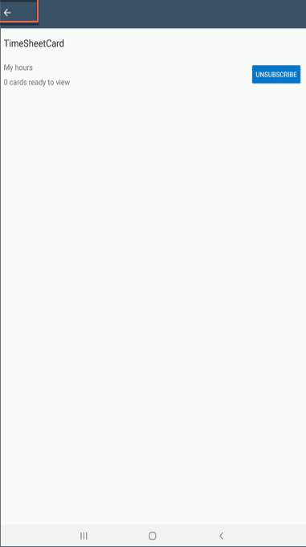

Tap `ToDosCard` to subscribe it.

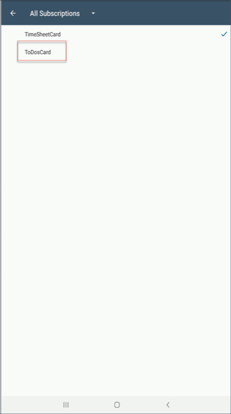

Tap **SUBSCRIBE**.

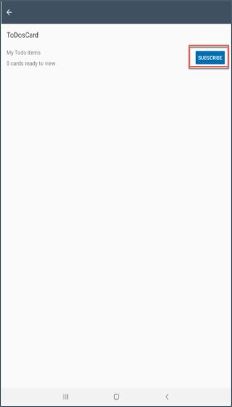

You can now view both the cards.

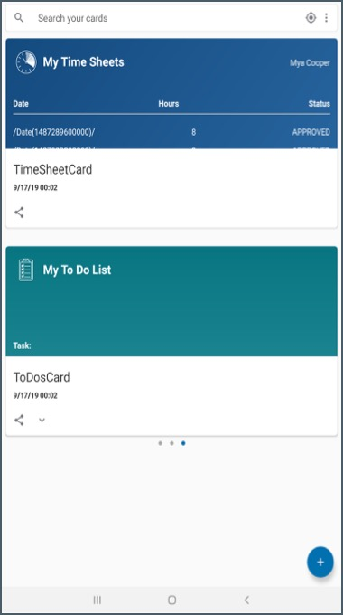

[OPTION END]

[OPTION BEGIN [iOS]]

Scan the QR code with your camera and select the toast message to launch the SAP Mobile Cards app.

Enter your SAP Cloud Platform credentials and choose **Log On**.

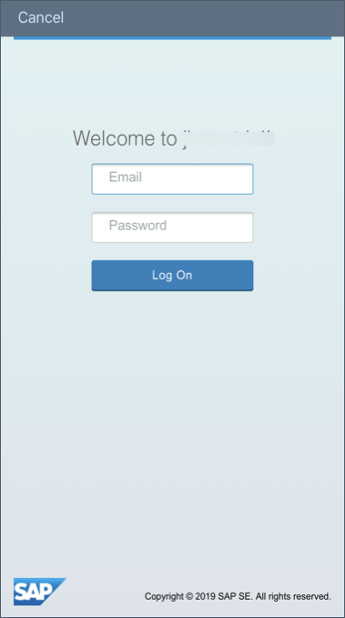

Choose a passcode with at least 5 characters to unlock the app.

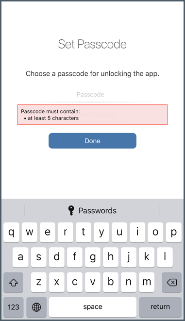

Confirm the passcode and choose **Done**.

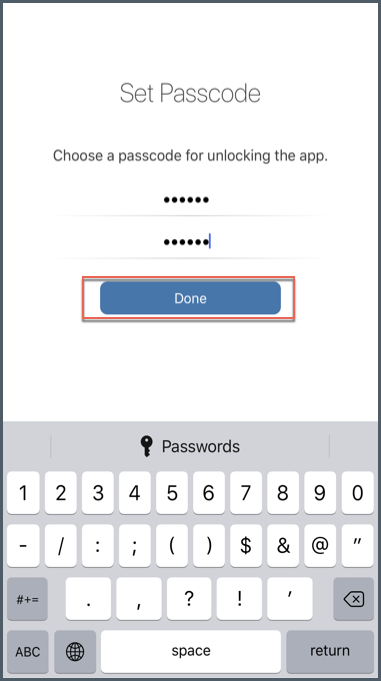

Optionally, you can enable Touch ID to access the app data more quickly.

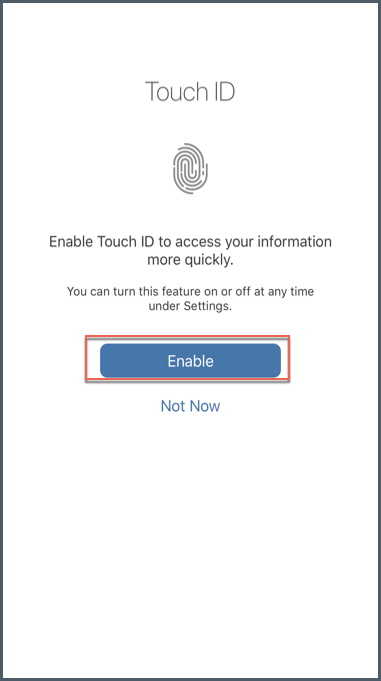

Tap **More**.

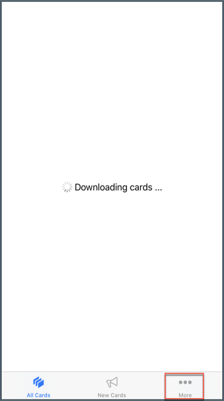

Choose **Subscriptions**.

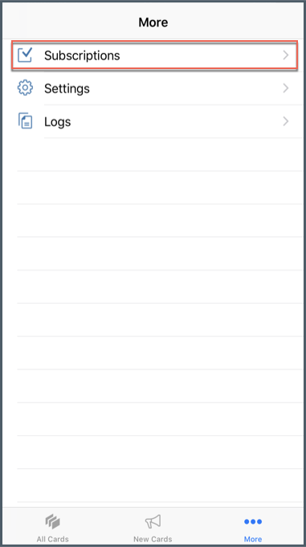

Select **All** and then choose `TimeSheetCard`.

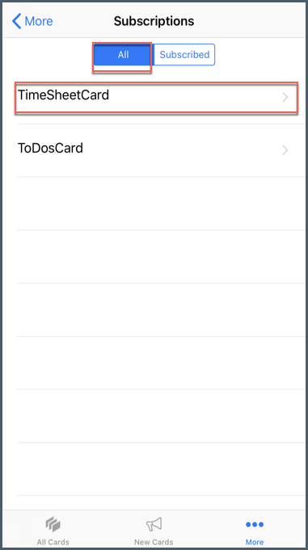

Tap **Subscribe**.

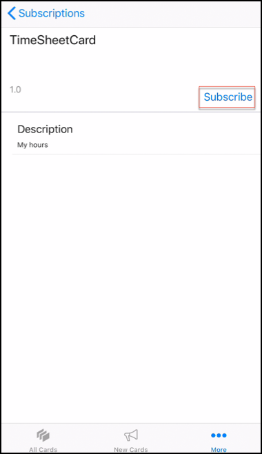

Repeat steps above for the `ToDosCard` and choose **Subscribe**.

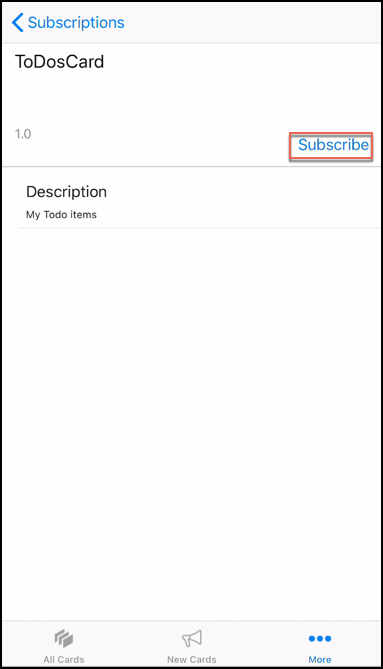

Tap the **All Cards** at bottom of your screen to see all your currently subscribed cards.

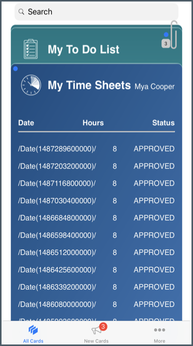

[OPTION END]

Congratulations, you have now deployed two cards with data from SAP SuccessFactors.

[VALIDATE_1]
[ACCORDION-END]

---
