## Details
### You will learn
  - How to enable and configure workflow, business rules and process visibility services

Intelligent Business Process Management is a family of services to automate business processes, manage decision logic and provide end-to-end visibility in your processes.

Users can now use SAP Cloud Platform Workflow, SAP Cloud Platform Business Rules and SAP Cloud Platform Process Visibility services together to create process extensions on top of any business application, orchestrate tasks or build process-centric differentiating applications.

In this tutorial mission, setup and use these services to automate and achieve operational insights into employee onboarding process.

---

[ACCORDION-BEGIN [Step 1: ](Check Entitlements)]

To create service instances for business process management services, you need to ensure that you have the right set of entitlements in your trial account.

1. In your web browser, open the [SAP Cloud Platform trial cockpit](https://cockpit.hanatrial.ondemand.com/).

2. Navigate to the trial global account by clicking **Enter Your Trial Account**.

    !

    >If this is your first time accessing your trial account, you'll have to configure your account by choosing a region (select the region closest to you). Your user profile will be set up for you automatically.  

    >Wait till your account is set up and ready to go. Your global account, your subaccount, your organization, and your space are launched. This may take a couple of minutes.

    >Choose **Continue**.

    >

3. From your global account page, choose the `trial` tile to access your subaccount.

    !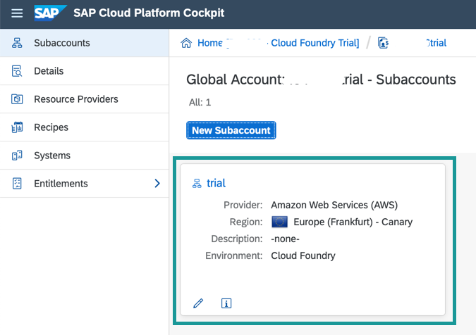

4. Click **Entitlements** from left panel to check if you have all the below listed entitlements in your subaccount. These entitlements are needed to run other tutorials of this mission.

    |  Entitlement     | Description
    |  :------------- | :-------------
    |  Business Rules, Workflow and Process Visibility | These are core services of Intelligent BPM which will be needed to run the next tutorials.
    |  Portal, Application Runtime, HTML5 Applications | These services are needed to setup and access Process Visibility and Workflow applications from Fiori Launchpad
    |  Connectivity    | This service is needed to create and configure destinations

    > If you do not see these entitlements in your subaccount then follow this [tutorial](https://developers.sap.com/tutorials/cp-trial-entitlements.html) that describes how to configure entitlements in your account.

[DONE]
[ACCORDION-END]

[ACCORDION-BEGIN [Step 2: ](Download multitarget application file)]

Download the `BPMServicesFLP.zip` from  [GitHub](https://github.com/SAP-samples/cloud-process-visibility/releases) in your local file system.

>This multitarget application when deployed will create (a) new service instances for workflow, business rules and process visibility in the Cloud Foundry environment, and (b) an application to access the business rules editor and Fiori Launchpad for workflow and process visibility applications.

!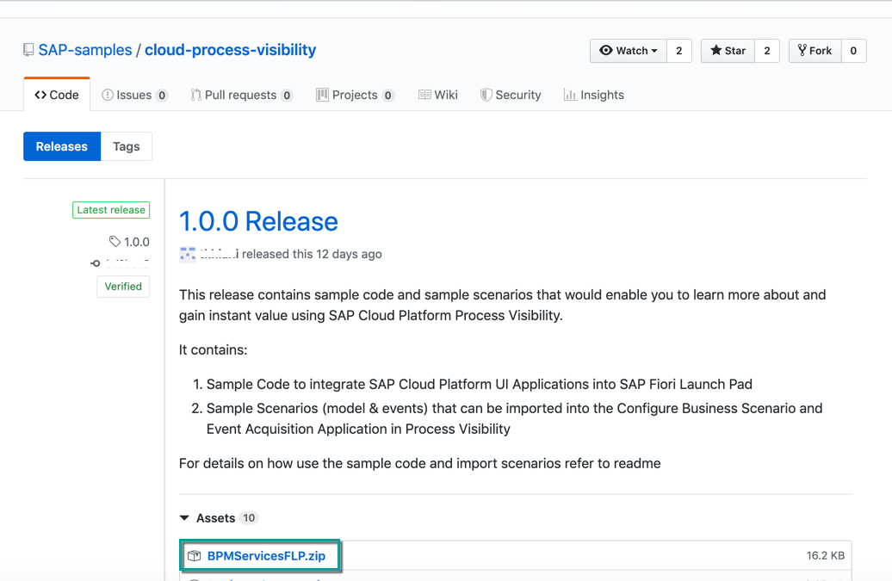

[DONE]
[ACCORDION-END]

[ACCORDION-BEGIN [Step 3: ](Access SAP Web IDE)]

1. In your web browser, open the [SAP Cloud Platform Trial cockpit](https://account.hanatrial.ondemand.com/cockpit).

2. Choose **Launch SAP Web IDE**.
    > If you are new user then Web IDE Full-Stack will not be enabled for your account and you will see a message saying "SAP Web IDE Full-Stack is not be enabled for this account". Follow the instructions on the Web IDE page, to enable the Web IDE.

    !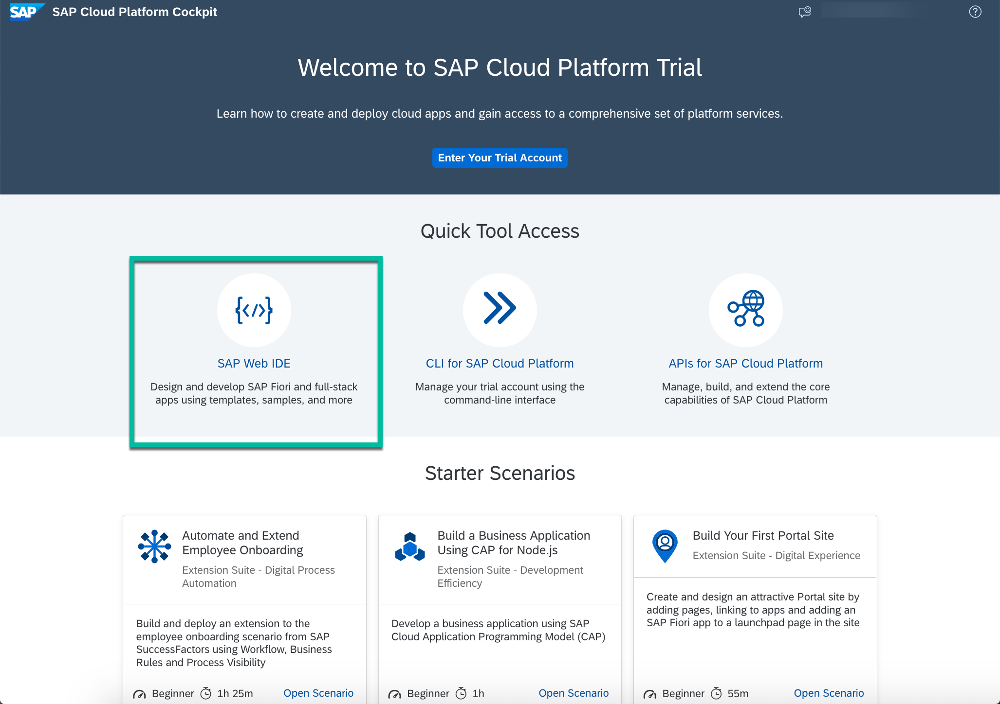

3. In the navigation area of **SAP Web IDE**, choose the **Preferences** icon.

    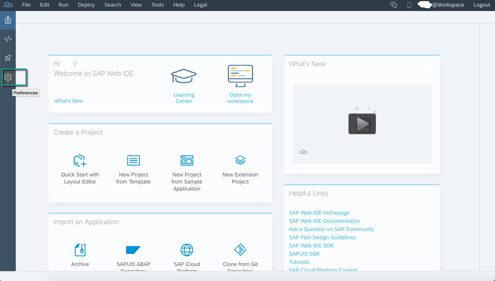

4. Select the **Extensions** preference and search for **workflow**.

5. Click the toggle button to switch on the **Workflow Editor** extension and **Save** the changes.
    > If a confirmation popup appears, then click **Refresh** to apply the changes.

    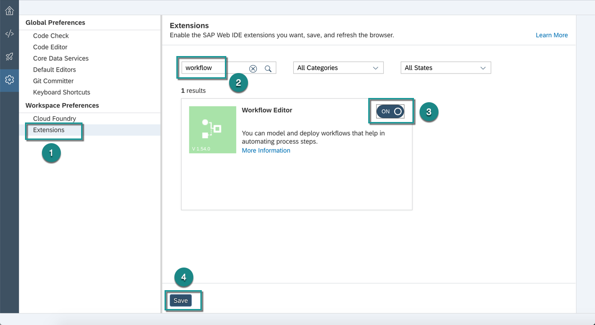

6. Select **Cloud Foundry** preference.

7. Enter the following details, and **Save** the changes:

    |  Field Name         | Value                    | Example  
    |  :------------------| :------------------------| :-------------
    |  **API End Point**  | Your trial API End point | `https://api.cf.eu10.hana.ondemand.com` or `https://api.cf.us10.hana.ondemand.com` depending upon the region of your trial account
    |  **Organization**   | Your trial organisation  | trial_P237800
    |  **Space**          | Your trial space         | dev

    > In the credentials popup, enter your trial user email and password. If you normally login via single-sign on, login with your domain password.

    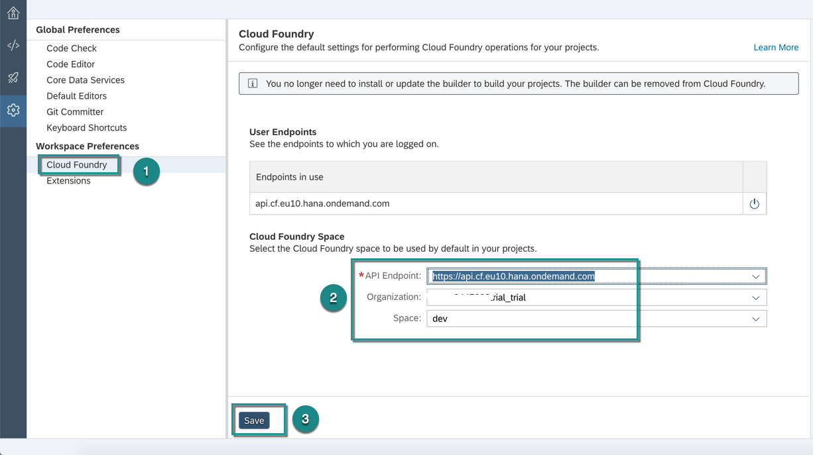

[DONE]
[ACCORDION-END]

[ACCORDION-BEGIN [Step 4: ](Import multitarget application)]

1. In the navigation area of the **SAP Web IDE**, choose the **Development** icon.

2. Right-click the **Workspace** root folder, then choose **Import | File or Project**.

    

3. In the **Import** dialog, browse for the `BPMServicesFLP.zip` file that you downloaded in your local system and choose **OK**.

    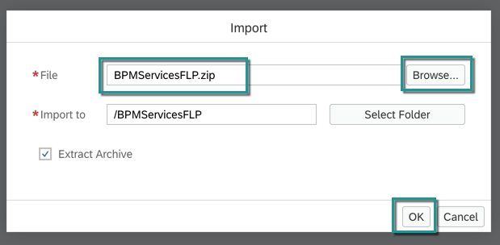

4. The multitarget application gets imported under the **Workspace** folder and the file structure is shown below.

    >Ensure you have chosen **Show Hidden Files** to be able to view the `app-router` file structure as shown.

    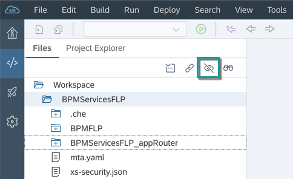

[DONE]
[ACCORDION-END]

[ACCORDION-BEGIN [Step 5: ](Build and deploy)]

When you build and deploy this application, new service instances will be created for each workflow, business rules and process visibility service in Cloud Foundry.

1. Right-click on the `BPMServicesFLP` project and choose any of the **Build** options.

    !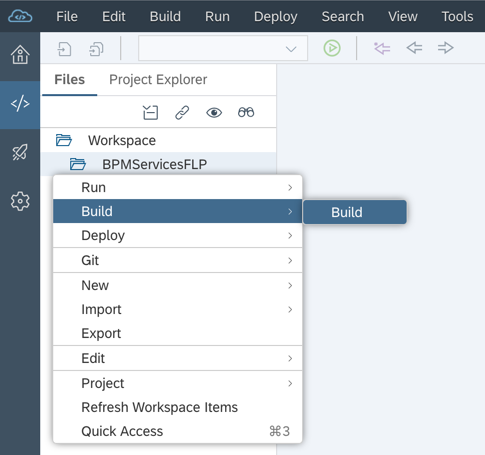

2. After the build has completed, navigate to the **`mta_archives` | `BPMServicesFLP_0.0.1.mtar`** file.

    !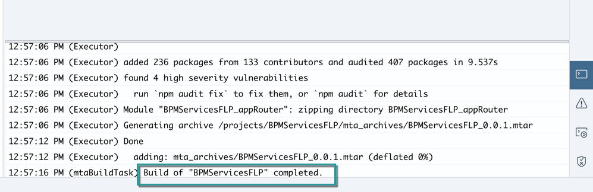

    !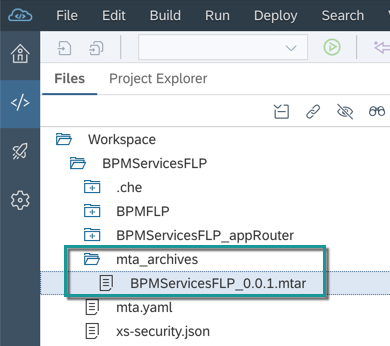

3. Right-click `BPMServicesFLP_0.0.1.mtar` and choose **Deploy | Deploy to SAP Cloud Platform**.

    !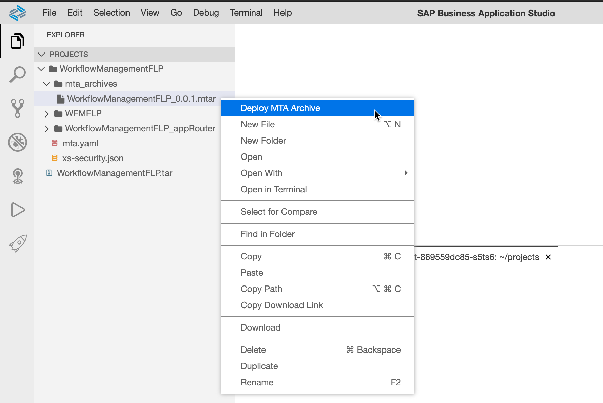

    > In the popup, select the Cloud Foundry API Endpoint, Organisation and Space where you would want to deploy the application.

    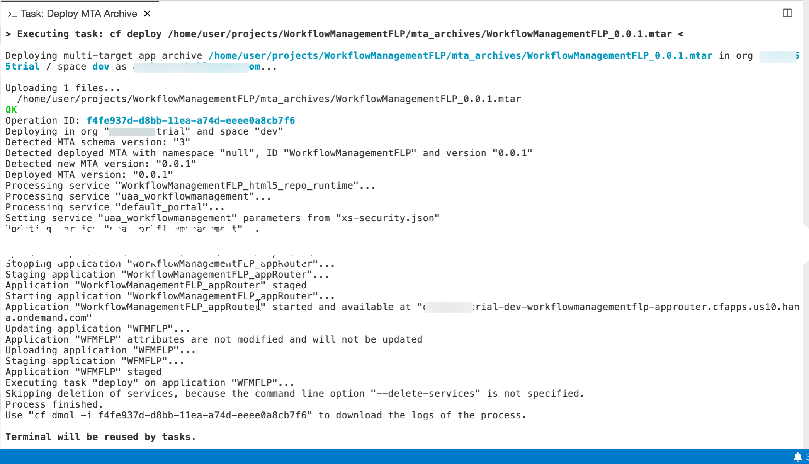

    >There could be deployment errors:

    > - if you have not enabled the entitlements of `workflow`, `business rules`, `process visibility` and `portal`. Ensure that you have followed Step 1 to do the necessary entitlements.

    > - if you have already created an instance of either workflow, business rules or process visibility created with same name. In that case, update the `modules` and `resources` section in `mta.yaml` to replace that service instance name with a new unique name.

[DONE]
[ACCORDION-END]

[ACCORDION-BEGIN [Step 6: ](Assign roles)]

1. In your web browser, open the cockpit of [SAP Cloud Platform Trial](https://account.hanatrial.ondemand.com/cockpit).

2. Click **Enter Your Trial Account**

3. Open **Security | Role Collections** and click **New Role Collection** to add new roles.

    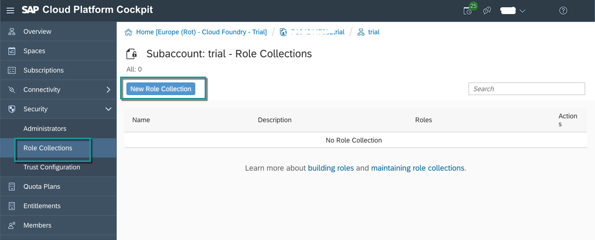

    Enter **Name** as **`BPMServices`** and **Description** as **Roles to access Intelligent BPM services**. **Save** the changes.

    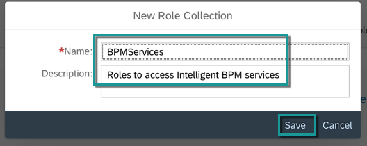

4. Click **`BPMServices`** to navigate into role collection to add roles.

    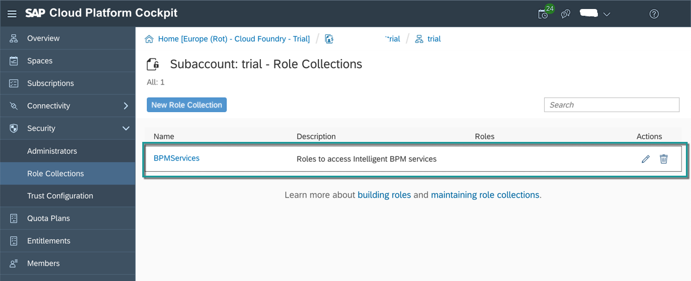

5. Click **Add Role** and select the following roles to add them to the role collection one by one. In **Add Role** popup, click **Save** after each selection.

    > The application identifier changes depending upon the region where the BPM services are entitled from. You will notice a different number at the end of the application identifier if the region is not Europe(Frankfurt).

      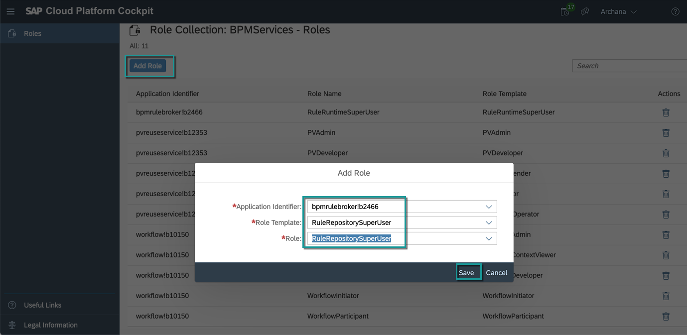

    |  Application Identifier     | Role Template and Role
    |  :------------------------- | :------------------------
    |  `bpmrulebroker`            | `RuleRepositorySuperUser`
    |                             | `RuleRuntimeSuperUser`
    |  `pvreuserservice`          | `PVDeveloper`
    |                             | `PVAdmin`
    |                             | `PVEventSender`
    |                             | `PVOperator`
    |                             | `PVTenantOperator`
    | `workflow`                  | `WorkflowAdmin`
    |                             | `WorkflowContextViewer`
    |                             | `WorkflowDeveloper`
    |                             | `WorkflowInitiator`
    |                             | `WorkflowParticipant`

    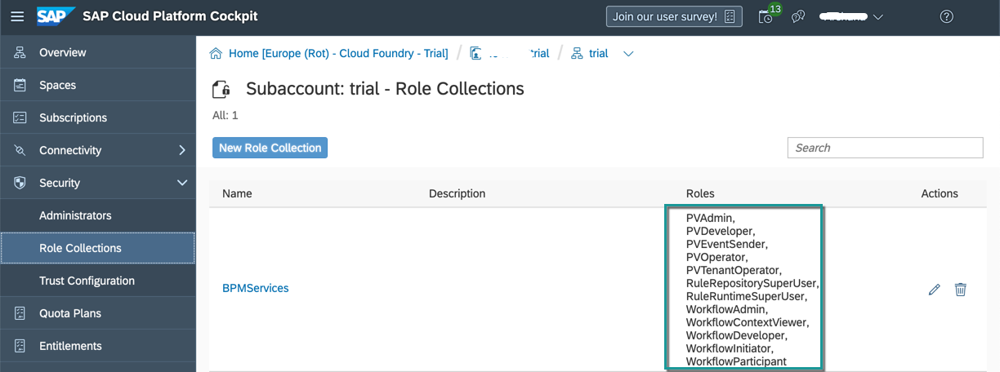

6. To assign the role collection to your trial user, switch to **Security | Trust Configuration** and select **SAP ID Service**.

    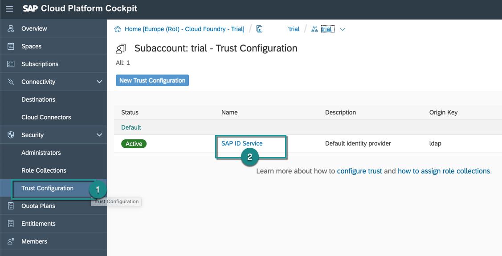

7. In the **Role Collection Assignment** page, enter your trial user email and click **Show Assignments**.

    >If you are adding the role collection for first time, you will get a popup to select **Add User**.

8. Click **Assign Role Collection** and select `BPMServices` role collection.

    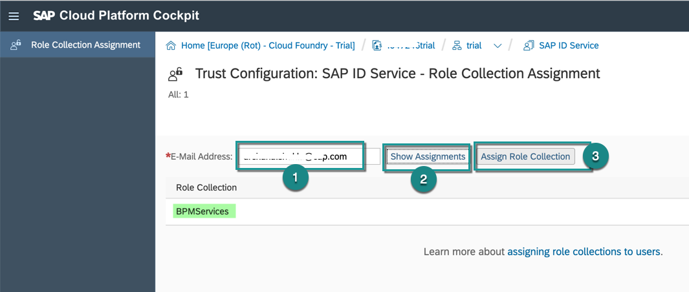

[VALIDATE_1]
[ACCORDION-END]

[ACCORDION-BEGIN [Step 7: ](Create destination for API Business Hub)]

The sample business rule used in this scenario is published in API Business Hub. This destination will be used in SAP Cloud Platform Business Rules to connect to API Business Hub to discover and import sample rules.

1. Go back to the subaccount **trial** and switch to **Connectivity | Destinations** from the left-hand navigation.

2. Click **New Destination**.

3. Enter the following details under **Destination Configuration**:

    |  Field Name     | Value
    |  :------------- | :-------------
    |  Name           | `BUSINESSRULES_APIHUB`
    |  URL            | `https://api.sap.com`
    |  Authentication | `BasicAuthentication`
    |  User           | your trial user id
    |  Password       | your trial password

    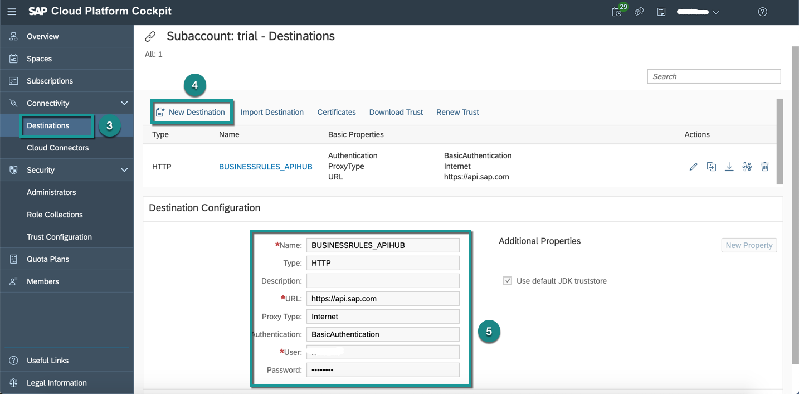

4. **Save** the destination.

[DONE]
[ACCORDION-END]

[ACCORDION-BEGIN [Step 8: ](Create destination for Business Rules APIs)]

The sample workflow calls business rules to determine the list of equipment needed for the new hire. This destination (`BUSINESS_RULES`) will be used while modelling the workflow to call the business rules APIs.

Choose **New Destination**, and enter the following data:

|  Field Name        | Value
|  :---------------- | :-------------
|  Name              | `BUSINESS_RULES`
|  URL               | `https://bpmruleruntime.cfapps.eu10.hana.ondemand.com/rules-service`
|  Authentication    | `OAuth2ClientCredentials`
|  Client ID         | `<use your client ID from the Business Rules service instance>`
|  Client Secret     | `<use your secret from the Business Rules service instance>`
|  Token Service URL | `https://<userid>.authentication.eu10.hana.ondemand.com/oauth/token` where `userid` is your trial account user id

>Replace `eu10` with `us10` in the URLs if your trial account is in US region. For example, the URL in above destination will become:

> `https://bpmruleruntime.cfapps.us10.hana.ondemand.com/rules-service`

>To get Client ID, Client Secret and Token Service URL, (a) navigate into your **dev** space in your trial account, (b) select **Service Instances** from left panel, (c) search for **rules**, and then select **`businessrules`** service instance and (d) navigate into **`businessrules`** to get `clientid`, `clientsecret`, and `url`.
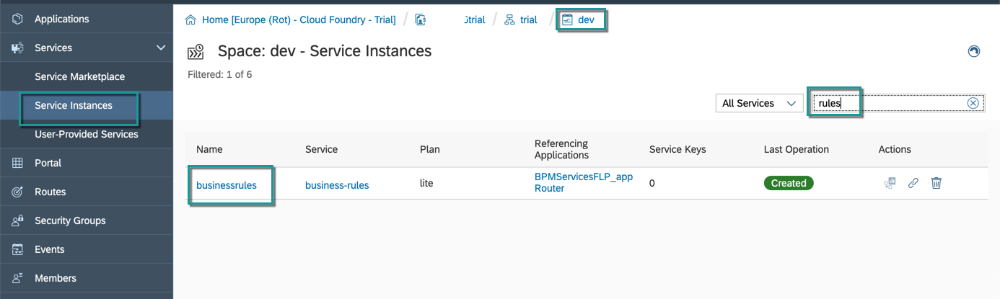

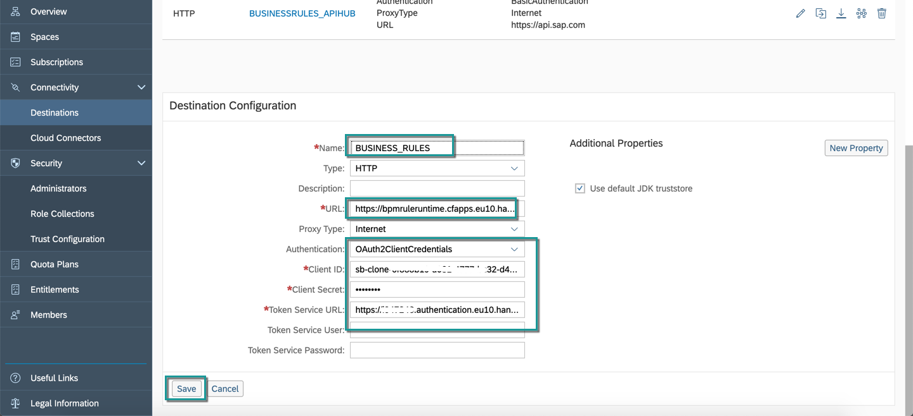

[DONE]
[ACCORDION-END]

[ACCORDION-BEGIN [Step 10: ](Access applications)]

These applications will be used in the next tutorials to work with business rules, workflow and process visibility. One of these links is for the Fiori Launchpad which will be used to access workflow and process visibility applications and another link is to access business rules editor.

You can open both the links in different browser tabs and use them in further tutorials.

1. Click **Spaces** and then navigate into **dev** space.

2. In **dev** space, click **Applications** and from among the available applications select `BPMServicesFLP_appRouter` application.

    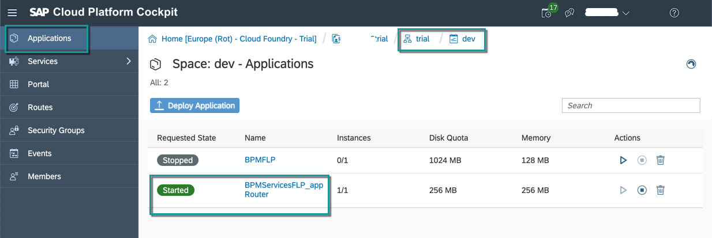

3. In the **Overview** section, click app-router link to open workflow, business rules and process visibility applications.

    > Log on with your trial user ID and password.

    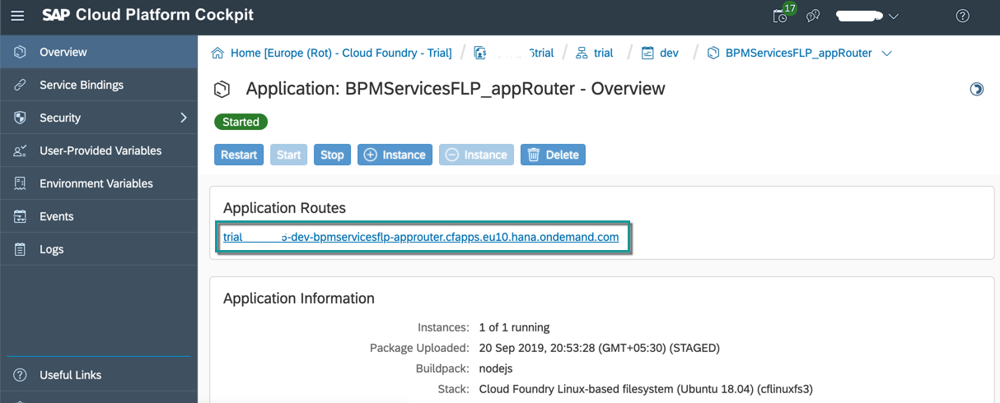

    The app-router link will open the SAP Fiori launchpad with **Business Rules**, **Workflow** and **Process Visibility** applications.

    

These steps complete the setup of the starter scenario for Intelligent Business Process Management in your trial account. In the next tutorial, you will access the sample content of these different services, quickly set them up in your account and then run the scenario to get an integrated experience.

[DONE]
[ACCORDION-END]

Give us 55 seconds of your time to help us improve

