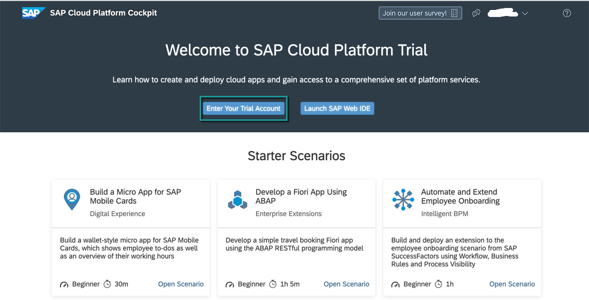
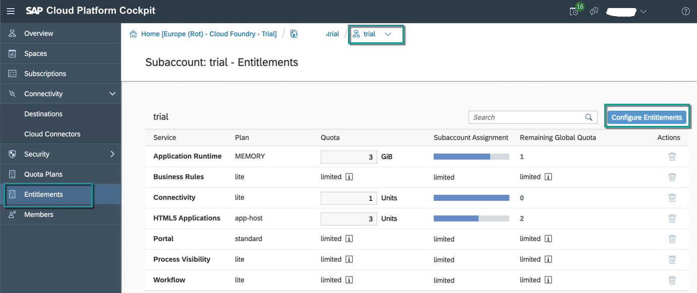
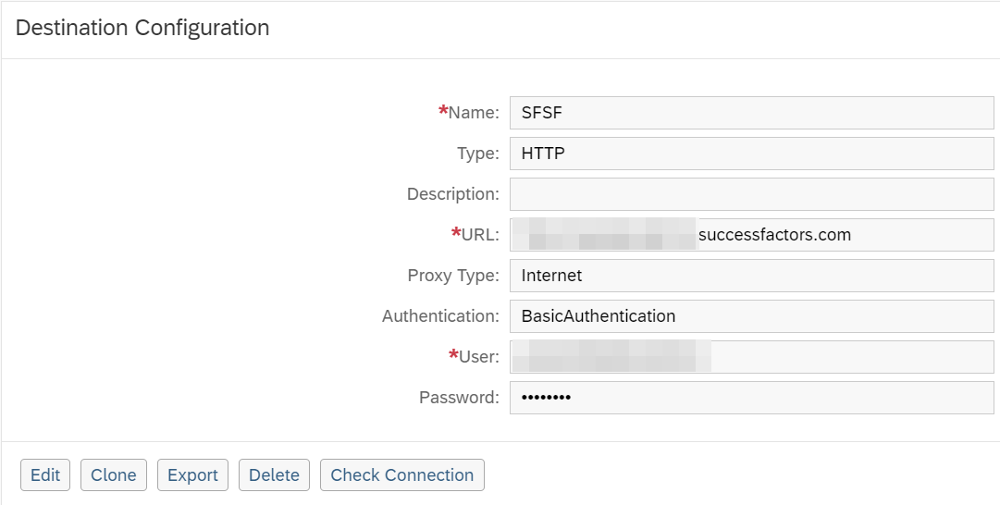
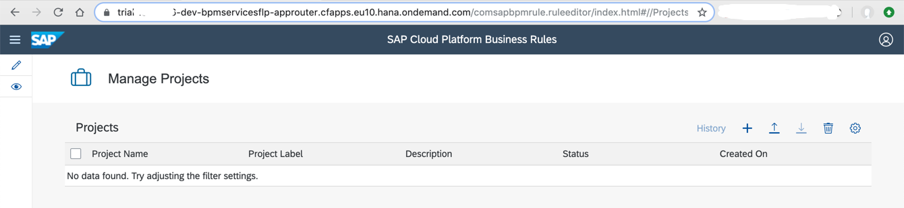

## Details
### You will learn
  - How to enable and configure workflow, business rules and process visibility services

---

[ACCORDION-BEGIN [Step 1: ](Check Entitlements)]

To create service instances for business process management services, you need to ensure that you have the right set of entitlements in your trial account.

1. In your web browser, open the [SAP Cloud Platform Trial cockpit](https://cockpit.hanatrial.ondemand.com/cockpit).

2. Navigate into the trial subaccount

      

    >The trial account should contain one `subaccount` and `space`

3. Open **Entitlements** from left panel. You should have the following entitlements in your account.

    - If not, then use **Configure Environments** to add these entitlements.

    >Here is an explanation of these different entitlements: (a) Connectivity is needed to configure destination, (b) Portal and HTML5 Application is needed to access Process Visibility and Workflow applications from Fiori Launchpad, (c) Business Rules, Workflow and Process Visibility is needed to create service instances of these respective services in order to work with them.

    

[DONE]
[ACCORDION-END]

[ACCORDION-BEGIN [Step 2: ](Download multitarget application file)]

Download the `BPMServicesFLP.zip` from  [GitHub](https://github.com/SAP-samples/cloud-process-visibility/releases) in your local file system.

>This multi target application when deployed will (a) create new service instances for workflow, business rules and process visibility in cloud foundry environment, (b) creates an application to access business rules editor and Fiori Launchpad for workflow and process visibility applications.

[DONE]
[ACCORDION-END]

[ACCORDION-BEGIN [Step 3: ](Access SAP Web IDE)]

1. In your web browser, open the [SAP Cloud Platform Trial cockpit](https://cockpit.hanatrial.ondemand.com/cockpit).

2. Choose **Launch SAP Web IDE**.

    

3. In the navigation area of **SAP Web IDE**, choose the **Preferences** icon.

    

4. Select the **Extensions** preference, and search for **workflow**.

5. Toggle the button to switch on the **Workflow Editor** extension, and **Save** the changes.

    

6. Select **Cloud Foundry** preference.

7. Enter the following details, and **Save** the changes:

    |  Field Name     | Value
    |  :------------- | :-------------
    |  **API End Point**  | `https://api.cf.eu10.hana.ondemand.com` or `https://api.cf.us10.hana.ondemand.com` depending upon the region of your trial account
    |  **Organization**   | Your trial organization
    |  **Space**          | Your trial space

    > In the credentials popup, enter your trial user email and password. If you normally login via single-sign on, login with your domain password.

    

[DONE]
[ACCORDION-END]

[ACCORDION-BEGIN [Step 4: ](Import multitarget application)]

1. In the navigation area of the **SAP Web IDE**, choose the **Development** icon.

2. Right-click the **Workspace** root folder, then choose **Import | File or Project**.

    

3. In the **Import** dialog, browse for the `BPMServicesFLP.zip` file that you downloaded in your local system and choose **OK**.

    

4. The multi-target application gets imported under the **Workspace** folder and the file structure is shown below.

    >Ensure that have chosen **Show Hidden Files** to be able to view the `app-router` file structure as shown.

    

[DONE]
[ACCORDION-END]

[ACCORDION-BEGIN [Step 5: ](Build and deploy)]

When you build and deploy this application, there will be new service instances created for each workflow, business rules and process visibility service in cloud foundry.

1. Right-click on the `BPMServicesFLP` project and choose **Build | Build**.

    

2. After the build completes, navigate to the **`mta_archives` | `BPMServicesFLP_0.0.1.mtar`** file.

    

    

3. Right-click `BPMServicesFLP_0.0.1.mtar` and choose **Deploy | Deploy to SAP Cloud Platform**.

    

    >There could be deployment errors, (a) if you have not enabled the entitlements of `workflow`, `business rules`, `process visibility` and `portal`. Ensure that you have followed Step 1 to do the necessary entitlements (b) if you already have the instance of either workflow, business rules or process visibility created of same name. In that case, update `modules` and `resources` section in `mta.yaml` to replace that service instance name with a new unique name.

[DONE]
[ACCORDION-END]

[ACCORDION-BEGIN [Step 6: ](Assign roles)]

1. In your web browser, open the cockpit of [SAP Cloud Platform Trial](https://cockpit.hanatrial.ondemand.com/cockpit).

2. Click **Enter Your Trial Account**

3. Open **Security | Role Collections** and click **New Role Collection** to add new roles.

    

    Enter **Name** as **`BPMServices`** and **Description** as **Roles to access Intelligent BPM services**. Once done, **Save** the changes.

    

4. Click **`BPMServices`** to navigate into role collection to add roles.

    

5. Click **Add Role** and select these roles to add them to the role collection one by one. In **Add Role** popup, click **Save** after each selection.

      

    |  Application Identifier     | Role Template and Role
    |  :------------------------- | :------------------------
    |  `bpmrulebroker`            | `RuleRepositorySuperUser`
    |                             | `RuleRuntimeSuperUser`
    |  `pvreuserservice`          | `PVDeveloper`
    |                             | `PVAdmin`
    |                             | `PVEventSender`
    |                             | `PVOperator`
    |                             | `PVTenantOperator`
    | `workflow`                  | `WorkflowAdmin`
    |                             | `WorkflowContextViewer`
    |                             | `WorkflowDeveloper`
    |                             | `WorkflowInitiator`
    |                             | `WorkflowParticipant`

    

6. To assign the role collection to your trial user, switch to **Security | Trust Configuration** and select **SAP ID Service**.

    

7. In the **Role Collection Assignment** page, enter your trial user email and click **Show Assignments**.

    >If you are doing this for first time, you will get a popup to select **Add User**.

8. Click **Assign Role Collection** and select `BPMServices` role collection.

    

[VALIDATE_1]
[ACCORDION-END]

[ACCORDION-BEGIN [Step 7: ](Create destination for API Business Hub)]

The sample business rules used in this scenario is published in API Business Hub. This destination will be used in SAP Cloud Platform Business Rules to connect to API Business Hub to discover and import sample rules.

1. Go back to the subaccount **trial** and switch to **Connectivity | Destinations** from the left-hand navigation.

2. Click **New Destination**.

3. Enter the following details:

    |  Field Name     | Value
    |  :------------- | :-------------
    |  Name           | `BUSINESSRULES_APIHUB`
    |  URL            | `https://api.sap.com`
    |  Authentication | `BasicAuthentication`
    |  User           | your trial user id
    |  Password       | your trial password

    

4. **Save** the destination.

[DONE]
[ACCORDION-END]

[ACCORDION-BEGIN [Step 8: ](Create destination for SuccessFactors APIs)]

The sample workflow calls `SuccessFactors` to get the user details of the new hire and the team members. This destination will be used in the workflow to call these APIs.

> If you already have a SuccessFactors system, then you can use the username, password and company ID of that system. You can also get API URLs for the respective data centre from the [note](https://apps.support.sap.com/sap/support/knowledge/public/en/2215682).

> If you do not have a SuccessFactors system, then with your S-user account, you can  request for a new SuccessFactors test tenant at: [Partner Demo Request Tool](https://hcmcloudops.successfactors.com/DemoInstance/PartnerDemo).

> If you still do not have SuccessFactors system, then skip this step.

Choose **New Destination**, and enter the following data:

|  Field Name     | Value
|  :------------- | :-------------
|  Name           | `SFSF`
|  URL            | API URL based on your SuccessFactors Data Center
|  Authentication | `BasicAuthentication`
|  User           | `UserName@CompanyID`. Where `CompanyID` is the SuccessFactors company ID.
|  Password       | given SuccessFactors password for the user name

[DONE]
[ACCORDION-END]

[ACCORDION-BEGIN [Step 9: ](Create destination for Business Rules APIs)]

The sample workflow calls business rules to determine the list of equipment needed for the new hire. This destination (`BUSINESS_RULES`) will be used while modelling the workflow to call the business rules APIs.

Choose **New Destination**, and enter the following data:

|  Field Name        | Value
|  :---------------- | :-------------
|  Name              | `BUSINESS_RULES`
|  URL               | `https://bpmruleruntime.cfapps.eu10.hana.ondemand.com/rules-service`
|  Authentication    | `OAuth2ClientCredentials`
|  Client ID         | `<use your client ID from the Business Rules service instance>`
|  Client Secret     | `<use your secret from the Business Rules service instance>`
|  Token Service URL | `https://<userid>.authentication.eu10.hana.ondemand.com/oauth/token` where `userid` is your trial account user id

>Replace `eu10` with `us10` in the URLs if your trial account is in US region. For example, the URL in above destination will become:

> `https://bpmruleruntime.cfapps.us10.hana.ondemand.com/rules-service`

>To get Client ID, Client Secret and Token Service URL: (a) navigate into **dev** space, (b) select **Service Instances**, (c) search for **rules** instance, and then select **`businessrules`** service instance and (d) navigate into **`businessrules`** to get `clientid`, `clientsecret`, and `url`.

[DONE]
[ACCORDION-END]

[ACCORDION-BEGIN [Step 10: ](Access applications)]

These applications will be used in next tutorials to work with business rules, workflow and process visibility. One link is for the `Fiori Launchpad` which will be used to access workflow and process visibility applications and another link is to access `business rules editor`.

You can open both the links in different browser tabs and use them in further tutorials.

1. Click on **Spaces** and then navigate into **dev** space.

2. In **dev** space, click on **Applications** and from among the available applications select `BPMServicesFLP_appRouter` application.

    

3. In the **Overview** section, click app-router link to open workflow, business rules and process visibility applications.

    > Logon with your trial user id and password to the application.

    

    This will open the SAP Fiori launchpad with **Workflow** and **Process Visibility** tiles.

    

    In the same link, append `/comsapbpmrule.ruleeditor/index.html` after app-router link to open business rules editor.

    > For example: `https://trial-userid-dev-bpmservicesflp-approuter.cfapps.eu10.hana.ondemand.com/comsapbpmrule.ruleeditor/index.html`

    

[DONE]
[ACCORDION-END]

---
