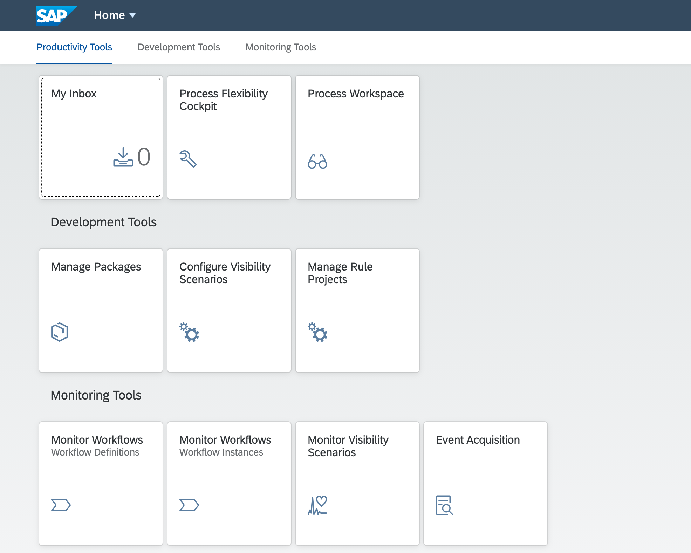

## Details
### You will learn
  - How to enable and configure workflow, business rules and process visibility services

Digital process automation for live processes is a family of services to automate business processes, manage decision logic and provide end-to-end visibility in your processes.

Users can now use SAP Cloud Platform Workflow, SAP Cloud Platform Business Rules and SAP Cloud Platform Process Visibility services together to create process extensions on top of any business application, orchestrate tasks or build process-centric differentiating applications.

In this tutorial mission, setup and use these services to automate and achieve operational insights into employee onboarding process.

---

[ACCORDION-BEGIN [Step 1: ](Setup services in your account using Recipe)]

You will use the **Recipe** to automatically set up the workflow, business rules, and process visibility services in your account.

1. In your web browser, open the [SAP Cloud Platform trial cockpit](https://cockpit.hanatrial.ondemand.com/).

2. Navigate to the trial global account by clicking **Enter Your Trial Account**.

    !

    >If this is your first time accessing your trial account, you'll have to configure your account by choosing a region (select the region closest to you). Your user profile will be set up for you automatically.  

    >Wait till your account is set up and ready to go. Your global account, your subaccount, your organization, and your space are launched. This may take a couple of minutes.

    >Choose **Continue**.

    >

3. From your global account page, choose the **Recipe** from left-hand navigation. Among the available recipes, click **Start Recipe** of **Set up account for Workflow Management**.

    !

4. Recipe will be started with pre-configured steps.

    !

    - Wait until you see the success popup window once the recipe completes successfully. **Close** the popup.  

    !

    > This automatic setup will do the following:

    > - Add Business Rules, Workflow, Process Visibility, Portal, Application Runtime, HTML5 Applications and Connectivity entitlements in your account.

    > - Create service instance for each of Business Rules, Workflow, Process Visibility and Portal services.

    > - Create destinations with name **BUSINESS_RULES** and **BUSINESSRULES_APIHUB**. These destinations will be used while integration of business rules with workflow and importing business rules project from API Hub respectively.

    > - Create a role collection with name **BPMServices** and add all the needed roles.

    > - Assign this role collection to your user.

[DONE]
[ACCORDION-END]

[ACCORDION-BEGIN [Step 2: ](Setup Fiori Launchpad)]
You will import, build and deploy the multi target project that will create a Fiori Launchpad to access workflow, business rules and process visibility applications which will be used in next tutorials.

1. Download the `BPMServicesFLP.zip` from  [GitHub](https://github.com/SAP-samples/cloud-process-visibility/releases) in your local file system.

>This multi target application when deployed will create the Fiori Launchpad to access workflow, business rules and process visibility applications.

!

2. In your web browser, open the [SAP Cloud Platform Trial cockpit](https://account.hanatrial.ondemand.com/cockpit).

3. Choose **SAP Web IDE**.
    > If you are new user then Web IDE Full-Stack will not be enabled for your account and you will see a message saying "SAP Web IDE Full-Stack is not be enabled for this account". Follow the instructions on the Web IDE page, to enable the Web IDE.

    !

4. In the navigation area of **SAP Web IDE**, choose the **Preferences** icon.

    

5. Select the **Extensions** preference and search for **workflow**. Click the toggle button to switch on the **Workflow Editor** extension and **Save** the changes.

    > If a confirmation popup appears, then click **Refresh** to apply the changes.

    

6. Select **Cloud Foundry** preference and enter the following details. **Save** the changes once done.

    |  Field Name         | Value                    | Example  
    |  :------------------| :------------------------| :-------------
    |  **API End Point**  | Your trial API End point | `https://api.cf.eu10.hana.ondemand.com` or `https://api.cf.us10.hana.ondemand.com` depending upon the region of your trial account
    |  **Organization**   | Your trial organisation  | trial_P237800
    |  **Space**          | Your trial space         | dev

    > In the credentials popup, enter your trial user email and password. If you normally login via single-sign on, login with your domain password.

    

7. In the navigation area of the **SAP Web IDE**, choose the **Development** icon. Right-click the **Workspace** root folder, then choose **Import | File or Project**.

    

8. In the **Import** dialog, browse for the `BPMServicesFLP.zip` file that you downloaded in your local system and choose **OK**.

    

    - The multi target application gets imported under the **Workspace** folder and the file structure is shown below.

    >Ensure you have chosen **Show Hidden Files** to be able to view the `app-router` file structure as shown.

    

9. Right-click `BPMServicesFLP` project and choose the **Build** option.

    !

    - After the build has completed, navigate to the **`mta_archives` | `BPMServicesFLP_0.0.1.mtar`** file.

    !

    !

10. Right-click `BPMServicesFLP_0.0.1.mtar` and choose **Deploy | Deploy to SAP Cloud Platform**.

    !

    > In the popup, select the Cloud Foundry API Endpoint, Organisation and Space where you would want to deploy the application.

    

    >There could be deployment errors:

    > - if you have not enabled the entitlements of `workflow`, `business rules`, `process visibility` and `portal`. Ensure that you have followed Step 1 to do the necessary entitlements.

    > - if you have already created an instance of either workflow, business rules or process visibility created with same name. In that case, update the `modules` and `resources` section in `mta.yaml` to replace that service instance name with a new unique name.

[VALIDATE_1]
[ACCORDION-END]

[ACCORDION-BEGIN [Step 3: ](Configure destination)]

    > The sample business rule used in this scenario is published in API Business Hub. **BUSINESSRULES_APIHUB** destination is used in SAP Cloud Platform Business Rules application to import business rules from API Business Hub.

1. From your global account page, choose the `trial` tile to access your subaccount.
    > If you run the recipe in different subaccount then navigate into the respective account.  

    !

2. Click **Connectivity | Destinations** from the left-hand navigation and search for the destination with name `BUSINESSRULES_APIHUB`

    

3. In **Destination Configuration** section, click **Edit** and enter your trial password:

    

    - **Save** the destination.

[DONE]
[ACCORDION-END]

[ACCORDION-BEGIN [Step 4: ](Access Applications from Fiori Launchpad)]

The Fiori Launchpad will be used in the next tutorials to access business rules, workflow and process visibility applications.

1. Click **Spaces** and then navigate into **dev** space.

2. In **dev** space, click **Applications** and from among the available applications select `BPMServicesFLP_appRouter` application.

    

3. In the **Overview** section, click app-router link to open workflow, business rules and process visibility applications.

    > Log on with your trial user ID and password.

    

    The app-router link will open the SAP Fiori launchpad with **Business Rules**, **Workflow** and **Process Visibility** applications.

    

These steps complete the setup of the starter scenario for business process management services in your trial account. In the next tutorial, you will access the sample content of these different services, set them up in your account and then run the scenario to get an integrated experience.

[DONE]
[ACCORDION-END]

Give us 55 seconds of your time to help us improve

