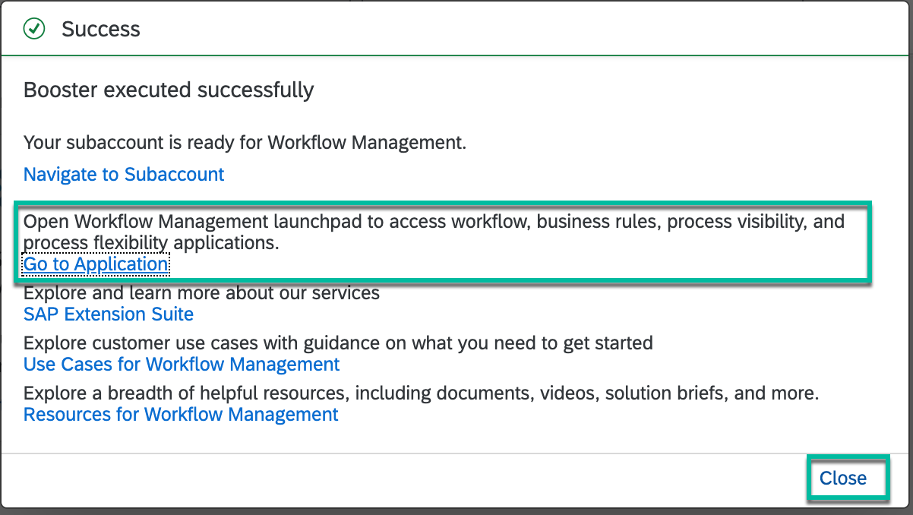

## Details
### You will learn
  - How to enable and configure workflow, business rules, process visibility and process flexibility capabilities

**SAP Workflow Management** is a an offering that helps you:

-	Digitize structured processes with workflows and decision logic.
-	Flexibly extend and adapt business processes running in your packaged applications.
-	Manage process variants and decision logic.
- Monitor end-to-end process metrics in real time.

By combining workflows, business rules, process visibility, live process content packages and process flexibility into a single unified offering, the service helps you increase enterprise efficiency and agility.

User can use Workflow, Business Rules, Process Visibility and Process Flexibility services of SAP  Workflow Management to accelerate automation, simplify extensions and enhance development efficiency.

[Explore More](https://www.sap.com/products/cloud-platform/capabilities/enterprise-extensions.html)

---

[ACCORDION-BEGIN [Step 1: ](Open trial account)]
1. In your web browser, open the [SAP BTP Trial cockpit](https://cockpit.hanatrial.ondemand.com/).

2. Navigate to the trial global account by clicking **Enter Your Trial Account**.

    !

    >If this is your first time accessing your trial account, you'll have to configure your account by choosing a region (*select the region closest to you*). Your user profile will be set up for you automatically.  

    >Wait till your account is set up and ready to go. Your global account, your subaccount, your organization, and your space are launched. This may take a couple of minutes.

    >Choose **Continue**.

    >

[DONE]
[ACCORDION-END]

[ACCORDION-BEGIN [Step 1: ](Set up your account using Booster)]
You will use the **Boosters** to automatically set up the workflow, business rules, process visibility and process flexibility capabilities in your account.

1. From your global account page, choose the **Boosters** from left-hand navigation. Among the available options, click **Start** of **Set up account for Workflow Management**.

    !

2. Automated onboarding will be started with pre-configured steps.

    > It will take 4-5 minutes to complete the entire setup.

    !

    - Wait until you see the success popup window once the booster completes successfully.

    - Click on the **Go to Application** to open Workflow Management Launchpad.

        !

        > This is the Workflow Management Launchpad which gives you the access to all the workflow, business rules, process visibility and process flexibility applications.

        >!

    - **Close** the **Success** popup.  

    > This automatic setup will do the following:

    > - Add Business Rules, Workflow, Process Visibility and Workflow Management entitlements in your account.

    > - Enable **Workflow Management** subscription.

    > - Create service instance for each of Business Rules, Workflow, Process Visibility and Workflow Management services.

    > - Create destinations with name `BUSINESS_RULES`, `BUSINESSRULES_APIHUB` and `WM_CF_SPACE_PROVIDER`. These destinations will be used while integrating business rules with workflow, importing business rules project from API Hub and importing live process content from process hub respectively.

    > - Add all the needed Workflow Management roles collections to your user.

These steps complete the setup of the workflow management services in your trial account. In the next tutorial, you will access the sample content of these different services, set them up in your account and then run to get an integrated experience.

[VALIDATE_1]
[ACCORDION-END]

Give us 55 seconds of your time to help us improve

