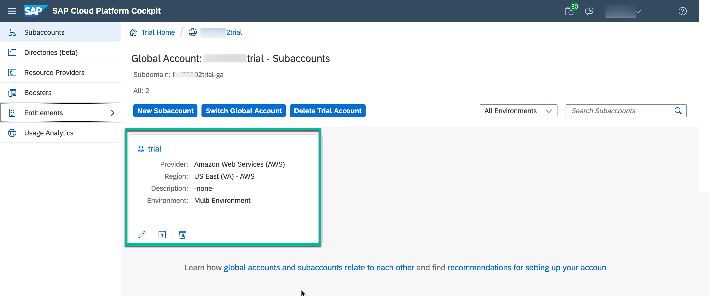
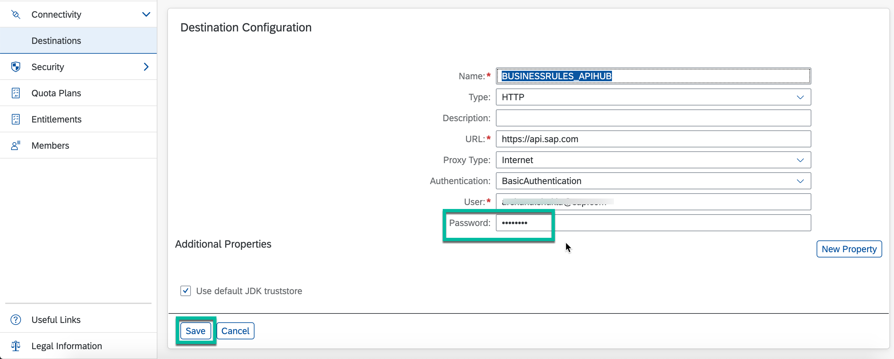
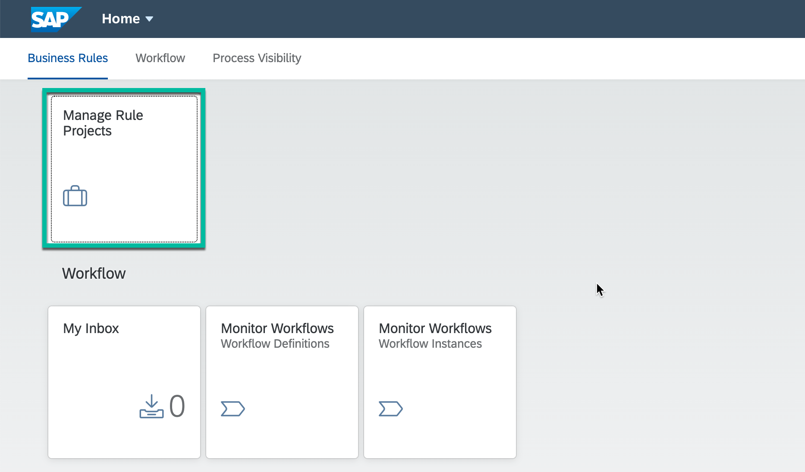
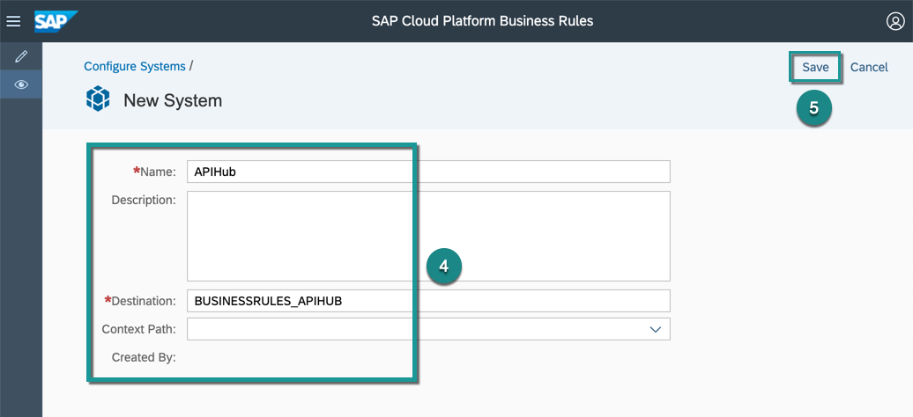
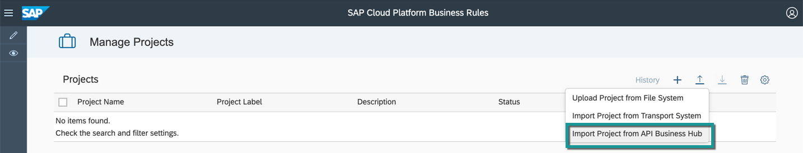
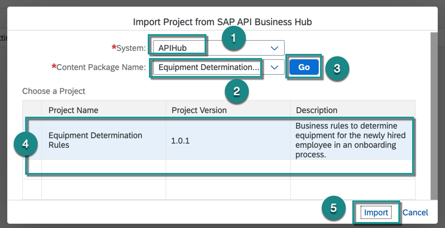
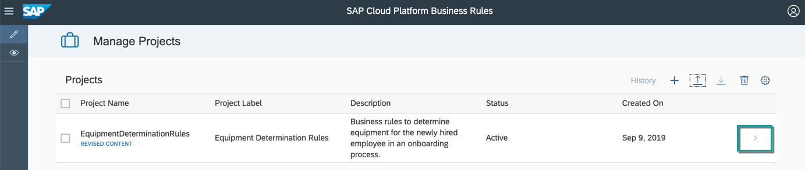
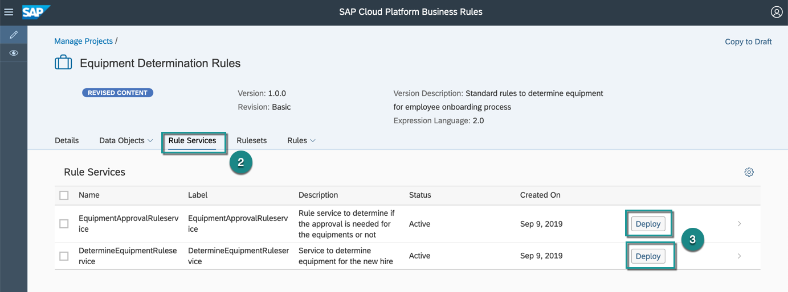
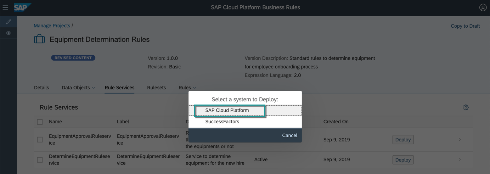

## Details
### You will learn
- How to quickly set up and deploy business rules in your account

**Business Rules** is a capability of **SAP Cloud Platform Workflow Management**, which enables business users and application developers to automate their decisions and enhance their decision-making experience. It offers a simplified Fiori-based rule authoring tool and a central rule repository with various deployment options to different platforms.

In this tutorial, you will learn how to import and manage rules to identify the list of equipment to be provisioned for the newly hired employee based on their role and work location Business Rules.

---

[ACCORDION-BEGIN [Step 1: ](Configure destination)]

The sample business rule used in this scenario is published in API Business Hub. `BUSINESSRULES_APIHUB` destination is used in Manage Rule Projects  application to import business rules from API Business Hub. This destination is already created in the previous set up tutorial, and now you will configure the destination for the password.

1. From your global account page, choose the `trial` tile to access your subaccount.

    !

2. Click **Connectivity | Destinations** from the left-hand navigation and search for the destination with name `BUSINESSRULES_APIHUB`

    

3. In **Destination Configuration** section, click **Edit** and enter your cloud platform trial user password:

    > Ensure that the user whose credentials (username and password) are entered in the destination **does not have Two Factor Authentication enabled**.

    

    - **Save** the destination.

[DONE]
[ACCORDION-END]

[ACCORDION-BEGIN [Step 2: ](Configure a system)]

To import the business rules project from API Business Hub, you need to configure a system which points to the API Hub destination and then use this system to import the project.

1. In your web browser, open the Workflow Management application and click the **Manage Rule Projects** tile..

    >You got the workflow management application link in the last step of the setup tutorial. The link would be like:  

    > `https://<subdomain>.cockpit.workflowmanagement.cfapps.<eu10 or us10>.hana.ondemand.com/cp.portal/site#Shell-home`

    

2. Open **Configure Systems**.

3. Click **+** to add a system.

    

4. Enter the following details:

    |  Field Name     | Value
    |  :------------- | :-------------
    |  Name           | `APIHub`
    |  Destination    | `BUSINESSRULES_APIHUB` or the name of the destination you created in the setup tutorial

5. **Save** the system configuration.

    

[DONE]
[ACCORDION-END]

[ACCORDION-BEGIN [Step 3: ](Import business rules)]

1. Click **Design** icon, click on the **Import** to select **Import Project from API Business API Hub**.

    !

2. In the popup, do the following:
    - In the **System** field, select `APIHub` or the name you entered while configuring the system.
    - From the options shown in the **Content Package Name** dropdown, choose `Equipment Determination Business Rules`.
    - Choose **Go**.
    - Select the latest version of the project named `Equipment Determination Rules`.  
    - Choose **Import**.

    

3. You will see the business rules project imported and in **Active** status.

    

[DONE]
[ACCORDION-END]

[ACCORDION-BEGIN [Step 5: ](Deploy business rules)]

1. Select the business rules project to navigate into the project.

    

2. Switch to the **Rule Services** tab.

3. Click **Deploy** to deploy rule services `DetermineEquipmentRuleservice` and `EquipmentApprovalRuleservice`.

    

4. Select the **SAP Cloud Platform** system.

    

5. Wait for the deployment to complete. You will get a popup message once the deployment is successful.

> Only deployed business rules can be consumed via APIs published in API Business Hub.

[VALIDATE_6]
[ACCORDION-END]

---
