# Configure Business Rules, Workflow and Process Visibility
<!-- description --> Configure workflow, business rules and process visibility to automate processes and decisions, and achieve operational insights into employee onboarding process

## You will learn
  - How to import and manage rules using Business Rules
  - How to import, build and deploy a sample workflow from SAP Business Application Studio
  - How to create and activate a visibility scenario using Process Visibility

## Intro
**Workflow** helps to digitalize workflows and quickly orchestrate tasks that span people, applications, and organizations. You can enhance productivity by automating and tracking coordinated, account-able tasks – including approvals, order fulfillment, or time-sensitive partner collaboration.

**Business Rules** enables business users and application developers to automate their decisions and enhance their decision-making experience. It offers a simplified Fiori-based rule authoring tool and a central rule repository with various deployment options to different platforms.

**Process Visibility** provides visibility into processes that run in the cloud, on-premise, or in hybrid environments. Process visibility works on events. SAP or non-SAP applications (cloud or on-premise) push events into Process Visibility. These events are persisted, processed and enhanced to form end-to-end process instances with insights, which are visualized by business users in their process workspace. The insights enable business users to identify process bottlenecks, track process performance, and operational issues and act on them.

---
In this section, you will set up business rules to identify the list of equipment to be provisioned for the newly hired employee based on their role and work location using **Business Rules capability of SAP Workflow Management**.

### Configure API Business Hub destination

The sample business rule used in this scenario is published in API Business Hub. `BUSINESSRULES_APIHUB` destination is used in Manage Rule Projects  application to import business rules from API Business Hub. This destination is already created in the previous set up tutorial, and now you will configure the destination for the password.

1. From your global account page, choose the `trial` tile to access your subaccount.

    <!-- border -->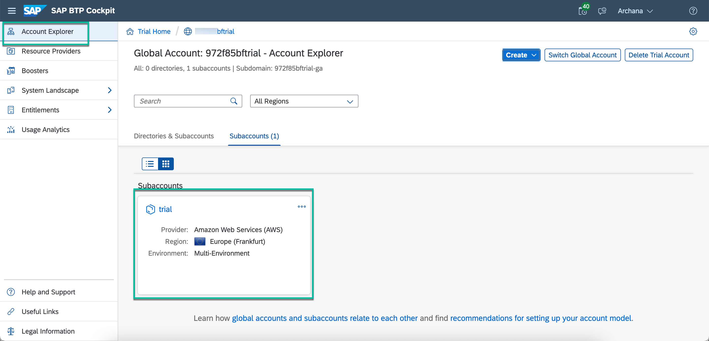

2. Click **Connectivity | Destinations** from the left-hand navigation and search for the destination with name `BUSINESSRULES_APIHUB`

    <!-- border -->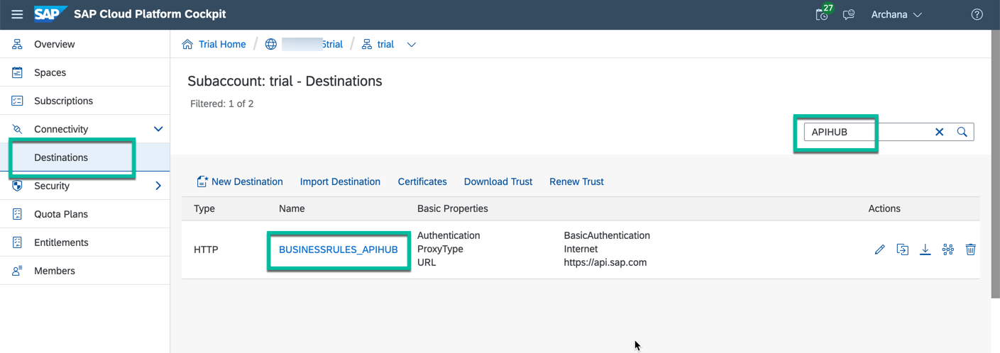

3. In **Destination Configuration** section, click **Edit** and enter your cloud platform trial user password:

    > Ensure that the user whose credentials (username and password) are entered in the destination **does not have Two Factor Authentication enabled**.

    <!-- border -->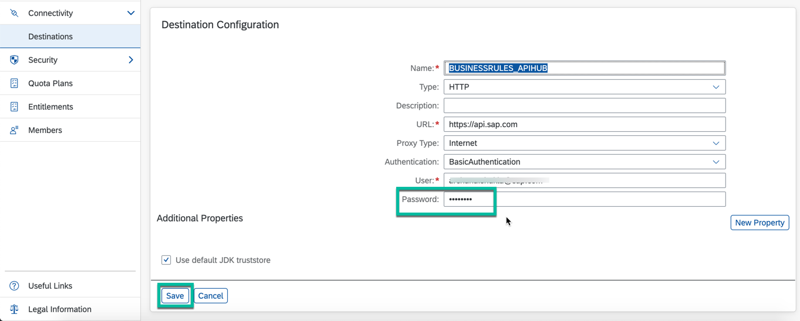

    - **Save** the destination.

### Configure system in business rules

To import the business rules project from API Business Hub, you need to configure a system which points to the API Hub destination and then use this system to import the project.

1. In your web browser, open the Workflow Management application and click the **Manage Rule Projects** tile..

    >You got the workflow management application link in the last step of the set up tutorial. The link would be like:  

    > `https://<subdomain>.cockpit.workflowmanagement.cfapps.<eu10 or us10>.hana.ondemand.com/cp.portal/site#Shell-home`

    <!-- border -->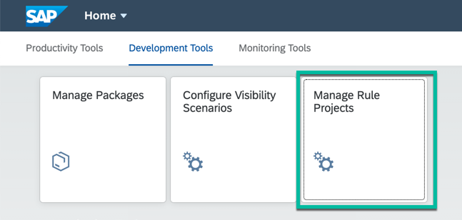

2. Open **Configure Systems**.

3. Click **+** to add a system.

    <!-- border -->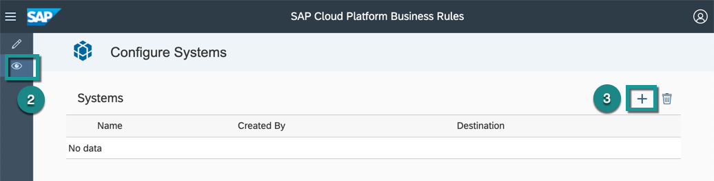

4. Enter the following details:

    |  Field Name     | Value
    |  :------------- | :-------------
    |  Name           | `APIHub`
    |  Destination    | `BUSINESSRULES_APIHUB` or the name of the destination you created in the set up tutorial

5. **Save** the system configuration.

    <!-- border -->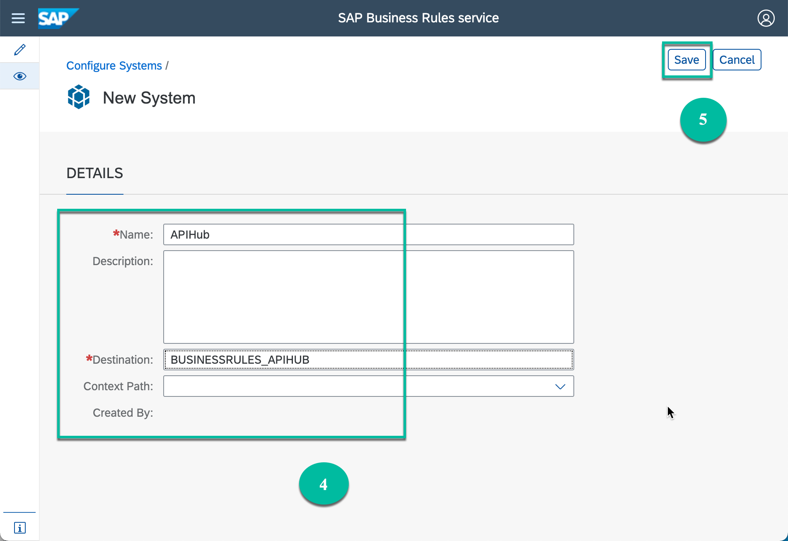

### Import business rules from API Business Hub

1. Click **Design** icon, click **Import** to select **Import Project from API Business Hub**.

    <!-- border -->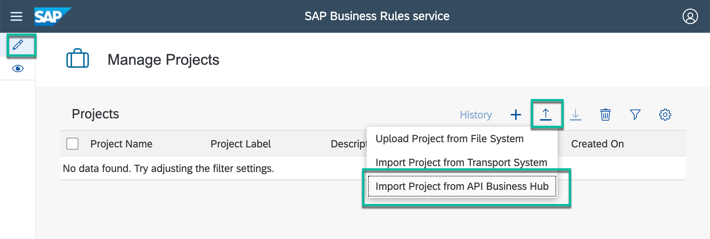

2. In the popup, do the following:
    - In the **System** field, select `APIHub` or the name you entered while configuring the system.
    - From the options shown in the **Content Package Name** dropdown, choose `Equipment Determination Business Rules`.
    - Choose **Go**.
    - Select the latest version of the project named `Equipment Determination Rules`.  
    - Choose **Import**.

    <!-- border -->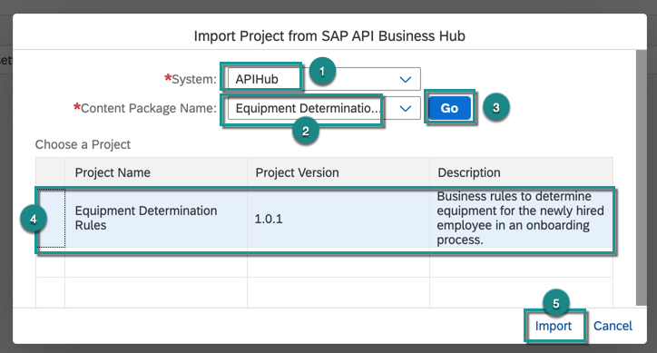

    > If you get Bad Gateway Error error, then check the username and password you have used in `BUSINESSRULES_APIHUB` destination. If your user is 2-Factor-Authentication enabled, then the password will be password+passcode. This passcode will expire in a minute.
    > If you do not have 2-Factor-Authentication enabled and still get this error, then check if you are member of SAP API Business Hub. Log in to api.sap.com and try importing again.

3. You will see the business rules project imported and in **Active** status.

    <!-- border -->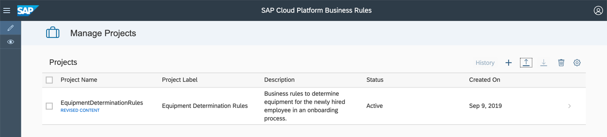

### Deploy business rules

1. Select the business rules project to navigate into the project.

    <!-- border -->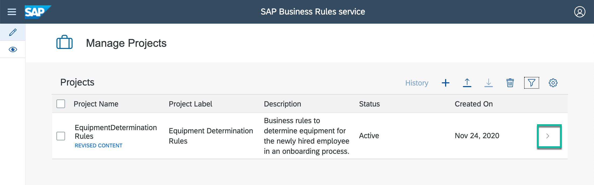

2. Switch to the **Rule Services** tab.

3. Click **Deploy** to deploy rule services `DetermineEquipmentRuleservice` and `EquipmentApprovalRuleservice`.

    <!-- border -->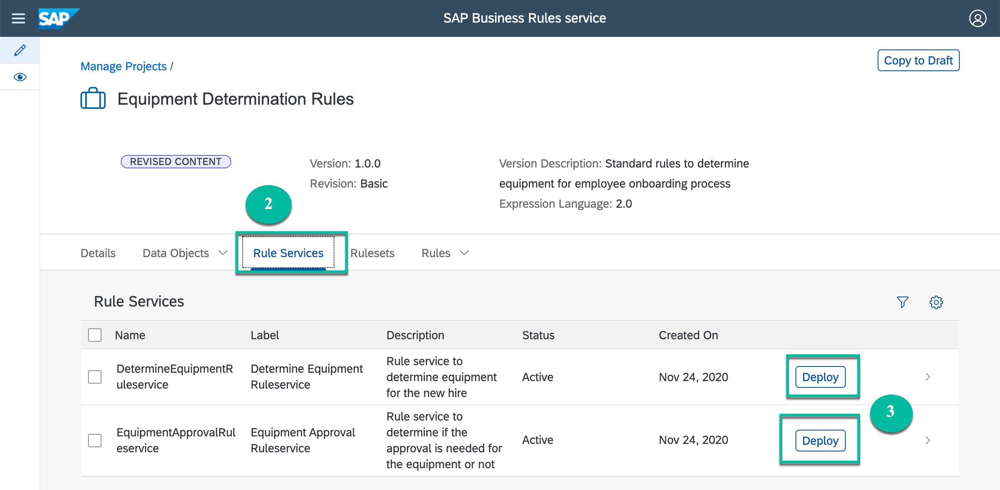

4. Select the **Cloud Runtime** option.

    <!-- border -->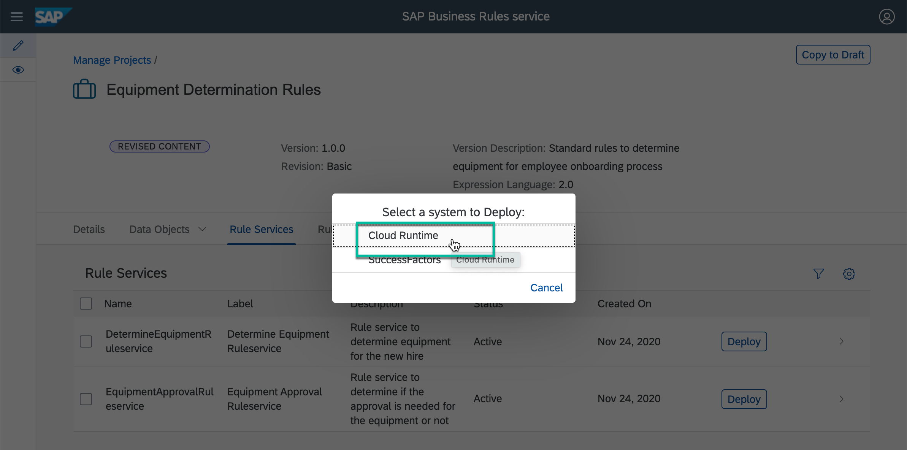

5. Wait for the deployment to complete. You will get a popup message once the deployment is successful.

> Only deployed business rules can be consumed via APIs published in API Business Hub.

In this section, you will use **SAP Business Application Studio** to import, configure, build and deploy workflow to get workplace approval from manager for newly hired employee.

### Download and import workflow sample application

1. Download **cf-onboarding-sample.zip**  project from [GitHub](https://github.com/SAP-samples/cloud-workflow-samples/blob/master/cf-onboarding-sample/resources/cf-onboarding-sample.zip) in your local file system and extract the files.

    <!-- border -->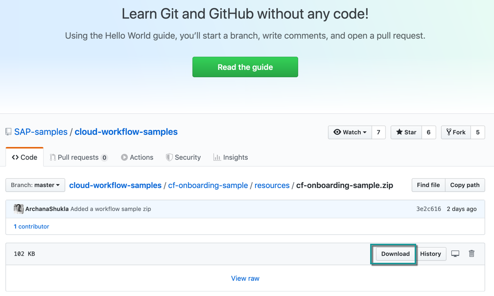

2. Open [SAP BTP Trial Homepage](https://cockpit.hanatrial.ondemand.com/cockpit/#/home/trial) and choose **SAP Business Application Studio**.

    <!-- border -->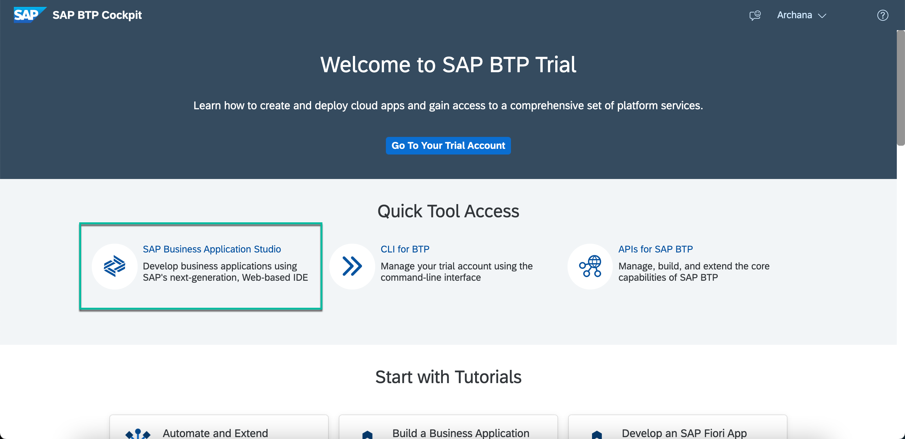

    > If you get the privacy statement screen, then click `Ok` to accept it.

3. Click on the **Dev Space** to go into the workspace and from **File** menu choose **Open Workspace**

    > - If you do not have any dev-space, then click **Create Dev Space**. In the New Dev Space page, enter any dev space name, select **SAP Fiori** kind and **Workflow Management** extension. Finally click **Create Dev Space** to create a space in your business application studio.
    <!-- border -->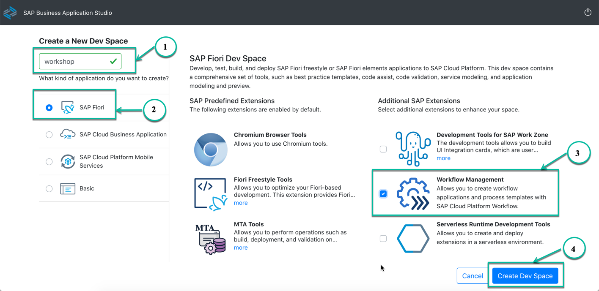

    > - If you have a dev-space but **Workflow Management** extension is not added then click on **Edit** button, select **Workflow Management** and **Save Changes**.
    <!-- border -->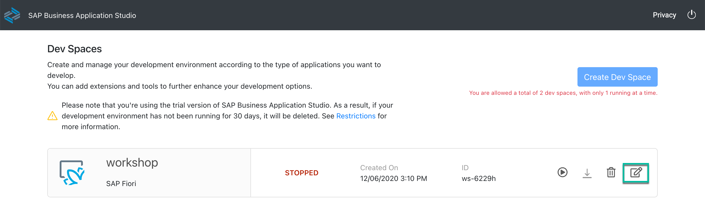
    <!-- border -->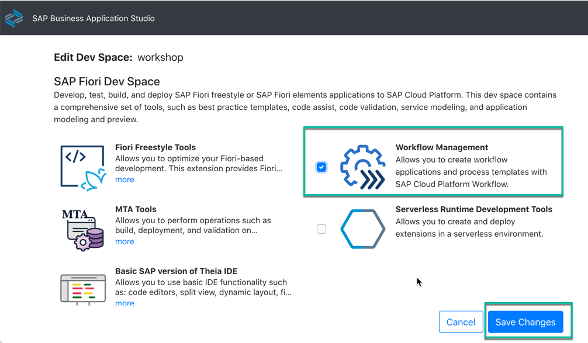

    > - If you have the dev-space with Workflow Management extension added, and the dev-space status is STOPPED then click on the run button to start the space.
    <!-- border -->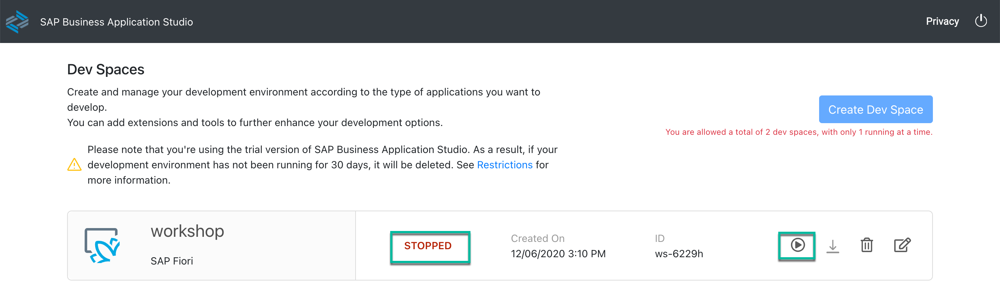

    <!-- border -->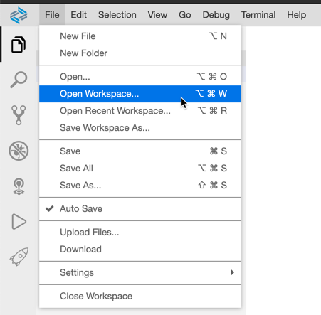

    > Some File menu options might not appear as they are not relevant if you are opening the workspace for the first time without any projects.

4. Drag and drop the extracted **cf-onboarding-sample** project in the dialog and click **Open**.

    <!-- border -->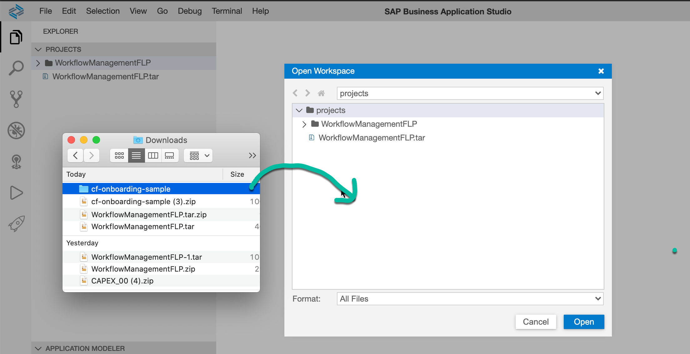

    <!-- border -->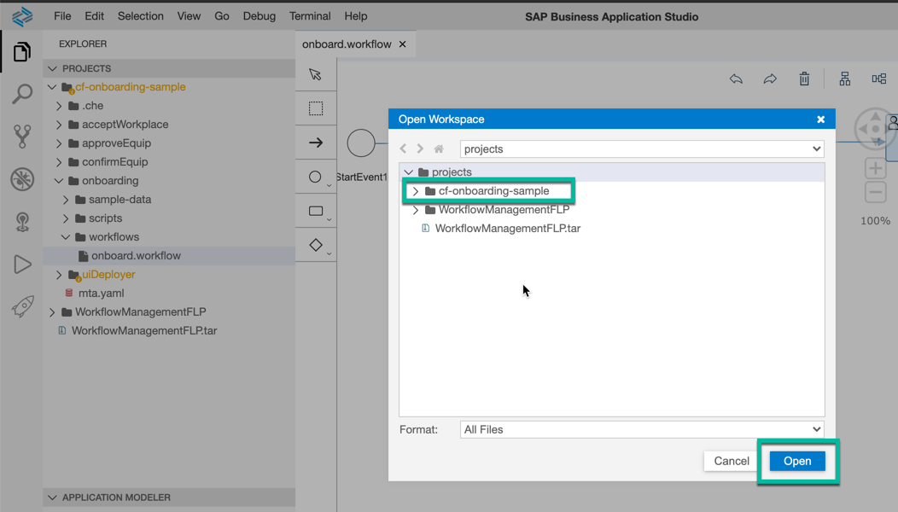

5. You will see that the **cf-onboarding-sample** project is imported into your workspace.

    <!-- border -->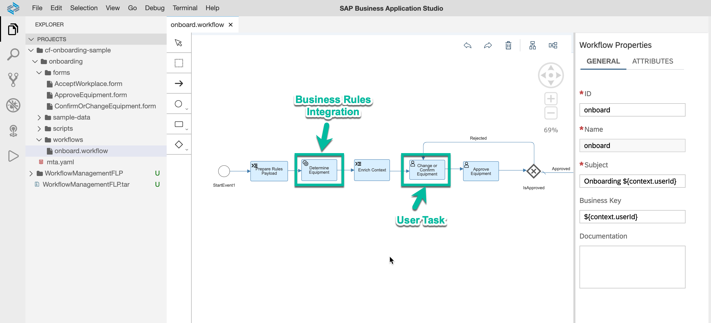

    > This sample workflow has:

    > - **Business Rules** integrated into it. You can find the integration as part of service task with name `Determine Equipment`.

    > - **User Tasks** for confirmation of the equipment selected via business rules and for the approval of equipment. You can find these user tasks with the names `Confirm and Change Equipment`, `Approve Equipment` and `Accept Workplace` respectively.  The user interface associated with these user tasks has been built using Workflow Form and you can find these under **forms** folder in the same multi target application.

### Build and deploy workflow

1. Right-click the **mta.yml** file inside the **cf-onboarding-sample** project, and choose the **Build MTA** option.

    <!-- border -->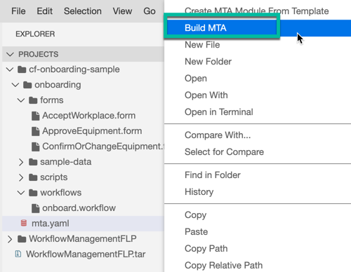

2. Once the build is completed successfully, right-click on the **`mta_archives` | `sample-onboarding.mta_0.0.1.mtar`** file and choose **Deploy MTA Archives**.

    <!-- border -->

    >The deployment will fail if you have not logged in to the trial account. Click Function F1 to open the login wizard and follow the wizard to log in to your trial account.
    <!-- border -->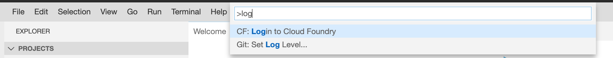

    >A successful deployment message will be shown in the terminal once the deployment has completed successfully.
    <!-- border -->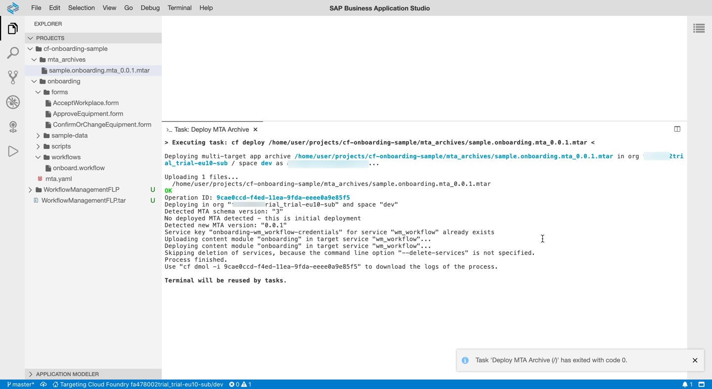

In this section, you will create and activate a process visibility scenario to provide an out-of-box visibility into workflow using **Process Visibility capability of SAP Workflow Management**. The resulting insight helps you to track the process and focus on key business milestones so that you can actively improve the processes.

### Create visibility scenario

1. In your web browser, open the Workflow Management application and choose **Configure Visibility Scenarios**.

    >You should have gotten the workflow management application link in the last step of the set up tutorial. The link should be like this:

    >`https://<subdomain>.cockpit.workflowmanagement.cfapps.<eu10 or us10>.hana.ondemand.com/cp.portal/site#Shell-home`

    <!-- border -->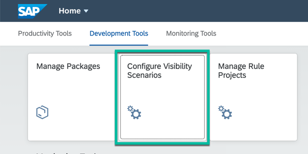

2. To create a new visibility scenario, choose **+**.

    <!-- border -->

3. Enter **Name** as `Employee Onboarding`, any **Description** of your choice, and click **Create**.

    <!-- border -->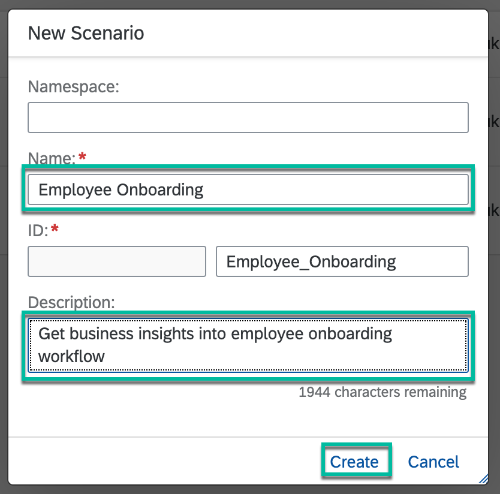

    The business scenario will be created with **Draft** status.

    <!-- border -->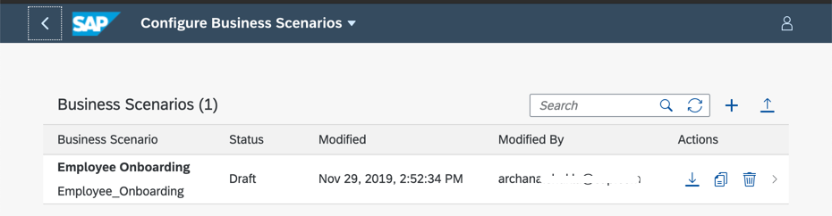

### Add workflow to visibility scenario

1. Navigate into the newly created scenario and click the **Processes** tab, choose **+** and select **Add Workflow** to add workflow to business scenario.

    <!-- border -->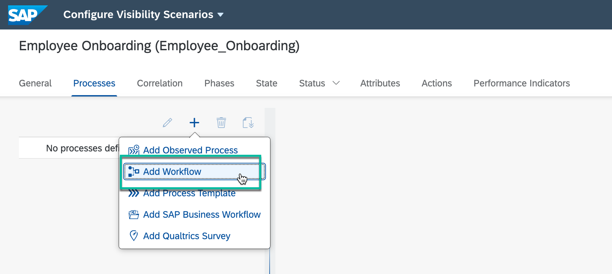

2. Select the `onboard` workflow from the choices.

    <!-- border -->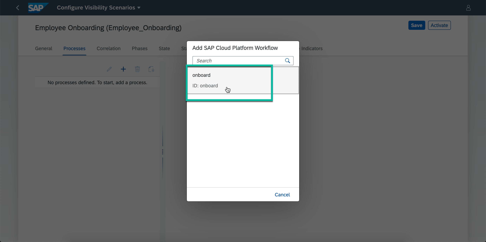

    >*onboard* is the sample workflow that you have deployed in the previous tutorial.

3. The workflow is added and all the needed **Events** and **Context** are  imported as well.

    <!-- border -->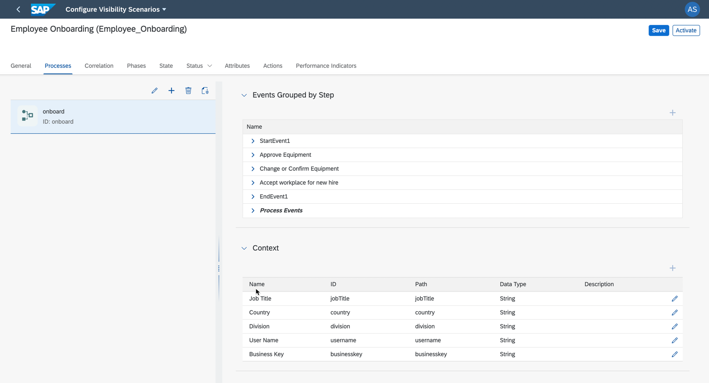

### Configure visibility scenario

1. Switch to the **General** tab.

2. In the **Instances Label** field, enter `Onboardings` and in the **Instance Label** field enter `Onboarding`.

    <!-- border -->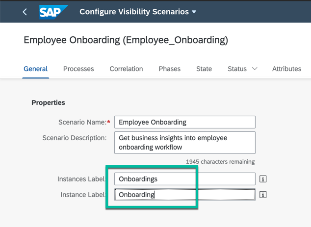

3. Switch to the **Status** tab.

4. In the **Sub-Status** section, select **At Risk** and choose **+**.

    <!-- border -->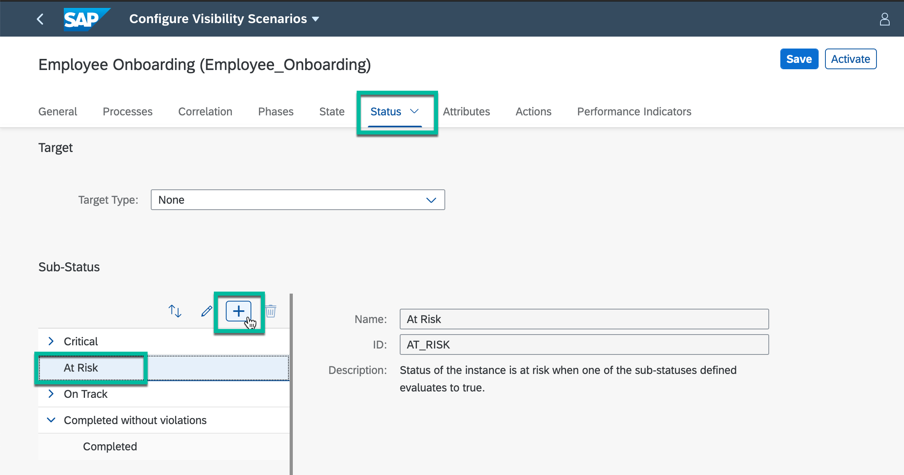

5. In the **Name** field for the risk status, enter **`Approval Pending`** or anything of your choice and click **`Ok`**.

    <!-- border -->

6. In the properties, enter the following:

    |  Field Name      | Value
    |  :-------------- | :-------------
    |  **Expression Type** | `Event A occurred and not Event B`
    |  **Event A**         | `Approve Equipment Created`
    |  **Event B**         | `Approve Equipment Completed`

    <!-- border -->

### Activate visibility scenario

To activate the business scenario, choose **Activate**.

>Activate operation saves and activates the scenario. Only an activated business scenario can be consumed.

<!-- border -->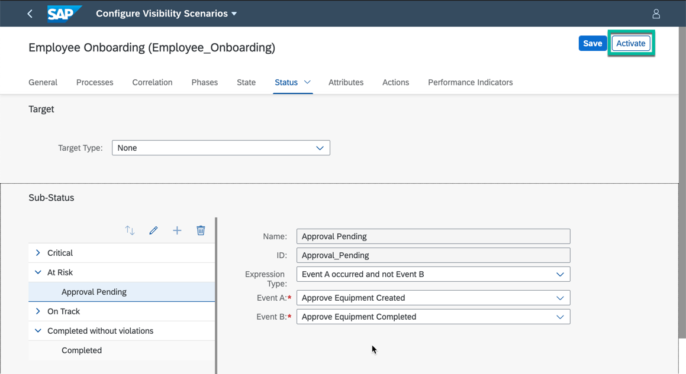

---
